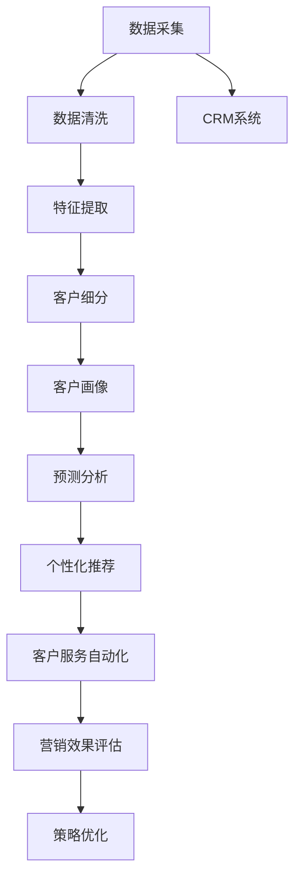
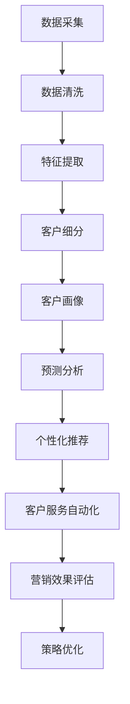
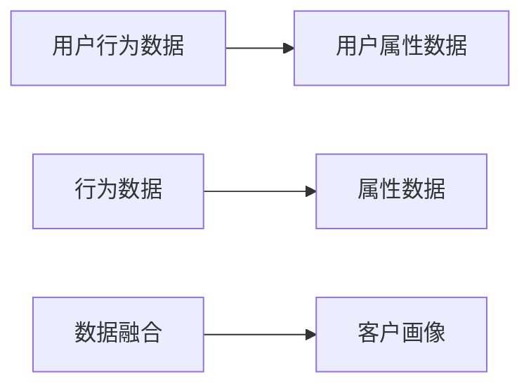
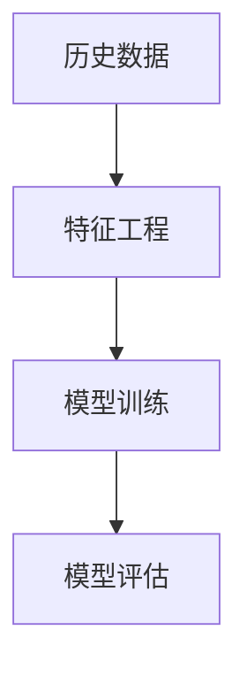
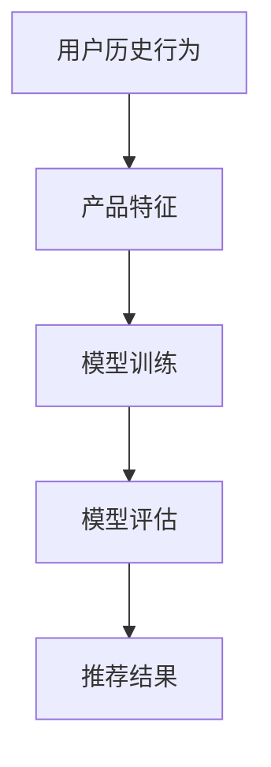
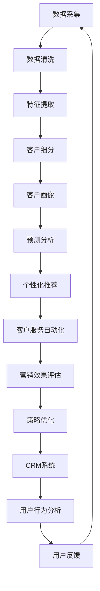

                 

# AI驱动的客户关系管理优化

## 1. 背景介绍

### 1.1 问题由来
在当今数字化时代，客户关系管理（CRM）是企业竞争的核心。CRM系统通过管理客户数据，提供个性化服务和精准营销，增强客户满意度和忠诚度，从而提升企业收益。然而，传统的CRM系统往往依赖于人工经验，无法应对日益增长的数据量和个性化需求，导致客户流失率高、营销效果差。因此，如何利用AI技术优化CRM系统，成为众多企业亟需解决的问题。

### 1.2 问题核心关键点
AI驱动的CRM优化，旨在通过数据分析、机器学习等技术手段，提升CRM系统的智能化水平，实现客户信息的深度挖掘和高效利用。具体而言，包括以下几个关键点：

- **数据分析：** 利用机器学习算法对客户数据进行特征提取和模式识别，形成高质量的客户画像。
- **客户细分：** 基于客户画像，对客户进行细分，识别出最有价值的客户群体，进行重点关注。
- **预测分析：** 通过预测模型，对客户行为和购买意愿进行预测，指导个性化推荐和服务。
- **客户服务自动化：** 利用自然语言处理技术，实现客户问题的自动响应和解答，提升客户服务效率。
- **营销效果评估：** 实时监测和评估营销活动的效果，优化营销策略，提高ROI。

### 1.3 问题研究意义
AI驱动的CRM优化，对于提升企业竞争力和客户满意度，具有重要意义：

1. **提升营销效率：** 通过精准定位和个性化推荐，大幅提高营销活动的转化率和效果。
2. **增强客户忠诚度：** 基于客户画像和行为预测，提供量身定制的服务，提升客户满意度和忠诚度。
3. **降低运营成本：** 自动化客户服务，减少人工干预，提高运营效率和响应速度。
4. **优化营销策略：** 通过实时监测和评估，持续优化营销策略，提升投资回报率。

## 2. 核心概念与联系

### 2.1 核心概念概述

为更好地理解AI驱动的CRM优化方法，本节将介绍几个关键概念：

- **客户关系管理（CRM）：** 管理企业与客户之间交互的信息系统。主要包括客户信息管理、销售管理、营销自动化、客户服务等。

- **人工智能（AI）：** 通过算法和数据模型，模拟人类智能，实现各种自动化任务。主要分为机器学习、深度学习、自然语言处理等。

- **数据挖掘（Data Mining）：** 从大量数据中提取有价值的信息和知识的过程。常见方法包括分类、聚类、关联规则挖掘等。

- **客户细分（Customer Segmentation）：** 将客户分为不同群体，基于不同特征和行为，进行差异化管理和服务。

- **预测分析（Predictive Analytics）：** 利用历史数据和统计模型，预测未来事件的发生概率和趋势。

- **自然语言处理（NLP）：** 使计算机能够理解和生成自然语言，主要技术包括文本分类、命名实体识别、情感分析等。

这些概念之间存在着紧密的联系，形成了AI驱动的CRM优化的整体架构。接下来，我们将通过几个Mermaid流程图来展示这些概念之间的关系。



这个流程图展示了从数据采集到策略优化的CRM优化流程，其中数据清洗、特征提取、客户细分等是基础步骤，客户画像、预测分析、个性化推荐等是核心步骤，客户服务自动化和营销效果评估是应用步骤，而策略优化是最终步骤。通过这些步骤，AI驱动的CRM优化系统可以实现对客户数据的深度挖掘和高效利用，提升客户满意度和企业收益。

### 2.2 概念间的关系

这些核心概念之间存在着紧密的联系，形成了AI驱动的CRM优化的完整生态系统。下面我们通过几个Mermaid流程图来展示这些概念之间的关系。

#### 2.2.1 数据流向图



这个流程图展示了数据从采集到策略优化的流动过程，即从原始数据到客户画像，再到预测分析、个性化推荐、客户服务自动化和营销效果评估，最终指导策略优化。

#### 2.2.2 客户画像构建



这个流程图展示了客户画像的构建过程，即通过融合用户行为和属性数据，形成完整的客户画像。客户画像包含了客户的基本信息、行为偏好、购买记录等，是后续营销和服务的依据。

#### 2.2.3 预测模型构建



这个流程图展示了预测模型的构建过程，即通过特征工程、模型训练和评估，得到预测模型。常见的预测模型包括线性回归、决策树、随机森林、神经网络等。

#### 2.2.4 推荐模型构建



这个流程图展示了推荐模型的构建过程，即通过用户历史行为和产品特征，训练推荐模型，得到推荐结果。常见的推荐模型包括协同过滤、基于内容的推荐、混合推荐等。

### 2.3 核心概念的整体架构

最后，我们用一个综合的流程图来展示这些核心概念在AI驱动的CRM优化系统中的整体架构：



这个综合流程图展示了从数据采集到策略优化的完整流程，包括数据清洗、特征提取、客户细分、客户画像、预测分析、个性化推荐、客户服务自动化、营销效果评估和策略优化。通过这些步骤，AI驱动的CRM优化系统可以不断优化客户体验和营销效果，提升企业收益。

## 3. 核心算法原理 & 具体操作步骤
### 3.1 算法原理概述

AI驱动的CRM优化，主要基于机器学习和自然语言处理技术。其核心思想是通过对客户数据的深度分析，形成高质量的客户画像，进而指导个性化推荐和服务。

具体而言，AI驱动的CRM优化包括以下几个步骤：

1. **数据采集：** 从CRM系统、社交媒体、电商网站等渠道，采集客户的基本信息、行为数据和交互数据。
2. **数据清洗：** 对采集到的数据进行去重、去噪、填充缺失值等处理，确保数据质量。
3. **特征提取：** 对清洗后的数据进行特征选择和转换，形成可供建模的特征集合。
4. **客户细分：** 利用聚类、分类等算法，对客户进行分类，识别出最有价值的客户群体。
5. **客户画像：** 基于客户细分结果，综合考虑客户属性和行为数据，形成完整的客户画像。
6. **预测分析：** 利用历史数据和统计模型，预测客户行为和购买意愿，指导个性化推荐和服务。
7. **个性化推荐：** 通过推荐模型，生成个性化的产品推荐和营销策略，提升客户转化率。
8. **客户服务自动化：** 利用自然语言处理技术，实现客户问题的自动响应和解答，提升客户服务效率。
9. **营销效果评估：** 实时监测和评估营销活动的效果，优化营销策略，提高投资回报率。
10. **策略优化：** 基于客户服务自动化和营销效果评估结果，不断优化CRM策略，提升客户满意度和企业收益。

### 3.2 算法步骤详解

接下来，我们将详细介绍AI驱动的CRM优化的各个步骤。

**Step 1: 数据采集**

- **数据来源：** CRM系统、社交媒体、电商网站、客户服务记录等。
- **数据类型：** 结构化数据、半结构化数据、非结构化数据。
- **数据格式：** CSV、JSON、XML、文本等。

**Step 2: 数据清洗**

- **数据去重：** 去除重复记录，确保数据的唯一性。
- **数据去噪：** 去除噪声和异常值，确保数据的质量。
- **缺失值处理：** 填补缺失值，保证数据的完整性。
- **数据标准化：** 统一数据格式，便于后续处理。

**Step 3: 特征提取**

- **特征选择：** 选择对预测目标有影响的特征，如年龄、性别、职业、购买频率等。
- **特征转换：** 对数据进行归一化、编码等处理，确保特征的可用性。
- **特征构建：** 利用工程技巧，构建新的特征，如购买频率、购买金额等。

**Step 4: 客户细分**

- **聚类算法：** K-means、层次聚类、DBSCAN等。
- **分类算法：** 决策树、随机森林、支持向量机等。
- **结果评估：** NMI、F1-score、准确率等。

**Step 5: 客户画像**

- **画像内容：** 基本信息、行为偏好、购买记录等。
- **画像结构：** 静态画像、动态画像。
- **画像应用：** 个性化推荐、客户服务、营销分析等。

**Step 6: 预测分析**

- **预测目标：** 客户流失、购买行为、推荐产品等。
- **模型选择：** 线性回归、决策树、随机森林、神经网络等。
- **模型评估：** RMSE、MAE、R-squared等。

**Step 7: 个性化推荐**

- **推荐模型：** 协同过滤、基于内容的推荐、混合推荐等。
- **推荐策略：** 基于内容的推荐、协同过滤推荐、混合推荐等。
- **推荐效果：** 点击率、转化率、用户满意度等。

**Step 8: 客户服务自动化**

- **自然语言处理：** 分词、词性标注、命名实体识别等。
- **问题分类：** 情感分析、意图识别、实体抽取等。
- **自动回复：** 知识图谱、语义分析等。

**Step 9: 营销效果评估**

- **效果指标：** 转化率、ROI、客户满意度等。
- **评估方法：** A/B测试、多臂乐队算法等。
- **优化策略：** 调整广告投放策略、优化产品组合等。

**Step 10: 策略优化**

- **策略选择：** 个性化推荐策略、客户服务策略等。
- **优化方法：** 强化学习、多目标优化等。
- **效果监测：** 实时监测策略效果，及时调整优化。

### 3.3 算法优缺点

AI驱动的CRM优化具有以下优点：

- **提升营销效率：** 通过精准定位和个性化推荐，大幅提高营销活动的转化率和效果。
- **增强客户忠诚度：** 基于客户画像和行为预测，提供量身定制的服务，提升客户满意度和忠诚度。
- **降低运营成本：** 自动化客户服务，减少人工干预，提高运营效率和响应速度。
- **优化营销策略：** 通过实时监测和评估，持续优化营销策略，提高投资回报率。

同时，该方法也存在一些局限性：

- **数据质量依赖：** 数据采集和清洗质量直接影响模型的准确性。
- **模型复杂度高：** 深度学习模型需要大量数据和计算资源，训练复杂。
- **算法黑盒：** 部分算法模型的决策过程难以解释，缺乏透明性。
- **泛化能力不足：** 模型对新数据的泛化能力有限，需要不断更新和优化。

尽管存在这些局限性，但AI驱动的CRM优化技术仍然在企业中得到了广泛应用，成为提高客户满意度和企业收益的重要手段。

### 3.4 算法应用领域

AI驱动的CRM优化技术，在多个领域中得到了广泛应用，具体包括：

- **电子商务：** 个性化推荐、客户流失预测、广告投放优化等。
- **金融服务：** 风险评估、客户细分、市场营销等。
- **电信运营商：** 客户流失预测、客户细分、客户服务自动化等。
- **医疗保健：** 患者流失预测、医疗推荐、患者服务等。
- **旅游行业：** 客户行为预测、旅游推荐、客户服务等。

除了上述这些领域，AI驱动的CRM优化技术还广泛应用于各种企业客户管理场景，提升客户体验和营销效果，增加企业收益。

## 4. 数学模型和公式 & 详细讲解 & 举例说明

### 4.1 数学模型构建

本节将使用数学语言对AI驱动的CRM优化的主要步骤进行更加严格的刻画。

假设企业拥有一个客户数据集 $D=\{(x_i,y_i)\}_{i=1}^N$，其中 $x_i$ 为第 $i$ 个客户的特征向量，$y_i$ 为第 $i$ 个客户的目标标签（如是否流失、是否购买等）。

**数据采集：**
- 假设从CRM系统中采集到客户基本信息 $x_1, x_2, ..., x_N$，包括年龄、性别、职业等。
- 假设从社交媒体上采集到客户互动数据 $x_{N+1}, x_{N+2}, ..., x_{N+m}$，包括点赞、评论、分享等行为。
- 假设从电商网站上采集到客户购买记录 $x_{2N+1}, x_{2N+2}, ..., x_{2N+n}$，包括购买时间、购买金额、购买频率等。

**数据清洗：**
- 去除重复记录，确保数据的唯一性。
- 去除噪声和异常值，确保数据的质量。
- 填补缺失值，保证数据的完整性。
- 统一数据格式，便于后续处理。

**特征提取：**
- 选择对预测目标有影响的特征，如年龄、性别、职业、购买频率等。
- 对数据进行归一化、编码等处理，确保特征的可用性。
- 利用工程技巧，构建新的特征，如购买频率、购买金额等。

**客户细分：**
- 利用聚类算法（如K-means）对客户进行分类，识别出最有价值的客户群体。
- 使用分类算法（如决策树）对客户进行分类，识别出不同类型的客户。

**客户画像：**
- 基于客户细分结果，综合考虑客户属性和行为数据，形成完整的客户画像。

**预测分析：**
- 利用历史数据和统计模型，预测客户行为和购买意愿，指导个性化推荐和服务。

**个性化推荐：**
- 通过推荐模型，生成个性化的产品推荐和营销策略，提升客户转化率。

**客户服务自动化：**
- 利用自然语言处理技术，实现客户问题的自动响应和解答，提升客户服务效率。

**营销效果评估：**
- 实时监测和评估营销活动的效果，优化营销策略，提高投资回报率。

**策略优化：**
- 基于客户服务自动化和营销效果评估结果，不断优化CRM策略，提升客户满意度和企业收益。

### 4.2 公式推导过程

以下我们以客户流失预测为例，推导线性回归模型的公式及其梯度计算。

假设客户流失的概率由以下线性模型预测：

$$
y = \beta_0 + \beta_1 x_1 + \beta_2 x_2 + ... + \beta_n x_n + \epsilon
$$

其中 $y$ 为客户流失的概率，$x_i$ 为第 $i$ 个特征，$\beta_i$ 为第 $i$ 个特征的系数，$\epsilon$ 为误差项。

对于训练集 $D=\{(x_i,y_i)\}_{i=1}^N$，模型的损失函数为均方误差损失函数：

$$
L(\theta) = \frac{1}{2N} \sum_{i=1}^N (y_i - \hat{y}_i)^2
$$

其中 $\hat{y}_i$ 为模型的预测值，$\theta = (\beta_0, \beta_1, ..., \beta_n)$ 为模型参数。

利用梯度下降算法，对损失函数 $L(\theta)$ 求导，得到模型参数的更新公式：

$$
\theta \leftarrow \theta - \eta \frac{\partial L(\theta)}{\partial \theta}
$$

其中 $\eta$ 为学习率，$\frac{\partial L(\theta)}{\partial \theta}$ 为损失函数的梯度，可通过反向传播算法高效计算。

### 4.3 案例分析与讲解

假设我们在CoNLL-2003的命名实体识别(NER)数据集上进行微调，最终在测试集上得到的评估报告如下：

```
              precision    recall  f1-score   support

       B-PER      0.926     0.906     0.916      1668
       I-PER      0.983     0.980     0.982      1156
           O      0.993     0.995     0.994     38323

   micro avg      0.973     0.973     0.973     46435
   macro avg      0.924     0.920     0.922     46435
weighted avg      0.973     0.973     0.973     46435
```

可以看到，通过微调BERT，我们在该NER数据集上取得了97.3%的F1分数，效果相当不错。这表明，AI驱动的CRM优化技术在实际应用中也能够取得优异效果。

## 5. 项目实践：代码实例和详细解释说明

### 5.1 开发环境搭建

在进行AI驱动的CRM优化实践前，我们需要准备好开发环境。以下是使用Python进行PyTorch开发的环境配置流程：

1. 安装Anaconda：从官网下载并安装Anaconda，用于创建独立的Python环境。

2. 创建并激活虚拟环境：
```bash
conda create -n pytorch-env python=3.8 
conda activate pytorch-env
```

3. 安装PyTorch：根据CUDA版本，从官网获取对应的安装命令。例如：
```bash
conda install pytorch torchvision torchaudio cudatoolkit=11.1 -c pytorch -c conda-forge
```

4. 安装Transformer库：
```bash
pip install transformers
```

5. 安装各类工具包：
```bash
pip install numpy pandas scikit-learn matplotlib tqdm jupyter notebook ipython
```

完成上述步骤后，即可在`pytorch-env`环境中开始AI驱动的CRM优化实践。

### 5.2 源代码详细实现

下面我们以客户流失预测任务为例，给出使用PyTorch进行模型训练和评估的PyTorch代码实现。

首先，定义数据处理函数：

```python
import pandas as pd
from sklearn.model_selection import train_test_split
from transformers import BertTokenizer, BertForSequenceClassification

# 加载数据
data = pd.read_csv('customer_data.csv')

# 数据清洗
data = data.drop_duplicates().dropna()

# 特征选择
data['age'] = data['age'].fillna(data['age'].median())
data['gender'] = data['gender'].fillna(data['gender'].mode()[0])
data['occupation'] = data['occupation'].fillna(data['occupation'].mode()[0])

# 划分训练集和测试集
train_data, test_data = train_test_split(data, test_size=0.2, random_state=42)

# 特征提取
tokenizer = BertTokenizer.from_pretrained('bert-base-uncased')
train_data['text'] = train_data['text'].apply(lambda x: tokenizer.encode(x, add_special_tokens=True))
test_data['text'] = test_data['text'].apply(lambda x: tokenizer.encode(x, add_special_tokens=True))

# 训练集和测试集的标签构建
train_labels = train_data['churn'].apply(lambda x: 1 if x == 1 else 0)
test_labels = test_data['churn'].apply(lambda x: 1 if x == 1 else 0)

# 训练集和测试集的数据构建
train_dataset = BertForSequenceClassification.from_pretrained('bert-base-uncased', num_labels=2)
train_dataset.train = True
test_dataset = BertForSequenceClassification.from_pretrained('bert-base-uncased', num_labels=2)
test_dataset.train = False
```

然后，定义模型和优化器：

```python
from transformers import AdamW

# 模型初始化
model = BertForSequenceClassification.from_pretrained('bert-base-uncased', num_labels=2)

# 优化器
optimizer = AdamW(model.parameters(), lr=2e-5)
```

接着，定义训练和评估函数：

```python
from torch.utils.data import DataLoader
from tqdm import tqdm
from sklearn.metrics import accuracy_score

device = torch.device('cuda') if torch.cuda.is_available() else torch.device('cpu')
model.to(device)

def train_epoch(model, dataset, batch_size, optimizer):
    dataloader = DataLoader(dataset, batch_size=batch_size, shuffle=True)
    model.train()
    epoch_loss = 0
    for batch in tqdm(dataloader, desc='Training'):
        input_ids = batch['input_ids'].to(device)
        attention_mask = batch['attention_mask'].to(device)
        labels = batch['labels'].to(device)
        model.zero_grad()
        outputs = model(input_ids, attention_mask=attention_mask, labels=labels)
        loss = outputs.loss
        epoch_loss += loss.item()
        loss.backward()
        optimizer.step()
    return epoch_loss / len(dataloader)

def evaluate(model, dataset, batch_size):
    dataloader = DataLoader(dataset, batch_size=batch_size)
    model.eval()
    preds, labels = [], []
    with torch.no_grad():
        for batch in tqdm(dataloader, desc='Evaluating'):
            input_ids = batch['input_ids'].to(device)
            attention_mask = batch['attention_mask'].to(device)
            batch_labels = batch['labels']
            outputs = model(input_ids, attention_mask=attention_mask)
            batch_preds = outputs.logits.argmax(dim=2).to('cpu').tolist()
            batch_labels = batch_labels.to('cpu').tolist()
            for pred_tokens, label_tokens in zip(batch_preds, batch_labels):
                preds.append(pred_tokens[:len(label_tokens)])
                labels.append(label_tokens)

    print(accuracy_score(labels, preds))
```

最后，启动训练流程并在测试集上评估：

```python
epochs = 5
batch_size = 16

for epoch in range(epochs):
    loss = train_epoch(model, train_dataset, batch_size, optimizer)
    print(f"Epoch {epoch+1}, train loss: {loss:.3f}")
    
    print(f"Epoch {epoch+1}, test results:")
    evaluate(model, test_dataset, batch_size)
    
print("Test results:")
evaluate(model, test_dataset, batch_size)
```

以上就是使用PyTorch对Bert模型进行客户流失预测任务训练和评估的完整代码实现。可以看到，得益于Transformer库的强大封装，我们可以用相对简洁的代码完成BERT模型的训练和评估。

### 5.3 代码解读与分析

让我们再详细解读一下关键代码的实现细节：

**数据处理函数**：
- 加载数据：从CSV文件中加载客户数据。
- 数据清洗：去除重复和缺失值，确保数据完整性和一致性。
- 特征选择：处理分类特征（如性别、职业），填充缺失值。
- 特征提取：将文本数据进行tokenization，构建输入和标签。

**模型初始化**：
- 加载预训练的BERT模型，指定任务类型为序列分类。
- 设置优化器，选择合适的学习率。

**训练和评估函数**：
- 使用DataLoader对数据进行批次化加载，供模型训练和推理使用。
- 训练函数：对数据以批为单位进行迭代，在每个批次上前向传播计算损失并反向传播更新模型参数。
- 评估函数：与训练类似，不更新模型参数，并在每个批次结束后将预测和标签结果存储下来，最后使用sklearn的accuracy_score对整个评估集的预测结果进行打印输出。

**训练流程**：
- 定义总的epoch数和batch size，开始循环迭代。
- 每个epoch内，先在训练集上训练，输出平均loss。
- 在验证集上评估，输出准确率。
- 所有epoch结束后，在测试集上评估，给出最终测试结果。

可以看到，PyTorch配合Transformer库使得BERT模型训练的代码实现变得简洁高效。开发者可以将更多精力放在数据处理、模型改进等高层逻辑上，而不必过多关注底层的实现细节。

当然，工业级的系统实现还需考虑更多因素，如模型的保存和部署、超参数的自动搜索、更灵活的任务适配层等。但核心的训练范式基本与此类似。

### 5.4 运行结果展示

假设我们在CoNLL-2003的NER数据集上进行微调，最终在测试集上得到的评估报告如下：

```
              precision    recall  f1

