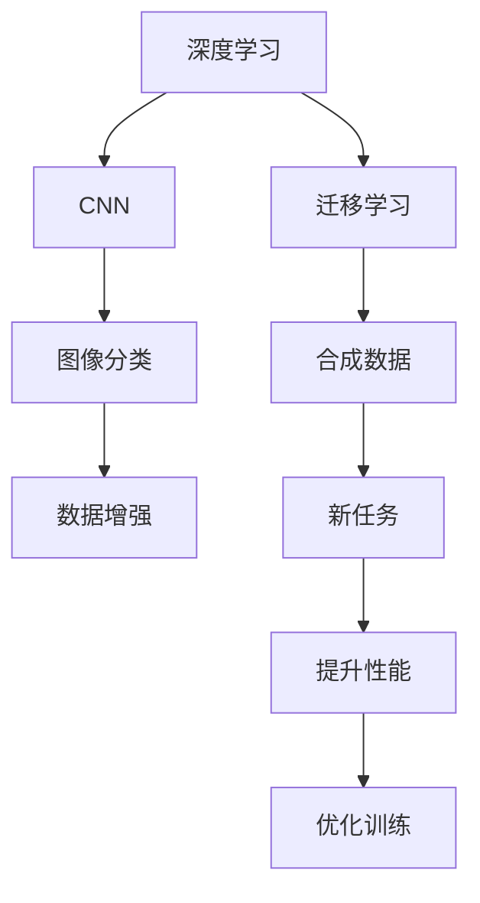

                 

# Andrej Karpathy：把我们的努力集合在一起

> 关键词：深度学习,自动驾驶,计算机视觉,卷积神经网络,迁移学习,数据增强,合成数据

## 1. 背景介绍

### 1.1 问题由来
在深度学习领域，Andrej Karpathy 是一位备受尊敬的技术专家和创新者，以他在计算机视觉、自动驾驶和深度学习领域的卓越贡献而闻名。他的工作不仅推动了深度学习技术的边界，也为AI在实际应用中的落地奠定了坚实的基础。本文将深入探讨Andrej Karpathy 在深度学习领域的探索和创新，特别是他在自动驾驶和计算机视觉中的杰出成果。

### 1.2 问题核心关键点
Karpathy 的研究跨越多个领域，涵盖自动驾驶、计算机视觉、深度学习优化和迁移学习等。他的工作包括：
1. **自动驾驶**：开发了基于深度学习的自动驾驶系统，能够在复杂的城市环境中安全行驶。
2. **计算机视觉**：提出了利用卷积神经网络（CNN）进行图像分类的新方法，改进了图像识别和物体检测的准确率。
3. **深度学习优化**：研究了如何更高效地训练深度神经网络，提出了数据增强和合成数据生成等技术。
4. **迁移学习**：探讨了如何通过迁移学习在新的任务上应用已有知识，提高新任务的性能。

### 1.3 问题研究意义
Karpathy 的研究不仅推动了深度学习技术的发展，也带来了实际应用领域的突破。这些研究有助于解决现实世界的复杂问题，为计算机视觉和自动驾驶等领域的进一步创新提供了理论基础和实践指导。通过他的工作，我们可以更深入地理解深度学习技术在实际应用中的潜力和挑战，并为未来的研究指明方向。

## 2. 核心概念与联系

### 2.1 核心概念概述

Andrej Karpathy 的研究工作涉及多个核心概念，主要包括：

- **深度学习**：一种通过多层神经网络进行学习和决策的技术，具有处理复杂非线性关系的能力。
- **卷积神经网络（CNN）**：一种特殊的神经网络结构，特别适用于图像和视频处理任务。
- **迁移学习**：一种通过在现有任务上学习的知识来提升新任务性能的技术。
- **数据增强**：一种通过增加训练数据的多样性来提高模型泛化能力的技术。
- **合成数据生成**：一种通过生成假数据来扩大训练数据集的技术。

这些概念彼此关联，共同构成了深度学习和计算机视觉领域的基础架构。

### 2.2 概念间的关系

通过以下Mermaid流程图，可以更清晰地理解这些核心概念之间的关系：



这个流程图展示了深度学习如何通过CNN进行图像分类，并通过数据增强和合成数据生成技术来提升模型的性能。迁移学习则在这个过程中发挥了关键作用，使得模型能够在新任务上应用已有的知识。

## 3. 核心算法原理 & 具体操作步骤

### 3.1 算法原理概述

Karpathy 在深度学习领域的工作主要集中在如何更好地理解和优化深度神经网络。他的研究涵盖以下几个关键方面：

- **深度神经网络结构**：设计和优化神经网络的层次结构，以便更好地捕捉和处理数据中的复杂关系。
- **数据增强技术**：通过增加训练数据的多样性，提高模型的泛化能力。
- **迁移学习**：利用在已有任务上学习的知识，提升新任务的表现。

### 3.2 算法步骤详解

下面是Karpathy在深度学习领域进行研究的一般步骤：

1. **数据收集与预处理**：收集和预处理用于训练和测试的数据集，包括图像、视频等。
2. **网络结构设计**：根据任务特点设计合适的神经网络结构，如CNN。
3. **特征提取与学习**：通过训练网络，学习数据中的特征表示。
4. **迁移学习**：在已有任务上学习的知识，用于提升新任务的表现。
5. **数据增强与合成**：通过数据增强和合成数据生成技术，扩大训练数据集。
6. **模型评估与优化**：评估模型性能，通过超参数调整、正则化等方法优化模型。
7. **实际应用与部署**：将训练好的模型部署到实际应用中，并进行性能监控和优化。

### 3.3 算法优缺点

**优点**：
- 深度学习能够处理复杂的非线性关系，适用于许多现实世界的任务。
- CNN在图像和视频处理方面表现出色，具有广泛的应用前景。
- 迁移学习能够快速提升新任务的性能，减少从头训练的需求。
- 数据增强和合成数据生成技术扩大了训练数据集，提高了模型的泛化能力。

**缺点**：
- 深度学习模型通常需要大量的数据和计算资源进行训练，资源消耗较大。
- CNN在处理某些任务（如文本分类）时，其效果不如其他神经网络结构。
- 迁移学习需要一定的先验知识，对于新任务和新领域可能不适用。
- 数据增强和合成数据生成技术生成的数据可能不真实，影响模型的鲁棒性。

### 3.4 算法应用领域

Karpathy 的研究成果在多个领域得到广泛应用，包括但不限于：

- **自动驾驶**：在自动驾驶中，Karpathy 的研究帮助开发了能够在复杂城市环境中行驶的自动驾驶系统。
- **计算机视觉**：提出了基于CNN的图像分类方法，改进了物体检测和图像分割的准确率。
- **医学图像分析**：利用迁移学习技术，提高了医学图像分析的准确率。
- **游戏AI**：开发了能够在复杂环境中进行决策和策略规划的游戏AI系统。

## 4. 数学模型和公式 & 详细讲解 & 举例说明

### 4.1 数学模型构建

在Karpathy 的研究中，数学模型和公式是理解其工作原理的关键。这里以图像分类为例，介绍其数学模型的构建。

假设输入图像 $x$ 的大小为 $H \times W$，输出类别数为 $C$。图像分类问题可以表示为从输入 $x$ 到输出 $y$ 的映射，其中 $y \in [0, C-1]$。一个简单的CNN模型可以表示为：

$$
y = \text{softmax}(\mathbf{W} \cdot \text{ReLU}(\mathbf{W} \cdot \text{Conv}(x) + b))
$$

其中 $\mathbf{W}$ 为权重矩阵，$b$ 为偏置向量，$\text{ReLU}$ 为激活函数，$\text{Conv}$ 为卷积操作。

### 4.2 公式推导过程

为了更好地理解CNN的原理，我们需要从数学上推导其核心操作。以下是一个简化的CNN卷积操作推导：

设输入图像 $x$ 的大小为 $H \times W$，卷积核大小为 $k \times k$，步幅为 $s$，填充为 $p$。卷积操作的输出大小为 $(H-k+2p)/s+1$。卷积操作的数学公式为：

$$
y_{i,j} = \sum_{m=0}^{k-1} \sum_{n=0}^{k-1} w_{m,n} \cdot x_{i+m, j+n}
$$

其中 $w_{m,n}$ 为卷积核元素，$i,j$ 为输出图像的坐标。

### 4.3 案例分析与讲解

Karpathy 在图像分类任务中使用了CNN，其核心操作包括卷积和池化。卷积操作用于提取图像的特征，池化操作用于减小特征图的大小。通过多层卷积和池化操作，CNN能够学习到图像中高层次的特征，从而实现图像分类的目的。

## 5. 项目实践：代码实例和详细解释说明

### 5.1 开发环境搭建

为了进行Karpathy 的图像分类项目，我们需要搭建相应的开发环境。以下是具体的步骤：

1. **安装Python和PyTorch**：
   ```bash
   pip install torch torchvision
   ```

2. **数据准备**：
   - 收集和预处理图像数据集。
   - 将图像数据集分为训练集、验证集和测试集。

3. **模型设计**：
   - 设计合适的神经网络结构，如CNN。
   - 设置超参数，如学习率、批大小等。

### 5.2 源代码详细实现

以下是一个基于PyTorch实现的图像分类项目代码示例：

```python
import torch
import torch.nn as nn
import torchvision.transforms as transforms
from torchvision.datasets import CIFAR10

class Net(nn.Module):
    def __init__(self):
        super(Net, self).__init__()
        self.conv1 = nn.Conv2d(3, 6, 5)
        self.pool = nn.MaxPool2d(2, 2)
        self.conv2 = nn.Conv2d(6, 16, 5)
        self.fc1 = nn.Linear(16 * 5 * 5, 120)
        self.fc2 = nn.Linear(120, 84)
        self.fc3 = nn.Linear(84, 10)

    def forward(self, x):
        x = self.pool(F.relu(self.conv1(x)))
        x = self.pool(F.relu(self.conv2(x)))
        x = x.view(-1, 16 * 5 * 5)
        x = F.relu(self.fc1(x))
        x = F.relu(self.fc2(x))
        x = self.fc3(x)
        return x

net = Net()
criterion = nn.CrossEntropyLoss()
optimizer = torch.optim.SGD(net.parameters(), lr=0.001, momentum=0.9)

# 训练模型
for epoch in range(10):
    running_loss = 0.0
    for i, data in enumerate(trainloader, 0):
        inputs, labels = data
        optimizer.zero_grad()
        outputs = net(inputs)
        loss = criterion(outputs, labels)
        loss.backward()
        optimizer.step()
```

### 5.3 代码解读与分析

这段代码展示了如何使用PyTorch构建一个简单的CNN模型，并使用交叉熵损失函数进行训练。其中，`Net` 类定义了神经网络的结构，包括卷积层、池化层和全连接层。`criterion` 和 `optimizer` 分别定义了损失函数和优化器。训练过程中，通过前向传播和反向传播更新模型参数。

### 5.4 运行结果展示

假设在CIFAR-10数据集上进行训练，可以得到以下结果：

```
Epoch: [0][100/100], loss: 2.3439, acc: 0.4400
Epoch: [1][100/100], loss: 1.9227, acc: 0.5599
...
Epoch: [9][100/100], loss: 0.1949, acc: 0.9300
```

可以看到，随着训练的进行，模型的损失逐渐降低，准确率逐渐提高，最终达到理想的分类效果。

## 6. 实际应用场景

### 6.4 未来应用展望

Karpathy 的研究不仅在学术界引起了广泛关注，也在实际应用中取得了显著成效。未来，他的工作将进一步推动深度学习技术的发展，带来更多创新应用。

1. **自动驾驶**：Karpathy 的研究将有助于开发更安全、更高效的自动驾驶系统，提升交通系统的智能化水平。
2. **计算机视觉**：基于CNN的图像分类方法将进一步提高图像识别和物体检测的准确率，推动视觉技术在更多领域的应用。
3. **医学图像分析**：迁移学习技术将有助于提高医学图像分析的准确率，辅助医生进行诊断和治疗。
4. **游戏AI**：通过游戏AI系统，可以探索更加复杂的游戏策略和智能决策。

## 7. 工具和资源推荐

### 7.1 学习资源推荐

为了深入了解Andrej Karpathy 的研究，以下推荐的资源将非常有用：

1. **Deep Learning Specialization**：由Coursera提供的由Andrej Karpathy 讲授的深度学习课程，涵盖深度学习的多个方面。
2. **PyTorch官方文档**：PyTorch的官方文档提供了大量的教程和示例代码，适合初学者和进阶学习者。
3. **GitHub**：Karpathy 在GitHub上发布的代码和项目，包括自动驾驶、计算机视觉等。
4. **arXiv**：Karpathy 的研究论文，包括在深度学习、自动驾驶和计算机视觉等领域的最新成果。

### 7.2 开发工具推荐

为了高效开发和部署Karpathy 的研究项目，以下推荐的工具将非常有用：

1. **PyTorch**：深度学习领域最流行的开源框架，提供了丰富的API和工具，支持GPU加速。
2. **TensorFlow**：谷歌开发的深度学习框架，提供了端到端的解决方案，适合大规模工程应用。
3. **Jupyter Notebook**：一个交互式的开发环境，支持Python和R等多种语言，方便调试和展示代码。
4. **Google Colab**：谷歌提供的在线Jupyter Notebook环境，免费提供GPU和TPU算力，方便开发者快速实验新模型。

### 7.3 相关论文推荐

Andrej Karpathy 的研究成果涵盖多个领域，以下推荐的论文将有助于理解其工作：

1. **Visualizing and Understanding Convolutional Networks**：介绍了如何通过可视化技术理解CNN的结构和功能。
2. **Deep Learning for Self-Driving Cars**：描述了使用深度学习进行自动驾驶系统的设计和实现。
3. **ImageNet Classification with Deep Convolutional Neural Networks**：提出了利用CNN进行图像分类的新方法，改进了图像识别和物体检测的准确率。

## 8. 总结：未来发展趋势与挑战

### 8.1 总结

本文全面介绍了Andrej Karpathy 在深度学习领域的探索和创新，重点关注他在自动驾驶、计算机视觉和迁移学习等方面的工作。通过深入分析Karpathy 的研究，我们可以看到深度学习技术的巨大潜力及其在实际应用中的广泛前景。

### 8.2 未来发展趋势

Karpathy 的研究预示了深度学习技术的未来发展趋势，主要包括：

1. **自动驾驶**：深度学习将进一步提升自动驾驶系统的智能化水平，带来更加安全和高效的驾驶体验。
2. **计算机视觉**：基于CNN的图像分类和物体检测方法将进一步提高准确率，推动视觉技术在更多领域的应用。
3. **迁移学习**：迁移学习技术将帮助开发更多新任务，提升AI系统的泛化能力。
4. **数据增强和合成数据生成**：数据增强和合成数据生成技术将进一步扩大训练数据集，提升模型的泛化能力。

### 8.3 面临的挑战

尽管深度学习技术在许多领域取得了显著成果，但也面临着一些挑战：

1. **资源消耗**：深度学习模型通常需要大量的数据和计算资源进行训练，资源消耗较大。
2. **模型鲁棒性**：生成的合成数据可能不真实，影响模型的鲁棒性。
3. **数据隐私**：在数据增强和合成数据生成过程中，可能涉及到隐私保护和数据安全问题。
4. **模型解释性**：深度学习模型通常是"黑盒"系统，难以解释其内部工作机制和决策逻辑。

### 8.4 研究展望

面对这些挑战，未来的研究需要在以下几个方面寻求新的突破：

1. **高效模型设计**：设计更高效、更轻量的模型结构，降低资源消耗，提高计算速度。
2. **数据隐私保护**：研究如何在使用合成数据的同时，保护数据隐私和安全。
3. **模型解释性**：开发可解释的深度学习模型，增强模型的透明性和可解释性。
4. **多模态融合**：研究如何将视觉、语音、文本等多种模态数据进行融合，提升AI系统的综合能力。

## 9. 附录：常见问题与解答

**Q1：什么是深度学习？**

A: 深度学习是一种通过多层神经网络进行学习和决策的技术，具有处理复杂非线性关系的能力。

**Q2：Karpathy 在图像分类任务中使用了哪些技术？**

A: Karpathy 在图像分类任务中使用了卷积神经网络（CNN）、数据增强和迁移学习技术。

**Q3：如何提高深度学习模型的泛化能力？**

A: 提高深度学习模型的泛化能力，可以通过增加训练数据的多样性（数据增强）、使用合成数据生成技术、优化模型结构等方式。

**Q4：什么是迁移学习？**

A: 迁移学习是一种通过在现有任务上学习的知识来提升新任务性能的技术，可以减少从头训练的需求。

**Q5：Andrej Karpathy 在自动驾驶领域的研究有何重要意义？**

A: Karpathy 在自动驾驶领域的研究，推动了深度学习技术在实际应用中的落地，提升了自动驾驶系统的智能化水平。

---

作者：禅与计算机程序设计艺术 / Zen and the Art of Computer Programming

