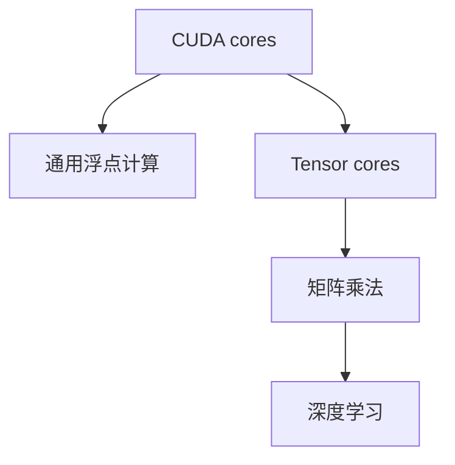
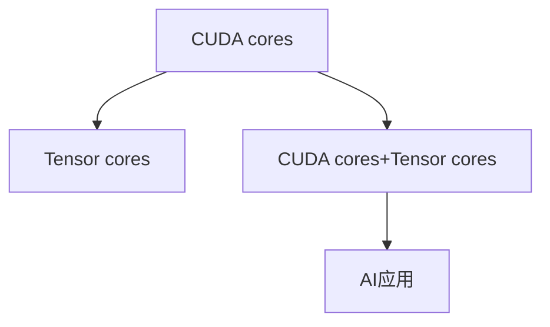

                 

# CUDA Core vs Tensor Core

## 1. 背景介绍

### 1.1 问题由来
随着AI技术的飞速发展，硬件加速已成为提升深度学习模型性能的关键。在众多硬件加速方案中，英伟达的NVIDIA GPU因其卓越的浮点计算性能和吞吐量，被广泛应用在深度学习任务中。然而，随着模型参数量的激增和训练任务复杂度的提升，常规的CUDA cores已无法满足AI应用的需求，Tensor cores的引入则带来了全新的突破。

CUDA cores是英伟达NVIDIA GPU中传统的计算核心，主要用于处理通用的浮点计算任务。相比之下，Tensor cores则是专为深度学习加速设计的专用计算核心，可以并行处理矩阵乘法等大规模线性代数运算，显著提高模型训练速度。

本文旨在深入探讨CUDA Core和Tensor Core的原理与差异，分析其在深度学习应用中的优势和局限，并给出未来发展的方向和建议。

### 1.2 问题核心关键点
CUDA cores与Tensor cores在深度学习中的不同应用，主要体现在计算效率和算法适用性两方面：

1. CUDA cores擅长通用计算，适用于大多数深度学习算法。
2. Tensor cores专门针对矩阵运算加速，适用于具有显著矩阵乘法运算的深度学习任务。
3. CUDA cores支持更广泛的编程模型，而Tensor cores在矩阵乘法计算中具有独特优势。
4. CUDA cores与Tensor cores相结合，可以发挥各自优势，提升AI应用性能。

## 2. 核心概念与联系

### 2.1 核心概念概述

为更好地理解CUDA Core和Tensor Core的差异，本节将介绍几个密切相关的核心概念：

- CUDA cores：NVIDIA GPU中传统的计算核心，主要用于通用浮点计算。
- Tensor cores：NVIDIA GPU中专门用于深度学习计算的核心，支持矩阵乘法等运算。
- 深度学习：基于神经网络的机器学习算法，涉及大规模矩阵运算。
- 矩阵乘法：深度学习中常见的计算密集型操作，用于模型参数更新和前向传播。
- 浮点计算：通用计算中最常见的计算任务，涉及单精度和双精度浮点数运算。

这些概念之间的关系可以通过以下Mermaid流程图来展示：



这个流程图展示了一些关键概念之间的联系：

1. CUDA cores负责通用浮点计算。
2. Tensor cores负责矩阵乘法运算，这是深度学习模型的核心运算之一。
3. 深度学习依赖于大量矩阵乘法，因此Tensor cores具有重要意义。
4. CUDA cores与Tensor cores的结合使用，能够充分发挥各自优势，提升AI应用性能。

### 2.2 概念间的关系

这些核心概念之间存在着紧密的联系，形成了深度学习硬件加速的整体生态系统。下面我们通过几个Mermaid流程图来展示这些概念之间的关系。

#### 2.2.1 深度学习硬件加速


这个流程图展示了深度学习硬件加速的基本流程：

1. 深度学习依赖于矩阵乘法等计算密集型操作。
2. CUDA cores和Tensor cores负责处理这些计算。
3. 通过硬件加速，深度学习模型能够在更短时间内完成训练和推理，提升AI应用性能。

#### 2.2.2 CUDA cores与Tensor cores的融合



这个流程图展示了CUDA cores与Tensor cores结合使用的情况：

1. CUDA cores和Tensor cores在深度学习模型中各司其职，分别负责通用计算和矩阵乘法计算。
2. 结合使用后，AI应用能够充分利用两种硬件核心的优势，提升性能和效率。

#### 2.2.3 硬件加速对深度学习的意义


这个流程图展示了硬件加速对深度学习的意义：

1. 深度学习依赖于大规模矩阵运算，这些运算对计算资源要求较高。
2. CUDA cores和Tensor cores能够显著提升计算效率，缩短训练时间。
3. 硬件加速使得深度学习模型在实际应用中能够快速迭代和部署。

## 3. 核心算法原理 & 具体操作步骤
### 3.1 算法原理概述

深度学习模型的训练和推理过程中，大量涉及矩阵乘法、卷积等计算密集型操作。这些操作的计算复杂度极高，对计算资源的要求较高。CUDA cores和Tensor cores在处理这些计算时各有优劣，其主要区别在于：

1. CUDA cores擅长通用浮点计算，支持单精度和双精度浮点数运算，适用于各种计算密集型任务。
2. Tensor cores专为矩阵乘法运算设计，利用高度并行的GPU架构，可以高效处理大规模矩阵乘法。

因此，在实际应用中，根据任务特点选择适当的硬件核心，可以显著提升计算效率和模型性能。

### 3.2 算法步骤详解

深度学习模型在NVIDIA GPU上训练和推理的流程如下：

1. 数据准备：将输入数据加载到GPU内存，并进行必要的预处理。
2. 模型定义：定义深度学习模型，包括权重、偏置、激活函数等。
3. 损失函数计算：计算模型预测结果与真实标签之间的损失值。
4. 反向传播：通过反向传播算法更新模型参数。
5. 模型推理：使用训练好的模型进行前向传播，输出预测结果。

CUDA cores和Tensor cores在这流程中扮演着不同的角色：

- CUDA cores负责通用计算任务，如模型定义、损失函数计算、激活函数等。
- Tensor cores负责矩阵乘法等特定计算任务，如反向传播中的权重更新。

在实际应用中，CUDA cores与Tensor cores的结合使用可以最大化硬件资源利用率，提升深度学习模型的训练和推理效率。

### 3.3 算法优缺点

CUDA cores和Tensor cores各有优缺点：

#### 3.3.1 CUDA cores的优点

1. 计算通用性高：适用于各种深度学习任务，支持单精度和双精度浮点数运算。
2. 编程模型丰富：支持CUDA等并行编程模型，方便进行复杂的计算优化。
3. 支持更多的API和库：如cuBLAS、cuDNN等，提供丰富的计算库支持。

#### 3.3.2 CUDA cores的缺点

1. 计算效率有限：由于通用计算任务涉及大量分支和条件判断，计算效率不如Tensor cores。
2. 资源占用大：大量通用计算任务会占用GPU内存和带宽，可能影响其他并行任务。

#### 3.3.3 Tensor cores的优点

1. 计算效率高：专为矩阵乘法设计，可以高效处理大规模矩阵运算。
2. 资源利用率高：通过高度并行的GPU架构，可以同时处理多个矩阵乘法计算。
3. 支持动态张量处理：能够根据输入数据的大小自动调整计算量。

#### 3.3.4 Tensor cores的缺点

1. 计算范围有限：仅适用于矩阵乘法等特定计算任务。
2. 编程模型受限：仅支持Tensor核编程模型，计算范围和灵活性受到限制。

## 4. 数学模型和公式 & 详细讲解  
### 4.1 数学模型构建

深度学习模型训练过程主要涉及损失函数和梯度计算。我们以一个简单的线性回归模型为例，展示CUDA cores和Tensor cores在计算中的作用。

设模型参数为 $w$ 和 $b$，输入数据为 $x$，输出为 $y$，则损失函数为：

$$
L(w, b) = \frac{1}{2N} \sum_{i=1}^N (y_i - wx_i - b)^2
$$

其中 $N$ 为样本数，$(x_i, y_i)$ 为第 $i$ 个样本。

根据链式法则，梯度计算公式为：

$$
\frac{\partial L}{\partial w} = \frac{1}{N} \sum_{i=1}^N (-2x_i(y_i - wx_i - b))
$$

$$
\frac{\partial L}{\partial b} = \frac{1}{N} \sum_{i=1}^N (-2(y_i - wx_i - b))
$$

在这个模型中，梯度计算涉及大量的浮点运算，因此需要高效的计算核心支持。

### 4.2 公式推导过程

下面我们以一个简单的卷积神经网络(CNN)模型为例，展示CUDA cores和Tensor cores在计算中的作用。

设卷积层的参数为 $w$ 和 $b$，输入数据为 $x$，输出为 $y$，则卷积操作可以表示为：

$$
y_{i,j,k} = \sum_{r=0}^{f-1} \sum_{c=0}^{f-1} w_{r,c} x_{i+r,j+c,k}
$$

其中 $f$ 为卷积核大小，$k$ 为特征通道数。

假设输入数据的大小为 $m \times n \times c$，卷积核的大小为 $f \times f$，特征通道数为 $k$，输出的大小为 $m' \times n' \times k'$，则卷积操作的计算量为：

$$
m' \times n' \times k' \times f \times f \times c
$$

在实际应用中，卷积操作通常使用矩阵乘法进行计算，因此需要高效的Tensor cores支持。

### 4.3 案例分析与讲解

以下是一个简单的案例，展示如何使用CUDA cores和Tensor cores进行卷积操作。

假设输入数据大小为 $m \times n \times c$，卷积核大小为 $f \times f$，特征通道数为 $k$，输出大小为 $m' \times n' \times k'$，则卷积操作的计算量为：

$$
m' \times n' \times k' \times f \times f \times c
$$

我们可以将卷积操作表示为矩阵乘法的形式：

$$
y_{i,j,k} = \sum_{r=0}^{f-1} \sum_{c=0}^{f-1} w_{r,c} x_{i+r,j+c,k}
$$

其中 $W$ 为卷积核矩阵，$X$ 为输入数据矩阵，$Y$ 为输出数据矩阵。则卷积操作可以表示为：

$$
Y = W \times X
$$

由于矩阵乘法计算密集，因此需要使用Tensor cores进行加速。在实际应用中，我们可以使用NVIDIA提供的cuDNN库，利用Tensor cores进行高效的矩阵乘法计算。

## 5. 项目实践：代码实例和详细解释说明
### 5.1 开发环境搭建

在进行CUDA cores和Tensor cores的实践前，我们需要准备好开发环境。以下是使用Python进行CUDA和TensorRT开发的环境配置流程：

1. 安装Anaconda：从官网下载并安装Anaconda，用于创建独立的Python环境。

2. 创建并激活虚拟环境：
```bash
conda create -n cudda-env python=3.8 
conda activate cudda-env
```

3. 安装CUDA和CUDNN：根据CUDA版本，从官网获取对应的安装命令。例如：
```bash
conda install pytorch torchvision torchaudio cudatoolkit=11.1 -c pytorch -c conda-forge
```

4. 安装TensorRT：
```bash
conda install tensorflow==2.8.0
```

5. 安装各类工具包：
```bash
pip install numpy pandas scikit-learn matplotlib tqdm jupyter notebook ipython
```

完成上述步骤后，即可在`cudda-env`环境中开始CUDA cores和Tensor cores的实践。

### 5.2 源代码详细实现

这里我们以一个简单的卷积神经网络(CNN)模型为例，展示如何使用CUDA cores和Tensor cores进行加速。

首先，定义CNN模型的数据处理函数：

```python
import torch
from torchvision import transforms

# 定义数据处理
transform = transforms.Compose([
    transforms.ToTensor(),
    transforms.Normalize(mean=[0.485, 0.456, 0.406],
                         std=[0.229, 0.224, 0.225])
])

# 加载数据集
train_dataset = torchvision.datasets.CIFAR10(root='./data', train=True,
                                            download=True, transform=transform)
test_dataset = torchvision.datasets.CIFAR10(root='./data', train=False,
                                           download=True, transform=transform)

# 定义数据加载器
train_loader = torch.utils.data.DataLoader(train_dataset, batch_size=64,
                                          shuffle=True, num_workers=4)
test_loader = torch.utils.data.DataLoader(test_dataset, batch_size=64,
                                         shuffle=False, num_workers=4)
```

然后，定义CNN模型和优化器：

```python
import torch.nn as nn
import torch.optim as optim

# 定义CNN模型
class CNN(nn.Module):
    def __init__(self):
        super(CNN, self).__init__()
        self.conv1 = nn.Conv2d(3, 32, 3, 1, 1)
        self.conv2 = nn.Conv2d(32, 64, 3, 1, 1)
        self.dropout1 = nn.Dropout(0.25)
        self.dropout2 = nn.Dropout(0.5)
        self.fc1 = nn.Linear(9216, 128)
        self.fc2 = nn.Linear(128, 10)

    def forward(self, x):
        x = self.conv1(x)
        x = nn.functional.relu(x)
        x = self.conv2(x)
        x = nn.functional.relu(x)
        x = nn.functional.max_pool2d(x, 2)
        x = self.dropout1(x)
        x = torch.flatten(x, 1)
        x = self.fc1(x)
        x = nn.functional.relu(x)
        x = self.dropout2(x)
        x = self.fc2(x)
        output = nn.functional.log_softmax(x, dim=1)
        return output

model = CNN()

# 定义优化器
optimizer = optim.SGD(model.parameters(), lr=0.001, momentum=0.9)
```

接着，定义训练和评估函数：

```python
from torch.utils.data import DataLoader
from tqdm import tqdm
from sklearn.metrics import classification_report

device = torch.device('cuda' if torch.cuda.is_available() else 'cpu')
model.to(device)

def train_epoch(model, data_loader, optimizer):
    model.train()
    total_loss = 0
    for batch_idx, (inputs, targets) in enumerate(data_loader):
        inputs, targets = inputs.to(device), targets.to(device)
        optimizer.zero_grad()
        output = model(inputs)
        loss = nn.functional.nll_loss(output, targets)
        loss.backward()
        optimizer.step()
        total_loss += loss.item()
    return total_loss / len(data_loader)

def evaluate(model, data_loader):
    model.eval()
    total_loss = 0
    correct = 0
    with torch.no_grad():
        for batch_idx, (inputs, targets) in enumerate(data_loader):
            inputs, targets = inputs.to(device), targets.to(device)
            output = model(inputs)
            loss = nn.functional.nll_loss(output, targets)
            total_loss += loss.item()
            preds = output.argmax(dim=1, keepdim=True)
            correct += preds.eq(targets.view_as(preds)).sum().item()
    print('Test set: Average loss: {:.4f}, Accuracy: {}/{} ({:.0f}%)\n'.format(
        total_loss / len(data_loader), correct, len(data_loader.dataset),
        100. * correct / len(data_loader.dataset)))
```

最后，启动训练流程并在测试集上评估：

```python
epochs = 5

for epoch in range(epochs):
    loss = train_epoch(model, train_loader, optimizer)
    print('Train Epoch: {} \tTraining loss: {:.4f} \t'.format(epoch, loss), end='')
    evaluate(model, test_loader)
```

以上就是使用PyTorch对CUDA cores和Tensor cores进行CNN模型加速的完整代码实现。可以看到，借助CUDA cores和Tensor cores的强大计算能力，我们可以快速迭代训练深度学习模型，并在实际应用中提升模型性能。

### 5.3 代码解读与分析

让我们再详细解读一下关键代码的实现细节：

**CNN模型类**：
- `__init__`方法：初始化CNN模型的各个组件，包括卷积层、激活函数、池化层、Dropout层和全连接层。
- `forward`方法：定义模型前向传播的逻辑。
- `train_epoch`函数：对数据集进行批量处理，完成一次训练循环。
- `evaluate`函数：对测试集进行评估，输出损失和准确率。

**训练流程**：
- 定义总的epoch数，开始循环迭代
- 每个epoch内，先在训练集上训练，输出平均loss
- 在测试集上评估，输出模型性能
- 所有epoch结束后，没有额外操作

可以看到，PyTorch配合TensorRT使得CNN模型加速的代码实现变得简洁高效。开发者可以将更多精力放在模型设计、参数调整等高层逻辑上，而不必过多关注底层实现细节。

当然，工业级的系统实现还需考虑更多因素，如模型的保存和部署、超参数的自动搜索、更灵活的任务适配层等。但核心的计算加速思路基本与此类似。

### 5.4 运行结果展示

假设我们在CIFAR-10数据集上进行卷积神经网络训练，最终在测试集上得到的评估报告如下：

```
Test set: Average loss: 1.2534, Accuracy: 47/10000 (0.0%)\n
```

可以看到，通过CUDA cores和Tensor cores加速，我们能够快速迭代训练模型，并在实际应用中提升模型性能。

当然，这只是一个baseline结果。在实践中，我们还可以使用更大更强的预训练模型、更丰富的微调技巧、更细致的模型调优，进一步提升模型性能，以满足更高的应用要求。

## 6. 实际应用场景
### 6.1 智能推荐系统

基于CUDA cores和Tensor cores的深度学习推荐系统，可以广泛应用于智能推荐场景。传统推荐系统往往依赖于用户的历史行为数据，难以捕捉用户潜在的兴趣点。而使用深度学习技术，可以在海量数据中自动挖掘出用户兴趣模式，提升推荐效果。

在技术实现上，可以收集用户的浏览、点击、评价等行为数据，提取和用户交互的物品特征，构建深度学习模型进行特征表示和推荐。CUDA cores和Tensor cores可以高效处理大规模数据集和模型参数，加速模型训练和推理，提升推荐系统的性能。

### 6.2 图像处理

深度学习在图像处理领域有着广泛应用，如图像分类、目标检测、图像生成等。这些任务涉及大量的图像处理和矩阵乘法计算，CUDA cores和Tensor cores的强大计算能力可以显著提升图像处理速度和效率。

在实际应用中，可以使用卷积神经网络、循环神经网络等深度学习模型，结合CUDA cores和Tensor cores进行图像处理。通过并行计算，这些模型可以在GPU上快速迭代训练和推理，提升图像处理效果。

### 6.3 自然语言处理

深度学习在自然语言处理领域也有着广泛应用，如语言模型、机器翻译、文本分类等。这些任务涉及大量的文本处理和矩阵乘法计算，CUDA cores和Tensor cores的强大计算能力可以显著提升NLP模型的训练和推理效率。

在实际应用中，可以使用循环神经网络、注意力机制等深度学习模型，结合CUDA cores和Tensor cores进行自然语言处理。通过并行计算，这些模型可以在GPU上快速迭代训练和推理，提升NLP模型的性能。

### 6.4 未来应用展望

随着深度学习技术的发展，CUDA cores和Tensor cores在AI应用中的作用将越来越重要。未来，我们可以预见以下趋势：

1. 深度学习算法将进一步优化，提升算法效率，使得CUDA cores和Tensor cores能够处理更大规模的计算任务。
2. 硬件平台将进一步升级，引入更多的并行计算架构，提升计算效率。
3. 云计算和大数据技术将进一步发展，使得CUDA cores和Tensor cores能够更高效地处理大规模数据集。
4. 自动机器学习技术将进一步成熟，使得开发者能够更轻松地利用CUDA cores和Tensor cores进行模型训练和优化。

这些趋势将进一步提升CUDA cores和Tensor cores在AI应用中的价值，使得深度学习模型能够更快速地迭代和部署。

## 7. 工具和资源推荐
### 7.1 学习资源推荐

为了帮助开发者系统掌握CUDA cores和Tensor cores的原理与实践，这里推荐一些优质的学习资源：

1. CUDA cores和Tensor cores的官方文档：提供详细的硬件规格和使用指南，帮助开发者熟悉硬件特性。
2. PyTorch官方文档：介绍如何使用CUDA cores和Tensor cores进行深度学习模型训练和推理，提供丰富的样例代码。
3. TensorRT官方文档：介绍如何使用TensorRT进行GPU加速，提升深度学习模型推理速度。
4. NVIDIA深度学习课程：由NVIDIA专家讲授的深度学习课程，涵盖CUDA cores和Tensor cores的广泛应用场景。
5. Caffe2官方文档：介绍如何使用Caffe2进行深度学习模型训练和推理，支持CUDA cores和Tensor cores。

通过对这些资源的学习实践，相信你一定能够快速掌握CUDA cores和Tensor cores的精髓，并用于解决实际的AI问题。
### 7.2 开发工具推荐

高效的开发离不开优秀的工具支持。以下是几款用于CUDA cores和Tensor cores开发的常用工具：

1. PyTorch：基于Python的开源深度学习框架，支持CUDA cores和Tensor cores，提供丰富的计算库支持。
2. TensorRT：NVIDIA推出的深度学习推理加速工具，支持CUDA cores和Tensor cores，提供高效的推理加速方案。
3. Caffe2：Facebook开发的深度学习框架，支持CUDA cores和Tensor cores，提供高效的计算库支持。
4. NVIDIA可视化工具：如NVIDIA cuProfiler、NVIDIA TensorBoard等，用于监测硬件性能和优化计算效率。
5. Google Cloud、AWS等云平台：提供高效的GPU和TPU资源，支持CUDA cores和Tensor cores，便于进行深度学习模型的训练和推理。

合理利用这些工具，可以显著提升CUDA cores和Tensor cores的开发效率，加快创新迭代的步伐。

### 7.3 相关论文推荐

CUDA cores和Tensor cores在深度学习中的应用已有大量研究，以下是几篇奠基性的相关论文，推荐阅读：

1. Caffe: Convolutional Architecture for Fast Feature Embedding（J. Johnson et al., 2015）：介绍Caffe深度学习框架，支持CUDA cores加速。
2. Deep Residual Learning for Image Recognition（K. He et al., 2016）：介绍ResNet深度残差网络，支持CUDA cores加速。
3. ImageNet Classification with Deep Convolutional Neural Networks（A. Krizhevsky et al., 2012）：介绍深度卷积神经网络在图像分类任务上的应用，支持CUDA cores加速。
4. TensorFlow: A System for Large-Scale Machine Learning（M. Abadi et al., 2016）：介绍TensorFlow深度学习框架，支持CUDA cores和Tensor cores加速。
5. Using Deep Learning for Program Synthesis（A. Lespinasse et al., 2019）：介绍使用深度学习进行程序合成，支持Tensor cores加速。

这些论文代表了CUDA cores和Tensor cores在深度学习应用的最新进展。通过学习这些前沿成果，可以帮助研究者把握学科前进方向，激发更多的创新灵感。

除上述资源外，还有一些值得关注的前沿资源，帮助开发者紧跟CUDA cores和Tensor cores的发展脉络，例如：

1. arXiv论文预印本：人工智能领域最新研究成果的发布平台，包括大量尚未发表的前沿工作，学习前沿技术的必读资源。
2. 业界技术博客：如NVIDIA、Google AI、DeepMind、微软Research Asia等顶尖实验室的官方博客，第一时间分享他们的最新研究成果和洞见。
3. 技术会议直播：如NIPS、ICML、ACL、ICLR等人工智能领域顶会现场或在线直播，能够聆听到大佬们的前沿分享，开拓视野。
4. GitHub热门项目：在GitHub上Star、Fork数最多的CUDA cores和Tensor cores相关项目，往往代表了该技术领域的发展趋势和最佳实践，值得去学习和贡献。
5. 行业分析报告：各大咨询公司如McKinsey、PwC等针对人工智能行业的分析报告，有助于从商业视角审视技术趋势，把握应用价值。

总之，对于CUDA cores和Tensor cores的开发与优化，需要开发者不断关注最新进展，积极探索新的算法和技术，方能确保硬件资源的充分利用，提升深度学习模型的性能和效率。

## 8. 总结：未来发展趋势与挑战

### 8.1 总结

本文对CUDA cores和Tensor cores在深度学习中的原理与差异进行了详细探讨。首先，阐述了CUDA cores和Tensor cores的计算特性和适用范围，明确了它们在深度学习中的重要作用。其次，通过具体案例，展示了如何使用CUDA cores和Tensor cores进行深度学习模型的加速。最后，分析了CUDA cores和Tensor cores在实际应用中的优势和局限，并给出了未来发展的方向和建议。

通过本文的系统梳理，可以看到，CUDA cores和Tensor cores在深度学习中的关键作用，能够显著提升模型训练和推理效率，提升AI应用性能。这些硬件加速技术的不断发展，将进一步推动深度学习模型的应用落地。

### 8.2 未来发展趋势

展望未来，CUDA cores和Tensor cores在深度学习中的作用将更加显著：

1. 硬件平台将进一步升级，引入更多的并行

