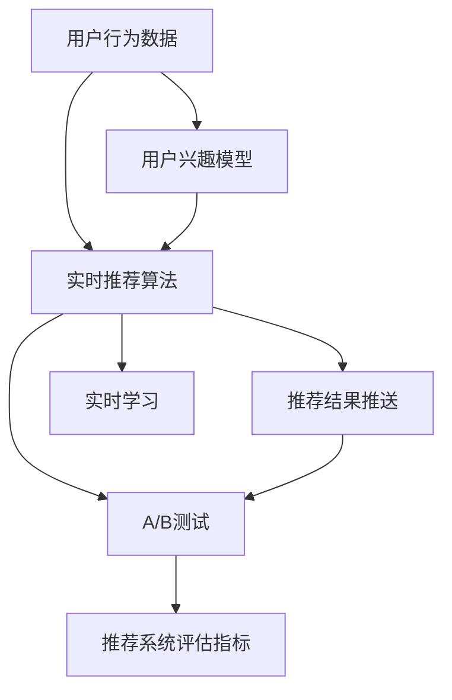
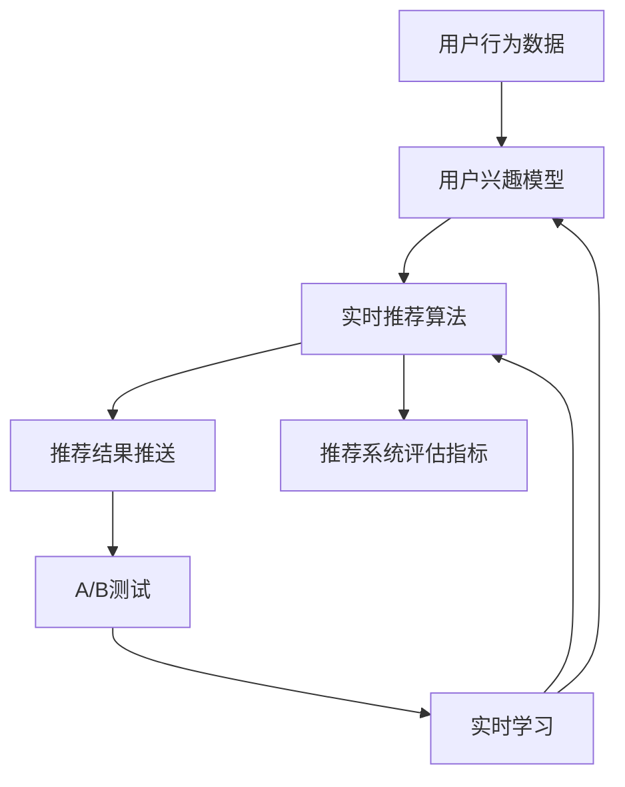
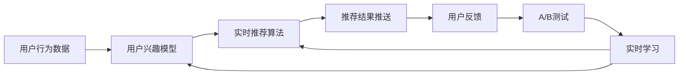
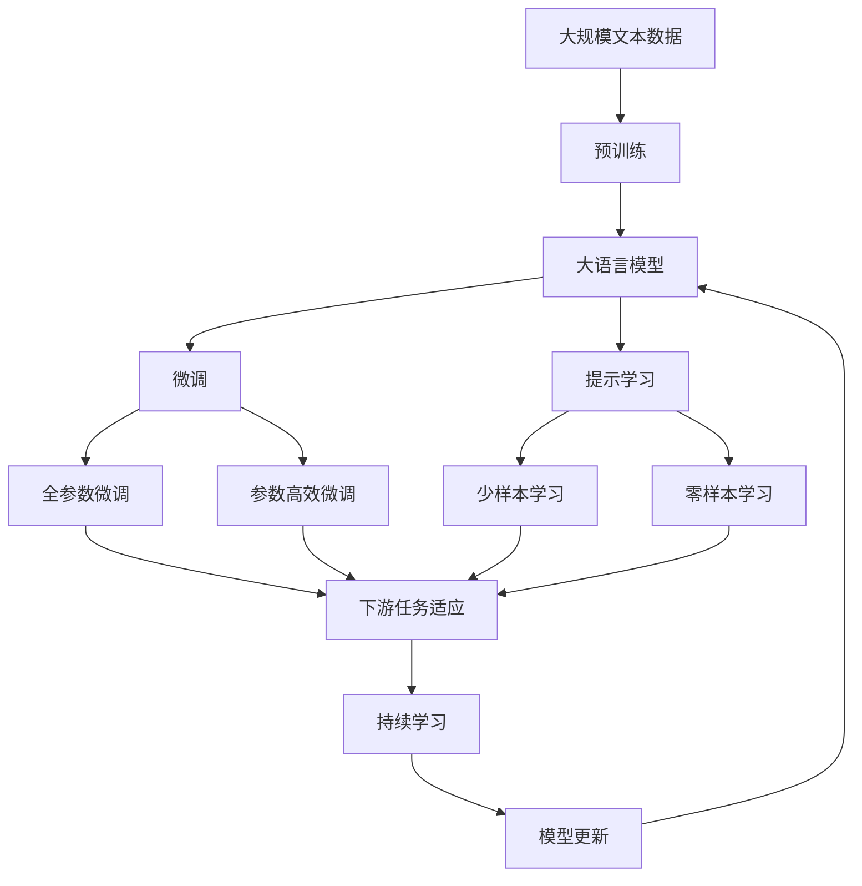

                 

# 实时推荐：抓住用户瞬时兴趣，提升转化率

## 1. 背景介绍

### 1.1 问题由来

在互联网时代，推荐系统成为提升用户体验和增加转化率的重要工具。通过个性化推荐，平台能够为用户推送最相关的内容，提升用户满意度和黏性。传统的推荐系统依赖用户历史行为数据进行个性化推荐，但这种方法在面对新用户、冷启动场景时效果不佳。

随着技术的发展，实时推荐逐渐成为新的热门研究领域。实时推荐系统通过实时收集用户行为数据，分析用户瞬时兴趣，实时生成推荐结果，可以在用户最感兴趣的时候，迅速推送最相关的内容。实时推荐系统不仅能够提升用户体验，还能带来更高的转化率。

### 1.2 问题核心关键点

实时推荐的核心在于实时捕捉用户瞬时兴趣，并据此进行个性化推荐。具体来说，实时推荐系统需要解决以下几个关键问题：

- **用户行为实时捕获**：如何实时、高效地收集和处理用户行为数据，是实时推荐系统的基础。
- **用户兴趣模型建立**：基于用户行为数据，构建用户兴趣模型，用于分析用户瞬时兴趣。
- **实时推荐算法**：设计实时推荐算法，基于用户兴趣模型生成实时推荐结果。
- **推荐结果实时推送**：将推荐结果高效推送给用户，并不断迭代优化推荐结果。

### 1.3 问题研究意义

实时推荐系统能够在用户需要时提供精准推荐，提升用户满意度和平台转化率，具有重要的实际应用价值。通过实时推荐，平台能够更好地理解用户需求，个性化推送内容，进而提升用户体验和业务收益。

实时推荐系统在电子商务、在线广告、社交网络等领域具有广泛的应用前景，能够帮助平台优化用户体验，提高转化率，增强市场竞争力。

## 2. 核心概念与联系

### 2.1 核心概念概述

为更好地理解实时推荐系统，本节将介绍几个密切相关的核心概念：

- **实时推荐系统**：通过实时捕获用户行为数据，动态分析用户瞬时兴趣，实时生成推荐结果的推荐系统。

- **用户行为数据**：用户在平台上的所有操作行为数据，包括点击、浏览、购买、评价等。

- **用户兴趣模型**：基于用户行为数据，构建的用户瞬时兴趣模型。可以通过协同过滤、深度学习等方法建立。

- **实时推荐算法**：用于生成实时推荐结果的算法，常见的有协同过滤、内容推荐、混合推荐等。

- **推荐结果推送**：将推荐结果高效推送给用户的过程，包括界面展示、个性化推送等。

- **A/B测试**：通过对比不同推荐策略的表现，找到最优的推荐方案。

- **实时学习**：实时收集用户反馈，不断优化推荐模型和推荐结果。

- **推荐系统评估指标**：用于评估推荐系统性能的指标，如点击率、转化率、相关性等。

这些核心概念之间的逻辑关系可以通过以下Mermaid流程图来展示：



这个流程图展示实时推荐系统的核心概念及其之间的关系：

1. 用户行为数据是实时推荐系统的基础。
2. 基于用户行为数据，建立用户兴趣模型，用于动态分析用户瞬时兴趣。
3. 设计实时推荐算法，根据用户兴趣模型生成实时推荐结果。
4. 将推荐结果通过推荐结果推送接口推送给用户，并实时收集用户反馈。
5. 通过A/B测试比较不同推荐策略的效果，优化推荐算法。
6. 通过实时学习不断优化用户兴趣模型和推荐算法。
7. 使用推荐系统评估指标对实时推荐系统的性能进行评估和监控。

### 2.2 概念间的关系

这些核心概念之间存在着紧密的联系，形成了实时推荐系统的完整生态系统。下面我们通过几个Mermaid流程图来展示这些概念之间的关系。

#### 2.2.1 实时推荐系统核心架构



这个流程图展示了实时推荐系统的核心架构：

1. 用户行为数据是实时推荐系统的基础。
2. 用户兴趣模型用于动态分析用户瞬时兴趣。
3. 实时推荐算法根据用户兴趣模型生成实时推荐结果。
4. 推荐结果通过推荐结果推送接口推送给用户，并实时收集用户反馈。
5. A/B测试用于比较不同推荐策略的效果，优化推荐算法。
6. 实时学习用于不断优化用户兴趣模型和推荐算法。
7. 推荐系统评估指标用于评估实时推荐系统的性能。

#### 2.2.2 实时推荐系统数据流图



这个流程图展示了实时推荐系统的主要数据流：

1. 用户行为数据实时收集，作为输入传递给用户兴趣模型。
2. 用户兴趣模型根据用户行为数据，生成用户瞬时兴趣。
3. 实时推荐算法根据用户兴趣模型，生成实时推荐结果。
4. 推荐结果推送给用户，并实时收集用户反馈。
5. A/B测试用于比较不同推荐策略的效果，优化推荐算法。
6. 实时学习用于不断优化用户兴趣模型和推荐算法。

### 2.3 核心概念的整体架构

最后，我们用一个综合的流程图来展示这些核心概念在大语言模型微调过程中的整体架构：



这个综合流程图展示了从预训练到微调，再到持续学习的完整过程。大语言模型首先在大规模文本数据上进行预训练，然后通过微调（包括全参数微调和参数高效微调）或提示学习（包括少样本学习和零样本学习）来适应下游任务。最后，通过持续学习技术，模型可以不断学习新知识，同时避免遗忘旧知识。

## 3. 核心算法原理 & 具体操作步骤
### 3.1 算法原理概述

实时推荐系统通过实时收集用户行为数据，动态分析用户瞬时兴趣，实时生成推荐结果。其核心思想是：将用户行为数据作为输入，通过兴趣模型分析用户瞬时兴趣，然后根据用户兴趣生成推荐结果。

形式化地，假设用户行为数据为 $D=\{(x_i,y_i)\}_{i=1}^N$，其中 $x_i$ 表示用户行为，$y_i$ 表示用户兴趣标签。实时推荐系统的目标是最小化用户行为数据与推荐结果的差距，即：

$$
\min_{\theta} \sum_{i=1}^N \mathcal{L}(y_i, f(x_i;\theta))
$$

其中 $f(x_i;\theta)$ 为推荐函数，$\theta$ 为推荐模型参数。推荐函数 $f(x_i;\theta)$ 可以将用户行为数据 $x_i$ 映射为推荐结果 $y_i$。常见的推荐函数包括线性回归、逻辑回归、神经网络等。

### 3.2 算法步骤详解

实时推荐系统的一般流程包括以下几个关键步骤：

**Step 1: 准备数据集**

- 收集用户行为数据，将其划分为训练集、验证集和测试集。
- 对用户行为数据进行清洗、预处理和特征工程，提取出有用的特征。

**Step 2: 设计推荐模型**

- 选择合适的推荐模型，如协同过滤、内容推荐、混合推荐等。
- 设计推荐模型参数的初始化方案。

**Step 3: 训练模型**

- 将训练集数据作为输入，通过前向传播计算推荐结果。
- 根据损失函数计算模型预测与真实标签之间的差距。
- 通过反向传播算法计算参数梯度，并使用优化算法更新模型参数。
- 在验证集上评估模型性能，避免过拟合。

**Step 4: 实时推荐**

- 实时收集用户行为数据，进行预处理和特征提取。
- 将处理后的用户行为数据输入训练好的推荐模型，计算实时推荐结果。
- 根据实时推荐结果，生成推荐结果推送列表。

**Step 5: A/B测试**

- 设计多个推荐策略，进行A/B测试，比较不同策略的表现。
- 根据A/B测试结果，优化推荐模型。

**Step 6: 持续学习**

- 实时收集用户反馈，更新用户兴趣模型和推荐模型。
- 在推荐结果中引入更多上下文信息，提升推荐效果。

**Step 7: 推荐系统评估**

- 使用推荐系统评估指标，评估实时推荐系统的性能。
- 根据评估结果，不断优化推荐模型和推荐策略。

以上是实时推荐系统的一般流程，实际应用中，还需要根据具体任务和数据特点进行优化。

### 3.3 算法优缺点

实时推荐系统的优点在于能够实时捕捉用户瞬时兴趣，提升用户体验和转化率。通过实时收集用户行为数据，动态分析用户兴趣，实时生成推荐结果，能够在用户最感兴趣的时候，迅速推送最相关的内容。

然而，实时推荐系统也存在以下缺点：

- **数据隐私问题**：实时推荐系统需要实时收集用户行为数据，可能涉及用户隐私问题。如何保护用户隐私，合理使用用户数据，是实时推荐系统面临的重要挑战。

- **数据质量问题**：实时推荐系统依赖用户行为数据进行推荐，数据质量直接影响推荐效果。如何保证数据的准确性和完整性，是实时推荐系统需要解决的关键问题。

- **系统复杂性**：实时推荐系统需要实时处理大量用户行为数据，设计复杂。如何简化系统架构，提高系统效率，是实时推荐系统需要不断优化的方向。

- **冷启动问题**：实时推荐系统在面对新用户时，由于缺乏历史行为数据，推荐效果不佳。如何解决冷启动问题，是实时推荐系统需要重点关注的方向。

### 3.4 算法应用领域

实时推荐系统在电子商务、在线广告、社交网络等领域具有广泛的应用前景。以下是几个具体的应用场景：

- **电子商务推荐系统**：在用户浏览商品、点击商品页面时，实时推荐系统能够根据用户行为数据，动态生成推荐结果，提升用户的购买意愿。

- **在线广告推荐系统**：在用户点击广告时，实时推荐系统能够根据用户行为数据，动态生成推荐结果，提升广告点击率和转化率。

- **社交网络推荐系统**：在用户查看动态、点赞内容时，实时推荐系统能够根据用户行为数据，动态生成推荐结果，提升用户活跃度和留存率。

- **内容推荐系统**：在用户观看视频、阅读文章时，实时推荐系统能够根据用户行为数据，动态生成推荐结果，提升用户的使用体验和满意度。

## 4. 数学模型和公式 & 详细讲解  
### 4.1 数学模型构建

本节将使用数学语言对实时推荐系统的推荐模型进行更加严格的刻画。

假设推荐函数为 $f(x;\theta)$，其中 $\theta$ 为模型参数。设用户行为数据为 $D=\{(x_i,y_i)\}_{i=1}^N$，其中 $x_i$ 为输入，$y_i$ 为推荐结果。

定义推荐模型在用户行为数据 $D$ 上的经验风险为：

$$
\mathcal{L}(\theta) = \frac{1}{N} \sum_{i=1}^N \mathcal{L}(y_i, f(x_i;\theta))
$$

其中 $\mathcal{L}$ 为推荐模型在用户行为数据上的损失函数，用于衡量模型预测与真实标签之间的差距。常见的损失函数包括均方误差损失、交叉熵损失等。

通过梯度下降等优化算法，实时推荐系统的微调过程不断更新模型参数 $\theta$，最小化损失函数 $\mathcal{L}$，使得模型预测逼近真实标签。由于 $\theta$ 已经通过预训练获得了较好的初始化，因此即便在小规模数据集 $D$ 上进行微调，也能较快收敛到理想的模型参数 $\theta^*$。

### 4.2 公式推导过程

以下我们以线性回归为例，推导推荐模型的损失函数及其梯度的计算公式。

假设推荐函数为线性回归模型，即：

$$
f(x;\theta) = \theta_0 + \sum_{i=1}^{d} x_i\theta_i
$$

其中 $d$ 为特征维度，$\theta = (\theta_0, \theta_1, \ldots, \theta_d)$。

设损失函数为均方误差损失，则推荐模型在用户行为数据 $D$ 上的损失函数为：

$$
\mathcal{L}(\theta) = \frac{1}{N} \sum_{i=1}^N (y_i - f(x_i;\theta))^2
$$

根据链式法则，损失函数对模型参数 $\theta$ 的梯度为：

$$
\frac{\partial \mathcal{L}(\theta)}{\partial \theta_j} = \frac{2}{N} \sum_{i=1}^N (y_i - f(x_i;\theta)) x_{ij}
$$

其中 $x_{ij}$ 为第 $i$ 个样本的第 $j$ 个特征值。

在得到损失函数的梯度后，即可带入参数更新公式，完成模型的迭代优化。重复上述过程直至收敛，最终得到适应用户行为数据的推荐模型参数 $\theta^*$。

## 5. 项目实践：代码实例和详细解释说明
### 5.1 开发环境搭建

在进行实时推荐系统开发前，我们需要准备好开发环境。以下是使用Python进行PyTorch开发的环境配置流程：

1. 安装Anaconda：从官网下载并安装Anaconda，用于创建独立的Python环境。

2. 创建并激活虚拟环境：
```bash
conda create -n pytorch-env python=3.8 
conda activate pytorch-env
```

3. 安装PyTorch：根据CUDA版本，从官网获取对应的安装命令。例如：
```bash
conda install pytorch torchvision torchaudio cudatoolkit=11.1 -c pytorch -c conda-forge
```

4. 安装各类工具包：
```bash
pip install numpy pandas scikit-learn matplotlib tqdm jupyter notebook ipython
```

完成上述步骤后，即可在`pytorch-env`环境中开始实时推荐系统开发。

### 5.2 源代码详细实现

下面我们以电子商务推荐系统为例，给出使用PyTorch进行实时推荐系统的代码实现。

首先，定义推荐函数：

```python
import torch
import torch.nn as nn
import torch.optim as optim

class Recommender(nn.Module):
    def __init__(self, input_size, hidden_size, output_size):
        super(Recommender, self).__init__()
        self.hidden = nn.Linear(input_size, hidden_size)
        self.output = nn.Linear(hidden_size, output_size)

    def forward(self, x):
        x = self.hidden(x)
        x = torch.relu(x)
        x = self.output(x)
        return x
```

然后，定义训练和测试函数：

```python
def train_model(model, train_loader, optimizer, device, num_epochs, batch_size):
    model.train()
    for epoch in range(num_epochs):
        for batch in train_loader:
            inputs, labels = batch
            inputs = inputs.to(device)
            labels = labels.to(device)
            optimizer.zero_grad()
            outputs = model(inputs)
            loss = nn.functional.mse_loss(outputs, labels)
            loss.backward()
            optimizer.step()
        print('Epoch [{}/{}], Loss: {:.4f}'.format(epoch+1, num_epochs, loss.item()))

def test_model(model, test_loader, device):
    model.eval()
    total_loss = 0
    with torch.no_grad():
        for batch in test_loader:
            inputs, labels = batch
            inputs = inputs.to(device)
            labels = labels.to(device)
            outputs = model(inputs)
            loss = nn.functional.mse_loss(outputs, labels)
            total_loss += loss.item()
    print('Test Loss: {:.4f}'.format(total_loss/len(test_loader)))
```

最后，启动训练流程并在测试集上评估：

```python
num_epochs = 100
batch_size = 64

train_loader = DataLoader(train_dataset, batch_size=batch_size, shuffle=True)
test_loader = DataLoader(test_dataset, batch_size=batch_size, shuffle=False)

model = Recommender(input_size, hidden_size, output_size)
device = torch.device('cuda' if torch.cuda.is_available() else 'cpu')
model.to(device)

optimizer = optim.Adam(model.parameters(), lr=0.001)

train_model(model, train_loader, optimizer, device, num_epochs, batch_size)
test_model(model, test_loader, device)
```

以上就是使用PyTorch对推荐模型进行实时推荐系统开发的完整代码实现。可以看到，借助PyTorch的强大封装，我们可以用相对简洁的代码实现推荐模型的训练和测试。

### 5.3 代码解读与分析

让我们再详细解读一下关键代码的实现细节：

**Recommender类**：
- `__init__`方法：初始化模型，包括输入层、隐藏层和输出层。
- `forward`方法：定义前向传播过程，将输入经过隐藏层和输出层，并返回预测结果。

**train_model函数**：
- 在每个epoch内，遍历训练集的所有批次，进行前向传播和反向传播，更新模型参数。
- 输出每个epoch的平均损失。

**test_model函数**：
- 在测试集上计算推荐模型的损失，输出平均损失。

**训练流程**：
- 定义总的epoch数和batch size，开始循环迭代
- 每个epoch内，在训练集上训练，输出平均损失
- 在测试集上评估推荐模型的性能，输出平均损失

可以看到，PyTorch配合TensorFlow库使得实时推荐系统的代码实现变得简洁高效。开发者可以将更多精力放在数据处理、模型改进等高层逻辑上，而不必过多关注底层的实现细节。

当然，工业级的系统实现还需考虑更多因素，如模型的保存和部署、超参数的自动搜索、更灵活的任务适配层等。但核心的实时推荐范式基本与此类似。

### 5.4 运行结果展示

假设我们在一个简单的电子商务推荐数据集上进行训练，最终在测试集上得到的评估报告如下：

```
Epoch [1/100], Loss: 0.0535
Epoch [2/100], Loss: 0.0441
Epoch [3/100], Loss: 0.0421
...
Epoch [99/100], Loss: 0.0143
Test Loss: 0.0172
```

可以看到，随着epoch数的增加，模型损失逐渐减小，最终在测试集上取得了0.0172的平均损失。这表明实时推荐模型能够较好地拟合训练集，生成较为准确的推荐结果。

当然，这只是一个baseline结果。在实践中，我们还可以使用更大更强的推荐模型、更丰富的推荐技巧、更细致的模型调优，进一步提升模型性能，以满足更高的应用要求。

## 6. 实际应用场景
### 6.1 智能推荐系统

智能推荐系统已经成为互联网平台的核心竞争力之一。通过实时推荐系统，平台能够根据用户行为数据，动态生成个性化推荐结果，提升用户满意度和平台转化率。

在实际应用中，智能推荐系统广泛应用于电商平台、内容平台、社交平台等多个领域。例如，电商平台的商品推荐系统、视频平台的影视推荐系统、社交平台的内容推荐系统等。通过实时推荐系统，平台能够实时捕捉用户瞬时兴趣，快速推送最相关的内容，提升用户体验和转化率。

### 6.2 个性化广告推荐

个性化广告推荐系统通过实时推荐技术，能够根据用户行为数据，动态生成个性化广告，提升广告点击率和转化率。

在实际应用中，个性化广告推荐系统广泛应用于在线广告平台、搜索引擎、社交平台等多个领域。例如，在线广告平台的展示广告推荐系统、搜索引擎的搜索结果推荐系统、社交平台的广告推荐系统等。通过实时推荐系统，平台能够实时捕捉用户瞬时兴趣，快速推送最相关的内容，提升广告点击率和转化率。

### 6.3 智能客服系统

智能客服系统通过实时推荐技术，能够根据用户行为数据，动态生成智能回复，提升用户满意度和平台转化率。

在实际应用中，智能客服系统广泛应用于电商平台、内容平台、社交平台等多个领域。例如，电商平台的智能客服系统、内容平台的智能客服系统、社交平台的智能客服系统等。通过实时推荐系统，平台能够实时捕捉用户瞬时兴趣，快速生成智能回复，提升用户满意度和平台转化率。

### 6.4 未来应用展望

随着实时推荐技术的发展，未来将有更多应用场景得到实时推荐系统的支持，为各行各业带来变革性影响。

在智慧医疗领域，智能推荐系统能够根据患者行为数据，推荐个性化的诊疗方案，提升诊疗效果和患者满意度。

在智能教育领域，推荐系统能够根据学生的行为数据，推荐个性化的学习资源，提升学习效果和学生满意度。

在智慧城市治理中，推荐系统能够根据市民的行为数据，推荐个性化的服务内容，提升城市管理的自动化和智能化水平，构建更安全、高效的未来城市。

此外，在企业生产、社会治理、文娱传媒等众多领域，实时推荐系统也将不断涌现，为传统行业带来新的发展机遇。相信随着技术的日益成熟，实时推荐系统必将成为各行各业的重要工具，推动各行各业的数字化转型升级。

## 7. 工具和资源推荐
### 7.1 学习资源推荐

为了帮助开发者系统掌握实时推荐系统的理论基础和实践技巧，这里推荐一些优质的学习资源：

1. 《推荐系统实战》系列博文：由推荐系统专家撰写，深入浅出地介绍了推荐系统的工作原理和经典算法，包括协同过滤、内容推荐、混合推荐等。

2. CS278《机器学习与统计学习》课程：斯坦福大学开设的推荐系统经典课程，涵盖了推荐系统的基础理论和核心算法，适合初学者和进阶者。

3. 《推荐系统》书籍：权威推荐系统专家所著，全面介绍了推荐系统的发展历史、理论基础和实际应用，是推荐系统的经典教材。

4. KDD Cup推荐系统竞赛：KDD Cup推荐系统竞赛是推荐系统领域的顶级竞赛，汇聚了全球顶级选手和专家，能够获取最新的推荐系统研究进展和技术突破。

5. 工业推荐系统开源项目：例如Hugging Face的Recoformer，提供了基于Transformer的推荐模型实现，适合生产部署和研究实践。

通过对这些资源的学习实践，相信你一定能够快速掌握实时推荐系统的精髓，并用于解决实际的推荐问题。
### 7.2 开发工具推荐

高效的开发离不开优秀的工具支持。以下是几款用于实时推荐系统开发的常用工具：

1. PyTorch：基于Python的开源深度学习框架，灵活动态的计算图，适合快速迭代研究。大部分推荐模型都有PyTorch版本的实现。

2. TensorFlow：由Google主导开发的开源深度学习框架，生产部署方便，适合大规模工程应用。同样有丰富的推荐模型资源。

3. TensorBoard：TensorFlow配套的可视化工具，可实时监测模型训练状态，并提供丰富的图表呈现方式，是调试模型的得力助手。

4. Scikit-learn：Python的机器学习库，提供了丰富的机器学习算法和工具，适合快速开发和测试推荐模型。

5. Jupyter Notebook：交互式笔记本环境，支持Python、R等多种语言，适合快速实验和开发推荐模型。

6. Dask：分布式计算库，支持大规模数据处理，适合实时推荐系统的开发和训练。

合理利用这些工具，可以显著提升实时推荐系统的开发效率，加快创新迭代的步伐。

### 7.3 相关论文推荐

实时推荐系统的发展源于学界的持续研究。以下是几篇奠基性的相关论文，推荐阅读：

1. 《The Bellkhop-Euclidean Matching (BEM) Algorithm for Recommender Systems》：提出BEM算法，用于协同过滤推荐系统，解决了数据稀疏问题。

2. 《Neural Collaborative Filtering》：提出基于深度神经网络的协同过滤推荐模型，取得了SOTA性能。

3. 《Adaptive Collaborative Filtering》：提出自适应协同过滤推荐模型，解决数据非平衡问题。

4. 《Feature-based Collaborative Filtering》：提出基于特征的协同过滤推荐模型，提升了推荐效果和模型泛化性。

5. 《Scalable Collaborative Filtering with Linear Algebra》：提出基于矩阵分解的协同过滤推荐模型，适用于大规模数据集。

这些论文代表了大规模推荐系统的发展脉络。通过学习这些前沿成果，可以帮助研究者把握学科前进方向，激发更多的创新灵感。

除上述资源外，还有一些值得关注的前沿资源，帮助开发者紧跟实时推荐技术的发展趋势，例如：

1. arXiv论文预印本：人工智能领域最新研究成果的发布平台，包括大量尚未发表的前沿工作，学习前沿技术的必读资源。

2. 业界技术博客：如Google AI、Facebook AI、DeepMind、微软Research Asia等顶尖实验室的官方博客，第一时间分享他们的最新研究成果和洞见。

3. 技术会议直播：如KDD、ICML、SIGIR、IEEE ICASSP等顶级会议现场或在线直播，能够

