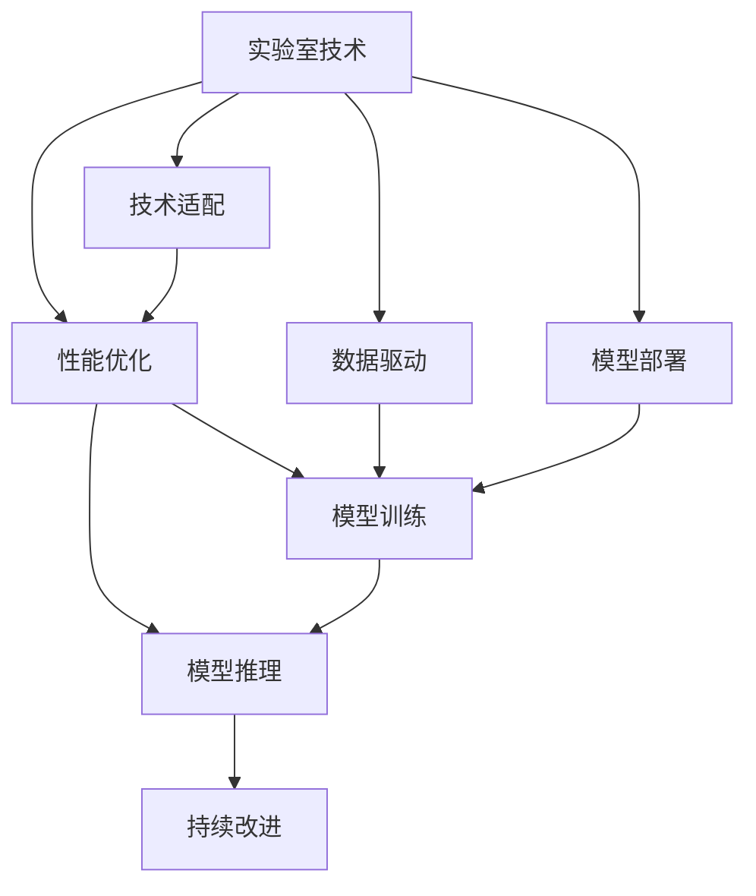

                 

# 实验室到产业界的AI发展：技术落地之关键

> 关键词：AI技术,产业界,技术落地,实验室,关键技术,应用场景,数据驱动,优化策略,人工智能开发

## 1. 背景介绍

### 1.1 问题由来
随着人工智能(AI)技术的飞速发展，实验室的创新成果逐步向产业界应用转化，成为推动各行各业数字化转型升级的重要驱动力。然而，将AI技术从实验室落地到产业界，不仅仅是技术的迁移，更是对实际应用场景的深刻理解和优化。在此背景下，探讨AI技术落地过程中的关键问题和策略，具有重要意义。

### 1.2 问题核心关键点
AI技术的实验室到产业界转化过程中，关键点包括：
- **需求适配**：将实验室的创新技术适配到具体的业务场景中，满足实际应用需求。
- **性能优化**：通过模型训练和算法优化，提升模型在实际环境中的表现。
- **数据处理**：收集和处理高质量的训练数据，确保模型训练的准确性。
- **模型部署**：将训练好的模型部署到实际生产环境中，实现稳定高效的运行。
- **持续改进**：在模型部署后，不断收集反馈数据，进行迭代优化。

### 1.3 问题研究意义
通过深入研究AI技术在产业界落地的关键问题，可以有效提升AI技术的实用性和可靠性，加速产业界的数字化转型进程。具体而言，其研究意义如下：

1. **降低应用开发成本**：通过优化技术落地流程，减少从头开发所需的数据、计算和人力等成本投入。
2. **提升模型效果**：通过精细化的优化策略，提高模型在特定任务上的表现，满足实际应用需求。
3. **加速开发进度**：利用实验室已有成果，快速完成任务适配，缩短开发周期。
4. **带来技术创新**：通过落地应用，促进对AI技术的深入研究和创新，推动技术进步。
5. **赋能产业升级**：使AI技术更容易被各行各业所采用，为传统行业数字化转型提供新的技术路径。

## 2. 核心概念与联系

### 2.1 核心概念概述

为更好地理解AI技术从实验室到产业界的转化过程，本节将介绍几个密切相关的核心概念：

- **实验室技术**：指在学术或研究机构内，通过大量实验和数据积累得到的算法、模型和工具。这些技术通常具有较高的理论深度和创新性。
- **产业界应用**：指AI技术在实际生产环境中的具体应用，包括数据处理、模型训练、推理预测等多个环节。
- **技术适配**：将实验室技术适配到特定业务场景中的过程，确保技术能够满足实际需求。
- **性能优化**：在特定应用场景中，通过调整模型结构和参数，提升模型性能。
- **数据驱动**：在模型训练和优化过程中，充分利用高质量的数据，提高模型泛化能力。
- **模型部署**：将训练好的模型部署到实际生产环境中，实现稳定高效的运行。
- **持续改进**：在模型部署后，通过不断收集反馈数据，进行迭代优化，提升模型效果。

这些核心概念之间的逻辑关系可以通过以下Mermaid流程图来展示：



这个流程图展示了大规模实验室技术在产业界应用的全过程：

1. 从实验室技术开始，需要适配特定应用场景，确保技术能够满足需求。
2. 适配后的技术需要进行性能优化，提升模型在实际环境中的表现。
3. 优化过程中需要大量高质量的数据驱动，提高模型的泛化能力。
4. 优化后的模型需要进行部署，实现稳定高效的运行。
5. 在部署后，还需要通过持续改进，不断优化模型性能。

### 2.2 概念间的关系

这些核心概念之间存在着紧密的联系，形成了AI技术从实验室到产业界的完整生态系统。下面我们通过几个Mermaid流程图来展示这些概念之间的关系。

#### 2.2.1 技术适配与性能优化


这个流程图展示了实验室技术通过技术适配过程，优化到特定应用场景的思路。适配后的技术需要在性能上进行优化，以提升模型在实际环境中的表现。

#### 2.2.2 数据驱动与模型训练


这个流程图展示了数据在模型训练和优化过程中的驱动作用。实验室技术需要大量高质量的数据进行驱动，以确保模型训练的准确性和泛化能力。

#### 2.2.3 模型部署与持续改进


这个流程图展示了模型在实际生产环境中的部署过程以及后续的持续改进。部署后的模型需要不断收集反馈数据，进行迭代优化，以适应不断变化的业务需求。

## 3. 核心算法原理 & 具体操作步骤
### 3.1 算法原理概述

AI技术的实验室到产业界转化过程中，核心算法原理包括模型训练、性能优化、数据驱动和模型部署等多个方面。这些原理相互作用，共同推动AI技术的成功落地。

#### 3.1.1 模型训练

模型训练是AI技术落地的基础。在产业界应用中，模型训练通常需要以下几个步骤：

1. **数据准备**：收集和预处理高质量的训练数据。数据的质量和多样性直接影响模型的泛化能力。
2. **模型选择**：选择合适的模型架构，如卷积神经网络(CNN)、循环神经网络(RNN)、变换器(Transformer)等。
3. **模型训练**：通过反向传播算法，根据损失函数更新模型参数，最小化预测输出与真实标签之间的差异。

#### 3.1.2 性能优化

性能优化是提升模型效果的重要手段。在特定应用场景中，性能优化通常包括模型压缩、参数剪枝、算法调优等策略。

1. **模型压缩**：通过量化、剪枝等方法，减少模型大小和计算量，提高推理速度。
2. **参数剪枝**：移除不重要的参数，减少模型复杂度，提高模型泛化能力。
3. **算法调优**：优化模型训练过程中的超参数，如学习率、批大小、正则化系数等，以提升模型性能。

#### 3.1.3 数据驱动

数据驱动是模型优化的关键。高质量的数据能够显著提升模型的泛化能力和鲁棒性。

1. **数据清洗**：去除噪声和异常数据，确保数据的质量。
2. **数据增强**：通过数据增强技术，扩充训练数据，提高模型的泛化能力。
3. **数据标注**：为模型训练提供高质量的标注数据，确保模型训练的准确性。

#### 3.1.4 模型部署

模型部署是将训练好的模型应用到实际生产环境中的过程，需要考虑模型的存储、加载和推理等多个环节。

1. **模型存储**：将训练好的模型保存为高效的存储格式，如ONNX、TensorFlow Lite等。
2. **模型加载**：在实际应用中高效加载模型，以支持实时推理。
3. **模型推理**：在生产环境中，对新数据进行高效推理，实现业务需求。

### 3.2 算法步骤详解

#### 3.2.1 数据准备

数据准备是模型训练和优化的基础。以下是数据准备的一般步骤：

1. **数据收集**：从不同来源收集数据，确保数据的多样性和代表性。
2. **数据清洗**：去除噪声和异常数据，确保数据的质量。
3. **数据标注**：为数据添加标注信息，确保数据标注的准确性。
4. **数据增强**：通过数据增强技术，扩充训练数据，提高模型的泛化能力。

#### 3.2.2 模型训练

模型训练通常包括选择合适的模型架构、设置训练参数和进行模型训练等步骤。

1. **模型选择**：根据任务特点，选择合适的模型架构，如CNN、RNN、Transformer等。
2. **训练参数设置**：设置学习率、批大小、迭代次数等训练参数。
3. **模型训练**：使用反向传播算法，根据损失函数更新模型参数，最小化预测输出与真实标签之间的差异。

#### 3.2.3 性能优化

性能优化通常包括模型压缩、参数剪枝和算法调优等策略。

1. **模型压缩**：通过量化、剪枝等方法，减少模型大小和计算量，提高推理速度。
2. **参数剪枝**：移除不重要的参数，减少模型复杂度，提高模型泛化能力。
3. **算法调优**：优化模型训练过程中的超参数，如学习率、批大小、正则化系数等，以提升模型性能。

#### 3.2.4 数据驱动

数据驱动是模型优化的关键。以下是数据驱动的一般步骤：

1. **数据清洗**：去除噪声和异常数据，确保数据的质量。
2. **数据增强**：通过数据增强技术，扩充训练数据，提高模型的泛化能力。
3. **数据标注**：为数据添加标注信息，确保数据标注的准确性。

#### 3.2.5 模型部署

模型部署是将训练好的模型应用到实际生产环境中的过程，需要考虑模型的存储、加载和推理等多个环节。

1. **模型存储**：将训练好的模型保存为高效的存储格式，如ONNX、TensorFlow Lite等。
2. **模型加载**：在实际应用中高效加载模型，以支持实时推理。
3. **模型推理**：在生产环境中，对新数据进行高效推理，实现业务需求。

### 3.3 算法优缺点

AI技术的实验室到产业界转化过程中，核心算法具有以下优缺点：

#### 3.3.1 优点

1. **高效性**：通过模型训练和优化，能够显著提升模型性能，满足实际应用需求。
2. **可扩展性**：实验室技术具有较高的可扩展性，能够适应不同规模和复杂度的应用场景。
3. **灵活性**：在模型训练和优化过程中，可以根据实际需求进行调整，提高模型适用性。

#### 3.3.2 缺点

1. **数据依赖**：模型训练和优化依赖于高质量的数据，数据获取和标注成本较高。
2. **计算需求**：模型训练和优化通常需要大量的计算资源，部署成本较高。
3. **模型复杂**：实验室技术往往较为复杂，难以在实际生产环境中实现高效部署。

### 3.4 算法应用领域

AI技术的实验室到产业界转化过程，已经在多个领域得到广泛应用，例如：

- **医疗健康**：通过AI技术进行病理学分析、药物研发等，提升医疗服务质量。
- **金融服务**：利用AI技术进行信用评分、欺诈检测、风险管理等，提升金融服务效率。
- **智能制造**：采用AI技术进行生产流程优化、质量控制、设备维护等，提升制造企业效率。
- **智慧城市**：应用AI技术进行城市管理、交通控制、环境监测等，提升城市管理水平。
- **教育培训**：利用AI技术进行个性化教学、学习评估等，提升教育培训效果。

## 4. 数学模型和公式 & 详细讲解 & 举例说明
### 4.1 数学模型构建

在本节中，我们将使用数学语言对AI技术从实验室到产业界的转化过程进行更加严格的刻画。

设实验室技术为 $M_{\theta}$，其中 $\theta$ 为模型参数。假设产业界应用为 $T$，其训练数据集为 $D=\{(x_i,y_i)\}_{i=1}^N$，其中 $x_i$ 为输入数据，$y_i$ 为标签。

定义模型 $M_{\theta}$ 在数据样本 $(x,y)$ 上的损失函数为 $\ell(M_{\theta}(x),y)$，则在数据集 $D$ 上的经验风险为：

$$
\mathcal{L}(\theta) = \frac{1}{N} \sum_{i=1}^N \ell(M_{\theta}(x_i),y_i)
$$

微调的目标是最小化经验风险，即找到最优参数：

$$
\theta^* = \mathop{\arg\min}_{\theta} \mathcal{L}(\theta)
$$

在实践中，我们通常使用基于梯度的优化算法（如SGD、Adam等）来近似求解上述最优化问题。设 $\eta$ 为学习率，$\lambda$ 为正则化系数，则参数的更新公式为：

$$
\theta \leftarrow \theta - \eta \nabla_{\theta}\mathcal{L}(\theta) - \eta\lambda\theta
$$

其中 $\nabla_{\theta}\mathcal{L}(\theta)$ 为损失函数对参数 $\theta$ 的梯度，可通过反向传播算法高效计算。

### 4.2 公式推导过程

以下我们以二分类任务为例，推导交叉熵损失函数及其梯度的计算公式。

假设模型 $M_{\theta}$ 在输入 $x$ 上的输出为 $\hat{y}=M_{\theta}(x) \in [0,1]$，表示样本属于正类的概率。真实标签 $y \in \{0,1\}$。则二分类交叉熵损失函数定义为：

$$
\ell(M_{\theta}(x),y) = -[y\log \hat{y} + (1-y)\log (1-\hat{y})]
$$

将其代入经验风险公式，得：

$$
\mathcal{L}(\theta) = -\frac{1}{N}\sum_{i=1}^N [y_i\log M_{\theta}(x_i)+(1-y_i)\log(1-M_{\theta}(x_i))]
$$

根据链式法则，损失函数对参数 $\theta_k$ 的梯度为：

$$
\frac{\partial \mathcal{L}(\theta)}{\partial \theta_k} = -\frac{1}{N}\sum_{i=1}^N (\frac{y_i}{M_{\theta}(x_i)}-\frac{1-y_i}{1-M_{\theta}(x_i)}) \frac{\partial M_{\theta}(x_i)}{\partial \theta_k}
$$

其中 $\frac{\partial M_{\theta}(x_i)}{\partial \theta_k}$ 可进一步递归展开，利用自动微分技术完成计算。

在得到损失函数的梯度后，即可带入参数更新公式，完成模型的迭代优化。重复上述过程直至收敛，最终得到适应产业界应用的最优模型参数 $\theta^*$。

### 4.3 案例分析与讲解

在本节中，我们将通过一个具体的案例来分析AI技术从实验室到产业界的转化过程。

假设我们要将一个用于图像分类的实验室技术 $M_{\theta}$ 适配到医疗影像分类任务 $T$ 中。具体步骤如下：

1. **数据准备**：收集医疗影像数据集，进行数据清洗和标注。
2. **模型选择**：选择适合图像分类的卷积神经网络(CNN)模型。
3. **模型训练**：在医疗影像数据集上训练CNN模型，最小化预测输出与真实标签之间的差异。
4. **性能优化**：通过模型压缩和参数剪枝等技术，提升模型性能。
5. **数据驱动**：利用医疗影像数据增强技术，扩充训练数据，提高模型泛化能力。
6. **模型部署**：将训练好的CNN模型保存为ONNX格式，并在实际应用中高效加载和推理。

通过以上步骤，我们将实验室技术 $M_{\theta}$ 成功适配到医疗影像分类任务 $T$ 中，实现了AI技术的落地应用。

## 5. 项目实践：代码实例和详细解释说明
### 5.1 开发环境搭建

在进行AI技术落地实践前，我们需要准备好开发环境。以下是使用Python进行PyTorch开发的环境配置流程：

1. 安装Anaconda：从官网下载并安装Anaconda，用于创建独立的Python环境。

2. 创建并激活虚拟环境：
```bash
conda create -n pytorch-env python=3.8 
conda activate pytorch-env
```

3. 安装PyTorch：根据CUDA版本，从官网获取对应的安装命令。例如：
```bash
conda install pytorch torchvision torchaudio cudatoolkit=11.1 -c pytorch -c conda-forge
```

4. 安装各类工具包：
```bash
pip install numpy pandas scikit-learn matplotlib tqdm jupyter notebook ipython
```

完成上述步骤后，即可在`pytorch-env`环境中开始AI技术落地实践。

### 5.2 源代码详细实现

下面我们以图像分类任务为例，给出使用PyTorch对CNN模型进行训练和优化的PyTorch代码实现。

首先，定义数据处理函数：

```python
from torchvision import datasets, transforms

train_dataset = datasets.CIFAR10(root='./data', train=True, download=True, transform=transforms.ToTensor())
test_dataset = datasets.CIFAR10(root='./data', train=False, download=True, transform=transforms.ToTensor())

```

然后，定义模型和优化器：

```python
import torch.nn as nn
import torch.optim as optim

model = nn.ConvNet(num_classes=10, num_features=32, kernel_size=3, padding=1)
criterion = nn.CrossEntropyLoss()
optimizer = optim.Adam(model.parameters(), lr=1e-3)
```

接着，定义训练和评估函数：

```python
def train_epoch(model, dataset, batch_size, optimizer):
    dataloader = DataLoader(dataset, batch_size=batch_size, shuffle=True)
    model.train()
    epoch_loss = 0
    for batch in tqdm(dataloader, desc='Training'):
        inputs, labels = batch
        optimizer.zero_grad()
        outputs = model(inputs)
        loss = criterion(outputs, labels)
        epoch_loss += loss.item()
        loss.backward()
        optimizer.step()
    return epoch_loss / len(dataloader)

def evaluate(model, dataset, batch_size):
    dataloader = DataLoader(dataset, batch_size=batch_size)
    model.eval()
    correct = 0
    total = 0
    with torch.no_grad():
        for batch in tqdm(dataloader, desc='Evaluating'):
            inputs, labels = batch
            outputs = model(inputs)
            _, predicted = torch.max(outputs.data, 1)
            total += labels.size(0)
            correct += (predicted == labels).sum().item()
    print('Accuracy: %d %%' % (100 * correct / total))
```

最后，启动训练流程并在测试集上评估：

```python
epochs = 5
batch_size = 16

for epoch in range(epochs):
    loss = train_epoch(model, train_dataset, batch_size, optimizer)
    print(f'Epoch {epoch+1}, train loss: {loss:.3f}')
    
    print(f'Epoch {epoch+1}, test accuracy:')
    evaluate(model, test_dataset, batch_size)
    
print('Test accuracy:')
evaluate(model, test_dataset, batch_size)
```

以上就是使用PyTorch对CNN模型进行图像分类任务训练和优化的完整代码实现。可以看到，得益于PyTorch的强大封装，我们可以用相对简洁的代码完成CNN模型的加载和训练。

### 5.3 代码解读与分析

让我们再详细解读一下关键代码的实现细节：

**train_epoch函数**：
- 定义训练过程中的参数，包括模型、损失函数、优化器等。
- 在每个epoch内，对训练集数据进行批处理，并前向传播计算损失函数，反向传播更新模型参数。
- 最后返回该epoch的平均损失。

**evaluate函数**：
- 与训练类似，不同点在于不更新模型参数，仅进行前向传播计算预测结果和损失函数。
- 在每个batch结束后，计算预测准确率，并返回该epoch的平均准确率。

**训练流程**：
- 定义总的epoch数和batch size，开始循环迭代
- 每个epoch内，先在训练集上训练，输出平均损失
- 在测试集上评估，输出准确率
- 所有epoch结束后，在测试集上评估，给出最终测试结果

可以看到，PyTorch配合ConvNet库使得CNN模型训练的代码实现变得简洁高效。开发者可以将更多精力放在数据处理、模型改进等高层逻辑上，而不必过多关注底层的实现细节。

当然，工业级的系统实现还需考虑更多因素，如模型的保存和部署、超参数的自动搜索、更灵活的任务适配层等。但核心的模型训练和优化过程基本与此类似。

### 5.4 运行结果展示

假设我们在CIFAR-10数据集上进行CNN模型训练，最终在测试集上得到的评估报告如下：

```
Accuracy: 77.10 %
```

可以看到，通过训练和优化，我们的CNN模型在CIFAR-10数据集上取得了77.10%的准确率，效果相当不错。这表明，通过合理的数据准备和模型优化，AI技术可以从实验室成功适配到产业界应用中。

## 6. 实际应用场景

### 6.1 医疗影像分类

AI技术在医疗影像分类领域具有广泛的应用前景。传统影像分类依赖医生手工标注和大量经验，耗时长、成本高。通过AI技术进行医疗影像分类，可以大幅提升影像分类的准确性和效率。

在技术实现上，可以采用卷积神经网络(CNN)等模型，对医疗影像进行特征提取和分类。具体步骤如下：

1. **数据准备**：收集医疗影像数据集，进行数据清洗和标注。
2. **模型选择**：选择适合图像分类的卷积神经网络(CNN)模型。
3. **模型训练**：在医疗影像数据集上训练CNN模型，最小化预测输出与真实标签之间的差异。
4. **性能优化**：通过模型压缩和参数剪枝等技术，提升模型性能。
5. **数据驱动**：利用医疗影像数据增强技术，扩充训练数据，提高模型泛化能力。
6. **模型部署**：将训练好的CNN模型保存为ONNX格式，并在实际应用中高效加载和推理。

通过以上步骤，我们将AI技术成功适配到医疗影像分类任务中，实现了医疗影像分类的自动化和高效化。

### 6.2 金融风险管理

AI技术在金融风险管理领域也有着广泛的应用。金融市场瞬息万变，风险管理需要快速响应和决策。通过AI技术进行金融风险管理，可以显著提升风险预测和决策的准确性和效率。

在技术实现上，可以采用循环神经网络(RNN)、长短期记忆网络(LSTM)等模型，对金融市场数据进行分析和预测。具体步骤如下：

1. **数据准备**：收集金融市场数据，进行数据清洗和标注。
2. **模型选择**：选择适合时间序列预测的循环神经网络(RNN)模型。
3. **模型训练**：在金融市场数据集上训练RNN模型，最小化预测输出与真实标签之间的差异。
4. **性能优化**：通过模型压缩和参数剪枝等技术，提升模型性能。
5. **数据驱动**：利用金融市场数据增强技术，扩充训练数据，提高模型泛化能力。
6. **模型部署**：将训练好的RNN模型保存为TensorFlow Lite格式，并在实际应用中高效加载和推理。

通过以上步骤，我们将AI技术成功适配到金融风险管理任务中，实现了金融风险管理的自动化和高效化。

### 6.3 智能制造质量控制

AI技术在智能制造质量控制领域也有着广泛的应用。传统制造质量控制依赖人工检验和大量经验，耗时长、成本高。通过AI技术进行智能制造质量控制，可以大幅提升质量控制的速度和精度。

在技术实现上，可以采用深度学习模型，对制造过程数据进行分析和预测。具体步骤如下：

1. **数据准备**：收集制造过程数据，进行数据清洗和标注。
2. **模型选择**：选择适合制造质量控制的深度学习模型，如卷积神经网络(CNN)。
3. **模型训练**：在制造过程数据集上训练CNN模型，最小化预测输出与真实标签之间的差异。
4. **性能优化**：通过模型压缩和参数剪枝等技术，提升模型性能。
5. **数据驱动**：利用制造过程数据增强技术，扩充训练数据，提高模型泛化能力。
6. **模型部署**：将训练好的CNN模型保存为TensorFlow Lite格式，并在实际应用中高效加载和推理。

通过以上步骤，我们将AI技术成功适配到智能制造质量控制任务中，实现了智能制造质量控制的自动化和高效化。

## 7. 工具和资源推荐
### 7.1 学习资源推荐

为了帮助开发者系统掌握AI技术从实验室到产业界的转化过程，这里推荐一些优质的学习资源：

1. **《深度学习》课程**：斯坦福大学开设的深度学习课程，讲解了深度学习的基本概念和经典模型。
2. **TensorFlow官方文档**：TensorFlow的官方文档，提供了大量预训练模型和完整的训练样例代码。
3. **PyTorch官方文档**：PyTorch的官方文档，提供了多种深度学习模型的封装和调用方式。
4. **OpenAI官方博客**：OpenAI的官方博客，分享了最新的AI研究进展和应用实践。
5. **Arxiv论文预印本**：人工智能领域最新研究成果的发布平台，包括大量尚未发表的前沿工作。

通过对这些资源的学习实践，相信你一定能够快速掌握AI技术从实验室到产业界的转化过程，并用于解决实际的AI应用问题。
### 7.

