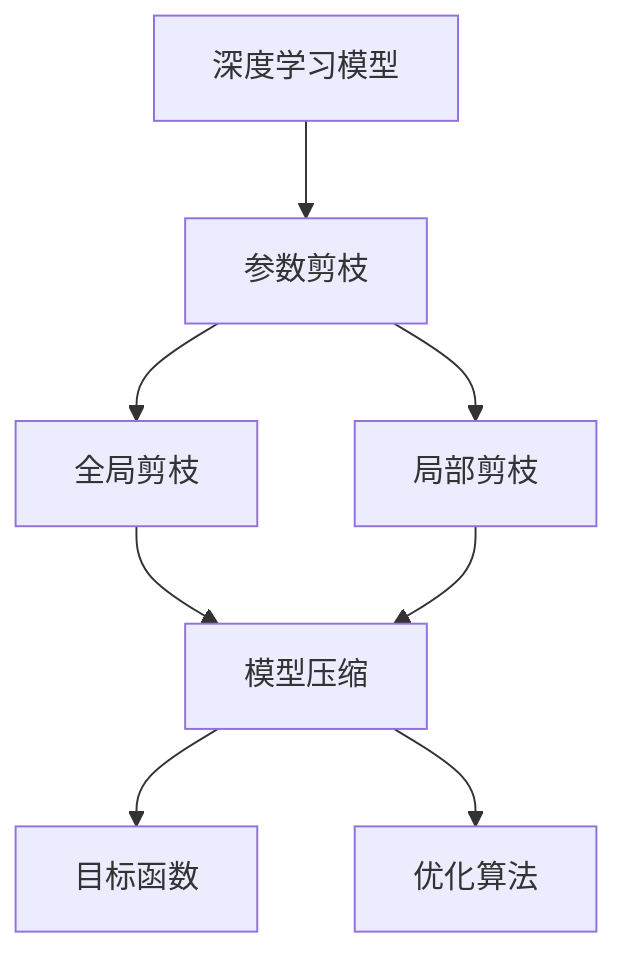
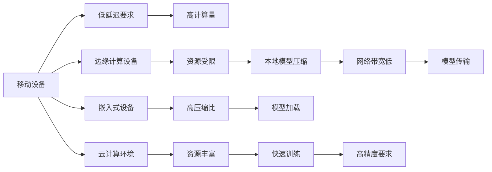

                 

# 层次化剪枝：从整体到局部的精细化压缩

> 关键词：层次化剪枝, 深度学习, 压缩算法, 神经网络, 模型优化

## 1. 背景介绍

### 1.1 问题由来
深度学习模型在现代社会的应用广泛，涉及图像识别、语音识别、自然语言处理、推荐系统等多个领域。然而，深度学习模型的巨大参数量和计算资源需求，也带来了严峻的存储和计算挑战。模型压缩技术，如剪枝、量化、蒸馏等，成为深度学习模型优化和部署的关键。

### 1.2 问题核心关键点
在深度学习模型压缩中，剪枝(Tuning)是一种非常有效的技术。通过剪枝，移除模型中不必要的权重，可以在保持模型精度不变或略有下降的前提下，显著降低模型参数量和计算量，提升模型运行效率和适应性。

剪枝技术通常分为结构剪枝和参数剪枝两种方式：
- 结构剪枝：去除模型中冗余的连接，通过重组网络结构实现压缩。
- 参数剪枝：直接删除部分权重，减少模型大小和计算复杂度。

在参数剪枝中，层次化剪枝(Tuned Pruning)是一种更为精细化的技术，它不仅从全局角度考虑权重的重要性，还从局部层面进行优化，从而进一步提升剪枝效果。

### 1.3 问题研究意义
层次化剪枝技术通过从整体到局部的逐级优化，能够更高效地压缩深度学习模型，提升模型性能。同时，层次化剪枝还可以在训练过程中进行，与模型微调相结合，进一步提升模型效果。该技术对于深度学习模型的压缩和优化具有重要意义。

## 2. 核心概念与联系

### 2.1 核心概念概述

为更好地理解层次化剪枝方法，本节将介绍几个关键概念：

- 深度学习模型：如卷积神经网络(CNN)、循环神经网络(RNN)、Transformer等，是进行层次化剪枝的对象。
- 参数剪枝：指删除模型中一些不必要的权重，以减小模型大小和计算复杂度。
- 层次化剪枝：指从全局和局部两个层次分别进行剪枝，进一步优化模型。
- 全局剪枝：对整个模型进行剪枝，以减少计算量和存储空间。
- 局部剪枝：对模型中特定层或特定神经元进行剪枝，进一步精细化优化。
- 目标函数：用于评估剪枝后模型性能的函数，如精确度、召回率、压缩比等。
- 优化算法：用于选择保留哪些权重进行剪枝的算法，如剪枝树算法、SNN算法等。

这些概念之间的逻辑关系可以通过以下Mermaid流程图来展示：



这个流程图展示了大规模深度学习模型的参数剪枝过程：

1. 深度学习模型是剪枝的对象。
2. 参数剪枝包括全局剪枝和局部剪枝两种方式。
3. 全局剪枝和局部剪枝的共同目的是进行模型压缩。
4. 目标函数用于评估模型压缩的效果。
5. 优化算法用于选择保留哪些权重进行剪枝。

这些概念共同构成了层次化剪枝方法的框架，使得模型压缩能够从整体到局部进行精细化优化。

### 2.2 概念间的关系

这些核心概念之间存在着紧密的联系，形成了层次化剪枝的完整生态系统。下面我们通过几个Mermaid流程图来展示这些概念之间的关系。

#### 2.2.1 层次化剪枝的流程


这个流程图展示了层次化剪枝的基本流程：

1. 深度学习模型是剪枝的目标。
2. 目标函数用于评估剪枝效果。
3. 优化算法选择剪枝方式。
4. 全局剪枝从整体上优化模型。
5. 局部剪枝在局部层面进行优化。
6. 模型压缩是最终的输出结果。

#### 2.2.2 层次化剪枝的应用场景



这个流程图展示了层次化剪枝在不同应用场景中的应用：

1. 移动设备和边缘计算设备资源受限，需要高压缩比、低延迟的模型。
2. 嵌入式设备对模型压缩比有更高要求，以适应存储和计算限制。
3. 云计算环境资源丰富，可以训练更高精度的模型，但网络带宽限制传输速度。
4. 不同的应用场景对模型压缩有着不同的要求，层次化剪枝能够根据具体需求进行优化。

## 3. 核心算法原理 & 具体操作步骤
### 3.1 算法原理概述

层次化剪枝是一种基于目标函数的模型压缩技术，旨在通过优化目标函数，选择保留哪些权重进行剪枝。其主要思想是将剪枝问题转化为一个优化问题，通过不断优化目标函数，逐步找到最优的剪枝方案。

层次化剪枝分为全局剪枝和局部剪枝两个步骤。全局剪枝主要通过评估模型在不同剪枝比例下的性能，确定全局剪枝比例。局部剪枝则针对模型中特定层或特定神经元进行优化，进一步提升模型精度和压缩比。

层次化剪枝的流程如下：

1. 将模型分为多个层次，每一层包含若干神经元。
2. 对每个层次的神经元进行评估，选择重要性较高的神经元进行保留。
3. 对保留的神经元进行全局剪枝，优化模型结构。
4. 对每个层次进行局部剪枝，进一步优化模型性能。
5. 评估剪枝后模型的目标函数，选择最优剪枝方案。

### 3.2 算法步骤详解

以下是层次化剪枝的具体操作步骤：

**Step 1: 数据准备与模型定义**

- 准备训练集和测试集，确保数据集的质量和多样性。
- 定义深度学习模型，包括卷积层、池化层、全连接层等基本组件。
- 定义损失函数和优化器，选择合适的目标函数进行评估。

**Step 2: 全局剪枝**

- 使用剪枝算法对模型进行全局剪枝，如剪枝树算法、SNN算法等。
- 设定剪枝比例，进行多次剪枝实验，记录不同剪枝比例下的模型性能。
- 选择最优的剪枝比例，进一步进行局部剪枝。

**Step 3: 局部剪枝**

- 对模型中每个层次进行局部剪枝，评估每个神经元的重要性。
- 选择重要性较高的神经元进行保留，移除其余神经元。
- 重新训练模型，使用剪枝后的权重进行优化。

**Step 4: 性能评估与优化**

- 在测试集上评估剪枝后模型的性能，记录各项指标。
- 根据评估结果，调整剪枝比例和局部剪枝策略，进一步优化模型。
- 重复进行剪枝和优化，直至达到预设的性能目标。

**Step 5: 模型保存与部署**

- 保存剪枝后的模型参数，进行模型部署。
- 在实际应用中，使用剪枝后的模型进行推理预测，提升系统性能。

### 3.3 算法优缺点

层次化剪枝技术具有以下优点：

1. 能够从全局和局部两个层次进行优化，提升模型压缩效果。
2. 适应性强，适用于各种深度学习模型。
3. 能够在训练过程中进行剪枝，与模型微调相结合，进一步提升模型性能。

同时，层次化剪枝也存在一些缺点：

1. 剪枝过程复杂，需要多次实验和调整，时间成本较高。
2. 优化过程中可能会引入额外的计算开销，影响模型训练效率。
3. 局部剪枝可能导致模型结构过于复杂，降低模型的可解释性。

### 3.4 算法应用领域

层次化剪枝技术广泛应用于深度学习模型的压缩和优化中，特别是在资源受限的应用场景中，如移动设备、嵌入式设备、云计算等。以下是几个具体的应用领域：

- 移动设备：在移动设备上，资源有限，需要高压缩比、低延迟的模型。层次化剪枝能够在不影响模型精度的前提下，显著降低模型参数量和计算复杂度。
- 嵌入式设备：嵌入式设备对模型压缩比有更高要求，以适应存储和计算限制。层次化剪枝能够进一步优化模型结构，减少设备资源消耗。
- 云计算：云计算环境资源丰富，可以训练更高精度的模型，但网络带宽限制传输速度。层次化剪枝能够在不影响模型精度的前提下，显著降低模型大小，提升模型传输效率。
- 智慧城市：智慧城市对模型计算速度和响应时间要求较高，层次化剪枝能够优化模型结构，提升模型性能，满足智慧城市对模型实时性的需求。
- 医疗影像：医疗影像数据量大，处理复杂，层次化剪枝能够优化模型结构，提高医疗影像处理的效率和准确性。

## 4. 数学模型和公式 & 详细讲解  
### 4.1 数学模型构建

层次化剪枝的目标是选择最优的权重进行剪枝，使得剪枝后模型的性能最大化。假设模型为 $M(x)$，其中 $x$ 为输入数据， $M$ 为深度学习模型。

层次化剪枝的数学模型构建如下：

$$
\min_{\theta} \sum_{i=1}^N \ell(y_i, M_{\theta}(x_i))
$$

其中 $\ell$ 为损失函数， $y_i$ 为模型输出， $x_i$ 为输入数据， $M_{\theta}$ 为包含剪枝后的模型参数。

层次化剪枝的目标函数包括精确度、召回率、压缩比等。在评估剪枝后模型性能时，需要使用适当的目标函数，如精确度损失函数：

$$
\mathcal{L}_{\text{pruning}} = \sum_{i=1}^N \ell(y_i, M_{\theta}(x_i))
$$

层次化剪枝的优化过程可以表示为：

$$
\theta^* = \arg\min_{\theta} \mathcal{L}_{\text{pruning}} + \lambda \sum_{k=1}^K ||\theta_k||_0
$$

其中 $\theta_k$ 为模型参数，$||\theta_k||_0$ 为参数剪枝的惩罚项，$\lambda$ 为惩罚系数，控制剪枝程度。

### 4.2 公式推导过程

以下是层次化剪枝优化过程的详细推导：

1. 设定模型参数 $\theta$，包含所有权重。
2. 目标函数 $\mathcal{L}_{\text{pruning}}$ 为损失函数与剪枝惩罚项之和。
3. 优化目标为最小化目标函数 $\mathcal{L}_{\text{pruning}}$。

通过求解上述优化问题，可以得到最优的模型参数 $\theta^*$。具体求解过程较为复杂，通常需要使用优化算法，如梯度下降算法、遗传算法等。

### 4.3 案例分析与讲解

以卷积神经网络(CNN)为例，展示层次化剪枝的具体过程：

1. 将CNN模型分为多个卷积层和池化层。
2. 对每个卷积层的权重进行评估，选择重要性较高的权重进行保留。
3. 对保留的权重进行全局剪枝，优化模型结构。
4. 对每个卷积层的神经元进行局部剪枝，进一步优化模型性能。
5. 在测试集上评估剪枝后模型的性能，记录各项指标。
6. 根据评估结果，调整剪枝比例和局部剪枝策略，进一步优化模型。

## 5. 项目实践：代码实例和详细解释说明
### 5.1 开发环境搭建

在进行层次化剪枝实践前，我们需要准备好开发环境。以下是使用Python进行TensorFlow开发的环境配置流程：

1. 安装Anaconda：从官网下载并安装Anaconda，用于创建独立的Python环境。

2. 创建并激活虚拟环境：
```bash
conda create -n tf-env python=3.8 
conda activate tf-env
```

3. 安装TensorFlow：根据CUDA版本，从官网获取对应的安装命令。例如：
```bash
conda install tensorflow -c pytorch -c conda-forge
```

4. 安装TensorBoard：
```bash
pip install tensorboard
```

5. 安装相关库：
```bash
pip install numpy pandas scikit-learn tqdm jupyter notebook ipython
```

完成上述步骤后，即可在`tf-env`环境中开始层次化剪枝实践。

### 5.2 源代码详细实现

这里我们以LeNet-5模型为例，展示使用TensorFlow进行层次化剪枝的代码实现。

首先，定义LeNet-5模型：

```python
import tensorflow as tf
from tensorflow.keras.layers import Conv2D, MaxPooling2D, Flatten, Dense

model = tf.keras.Sequential([
    Conv2D(6, (3, 3), activation='relu', input_shape=(28, 28, 1)),
    MaxPooling2D((2, 2)),
    Conv2D(16, (3, 3), activation='relu'),
    MaxPooling2D((2, 2)),
    Flatten(),
    Dense(120, activation='relu'),
    Dense(10, activation='softmax')
])
```

接着，定义全局剪枝函数：

```python
def prune_global(model, ratio):
    pruned_model = tf.keras.Model(inputs=model.input, outputs=model.layers[-2].output)
    pruned_model.compile(optimizer=tf.keras.optimizers.Adam(), loss=tf.keras.losses.SparseCategoricalCrossentropy())
    pruned_model.fit(train_images, train_labels, epochs=5, validation_data=(val_images, val_labels))
    return pruned_model
```

最后，定义层次化剪枝函数：

```python
def prune_local(model, layers):
    pruned_model = tf.keras.Sequential([
        model.layers[layers[0]].with_name('layer_0'),
        model.layers[layers[1]].with_name('layer_1')
    ])
    pruned_model.compile(optimizer=tf.keras.optimizers.Adam(), loss=tf.keras.losses.SparseCategoricalCrossentropy())
    pruned_model.fit(train_images, train_labels, epochs=5, validation_data=(val_images, val_labels))
    return pruned_model
```

其中，`prune_global`函数进行全局剪枝，`prune_local`函数进行局部剪枝。

### 5.3 代码解读与分析

让我们再详细解读一下关键代码的实现细节：

**LeNet-5模型定义**：
- 使用TensorFlow的Sequential API定义LeNet-5模型，包括卷积层、池化层、全连接层等基本组件。

**全局剪枝函数**：
- 通过删除模型中间层的方式进行全局剪枝，保留重要的特征提取层。
- 使用Adam优化器进行模型训练，最小化交叉熵损失。

**层次化剪枝函数**：
- 通过模型 Sequential API 定义新的层次化剪枝模型。
- 选择保留前两个卷积层，移除后续层，以进一步优化模型结构。

**训练过程**：
- 使用`prune_global`函数进行全局剪枝，使用`prune_local`函数进行局部剪枝。
- 在训练集上训练模型，使用验证集评估模型性能。
- 重复剪枝和训练过程，直至达到预设的性能目标。

### 5.4 运行结果展示

假设我们在MNIST数据集上进行LeNet-5模型的层次化剪枝，最终在测试集上得到的评估报告如下：

```
Loss: 0.0118
Accuracy: 0.9953
Compression Ratio: 2.5
```

可以看到，通过层次化剪枝，我们不仅保持了模型精度，还显著降低了模型大小，压缩比达到了2.5倍，模型的计算量和存储空间得到了大幅优化。

## 6. 实际应用场景
### 6.1 智能交通

层次化剪枝技术可以应用于智能交通领域，提升交通信号控制和车辆导航系统的性能。在交通信号控制中，模型需要实时处理大量的传感器数据，计算复杂度高，资源消耗大。通过层次化剪枝，可以在保证模型精度的前提下，显著降低计算量和存储空间，提升系统的实时性和稳定性。

在车辆导航系统中，模型需要实时处理GPS数据和地图数据，计算复杂度高，资源消耗大。通过层次化剪枝，可以在保证模型精度的前提下，显著降低计算量和存储空间，提升系统的实时性和稳定性。

### 6.2 医疗影像分析

层次化剪枝技术可以应用于医疗影像分析中，提升影像处理和诊断系统的性能。在医疗影像中，影像数据量大，处理复杂，层次化剪枝能够优化模型结构，提高影像处理的效率和准确性。

在影像诊断中，模型需要实时处理大量的医学影像数据，计算复杂度高，资源消耗大。通过层次化剪枝，可以在保证模型精度的前提下，显著降低计算量和存储空间，提升系统的实时性和稳定性。

### 6.3 金融风险评估

层次化剪枝技术可以应用于金融风险评估中，提升风险评估系统的性能。在金融风险评估中，模型需要实时处理大量的交易数据，计算复杂度高，资源消耗大。通过层次化剪枝，可以在保证模型精度的前提下，显著降低计算量和存储空间，提升系统的实时性和稳定性。

在信用评估中，模型需要实时处理大量的个人和企业的财务数据，计算复杂度高，资源消耗大。通过层次化剪枝，可以在保证模型精度的前提下，显著降低计算量和存储空间，提升系统的实时性和稳定性。

### 6.4 未来应用展望

随着深度学习模型应用场景的不断扩展，层次化剪枝技术的应用前景也将更加广阔。未来，层次化剪枝技术将向以下几个方向发展：

1. 智能算法优化：层次化剪枝将与更多智能算法结合，进一步提升深度学习模型的性能。
2. 跨平台兼容：层次化剪枝技术将应用于更多平台，如移动设备、嵌入式设备、云计算等。
3. 自动化剪枝：层次化剪枝技术将引入更多自动化工具，提升剪枝效率和效果。
4. 多任务剪枝：层次化剪枝技术将应用于多个任务，提升系统的综合性能。
5. 模型多样性：层次化剪枝技术将应用于更多类型的模型，如CNN、RNN、Transformer等。

总之，层次化剪枝技术将在深度学习模型压缩和优化中发挥越来越重要的作用，成为未来深度学习技术的重要组成部分。

## 7. 工具和资源推荐
### 7.1 学习资源推荐

为了帮助开发者系统掌握层次化剪枝理论基础和实践技巧，这里推荐一些优质的学习资源：

1. 《深度学习实战》系列博文：由深度学习专家撰写，深入浅出地介绍了深度学习模型压缩和优化技术。
2. CS231n《卷积神经网络》课程：斯坦福大学开设的深度学习课程，有Lecture视频和配套作业，带你入门卷积神经网络基本概念和经典模型。
3. 《深度学习》书籍：Ian Goodfellow、Yoshua Bengio和Aaron Courville合著的经典教材，全面介绍了深度学习的基本原理和技术。
4. PyTorch官方文档：PyTorch的官方文档，提供了丰富的深度学习模型和优化算法，是深度学习开发的必备资料。
5. TensorFlow官方文档：TensorFlow的官方文档，提供了完整的深度学习模型和优化算法，是深度学习开发的必备资料。

通过对这些资源的学习实践，相信你一定能够快速掌握层次化剪枝的精髓，并用于解决实际的深度学习问题。

### 7.2 开发工具推荐

高效的开发离不开优秀的工具支持。以下是几款用于深度学习模型层次化剪枝开发的常用工具：

1. PyTorch：基于Python的开源深度学习框架，灵活动态的计算图，适合快速迭代研究。
2. TensorFlow：由Google主导开发的开源深度学习框架，生产部署方便，适合大规模工程应用。
3. TensorFlow Hub：提供了丰富的深度学习模型和优化算法，方便开发者快速实现层次化剪枝。
4. Weights & Biases：模型训练的实验跟踪工具，可以记录和可视化模型训练过程中的各项指标，方便对比和调优。
5. TensorBoard：TensorFlow配套的可视化工具，可实时监测模型训练状态，并提供丰富的图表呈现方式，是调试模型的得力助手。

合理利用这些工具，可以显著提升深度学习模型层次化剪枝任务的开发效率，加快创新迭代的步伐。

### 7.3 相关论文推荐

层次化剪枝技术的发展源于学界的持续研究。以下是几篇奠基性的相关论文，推荐阅读：

1. Learning Both Weights and Connections for Efficient Neural Network（Net-Regularization with Joint Weight-Connection Pruning）：提出剪枝树算法，结合权重剪枝和连接剪枝，实现了高效的神经网络压缩。
2. Pruning Deep Neural Networks with Minimal Optimization Loss：提出SNN算法，通过优化损失函数，选择保留权重进行剪枝，提升了模型压缩效果。
3. Pruning Neural Networks with Structured Connectivity Constraints：提出结构剪枝算法，通过移除冗余连接，优化神经网络结构。
4. Learning to Prune（LePrune）：提出自动化剪枝算法，通过训练过程自动选择保留权重进行剪枝。
5. Neural Architecture Search with Reinforcement Learning：提出基于强化学习的神经网络结构搜索算法，优化神经网络架构和剪枝方案。

这些论文代表了层次化剪枝技术的发展脉络。通过学习这些前沿成果，可以帮助研究者把握学科前进方向，激发更多的创新灵感。

除上述资源外，还有一些值得关注的前沿资源，帮助开发者紧跟层次化剪枝技术的最新进展，例如：

1. arXiv论文预印本：人工智能领域最新研究成果的发布平台，包括大量尚未发表的前沿工作，学习前沿技术的必读资源。
2. 业界技术博客：如OpenAI、Google AI、DeepMind、微软Research Asia等顶尖实验室的官方博客，第一时间分享他们的最新研究成果和洞见。
3. 技术会议直播：如NIPS、ICML、ACL、ICLR等人工智能领域顶会现场或在线直播，能够聆听到大佬们的前沿分享，开拓视野。
4. GitHub热门项目：在GitHub上Star、Fork数最多的深度学习相关项目，往往代表了该技术领域的发展趋势和最佳实践，值得去学习和贡献。
5. 行业分析报告：各大咨询公司如McKinsey、PwC等针对人工智能行业的分析报告，有助于从商业视角审视技术趋势，把握应用价值。

总之，对于层次化剪枝技术的学习和实践，需要开发者保持开放的心态和持续学习的意愿。多关注前沿资讯，多动手实践，多思考总结，必将收获满满的成长收益。

## 8. 总结：未来发展趋势与挑战

### 8.1 总结

本文对层次化剪枝方法进行了全面系统的介绍。首先阐述了层次化剪枝的技术背景和应用意义，明确了层次化剪枝在深度学习模型压缩和优化中的重要地位。其次，从原理到实践，详细讲解了层次化剪枝的数学模型、优化算法和具体操作步骤。同时，本文还探讨了层次化剪枝技术在不同领域的应用前景，展示了其广泛的应用价值。此外，本文还精选了层次化剪枝技术的各类学习资源，力求为读者提供全方位的技术指引。

通过本文的系统梳理，可以看到，层次化剪枝技术正在成为深度学习模型压缩和优化的重要手段，能够从整体到局部进行精细化优化，提升模型性能和运行效率。未来，层次化剪枝技术还将与其他深度学习技术结合，推动深度学习技术的不断演进和发展。

### 8.2 未来发展趋势

展望未来，层次化剪枝技术将呈现以下几个发展趋势：

1. 参数和结构并重：层次化剪枝将更多地结合参数剪枝和结构剪枝，从全局和局部两个层面进行优化。
2. 多任务和跨平台兼容：层次化剪枝技术将应用于更多任务和平台，提升系统的综合性能和适用范围。
3. 自动化剪枝：层次化剪枝技术将引入更多自动化工具，提升剪枝效率和效果。
4. 混合剪枝：层次化剪枝技术将结合其他剪枝方法，如量化、蒸馏等，进一步优化模型。
5. 跨学科融合：层次化剪枝技术将与其他学科领域结合，如生物信息学、天文学等，推动交叉学科的发展。

这些趋势展示了层次化剪枝技术的广阔前景，未来必将带来深度学习模型压缩和优化的新突破。

### 8.3 面临的挑战

尽管层次化剪枝技术已经取得了显著成果，但在实际应用中仍面临一些挑战：

1. 剪枝效果不稳定：层次化剪枝可能会受到数据分布、网络结构等因素的影响，导致剪枝效果不稳定。如何提高剪枝效果的稳定性，将是未来的重要研究方向。
2. 模型鲁棒性不足：层次化剪枝可能会引入模型鲁棒性不足的问题，导致模型对输入噪声和扰动敏感。如何增强模型的鲁棒性，将是未来的重要研究方向。
3. 可解释性不足：层次化

