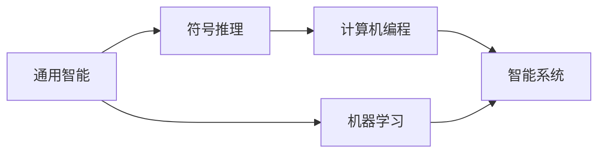

                 

# 1956年达特茅斯会议的影响

## 1. 背景介绍

1956年，“人工智能”（Artificial Intelligence, AI）这一术语首次在学术界被提出，标志着AI学科的诞生。这场重大事件发生在达特茅斯学院，由约翰·麦卡锡（John McCarthy）、马文·明斯基（Marvin Minsky）、克莱夫·约瑟夫（Cliff Shaw）和纳撒尼尔·罗切斯特（Nathaniel Rochester）四位先驱共同发起。本次会议汇集了当时世界顶级计算机科学家和数学家，共同探讨了计算机的通用智能问题。本文将详细探讨达特茅斯会议对人工智能发展的影响，并对其深远意义进行深入分析。

### 1.1 会议背景

1950年代，计算机科学正处于起步阶段，主流研究集中在提高计算速度和编程效率上。然而，计算机界的科学家们开始认识到，机器不仅能执行逻辑推理，还能处理复杂的非结构化信息，如自然语言、音乐和视觉图像。这一认识促使他们思考，能否赋予计算机类似人类的智能，使其能够解决问题和理解复杂的环境。

## 2. 核心概念与联系

### 2.1 核心概念概述

达特茅斯会议提出的“人工智能”概念，本质上是研究如何通过编程和算法，让机器模拟人的智能行为。核心概念包括：

- **通用智能（General Intelligence）**：指机器能够处理各种不同类型的输入，并产生各种不同类型的输出，其本质是模拟人的通用认知能力。
- **符号推理（Symbolic Reasoning）**：使用符号逻辑和规则来模拟人类的推理过程，其核心是使用“if-then”规则进行逻辑判断和决策。
- **计算机编程（Computer Programming）**：以编程语言为基础，通过算法和数据结构实现对计算机的编程控制。
- **机器学习（Machine Learning）**：通过数据训练模型，使机器能够从经验中学习，改进其性能。

这些概念在会议中被系统地提出，为后续AI的发展奠定了基础。

### 2.2 核心概念间的关系

下图展示了核心概念之间的联系：



会议提出了使用计算机编程来实现通用智能的想法，并明确了符号推理和机器学习作为实现手段。通过编程，机器能够执行复杂的逻辑操作，而机器学习则使机器能够从数据中学习，不断提高其智能水平。这些概念相互关联，共同构成了一个完整的AI研究框架。

## 3. 核心算法原理 & 具体操作步骤

### 3.1 算法原理概述

达特茅斯会议标志着人工智能学科的诞生，其核心算法原理和操作步骤包括：

- **符号推理算法**：通过符号逻辑和规则，模拟人类的推理过程。其核心是构建一个知识库，包含事实、规则和推理机制。
- **机器学习算法**：通过统计学习、深度学习等方法，使机器能够从数据中学习，提高其预测和决策能力。

### 3.2 算法步骤详解

**符号推理算法的步骤**：

1. **知识库构建**：将领域知识转换为符号形式，构建知识库。
2. **规则编写**：根据领域知识，编写一系列“if-then”规则。
3. **推理过程**：通过推理机，对知识库和规则进行匹配和应用，产生新的推理结果。
4. **反馈更新**：根据新的推理结果，更新知识库和规则。

**机器学习算法的步骤**：

1. **数据准备**：收集和准备训练数据。
2. **模型选择**：选择合适的机器学习模型（如决策树、神经网络等）。
3. **模型训练**：使用训练数据训练模型，优化模型参数。
4. **模型评估**：使用测试数据评估模型性能，调整模型参数。
5. **模型应用**：在实际应用场景中，使用模型进行预测和决策。

### 3.3 算法优缺点

**符号推理算法的优缺点**：

- **优点**：
  - **明确性**：基于规则的推理过程清晰明确，易于理解和解释。
  - **灵活性**：规则可以根据需求进行调整，适应性强。
  - **可扩展性**：知识库和规则库可以不断扩展，适应新的问题。

- **缺点**：
  - **规则编写复杂**：需要领域专家进行规则编写，工作量大且复杂。
  - **难以处理不确定性**：难以处理模糊、不确定和非结构化信息。

**机器学习算法的优缺点**：

- **优点**：
  - **自适应性**：能够自动从数据中学习，适应新数据和新问题。
  - **性能提升**：通过不断优化模型，性能不断提升。
  - **处理不确定性**：能够处理模糊和非结构化信息。

- **缺点**：
  - **黑箱问题**：模型训练过程复杂，难以理解和解释。
  - **数据依赖**：需要大量标注数据，数据不足时性能难以保证。

### 3.4 算法应用领域

达特茅斯会议提出的AI概念，应用领域广泛，涵盖多个学科：

- **计算机科学**：研究如何通过编程和算法，使机器具备智能。
- **认知科学**：研究人类认知过程，模拟和理解智能。
- **心理学**：研究人类认知和行为，为AI提供心理学基础。
- **语言学**：研究自然语言处理，使机器能够理解、处理和生成自然语言。
- **人工智能伦理**：研究AI技术对社会的影响，提出伦理规范。

## 4. 数学模型和公式 & 详细讲解 & 举例说明

### 4.1 数学模型构建

达特茅斯会议奠定了符号推理和机器学习的数学基础，其核心模型包括：

- **符号逻辑模型**：使用布尔代数和谓词逻辑，表示知识和推理过程。
- **统计学习模型**：使用概率论和统计学，建立模型训练和评估框架。

### 4.2 公式推导过程

**符号逻辑模型的公式推导**：

- **谓词逻辑公式**：$$\forall x (P(x) \rightarrow Q(x))$$
  - 表示对所有x，如果P(x)成立，则Q(x)成立。

- **布尔代数公式**：$$A \lor B$$
  - 表示A或B至少有一个成立。

**统计学习模型的公式推导**：

- **最大似然估计**：$$\hat{\theta} = \arg\max_{\theta} p(x | \theta)$$
  - 表示在给定数据x下，参数θ的最大似然估计。

### 4.3 案例分析与讲解

**符号逻辑案例**：

假设有一个简单的城市规划问题，我们需要判断某个区域是否适合建立新学校。知识库中包含以下规则：

- “如果区域有足够的空间和资源，则适合建立新学校。”
- “如果区域内有足够的教育资源，则适合建立新学校。”

将这些规则表示为符号逻辑公式，并进行推理，得到最终结论。

**统计学习案例**：

假设我们需要训练一个分类器，判断邮件是否为垃圾邮件。收集到大量标记邮件数据，使用朴素贝叶斯模型进行训练和测试，得到分类器的准确率。

## 5. 项目实践：代码实例和详细解释说明

### 5.1 开发环境搭建

**环境配置**：

1. 安装Python和相关库：安装Anaconda和pip安装numpy、pandas、scikit-learn等库。
2. 搭建开发环境：创建虚拟环境，安装相关的AI库和框架，如TensorFlow、PyTorch等。

### 5.2 源代码详细实现

**符号推理代码实现**：

```python
import sympy

# 定义符号
x = sympy.Symbol('x')
y = sympy.Symbol('y')

# 定义规则
rule1 = sympy.And(x > 10, y < 5)
rule2 = sympy.And(x < 5, y > 10)

# 推理过程
result1 = sympy.simplify(rule1)
result2 = sympy.simplify(rule2)

# 输出结果
print(result1)
print(result2)
```

**机器学习代码实现**：

```python
import pandas as pd
from sklearn.model_selection import train_test_split
from sklearn.linear_model import LogisticRegression
from sklearn.metrics import accuracy_score

# 加载数据
data = pd.read_csv('spam.csv')

# 数据预处理
X = data[['feature1', 'feature2']]
y = data['spam']

# 划分训练集和测试集
X_train, X_test, y_train, y_test = train_test_split(X, y, test_size=0.2, random_state=42)

# 模型训练
model = LogisticRegression()
model.fit(X_train, y_train)

# 模型评估
y_pred = model.predict(X_test)
accuracy = accuracy_score(y_test, y_pred)
print(f"Accuracy: {accuracy}")
```

### 5.3 代码解读与分析

**符号推理代码解读**：

- 使用Sympy库定义符号x和y，并定义两个规则。
- 使用And函数将规则组合成复合表达式。
- 使用simplify函数简化表达式，输出推理结果。

**机器学习代码解读**：

- 使用pandas库加载数据。
- 使用train_test_split函数划分训练集和测试集。
- 使用LogisticRegression模型进行训练。
- 使用accuracy_score函数评估模型准确率。

## 6. 实际应用场景

### 6.1 智能客服系统

达特茅斯会议提出的符号推理和机器学习技术，可以用于构建智能客服系统。通过定义知识库和规则，系统能够理解用户意图，自动生成回复。机器学习技术则能够从用户反馈中学习，不断优化系统性能。

### 6.2 医疗诊断系统

医疗诊断系统需要处理大量的医疗知识和病历数据，使用符号推理技术，能够构建知识库，模拟医生的诊断过程。同时，通过机器学习技术，系统可以从历史病例中学习，不断提升诊断准确率。

### 6.3 金融风险评估

金融风险评估需要处理复杂的不确定信息和市场数据。符号推理技术能够构建复杂的决策树和规则，模拟市场行为。机器学习技术则能够从历史数据中学习，预测市场趋势和风险。

### 6.4 未来应用展望

随着技术的不断进步，达特茅斯会议提出的AI概念将在更多领域得到应用，如自动驾驶、智能制造、个性化推荐等。未来AI系统将更加智能、普适，为社会带来深远影响。

## 7. 工具和资源推荐

### 7.1 学习资源推荐

1. 《人工智能：一种现代方法》：全面介绍AI的各个分支和应用，是入门AI的重要参考书籍。
2. 《机器学习》课程（Coursera）：由斯坦福大学教授Andrew Ng开设，深入浅出地讲解机器学习原理和实践。
3. 《符号逻辑与人工智能》：详细介绍符号逻辑和AI的结合应用，是专业领域的必读文献。

### 7.2 开发工具推荐

1. Anaconda：创建和管理虚拟环境，方便安装和调试AI库。
2. Jupyter Notebook：交互式开发环境，方便编写和测试AI代码。
3. TensorFlow和PyTorch：主流AI框架，提供丰富的模型和算法支持。

### 7.3 相关论文推荐

1. "Artificial Intelligence: A Modern Approach"（书籍）：Stuart Russell and Peter Norvig，人工智能领域的经典教材。
2. "Artificial Intelligence: Foundations of Computational Agents"（书籍）：Bradley Fox，介绍AI的决策和推理机制。
3. "The Foundations of Statistical Learning"（书籍）：Gareth James, Daniela Witten, Trevor Hastie, Robert Tibshirani，统计学习的基础理论和应用。

## 8. 总结：未来发展趋势与挑战

### 8.1 研究成果总结

达特茅斯会议提出的AI概念，奠定了符号推理和机器学习的基础，推动了AI技术的快速发展。经过数十年的研究，AI已经广泛应用于各个领域，取得了显著的成就。

### 8.2 未来发展趋势

未来AI技术将继续快速发展，呈现出以下趋势：

1. **深度学习和神经网络**：深度学习技术将成为主流，不断提高模型的性能和精度。
2. **自监督学习和强化学习**：自监督学习和强化学习技术将发挥重要作用，提升模型的泛化能力和自适应性。
3. **多模态智能**：结合视觉、语音、自然语言等多模态数据，实现更加全面和精确的智能系统。
4. **联邦学习和边缘计算**：通过分布式学习和边缘计算，提高AI系统的实时性和安全性。
5. **伦理和隐私保护**：在AI应用中，隐私保护和伦理规范将成为重要课题，确保AI技术的可控和安全。

### 8.3 面临的挑战

尽管AI技术取得了显著进展，但仍面临以下挑战：

1. **数据隐私和安全**：AI系统依赖大量数据，如何保护用户隐私和数据安全成为重要问题。
2. **模型透明性和可解释性**：AI模型的黑箱问题，难以理解和解释，影响应用的可信度。
3. **伦理和社会影响**：AI技术的应用可能带来伦理和社会问题，需要制定相关规范和标准。
4. **跨学科融合**：AI技术需要与其他学科（如认知科学、心理学等）深度融合，提升AI系统的综合能力。
5. **计算资源和算力瓶颈**：大规模模型需要大量计算资源，如何高效利用算力成为重要挑战。

### 8.4 研究展望

未来，AI技术将需要不断突破现有技术瓶颈，解决上述挑战，推动AI技术向更加智能、普适和安全的方向发展。同时，AI研究者需要更加注重跨学科合作，结合多领域知识，构建更加全面和可信的AI系统。

## 9. 附录：常见问题与解答

**Q1: 什么是符号推理和机器学习？**

A: 符号推理是指使用符号逻辑和规则，模拟人类推理过程的计算模型。机器学习则是指使用数据和算法，使机器能够从经验中学习，提升性能的计算模型。

**Q2: 符号推理和机器学习有何区别？**

A: 符号推理强调规则和逻辑的明确性，适合解决结构化问题。机器学习则依赖数据和算法，能够处理模糊和非结构化信息，适合解决复杂和多变的问题。

**Q3: 符号推理在实际应用中有哪些挑战？**

A: 符号推理面临的主要挑战包括：规则编写复杂、难以处理不确定性和模糊信息。

**Q4: 机器学习在实际应用中有哪些优势？**

A: 机器学习具有自适应性强、性能提升显著、能够处理不确定性等优势。

**Q5: 达特茅斯会议对人工智能发展有何深远影响？**

A: 达特茅斯会议标志着AI学科的诞生，奠定了符号推理和机器学习的基础，推动了AI技术的快速发展。

总之，达特茅斯会议对人工智能发展的深远影响，奠定了符号推理和机器学习的基础，推动了AI技术的快速发展。未来，AI技术将继续在各个领域发挥重要作用，提升人类生产和生活质量。

