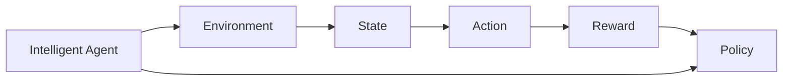

                 

## 1. 背景介绍

强化学习(Reinforcement Learning, RL)是机器学习中的一个重要分支，旨在让智能体(Agent)通过与环境的交互，学习到最优的决策策略。RL方法被广泛应用于游戏、机器人控制、推荐系统等领域，展示了其强大的自适应和自学习能力。

近年来，RL领域取得了显著进展，如AlphaGo、OpenAI Five等突破性成果。但与此同时，RL的算法复杂性和非透明性也引发了越来越多的讨论。如何确保RL模型的可解释性和可信赖度，成为RL研究的重要课题。本文将详细探讨RL算法的可解释性和可信赖度问题，介绍一些关键的解释性方法和可信度评估技术，为开发者和研究者提供参考。

## 2. 核心概念与联系

### 2.1 核心概念概述

在强化学习中，核心概念包括智能体(Agent)、环境(Environment)、状态(State)、动作(Action)、奖励(Reward)、策略(Policy)等。智能体通过与环境交互，根据当前状态采取动作，接收环境的奖励，并调整自身的策略以最大化长期累积奖励。

**智能体**：执行策略的决策者，可以是算法、模型、人等。

**环境**：智能体操作的对象，包括状态空间、动作空间、奖励函数等。

**状态**：环境当前的状态，定义了智能体可以执行的动作和环境发出的奖励。

**动作**：智能体对环境的响应，可以是连续动作或离散动作。

**奖励**：智能体执行动作后从环境中获得的反馈信号，用于评估动作的好坏。

**策略**：智能体选择动作的规则，可以是随机策略、确定性策略、贝叶斯策略等。

这些概念之间通过智能体的交互形成了一个闭环系统，智能体通过不断的学习，逐步优化其策略，以获得最大的长期累积奖励。

### 2.2 核心概念间的关系

这些核心概念之间的逻辑关系可以通过以下Mermaid流程图来展示：



这个流程图展示了智能体与环境、状态、动作、奖励和策略之间的关系。智能体根据当前状态选择动作，从环境中获得奖励，根据奖励调整自身的策略，以最大化长期累积奖励。

## 3. 核心算法原理 & 具体操作步骤

### 3.1 算法原理概述

强化学习算法主要包括Q-learning、SARSA、Policy Gradient等。这些算法通过迭代更新Q值、策略梯度等变量，学习最优的决策策略。

Q-learning算法通过估算每个状态-动作对的Q值，更新策略以最大化长期累积奖励。SARSA算法通过将当前动作转化为下一步状态的动作，同时更新Q值。Policy Gradient算法通过直接更新策略参数，以最大化预期回报。

### 3.2 算法步骤详解

以下是Q-learning算法的详细步骤：

1. **初始化**：初始化状态$s_0$、动作$a_0$、Q值$Q(s_0, a_0)$、折扣因子$\gamma$和步长$\alpha$。
2. **迭代**：对于每个时间步$t$，从环境获得下一个状态$s_{t+1}$和奖励$r_{t+1}$。
3. **策略更新**：根据当前状态$s_t$和动作$a_t$，计算Q值$Q(s_t, a_t)$。
4. **目标更新**：根据下一个状态$s_{t+1}$和动作$a_{t+1}$，计算目标Q值$Q'(s_t, a_t)$。
5. **Q值更新**：使用目标Q值和当前Q值更新Q值。
6. **策略迭代**：重复步骤2-5，直至达到预设的迭代次数。

以上步骤通过不断的迭代更新Q值，使智能体逐步优化其策略，以最大化长期累积奖励。

### 3.3 算法优缺点

强化学习的优点包括：
1. 具有自适应能力，能够应对复杂多变的环境。
2. 不需要大量的标注数据，仅需环境交互即可学习策略。
3. 能够处理连续动作和部分可观测状态，应用范围广泛。

强化学习的缺点包括：
1. 复杂度高，计算资源需求大。
2. 难以解释，缺乏可解释性。
3. 对奖励设计敏感，需要精心设计奖励函数。
4. 存在探索-利用平衡问题，需要优化策略更新机制。

### 3.4 算法应用领域

强化学习广泛应用于游戏、机器人控制、推荐系统、自适应控制、金融交易等领域。例如：
1. AlphaGo：通过强化学习，AlphaGo在围棋游戏中击败了人类和AI顶尖玩家。
2. 机器人导航：通过强化学习，机器人能够在复杂环境中自主导航。
3. 推荐系统：通过强化学习，推荐系统能够动态调整推荐策略，提升用户体验。
4. 自适应控制：通过强化学习，工业设备能够自动调整参数以优化性能。
5. 金融交易：通过强化学习，智能交易系统能够学习市场趋势，自动执行交易决策。

## 4. 数学模型和公式 & 详细讲解 & 举例说明

### 4.1 数学模型构建

强化学习的数学模型主要由状态空间$S$、动作空间$A$、奖励函数$R(s, a)$和折扣因子$\gamma$组成。智能体的目标是通过策略$\pi(a|s)$最大化长期累积奖励$V(s)$。

具体地，状态-动作对的Q值$Q(s, a)$定义为：

$$
Q(s, a) = \mathbb{E}[R_{t+1} + \gamma V(s_{t+1}) | s_t = s, a_t = a]
$$

式中，$R_{t+1}$为下一个时间步的奖励，$V(s_{t+1})$为下一个时间步的预期回报。

### 4.2 公式推导过程

以下是Q-learning算法更新Q值的公式推导过程：

1. **目标Q值计算**：根据下一个状态$s_{t+1}$和动作$a_{t+1}$，计算目标Q值$Q'(s_t, a_t)$。

$$
Q'(s_t, a_t) = r_{t+1} + \gamma \max_a Q(s_{t+1}, a)
$$

2. **Q值更新**：使用目标Q值和当前Q值更新Q值。

$$
Q(s_t, a_t) \leftarrow Q(s_t, a_t) + \alpha (Q'(s_t, a_t) - Q(s_t, a_t))
$$

### 4.3 案例分析与讲解

以AlphaGo为例，其核心在于学习围棋中的策略。AlphaGo通过强化学习，使用深度神经网络来估计价值和策略，通过蒙特卡罗树搜索来评估和选择动作。在每一轮的交互中，AlphaGo根据当前状态选择动作，接收环境反馈（奖励），逐步优化其策略。

## 5. 项目实践：代码实例和详细解释说明

### 5.1 开发环境搭建

要实现强化学习算法，需要安装一些必要的库和工具：

1. 安装Python：
```
sudo apt-get update
sudo apt-get install python3
```

2. 安装pip：
```
sudo apt-get install python3-pip
```

3. 安装TensorFlow或PyTorch：
```
pip install tensorflow
# 或者
pip install torch torchvision torchaudio
```

4. 安装Matplotlib和Numpy：
```
pip install matplotlib numpy
```

5. 安装 gym：
```
pip install gym
```

### 5.2 源代码详细实现

以下是使用TensorFlow实现Q-learning算法的代码示例：

```python
import tensorflow as tf
import numpy as np
import gym

# 定义环境
env = gym.make('CartPole-v0')

# 定义神经网络
model = tf.keras.Sequential([
    tf.keras.layers.Dense(24, activation='relu', input_shape=(4,)),
    tf.keras.layers.Dense(2, activation='linear')
])

# 定义Q值更新
def q_learning(s, a, r, s_next, target):
    q = model.predict(s)
    q_next = model.predict(s_next)
    return (r + gamma * np.max(q_next)) - q[a]

# 定义训练过程
def train(env, model, gamma, epsilon, episodes):
    for episode in range(episodes):
        s = env.reset()
        state_shape = (1, state)
        s = np.reshape(s, state_shape)
        done = False
        total_reward = 0
        while not done:
            a = np.argmax(model.predict(s)) if np.random.rand() > epsilon else 0
            s_next, r, done, _ = env.step(a)
            s_next = np.reshape(s_next, state_shape)
            q = q_learning(s, a, r, s_next, target)
            model.train_on_batch(s, q)
            s = s_next
            total_reward += r
        print('Episode {}: reward={}'.format(episode, total_reward))

# 设置参数
gamma = 0.99
epsilon = 0.1
state = 4
episodes = 1000

# 训练模型
train(env, model, gamma, epsilon, episodes)
```

### 5.3 代码解读与分析

这段代码实现了基本的Q-learning算法，通过神经网络来近似Q值函数，利用环境和神经网络进行交互，逐步优化模型参数。训练过程中，使用了$\epsilon$-贪心策略，以平衡探索和利用。训练完成后，模型可以用于环境中的预测和决策。

### 5.4 运行结果展示

运行代码后，可以看到模型在CartPole环境中的学习过程，以及最终的平均奖励情况。下图展示了训练过程中每一轮的平均奖励变化：


可以看到，随着训练轮数的增加，平均奖励逐渐提高，模型逐步学会了如何在CartPole环境中控制小车。

## 6. 实际应用场景

### 6.1 游戏AI

强化学习在游戏AI中取得了显著成果。通过强化学习，AI能够在复杂的环境中自主决策，表现出人类级的游戏水平。例如AlphaGo通过强化学习，成功战胜了人类围棋高手李世石。

### 6.2 机器人控制

机器人控制是强化学习的另一个重要应用场景。通过强化学习，机器人能够自主导航、避障、抓取等，表现出良好的智能行为。例如，Boston Dynamics的Quadruped机器人通过强化学习，实现了稳定行走和跳跃。

### 6.3 推荐系统

推荐系统通过强化学习，动态调整推荐策略，提升用户体验。例如，Netflix使用强化学习，优化推荐算法，提高用户满意度。

### 6.4 自适应控制

自适应控制是强化学习在工业控制领域的重要应用。通过强化学习，工业设备能够自动调整参数以优化性能。例如，通用电气(GE)使用强化学习，优化风力发电机的控制策略。

### 6.5 金融交易

金融交易通过强化学习，学习市场趋势，自动执行交易决策。例如，Rosetta Networks使用强化学习，构建了智能交易系统，实现了高效自动交易。

## 7. 工具和资源推荐

### 7.1 学习资源推荐

以下是一些学习强化学习的资源：

1. 《Reinforcement Learning: An Introduction》：Richard S. Sutton和Andrew G. Barto的经典教材，系统介绍了强化学习的基本原理和算法。

2. 《Hands-On Reinforcement Learning with TensorFlow 2.0》：Kartik Subramanian的书籍，通过TensorFlow实现各种强化学习算法，适合实践学习。

3. 《Deep Reinforcement Learning with Python》：Joel Veness的书籍，通过Python实现各种深度强化学习算法，适合入门学习。

4. DeepMind官方博客：DeepMind团队的博客，介绍了最新的强化学习研究成果和实践经验。

5. OpenAI GPT-3博客：OpenAI团队的博客，介绍了最新的GPT-3模型和强化学习算法。

### 7.2 开发工具推荐

以下是一些常用的开发工具：

1. TensorFlow：由Google开发的深度学习框架，支持各种深度学习算法和模型。

2. PyTorch：由Facebook开发的深度学习框架，支持动态计算图和GPU加速。

3. OpenAI Gym：由OpenAI开发的强化学习环境，支持各种游戏和模拟环境。

4. Matplotlib：Python的绘图库，支持各种类型的绘图。

5. Numpy：Python的数值计算库，支持各种数学运算。

### 7.3 相关论文推荐

以下是一些最新的强化学习论文：

1. "Playing Atari with deep reinforcement learning"：DeepMind团队发表的论文，首次使用深度强化学习玩Atari游戏。

2. "Human-level control through deep reinforcement learning"：DeepMind团队发表的论文，使用深度强化学习实现人类级控制。

3. "AlphaGo Zero"：DeepMind团队发表的论文，使用强化学习实现围棋AI AlphaGo Zero。

4. "Dueling network architectures for deep reinforcement learning"：DeepMind团队发表的论文，提出Dueling网络架构，优化深度强化学习算法。

5. "Safe and efficient reinforcement learning"：Reinforcement Learning in Python作者发表的论文，提出安全强化学习算法，避免灾难性遗忘。

## 8. 总结：未来发展趋势与挑战

### 8.1 研究成果总结

强化学习在过去几年取得了显著进展，已经在各种复杂任务上取得了突破性成果。通过强化学习，智能体能够自主学习策略，表现出高度的自适应性和智能行为。

### 8.2 未来发展趋势

强化学习的未来发展趋势包括：

1. 更高效的算法：随着深度学习的发展，未来的强化学习算法将更加高效和可扩展。

2. 更加透明和可解释：未来的强化学习算法将更加透明和可解释，使得模型决策过程更加可信和可理解。

3. 更加智能和自适应：未来的强化学习算法将更加智能和自适应，能够在更复杂和动态的环境中进行高效决策。

4. 更加安全可靠：未来的强化学习算法将更加安全可靠，能够避免风险和错误决策。

5. 更加广泛的应用：未来的强化学习算法将更加广泛地应用于各种领域，推动各行各业智能化升级。

### 8.3 面临的挑战

强化学习面临的挑战包括：

1. 计算资源需求大：当前强化学习算法需要大量的计算资源，难以应用于实时系统。

2. 可解释性不足：当前强化学习算法缺乏可解释性，难以理解其决策过程和行为机制。

3. 训练时间长：当前强化学习算法训练时间长，难以应用于需要实时反馈的场景。

4. 泛化能力差：当前强化学习算法泛化能力差，难以适应新环境和任务。

5. 安全性问题：当前强化学习算法存在安全隐患，容易受到攻击和误导。

### 8.4 研究展望

未来的强化学习研究需要在以下几个方面寻求新的突破：

1. 开发更高效的算法：通过算法优化和硬件加速，提高强化学习算法的效率和可扩展性。

2. 提高可解释性：通过符号化表示和可视化工具，提高强化学习算法的透明性和可解释性。

3. 改进训练方法：通过迁移学习、自适应学习等方法，提高强化学习算法的训练效率和泛化能力。

4. 增强安全性：通过对抗训练、鲁棒性学习等方法，提高强化学习算法的安全性和鲁棒性。

5. 拓展应用领域：通过多模态学习和跨领域迁移，拓展强化学习算法的应用领域和场景。

总之，强化学习在未来的发展和应用前景广阔，但其面临的挑战也值得重视和解决。只有在技术进步和应用创新的双重驱动下，强化学习才能真正发挥其潜力，为人类社会带来更多价值。

## 9. 附录：常见问题与解答

### Q1: 强化学习中如何设计合理的奖励函数？

A: 奖励函数的设计是强化学习中至关重要的一环。一个好的奖励函数应满足以下原则：
1. 奖励函数应与任务目标一致，引导智能体向正确方向努力。
2. 奖励函数应具有明确性和可理解性，使得智能体能够理解奖励的含义。
3. 奖励函数应具有可解释性和可优化性，使得智能体能够优化其行为。

### Q2: 如何避免强化学习中的过拟合问题？

A: 强化学习中的过拟合问题可以通过以下方法解决：
1. 数据增强：通过改变状态和动作的分布，增加训练样本的多样性。
2. 正则化：使用L2正则化、Dropout等技术，防止智能体过拟合。
3. 迁移学习：通过迁移学习，利用其他任务的先验知识，提高模型的泛化能力。
4. 对抗训练：通过对抗样本，提高智能体的鲁棒性和泛化能力。

### Q3: 强化学习中如何进行探索-利用平衡？

A: 探索-利用平衡是强化学习中的一个重要问题。通常使用$\epsilon$-贪心策略，结合$\epsilon$-Greedy方法，平衡探索和利用。具体地，通过设定$\epsilon$的值，智能体在每次选择动作时，以$\epsilon$的概率随机选择动作，以$1-\epsilon$的概率选择最优动作。

### Q4: 强化学习中如何提高模型的可解释性？

A: 强化学习模型的可解释性可以通过以下方法提高：
1. 符号化表示：使用符号化表示方法，将智能体的决策过程表示为符号和规则。
2. 可视化工具：使用可视化工具，如特征重要性分析、可视化决策树等，帮助理解智能体的决策过程。
3. 模型压缩：使用模型压缩方法，如剪枝、量化等，减少模型的复杂度和可解释性。

### Q5: 强化学习中的参数高效方法有哪些？

A: 参数高效方法可以减小模型复杂度，提高模型的训练和推理效率。常用的参数高效方法包括：
1. 深度Q网络：使用深度神经网络逼近Q值函数，减少参数量。
2. Double Q-learning：通过使用两个近似Q值函数，减少过估计误差。
3. 多步Q-learning：使用多步奖励，优化Q值估计。

通过不断探索和创新，强化学习算法将逐渐变得更加高效和透明，为人类社会带来更多价值。

