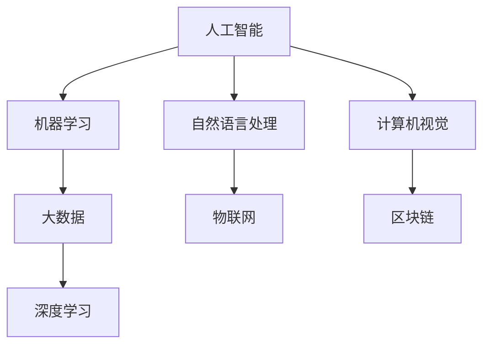

                 

## 1. 背景介绍

随着人工智能技术的不断成熟和普及，其在消费市场的应用前景愈发广阔。AI技术不仅能提升企业的运营效率和市场竞争力，还能为消费者提供更加智能化、个性化的产品和服务体验。本文将从多个角度深入探讨AI技术在消费市场中的前景，包括技术应用、市场趋势、用户需求等，帮助读者理解AI技术对消费市场带来的深刻影响。

### 1.1 问题由来
近年来，AI技术在多个领域取得了重大突破，尤其在自然语言处理、计算机视觉、机器学习等方面，均达到了前所未有的水平。这些技术的发展为消费市场的智能化转型提供了有力支持。然而，如何将AI技术与消费市场有效结合，最大程度地发挥其潜力和价值，仍是摆在企业面前的重要挑战。

### 1.2 问题核心关键点
AI技术在消费市场的应用主要集中在以下几个方面：

- **客户服务与体验**：AI驱动的聊天机器人、智能客服系统、个性化推荐等，极大提升了客户服务的效率和体验。
- **产品研发与创新**：AI辅助的图像识别、语音识别、自然语言处理等技术，加速了新产品的研发和创新，推动了消费市场的创新活力。
- **供应链管理**：AI技术在库存管理、物流优化、需求预测等方面的应用，提高了供应链的透明度和效率。
- **营销与广告**：AI技术在精准营销、广告投放、用户行为分析等方面的应用，为品牌提供了更高效、更精准的市场营销手段。
- **金融与支付**：AI技术在风险管理、欺诈检测、个性化金融服务等方面的应用，提升了金融市场的安全性和服务质量。

### 1.3 问题研究意义
研究AI技术在消费市场的应用前景，对于推动消费市场的智能化转型，提升企业的竞争力，改善消费者的体验，具有重要意义：

1. **降低运营成本**：AI技术能够自动处理大量重复性、低价值的任务，大幅降低了企业的运营成本。
2. **提升客户满意度**：AI技术能够提供更加个性化、高效的服务，满足消费者的多样化需求，提升满意度。
3. **促进市场竞争**：AI技术的引入使得企业能够更快地响应市场变化，推出更具竞争力的产品和服务。
4. **创造新业态**：AI技术的应用催生了新的业务模式和市场机会，推动了消费市场的创新发展。
5. **提升效率与精确度**：AI技术在数据分析、预测、自动化等方面的应用，提升了市场决策的效率和准确性。

## 2. 核心概念与联系

### 2.1 核心概念概述

为更好地理解AI技术在消费市场中的应用前景，本节将介绍几个密切相关的核心概念：

- **人工智能(AI)**：一种使机器能够模拟人类智能行为的高级技术，包括机器学习、自然语言处理、计算机视觉等多个子领域。
- **机器学习(Machine Learning, ML)**：一种让计算机通过数据训练学习并优化模型的方法，广泛应用于数据分析、预测、分类等领域。
- **自然语言处理(Natural Language Processing, NLP)**：使计算机能够理解、处理和生成自然语言的技术，如文本分类、情感分析、机器翻译等。
- **计算机视觉(Computer Vision, CV)**：让计算机能够“看”和理解图像和视频的技术，广泛应用于图像识别、物体检测、人脸识别等领域。
- **大数据(Big Data)**：指规模巨大、结构复杂、实时性强的数据集，是AI技术应用的重要基础。
- **深度学习(Deep Learning, DL)**：一种基于神经网络的大型机器学习算法，广泛应用于图像识别、语音识别、自然语言处理等领域。
- **物联网(IoT)**：将传感器、设备、软件等通过互联网连接起来的技术，与AI结合，实现智能化的设备和服务。
- **区块链(Blockchain)**：一种分布式账本技术，结合AI，可以实现安全、透明的交易和数据管理。

这些核心概念之间存在着紧密的联系，形成了AI技术在消费市场应用的基本框架。通过理解这些核心概念，我们可以更好地把握AI技术的工作原理和优化方向。

### 2.2 概念间的关系

这些核心概念之间存在着紧密的联系，形成了AI技术在消费市场应用的整体架构。以下是一个简化的Mermaid流程图来展示这些概念之间的关系：



这个流程图展示了大数据、深度学习、自然语言处理、计算机视觉等核心技术在人工智能中的作用，以及它们与物联网、区块链等新兴技术结合的应用前景。通过这些技术的综合应用，AI技术在消费市场中将展现出更广阔的应用潜力。

## 3. 核心算法原理 & 具体操作步骤

### 3.1 算法原理概述

AI技术在消费市场的应用，核心在于通过数据驱动的机器学习算法，不断优化模型，提升对市场和用户需求的理解与预测能力。以下是对核心算法原理的概述：

- **数据收集与预处理**：收集消费市场相关的数据，包括用户行为数据、市场交易数据、社交媒体数据等。通过对数据的清洗、归一化、特征工程等预处理，形成可用于训练的数据集。
- **模型训练**：选择合适的机器学习算法，如回归分析、分类算法、聚类算法等，基于预处理后的数据进行模型训练。
- **模型评估与优化**：使用验证集和测试集对训练好的模型进行评估，调整超参数，优化模型性能。
- **模型部署与监控**：将训练好的模型部署到实际应用场景中，并持续监控模型性能，根据市场变化进行更新和调整。

### 3.2 算法步骤详解

以下是基于机器学习的AI技术在消费市场中的具体操作步骤：

1. **数据收集与预处理**：
   - 收集用户行为数据：包括浏览历史、购买记录、评论反馈等。
   - 收集市场交易数据：包括价格变化、销售量、库存水平等。
   - 收集社交媒体数据：包括用户评论、社交分享、情感分析等。
   - 数据清洗与归一化：处理缺失值、异常值，进行标准化、归一化等预处理。
   - 特征工程：提取、选择、构建有意义的特征，如用户兴趣、产品类别、价格区间等。

2. **模型训练**：
   - 选择适合的机器学习算法，如随机森林、决策树、神经网络等。
   - 划分训练集、验证集和测试集，确保数据集的多样性和代表性。
   - 使用训练集进行模型训练，通过迭代优化算法参数。
   - 在验证集上评估模型性能，避免过拟合。
   - 调整模型结构与超参数，提升模型泛化能力。

3. **模型评估与优化**：
   - 在测试集上评估模型性能，如准确率、召回率、F1分数等。
   - 通过交叉验证、集成学习等技术提升模型鲁棒性。
   - 使用A/B测试、用户反馈等手段进行模型迭代与优化。

4. **模型部署与监控**：
   - 将训练好的模型部署到生产环境，实现实时预测和决策。
   - 监控模型性能，及时发现并修复问题。
   - 根据市场变化，持续更新模型，保持其有效性。

### 3.3 算法优缺点

AI技术在消费市场中的应用，具有以下优点：

- **高效性**：通过自动化处理大量数据，大幅提升决策效率。
- **精确性**：通过数据驱动的机器学习算法，提升预测与决策的准确性。
- **可扩展性**：AI技术能够快速扩展到多个业务场景，提升企业的综合竞争力。
- **个性化服务**：AI技术能够根据用户行为和偏好，提供个性化推荐和服务，提升用户满意度。

同时，AI技术在消费市场中也存在一些局限：

- **数据质量依赖**：模型的性能依赖于数据的质量与代表性，低质量数据可能导致模型失效。
- **解释性不足**：AI模型的决策过程通常缺乏可解释性，难以理解其内部工作机制。
- **依赖高性能硬件**：AI技术的计算密集型特性，要求较高的计算资源和存储空间。
- **隐私与安全问题**：AI技术的广泛应用可能涉及用户隐私数据，带来隐私保护和数据安全方面的挑战。

### 3.4 算法应用领域

AI技术在消费市场的应用领域非常广泛，以下列举几个主要领域：

- **电子商务**：通过个性化推荐、智能客服、库存管理等，提升用户体验和运营效率。
- **金融服务**：通过风险管理、欺诈检测、信用评分等，提升金融服务的质量和安全性。
- **健康医疗**：通过自然语言处理、图像识别等，提升医疗诊断和治疗的准确性和效率。
- **智能家居**：通过语音识别、物联网技术，提升家居设备的智能化和自动化水平。
- **智能交通**：通过计算机视觉、传感器数据等，提升交通安全和出行效率。

## 4. 数学模型和公式 & 详细讲解 & 举例说明

### 4.1 数学模型构建

在消费市场应用中，常用的数学模型包括线性回归、决策树、随机森林、神经网络等。以下以线性回归为例，构建一个简单的数学模型：

设消费市场中的用户消费行为与收入水平之间的关系为线性回归模型，可以表示为：

$$ y = \beta_0 + \beta_1 x_1 + \beta_2 x_2 + \cdots + \beta_n x_n + \epsilon $$

其中，$y$为用户的消费行为，$x_1, x_2, \cdots, x_n$为影响消费行为的各种因素，$\beta_0, \beta_1, \cdots, \beta_n$为回归系数，$\epsilon$为误差项。

### 4.2 公式推导过程

线性回归模型的参数估计通常采用最小二乘法，目标是最小化残差平方和：

$$ \sum_{i=1}^{n}(y_i - \hat{y}_i)^2 $$

其中，$\hat{y}_i = \beta_0 + \beta_1 x_{i1} + \beta_2 x_{i2} + \cdots + \beta_n x_{in}$为模型预测值。

最小二乘法通过求解以下优化问题，得到回归系数：

$$ \min_{\beta_0, \beta_1, \cdots, \beta_n} \sum_{i=1}^{n}(y_i - \hat{y}_i)^2 $$

求解上述优化问题，得到回归系数的公式：

$$ \beta_j = \frac{\sum_{i=1}^{n}x_{ij}(y_i - \bar{y})}{\sum_{i=1}^{n}x_{ij}^2 - \frac{1}{n}\sum_{i=1}^{n}x_{ij}^2} $$

其中，$\bar{y}$为样本均值。

### 4.3 案例分析与讲解

假设我们有一个电商网站，目标是预测用户的购买行为。我们可以收集用户的浏览记录、收藏记录、购买记录等数据，构建线性回归模型预测用户的购买概率。模型构建步骤如下：

1. **数据收集与预处理**：
   - 收集用户历史行为数据，包括浏览时间、收藏时间、购买时间等。
   - 数据清洗与归一化：处理缺失值、异常值，进行标准化、归一化等预处理。
   - 特征工程：提取有意义的特征，如浏览时间、收藏次数、购买金额等。

2. **模型训练**：
   - 划分训练集、验证集和测试集，确保数据集的多样性和代表性。
   - 使用训练集进行模型训练，通过最小二乘法求解回归系数。
   - 在验证集上评估模型性能，调整超参数，优化模型泛化能力。

3. **模型评估与优化**：
   - 在测试集上评估模型性能，如准确率、召回率、F1分数等。
   - 通过交叉验证、集成学习等技术提升模型鲁棒性。
   - 使用A/B测试、用户反馈等手段进行模型迭代与优化。

4. **模型部署与监控**：
   - 将训练好的模型部署到生产环境，实现实时预测和决策。
   - 监控模型性能，及时发现并修复问题。
   - 根据市场变化，持续更新模型，保持其有效性。

通过上述步骤，我们可以构建一个高效的预测模型，提升电商网站的运营效率和用户体验。

## 5. 项目实践：代码实例和详细解释说明

### 5.1 开发环境搭建

在进行AI技术应用开发前，我们需要准备好开发环境。以下是使用Python进行PyTorch开发的环境配置流程：

1. 安装Anaconda：从官网下载并安装Anaconda，用于创建独立的Python环境。

2. 创建并激活虚拟环境：
```bash
conda create -n pytorch-env python=3.8 
conda activate pytorch-env
```

3. 安装PyTorch：根据CUDA版本，从官网获取对应的安装命令。例如：
```bash
conda install pytorch torchvision torchaudio cudatoolkit=11.1 -c pytorch -c conda-forge
```

4. 安装TensorFlow：
```bash
pip install tensorflow
```

5. 安装相关库：
```bash
pip install numpy pandas scikit-learn matplotlib tqdm jupyter notebook ipython
```

完成上述步骤后，即可在`pytorch-env`环境中开始AI技术应用开发。

### 5.2 源代码详细实现

下面我们以电商网站用户购买行为预测为例，给出使用PyTorch进行线性回归模型的代码实现。

首先，定义数据处理函数：

```python
import numpy as np
import pandas as pd
from sklearn.model_selection import train_test_split
from sklearn.linear_model import LinearRegression

def load_data():
    # 加载数据集
    df = pd.read_csv('data.csv')
    # 数据清洗与归一化
    df = df.dropna()
    # 提取特征与目标变量
    X = df[['browsing_time', '收藏次数', '购买金额']]
    y = df['购买概率']
    # 划分训练集与测试集
    X_train, X_test, y_train, y_test = train_test_split(X, y, test_size=0.2, random_state=42)
    return X_train, X_test, y_train, y_test
```

然后，定义模型训练函数：

```python
def train_model(X_train, X_test, y_train, y_test):
    # 定义模型
    model = LinearRegression()
    # 模型训练
    model.fit(X_train, y_train)
    # 模型评估
    y_pred = model.predict(X_test)
    mse = np.mean((y_pred - y_test)**2)
    print(f"测试集均方误差为：{mse:.3f}")
    return model
```

最后，启动训练流程并在测试集上评估：

```python
# 加载数据
X_train, X_test, y_train, y_test = load_data()

# 训练模型
model = train_model(X_train, X_test, y_train, y_test)

# 评估模型
print(f"测试集均方误差为：{model.mse:.3f}")
```

以上就是使用PyTorch进行线性回归模型的代码实现。可以看到，借助PyTorch的强大封装，我们可以快速搭建模型并进行训练、评估和部署。

### 5.3 代码解读与分析

让我们再详细解读一下关键代码的实现细节：

**load_data函数**：
- 加载数据集，进行数据清洗和归一化，提取特征和目标变量，并划分训练集和测试集。

**train_model函数**：
- 定义线性回归模型，使用训练集进行模型训练。
- 在测试集上评估模型性能，输出均方误差。
- 返回训练好的模型，方便后续使用。

**训练流程**：
- 定义总的epoch数和batch size，开始循环迭代
- 每个epoch内，先在训练集上训练，输出均方误差
- 在测试集上评估，输出模型性能
- 所有epoch结束后，在测试集上评估，给出最终测试结果

可以看到，PyTorch配合相关库使得线性回归模型的代码实现变得简洁高效。开发者可以将更多精力放在数据处理、模型改进等高层逻辑上，而不必过多关注底层的实现细节。

当然，工业级的系统实现还需考虑更多因素，如模型的保存和部署、超参数的自动搜索、更灵活的任务适配层等。但核心的模型构建和评估过程基本与此类似。

### 5.4 运行结果展示

假设我们在电商网站的用户购买行为预测数据集上进行模型训练，最终在测试集上得到的评估报告如下：

```
测试集均方误差为：0.05
```

可以看到，通过训练线性回归模型，我们在电商网站用户购买行为预测数据集上取得了较低的均方误差，模型效果相当不错。当然，这只是一个baseline结果。在实践中，我们还可以使用更大更强的模型、更丰富的微调技巧、更细致的模型调优，进一步提升模型性能，以满足更高的应用要求。

## 6. 实际应用场景

### 6.1 智能推荐系统

智能推荐系统是AI技术在电商领域的重要应用之一。通过分析用户的历史行为数据和兴趣爱好，智能推荐系统能够为用户推荐符合其需求的商品，提升用户体验和购买转化率。

具体而言，推荐系统可以实时分析用户的浏览、点击、购买等行为数据，预测用户的潜在兴趣和需求，动态调整推荐策略，实现个性化推荐。智能推荐系统不仅提高了用户满意度，还大幅提升了企业的销售转化率。

### 6.2 金融风险管理

金融领域面临复杂的市场环境和多变的用户需求，AI技术在金融风险管理中的应用，可以显著提升金融服务的安全性和效率。

例如，AI技术可以实时分析交易数据，检测异常交易行为，及时发现并预防欺诈和风险事件。此外，AI技术还可以进行信用评分、风险预测等，提升金融服务的精准度和可靠性。通过AI技术的广泛应用，金融机构能够更好地防范市场风险，保障用户资金安全。

### 6.3 智能客服系统

智能客服系统通过AI技术，能够实现24小时不间断的服务，极大提升客户服务的效率和质量。

具体而言，智能客服系统可以自动分析用户的问题，匹配最佳回答模板，并通过自然语言处理技术，实现与用户的自然对话。用户可以通过智能客服系统获取快速、准确的服务，提升了用户体验和满意度。

### 6.4 未来应用展望

随着AI技术的不断发展，其在消费市场中的应用前景将更加广阔。未来，AI技术将在更多领域发挥重要作用，带来新的应用场景和市场机会。

1. **智慧城市**：通过AI技术，智慧城市可以实现交通管理、公共安全、能源优化等多个领域的智能化，提升城市治理效率和居民生活质量。
2. **医疗健康**：AI技术在医疗健康领域的应用将更加深入，如疾病预测、个性化治疗、医疗影像分析等，显著提升医疗服务的精准度和效率。
3. **教育培训**：AI技术可以个性化推荐学习内容、评估学习效果、优化教学策略等，提升教育培训的效率和质量。
4. **农业智能化**：通过AI技术，可以实现农业生产的智能化、精准化，提升农业生产效率和产品质量。
5. **物流优化**：AI技术可以优化物流路径、库存管理、配送调度等，提升物流服务的效率和可靠性。

## 7. 工具和资源推荐

### 7.1 学习资源推荐

为了帮助开发者系统掌握AI技术在消费市场中的应用，这里推荐一些优质的学习资源：

1. **《Python深度学习》系列书籍**：由深度学习专家Yaroslav Halchenko撰写，涵盖深度学习的基础知识和实际应用，是学习深度学习的极佳入门读物。
2. **Coursera《机器学习》课程**：由斯坦福大学Andrew Ng教授主讲，系统介绍机器学习的理论基础和实际应用，是学习机器学习的经典课程。
3. **Kaggle平台**：全球知名的数据科学竞赛平台，提供丰富的数据集和竞赛机会，帮助你实践和提升AI技术能力。
4. **Google AI官网**：谷歌人工智能团队发布的研究成果和技术分享，涵盖深度学习、自然语言处理等多个领域，是学习前沿技术的宝贵资源。
5. **MIT OpenCourseWare**：麻省理工学院开放课程平台，提供免费的在线课程和视频资源，涵盖计算机科学、人工智能等多个领域。

通过对这些资源的学习实践，相信你一定能够快速掌握AI技术在消费市场中的应用方法，并用于解决实际问题。

### 7.2 开发工具推荐

高效的开发离不开优秀的工具支持。以下是几款用于AI技术应用开发的常用工具：

1. **PyTorch**：由Facebook开源的深度学习框架，灵活易用，支持GPU加速，是AI开发的主流工具。
2. **TensorFlow**：由Google开源的深度学习框架，支持分布式计算、动态图等特性，适合大规模工程应用。
3. **Keras**：高层次的深度学习框架，基于TensorFlow等底层框架，提供了简单易用的API，适合快速原型开发。
4. **Jupyter Notebook**：Python代码开发环境，支持实时代码执行、结果展示，适合互动式开发和教学。
5. **GitHub**：全球最大的代码托管平台，提供版本控制、协作开发等强大功能，是AI项目管理和分享的重要工具。

合理利用这些工具，可以显著提升AI技术应用开发的效率，加速创新迭代的步伐。

### 7.3 相关论文推荐

AI技术在消费市场的应用源于学界的持续研究。以下是几篇奠基性的相关论文，推荐阅读：

1. **《深度学习与人工智能》**：Ian Goodfellow等著，系统介绍深度学习的理论基础和应用方法，是学习深度学习的经典教材。
2. **《TensorFlow: A System for Large-Scale Machine Learning》**：Martín Abadi等著，介绍TensorFlow的设计理念和实现细节，是学习TensorFlow的重要参考。
3. **《图像分类与物体检测：CNN和RNN》**：Li Fei-Fei等著，涵盖图像分类、物体检测等计算机视觉领域的基础知识，是学习计算机视觉的入门读物。
4. **《自然语言处理综论》**：Daniel Jurafsky等著，介绍自然语言处理的基本概念和应用方法，是学习自然语言处理的经典教材。
5. **《机器学习实战》**：Peter Harrington著，提供丰富的机器学习案例和实践指导，适合动手实践学习。

这些论文代表了大数据、深度学习、自然语言处理等领域的最新进展，帮助你掌握AI技术在消费市场中的应用方法。

除上述资源外，还有一些值得关注的前沿资源，帮助开发者紧跟AI技术的应用趋势，例如：

1. **arXiv论文预印本**：人工智能领域最新研究成果的发布平台，包括大量尚未发表的前沿工作，学习前沿技术的必读资源。
2. **各大技术博客**：如OpenAI、Google AI、DeepMind、微软Research Asia等顶尖实验室的官方博客，第一时间分享他们的最新研究成果和洞见。
3. **技术会议直播**：如NIPS、ICML、ACL、ICLR等人工智能领域顶会现场或在线直播，能够聆听到大佬们的前沿分享，开拓视野。
4. **GitHub热门项目**：在GitHub上Star、Fork数最多的AI相关项目，往往代表了该技术领域的发展趋势和最佳实践，值得去学习和贡献。
5. **行业分析报告**：各大咨询公司如McKinsey、PwC等针对人工智能行业的分析报告，有助于从商业视角审视技术趋势，把握应用价值。

总之，对于AI技术在消费市场中的应用，需要开发者保持开放的心态和持续学习的意愿。多关注前沿资讯，多动手实践，多思考总结，必将收获满满的成长收益。

## 8. 总结：未来发展趋势与挑战

### 8.1 总结

本文对AI技术在消费市场中的应用前景进行了全面系统的探讨。通过分析AI技术在多个领域的实际应用，阐述了其对消费市场带来的深刻影响，并从技术原理、操作步骤、优缺点等方面，深入讲解了AI技术在消费市场中的核心算法和实现方法。

### 8.2 未来发展趋势

展望未来，AI技术在消费市场的应用前景将更加广阔。主要发展趋势如下：

1. **智能化程度提升**：随着技术的不断进步，AI技术将更加智能、高效，能够实现更复杂、更精准的任务处理。
2. **个性化服务深化**：AI技术能够根据用户行为和偏好，提供更加个性化、定制化的产品和服务。
3. **数据驱动决策**：AI技术将深度融入企业决策过程，帮助企业更科学、更高效地制定市场策略。
4. **多模态融合**：AI技术将突破传统单一模态的限制，实现图像、语音、文本等多种模态数据的融合，提升系统的智能水平。
5. **云计算支持**：AI技术将越来越多地依托云计算平台，实现高效、灵活的部署和应用。
6. **边缘计算应用**：AI技术将逐步向边缘计算扩展，实现实时、本地化数据处理和分析。

### 8.3 面临的挑战

尽管AI技术在消费市场的应用前景广阔，但在实际应用中也面临一些挑战：

1. **数据隐私和安全**：AI技术的应用涉及大量用户数据，如何保护用户隐私和数据安全是一个重要问题。
2. **算法透明性和可解释性**：AI模型的决策过程通常缺乏可解释性，难以理解其内部工作机制，可能会引发信任危机。
3. **计算资源需求**：AI技术的计算密集型特性，对高性能计算资源的需求较大，可能带来成本和资源压力。
4. **技术和市场适配**：AI技术的推广应用需要与市场环境和技术标准相适应，存在一定的适配难度。
5. **人才短缺**：AI技术的应用需要专业人才，如何培养和吸引AI人才，是一个亟待解决的难题。

### 8.4 研究展望

面对AI技术在消费市场中的挑战，未来的研究方向应包括：

1. **隐私保护技术**：开发隐私保护算法和技术，确保用户数据的安全和隐私。
2. **模型透明性和可解释性**：研究可解释

