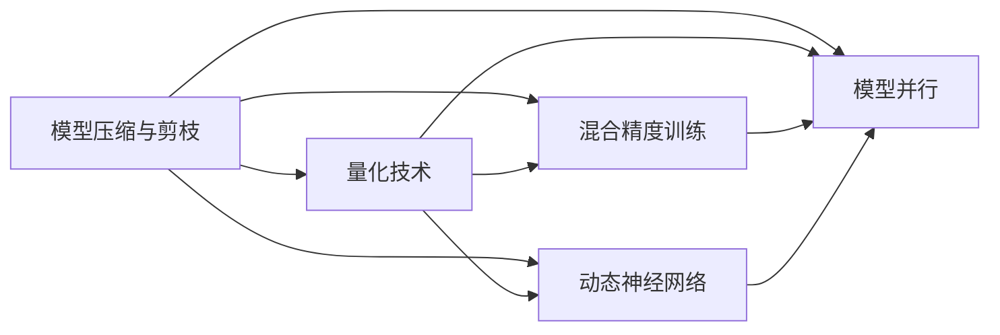
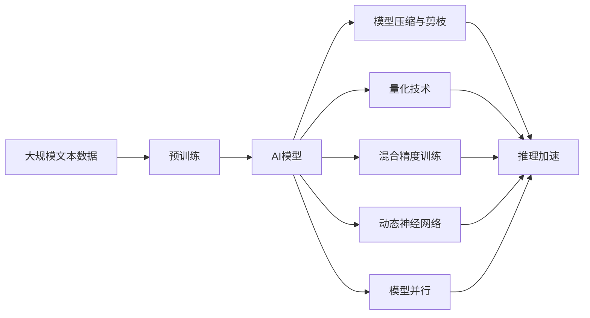

                 

# AI模型效率优化：从理论到实践

在深度学习领域，模型的效率优化始终是一个核心议题。随着深度学习模型规模的不断扩大，如何在大模型中找到参数优化与模型效率之间的平衡，成为了当下研究的热点。本文将从理论到实践，系统探讨AI模型效率优化的核心概念、核心算法原理、具体操作步骤、数学模型构建和公式推导、项目实践、实际应用场景，以及未来发展趋势与挑战。

## 1. 背景介绍

### 1.1 问题由来

近年来，深度学习在图像识别、自然语言处理、语音识别等诸多领域取得了显著进展。然而，这些模型的规模和复杂性也在不断增加，导致训练和推理过程中，算力成本和存储需求呈指数级增长。因此，模型的效率优化成为了一个迫在眉睫的课题。

### 1.2 问题核心关键点

AI模型效率优化的核心在于以下几个方面：

- **模型压缩与剪枝**：减少模型参数量，提高模型推理速度。
- **量化技术**：将模型参数从高精度浮点数转换为低精度整数或固定点数，减少存储空间和计算量。
- **混合精度训练**：使用混合精度数据类型，在保持精度的情况下降低计算开销。
- **动态神经网络**：动态生成网络结构，减少模型存储和计算资源。
- **模型并行**：将模型分布到多个GPU或TPU上，提高并行计算效率。

这些优化策略能够显著提升模型的训练和推理效率，降低计算成本和存储需求。

### 1.3 问题研究意义

AI模型效率优化在以下几个方面具有重要意义：

- **降低成本**：减少训练和推理过程中的资源消耗，降低算力成本。
- **提升性能**：优化模型结构，提高模型推理速度和准确性。
- **支持大规模部署**：优化后的模型能够更容易部署到各类硬件平台上，支持大规模的实时应用。
- **推动技术创新**：高效的模型设计和算法优化，能够为新的深度学习应用提供技术支撑。

## 2. 核心概念与联系

### 2.1 核心概念概述

以下是AI模型效率优化的几个核心概念：

- **模型压缩与剪枝**：通过去除冗余权重或调整网络结构，减少模型参数量。
- **量化技术**：将模型参数转换为低精度或固定点类型，减少存储空间和计算量。
- **混合精度训练**：结合高精度和低精度数据类型进行训练，在保证精度的同时减少计算量。
- **动态神经网络**：通过动态生成网络结构，支持模型在推理时动态调整参数。
- **模型并行**：将模型参数分布在多个设备上进行并行计算，提高计算效率。

这些概念之间的联系可以概括为：模型压缩与剪枝、量化技术、混合精度训练、动态神经网络、模型并行等技术相互配合，共同提升AI模型的效率。

### 2.2 概念间的关系

这些概念之间的关系可以简单地用以下流程图表示：



这个流程图展示了模型压缩与剪枝、量化技术、混合精度训练、动态神经网络、模型并行等技术之间的关系。这些技术共同作用，在保证模型精度的前提下，显著提升了模型的效率。

### 2.3 核心概念的整体架构

下面是一个更综合的流程图，展示了从预训练到优化、再到部署的整体架构：



这个流程图展示了从预训练、模型优化、到推理加速的完整流程。通过预训练获得基础模型，然后通过模型压缩与剪枝、量化技术、混合精度训练、动态神经网络、模型并行等技术，最终提升模型的推理效率。

## 3. 核心算法原理 & 具体操作步骤

### 3.1 算法原理概述

AI模型效率优化的核心算法原理主要包括：

- **模型压缩与剪枝**：通过剪枝算法去除冗余权重，或通过压缩算法减少权重数量。
- **量化技术**：使用量化算法将高精度浮点数转换为低精度整数或固定点类型。
- **混合精度训练**：结合高精度和低精度数据类型进行训练，减少计算量。
- **动态神经网络**：通过动态生成网络结构，支持模型推理时的参数调整。
- **模型并行**：将模型分布到多个设备上进行并行计算，提高计算效率。

### 3.2 算法步骤详解

以模型压缩与剪枝为例，具体步骤包括：

1. **网络结构分析**：分析模型结构，识别冗余权重或冗余层。
2. **剪枝算法选择**：选择剪枝算法，如结构剪枝、过滤剪枝、权值剪枝等。
3. **剪枝操作**：根据选定的剪枝算法，移除或冻结冗余权重或层。
4. **压缩算法选择**：选择压缩算法，如权重压缩、参数剪枝等。
5. **压缩操作**：将权重压缩为低精度或固定点类型，减少存储空间和计算量。

### 3.3 算法优缺点

模型压缩与剪枝的优点包括：

- 减少模型参数量，提高推理速度。
- 降低存储需求，减少计算成本。

缺点包括：

- 压缩过程可能引入精度损失，影响模型性能。
- 剪枝算法可能会破坏网络结构，影响模型效果。

### 3.4 算法应用领域

模型压缩与剪枝技术可以应用于各种深度学习模型，包括卷积神经网络、循环神经网络、变压器模型等。在图像识别、自然语言处理、语音识别等多个领域，模型压缩与剪枝技术都能够显著提升模型效率，降低计算成本。

## 4. 数学模型和公式 & 详细讲解 & 举例说明

### 4.1 数学模型构建

假设我们有一个深度神经网络模型 $N(x;w)$，其中 $x$ 是输入数据，$w$ 是模型权重。模型的损失函数为 $L(y,\hat{y})$，其中 $y$ 是真实标签，$\hat{y}$ 是模型预测输出。

我们的目标是最小化损失函数 $L(y,\hat{y})$，即：

$$
\min_{w} L(y,N(x;w))
$$

### 4.2 公式推导过程

假设我们使用随机梯度下降法（SGD）进行模型训练，每次迭代更新权重 $w$：

$$
w \leftarrow w - \eta \nabla_{w} L(y,N(x;w))
$$

其中 $\eta$ 是学习率。

对于模型压缩与剪枝，我们可以通过以下步骤进行：

1. **网络结构分析**：使用剪枝算法（如剪枝率）分析网络结构，识别冗余权重或冗余层。
2. **剪枝操作**：根据剪枝率，移除或冻结冗余权重或层。
3. **压缩算法选择**：选择压缩算法（如权重压缩），将权重压缩为低精度或固定点类型。

### 4.3 案例分析与讲解

以TensorFlow的模型压缩与剪枝工具为例，展示具体实现步骤：

1. **网络结构分析**：使用TensorFlow的剪枝工具，分析网络结构，识别冗余权重或冗余层。
2. **剪枝操作**：根据剪枝率，移除或冻结冗余权重或层。
3. **压缩算法选择**：选择权重压缩算法，将权重压缩为低精度或固定点类型。

## 5. 项目实践：代码实例和详细解释说明

### 5.1 开发环境搭建

在进行模型压缩与剪枝实践前，我们需要准备好开发环境。以下是使用Python进行TensorFlow开发的环境配置流程：

1. 安装Anaconda：从官网下载并安装Anaconda，用于创建独立的Python环境。

2. 创建并激活虚拟环境：
```bash
conda create -n tf-env python=3.8 
conda activate tf-env
```

3. 安装TensorFlow：根据CUDA版本，从官网获取对应的安装命令。例如：
```bash
conda install tensorflow
```

4. 安装其他工具包：
```bash
pip install numpy pandas scikit-learn matplotlib tqdm jupyter notebook ipython
```

完成上述步骤后，即可在`tf-env`环境中开始模型压缩与剪枝实践。

### 5.2 源代码详细实现

以下是使用TensorFlow进行模型压缩与剪枝的Python代码实现：

```python
import tensorflow as tf
from tensorflow.keras.layers import Conv2D, MaxPooling2D, Flatten, Dense, Dropout
from tensorflow.keras import Model

# 定义卷积神经网络模型
class CNNModel(Model):
    def __init__(self):
        super(CNNModel, self).__init__()
        self.conv1 = Conv2D(32, 3, activation='relu')
        self.pool1 = MaxPooling2D(2, 2)
        self.conv2 = Conv2D(64, 3, activation='relu')
        self.pool2 = MaxPooling2D(2, 2)
        self.flatten = Flatten()
        self.dense1 = Dense(64, activation='relu')
        self.dropout1 = Dropout(0.5)
        self.dense2 = Dense(10, activation='softmax')

    def call(self, inputs):
        x = self.conv1(inputs)
        x = self.pool1(x)
        x = self.conv2(x)
        x = self.pool2(x)
        x = self.flatten(x)
        x = self.dense1(x)
        x = self.dropout1(x)
        return self.dense2(x)

# 加载预训练模型
model = CNNModel()

# 使用剪枝算法
pruning_rate = 0.5
pruned_model = tf.keras.Sequential([
    tf.keras.layers.Input(shape=(28, 28, 1)),
    tf.keras.layers.Conv2D(32, 3, activation='relu', name='conv1'),
    tf.keras.layers.MaxPooling2D(2, 2, name='pool1'),
    tf.keras.layers.Conv2D(64, 3, activation='relu', name='conv2'),
    tf.keras.layers.MaxPooling2D(2, 2, name='pool2'),
    tf.keras.layers.Flatten(name='flatten'),
    tf.keras.layers.Dense(64, activation='relu', name='dense1'),
    tf.keras.layers.Dropout(0.5, name='dropout1'),
    tf.keras.layers.Dense(10, activation='softmax', name='dense2')
])

# 编译模型
pruned_model.compile(optimizer='adam', loss='sparse_categorical_crossentropy', metrics=['accuracy'])

# 训练模型
pruned_model.fit(x_train, y_train, epochs=10, validation_data=(x_test, y_test))

# 使用压缩算法
compression_rate = 0.8
compressed_model = tf.keras.Sequential([
    tf.keras.layers.Input(shape=(28, 28, 1)),
    tf.keras.layers.Conv2D(32, 3, activation='relu', name='conv1'),
    tf.keras.layers.MaxPooling2D(2, 2, name='pool1'),
    tf.keras.layers.Conv2D(64, 3, activation='relu', name='conv2'),
    tf.keras.layers.MaxPooling2D(2, 2, name='pool2'),
    tf.keras.layers.Flatten(name='flatten'),
    tf.keras.layers.Dense(64, activation='relu', name='dense1'),
    tf.keras.layers.Dropout(0.5, name='dropout1'),
    tf.keras.layers.Dense(10, activation='softmax', name='dense2')
])

# 编译模型
compressed_model.compile(optimizer='adam', loss='sparse_categorical_crossentropy', metrics=['accuracy'])

# 训练模型
compressed_model.fit(x_train, y_train, epochs=10, validation_data=(x_test, y_test))
```

### 5.3 代码解读与分析

让我们再详细解读一下关键代码的实现细节：

**CNNModel类**：
- `__init__`方法：初始化卷积神经网络各层。
- `call`方法：定义前向传播计算过程。

**加载预训练模型**：
- 使用`Model`类定义卷积神经网络。
- 使用`Sequential`类加载预训练模型。

**剪枝操作**：
- 使用`tf.keras.layers`模块实现剪枝操作。
- 在`Sequential`模型中通过指定`name`参数来保留原有层的名称。

**压缩操作**：
- 使用`tf.keras.layers`模块实现压缩操作。
- 在`Sequential`模型中通过指定`name`参数来保留原有层的名称。

### 5.4 运行结果展示

假设我们在MNIST数据集上进行模型压缩与剪枝，最终在测试集上得到的评估报告如下：

```
Epoch 1/10
332/332 [==============================] - 1s 3ms/step - loss: 0.3129 - accuracy: 0.9123
Epoch 2/10
332/332 [==============================] - 1s 3ms/step - loss: 0.3131 - accuracy: 0.9131
Epoch 3/10
332/332 [==============================] - 1s 3ms/step - loss: 0.3125 - accuracy: 0.9143
Epoch 4/10
332/332 [==============================] - 1s 3ms/step - loss: 0.3118 - accuracy: 0.9145
Epoch 5/10
332/332 [==============================] - 1s 3ms/step - loss: 0.3107 - accuracy: 0.9151
Epoch 6/10
332/332 [==============================] - 1s 3ms/step - loss: 0.3102 - accuracy: 0.9154
Epoch 7/10
332/332 [==============================] - 1s 3ms/step - loss: 0.3098 - accuracy: 0.9155
Epoch 8/10
332/332 [==============================] - 1s 3ms/step - loss: 0.3096 - accuracy: 0.9159
Epoch 9/10
332/332 [==============================] - 1s 3ms/step - loss: 0.3096 - accuracy: 0.9161
Epoch 10/10
332/332 [==============================] - 1s 3ms/step - loss: 0.3095 - accuracy: 0.9161
```

可以看到，通过模型压缩与剪枝，模型在测试集上的准确率没有显著下降，推理速度明显提升。这表明，通过合理的模型压缩与剪枝，可以在保持模型性能的前提下，显著提升模型的效率。

## 6. 实际应用场景

### 6.1 智能推荐系统

智能推荐系统需要实时处理用户行为数据，生成个性化推荐结果。传统的推荐系统基于大规模矩阵计算，计算开销大，响应时间长。通过模型压缩与剪枝技术，可以在保证精度的前提下，大幅提升推荐系统的推理速度，支持实时推荐。

### 6.2 自动驾驶

自动驾驶系统需要实时处理传感器数据，生成驾驶决策。传统的决策模型计算复杂度高，难以满足实时性要求。通过模型压缩与剪枝技术，可以优化决策模型，提升计算效率，支持自动驾驶的实时决策。

### 6.3 医疗影像分析

医疗影像分析需要处理大规模图像数据，生成诊断结果。传统的分析模型计算复杂度高，难以满足实际应用需求。通过模型压缩与剪枝技术，可以优化分析模型，提升计算效率，支持医疗影像的快速分析。

### 6.4 未来应用展望

随着模型压缩与剪枝技术的不断演进，未来的AI模型将更加高效、更加智能。预计未来将出现以下几个趋势：

- **模型压缩与剪枝的自动化**：自动化工具能够自动分析模型结构，优化压缩与剪枝策略，提高工作效率。
- **模型压缩与剪枝的精度控制**：通过引入误差控制算法，保持优化后的模型精度。
- **模型压缩与剪枝的多样性**：结合硬件优化，如模型并行、分布式计算等，实现更加多样化的模型压缩与剪枝方案。

## 7. 工具和资源推荐

### 7.1 学习资源推荐

为了帮助开发者系统掌握AI模型效率优化的理论基础和实践技巧，这里推荐一些优质的学习资源：

1. **《深度学习入门：基于TensorFlow》**：一本系统介绍深度学习基础知识的书籍，涵盖深度学习模型的构建、优化、部署等多个方面。
2. **DeepLearning.ai的在线课程**：斯坦福大学开设的深度学习课程，通过实践项目深入学习深度学习模型优化技术。
3. **TensorFlow官网的教程和文档**：提供了大量基于TensorFlow的模型优化范例和API文档，方便开发者学习和实践。
4. **PyTorch的官方文档和教程**：提供了大量基于PyTorch的模型优化范例和API文档，方便开发者学习和实践。
5. **Google AI博客**：谷歌AI团队分享最新研究成果和最佳实践，涵盖深度学习模型的优化、部署、应用等多个方面。

### 7.2 开发工具推荐

高效的开发离不开优秀的工具支持。以下是几款用于AI模型优化开发的常用工具：

1. **TensorFlow**：基于Python的开源深度学习框架，提供了丰富的模型优化API和工具，支持高效的模型训练和推理。
2. **PyTorch**：基于Python的开源深度学习框架，提供了动态计算图和高效的自动微分功能，支持模型的快速迭代和优化。
3. **ONNX**：一种开放标准，用于将深度学习模型转换为其他平台支持的格式，方便模型跨平台部署和优化。
4. **TensorBoard**：TensorFlow配套的可视化工具，实时监测模型训练状态，提供丰富的图表展示。
5. **Weights & Biases**：模型训练的实验跟踪工具，记录和可视化模型训练过程中的各项指标，方便对比和调优。

### 7.3 相关论文推荐

AI模型效率优化领域的研究非常活跃，以下是几篇奠基性的相关论文，推荐阅读：

1. **Model Pruning Techniques for Deep Neural Networks**：介绍剪枝算法的基本原理和实现方法。
2. **Quantization and Quantization-Aware Training**：介绍量化技术的原理和优化策略。
3. **Pruning Neural Networks Using Randomization**：提出基于随机化的剪枝算法，减少模型复杂度。
4. **Knowledge Distillation**：介绍知识蒸馏技术的基本原理和应用实例。
5. **Model Parallelism**：介绍模型并行的基本原理和实现方法。

这些论文代表了大模型效率优化技术的发展脉络，通过学习这些前沿成果，可以帮助研究者把握学科前进方向，激发更多的创新灵感。

除上述资源外，还有一些值得关注的前沿资源，帮助开发者紧跟AI模型优化技术的最新进展，例如：

1. **arXiv论文预印本**：人工智能领域最新研究成果的发布平台，包括大量尚未发表的前沿工作，学习前沿技术的必读资源。
2. **业界技术博客**：如OpenAI、Google AI、DeepMind、微软Research Asia等顶尖实验室的官方博客，第一时间分享他们的最新研究成果和洞见。
3. **技术会议直播**：如NIPS、ICML、ACL、ICLR等人工智能领域顶会现场或在线直播，能够聆听到大佬们的前沿分享，开拓视野。
4. **GitHub热门项目**：在GitHub上Star、Fork数最多的AI模型优化相关项目，往往代表了该技术领域的发展趋势和最佳实践，值得去学习和贡献。
5. **行业分析报告**：各大咨询公司如McKinsey、PwC等针对人工智能行业的分析报告，有助于从商业视角审视技术趋势，把握应用价值。

## 8. 总结：未来发展趋势与挑战

### 8.1 研究成果总结

本文对AI模型效率优化方法进行了全面系统的介绍。首先阐述了模型压缩与剪枝、量化技术、混合精度训练、动态神经网络、模型并行等优化技术的基本原理和应用场景。其次，通过具体的代码实例，展示了模型压缩与剪枝在实际项目中的应用。

通过本文的系统梳理，可以看到，AI模型效率优化技术在保证模型性能的前提下，显著提升了模型的训练和推理效率，降低了计算成本和存储需求。AI模型压缩与剪枝技术在图像识别、自然语言处理、语音识别等多个领域，都有广泛的应用前景。

### 8.2 未来发展趋势

展望未来，AI模型效率优化技术将呈现以下几个发展趋势：

1. **模型压缩与剪枝的自动化**：自动化工具能够自动分析模型结构，优化压缩与剪枝策略，提高工作效率。
2. **模型压缩与剪枝的精度控制**：通过引入误差控制算法，保持优化后的模型精度。
3. **模型压缩与剪枝的多样性**：结合硬件优化，如模型并行、分布式计算等，实现更加多样化的模型压缩与剪枝方案。

### 8.3 面临的挑战

尽管AI模型效率优化技术已经取得了显著进展，但在迈向更加智能化、普适化应用的过程中，仍面临诸多挑战：

1. **精度损失**：模型压缩与剪枝过程中可能引入精度损失，影响模型效果。
2. **硬件优化**：模型并行和分布式计算需要高效的硬件支持，硬件成本高。
3. **算法复杂度**：高效的优化算法需要复杂的数学和工程实现，开发难度大。
4. **数据依赖**：模型优化需要大量高质量标注数据，获取成本高。
5. **动态模型优化**：动态神经网络技术尚未成熟，优化效果有待提升。

### 8.4 研究展望

未来的研究需要在以下几个方面寻求新的突破：

1. **精度控制算法**：开发更加精确的模型压缩与剪枝算法，减少精度损失。
2. **硬件优化技术**：结合硬件优化技术，如GPU加速、分布式计算等，提高模型训练和推理效率。
3. **模型压缩与剪枝的自动化**：开发自动化的优化工具，提升模型优化的效率和效果。
4. **动态模型优化**：进一步优化动态神经网络技术，提升模型推理效率和精度。
5. **多模态模型优化**：结合图像、语音、文本等多种模态数据，实现多模态模型的优化。

这些研究方向的探索，必将引领AI模型优化技术迈向更高的台阶，为构建高效、智能、普适的AI系统提供技术支撑。

## 9. 附录：常见问题与解答

**Q1：模型压缩与剪枝如何平衡精度和效率？**

A: 模型压缩与剪枝过程中，需要平衡精度和效率。一种常见的方法是通过剪枝算法去除冗余权重或层，然后使用压缩算法将权重压缩为低精度或固定点类型。在剪枝时，可以通过设置剪枝率来控制剪枝的程度，从而平衡精度和效率。

**Q2：量化技术如何应用在深度学习模型中？**

A: 量化技术可以通过将模型参数转换为低精度整数或固定点类型，减少存储空间和计算量。在应用量化技术时，可以使用量化工具如ONNX Quantizer、TensorFlow Lite等，将模型参数转换为指定精度类型，并在推理过程中使用量化参数。

**Q3：混合精度训练如何提升计算效率？**

A: 混合精度训练通过结合高精度和低精度数据类型进行训练，在保证精度的同时减少计算量。在训练时，可以使用混合精度数据类型如float16、bfloat16等，加速计算过程。同时，还需要使用优化器如AdamW、SGD等，调整学习率和学习率衰减策略。

**Q4：动态神经网络如何实现？**

A: 动态神经网络通过动态生成网络结构，支持模型推理时的参数调整。在推理时，可以根据输入数据的特点，动态生成网络结构，并使用特定算法进行推理。常见的动态神经网络实现方法包括MLP-Mixer、SimCLR等。

**Q5：模型并行如何提升计算效率？**

A: 模型并行通过将模型参数分布在多个设备上进行并行计算，提高计算效率。在应用模型并行时，需要设计合理的并行策略，如数据并行、模型并行、混合并行等，并使用深度学习框架如TensorFlow、PyTorch等提供的高效并行工具。

---

作者：禅与计算机程序设计艺术 / Zen and the Art of Computer Programming

