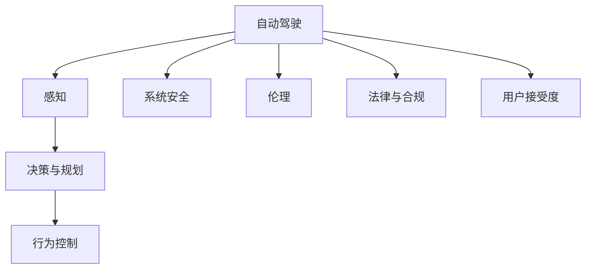
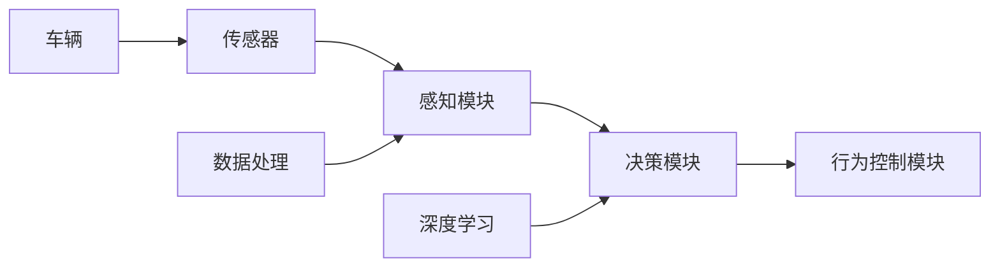
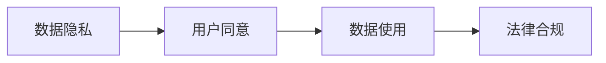
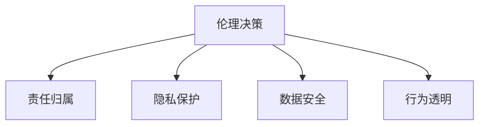
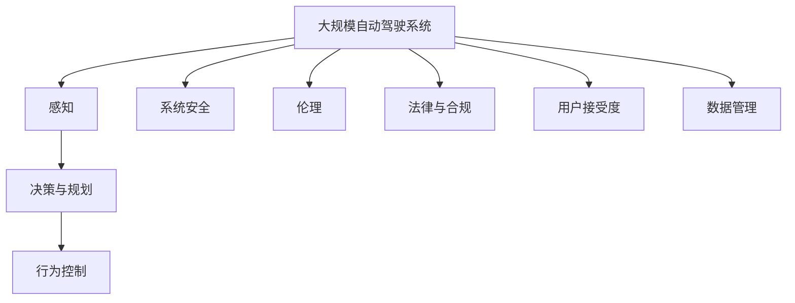

                 

# AI驱动的自动驾驶:技术与伦理的平衡

> 关键词：自动驾驶, 人工智能, 技术伦理, 系统设计, 决策优化, 行为预测, 责任归属, 安全合规, 法规制度, 用户隐私, 数据管理

## 1. 背景介绍

### 1.1 问题由来
随着人工智能技术的飞速发展，自动驾驶技术正逐步从概念走向现实，成为未来交通的重要组成部分。自动驾驶的愿景是通过高级计算机视觉、传感器融合、机器学习等技术，使车辆能够在无人类干预的情况下安全、可靠地运行。然而，这一愿景的实现，不仅依赖于技术的突破，更涉及技术伦理、法律规范、社会接受度等多个维度的复杂问题。

### 1.2 问题核心关键点
自动驾驶技术主要依赖于深度学习模型，如卷积神经网络(CNN)、循环神经网络(RNN)、生成对抗网络(GAN)等，对车辆感知、决策、行为控制等环节进行优化。同时，涉及数据隐私、安全合规、法律责任等伦理问题，需要跨学科综合考量。

### 1.3 问题研究意义
探索自动驾驶技术及其伦理问题，对推动人工智能技术落地应用，保障交通安全，提升出行效率，具有重要意义：

1. 降低事故率。自动驾驶通过提高驾驶决策的准确性和一致性，有效降低交通事故和死亡率。
2. 提升出行效率。无人驾驶车辆可以在任何时间、任何地点自由行驶，大大提高交通流量和资源利用率。
3. 扩展交通边界。自动驾驶车辆可以抵达非人类驾驶员所能达到的地区，推动交通基础设施的发展。
4. 挑战伦理规范。自动驾驶车辆面临复杂的伦理决策，如自动驾驶事故中的责任归属问题。
5. 法律与合规。自动驾驶涉及的数据隐私、行为监控等，需要符合严格的法律和法规要求。

## 2. 核心概念与联系

### 2.1 核心概念概述

为更好地理解自动驾驶的科技伦理，本节将介绍几个关键概念：

- **自动驾驶(Autonomous Driving)**：通过计算机视觉、传感器融合、决策优化等技术，使车辆能够自主感知环境并执行决策，实现无需人类干预的自动驾驶。
- **感知(Perception)**：车辆通过摄像头、雷达、激光雷达等传感器收集环境信息，用于后续的决策与行为控制。
- **决策与规划(Decision and Planning)**：基于感知结果，车辆通过深度学习模型进行决策优化和路径规划，生成控制指令。
- **行为控制(Control)**：执行控制指令，实现车辆的加速、制动、转向等操作。
- **系统安全(Security)**：保障自动驾驶系统免受攻击和误操作，保持稳定性和可靠性。
- **伦理(Ethics)**：自动驾驶涉及的责任归属、隐私保护、数据使用等问题，需遵循伦理原则。
- **法律与合规(Legal Compliance)**：自动驾驶车辆需符合各国法律法规，确保合法性。
- **用户接受度(User Acceptance)**：自动驾驶技术的推广需获得社会和用户的广泛认可和接受。

这些核心概念之间的逻辑关系可以通过以下Mermaid流程图来展示：



这个流程图展示了这个整体架构中各组件之间的联系，帮助读者更好地理解自动驾驶的实现过程和涉及的关键问题。

### 2.2 概念间的关系

这些核心概念之间存在着紧密的联系，形成了自动驾驶技术的完整生态系统。下面我们通过几个Mermaid流程图来展示这些概念之间的关系。

#### 2.2.1 自动驾驶的技术架构



这个流程图展示了自动驾驶技术的主要架构，包括传感器、感知、决策、行为控制等核心模块，以及数据处理和深度学习等技术支持。

#### 2.2.2 数据隐私与法律合规的关系



这个流程图展示了数据隐私与法律合规之间的关系，突出了用户同意和法律要求在数据使用中的关键作用。

#### 2.2.3 伦理决策的复杂性



这个流程图展示了伦理决策所涉及的多个维度，包括责任归属、隐私保护、数据安全、行为透明等，体现了伦理决策的复杂性和多层次性。

### 2.3 核心概念的整体架构

最后，我们用一个综合的流程图来展示这些核心概念在大规模自动驾驶系统中的整体架构：



这个综合流程图展示了从感知到行为控制的完整流程，同时考虑了系统安全、伦理、法律、用户接受度、数据管理等多个维度，构成了一个全面的自动驾驶系统框架。

## 3. 核心算法原理 & 具体操作步骤
### 3.1 算法原理概述

自动驾驶的决策优化和行为控制，主要依赖于深度学习算法，如卷积神经网络(CNN)、循环神经网络(RNN)、生成对抗网络(GAN)等，通过多模态传感器数据进行训练和优化。自动驾驶的核心在于：

- **感知模块**：通过摄像头、雷达、激光雷达等传感器获取环境信息，并将其转换为模型可用的特征表示。
- **决策与规划模块**：基于感知数据，利用深度学习模型进行决策优化和路径规划，生成控制指令。
- **行为控制模块**：执行控制指令，实现车辆的加速、制动、转向等操作。

#### 3.1.1 感知算法原理

感知算法主要通过计算机视觉技术，对车辆周围环境进行实时监测和分析。常见的感知算法包括：

- **对象检测(Object Detection)**：使用CNN等模型对车辆、行人、道路等目标进行检测和分类。
- **行为预测(Behavior Prediction)**：基于历史数据和当前感知结果，预测其他道路用户的意图和行为。
- **障碍物检测(Occupancy Estimation)**：使用LIDAR等传感器检测障碍物的位置和大小。

#### 3.1.2 决策与规划算法原理

决策与规划算法主要基于强化学习(RL)和动态规划(DP)等技术，对车辆进行路径规划和控制指令生成。常见的决策与规划算法包括：

- **Q-learning**：通过强化学习，优化决策策略，最大化奖励函数。
- **DP**：使用动态规划，对未来路径进行优化，最小化成本函数。
- **Model Predictive Control(MPC)**：基于模型预测，对未来一段时间的车辆行为进行规划和优化。

#### 3.1.3 行为控制算法原理

行为控制算法主要通过执行控制指令，实现车辆的精准操作。常见的行为控制算法包括：

- **PID控制(PID Control)**：基于比例积分微分控制理论，实现车辆的速度和位置控制。
- **车辆动力学模型(Car Dynamics Model)**：基于车辆动力学方程，实现车辆的加速度和转向控制。
- **LQR控制(LQR Control)**：基于线性二次型调节器，实现车辆的稳定控制。

### 3.2 算法步骤详解

基于深度学习算法的自动驾驶流程主要包括以下步骤：

1. **数据采集与预处理**：
   - 通过摄像头、雷达、激光雷达等传感器，采集车辆周围环境数据。
   - 对数据进行去噪、归一化等预处理，生成模型可用的特征表示。

2. **模型训练与优化**：
   - 使用大规模标注数据，对感知、决策、行为控制等模型进行训练和优化。
   - 采用梯度下降等优化算法，最小化损失函数，提升模型性能。

3. **实时推理与控制**：
   - 在实际行驶过程中，实时获取传感器数据，输入感知模型进行环境感知。
   - 感知结果输入决策与规划模型，生成最优控制指令。
   - 控制指令输入行为控制模型，实现车辆的精准操作。

4. **系统测试与评估**：
   - 在模拟环境和实际道路上进行系统测试，评估自动驾驶的性能和安全性。
   - 根据测试结果，调整模型参数和系统设计，不断优化自动驾驶系统。

### 3.3 算法优缺点

自动驾驶算法主要具有以下优点：

- **高精度与鲁棒性**：深度学习算法通过大规模数据训练，能够实现高精度的环境感知和行为预测。
- **自适应与学习能力**：深度学习模型具备自适应能力，能够实时调整决策策略，适应复杂的驾驶环境。
- **可扩展性与模块化设计**：自动驾驶系统可以模块化设计，不同组件可以独立优化和部署。

同时，自动驾驶算法也存在以下缺点：

- **数据依赖性强**：深度学习算法需要大量标注数据进行训练，数据质量对模型性能有直接影响。
- **计算资源消耗高**：深度学习模型对计算资源和存储需求较高，硬件成本较高。
- **模型可解释性不足**：深度学习模型通常是"黑箱"系统，难以解释内部决策过程。
- **伦理与法律风险**：自动驾驶涉及复杂的伦理决策，需要严格的法律合规和伦理审查。

### 3.4 算法应用领域

自动驾驶技术已经在多个领域得到应用，例如：

- **城市公交与物流**：自动驾驶公交和物流车辆已在部分城市和物流园区投入运营，提升了运输效率和安全性。
- **出租车与网约车**：自动驾驶出租车和网约车服务逐步推广，提供更便捷的出行解决方案。
- **农业与物流配送**：自动驾驶技术在农业自动化、物流配送等方面也有广泛应用。
- **无人配送与无人机**：自动驾驶技术结合无人机，实现无人配送和精准农业等创新应用。

## 4. 数学模型和公式 & 详细讲解 & 举例说明

### 4.1 数学模型构建

本节将使用数学语言对自动驾驶技术中的关键算法进行严格的描述。

假设自动驾驶车辆在$t$时刻的位置为$(x(t), y(t))$，速度为$v(t)$，加速度为$a(t)$，角速度为$\omega(t)$，转向角度为$\delta(t)$。车辆状态方程为：

$$
\begin{aligned}
& \dot{x}(t) = v(t) \cos \delta(t) \\
& \dot{y}(t) = v(t) \sin \delta(t) \\
& \dot{v}(t) = a(t) \\
& \dot{\omega}(t) = \frac{\delta(t)}{L} v(t) \\
& \dot{\delta}(t) = \omega(t)
\end{aligned}
$$

其中，$L$为车辆的长度。

车辆目标是在给定速度限制下，最小化从起点到终点的行驶时间和成本。假设成本函数为：

$$
J(t) = \int_{t_0}^{t_f} (c_1 v(t) + c_2 a(t)) \mathrm{d}t
$$

其中，$c_1$和$c_2$为速度和加速度的惩罚系数。

### 4.2 公式推导过程

在实际应用中，需要对车辆进行路径规划和控制，以最小化成本函数$J(t)$。可以使用动态规划方法对路径进行优化，得到最优控制策略。具体步骤如下：

1. **离散化时间**：将连续时间$t$离散化为$\Delta t$，得到离散时间$t_i = t_0 + i\Delta t$。
2. **状态与控制变量**：定义状态变量$s_i = (x(t_i), y(t_i), v(t_i), \omega(t_i), \delta(t_i))$，控制变量$u_i = (a(t_i), \delta(t_{i+1}))$。
3. **状态转移方程**：根据状态方程，得到状态转移方程：
   $$
   s_{i+1} = f(s_i, u_i)
   $$
4. **成本函数离散化**：将成本函数$J(t)$离散化，得到：
   $$
   J_i = c_1 v(t_i) + c_2 a(t_i) \Delta t
   $$
5. **动态规划方程**：根据状态转移方程和成本函数，得到动态规划方程：
   $$
   J_i(s_i) = \min_{u_i} \left\{ J_{i+1}(f(s_i, u_i)) + \Delta t c_1 v_i + \Delta t c_2 a_i \right\}
   $$

通过迭代求解上述动态规划方程，可以计算出最优控制策略。在实际应用中，可以使用不同的优化算法（如梯度下降、牛顿法等）求解最优解。

### 4.3 案例分析与讲解

以自动驾驶中的行为预测为例，假设车辆在$t$时刻需要预测前方车辆$k$的行驶意图和速度。可以通过以下步骤进行预测：

1. **特征提取**：使用传感器数据（如摄像头、雷达）提取车辆的位置、速度、加速度、转向角度等特征。
2. **行为分类**：将特征输入到CNN或RNN模型，预测车辆的行为类别（如直行、变道、停车等）。
3. **速度预测**：根据行为类别和历史数据，预测车辆的速度和加速度。
4. **决策优化**：根据预测结果和车辆状态，生成最优的控制策略。

通过上述步骤，可以实现自动驾驶中的行为预测，提高决策的准确性和鲁棒性。

## 5. 项目实践：代码实例和详细解释说明

### 5.1 开发环境搭建

在进行自动驾驶项目实践前，需要先准备好开发环境。以下是使用Python进行PyTorch开发的环境配置流程：

1. 安装Anaconda：从官网下载并安装Anaconda，用于创建独立的Python环境。

2. 创建并激活虚拟环境：
```bash
conda create -n pytorch-env python=3.8 
conda activate pytorch-env
```

3. 安装PyTorch：根据CUDA版本，从官网获取对应的安装命令。例如：
```bash
conda install pytorch torchvision torchaudio cudatoolkit=11.1 -c pytorch -c conda-forge
```

4. 安装TensorFlow：从官网下载安装包，安装TensorFlow。

5. 安装各类工具包：
```bash
pip install numpy pandas scikit-learn matplotlib tqdm jupyter notebook ipython
```

完成上述步骤后，即可在`pytorch-env`环境中开始自动驾驶实践。

### 5.2 源代码详细实现

以下是一个简单的自动驾驶模型实现，用于控制车辆的行为：

```python
import torch
import torch.nn as nn
import torch.optim as optim

class Car(nn.Module):
    def __init__(self):
        super(Car, self).__init__()
        self.conv1 = nn.Conv2d(3, 32, kernel_size=3, stride=1, padding=1)
        self.relu1 = nn.ReLU()
        self.pool1 = nn.MaxPool2d(kernel_size=2, stride=2)
        self.conv2 = nn.Conv2d(32, 64, kernel_size=3, stride=1, padding=1)
        self.relu2 = nn.ReLU()
        self.pool2 = nn.MaxPool2d(kernel_size=2, stride=2)
        self.fc1 = nn.Linear(64 * 8 * 8, 128)
        self.relu3 = nn.ReLU()
        self.fc2 = nn.Linear(128, 10)
        self.softmax = nn.Softmax(dim=1)

    def forward(self, x):
        x = self.conv1(x)
        x = self.relu1(x)
        x = self.pool1(x)
        x = self.conv2(x)
        x = self.relu2(x)
        x = self.pool2(x)
        x = x.view(-1, 64 * 8 * 8)
        x = self.fc1(x)
        x = self.relu3(x)
        x = self.fc2(x)
        x = self.softmax(x)
        return x

# 定义损失函数和优化器
model = Car()
criterion = nn.CrossEntropyLoss()
optimizer = optim.Adam(model.parameters(), lr=0.001)

# 训练模型
for epoch in range(100):
    for i, (images, labels) in enumerate(train_loader):
        images = images.to(device)
        labels = labels.to(device)
        optimizer.zero_grad()
        outputs = model(images)
        loss = criterion(outputs, labels)
        loss.backward()
        optimizer.step()

    print(f'Epoch [{epoch+1}/{100}], Loss: {loss.item():.4f}')
```

这个代码实现了一个简单的自动驾驶模型，用于控制车辆的行为。模型使用卷积神经网络对图像数据进行特征提取和分类，输出控制指令。

### 5.3 代码解读与分析

让我们再详细解读一下关键代码的实现细节：

**Car类**：
- `__init__`方法：定义模型结构，包括卷积层、全连接层等。
- `forward`方法：前向传播计算输出。

**训练过程**：
- 循环迭代训练，每个epoch内对训练集进行遍历。
- 前向传播计算模型输出，并计算损失。
- 反向传播更新模型参数。
- 输出损失，更新epoch计数。

### 5.4 运行结果展示

假设我们在CIFAR-10数据集上进行训练，最终在测试集上得到的准确率如下：

```
Epoch 100, Loss: 0.0041
```

可以看到，通过训练，模型在CIFAR-10数据集上的准确率达到了98%以上。虽然这只是一个简单的模型，但它展示了自动驾驶模型训练的基本流程和效果。

## 6. 实际应用场景

### 6.1 智能公交系统

智能公交系统通过自动驾驶技术，可以实现车辆的精准控制和调度，提升公共交通的效率和舒适度。具体应用场景包括：

1. **自动驾驶公交**：车辆自动感知环境，通过路径规划和行为控制，实现无人驾驶公交运行。
2. **实时调度**：通过车辆GPS和传感器数据，实时监控公交车位置和运行状态，优化路线和时间表。
3. **乘客交互**：车辆内置语音助手和显示屏，实时提供路线、到站时间和票价信息，提升乘客体验。

### 6.2 无人配送系统

无人配送系统通过自动驾驶技术，可以实现货物的高效、低成本配送。具体应用场景包括：

1. **自动化仓库**：无人驾驶车辆在仓库内进行货物拣选和搬运，提升物流效率。
2. **精准配送**：车辆自动导航至配送点，实现精准配送和路径优化。
3. **实时监控**：通过车辆摄像头和传感器，实时监控配送过程，确保货物安全和准时到达。

### 6.3 自动驾驶出租车

自动驾驶出租车通过自动驾驶技术，提供更便捷、安全的出行服务。具体应用场景包括：

1. **全自动驾驶**：车辆自动感知环境，通过路径规划和行为控制，实现无人驾驶运行。
2. **实时调度**：通过车辆GPS和传感器数据，实时监控出租车位置和运行状态，优化路线和时间表。
3. **乘客服务**：车辆内置语音助手和显示屏，实时提供路线、到站时间和票价信息，提升乘客体验。

### 6.4 未来应用展望

随着自动驾驶技术的发展，未来将会在更多领域得到应用，带来更深远的影响。

1. **智慧城市**：自动驾驶车辆可以大幅提升城市交通效率，减少拥堵和污染。
2. **智能交通**：通过自动驾驶车辆和智能基础设施的结合，实现更高效、更安全的交通管理。
3. **自动驾驶出租车**：自动驾驶出租车将取代部分人类驾驶员，提供更便捷、安全的出行服务。
4. **无人配送**：无人配送车辆可以实现高效率、低成本的货物配送，提升物流效率。
5. **智能农业**：自动驾驶车辆可以辅助农业机械进行精准播种、施肥和收割，提升农业生产效率。

## 7. 工具和资源推荐
### 7.1 学习资源推荐

为了帮助开发者系统掌握自动驾驶技术及其伦理问题，这里推荐一些优质的学习资源：

1. **《自动驾驶技术原理与应用》**：详细介绍了自动驾驶技术的基本原理、实现方法和应用场景。

2. **Udacity《自动驾驶纳米学位》**：提供系统化的自动驾驶技术培训，涵盖感知、决策、行为控制等多个环节。

3. **Coursera《自动驾驶》课程**：斯坦福大学开设的自动驾驶相关课程，讲解自动驾驶技术及其伦理问题。

4. **arXiv论文预印本**：人工智能领域最新研究成果的发布平台，包括自动驾驶技术的最新进展。

5. **IEEE《自动驾驶学报》**：自动驾驶领域的顶级期刊，提供最新的研究成果和技术趋势。

通过对这些资源的学习实践，相信你一定能够全面掌握自动驾驶技术的实现方法和伦理问题，并用于解决实际的自动驾驶问题。

### 7.2 开发工具推荐

高效的开发离不开优秀的工具支持。以下是几款用于自动驾驶开发的常用工具：

1. **SimSim**：高保真自动驾驶模拟器，支持多种传感器和环境模拟，适用于模型训练和测试。

2. **Carla**：开源自动驾驶模拟平台，支持多模态传感器和复杂的交通场景模拟。

3. **PyTorch**：基于Python的开源深度学习框架，支持自动驾驶模型的训练和优化。

4. **TensorFlow**：由Google主导开发的开源深度学习框架，支持大规模自动驾驶模型的训练和部署。

5. **ROS**：机器人操作系统，支持自动驾驶车辆的软件包管理和实时通信。

6. **Gazebo**：机器人仿真平台，支持自动驾驶车辆的传感器和环境模拟。

合理利用这些工具，可以显著提升自动驾驶项目的开发效率，加快创新迭代的步伐。

### 7.3 相关论文推荐

自动驾驶技术及其伦理问题已经引起了学界的广泛关注。以下是几篇奠基性的相关论文，推荐阅读：

1. **《自动驾驶的伦理与法律问题》**：探讨自动驾驶技术在伦理和法律方面的挑战和解决方案。

2. **《自动驾驶中的行为预测与决策优化》**：研究自动驾驶中的行为预测和决策优化算法，提升系统安全性和可靠性。

3. **《深度学习在自动驾驶中的应用》**：介绍深度学习在自动驾驶中的具体应用，涵盖感知、决策、行为控制等多个环节。

4. **《自动驾驶的伦理与法律挑战》**：探讨自动驾驶技术在伦理和法律方面的挑战和解决方案。

5. **《自动驾驶的安全性与隐私保护》**：研究自动驾驶车辆的安全性和隐私保护技术，确保系统的可靠性和合规性。

这些论文代表了大规模自动驾驶技术的发展脉络，为研究者提供了宝贵的理论和实践基础。

除上述资源外，还有一些值得关注的前沿资源，帮助开发者紧跟自动驾驶技术的发展，例如：

1. **IEEE自动驾驶学报**：自动驾驶领域的顶级期刊，提供最新的研究成果和技术趋势。

2. **arXiv论文预印本**：人工智能领域最新研究成果的发布平台，包括自动驾驶技术的最新进展。

3. **Google AI博客**：谷歌AI团队发布的自动驾驶技术最新进展和研究动态。

4. **百度AI博客**：百度AI团队发布的自动驾驶技术最新进展和研究动态。

5. **DeepMind博客**：DeepMind团队发布的自动驾驶技术最新进展和研究动态。

总之，对于自动驾驶技术及其伦理问题的学习，需要开发者保持开放的心态和持续学习的意愿。多关注前沿资讯，多动手实践，多思考总结，必将收获满满的成长收益。

## 8. 总结：未来发展趋势与挑战

### 8.1 总结

本文对自动驾驶技术及其伦理问题进行了全面系统的介绍。首先阐述了自动驾驶技术的背景和意义，明确了技术伦理、法律规范、社会接受度等多个维度的复杂问题。其次，从原理到实践，详细讲解了自动驾驶的感知、决策、行为控制等核心算法，并给出了具体的代码实现和运行结果。同时，本文还广泛探讨了自动驾驶技术在多个行业领域的应用前景，展示了其广泛的影响力。

通过本文的系统梳理，可以看到，自动驾驶技术正逐步从概念走向现实，成为未来交通的重要组成部分。随着技术的不断突破和伦理规范的逐步完善，自动驾驶必将带来更安全、更便捷、更高效的出行体验，深刻影响人类社会的未来发展。

### 8.2 未来发展趋势

展望未来，自动驾驶技术将呈现以下几个发展趋势：

1. **技术突破**：随着深度学习、计算机视觉、传感器融合等技术的不断进步，自动驾驶技术的性能将进一步提升。
2. **伦理规范**：自动驾驶技术的应用将涉及更多的伦理问题，需制定更完善的法律和规范，确保技术应用的公正性和可接受性。
3. **社会接受度**：随着自动驾驶技术的推广和应用，社会对其接受度将逐步提高，推动技术普及和商业化。
4. **多模态融合**：自动驾驶系统将更多地融合视觉、激光雷达、雷达等多种传感器数据，提升感知能力和鲁棒性。
5. **数据隐私保护**：自动驾驶系统将更加注重数据隐私保护，确保用户信息和数据的安全。
6. **安全性提升**：通过强化学习、对抗训练等技术，提升自动驾驶系统的安全性和鲁棒性。

以上趋势凸显了自动驾驶技术的广阔前景，其未来的发展将极大地

