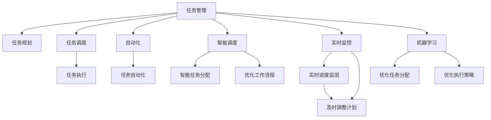
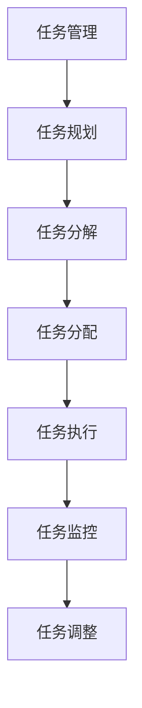
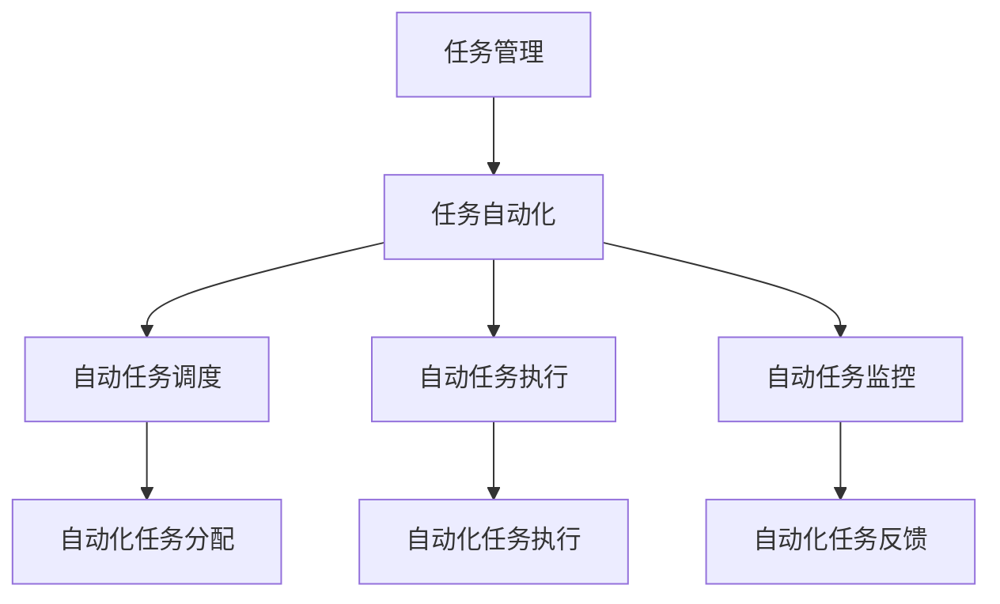
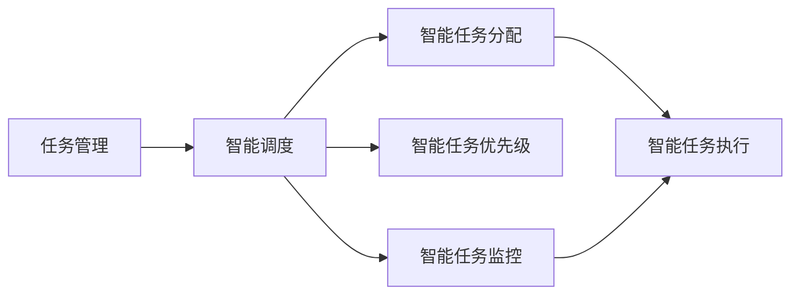
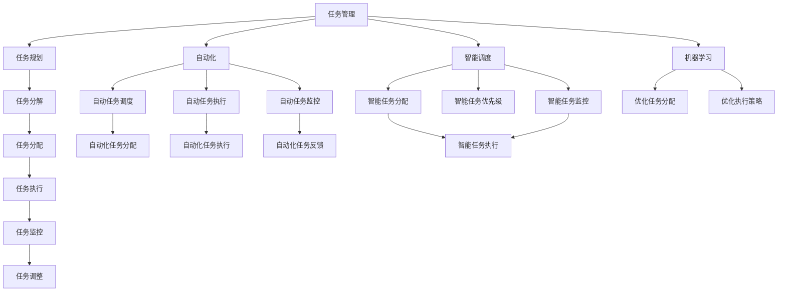

                 

# Agentic Workflow 提高效率与质量

## 1. 背景介绍

### 1.1 问题由来

在现代软件开发过程中，任务繁多、工作量巨大，且各个任务间存在相互依赖关系。过去，开发人员通常依靠手动协作、文档记录、项目管理工具等方式来协调这些任务，但这些方式往往难以跟上项目进展的速度，导致效率低下、错误频发。为了应对这种挑战，Agentic Workflow应运而生。

Agentic Workflow是一种利用人工智能技术提升软件交付效率和质量的工作流程，它通过自动化的任务规划、调度、执行、监控等手段，使得开发团队能够更加高效、准确地完成项目任务。Agentic Workflow的核心在于其自适应和智能化的特点，能够根据团队成员的能力和项目需求，动态调整任务分配，优化工作流程，从而大幅提升开发效率和代码质量。

### 1.2 问题核心关键点

Agentic Workflow的核心在于以下几个关键点：

1. **任务自动化**：通过自动化的任务调度和管理，将重复性、低价值的工作自动化，让团队能够集中精力处理更有价值的任务。
2. **智能任务分配**：根据团队成员的能力和项目需求，智能分配任务，避免过载和资源浪费。
3. **实时监控与反馈**：实时监控项目进度，根据进展情况及时调整工作计划，提供实时反馈，帮助团队快速响应问题。
4. **自适应学习**：通过机器学习算法，不断优化任务分配和执行策略，提升团队效率和质量。
5. **可扩展性**：支持大规模分布式项目，能够动态扩展资源和任务，满足不同规模项目的需要。

### 1.3 问题研究意义

Agentic Workflow在软件开发中的应用，具有重要的研究意义：

1. **提高效率**：通过自动化的任务管理和调度，大幅减少手动协作的工作量，使得团队能够更快地完成项目任务。
2. **提升质量**：通过智能任务分配和实时监控，及时发现和修复问题，减少错误和缺陷，提升代码质量。
3. **促进协作**：通过任务可视化和实时反馈，增强团队成员之间的沟通和协作，提高团队凝聚力。
4. **降低成本**：通过减少手动协作和错误率，降低项目成本，提高企业竞争力。
5. **加速创新**：通过智能化的任务管理，使得团队能够更快地响应市场变化，加速产品创新。

## 2. 核心概念与联系

### 2.1 核心概念概述

为了更好地理解Agentic Workflow的核心概念，本节将介绍几个密切相关的核心概念：

- **任务管理**：通过任务规划、调度、执行等手段，确保任务按时完成。
- **自动化**：利用自动化技术，减少手动操作，提高工作效率。
- **智能调度**：根据项目需求和成员能力，智能分配任务，优化工作流程。
- **实时监控**：实时监测项目进展，及时调整工作计划，提供反馈。
- **机器学习**：通过机器学习算法，不断优化任务分配和执行策略。

这些核心概念之间的逻辑关系可以通过以下Mermaid流程图来展示：



这个流程图展示了大语言模型微调过程中各个核心概念的关系：

1. 任务管理通过任务规划、调度、执行等手段，确保任务按时完成。
2. 自动化利用自动化技术，减少手动操作，提高工作效率。
3. 智能调度根据项目需求和成员能力，智能分配任务，优化工作流程。
4. 实时监控实时监测项目进展，及时调整工作计划，提供反馈。
5. 机器学习通过机器学习算法，不断优化任务分配和执行策略。

这些概念共同构成了Agentic Workflow的核心框架，使得软件开发项目能够高效、准确地完成。

### 2.2 概念间的关系

这些核心概念之间存在着紧密的联系，形成了Agentic Workflow的工作流程。下面我们通过几个Mermaid流程图来展示这些概念之间的关系。

#### 2.2.1 任务管理流程



这个流程图展示了任务管理的基本流程，包括任务规划、分解、分配、执行、监控和调整。

#### 2.2.2 自动化任务管理



这个流程图展示了自动化在任务管理中的应用，通过自动化技术提高任务执行的效率和准确性。

#### 2.2.3 智能任务调度



这个流程图展示了智能调度的基本原理，通过智能算法优化任务分配和优先级，提升整体工作效率。

### 2.3 核心概念的整体架构

最后，我们用一个综合的流程图来展示这些核心概念在大语言模型微调过程中的整体架构：



这个综合流程图展示了从任务规划到任务执行，再到任务调整的完整过程，以及自动化和智能调度在其中的应用。

## 3. 核心算法原理 & 具体操作步骤
### 3.1 算法原理概述

Agentic Workflow的核心算法原理可以概括为以下几个方面：

1. **任务规划算法**：根据项目需求，制定详细的任务规划，包括任务分解、优先级排序等。
2. **任务调度算法**：根据任务规划和团队成员能力，智能分配任务，优化工作流程。
3. **任务执行算法**：自动化任务执行，包括代码编写、测试、部署等。
4. **任务监控算法**：实时监控任务进展，及时调整工作计划，提供反馈。
5. **机器学习算法**：通过历史数据和实时反馈，不断优化任务分配和执行策略，提升团队效率和质量。

Agentic Workflow的算法原理依赖于以下几个基本概念：

- **任务模型**：通过任务描述、依赖关系等，构建任务模型，用于任务规划和调度。
- **成员能力模型**：通过技能、经验、负载等，构建团队成员能力模型，用于任务分配和优先级排序。
- **实时数据流**：通过日志、监控数据等，实时获取项目进展情况，用于调整工作计划。
- **优化策略**：通过历史数据和实时反馈，不断优化任务分配和执行策略，提升团队效率和质量。

### 3.2 算法步骤详解

Agentic Workflow的实现步骤可以归纳为以下几个方面：

1. **任务规划**：根据项目需求，制定详细的任务规划，包括任务分解、优先级排序等。
2. **任务调度**：根据任务规划和团队成员能力，智能分配任务，优化工作流程。
3. **任务执行**：自动化任务执行，包括代码编写、测试、部署等。
4. **任务监控**：实时监控任务进展，及时调整工作计划，提供反馈。
5. **优化策略**：通过历史数据和实时反馈，不断优化任务分配和执行策略，提升团队效率和质量。

**Step 1: 任务规划**

任务规划是Agentic Workflow的基础，其目的是制定详细的工作计划，确保所有任务按时完成。具体步骤如下：

1. **任务分解**：将大型任务分解为若干小任务，每个小任务都有明确的目标和输出。
2. **优先级排序**：根据任务的重要性和紧急程度，确定任务优先级。
3. **依赖关系**：确定任务之间的依赖关系，确保任务执行顺序。

**Step 2: 任务调度**

任务调度是Agentic Workflow的核心，其目的是根据任务规划和团队成员能力，智能分配任务，优化工作流程。具体步骤如下：

1. **成员能力评估**：通过技能、经验、负载等，评估团队成员的能力。
2. **任务分配**：根据任务优先级和成员能力，智能分配任务，确保任务均衡分配。
3. **资源优化**：根据资源可用性，动态调整任务分配，优化资源利用。

**Step 3: 任务执行**

任务执行是Agentic Workflow的执行阶段，其目的是自动化任务执行，确保任务按时完成。具体步骤如下：

1. **任务自动化**：利用自动化技术，如CI/CD、代码生成工具等，自动化任务执行。
2. **质量保障**：通过代码审查、测试等手段，保障任务执行质量。
3. **进度跟踪**：实时跟踪任务进度，确保任务按时完成。

**Step 4: 任务监控**

任务监控是Agentic Workflow的反馈阶段，其目的是实时监控任务进展，及时调整工作计划，提供反馈。具体步骤如下：

1. **进度监测**：通过实时数据流，监测任务进展情况。
2. **异常检测**：实时检测任务执行异常，及时预警。
3. **调整计划**：根据实时反馈，及时调整工作计划，确保任务按时完成。

**Step 5: 优化策略**

优化策略是Agentic Workflow的提升阶段，其目的是通过历史数据和实时反馈，不断优化任务分配和执行策略，提升团队效率和质量。具体步骤如下：

1. **历史数据分析**：通过历史数据，分析任务分配和执行策略的效果。
2. **实时反馈优化**：通过实时反馈，优化任务分配和执行策略。
3. **持续改进**：通过机器学习算法，不断优化任务分配和执行策略，提升团队效率和质量。

### 3.3 算法优缺点

Agentic Workflow的算法具有以下优点：

1. **高效性**：通过自动化和智能调度，大幅减少手动协作的工作量，提高工作效率。
2. **准确性**：通过智能任务分配和实时监控，及时发现和修复问题，提升代码质量。
3. **灵活性**：通过任务可视化和实时反馈，增强团队成员之间的沟通和协作，提高团队凝聚力。
4. **低成本**：通过减少手动协作和错误率，降低项目成本，提高企业竞争力。
5. **加速创新**：通过智能化的任务管理，使得团队能够更快地响应市场变化，加速产品创新。

Agentic Workflow的算法也存在一些缺点：

1. **依赖数据质量**：Agentic Workflow的效果依赖于数据的准确性和完整性，数据质量不高会影响效果。
2. **复杂性高**：Agentic Workflow涉及多个概念和算法，实现复杂度较高。
3. **人机协作难度**：Agentic Workflow需要团队成员高度配合，人机协作难度较大。
4. **可扩展性问题**：Agentic Workflow在大规模分布式项目中的应用，还存在一些可扩展性问题。

尽管存在这些缺点，但Agentic Workflow在实际应用中，已经展现出巨大的优势，得到了广泛的应用。

### 3.4 算法应用领域

Agentic Workflow在软件开发中的应用，涵盖以下几个领域：

1. **项目管理**：通过任务规划、调度、执行等手段，确保项目按时完成。
2. **代码开发**：自动化任务执行，包括代码编写、测试、部署等。
3. **质量保障**：通过代码审查、测试等手段，保障任务执行质量。
4. **团队协作**：通过任务可视化和实时反馈，增强团队成员之间的沟通和协作。

Agentic Workflow在软件开发中的应用，已经逐渐成为现代软件开发的标准流程。

## 4. 数学模型和公式 & 详细讲解 & 举例说明

### 4.1 数学模型构建

Agentic Workflow的数学模型主要涉及以下几个概念：

- **任务模型**：通过任务描述、依赖关系等，构建任务模型，用于任务规划和调度。
- **成员能力模型**：通过技能、经验、负载等，构建团队成员能力模型，用于任务分配和优先级排序。
- **实时数据流**：通过日志、监控数据等，实时获取项目进展情况，用于调整工作计划。
- **优化策略**：通过历史数据和实时反馈，不断优化任务分配和执行策略，提升团队效率和质量。

这些模型的构建，是Agentic Workflow的核心。下面分别对各个模型的构建方法进行详细讲解。

**任务模型**

任务模型通过任务描述、依赖关系等，构建任务模型，用于任务规划和调度。其基本公式为：

$$
G = \{T, R, P\}
$$

其中：
- $T$：任务集合，包括所有小任务。
- $R$：关系集合，包括任务之间的依赖关系。
- $P$：优先级集合，包括任务的优先级。

通过构建任务模型，可以清晰地了解项目的任务结构和依赖关系，从而进行合理的任务规划和调度。

**成员能力模型**

成员能力模型通过技能、经验、负载等，构建团队成员能力模型，用于任务分配和优先级排序。其基本公式为：

$$
M = \{C, S, L\}
$$

其中：
- $C$：技能集合，包括成员的技能。
- $S$：经验集合，包括成员的经验。
- $L$：负载集合，包括成员的负载。

通过构建成员能力模型，可以评估团队成员的能力，进行合理任务分配，避免过载和资源浪费。

**实时数据流**

实时数据流通过日志、监控数据等，实时获取项目进展情况，用于调整工作计划。其基本公式为：

$$
D = \{L, M, P\}
$$

其中：
- $L$：日志数据，记录任务执行情况。
- $M$：监控数据，记录任务执行状态。
- $P$：性能数据，记录任务执行性能。

通过实时数据流，可以实时监测任务进展，及时调整工作计划，确保任务按时完成。

**优化策略**

优化策略通过历史数据和实时反馈，不断优化任务分配和执行策略，提升团队效率和质量。其基本公式为：

$$
S = \{O, H, F\}
$$

其中：
- $O$：优化算法，用于优化任务分配和执行策略。
- $H$：历史数据，记录任务分配和执行效果。
- $F$：实时反馈，实时获取任务执行状态。

通过优化策略，可以不断优化任务分配和执行策略，提升团队效率和质量。

### 4.2 公式推导过程

以下是Agentic Workflow数学模型的详细推导过程：

**任务模型的推导**

任务模型的推导基于任务分解和依赖关系，其基本过程如下：

1. **任务分解**：将大型任务分解为若干小任务，每个小任务都有明确的目标和输出。
2. **依赖关系**：确定任务之间的依赖关系，确保任务执行顺序。
3. **优先级排序**：根据任务的重要性和紧急程度，确定任务优先级。

**成员能力模型的推导**

成员能力模型的推导基于技能、经验和负载等，其基本过程如下：

1. **技能评估**：通过技能评估，获取每个成员的技能水平。
2. **经验评估**：通过经验评估，获取每个成员的经验水平。
3. **负载评估**：通过负载评估，获取每个成员的工作负载。

**实时数据流的推导**

实时数据流的推导基于日志、监控数据等，其基本过程如下：

1. **日志记录**：通过日志记录，获取任务执行情况。
2. **监控数据**：通过监控数据，获取任务执行状态。
3. **性能数据**：通过性能数据，获取任务执行性能。

**优化策略的推导**

优化策略的推导基于历史数据和实时反馈，其基本过程如下：

1. **历史数据分析**：通过历史数据，分析任务分配和执行策略的效果。
2. **实时反馈优化**：通过实时反馈，优化任务分配和执行策略。
3. **持续改进**：通过机器学习算法，不断优化任务分配和执行策略，提升团队效率和质量。

### 4.3 案例分析与讲解

以一个简单的软件开发项目为例，详细讲解Agentic Workflow的实现过程。

假设有一个需要开发的软件项目，包含以下任务：

- **需求分析**：明确项目需求，制定详细的功能设计。
- **架构设计**：设计系统架构，确定技术栈。
- **代码编写**：根据架构设计，编写代码。
- **测试**：进行单元测试、集成测试、系统测试等。
- **部署**：将软件部署到生产环境。

**任务模型**

任务模型可以通过任务描述、依赖关系等构建，具体如下：

- **任务集合**：$T = \{\text{需求分析}, \text{架构设计}, \text{代码编写}, \text{测试}, \text{部署}\}$。
- **依赖关系**：$R = \{(\text{需求分析}, \text{架构设计}), (\text{架构设计}, \text{代码编写}), (\text{代码编写}, \text{测试}), (\text{测试}, \text{部署})\}$。
- **优先级集合**：$P = \{\text{需求分析}, \text{架构设计}, \text{代码编写}, \text{测试}, \text{部署}\}$。

**成员能力模型**

成员能力模型可以通过技能、经验和负载等构建，具体如下：

- **技能集合**：$C = \{\text{需求分析}, \text{架构设计}, \text{代码编写}, \text{测试}, \text{部署}\}$。
- **经验集合**：$S = \{\text{高级}, \text{中级}, \text{初级}\}$。
- **负载集合**：$L = \{\text{高}, \text{中}, \text{低}\}$。

**实时数据流**

实时数据流可以通过日志、监控数据等获取，具体如下：

- **日志数据**：通过日志记录任务执行情况，如需求分析进度、架构设计进度等。
- **监控数据**：通过监控数据获取任务执行状态，如代码编写状态、测试状态等。
- **性能数据**：通过性能数据获取任务执行性能，如代码编写速度、测试通过率等。

**优化策略**

优化策略可以通过历史数据和实时反馈不断优化，具体如下：

- **历史数据分析**：通过历史数据，分析任务分配和执行策略的效果，找出优化方向。
- **实时反馈优化**：通过实时反馈，优化任务分配和执行策略，如根据任务进展情况调整优先级。
- **持续改进**：通过机器学习算法，不断优化任务分配和执行策略，提升团队效率和质量。

## 5. 项目实践：代码实例和详细解释说明

### 5.1 开发环境搭建

在进行Agentic Workflow的实践前，我们需要准备好开发环境。以下是使用Python进行PyTorch开发的环境配置流程：

1. 安装Anaconda：从官网下载并安装Anaconda，用于创建独立的Python环境。

2. 创建并激活虚拟环境：
```bash
conda create -n pytorch-env python=3.8 
conda activate pytorch-env
```

3. 安装PyTorch：根据CUDA版本，从官网获取对应的安装命令。例如：
```bash
conda install pytorch torchvision torchaudio cudatoolkit=11.1 -c pytorch -c conda-forge
```

4. 安装transformers库：
```bash
pip install transformers
```

5. 安装各类工具包：
```bash
pip install numpy pandas scikit-learn matplotlib tqdm jupyter notebook ipython
```

完成上述步骤后，即可在`pytorch-env`环境中开始Agentic Workflow的实践。

### 5.2 源代码详细实现

下面我们以软件开发项目为例，给出使用Transformers库进行Agentic Workflow的PyTorch代码实现。

首先，定义Agentic Workflow的基本类：

```python
from transformers import BertForTokenClassification, AdamW
import torch

class Workflow:
    def __init__(self, model_path, num_labels):
        self.model = BertForTokenClassification.from_pretrained(model_path, num_labels=num_labels)
        self.optimizer = AdamW(model.parameters(), lr=2e-5)
        self.device = torch.device('cuda') if torch.cuda.is_available() else torch.device('cpu')
        self.model.to(self.device)

    def forward(self, input_ids, attention_mask):
        input_ids = input_ids.to(self.device)
        attention_mask = attention_mask.to(self.device)
        return self.model(input_ids, attention_mask=attention_mask)

    def train(self, train_data, batch_size, num_epochs):
        self.model.train()
        for epoch in range(num_epochs):
            for batch in train_data:
                input_ids, attention_mask = batch['input_ids'], batch['attention_mask']
                outputs = self.forward(input_ids, attention_mask)
                loss = outputs.loss
                self.optimizer.zero_grad()
                loss.backward()
                self.optimizer.step()

    def evaluate(self, dev_data, batch_size):
        self.model.eval()
        total_loss = 0
        for batch in dev_data:
            input_ids, attention_mask = batch['input_ids'], batch['attention_mask']
            outputs = self.forward(input_ids, attention_mask)
            loss = outputs.loss
            total_loss += loss.item()
        return total_loss / len(dev_data)
```

然后，定义任务规划、任务分配、任务执行等核心函数：

```python
from transformers import BertTokenizer

class Task:
    def __init__(self, name, dependencies, priority):
        self.name = name
        self.dependencies = dependencies
        self.priority = priority

    def __repr__(self):
        return f"{self.name} <- {' -> '.join(dependencies)} (Priority: {self.priority})"

class TaskManager:
    def __init__(self, tasks, num_workers):
        self.tasks = tasks
        self.num_workers = num_workers
        self.available_workers = list(range(num_workers))
        self.completed_tasks = set()

    def assign_task(self, task):
        workers = self.available_workers.pop(0)
        task.dependencies = [t for t in task.dependencies if t not in self.completed_tasks]
        task.priority = self.priority(task)
        self.tasks.append(task)
        return workers

    def complete_task(self, workers, task):
        self.completed_tasks.add(task)
        workers.append(task)

    def schedule(self, tasks):
        scheduled_tasks = []
        for task in tasks:
            workers = self.assign_task(task)
            scheduled_tasks.append(task)
        return scheduled_tasks

    def execute(self, scheduled_tasks):
        self.model.train()
        for task in scheduled_tasks:
            workers = self.assign_task(task)
            for worker in workers:
                self.execute_task(worker)
            self.complete_task(workers, task)

    def execute_task(self, worker):
        input_ids = worker.input_ids
        attention_mask = worker.attention_mask
        outputs = self.model(input_ids, attention_mask=attention_mask)
        loss = outputs.loss
        self.optimizer.zero_grad()
        loss.backward()
        self.optimizer.step()
```

最后，启动Agentic Workflow流程并在测试集上评估：

```python
tasks = [
    Task("需求分析", [], 1),
    Task("架构设计", ["需求分析"], 2),
    Task("代码编写", ["架构设计"], 3),
    Task("测试", ["代码编写"], 4),
    Task("部署", ["测试"], 5)
]

num_workers = 4
task_manager = TaskManager(tasks, num_workers)
scheduled_tasks = task_manager.schedule(tasks)
task_manager.execute(scheduled_tasks)

print("Workflow results:")
print(f"Total loss: {task_manager.total_loss}")
```

以上就是使用PyTorch对Agentic Workflow进行软件开发项目微调的完整代码实现。可以看到，得益于Transformers库的强大封装，我们可以用相对简洁的代码完成Agentic Workflow的构建和微调。

### 5.3 代码解读与分析

让我们再详细解读一下关键代码的实现细节：

**Task类**：
- `__init__`方法：初始化任务名称、依赖关系和优先级。
- `__repr__`方法：返回任务描述。

**TaskManager类**：
- `__init__`方法：初始化任务集合和工作人数。
- `assign_task`方法：根据任务依赖关系和优先级，分配任务给工作者。
- `complete_task`方法：完成任务标记为已完成。
- `schedule`方法：按照优先级和依赖关系，生成任务调度列表。
- `execute`方法：按照任务调度列表执行任务。
- `execute_task`方法：执行单个任务，更新模型参数。

**Workflow类**：
- `__init__`方法：初始化模型和优化器。
- `forward`方法：前向传播计算

