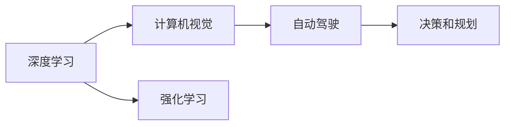

                 

# Andrej Karpathy：人工智能的未来发展策略

> 关键词：人工智能(AI), 深度学习, 计算机视觉, 自动驾驶, 强化学习

## 1. 背景介绍

### 1.1 问题由来

Andrej Karpathy，作为斯坦福大学计算机科学系的教授，同时也是AI领域的先锋人物，对人工智能的未来发展有着独到的见解。他的研究和教学领域涵盖了深度学习、计算机视觉、自动驾驶等多个前沿领域，尤其以在自动驾驶和强化学习方面的研究著称。本文将探讨Karpathy对人工智能未来发展策略的看法，包括深度学习在AI中的应用、自动驾驶的挑战与未来、以及强化学习的前景等关键问题。

### 1.2 问题核心关键点

Andrej Karpathy认为，未来人工智能的发展方向在于以下几个关键点：
- **深度学习**：作为当前AI研究的主要工具，深度学习将继续发挥重要作用。
- **自动驾驶**：实现自动驾驶技术，不仅需要强大的计算机视觉和感知能力，还需要解决复杂的决策和规划问题。
- **强化学习**：通过学习最优策略，强化学习有望在多领域中实现突破。

### 1.3 问题研究意义

探讨Andrej Karpathy对人工智能未来发展策略的看法，具有重要的理论和实践意义：
- **理论价值**：为人工智能领域的研究者和工程师提供方向性的指导，促进学术和产业的共同进步。
- **实践应用**：帮助企业和技术团队明确未来发展方向，制定合理的技术路线图。
- **人才培养**：为即将进入该领域的年轻人才提供清晰的职业发展路径和研究焦点。

## 2. 核心概念与联系

### 2.1 核心概念概述

为更好地理解Andrej Karpathy的观点，本节将介绍几个核心概念及其相互关系：

- **深度学习(Deep Learning)**：一种基于神经网络的机器学习方法，通过多层次的非线性变换提取数据特征。
- **计算机视觉(Computer Vision)**：AI的一个分支，旨在使计算机能够“看”和“理解”图像和视频。
- **自动驾驶(Autonomous Driving)**：结合计算机视觉和强化学习等技术，实现无人驾驶汽车。
- **强化学习(Reinforcement Learning)**：一种通过试错来学习最优策略的机器学习方法。

这些核心概念之间存在着紧密的联系，可以通过以下Mermaid流程图来展示：



这个流程图展示了深度学习、计算机视觉、自动驾驶和强化学习之间的联系：
- 深度学习为计算机视觉提供了强大的特征提取能力。
- 计算机视觉在自动驾驶中用于环境感知。
- 强化学习在自动驾驶中用于决策和路径规划。

### 2.2 概念间的关系

这些核心概念之间的逻辑关系可以通过以下图表来展示：


这个图表展示了深度学习、计算机视觉、自动驾驶和强化学习之间的直接和间接联系。

### 2.3 核心概念的整体架构

最后，我们用一个综合的流程图来展示这些核心概念在大规模人工智能系统中的整体架构：


这个综合流程图展示了从大规模数据预处理到自动驾驶系统执行的完整过程。

## 3. 核心算法原理 & 具体操作步骤

### 3.1 算法原理概述

Andrej Karpathy认为，深度学习是当前AI研究的主要工具。其核心原理是通过多层神经网络对数据进行特征提取和分类。深度学习模型的训练通常涉及大量标注数据，通过反向传播算法调整模型参数，使得模型能够准确预测新数据。

### 3.2 算法步骤详解

深度学习的核心算法步骤如下：
1. **数据预处理**：对原始数据进行清洗和标准化处理。
2. **构建模型**：选择合适的神经网络结构和参数。
3. **训练模型**：使用反向传播算法调整模型参数，最小化损失函数。
4. **模型评估**：在测试集上评估模型性能。
5. **模型优化**：通过超参数调整和正则化技术提高模型泛化能力。

### 3.3 算法优缺点

深度学习的主要优点包括：
- **强大的特征提取能力**：能够自动学习数据的复杂特征。
- **泛化能力强**：在大规模数据集上进行训练后，能够在未见过的数据上表现良好。
- **应用广泛**：广泛应用于图像识别、语音识别、自然语言处理等领域。

其缺点包括：
- **需要大量数据和计算资源**：训练深度学习模型需要大量标注数据和强大的计算设备。
- **模型复杂度高**：神经网络结构复杂，难以解释和调试。
- **过拟合风险**：在训练集上过拟合的风险较高。

### 3.4 算法应用领域

深度学习在以下领域得到了广泛应用：
- **计算机视觉**：如图像分类、目标检测、语义分割等。
- **自然语言处理**：如文本分类、机器翻译、文本生成等。
- **自动驾驶**：如环境感知、路径规划、决策控制等。
- **医疗影像**：如疾病诊断、图像引导手术等。

## 4. 数学模型和公式 & 详细讲解 & 举例说明

### 4.1 数学模型构建

Andrej Karpathy在其研究中，经常使用以下数学模型来描述深度学习过程：
- **前向传播**：将输入数据通过多层神经网络进行正向计算。
- **损失函数**：如均方误差、交叉熵等，用于衡量模型预测与真实标签之间的差异。
- **反向传播**：通过链式法则计算梯度，更新模型参数。

### 4.2 公式推导过程

以计算机视觉中的图像分类为例，Andrej Karpathy经常使用如下公式来描述模型训练过程：
$$
\min_{\theta} \frac{1}{N} \sum_{i=1}^N L(f_\theta(x_i), y_i)
$$
其中，$f_\theta(x_i)$ 表示输入图像 $x_i$ 通过神经网络模型 $\theta$ 的输出，$y_i$ 表示真实标签，$L$ 为损失函数，$N$ 为样本数。

### 4.3 案例分析与讲解

在自动驾驶中，Andrej Karpathy和他的团队使用深度学习模型来实现环境感知和决策规划。以下是一个简化的案例分析：

- **环境感知**：使用卷积神经网络(CNN)对摄像头采集的图像进行特征提取，识别出道路、车辆、行人等对象。
- **决策规划**：通过长短期记忆网络(LSTM)对感知结果进行序列建模，预测未来的行驶路径。

## 5. 项目实践：代码实例和详细解释说明

### 5.1 开发环境搭建

在实践深度学习项目时，需要以下开发环境：
- **编程语言**：Python
- **深度学习框架**：TensorFlow、PyTorch
- **计算资源**：GPU、TPU
- **数据集**：公开数据集如CIFAR-10、ImageNet、Cityscapes等

### 5.2 源代码详细实现

以下是一个简单的图像分类代码示例，使用PyTorch框架：

```python
import torch
import torch.nn as nn
import torch.optim as optim

# 定义模型结构
class CNN(nn.Module):
    def __init__(self):
        super(CNN, self).__init__()
        self.conv1 = nn.Conv2d(3, 32, 3, padding=1)
        self.conv2 = nn.Conv2d(32, 64, 3, padding=1)
        self.fc1 = nn.Linear(64 * 28 * 28, 1024)
        self.fc2 = nn.Linear(1024, 10)

    def forward(self, x):
        x = torch.relu(self.conv1(x))
        x = torch.relu(self.conv2(x))
        x = x.view(-1, 64 * 28 * 28)
        x = torch.relu(self.fc1(x))
        x = self.fc2(x)
        return x

# 加载数据集
train_loader = torch.utils.data.DataLoader(train_dataset, batch_size=64, shuffle=True)
test_loader = torch.utils.data.DataLoader(test_dataset, batch_size=64, shuffle=False)

# 定义模型、优化器和损失函数
model = CNN()
criterion = nn.CrossEntropyLoss()
optimizer = optim.Adam(model.parameters(), lr=0.001)

# 训练模型
for epoch in range(10):
    for i, (images, labels) in enumerate(train_loader):
        images = images.to(device)
        labels = labels.to(device)
        optimizer.zero_grad()
        outputs = model(images)
        loss = criterion(outputs, labels)
        loss.backward()
        optimizer.step()
```

### 5.3 代码解读与分析

在上述代码中，定义了一个简单的卷积神经网络模型，使用了Adam优化器和交叉熵损失函数。训练过程中，通过反向传播算法更新模型参数，最小化损失函数。

## 6. 实际应用场景

### 6.1 计算机视觉

Andrej Karpathy的团队在计算机视觉领域做出了许多创新性工作，例如：
- **大规模图像识别**：使用深度学习模型在ImageNet数据集上取得了突破性成绩。
- **实例分割**：开发了实例分割算法Mask R-CNN，能够精确识别图像中的每个实例。

### 6.2 自动驾驶

Andrej Karpathy的研究团队在自动驾驶领域也有重大突破，例如：
- **端到端驾驶**：开发了端到端驾驶算法，能够实现从感知到决策的全程自主驾驶。
- **场景理解**：使用卷积神经网络进行场景理解，提高了自动驾驶的安全性和可靠性。

### 6.3 强化学习

Andrej Karpathy在强化学习领域也有深入研究，例如：
- **AlphaGo**：参与了AlphaGo的开发，证明了强化学习在复杂决策问题上的能力。
- **机器人控制**：使用强化学习训练机器人进行复杂环境下的操作。

## 7. 工具和资源推荐

### 7.1 学习资源推荐

- **深度学习课程**：Coursera上的《深度学习专项课程》。
- **计算机视觉书籍**：《Python计算机视觉》。
- **自动驾驶资源**：Apollo自动驾驶平台。

### 7.2 开发工具推荐

- **深度学习框架**：TensorFlow、PyTorch
- **计算资源**：Google Colab、AWS GPU实例
- **数据集**：Kaggle数据集

### 7.3 相关论文推荐

- **AlphaGo论文**：DeepMind的《Playing Atari with Deep Reinforcement Learning》。
- **强化学习教材**：《Reinforcement Learning: An Introduction》。

## 8. 总结：未来发展趋势与挑战

### 8.1 总结

Andrej Karpathy对人工智能的未来发展策略进行了深入分析，提出了深度学习、计算机视觉、自动驾驶和强化学习等领域的发展方向。深度学习作为当前AI研究的主要工具，将继续发挥重要作用。自动驾驶和强化学习有望在多领域中实现突破。

### 8.2 未来发展趋势

未来人工智能的发展趋势包括：
- **深度学习技术的普及**：深度学习技术将广泛应用于更多领域。
- **计算机视觉的突破**：图像和视频处理技术将取得新的突破。
- **自动驾驶的实现**：无人驾驶汽车将逐渐普及。
- **强化学习的应用**：在复杂决策问题中取得更多成功案例。

### 8.3 面临的挑战

尽管未来人工智能的发展前景广阔，但也面临以下挑战：
- **数据隐私和安全**：大规模数据集的使用可能带来隐私和安全问题。
- **计算资源限制**：深度学习模型需要大量计算资源，训练和推理成本较高。
- **伦理和法律问题**：AI技术的应用可能引发伦理和法律争议。

### 8.4 研究展望

未来研究需要关注以下方向：
- **可解释性和透明性**：提高AI模型的可解释性和透明性，增强公众信任。
- **跨领域融合**：探索AI与其他技术领域的融合，如区块链、物联网等。
- **社会责任**：开发负责任的AI技术，关注其对社会和环境的影响。

## 9. 附录：常见问题与解答

**Q1：深度学习在人工智能中的应用有哪些？**

A: 深度学习在以下领域中得到广泛应用：
- **图像处理**：如图像分类、目标检测、语义分割等。
- **语音识别**：如语音识别、语音合成等。
- **自然语言处理**：如文本分类、机器翻译、文本生成等。
- **游戏AI**：如AlphaGo等。

**Q2：自动驾驶面临的主要挑战有哪些？**

A: 自动驾驶面临的主要挑战包括：
- **环境感知**：识别道路、车辆、行人等对象。
- **决策规划**：制定最优行驶路径。
- **安全性**：确保无人驾驶的安全性和可靠性。

**Q3：强化学习在哪些领域中有重要应用？**

A: 强化学习在以下领域中有重要应用：
- **游戏AI**：如AlphaGo、Dota2等。
- **机器人控制**：如AlphaStar等。
- **智能推荐系统**：如电商平台、音乐推荐等。

**Q4：如何提高AI模型的可解释性和透明性？**

A: 提高AI模型的可解释性和透明性，可以从以下几个方面入手：
- **可解释模型**：使用可解释性更强的模型，如线性模型、决策树等。
- **特征重要性分析**：分析模型中每个特征的重要性，解释模型决策过程。
- **可视化工具**：使用可视化工具展示模型内部结构和决策过程。

**Q5：AI技术的发展将对社会产生哪些影响？**

A: AI技术的发展将对社会产生以下影响：
- **就业结构变化**：AI技术将改变就业结构，部分职业可能会被取代。
- **隐私和安全问题**：大规模数据集的使用可能带来隐私和安全问题。
- **伦理和法律问题**：AI技术的应用可能引发伦理和法律争议。

---

作者：禅与计算机程序设计艺术 / Zen and the Art of Computer Programming

