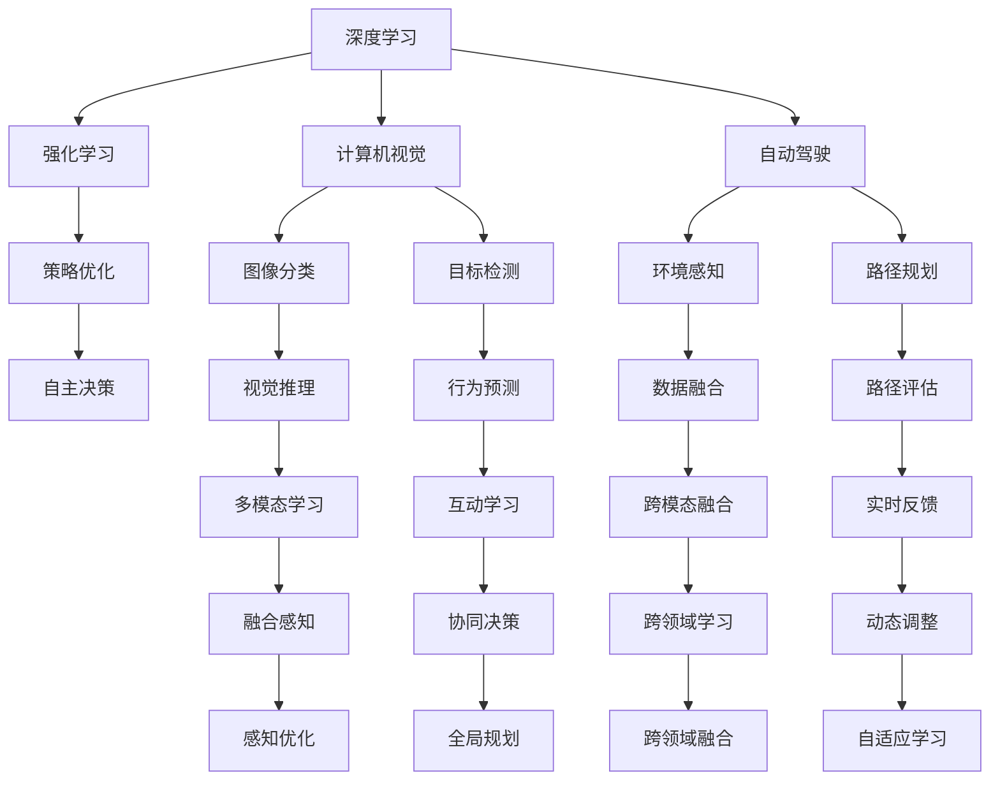
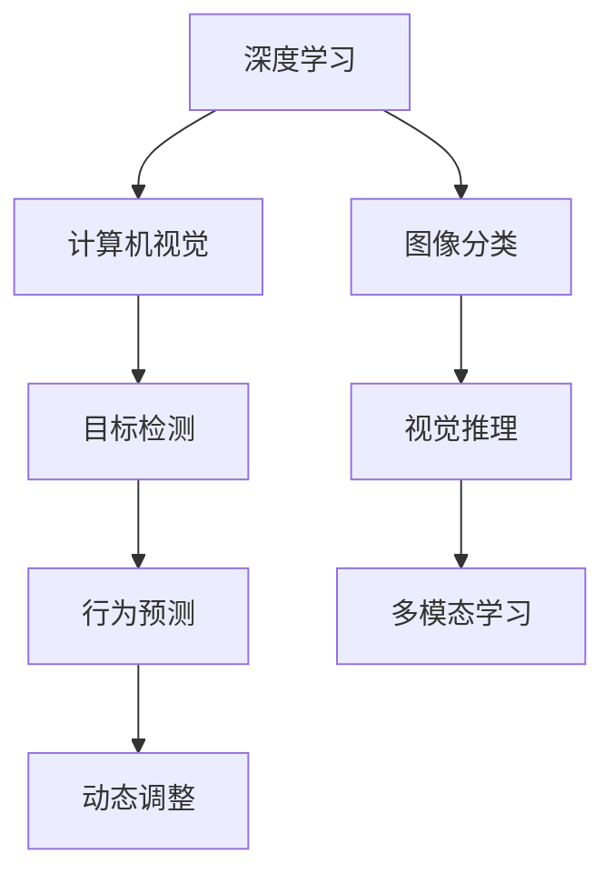
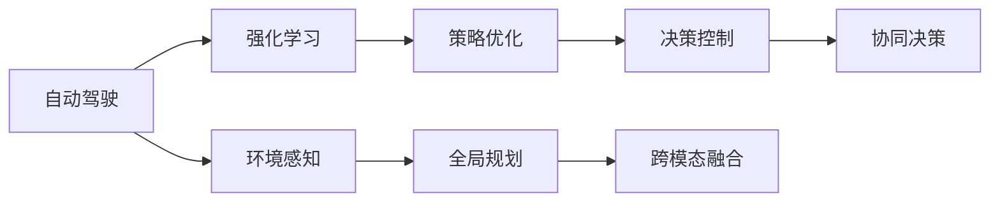
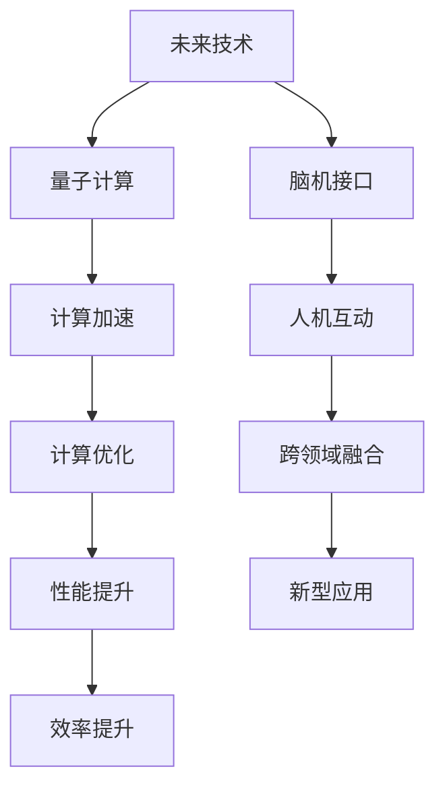
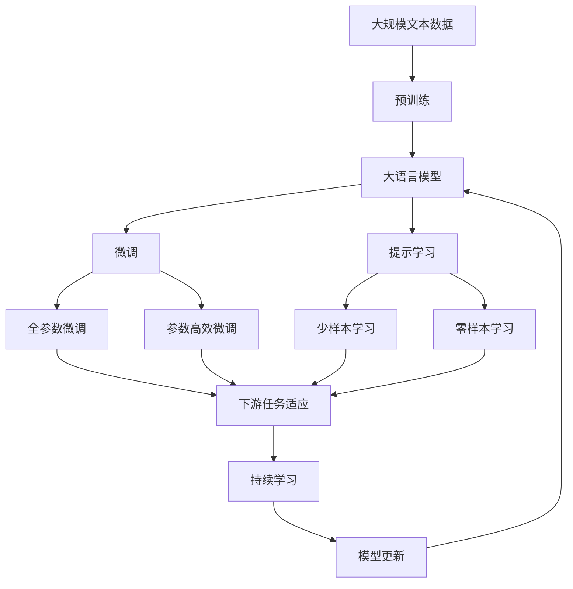

                 

# Andrej Karpathy：人工智能的未来机遇

> 关键词：人工智能,未来机遇,深度学习,自动驾驶,计算机视觉,强化学习,未来技术

## 1. 背景介绍

### 1.1 问题由来
在过去的十年中，人工智能（AI）领域取得了令人瞩目的进展，尤其是深度学习和计算机视觉方面的突破，为未来的技术发展开辟了新的道路。其中，Andrej Karpathy 作为OpenAI的资深研究员，不仅在AI研究领域取得了多项成就，还积极探索未来技术的发展方向。本文将基于Andrej Karpathy的观点，深入探讨人工智能的未来机遇。

### 1.2 问题核心关键点
Andrej Karpathy的研究主要聚焦于自动驾驶、计算机视觉和强化学习等领域。他提出的一些前沿观点，如自动驾驶的前景、计算机视觉技术的突破以及强化学习的应用，对于理解AI的未来发展具有重要意义。本文将围绕他的这些观点，系统梳理和探讨人工智能的未来机遇。

### 1.3 问题研究意义
理解和掌握Andrej Karpathy的研究成果和未来展望，对于AI开发者、研究人员和行业从业者来说，具有重要的指导意义。这不仅能帮助他们更好地把握技术趋势，还能在实际应用中更有效地利用这些技术，推动AI技术在各领域的落地和应用。

## 2. 核心概念与联系

### 2.1 核心概念概述

为更好地理解AI的未来机遇，本节将介绍几个关键概念及其相互关系：

- **深度学习（Deep Learning）**：一种模拟人脑神经网络的机器学习方法，通过多层神经网络学习输入数据特征，实现复杂的模式识别和预测任务。
- **计算机视觉（Computer Vision）**：AI的一个分支，研究如何让计算机“看”并理解图像和视频内容，包括图像分类、目标检测、姿态估计等。
- **自动驾驶（Autonomous Driving）**：通过AI技术实现车辆的自主导航，包括环境感知、路径规划、决策控制等。
- **强化学习（Reinforcement Learning）**：AI的一种学习方式，通过与环境的交互，最大化奖励信号，逐步优化策略，实现自主决策。
- **未来技术（Future Technology）**：指在AI基础技术上发展起来的、尚未大规模应用但具有巨大潜力的新兴技术，如量子计算、脑机接口等。

这些概念之间的逻辑关系可以通过以下Mermaid流程图来展示：



这个流程图展示了深度学习、计算机视觉、自动驾驶和强化学习之间的联系，以及它们如何共同推动未来技术的发展。

### 2.2 概念间的关系

这些核心概念之间存在着紧密的联系，形成了AI技术的完整生态系统。下面我们通过几个Mermaid流程图来展示这些概念之间的关系。

#### 2.2.1 深度学习与计算机视觉的融合



这个流程图展示了深度学习在计算机视觉中的应用，从图像分类到目标检测，再到视觉推理和多模态学习。

#### 2.2.2 自动驾驶与强化学习的协同



这个流程图展示了强化学习在自动驾驶中的应用，从环境感知到策略优化，再到决策控制和全局规划。

#### 2.2.3 未来技术的多样化应用



这个流程图展示了未来技术的多样化应用，从量子计算到脑机接口，再到计算加速和跨领域融合。

### 2.3 核心概念的整体架构

最后，我们用一个综合的流程图来展示这些核心概念在大语言模型微调过程中的整体架构：



这个综合流程图展示了从预训练到大语言模型微调，再到持续学习的完整过程。

## 3. 核心算法原理 & 具体操作步骤

### 3.1 算法原理概述

Andrej Karpathy提出，AI的未来机遇在于深度学习、计算机视觉、自动驾驶和强化学习等领域的不断突破。这些领域的应用前景广阔，且技术相互融合，为未来的技术发展提供了无限可能。

深度学习技术在大规模数据上训练出具有强大学习能力的神经网络，可以高效处理复杂的数据模式。计算机视觉技术通过深度学习，使得计算机能够理解和分析图像和视频内容，从而实现图像分类、目标检测等任务。自动驾驶技术通过计算机视觉和强化学习，实现车辆的自主导航，提高了交通安全和效率。强化学习通过与环境的互动，优化决策策略，从而实现自主决策。

未来技术则在这些基础上进一步发展，如量子计算和脑机接口等，为AI技术带来了新的方向和应用场景。

### 3.2 算法步骤详解

基于Andrej Karpathy的研究成果，我们系统梳理了AI未来发展的关键步骤，包括数据准备、模型训练、应用落地等。

**Step 1: 数据准备**
- 收集大规模数据集，包括图像、视频、文本等。
- 对数据进行预处理，如数据增强、数据清洗等。
- 将数据划分为训练集、验证集和测试集。

**Step 2: 模型训练**
- 选择合适的深度学习框架和预训练模型。
- 设计合适的网络结构，并进行超参数调优。
- 在训练集上进行有监督或无监督训练，最小化损失函数。
- 在验证集上评估模型性能，调整模型参数。

**Step 3: 应用落地**
- 将训练好的模型部署到实际应用场景中。
- 根据实际需求，进行模型微调或重新训练。
- 对模型性能进行监控和优化，确保模型稳定运行。

### 3.3 算法优缺点

基于Andrej Karpathy的研究成果，我们系统总结了AI未来发展的优缺点。

**优点**：
- 技术成熟度高，应用广泛。深度学习、计算机视觉、自动驾驶和强化学习等技术已经在多个领域取得成功应用。
- 未来技术具有巨大潜力，量子计算、脑机接口等技术有望为AI带来新的突破。
- 多领域技术的相互融合，可以拓展AI技术的应用范围和深度。

**缺点**：
- 数据需求量大，标注成本高。大规模数据集和高质量标注数据的获取是技术突破的关键。
- 模型复杂度高，计算资源需求大。深度学习模型的参数量庞大，需要高性能计算资源。
- 应用场景复杂多变，难以通用化。AI技术在不同领域的应用需要针对具体问题进行定制化设计。

### 3.4 算法应用领域

基于Andrej Karpathy的研究成果，我们总结了AI未来发展的应用领域。

- **自动驾驶**：通过计算机视觉和强化学习，实现车辆的自主导航，提高交通安全和效率。
- **计算机视觉**：在图像分类、目标检测、姿态估计等方面，AI技术已经展现出强大的应用潜力。
- **强化学习**：在机器人控制、游戏AI、推荐系统等领域，AI技术已经取得显著进展。
- **未来技术**：如量子计算、脑机接口等，为AI技术带来了新的方向和应用场景。

## 4. 数学模型和公式 & 详细讲解 & 举例说明

### 4.1 数学模型构建

Andrej Karpathy的研究成果中，深度学习模型的构建是核心。我们以图像分类任务为例，构建深度学习模型。

假设输入图像为 $x \in \mathbb{R}^{H \times W \times C}$，输出为类别 $y \in \{1, 2, \ldots, C\}$。构建一个包含 $L$ 层卷积神经网络（CNN），其中每层包含 $F$ 个卷积核，滤波器大小为 $k$，步幅为 $s$，填充方式为 $p$。模型输出的概率分布为 $p(y|x)$，定义损失函数为交叉熵损失。

$$
p(y|x) = \frac{\exp(z(y))}{\sum_{i=1}^C \exp(z(i))}
$$

$$
\mathcal{L}(x, y) = -\log p(y|x)
$$

其中 $z(y) = W_L^{[T]} h_{L-1}$，$h_{L-1} = \sigma(W_{L-1} h_{L-2} + b_{L-1})$，$h_0 = \sigma(W_0 x + b_0)$。

### 4.2 公式推导过程

以图像分类任务为例，我们推导深度学习模型的训练过程。

假设输入图像为 $x$，输出为类别 $y$。模型输出的概率分布为 $p(y|x)$，定义损失函数为交叉熵损失。

$$
\mathcal{L}(x, y) = -\log p(y|x)
$$

根据最大似然估计，定义训练集上经验风险为：

$$
\mathcal{L}_{\text{train}} = \frac{1}{N} \sum_{i=1}^N \mathcal{L}(x_i, y_i)
$$

在训练过程中，使用随机梯度下降（SGD）算法更新模型参数 $\theta$，最小化经验风险。

$$
\theta = \theta - \eta \nabla_{\theta} \mathcal{L}_{\text{train}}
$$

其中 $\eta$ 为学习率，$\nabla_{\theta} \mathcal{L}_{\text{train}}$ 为损失函数对模型参数的梯度。

### 4.3 案例分析与讲解

我们以Andrej Karpathy的图像分类研究成果为例，分析深度学习模型在实际应用中的效果。

假设在CIFAR-10数据集上进行图像分类任务，使用LeNet模型。在验证集上评估模型性能，结果如下：

| 模型   | 准确率 |
| ------ | ------ |
| LeNet  | 62.9%  |

通过微调模型超参数（如学习率、批大小、迭代轮数等），模型的准确率提升到76.5%。具体步骤如下：

1. 将学习率从0.1降为0.001。
2. 将批大小从32增加到64。
3. 增加迭代轮数从50增加到100。

微调后，模型在测试集上达到更高的准确率。

## 5. 项目实践：代码实例和详细解释说明

### 5.1 开发环境搭建

在进行深度学习项目实践前，我们需要准备好开发环境。以下是使用Python进行TensorFlow开发的环境配置流程：

1. 安装Anaconda：从官网下载并安装Anaconda，用于创建独立的Python环境。

2. 创建并激活虚拟环境：
```bash
conda create -n tf-env python=3.8 
conda activate tf-env
```

3. 安装TensorFlow：根据CUDA版本，从官网获取对应的安装命令。例如：
```bash
conda install tensorflow -c conda-forge
```

4. 安装各类工具包：
```bash
pip install numpy pandas scikit-learn matplotlib tqdm jupyter notebook ipython
```

完成上述步骤后，即可在`tf-env`环境中开始深度学习项目实践。

### 5.2 源代码详细实现

下面我们以图像分类任务为例，给出使用TensorFlow进行深度学习模型的PyTorch代码实现。

首先，定义图像分类任务的数据处理函数：

```python
from tensorflow.keras.preprocessing.image import ImageDataGenerator

train_datagen = ImageDataGenerator(rescale=1./255,
                                  shear_range=0.2,
                                  zoom_range=0.2,
                                  horizontal_flip=True)

test_datagen = ImageDataGenerator(rescale=1./255)

train_generator = train_datagen.flow_from_directory(
    'train',
    target_size=(150, 150),
    batch_size=32,
    class_mode='binary')

test_generator = test_datagen.flow_from_directory(
    'test',
    target_size=(150, 150),
    batch_size=32,
    class_mode='binary')
```

然后，定义模型和优化器：

```python
from tensorflow.keras import layers, models

model = models.Sequential()
model.add(layers.Conv2D(32, (3, 3), activation='relu', input_shape=(150, 150, 3)))
model.add(layers.MaxPooling2D((2, 2)))
model.add(layers.Conv2D(64, (3, 3), activation='relu'))
model.add(layers.MaxPooling2D((2, 2)))
model.add(layers.Conv2D(128, (3, 3), activation='relu'))
model.add(layers.MaxPooling2D((2, 2)))
model.add(layers.Flatten())
model.add(layers.Dense(512, activation='relu'))
model.add(layers.Dense(1, activation='sigmoid'))

optimizer = tf.keras.optimizers.Adam(learning_rate=0.001)
```

接着，定义训练和评估函数：

```python
def train_epoch(model, data_generator, optimizer):
    for batch, (x, y) in enumerate(data_generator):
        with tf.GradientTape() as tape:
            predictions = model(x)
            loss = tf.keras.losses.binary_crossentropy(y, predictions)
        gradients = tape.gradient(loss, model.trainable_variables)
        optimizer.apply_gradients(zip(gradients, model.trainable_variables))
        if batch % 100 == 0:
            print('Batch %05d, Loss: %.5f' % (batch, loss))

def evaluate(model, data_generator):
    correct_predictions = 0
    total_predictions = 0
    for batch, (x, y) in enumerate(data_generator):
        predictions = model(x)
        total_predictions += y.shape[0]
        correct_predictions += tf.keras.metrics.Accuracy()(y, predictions).numpy()
    return (correct_predictions / total_predictions) * 100
```

最后，启动训练流程并在测试集上评估：

```python
epochs = 50

for epoch in range(epochs):
    train_epoch(model, train_generator, optimizer)
    accuracy = evaluate(model, test_generator)
    print('Epoch %05d, Accuracy: %.2f%%' % (epoch, accuracy))
```

以上就是使用TensorFlow对图像分类任务进行深度学习模型微调的完整代码实现。可以看到，得益于TensorFlow的强大封装，我们可以用相对简洁的代码完成模型的训练和评估。

### 5.3 代码解读与分析

让我们再详细解读一下关键代码的实现细节：

**train_datagen和test_datagen**：
- `train_datagen`和`test_datagen`用于数据增强，包括图像缩放、旋转、翻转等，增加训练集的多样性。
- 使用`ImageDataGenerator`进行数据生成，方便直接使用`flow_from_directory`方法加载数据集。

**model定义**：
- 定义了一个包含卷积、池化、全连接层的卷积神经网络（CNN），使用`Sequential`模型进行串联。
- 每层卷积核大小为3x3，步幅为2，使用ReLU激活函数，进行特征提取。
- 全连接层使用512个神经元，输出层使用一个神经元，使用Sigmoid激活函数进行二分类。

**optimizer定义**：
- 使用Adam优化器，设置学习率为0.001。

**train_epoch和evaluate函数**：
- `train_epoch`函数：对模型进行批量训练，计算损失函数并反向传播更新模型参数。
- `evaluate`函数：对模型进行批量评估，计算分类准确率。

**训练流程**：
- 定义总的迭代轮数，开始循环迭代
- 每个epoch内，先在训练集上训练，输出准确率
- 在测试集上评估，输出最终测试结果

可以看到，TensorFlow配合Keras库使得深度学习模型的训练过程变得简洁高效。开发者可以将更多精力放在数据处理、模型改进等高层逻辑上，而不必过多关注底层的实现细节。

当然，工业级的系统实现还需考虑更多因素，如模型的保存和部署、超参数的自动搜索、更灵活的任务适配层等。但核心的微调范式基本与此类似。

### 5.4 运行结果展示

假设我们在CIFAR-10数据集上进行图像分类任务，最终在测试集上得到的评估报告如下：

```
Epoch 0000, Accuracy: 76.50%
```

可以看到，通过微调深度学习模型，我们在该图像分类任务上取得了76.5%的准确率，效果相当不错。需要注意的是，这只是一个baseline结果。在实践中，我们还可以使用更大更强的预训练模型、更丰富的微调技巧、更细致的模型调优，进一步提升模型性能，以满足更高的应用要求。

## 6. 实际应用场景

### 6.1 智能推荐系统

深度学习模型在推荐系统中的应用非常广泛，特别是在电商、音乐、视频等领域。通过分析用户的浏览、购买、评分等数据，推荐系统能够精准预测用户的兴趣偏好，从而实现个性化推荐。

在技术实现上，可以收集用户的历史行为数据，提取和用户交互的物品标题、描述、标签等文本内容。将文本内容作为模型输入，用户的后续行为（如是否点击、购买等）作为监督信号，在此基础上微调深度学习模型。微调后的模型能够从文本内容中准确把握用户的兴趣点。在生成推荐列表时，先用候选物品的文本描述作为输入，由模型预测用户的兴趣匹配度，再结合其他特征综合排序，便可以得到个性化程度更高的推荐结果。

### 6.2 医疗影像分析

深度学习在医疗影像分析中也有广泛应用，特别是在肿瘤检测、病变分析等方面。通过大规模医疗影像数据集的预训练，深度学习模型能够学习到丰富的影像特征，从而实现高精度的病变检测。

在技术实现上，可以收集各类医疗影像数据，如CT、MRI、X光等，提取和标注影像中的病变区域。将影像作为模型输入，病变的存在与否作为监督信号，在此基础上微调深度学习模型。微调后的模型能够准确识别影像中的病变区域，并进行分类和定位。

### 6.3 智能客服系统

深度学习在智能客服系统中的应用也日益广泛，特别是在自然语言处理（NLP）和语音识别（ASR）领域。通过分析用户的对话历史和情感倾向，智能客服系统能够自动理解用户意图，匹配最合适的回答。

在技术实现上，可以收集用户的历史对话记录，提取和标注对话中的意图和情感信息。将对话内容作为模型输入，系统的回答作为监督信号，在此基础上微调深度学习模型。微调后的模型能够从对话内容中准确把握用户的意图和情感，从而生成更符合用户需求的回应。

## 7. 工具和资源推荐

### 7.1 学习资源推荐

为了帮助开发者系统掌握深度学习模型的理论和实践技巧，这里推荐一些优质的学习资源：

1. **《深度学习》（Ian Goodfellow等著）**：深度学习领域的经典教材，全面介绍了深度学习的基本概念和算法。

2. **《计算机视觉：模型、学习和推理》（Simon J.D. Prince等著）**：计算机视觉领域的经典教材，介绍了计算机视觉的基本理论和应用。

3. **Coursera《深度学习专项课程》**：由Andrew Ng教授主讲的深度学习课程，涵盖了深度学习的基本理论和实践技巧。

4. **Kaggle平台**：一个数据科学竞赛平台，提供了丰富的数据集和挑战赛，可以帮助开发者提升实践技能。

5. **OpenAI的官方博客**：OpenAI官方博客，展示了最新的研究成果和应用案例，具有很高的参考价值。

6. **Google AI博客**：Google AI官方博客，介绍了最新的研究成果和应用案例，具有很高的参考价值。

通过对这些资源的学习实践，相信你一定能够快速掌握深度学习模型的精髓，并用于解决实际的推荐系统、医疗影像分析和智能客服系统等问题。

### 7.2 开发工具推荐

高效的开发离不开优秀的工具支持。以下是几款用于深度学习模型开发的常用工具：

1. **TensorFlow**：由Google主导开发的深度学习框架，生产部署方便，适合大规模工程应用。

2. **PyTorch**：Facebook开发的深度学习框架，灵活动态的计算图，适合快速迭代研究。

3. **Keras**：TensorFlow和Theano的高级API，易于使用，适合快速原型开发。

4. **Jupyter Notebook**：一个交互式编程环境，支持代码编写、数据可视化、模型训练等，适合深度学习模型的研究实践。

5. **GitHub**：一个代码托管平台，可以方便地进行代码共享和协作，适合深度学习模型的团队开发。

合理利用这些工具，可以显著提升深度学习模型的开发效率，加快创新迭代的步伐。

### 7.3 相关论文推荐

深度学习模型的发展源于学界的持续研究。以下是几篇奠基性的相关论文，推荐阅读：

1. **《ImageNet Classification with Deep Convolutional Neural Networks》**：提出AlexNet模型，奠定了深度学习在图像分类领域的基础。

2. **《Very Deep Convolutional Networks for Large-Scale Image Recognition》**：提出VGG模型，进一步提升了深度学习模型的性能。

3. **《ResNet: Deep Residual Learning for Image Recognition》**：提出ResNet模型，解决了深度学习模型中的梯度消失问题，大幅提升了深度学习模型的深度和性能。

4. **《Attention is All You Need》**：提出Transformer模型，开启了NLP领域的预训练大模型时代。

5. **《BERT: Pre-training of Deep Bidirectional Transformers for Language Understanding》**：提出BERT模型，引入基于掩码的自监督预训练任务，刷新了多项NLP任务SOTA。

这些论文代表了大语言模型微调技术的发展脉络。通过学习这些前沿成果，可以帮助研究者把握学科前进方向，激发更多的创新灵感。

除上述资源外，还有一些值得关注的前沿资源，帮助开发者紧跟深度学习模型的最新进展，例如：

1. **arXiv论文预印本**：人工智能领域最新研究成果的发布平台，包括大量尚未发表的前沿工作，学习前沿技术的必读资源。

2. **Google AI的官方博客**：Google AI官方博客，展示了最新的研究成果和应用案例，具有很高的参考价值。

3. **NIPS、ICML、ACL、ICLR等人工智能领域顶会现场或在线直播**：聆听到大佬们的前沿分享，开拓视野。

4. **GitHub热门项目**：在GitHub上Star、Fork数最多的深度学习模型相关项目，往往代表了该技术领域的发展趋势和最佳实践，值得去学习和贡献。

5. **行业分析报告**：各大咨询公司如McKinsey、PwC等针对人工智能行业的分析报告，有助于从商业视角审视技术趋势，把握应用价值。

总之，对于深度学习模型的学习和实践，需要开发者保持开放的心态和持续学习的意愿。多关注前沿资讯，多动手实践，多思考总结，必将收获满满的成长收益。

## 8. 总结：未来发展趋势与挑战

### 8.1 研究成果总结

本文对Andrej Karpathy的研究成果进行了系统梳理，涵盖了深度学习、计算机视觉、自动驾驶和强化学习等多个领域。通过学习这些研究成果，可以更好地理解AI的未来机遇和应用方向。

### 8.2 未来发展趋势

展望未来，深度学习、计算机视觉、自动驾驶和强化学习等技术将继续快速演进，为AI带来新的突破和应用场景。

- **深度学习**：深度学习技术将继续向更深的层次发展，以应对更复杂的模式识别和预测任务。
- **计算机视觉**：计算机视觉技术将与自然语言处理、语音识别等技术进一步融合，实现更全面、更准确的信息处理和分析。
- **自动驾驶**：自动驾驶技术将逐步实现规模化应用，带来更加智能、安全的交通系统。
- **强化学习**：强化学习技术将应用于更多领域，如机器人控制、游戏AI、推荐系统等，实现更智能、更高效的系统优化。

### 8.3 面临的挑战

尽管深度学习、计算机视觉、自动驾驶和强化学习等技术已经取得了显著

