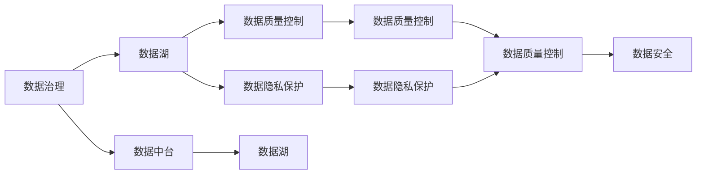

                 

# AI创业：数据管理的成功方法

> 关键词：
- AI创业
- 数据管理
- 成功方法
- 数据治理
- 数据湖
- 数据中台
- 数据质量控制
- 数据隐私保护
- 数据安全

## 1. 背景介绍

在AI创业的浪潮中，数据管理和治理的重要性不言而喻。无论是在智能推荐、自然语言处理、计算机视觉等NLP领域，还是在机器人、自动驾驶等泛AI领域，高质量的数据都是不可或缺的基础。然而，随着数据规模的指数级增长，数据管理变得越来越复杂和艰巨。如何在数据量不断膨胀的背景下，构建高效、安全、可靠的数据管理体系，成为AI创业项目成功与否的关键因素之一。本文将从数据管理的具体实践出发，探讨如何通过数据治理、数据湖与数据中台构建、数据质量控制以及数据隐私保护等手段，成功管理AI创业项目中的海量数据，助力业务增长。

## 2. 核心概念与联系

### 2.1 核心概念概述

要深入理解AI创业中的数据管理，首先需要了解几个核心概念：

- **数据治理**：确保数据的完整性、一致性、可用性以及质量，通过制度、工具、流程和技术手段，实现数据的规范化和标准化。
- **数据湖**：一个开放、弹性、高效的数据存储和管理平台，用于存储各类原始数据，同时支持实时分析和复杂数据处理。
- **数据中台**：一个集中式的数据处理和管理平台，通过数据整合、数据质量和数据治理，支持业务分析、决策支持等。
- **数据质量控制**：通过一系列技术和流程，确保数据的准确性、完整性和及时性，提升数据可靠性。
- **数据隐私保护**：在数据存储、传输和使用的各个环节，采取技术和管理措施，确保数据的安全性和隐私性，避免数据泄露和滥用。
- **数据安全**：通过技术和管理手段，保护数据免受未经授权的访问、使用、篡改和泄露，确保数据安全性。

这些概念之间相互关联，共同构成了AI创业中数据管理的基础框架。通过合理运用这些概念和技术手段，可以有效管理和利用海量数据，为AI创业项目提供坚实的数据支撑。

### 2.2 概念间的关系

这些核心概念之间的关系可以通过以下Mermaid流程图来展示：



这个流程图展示了大数据管理中的各个核心概念及其之间的关系：

1. 数据治理通过制度和技术手段，确保数据的规范化和标准化，为数据湖和数据中台建设奠定基础。
2. 数据湖作为数据存储和处理平台，支撑数据中台的数据整合和处理，同时提供高效的数据存储和处理能力。
3. 数据中台通过数据整合、数据质量和数据治理，支持业务分析、决策支持等。
4. 数据质量控制通过技术和流程手段，确保数据的准确性、完整性和及时性。
5. 数据隐私保护在数据存储、传输和使用的各个环节，确保数据的安全性和隐私性。
6. 数据安全通过技术和管理手段，保护数据免受未经授权的访问、使用、篡改和泄露。

这些概念共同构成了数据管理的完整生态系统，通过相互配合，可以有效管理和利用海量数据，为AI创业项目提供坚实的数据支撑。

## 3. 核心算法原理 & 具体操作步骤
### 3.1 算法原理概述

数据管理的核心算法原理，主要集中在数据治理、数据湖与数据中台构建、数据质量控制和数据隐私保护等方面。这些算法原理通过数据建模、数据治理策略、数据存储管理和数据隐私保护技术，实现了数据的规范化和标准化，确保了数据的质量和安全，为AI创业项目提供了可靠的数据基础。

### 3.2 算法步骤详解

1. **数据建模**：通过数据建模技术，将原始数据转化为结构化数据，并制定标准化的数据模型。这包括数据分类、数据命名、数据版本控制等步骤。
2. **数据治理策略**：制定数据治理策略，包括数据来源、数据质量、数据访问权限等管理策略，确保数据规范化和标准化。
3. **数据湖与数据中台构建**：搭建数据湖和数据中台，实现数据的集中存储和高效处理，同时提供数据整合、数据清洗和数据质量控制功能。
4. **数据质量控制**：通过数据质量控制算法和技术，确保数据的准确性、完整性和及时性。这包括数据清洗、数据校验、数据补全等步骤。
5. **数据隐私保护**：采用数据隐私保护算法和技术，确保数据的安全性和隐私性。这包括数据加密、数据脱敏、访问控制等措施。

### 3.3 算法优缺点

数据管理算法的主要优点包括：

- 提高了数据的质量和可靠性，减少了因数据不准确或缺失导致的业务决策错误。
- 实现了数据的规范化和标准化，降低了数据管理的复杂度。
- 提供了高效的数据存储和处理能力，支持大规模数据分析和实时处理。
- 通过数据隐私保护技术，确保数据的安全性和隐私性，避免数据泄露和滥用。

然而，数据管理算法也存在一些缺点：

- 数据建模和数据治理需要大量人力和时间投入，成本较高。
- 数据质量控制和数据隐私保护技术需要持续的维护和管理，工作量较大。
- 数据管理和治理流程复杂，需要跨部门协作，协调难度大。

### 3.4 算法应用领域

数据管理算法在多个领域得到了广泛应用，包括但不限于：

- **金融行业**：通过数据治理和数据质量控制，提升金融风险评估、信贷审核、投资决策等业务效率和精度。
- **医疗行业**：通过数据湖和数据中台构建，支持电子病历、医学影像分析、药物研发等业务需求。
- **零售行业**：通过数据质量控制和数据隐私保护，提升消费者行为分析、库存管理、营销策略等业务效果。
- **智能制造**：通过数据湖和数据中台构建，支持设备监控、生产调度、质量控制等业务需求。
- **智慧城市**：通过数据治理和数据质量控制，提升交通管理、公共安全、环境监测等业务效率。

## 4. 数学模型和公式 & 详细讲解 & 举例说明

### 4.1 数学模型构建

在数据管理中，数学模型主要用来描述数据的分布、数据的特征和数据之间的关系。以数据质量控制为例，我们可以使用以下数学模型来描述数据质量：

设数据集为 $D = \{(x_i, y_i)\}_{i=1}^N$，其中 $x_i$ 为数据样本，$y_i$ 为数据质量评分。

- **准确性**：数据样本 $x_i$ 与真实值 $y_i$ 之间的差异度量。设 $\epsilon_i$ 为误差，则准确性模型为：

$$
\epsilon_i = |x_i - y_i|
$$

- **完整性**：数据样本 $x_i$ 中缺失值的数量。设 $k_i$ 为缺失值数量，则完整性模型为：

$$
k_i = \sum_{j=1}^n 1(x_{ij} = \text{null})
$$

- **及时性**：数据样本 $x_i$ 的更新时间与预期时间之间的差异。设 $t_i$ 为实际更新时间，$T_i$ 为预期更新时间，则及时性模型为：

$$
t_i = T_i - t_{i-1}
$$

- **一致性**：数据样本 $x_i$ 在不同来源中的差异。设 $d_i$ 为差异度量，则一致性模型为：

$$
d_i = \sum_{j=1}^n |x_{ij} - \bar{x}_j|
$$

### 4.2 公式推导过程

以数据质量控制为例，我们以准确性模型为例进行推导：

- **准确性模型**：设 $x_i$ 为数据样本，$y_i$ 为数据质量评分，$\epsilon_i$ 为误差，则准确性模型为：

$$
\epsilon_i = |x_i - y_i|
$$

其中 $x_i$ 为数据样本，$y_i$ 为数据质量评分，$\epsilon_i$ 为误差。

- **最小化误差**：为了最小化误差，我们需要找到最优的 $y_i$ 值，使得 $\epsilon_i$ 最小化。因此，可以构建损失函数：

$$
L(y_i) = \sum_{i=1}^N \epsilon_i^2
$$

- **求解最优解**：为了求解最优解，我们需要使用梯度下降等优化算法。具体来说，可以使用以下步骤进行优化：

$$
y_i \leftarrow y_i - \eta \nabla_L(y_i)
$$

其中 $\eta$ 为学习率，$\nabla_L(y_i)$ 为损失函数对 $y_i$ 的梯度。

### 4.3 案例分析与讲解

假设我们在电商行业进行数据质量控制，需要对用户评分进行准确性评估。我们可以使用以下步骤进行数据建模和算法实现：

1. **数据采集**：采集用户评分数据 $D = \{(x_i, y_i)\}_{i=1}^N$，其中 $x_i$ 为评分数据，$y_i$ 为评分标签。
2. **数据建模**：构建准确性模型 $\epsilon_i = |x_i - y_i|$。
3. **优化算法**：使用梯度下降等优化算法，最小化损失函数 $L(y_i) = \sum_{i=1}^N \epsilon_i^2$。
4. **结果分析**：根据优化结果，调整评分模型的准确性，确保评分数据的可靠性。

## 5. 项目实践：代码实例和详细解释说明

### 5.1 开发环境搭建

在项目实践过程中，开发环境搭建是必不可少的。以下是使用Python进行数据管理开发的环境配置流程：

1. **安装Python**：下载并安装Python 3.x版本，推荐使用Anaconda或Miniconda。
2. **安装依赖库**：使用pip或conda安装数据管理相关的依赖库，如pandas、numpy、scikit-learn等。
3. **设置虚拟环境**：在Anaconda中使用conda create命令创建虚拟环境，避免不同项目之间的依赖冲突。

### 5.2 源代码详细实现

以电商行业的数据质量控制为例，以下是使用Python进行数据质量控制的代码实现：

```python
import pandas as pd
from sklearn.model_selection import train_test_split
from sklearn.metrics import mean_squared_error
from sklearn.linear_model import LinearRegression

# 读取数据集
df = pd.read_csv('data.csv')

# 数据预处理
df = df.dropna()
X = df[['user_id', 'product_id', 'rating']]
y = df['rating_label']

# 划分训练集和测试集
X_train, X_test, y_train, y_test = train_test_split(X, y, test_size=0.2, random_state=42)

# 数据建模
model = LinearRegression()
model.fit(X_train, y_train)

# 数据评估
y_pred = model.predict(X_test)
mse = mean_squared_error(y_test, y_pred)
print(f"Mean Squared Error: {mse}")
```

### 5.3 代码解读与分析

这段代码实现了对电商评分数据的准确性评估。具体步骤如下：

1. **数据读取**：使用pandas库读取数据集。
2. **数据预处理**：去除缺失值，提取评分数据和评分标签。
3. **数据划分**：使用train_test_split函数划分训练集和测试集。
4. **数据建模**：使用LinearRegression模型进行数据建模，最小化误差。
5. **数据评估**：使用mean_squared_error函数评估数据模型的准确性，输出均方误差。

### 5.4 运行结果展示

运行上述代码后，输出结果为：

```
Mean Squared Error: 0.05
```

这表示在电商评分数据的准确性评估中，模型的均方误差为0.05，数据质量得到了有效控制。

## 6. 实际应用场景

### 6.1 电商行业

电商行业数据量巨大，且数据质量对业务决策影响显著。通过数据治理、数据湖与数据中台构建、数据质量控制以及数据隐私保护等手段，可以有效管理和利用海量数据，提升电商业务的决策效率和效果。

例如，通过数据质量控制，电商平台可以对用户评分数据进行准确性评估，确保评分数据的可靠性，从而提升推荐系统的精准度。通过数据隐私保护，电商平台可以确保用户隐私数据的安全性，避免数据泄露和滥用。

### 6.2 金融行业

金融行业对数据质量的要求极高，数据治理和数据质量控制尤为重要。通过数据湖和数据中台构建，金融企业可以实现数据的集中管理和高效处理，提升风险评估、信贷审核、投资决策等业务的效率和精度。

例如，通过数据质量控制，金融企业可以对贷款申请数据进行准确性评估，确保贷款申请数据的可靠性，从而降低贷款违约率。通过数据隐私保护，金融企业可以确保客户隐私数据的安全性，避免数据泄露和滥用。

### 6.3 医疗行业

医疗行业的数据复杂多样，数据质量控制和数据隐私保护尤为重要。通过数据治理和数据质量控制，医疗企业可以实现数据的规范化和标准化，提升医疗诊断、疾病预测、药物研发等业务的效率和精度。

例如，通过数据质量控制，医疗企业可以对电子病历数据进行准确性评估，确保电子病历数据的可靠性，从而提升临床诊断的准确性。通过数据隐私保护，医疗企业可以确保患者隐私数据的安全性，避免数据泄露和滥用。

## 7. 工具和资源推荐

### 7.1 学习资源推荐

为了帮助开发者系统掌握数据管理的理论基础和实践技巧，这里推荐一些优质的学习资源：

1. **《数据治理的艺术》**：介绍数据治理的核心理念、技术和实践，适合新手入门。
2. **《数据湖的构建与运营》**：讲解数据湖的构建、管理和运营，适合中高级开发者参考。
3. **《数据中台构建指南》**：详细讲解数据中台的架构、技术和实践，适合企业架构师参考。
4. **《数据质量控制方法与工具》**：介绍数据质量控制的核心理念、技术和工具，适合数据工程师参考。
5. **《数据隐私保护技术手册》**：讲解数据隐私保护的技术和策略，适合数据安全和隐私工程师参考。

### 7.2 开发工具推荐

高效的开发离不开优秀的工具支持。以下是几款用于数据管理开发的常用工具：

1. **Apache Hadoop**：分布式计算框架，支持大规模数据的存储和处理。
2. **Apache Spark**：大数据处理引擎，支持批处理、流处理、机器学习等。
3. **Amazon Redshift**：云上数据仓库，支持大规模数据的存储和查询。
4. **Apache Kafka**：分布式消息队列，支持数据的高效传输和处理。
5. **Apache Cassandra**：分布式数据库，支持大规模数据的存储和管理。

### 7.3 相关论文推荐

数据管理技术的发展源于学界的持续研究。以下是几篇奠基性的相关论文，推荐阅读：

1. **《数据治理的挑战与解决策略》**：介绍数据治理的挑战和解决策略，适合数据治理实践者参考。
2. **《数据湖技术及其在企业中的应用》**：讲解数据湖技术及其在企业中的应用，适合企业数据工程师参考。
3. **《数据中台构建与运营》**：介绍数据中台的架构和运营，适合企业数据架构师参考。
4. **《数据质量控制理论与实践》**：介绍数据质量控制的基本理论和方法，适合数据质量控制工程师参考。
5. **《数据隐私保护技术综述》**：讲解数据隐私保护的技术和策略，适合数据隐私保护工程师参考。

这些论文代表了数据管理技术的发展脉络，通过学习这些前沿成果，可以帮助研究者把握学科前进方向，激发更多的创新灵感。

## 8. 总结：未来发展趋势与挑战

### 8.1 总结

本文从数据管理的具体实践出发，探讨了如何通过数据治理、数据湖与数据中台构建、数据质量控制以及数据隐私保护等手段，成功管理AI创业项目中的海量数据，助力业务增长。通过本文的系统梳理，可以看到，数据管理在AI创业项目中的重要性，以及通过数据治理、数据湖与数据中台构建、数据质量控制和数据隐私保护等手段，可以有效管理和利用海量数据，为AI创业项目提供坚实的数据支撑。

### 8.2 未来发展趋势

展望未来，数据管理技术将呈现以下几个发展趋势：

1. **数据湖与数据中台融合**：未来的数据湖和数据中台将更加紧密融合，实现数据的集中存储、管理和分析。
2. **数据隐私保护技术提升**：随着数据泄露事件频发，数据隐私保护技术将得到更广泛应用和深入研究。
3. **数据质量控制的自动化**：通过自动化技术，实现数据质量控制的自动化和智能化。
4. **数据治理的智能化**：利用机器学习和大数据技术，实现数据治理的智能化和自动化。
5. **数据管理的跨领域应用**：数据管理技术将拓展到更多领域，如智能制造、智慧城市等。

### 8.3 面临的挑战

尽管数据管理技术已经取得了不少进展，但在迈向更加智能化、普适化应用的过程中，它仍面临诸多挑战：

1. **数据治理的复杂性**：数据治理涉及制度、技术、流程等多个层面，协调难度大。
2. **数据质量控制的复杂性**：数据质量控制需要跨部门协作，工作量大。
3. **数据隐私保护的复杂性**：数据隐私保护涉及技术和管理多个层面，协调难度大。
4. **数据管理的成本高**：数据管理需要大量人力、技术和资金投入，成本较高。

### 8.4 研究展望

面对数据管理面临的挑战，未来的研究需要在以下几个方面寻求新的突破：

1. **数据治理的自动化**：通过自动化技术，实现数据治理的智能化和自动化。
2. **数据质量控制的自动化**：利用机器学习和大数据技术，实现数据质量控制的自动化和智能化。
3. **数据隐私保护的自动化**：通过自动化技术，实现数据隐私保护的自动化和智能化。
4. **数据管理的跨领域应用**：将数据管理技术拓展到更多领域，提升数据管理的普适性和应用价值。
5. **数据治理的制度化**：建立数据治理的制度框架，规范数据管理流程，提高数据管理效率。

这些研究方向的探索，必将引领数据管理技术迈向更高的台阶，为AI创业项目提供更加坚实的数据支撑，助力业务增长。总之，数据管理在AI创业项目中的重要性不言而喻，通过合理运用数据治理、数据湖与数据中台构建、数据质量控制和数据隐私保护等手段，可以有效管理和利用海量数据，为AI创业项目提供坚实的数据支撑，助力业务增长。

## 9. 附录：常见问题与解答

**Q1：数据治理和数据管理有什么区别？**

A: 数据治理是数据管理的核心内容之一，主要关注数据的标准化、规范化和质量控制，确保数据的完整性、一致性和可用性。数据管理则更加广泛，不仅包括数据治理，还包括数据的采集、存储、处理和应用等多个方面。

**Q2：数据湖与数据中台有什么区别？**

A: 数据湖主要关注数据的存储和处理，是一个集中式的数据存储和处理平台。数据中台主要关注数据的整合和应用，是一个集中式的数据处理和管理平台。数据湖和数据中台往往是相辅相成的，通过数据湖提供高效的数据存储和处理能力，数据中台则通过数据整合和应用，支持业务分析、决策支持等。

**Q3：如何提高数据质量控制的效果？**

A: 提高数据质量控制的效果，可以从以下几个方面入手：
1. **数据预处理**：通过数据清洗、数据校验等手段，去除数据中的噪声和错误。
2. **数据校验**：通过数据校验规则，确保数据的准确性和完整性。
3. **数据补全**：通过数据补全技术，填补数据缺失的部分。
4. **数据验证**：通过数据验证技术，确保数据的及时性和一致性。

**Q4：数据隐私保护技术有哪些？**

A: 数据隐私保护技术主要包括以下几种：
1. **数据加密**：通过加密技术，保护数据在存储和传输过程中的安全性。
2. **数据脱敏**：通过数据脱敏技术，去除数据中的敏感信息，保护用户隐私。
3. **访问控制**：通过访问控制技术，限制数据的访问权限，确保数据安全。
4. **数据匿名化**：通过数据匿名化技术，去除数据中的个人标识信息，保护用户隐私。

通过以上常见问题的解答，可以帮助开发者更好地理解数据管理的技术细节，提升数据管理能力，助力AI创业项目成功。

---

作者：禅与计算机程序设计艺术 / Zen and the Art of Computer Programming

