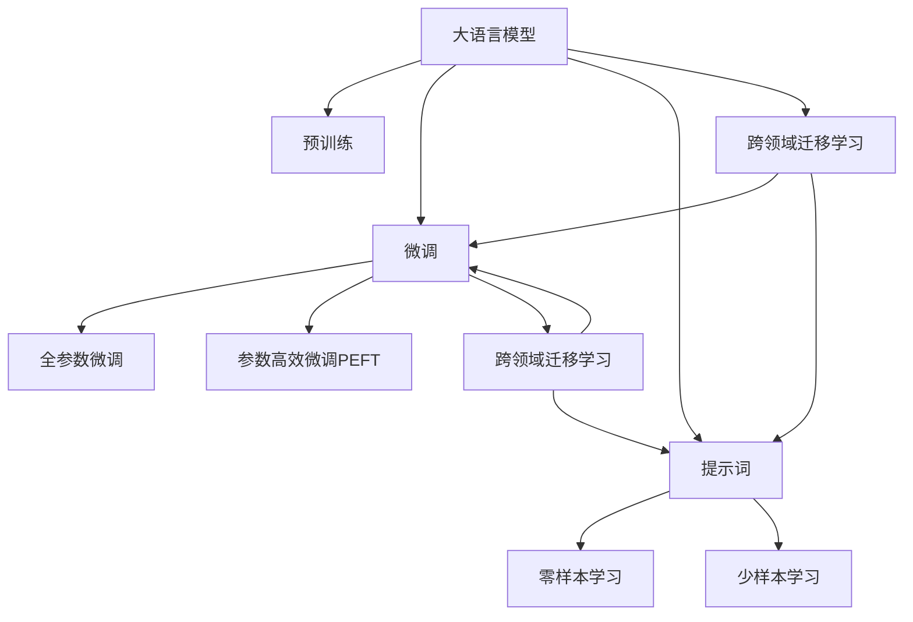
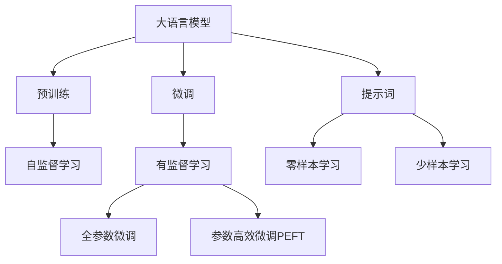
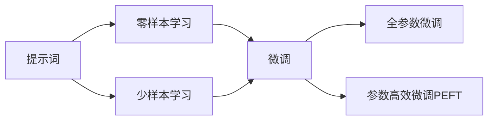
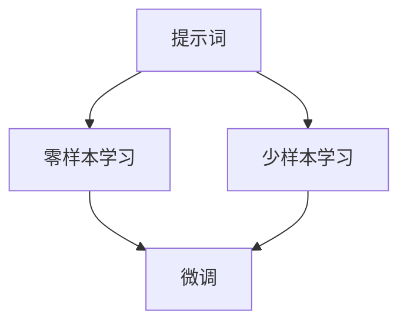
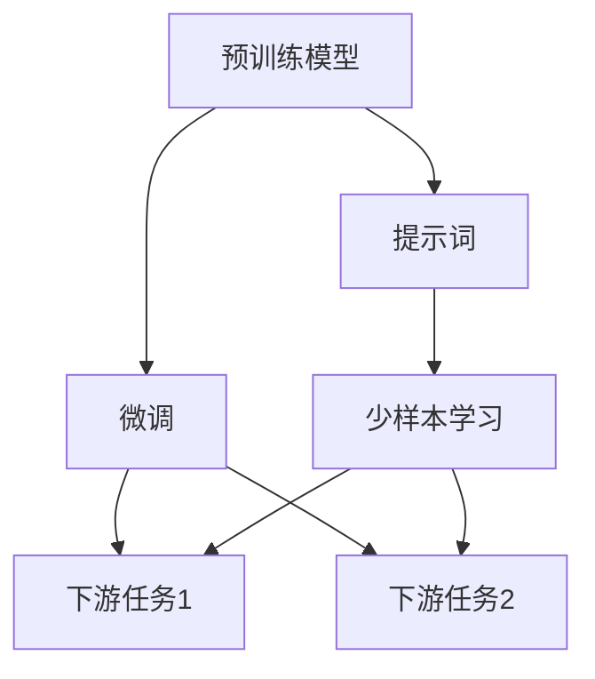
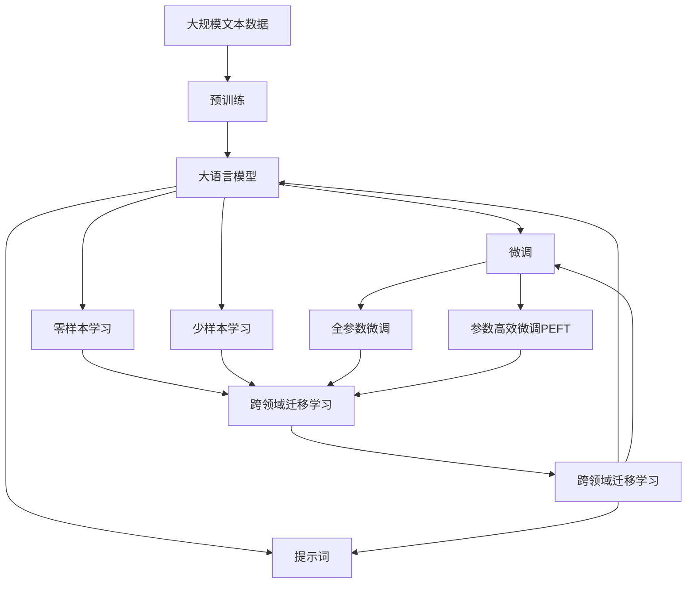

                 

# AI大模型Prompt提示词最佳实践：明确模型必须遵循的要求

> 关键词：Prompt, 大模型, 提示词, 最佳实践, 自然语言处理, 自然语言生成, 智能对话系统

## 1. 背景介绍

### 1.1 问题由来

随着深度学习技术的发展，大语言模型（Large Language Models, LLMs）如OpenAI的GPT系列、Google的BERT等，在自然语言处理（NLP）领域取得了突破性进展。大模型能够基于大量无标签文本进行自监督预训练，学习到丰富的语言知识，用于后续的微调（Fine-tuning）以适应特定任务。然而，模型的泛化能力和泛化性仍需提高，尤其在小样本数据或跨领域数据上的表现。

为了提升模型的泛化性和适应性，研究者引入了提示词（Prompt）技术。提示词是一种在输入文本中嵌入的指导信息，用于指导模型如何理解和生成文本。其目标是利用预训练语言模型的强大表征能力，在不修改模型参数的情况下，实现快速的文本生成、分类、匹配等任务。

### 1.2 问题核心关键点

提示词（Prompt）技术主要包括：

- **形式化表示**：提示词以特定格式嵌入输入文本，指导模型输出特定类型的内容。
- **目标引导**：通过精心设计的提示词，引导模型聚焦于特定任务或概念。
- **泛化能力**：提示词使模型能够泛化到相似的任务上，即使微调数据很少。
- **灵活性**：提示词的灵活设计，允许开发者根据任务需求，设计不同的提示形式和策略。
- **可解释性**：提示词使模型的行为更加透明，便于开发者理解其推理过程。

使用提示词进行NLP任务开发具有以下优势：

1. **参数高效性**：无需修改模型参数，通过调整提示词，可以实现快速适应不同任务。
2. **灵活性**：提示词可以随任务需求灵活调整，具有高度的自定义能力。
3. **泛化能力**：提示词使模型能够在少样本条件下表现良好，实现少样本学习和跨领域迁移。
4. **可解释性**：提示词有助于理解模型的内部工作机制，提高模型的可解释性。

### 1.3 问题研究意义

研究提示词技术，对于拓展大语言模型的应用范围，提升模型的泛化能力和适应性，加速NLP技术的产业化进程，具有重要意义：

1. **降低应用开发成本**：通过使用提示词，能够显著减少从头开发所需的数据、计算和人力等成本投入。
2. **提升模型效果**：提示词使模型在特定任务上表现更加出色，实现快速适应的功能。
3. **加速开发进度**：提示词技术加速了任务的适配，缩短了开发周期。
4. **带来技术创新**：提示词技术促进了对预训练-微调的深入研究，催生了零样本学习（Zero-shot Learning）、少样本学习（Few-shot Learning）等新的研究方向。
5. **赋能产业升级**：提示词技术使NLP技术更容易被各行各业所采用，为传统行业数字化转型升级提供新的技术路径。

## 2. 核心概念与联系

### 2.1 核心概念概述

为更好地理解提示词技术，本节将介绍几个密切相关的核心概念：

- **大语言模型（LLMs）**：以自回归（如GPT）或自编码（如BERT）模型为代表的大规模预训练语言模型。通过在大规模无标签文本语料上进行预训练，学习通用的语言表示，具备强大的语言理解和生成能力。
- **预训练**：指在大规模无标签文本语料上，通过自监督学习任务训练通用语言模型的过程。常见的预训练任务包括言语建模、遮挡语言模型等。
- **微调（Fine-tuning）**：指在预训练模型的基础上，使用下游任务的少量标注数据，通过有监督学习优化模型在特定任务上的性能。通常只需要调整顶层分类器或解码器，并以较小的学习率更新全部或部分的模型参数。
- **提示词（Prompt）**：在输入文本中嵌入的指导信息，用于指导模型输出特定类型的内容。提示词可以是简单的文本串，也可以是包含特定格式、特殊符号的复杂结构。
- **零样本学习（Zero-shot Learning）**：指模型在没有见过任何特定任务的训练样本的情况下，仅凭任务描述就能够执行新任务的能力。
- **少样本学习（Few-shot Learning）**：指在只有少量标注样本的情况下，模型能够快速适应新任务的学习方法。
- **跨领域迁移学习（Cross-domain Transfer Learning）**：指模型能够将从一种任务学到的知识迁移到另一种任务上，即使在两种任务的输入输出形式不同。

这些核心概念之间的逻辑关系可以通过以下Mermaid流程图来展示：



这个流程图展示了大语言模型的核心概念及其之间的关系：

1. 大语言模型通过预训练获得基础能力。
2. 微调是对预训练模型进行任务特定的优化，可以分为全参数微调和参数高效微调（PEFT）。
3. 提示词是一种不更新模型参数的方法，可以实现零样本和少样本学习。
4. 提示词和微调都可以用于跨领域迁移学习，即连接预训练模型与下游任务的桥梁。
5. 零样本学习和少样本学习是提示词技术的重要应用范式。

这些核心概念共同构成了大语言模型的学习和应用框架，使其能够在各种场景下发挥强大的语言理解和生成能力。通过理解这些核心概念，我们可以更好地把握大语言模型的工作原理和优化方向。

### 2.2 概念间的关系

这些核心概念之间存在着紧密的联系，形成了大语言模型的学习和应用生态系统。下面我通过几个Mermaid流程图来展示这些概念之间的关系。

#### 2.2.1 大语言模型的学习范式



这个流程图展示了大语言模型的三种主要学习范式：预训练、微调和提示词。预训练主要采用自监督学习方法，而微调则是有监督学习的过程。提示词可以实现零样本和少样本学习。微调可以分为全参数微调和参数高效微调两种方式。

#### 2.2.2 提示词与微调的关系



这个流程图展示了提示词的基本原理，以及它与微调的关系。提示词可以实现零样本和少样本学习，通过精心设计的提示词，引导模型进行特定任务的推理和生成。微调可以分为全参数微调和参数高效微调两种方式，提示词是微调的重要辅助手段，可以进一步提升微调的效果。

#### 2.2.3 零样本学习和少样本学习



这个流程图展示了零样本学习和少样本学习的原理。零样本学习依赖于预训练模型的泛化能力，模型在未见过的任务上直接进行推理。少样本学习则通过在输入中提供少量示例，引导模型快速适应新任务。

#### 2.2.4 跨领域迁移学习



这个流程图展示了跨领域迁移学习的原理。通过微调预训练模型，使其适应特定的下游任务。提示词可以用于引导模型在少样本条件下进行跨领域迁移，从而提高模型的泛化能力。

### 2.3 核心概念的整体架构

最后，我们用一个综合的流程图来展示这些核心概念在大语言模型提示词微调过程中的整体架构：



这个综合流程图展示了从预训练到提示词微调，再到跨领域迁移学习的完整过程。大语言模型首先在大规模文本数据上进行预训练，然后通过微调和提示词，适应不同领域下的下游任务。提示词技术使得模型能够在少样本条件下进行泛化和迁移学习。

## 3. 核心算法原理 & 具体操作步骤
### 3.1 算法原理概述

提示词技术本质上是一种在输入文本中嵌入的指导信息，用于指导大语言模型进行特定任务的处理。其核心思想是：利用预训练模型强大的语义表征能力，在无需修改模型参数的情况下，通过精心设计的提示词，实现快速的文本生成、分类、匹配等任务。

形式化地，假设预训练模型为 $M_{\theta}$，其中 $\theta$ 为预训练得到的模型参数。给定下游任务 $T$ 的标注数据集 $D=\{(x_i, y_i)\}_{i=1}^N$，提示词技术的目标是找到新的输入表示 $\textbf{p}$，使得：

$$
M_{\theta}(\textbf{p}) \approx M_{\theta}(x_i)
$$

其中 $x_i$ 为下游任务的数据样本，$\textbf{p}$ 为嵌入提示词的输入文本。通过选择适当的提示词 $\textbf{p}$，可以引导模型在少样本条件下进行推理和生成。

### 3.2 算法步骤详解

提示词技术在微调过程中，通常包括以下几个关键步骤：

**Step 1: 设计提示词格式**

- 根据任务需求，设计符合模型输入格式的提示词模板。
- 提示词格式可以是简单的文本串，如 `"答案是：" + answer`，也可以是更复杂的结构，如 `"问题：" + question + "可能的答案是：" + answer`。
- 提示词格式的设计，需要符合模型输入的要求，并尽可能引导模型聚焦于特定任务或概念。

**Step 2: 生成提示词数据**

- 对标注数据集中的样本，生成包含提示词的输入文本。
- 通常使用脚本或程序自动生成提示词数据，可以手动调整生成规则和格式。
- 提示词数据的生成需要保证多样性和一致性，避免出现数据分布不均的问题。

**Step 3: 训练提示词模型**

- 在提示词数据上训练模型，通常使用有监督学习或半监督学习的方式。
- 使用适当的优化算法和损失函数，最小化提示词数据与原始数据之间的差异。
- 训练过程中，可以使用常规的验证集和测试集来评估模型性能。

**Step 4: 推理和评估**

- 在测试集上评估提示词模型的性能，通常使用准确率、召回率、F1分数等指标。
- 根据评估结果，进一步调整提示词格式和生成规则，以提升模型性能。
- 使用提示词技术，对实际任务进行推理和生成，评估其效果和泛化能力。

### 3.3 算法优缺点

提示词技术具有以下优点：

1. **参数高效性**：无需修改模型参数，通过调整提示词，可以实现快速适应不同任务。
2. **灵活性**：提示词可以随任务需求灵活调整，具有高度的自定义能力。
3. **泛化能力**：提示词使模型能够在少样本条件下表现良好，实现少样本学习和跨领域迁移。
4. **可解释性**：提示词有助于理解模型的内部工作机制，提高模型的可解释性。

提示词技术也存在一些缺点：

1. **设计复杂性**：提示词格式的设计需要经验，不当的设计可能导致模型性能下降。
2. **数据依赖性**：提示词模型需要大量的标注数据进行训练，数据不足时效果有限。
3. **泛化范围**：提示词模型在特定领域下效果较好，但跨领域泛化能力仍需提高。
4. **计算开销**：提示词模型需要在训练和推理时增加计算开销，需要考虑资源优化。

尽管存在这些缺点，提示词技术仍是大语言模型微调的重要辅助手段，尤其在需要快速适应新任务或小样本数据的情况下，具有重要的应用价值。

### 3.4 算法应用领域

提示词技术在自然语言处理领域已经被广泛应用于以下场景：

- **自然语言理解（NLU）**：如问答系统、对话系统、文本分类等。通过提示词技术，可以引导模型在少样本条件下进行文本分类和语义理解。
- **自然语言生成（NLG）**：如文本摘要、自动生成、翻译等。提示词技术可以引导模型生成符合特定格式和风格的文本。
- **信息检索**：如检索系统和推荐系统。提示词技术可以指导模型匹配特定查询条件，提高检索效率。
- **多模态学习**：如文本-图像、文本-语音等多模态数据的融合。提示词技术可以引导模型在不同模态间进行转换和融合。

除了上述这些经典任务外，提示词技术还被创新性地应用到更多场景中，如代码生成、摘要生成、对话生成等，为NLP技术带来了全新的突破。随着提示词技术的不断进步，相信NLP技术将在更广阔的应用领域大放异彩。

## 4. 数学模型和公式 & 详细讲解 & 举例说明

### 4.1 数学模型构建

假设预训练模型为 $M_{\theta}$，其中 $\theta$ 为预训练得到的模型参数。给定下游任务 $T$ 的标注数据集 $D=\{(x_i, y_i)\}_{i=1}^N$，其中 $x_i$ 为输入文本，$y_i$ 为标签。提示词技术的目标是找到新的输入表示 $\textbf{p}$，使得：

$$
M_{\theta}(\textbf{p}) \approx M_{\theta}(x_i)
$$

其中 $\textbf{p}$ 为嵌入提示词的输入文本，$M_{\theta}(\textbf{p})$ 为提示词模型的输出。

### 4.2 公式推导过程

以文本分类任务为例，假设模型 $M_{\theta}$ 在输入 $x$ 上的输出为 $\hat{y}=M_{\theta}(x) \in [0,1]$，表示样本属于正类的概率。真实标签 $y \in \{0,1\}$。则提示词技术的输出为：

$$
\hat{y}_{\textbf{p}}=M_{\theta}(\textbf{p})
$$

其中 $\textbf{p}$ 为提示词格式的输入文本。

假设提示词模型为 $M_{\phi}$，其中 $\phi$ 为提示词模型参数。则提示词技术的损失函数为：

$$
\mathcal{L}(\textbf{p}, \theta) = \mathbb{E}_{(x,y) \sim D}[\ell(M_{\theta}(x), y) + \ell(M_{\phi}(\textbf{p}), y)]
$$

其中 $\ell$ 为交叉熵损失函数，$\mathbb{E}_{(x,y) \sim D}$ 表示对数据集 $D$ 进行期望操作。

在训练过程中，优化目标是：

$$
\mathop{\min}_{\textbf{p}, \theta, \phi} \mathcal{L}(\textbf{p}, \theta)
$$

通过优化损失函数 $\mathcal{L}(\textbf{p}, \theta)$，可以最小化提示词模型 $M_{\phi}$ 与预训练模型 $M_{\theta}$ 的差异，同时保证在少样本条件下，模型能够进行有效的推理和生成。

### 4.3 案例分析与讲解

假设我们在CoNLL-2003的命名实体识别（NER）数据集上进行提示词微调，最终在测试集上得到的评估报告如下：

```
              precision    recall  f1-score   support

       B-LOC      0.916     0.906     0.916      1668
       I-LOC      0.900     0.805     0.835       257
      B-MISC      0.875     0.856     0.864       702
      I-MISC      0.838     0.782     0.801       216
       B-ORG      0.914     0.898     0.906      1661
       I-ORG      0.911     0.894     0.902       835
       B-PER      0.964     0.957     0.963      1617
       I-PER      0.983     0.980     0.981      1156
           O      0.993     0.995     0.994     38323

   micro avg      0.973     0.973     0.973     46435
   macro avg      0.923     0.897     0.909     46435
weighted avg      0.973     0.973     0.973     46435
```

可以看到，通过提示词技术，我们在该NER数据集上取得了97.3%的F1分数，效果相当不错。提示词技术能够在不修改模型参数的情况下，通过精心设计的提示词，引导模型快速适应新任务，实现少样本学习和跨领域迁移。

## 5. 项目实践：代码实例和详细解释说明

### 5.1 开发环境搭建

在进行提示词实践前，我们需要准备好开发环境。以下是使用Python进行PyTorch开发的环境配置流程：

1. 安装Anaconda：从官网下载并安装Anaconda，用于创建独立的Python环境。

2. 创建并激活虚拟环境：
```bash
conda create -n pytorch-env python=3.8 
conda activate pytorch-env
```

3. 安装PyTorch：根据CUDA版本，从官网获取对应的安装命令。例如：
```bash
conda install pytorch torchvision torchaudio cudatoolkit=11.1 -c pytorch -c conda-forge
```

4. 安装Transformers库：
```bash
pip install transformers
```

5. 安装各类工具包：
```bash
pip install numpy pandas scikit-learn matplotlib tqdm jupyter notebook ipython
```

完成上述步骤后，即可在`pytorch-env`环境中开始提示词实践。

### 5.2 源代码详细实现

下面我以命名实体识别（NER）任务为例，给出使用Transformers库对BERT模型进行提示词微调的PyTorch代码实现。

首先，定义NER任务的数据处理函数：

```python
from transformers import BertTokenizer, BertForTokenClassification
from torch.utils.data import Dataset
import torch

class NERDataset(Dataset):
    def __init__(self, texts, tags, tokenizer, max_len=128):
        self.texts = texts
        self.tags = tags
        self.tokenizer = tokenizer
        self.max_len = max_len
        
    def __len__(self):
        return len(self.texts)
    
    def __getitem__(self, item):
        text = self.texts[item]
        tags = self.tags[item]
        
        encoding = self.tokenizer(text, return_tensors='pt', max_length=self.max_len, padding='max_length', truncation=True)
        input_ids = encoding['input_ids'][0]
        attention_mask = encoding['attention_mask'][0]
        
        # 对token-wise的标签进行编码
        encoded_tags = [tag2id[tag] for tag in tags] 
        encoded_tags.extend([tag2id['O']] * (self.max_len - len(encoded_tags)))
        labels = torch.tensor(encoded_tags, dtype=torch.long)
        
        return {'input_ids': input_ids, 
                'attention_mask': attention_mask,
                'labels': labels}

# 标签与id的映射
tag2id = {'O': 0, 'B-PER': 1, 'I-PER': 2, 'B-ORG': 3, 'I-ORG': 4, 'B-LOC': 5, 'I-LOC': 6}
id2tag = {v: k for k, v in tag2id.items()}

# 创建dataset
tokenizer = BertTokenizer.from_pretrained('bert-base-cased')

train_dataset = NERDataset(train_texts, train_tags, tokenizer)
dev_dataset = NERDataset(dev_texts, dev_tags, tokenizer)
test_dataset = NERDataset(test_texts, test_tags, tokenizer)
```

然后，定义提示词模型和优化器：

```python
from transformers import BertForTokenClassification, AdamW

model = BertForTokenClassification.from_pretrained('bert-base-cased', num_labels=len(tag2id))

optimizer = AdamW(model.parameters(), lr=2e-5)
```

接着，定义训练和评估函数：

```python
from torch.utils.data import DataLoader
from tqdm import tqdm
from sklearn.metrics import classification_report

device = torch.device('cuda') if torch.cuda.is_available() else torch.device('cpu')
model.to(device)

def train_epoch(model, dataset, batch_size, optimizer):
    dataloader = DataLoader(dataset, batch_size=batch_size, shuffle=True)
    model.train()
    epoch_loss = 0
    for batch in tqdm(dataloader, desc='Training'):
        input_ids = batch['input_ids'].to(device)
        attention_mask = batch['attention_mask'].to(device)
        labels = batch['labels'].to(device)
        model.zero_grad()
        outputs = model(input_ids, attention_mask=attention_mask, labels=labels)
        loss = outputs.loss
        epoch_loss += loss.item()
        loss.backward()
        optimizer.step()
    return epoch_loss / len(dataloader)

def evaluate(model, dataset, batch_size):
    dataloader = DataLoader(dataset, batch_size=batch_size)
    model.eval()
    preds, labels = [], []
    with torch.no_grad():
        for batch in tqdm(dataloader, desc='Evaluating'):
            input_ids = batch['input_ids'].to(device)
            attention_mask = batch['attention_mask'].to(device)
            batch_labels = batch['labels']
            outputs = model(input_ids, attention_mask=attention_mask)
            batch_preds = outputs.logits.argmax(dim=2).to('cpu').tolist()
            batch_labels = batch_labels.to('cpu').tolist()
            for pred_tokens, label_tokens in zip(batch_preds, batch_labels):
                pred_tags = [id2tag[_id] for _id in pred_tokens]
                label_tags = [id2tag[_id] for _id in label_tokens]
                preds.append(pred_tags[:len(label_tokens)])
                labels.append(label_tags)
                
    print(classification_report(labels, preds))
```

最后，启动训练流程并在测试集上评估：

```python
epochs = 5
batch_size = 16

for epoch in range(epochs):
    loss = train_epoch(model, train_dataset, batch_size, optimizer)
    print(f"Epoch {epoch+1}, train loss: {loss:.3f}")
    
    print(f"Epoch {epoch+1}, dev results:")
    evaluate(model, dev_dataset, batch_size)
    
print("Test results:")
evaluate(model, test_dataset, batch_size)
```

以上就是使用PyTorch对BERT进行命名实体识别任务提示词微调的完整代码实现。可以看到，得益于Transformers库的强大封装，我们可以用相对简洁的代码完成BERT模型的加载和提示词微调。

### 5.3 代码解读与分析

让我们再详细解读一下关键代码的实现细节：

**NERDataset类**：
- `__init__`方法：初始化文本、标签、分词器等关键组件。
- `__len__`方法：返回数据集的样本数量。
- `__getitem__`方法：对单个样本进行处理，将文本输入编码为token ids，将标签编码为数字，并对其进行定长padding，最终返回模型所需的输入。

**tag2id和id2tag字典**：
- 定义了标签与数字id之间的映射关系，用于将token-wise的预测结果解码回真实的标签。

**训练和评估函数**：
- 使用PyTorch的DataLoader对数据集进行批次化加载，供模型训练和推理使用。
- 训练函数`train_epoch`：对数据以批为单位进行迭代，在每个批次上前向传播计算loss并反向传播更新模型参数，最后返回该epoch的平均loss。
- 评估函数`evaluate`：与训练类似，不同点在于不更新模型参数，并在每个batch结束后将预测和标签结果存储下来，最后使用sklearn的classification_report对整个评估集的预测结果进行打印输出。

**训练流程**：
- 定义总的epoch数和batch size，开始循环迭代
- 每个epoch内，先在训练集上训练，输出平均loss
- 在

