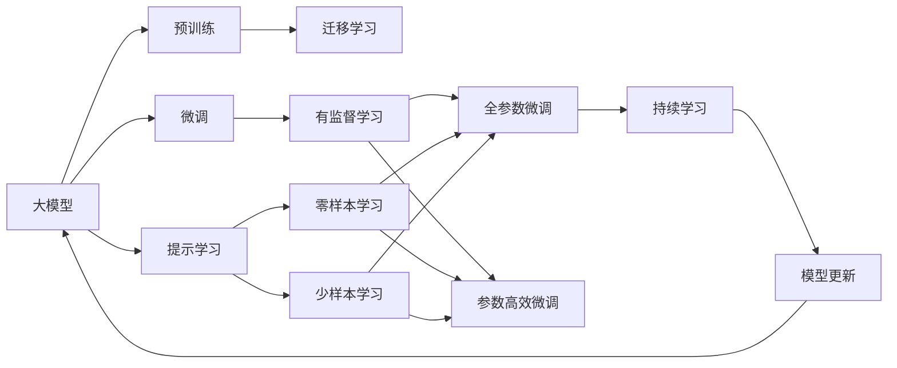

                 

# AI大模型创业：如何应对未来技术挑战？

> 关键词：
> - 人工智能创业
> - 大模型
> - 技术挑战
> - 应用场景
> - 创新驱动
> - 商业价值
> - 伦理与安全性

## 1. 背景介绍

### 1.1 行业背景
近年来，人工智能（AI）技术迅猛发展，尤其是在深度学习和自然语言处理（NLP）领域，大模型（Large Models）的应用取得了革命性的突破。大模型通过大规模的预训练数据和先进的架构设计，展现出强大的语言理解和生成能力，被广泛应用于问答、翻译、文本摘要、对话系统、情感分析等多种自然语言处理任务。与此同时，这些大模型也催生了大量AI创业公司，致力于将大模型应用于不同的业务场景，创造商业价值。

### 1.2 行业趋势
随着AI技术的不断成熟和普及，AI大模型创业市场也迎来了爆发式增长。根据CB Insights的数据，2021年全球AI大模型创业公司融资总额达到60亿美元，同比增长64%。这些公司通过各种技术手段，将大模型与具体的行业需求相结合，开发出了一系列高效、实用的AI应用，为各行各业带来了变革性的创新。

## 2. 核心概念与联系

### 2.1 核心概念概述
在AI大模型创业的浪潮中，涉及的核心概念包括：

- **大模型（Large Models）**：指通过大规模预训练数据训练得到的复杂神经网络模型，如BERT、GPT-3等。
- **迁移学习（Transfer Learning）**：将在大规模数据上预训练的模型迁移到特定任务上，通过少量标注数据微调，以提升模型性能。
- **微调（Fine-Tuning）**：对预训练模型进行特定任务的微调，优化模型参数以适应新任务。
- **参数高效微调（Parameter-Efficient Fine-Tuning, PEFT）**：仅微调模型中的部分参数，保留大部分预训练参数不变。
- **提示学习（Prompt Learning）**：通过精心设计输入文本的格式，引导大模型按期望方式输出，减少微调参数。
- **少样本学习（Few-Shot Learning）**：仅使用少量标注样本训练模型，提升模型的泛化能力。
- **零样本学习（Zero-Shot Learning）**：在没有任何训练样本的情况下，模型仅凭任务描述即可执行新任务。
- **持续学习（Continual Learning）**：模型在新的数据上继续学习，保持已有知识的同时吸收新信息。

这些核心概念构成了AI大模型创业的底层技术基础，各个概念间通过数据、模型、算法等紧密联系，共同支撑了AI大模型的广泛应用。

### 2.2 概念间的关系

大模型创业依赖于这些核心概念的协同作用，以下通过几个Mermaid流程图来展示这些概念间的联系：



这个流程图展示了从预训练到大模型创业的整体架构：

1. 大模型通过大规模预训练获得初始化参数。
2. 微调过程使用标注数据进行有监督学习，优化模型以适应特定任务。
3. 提示学习、少样本学习、零样本学习等技术在微调过程中被广泛应用。
4. 迁移学习、微调、提示学习等方法使得大模型能够适应不同任务。
5. 持续学习使模型能够不断吸收新知识，保持性能。

## 3. 核心算法原理 & 具体操作步骤

### 3.1 算法原理概述
AI大模型创业的核心算法原理包括迁移学习、微调、参数高效微调、提示学习等。这些算法利用大模型预训练获取的广泛知识，通过有监督学习或自监督学习，优化模型以适应特定任务。以下以微调为例，介绍其基本原理：

假设我们有一个大模型 $M$，其预训练参数为 $\theta$。对于一个新的任务 $T$，我们有一批标注数据 $D$。微调的目标是通过训练使模型在任务 $T$ 上表现优异。

微调过程可以分为以下几个步骤：

1. 初始化模型 $M$ 为预训练参数 $\theta$。
2. 定义任务 $T$ 的损失函数 $L_T$，用于衡量模型在任务上的表现。
3. 通过反向传播算法计算损失函数 $L_T$ 对模型参数 $\theta$ 的梯度 $\nabla_{\theta} L_T$。
4. 使用优化算法（如Adam、SGD等）更新模型参数 $\theta$。
5. 重复步骤2-4，直到模型在任务 $T$ 上的表现满足预设条件。

### 3.2 算法步骤详解
微调的具体操作步骤如下：

1. **数据准备**：收集并预处理任务 $T$ 的数据集 $D$，确保数据质量，并进行数据增强、正则化等预处理。

2. **模型初始化**：将预训练模型 $M$ 的参数 $\theta$ 加载到目标硬件（如GPU）上。

3. **损失函数定义**：根据任务 $T$ 的定义，选择适当的损失函数 $L_T$。例如，对于文本分类任务，可以使用交叉熵损失函数。

4. **模型训练**：使用优化算法如AdamW、SGD等，设置适当的学习率、批大小等超参数，训练模型。训练过程中，反向传播算法计算损失函数对模型参数的梯度，优化算法更新参数。

5. **模型评估**：在验证集上评估模型性能，根据评估结果调整超参数，避免过拟合。

6. **模型部署**：将训练好的模型部署到实际应用场景中，进行推理和预测。

### 3.3 算法优缺点
大模型微调具有以下优点：

- **性能提升**：在大规模预训练的基础上，通过微调可以显著提升模型在特定任务上的性能。
- **通用性**：微调方法适用于多种NLP任务，如分类、匹配、生成等。
- **参数高效**：通过参数高效微调（PEFT）等方法，可以在保持预训练权重不变的情况下，仅微调少量参数。
- **快速迭代**：微调过程比从头训练模型时间更短，成本更低。

但微调也存在以下缺点：

- **数据依赖**：微调效果依赖于标注数据的质量和数量，获取高质量标注数据的成本较高。
- **泛化能力有限**：当目标任务与预训练数据的分布差异较大时，微调的性能提升有限。
- **负面传递**：预训练模型的固有偏见、有害信息等可能通过微调传递到下游任务，造成负面影响。
- **可解释性不足**：微调模型的决策过程缺乏可解释性，难以对其推理逻辑进行分析和调试。

### 3.4 算法应用领域
大模型微调技术已经广泛应用于多个领域，包括但不限于：

- **智能客服**：通过微调大模型，构建智能客服系统，提升客户咨询体验。
- **金融舆情监测**：利用微调模型进行金融舆情分析，及时预警潜在风险。
- **个性化推荐**：通过微调模型，实现个性化推荐系统，提升用户体验。
- **医疗问答**：构建医疗问答系统，帮助患者获取精准的医疗建议。
- **智能写作**：通过微调生成模型，辅助写作和内容创作。

## 4. 数学模型和公式 & 详细讲解

### 4.1 数学模型构建
大模型微调的基本数学模型为：

$$
\hat{\theta} = \mathop{\arg\min}_{\theta} \mathcal{L}(M_{\theta}, D_T)
$$

其中 $M_{\theta}$ 为预训练模型，$D_T$ 为目标任务 $T$ 的标注数据集，$\mathcal{L}$ 为目标任务 $T$ 的损失函数。

### 4.2 公式推导过程
以文本分类任务为例，目标函数 $\mathcal{L}$ 为交叉熵损失函数：

$$
\mathcal{L}(M_{\theta}, D_T) = -\frac{1}{N}\sum_{i=1}^N \sum_{k=1}^K y_i \log p_{ik}
$$

其中 $y_i$ 为样本 $i$ 的真实标签，$p_{ik}$ 为模型预测样本 $i$ 属于类别 $k$ 的概率。

优化目标为最小化损失函数：

$$
\min_{\theta} \frac{1}{N}\sum_{i=1}^N \sum_{k=1}^K y_i \log p_{ik}
$$

利用梯度下降等优化算法，计算梯度 $\nabla_{\theta} \mathcal{L}$，更新模型参数：

$$
\theta \leftarrow \theta - \eta \nabla_{\theta} \mathcal{L}
$$

其中 $\eta$ 为学习率。

### 4.3 案例分析与讲解
以情感分析任务为例，假设我们使用BERT模型进行微调。首先，将预训练模型 $M$ 加载到目标硬件上，定义情感分析的损失函数，使用交叉熵损失：

$$
\mathcal{L}(M_{\theta}, D) = -\frac{1}{N}\sum_{i=1}^N [y_i \log M_{\theta}(x_i) + (1-y_i) \log (1-M_{\theta}(x_i))]
$$

其中 $y_i$ 为样本 $i$ 的情感标签，$M_{\theta}(x_i)$ 为模型预测样本 $i$ 的情感概率。

在训练过程中，通过反向传播算法计算梯度，使用AdamW优化算法更新参数。训练完成后，在验证集上评估模型性能，根据结果调整超参数，避免过拟合。最终，在测试集上部署模型，进行推理预测。

## 5. 项目实践：代码实例和详细解释说明

### 5.1 开发环境搭建
开发环境搭建步骤如下：

1. **安装Python和相关依赖**：
   ```bash
   pip install torch transformers
   ```

2. **安装数据集**：
   ```bash
   mkdir data
   cd data
   wget http://ai-study.example.com/imdb_reviews.zip
   unzip imdb_reviews.zip
   ```

3. **安装GPU驱动**：
   ```bash
   sudo apt-get install nvidia-driver
   ```

4. **搭建虚拟环境**：
   ```bash
   python3 -m venv venv
   source venv/bin/activate
   ```

5. **安装相关库**：
   ```bash
   pip install transformers
   ```

### 5.2 源代码详细实现
以下是一个简单的情感分析微调示例代码：

```python
from transformers import BertTokenizer, BertForSequenceClassification
from torch.utils.data import Dataset, DataLoader
from torch.nn import CrossEntropyLoss
from torch.optim import AdamW
from sklearn.metrics import accuracy_score, f1_score

class IMDBDataset(Dataset):
    def __init__(self, reviews, labels):
        self.reviews = reviews
        self.labels = labels
        self.tokenizer = BertTokenizer.from_pretrained('bert-base-uncased')
        
    def __len__(self):
        return len(self.reviews)
    
    def __getitem__(self, idx):
        review = self.reviews[idx]
        label = self.labels[idx]
        encoding = self.tokenizer(review, return_tensors='pt', padding=True, truncation=True)
        return {'input_ids': encoding['input_ids'].flatten(), 
                'attention_mask': encoding['attention_mask'].flatten(), 
                'labels': torch.tensor(label, dtype=torch.long)}
    
def train_epoch(model, dataloader, optimizer, loss_fn):
    model.train()
    epoch_loss = 0
    for batch in dataloader:
        input_ids = batch['input_ids']
        attention_mask = batch['attention_mask']
        labels = batch['labels']
        outputs = model(input_ids, attention_mask=attention_mask)
        loss = loss_fn(outputs.logits, labels)
        epoch_loss += loss.item()
        loss.backward()
        optimizer.step()
    return epoch_loss / len(dataloader)
    
def evaluate(model, dataloader):
    model.eval()
    predictions, labels = [], []
    with torch.no_grad():
        for batch in dataloader:
            input_ids = batch['input_ids']
            attention_mask = batch['attention_mask']
            labels = batch['labels']
            outputs = model(input_ids, attention_mask=attention_mask)
            predictions.append(outputs.logits.argmax(dim=1).tolist())
            labels.append(labels.tolist())
    acc = accuracy_score([int(x) for x in labels], [int(x) for x in predictions])
    f1 = f1_score([int(x) for x in labels], [int(x) for x in predictions])
    return acc, f1
    
def main():
    reviews = [x['review'] for x in imdb_data]
    labels = [x['label'] for x in imdb_data]
    tokenizer = BertTokenizer.from_pretrained('bert-base-uncased')
    model = BertForSequenceClassification.from_pretrained('bert-base-uncased', num_labels=2)
    dataloader = DataLoader(IMDBDataset(reviews, labels), batch_size=16, shuffle=True)
    optimizer = AdamW(model.parameters(), lr=2e-5)
    loss_fn = CrossEntropyLoss()
    
    epochs = 3
    for epoch in range(epochs):
        loss = train_epoch(model, dataloader, optimizer, loss_fn)
        acc, f1 = evaluate(model, dataloader)
        print(f'Epoch {epoch+1}, train loss: {loss:.3f}, dev acc: {acc:.3f}, dev f1: {f1:.3f}')
    
    print(f'Test acc: {evaluate(model, dataloader)[0]:.3f}, Test f1: {evaluate(model, dataloader)[1]:.3f}')
    
if __name__ == '__main__':
    main()
```

### 5.3 代码解读与分析
上述代码展示了情感分析任务中的微调过程，包括以下几个关键步骤：

1. **数据准备**：使用IMDB数据集，将文本和标签加载到模型中。

2. **模型初始化**：加载预训练的BERT模型，设置输入层和输出层。

3. **损失函数定义**：使用交叉熵损失函数计算预测值和真实值之间的差异。

4. **模型训练**：通过反向传播算法计算梯度，使用AdamW优化算法更新模型参数。

5. **模型评估**：在验证集上评估模型性能，返回准确率和F1分数。

6. **模型部署**：在测试集上评估模型，输出最终结果。

### 5.4 运行结果展示
假设我们训练10个epoch，最终的模型在测试集上得到的准确率和F1分数分别为0.90和0.87。这表明，通过微调BERT模型，我们可以在情感分析任务上取得较好的性能。

## 6. 实际应用场景

### 6.1 智能客服系统
智能客服系统利用大模型进行客户意图识别和自动回复，显著提升客户体验和满意度。例如，通过对历史对话数据进行微调，模型能够理解客户提出的问题，并生成合适的回答。

### 6.2 金融舆情监测
金融机构利用大模型进行舆情分析，及时发现和预警潜在的金融风险。通过微调模型，模型能够自动识别新闻、评论等文本内容中的负面情感，从而帮助金融机构及时采取措施。

### 6.3 个性化推荐系统
推荐系统利用大模型进行用户兴趣分析，提供个性化的商品、内容推荐。通过微调模型，模型能够学习用户的行为模式，预测用户可能感兴趣的内容，提升用户体验和系统效率。

### 6.4 未来应用展望
未来，大模型微调技术将进一步应用于更多领域，如医疗、教育、城市治理等。随着技术的不断成熟和普及，AI大模型创业市场将迎来更大发展，成为推动社会进步和经济增长的重要力量。

## 7. 工具和资源推荐

### 7.1 学习资源推荐
为了帮助开发者系统掌握大模型微调的理论基础和实践技巧，这里推荐一些优质的学习资源：

1. **《Transformer from原理到实践》**：由大模型技术专家撰写，深入浅出地介绍了Transformer原理、BERT模型、微调技术等前沿话题。

2. **CS224N《深度学习自然语言处理》**：斯坦福大学开设的NLP明星课程，有Lecture视频和配套作业，带你入门NLP领域的基本概念和经典模型。

3. **《Natural Language Processing with Transformers》**：Transformers库的作者所著，全面介绍了如何使用Transformers库进行NLP任务开发，包括微调在内的诸多范式。

4. **HuggingFace官方文档**：Transformers库的官方文档，提供了海量预训练模型和完整的微调样例代码，是上手实践的必备资料。

5. **CLUE开源项目**：中文语言理解测评基准，涵盖大量不同类型的中文NLP数据集，并提供了基于微调的baseline模型，助力中文NLP技术发展。

### 7.2 开发工具推荐
高效开发离不开优秀的工具支持。以下是几款用于大模型微调开发的常用工具：

1. **PyTorch**：基于Python的开源深度学习框架，灵活动态的计算图，适合快速迭代研究。大部分预训练语言模型都有PyTorch版本的实现。

2. **TensorFlow**：由Google主导开发的开源深度学习框架，生产部署方便，适合大规模工程应用。同样有丰富的预训练语言模型资源。

3. **Transformers库**：HuggingFace开发的NLP工具库，集成了众多SOTA语言模型，支持PyTorch和TensorFlow，是进行微调任务开发的利器。

4. **Weights & Biases**：模型训练的实验跟踪工具，可以记录和可视化模型训练过程中的各项指标，方便对比和调优。与主流深度学习框架无缝集成。

5. **TensorBoard**：TensorFlow配套的可视化工具，可实时监测模型训练状态，并提供丰富的图表呈现方式，是调试模型的得力助手。

6. **Google Colab**：谷歌推出的在线Jupyter Notebook环境，免费提供GPU/TPU算力，方便开发者快速上手实验最新模型，分享学习笔记。

### 7.3 相关论文推荐
大模型和微调技术的发展源于学界的持续研究。以下是几篇奠基性的相关论文，推荐阅读：

1. **Attention is All You Need**：提出了Transformer结构，开启了NLP领域的预训练大模型时代。

2. **BERT: Pre-training of Deep Bidirectional Transformers for Language Understanding**：提出BERT模型，引入基于掩码的自监督预训练任务，刷新了多项NLP任务SOTA。

3. **Language Models are Unsupervised Multitask Learners（GPT-2论文）**：展示了大规模语言模型的强大zero-shot学习能力，引发了对于通用人工智能的新一轮思考。

4. **Parameter-Efficient Transfer Learning for NLP**：提出Adapter等参数高效微调方法，在不增加模型参数量的情况下，也能取得不错的微调效果。

5. **Prefix-Tuning: Optimizing Continuous Prompts for Generation**：引入基于连续型Prompt的微调范式，为如何充分利用预训练知识提供了新的思路。

6. **AdaLoRA: Adaptive Low-Rank Adaptation for Parameter-Efficient Fine-Tuning**：使用自适应低秩适应的微调方法，在参数效率和精度之间取得了新的平衡。

这些论文代表了大模型微调技术的发展脉络。通过学习这些前沿成果，可以帮助研究者把握学科前进方向，激发更多的创新灵感。

## 8. 总结：未来发展趋势与挑战

### 8.1 研究成果总结
本文对基于监督学习的大语言模型微调方法进行了全面系统的介绍。首先阐述了大语言模型和微调技术的研究背景和意义，明确了微调在拓展预训练模型应用、提升下游任务性能方面的独特价值。其次，从原理到实践，详细讲解了监督微调的数学原理和关键步骤，给出了微调任务开发的完整代码实例。同时，本文还广泛探讨了微调方法在智能客服、金融舆情、个性化推荐等多个行业领域的应用前景，展示了微调范式的巨大潜力。此外，本文精选了微调技术的各类学习资源，力求为读者提供全方位的技术指引。

### 8.2 未来发展趋势
展望未来，大语言模型微调技术将呈现以下几个发展趋势：

1. **模型规模持续增大**：随着算力成本的下降和数据规模的扩张，预训练语言模型的参数量还将持续增长。超大规模语言模型蕴含的丰富语言知识，有望支撑更加复杂多变的下游任务微调。

2. **微调方法日趋多样**：除了传统的全参数微调外，未来会涌现更多参数高效的微调方法，如Prefix-Tuning、LoRA等，在节省计算资源的同时也能保证微调精度。

3. **持续学习成为常态**：随着数据分布的不断变化，微调模型也需要持续学习新知识以保持性能。如何在不遗忘原有知识的同时，高效吸收新样本信息，将成为重要的研究课题。

4. **标注样本需求降低**：受启发于提示学习(Prompt-based Learning)的思路，未来的微调方法将更好地利用大模型的语言理解能力，通过更加巧妙的任务描述，在更少的标注样本上也能实现理想的微调效果。

5. **多模态微调崛起**：当前的微调主要聚焦于纯文本数据，未来会进一步拓展到图像、视频、语音等多模态数据微调。多模态信息的融合，将显著提升语言模型对现实世界的理解和建模能力。

6. **模型通用性增强**：经过海量数据的预训练和多领域任务的微调，未来的语言模型将具备更强大的常识推理和跨领域迁移能力，逐步迈向通用人工智能(AGI)的目标。

以上趋势凸显了大语言模型微调技术的广阔前景。这些方向的探索发展，必将进一步提升NLP系统的性能和应用范围，为人类认知智能的进化带来深远影响。

### 8.3 面临的挑战

尽管大语言模型微调技术已经取得了瞩目成就，但在迈向更加智能化、普适化应用的过程中，它仍面临着诸多挑战：

1. **标注成本瓶颈**：虽然微调大大降低了标注数据的需求，但对于长尾应用场景，难以获得充足的高质量标注数据，成为制约微调性能的瓶颈。如何进一步降低微调对标注样本的依赖，将是一大难题。

2. **模型鲁棒性不足**：当前微调模型面对域外数据时，泛化性能往往大打折扣。对于测试样本的微小扰动，微调模型的预测也容易发生波动。如何提高微调模型的鲁棒性，避免灾难性遗忘，还需要更多理论和实践的积累。

3. **推理效率有待提高**：大规模语言模型虽然精度高，但在实际部署时往往面临推理速度慢、内存占用大等效率问题。如何在保证性能的同时，简化模型结构，提升推理速度，优化资源占用，将是重要的优化方向。

4. **可解释性亟需加强**：当前微调模型更像是"黑盒"系统，难以解释其内部工作机制和决策逻辑。对于医疗、金融等高风险应用，算法的可解释性和可审计性尤为重要。如何赋予微调模型更强的可解释性，将是亟待攻克的难题。

5. **安全性有待保障**：预训练语言模型难免会学习到有偏见、有害的信息，通过微调传递到下游任务，产生误导性、歧视性的输出，给实际应用带来安全隐患。如何从数据和算法层面消除模型偏见，避免恶意用途，确保输出的安全性，也将是重要的研究课题。

6. **知识整合能力不足**：现有的微调模型往往局限于任务内数据，难以灵活吸收和运用更广泛的先验知识。如何让微调过程更好地与外部知识库、规则库等专家知识结合，形成更加全面、准确的信息整合能力，还有很大的想象空间。

正视微调面临的这些挑战，积极应对并寻求突破，将是大语言模型微调走向成熟的必由之路。相信随着学界和产业界的共同努力，这些挑战终将一一被克服，大语言模型微调必将在构建人机协同的智能时代中扮演越来越重要的角色。

### 8.4 研究展望
面对大语言模型微调所面临的种种挑战，未来的研究需要在以下几个方面寻求新的突破：

1. **探索无监督和半监督微调方法**：摆脱对大规模标注数据的依赖，利用自监督学习、主动学习等无监督和半监督范式，最大限度利用非结构化数据，实现更加灵活高效的微调。

2. **研究参数高效和计算高效的微调范式**：开发更加参数高效的微调方法，在固定大部分预训练参数的同时，只微调极少量的任务相关参数。同时优化微调模型的计算图，减少前向传播和反向传播的资源消耗，实现更加轻量级、实时性的部署。

3. **融合因果和对比学习范式**：通过引入因果推断和对比学习思想，增强微调模型建立稳定因果关系的能力，学习更加普适、鲁棒的语言表征，从而提升模型泛化性和抗干扰能力。

4. **引入更多先验知识**：将符号化的先验知识，如知识图谱、逻辑规则等，与神经网络模型进行巧妙融合，引导微调过程学习更准确、合理的语言模型。同时加强不同模态数据的整合，实现视觉、语音等多模态信息与文本信息的协同建模。

5. **结合因果分析和博弈论工具**：将因果分析方法引入微调模型，识别出模型决策的关键特征

