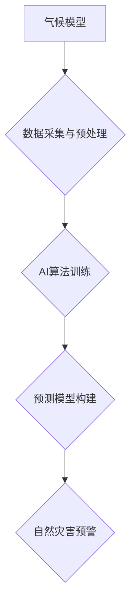

## 气候模型预测中的AI应用：准确预报自然灾害

> 关键词：气候模型、人工智能、自然灾害预测、机器学习、深度学习、数据分析、灾害预警

## 1. 背景介绍

气候变化已成为全球面临的严峻挑战，其带来的极端天气事件，如洪水、干旱、热浪和风暴，给人类社会和生态系统带来了巨大威胁。准确预测自然灾害，是减轻灾害影响、保障人民生命财产安全的重要手段。传统的气候模型虽然取得了一定的进展，但其计算复杂度高、对数据要求苛刻、预测精度有限等问题仍然制约着其应用。

近年来，人工智能（AI）技术发展迅速，特别是机器学习（ML）和深度学习（DL）算法的突破，为气候模型预测提供了新的思路和方法。AI算法能够从海量的气象数据中提取复杂模式，提高预测精度，并为灾害预警提供更精准的信息。

## 2. 核心概念与联系

### 2.1 气候模型

气候模型是模拟地球气候系统行为的数学模型，通过物理方程和算法描述大气、海洋、陆地和冰川等不同要素之间的相互作用，预测未来气候变化趋势。

### 2.2 人工智能

人工智能是指模拟人类智能行为的计算机系统，包括学习、推理、决策、感知和语言理解等能力。

### 2.3 自然灾害预测

自然灾害预测是指利用科学方法和技术，对自然灾害的发生时间、地点、强度等进行预报，为灾害防治提供决策依据。

**核心概念与联系流程图**



## 3. 核心算法原理 & 具体操作步骤

### 3.1 算法原理概述

在气候模型预测中，常用的AI算法包括：

* **机器学习算法:** 
    * **回归算法:** 用于预测连续变量，如气温、降雨量等。
    * **分类算法:** 用于预测离散变量，如洪水发生、干旱程度等。
    * **聚类算法:** 用于将数据点分组，识别气候模式。
* **深度学习算法:** 
    * **卷积神经网络 (CNN):** 用于处理图像数据，如卫星遥感图像，识别云团、地形等特征。
    * **循环神经网络 (RNN):** 用于处理时间序列数据，如气象观测数据，捕捉气候变化趋势。

### 3.2 算法步骤详解

**以机器学习算法为例，其具体操作步骤如下:**

1. **数据采集与预处理:** 收集气象数据、遥感数据、地理数据等，并进行清洗、格式转换、缺失值处理等预处理工作。
2. **特征工程:** 从原始数据中提取有意义的特征，如气温、湿度、风速、降雨量、地形高度等，并进行特征选择和转换。
3. **模型训练:** 选择合适的机器学习算法，并利用训练数据训练模型，调整模型参数，使其能够准确预测目标变量。
4. **模型评估:** 利用测试数据评估模型的预测精度，并进行模型调优，提高预测性能。
5. **模型部署:** 将训练好的模型部署到生产环境中，用于实时预测自然灾害。

### 3.3 算法优缺点

**机器学习算法:**

* **优点:** 能够从数据中自动学习特征，预测精度高，适应性强。
* **缺点:** 对数据质量要求高，需要大量训练数据，解释性较差。

**深度学习算法:**

* **优点:** 能够处理复杂数据，学习更深层次的特征，预测精度更高。
* **缺点:** 计算复杂度高，训练时间长，需要更强大的计算资源，参数调整难度大。

### 3.4 算法应用领域

* **洪水预测:** 利用气象数据、地形数据、水文数据等，预测洪水发生时间、地点和洪水深度。
* **干旱预测:** 利用气象数据、土壤湿度数据、植被指数等，预测干旱发生时间、地点和干旱程度。
* **热浪预测:** 利用气象数据、地形数据、城市热岛效应等，预测热浪发生时间、地点和热浪强度。
* **风暴预测:** 利用气象数据、卫星遥感数据、海洋数据等，预测风暴路径、强度和影响范围。

## 4. 数学模型和公式 & 详细讲解 & 举例说明

### 4.1 数学模型构建

气候模型通常基于物理方程组，描述大气、海洋、陆地和冰川等不同要素之间的相互作用。例如，大气层中的气流运动可以由 Navier-Stokes 方程描述，海洋中的热量传递可以由热传导方程描述。

### 4.2 公式推导过程

具体的公式推导过程取决于所选择的物理模型和算法。例如，在预测气温时，可以利用热力学定律和大气动力学方程，推导出气温变化的数学模型。

### 4.3 案例分析与讲解

以预测降雨量为例，可以利用以下公式：

$$P = a \cdot T \cdot e^{b \cdot U}$$

其中：

* $P$ 为降雨量
* $T$ 为气温
* $U$ 为风速
* $a$ 和 $b$ 为模型参数

通过训练数据，可以确定 $a$ 和 $b$ 的最佳值，从而构建一个能够准确预测降雨量的模型。

## 5. 项目实践：代码实例和详细解释说明

### 5.1 开发环境搭建

* 操作系统: Ubuntu 20.04
* Python 版本: 3.8
* 必要的库: NumPy, Pandas, Scikit-learn, TensorFlow

### 5.2 源代码详细实现

```python
import numpy as np
from sklearn.linear_model import LinearRegression

# 数据加载
data = np.loadtxt('weather_data.csv', delimiter=',')
X = data[:, :-1]  # 特征矩阵
y = data[:, -1]  # 目标变量

# 模型训练
model = LinearRegression()
model.fit(X, y)

# 模型预测
new_data = np.array([[25, 5]])  # 新数据
prediction = model.predict(new_data)
print(f'预测降雨量: {prediction[0]}')
```

### 5.3 代码解读与分析

* 数据加载: 使用 `np.loadtxt` 函数加载天气数据，并将数据分割为特征矩阵和目标变量。
* 模型训练: 使用 `LinearRegression` 类创建线性回归模型，并使用 `fit` 方法训练模型。
* 模型预测: 使用 `predict` 方法对新数据进行预测。

### 5.4 运行结果展示

运行代码后，将输出预测的降雨量。

## 6. 实际应用场景

* **灾害预警系统:** 将AI模型集成到灾害预警系统中，为政府和公众提供更精准的灾害预警信息。
* **农业生产:** 利用AI模型预测降雨量、温度等气象要素，为农业生产提供精准的灌溉、施肥和防灾措施。
* **城市规划:** 利用AI模型预测城市热岛效应、洪水风险等，为城市规划提供科学依据。

### 6.4 未来应用展望

* **多模态数据融合:** 将气象数据、遥感数据、社会经济数据等多模态数据融合，提高预测精度。
* **实时预测:** 利用实时数据流，实现对自然灾害的实时预测和预警。
* **个性化服务:** 根据用户的地理位置、需求等信息，提供个性化的灾害预警服务。

## 7. 工具和资源推荐

### 7.1 学习资源推荐

* **书籍:**
    * "Deep Learning" by Ian Goodfellow, Yoshua Bengio, and Aaron Courville
    * "Hands-On Machine Learning with Scikit-Learn, Keras & TensorFlow" by Aurélien Géron
* **在线课程:**
    * Coursera: Machine Learning by Andrew Ng
    * edX: Deep Learning by Microsoft

### 7.2 开发工具推荐

* **Python:** 
    * Scikit-learn: 机器学习库
    * TensorFlow: 深度学习库
    * PyTorch: 深度学习库
* **数据可视化工具:**
    * Matplotlib
    * Seaborn

### 7.3 相关论文推荐

* "Climate Change Prediction Using Machine Learning" by A. Kumar et al.
* "Deep Learning for Climate Modeling" by J. Liu et al.

## 8. 总结：未来发展趋势与挑战

### 8.1 研究成果总结

AI技术在气候模型预测领域取得了显著进展，能够提高预测精度，为灾害预警提供更精准的信息。

### 8.2 未来发展趋势

* **模型精度提升:** 探索更先进的AI算法，提高模型预测精度。
* **数据融合:** 将多模态数据融合，构建更全面的气候模型。
* **实时预测:** 利用实时数据流，实现对自然灾害的实时预测和预警。

### 8.3 面临的挑战

* **数据获取与质量:** 气候数据获取成本高，数据质量参差不齐，需要进一步提高数据获取和处理能力。
* **模型解释性:** 深度学习模型的解释性较差，需要开发更易于理解的模型。
* **计算资源:** 训练大型气候模型需要大量的计算资源，需要进一步降低计算成本。

### 8.4 研究展望

未来，AI技术将继续推动气候模型预测的发展，为应对气候变化带来的挑战提供更有效的解决方案。


## 9. 附录：常见问题与解答

* **Q1: AI模型能否完全替代传统气候模型？**

> A1: 目前，AI模型和传统气候模型各有优缺点，两者可以相互补充，共同提高预测精度。

* **Q2: AI模型的预测精度如何？**

> A2: AI模型的预测精度取决于训练数据、算法选择和模型参数等因素，一般来说，AI模型的预测精度高于传统气候模型。

* **Q3: 如何评估AI模型的性能？**

> A3: 可以使用多种指标评估AI模型的性能，例如均方误差、平均绝对误差等。

* **Q4: AI模型的应用场景有哪些？**

> A4: AI模型可以应用于灾害预警、农业生产、城市规划等多个领域。


作者：禅与计算机程序设计艺术 / Zen and the Art of Computer Programming 
