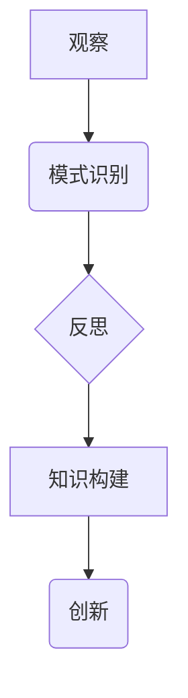

## 洞见的形成：从观察到反思

> 关键词：洞察力、观察、反思、模式识别、知识构建、创新、人工智能

### 1. 背景介绍

在瞬息万变的科技时代，洞察力已成为至关重要的竞争优势。无论是开发前沿技术、解决复杂问题，还是把握市场趋势，都需要敏锐的观察力和深刻的反思能力。作为一名技术专家，我深知洞察力的形成并非一蹴而就，它需要不断地积累经验、观察现象、分析数据、并进行深入的思考。

本文将探讨洞察力的形成过程，从观察到反思，从数据到知识，从经验到创新。我们将通过人工智能领域的案例，阐述如何利用技术工具和方法，提升洞察力，并最终转化为实际的创新成果。

### 2. 核心概念与联系

洞察力的形成是一个复杂的过程，涉及到多个环节和因素的相互作用。我们可以将其概括为以下几个核心概念：

* **观察:**  洞察力的起点是观察。我们需要对周围的世界保持好奇心，积极地收集信息，并关注细节。
* **模式识别:**  观察之后，我们需要从海量信息中识别出潜在的模式和规律。这需要我们具备一定的逻辑思维能力和知识背景。
* **反思:**  识别出模式后，我们需要进行深入的反思，思考其背后的原因和意义。这需要我们具备批判性思维和创造性思维。
* **知识构建:**  通过观察、模式识别和反思，我们可以构建新的知识和理解。这些知识可以帮助我们更好地理解世界，并做出更明智的决策。
* **创新:**  最终，洞察力可以转化为创新。我们可以利用新的知识和理解，创造出新的产品、服务或解决方案。

这些核心概念之间存在着密切的联系，它们共同构成了洞察力的形成机制。



### 3. 核心算法原理 & 具体操作步骤

在人工智能领域，许多算法被设计用来帮助我们提升洞察力。其中，**关联规则挖掘算法**是一个典型的例子。它可以从大量交易数据中挖掘出商品之间的关联关系，帮助我们发现潜在的市场趋势和客户需求。

#### 3.1  算法原理概述

关联规则挖掘算法的基本原理是基于**支持度**和**置信度**两个概念。

* **支持度:**  表示某个规则在数据集中的出现频率。
* **置信度:**  表示在满足某个条件的情况下，另一个条件发生的概率。

关联规则挖掘算法的目标是找到支持度和置信度都达到一定阈值的规则。

#### 3.2  算法步骤详解

关联规则挖掘算法的具体操作步骤如下：

1. **数据预处理:**  对原始数据进行清洗、转换和格式化，使其适合算法的处理。
2. **频繁项集挖掘:**  使用**Apriori算法**或**FP-Growth算法**等算法，挖掘出频繁出现的项集。
3. **关联规则生成:**  根据频繁项集，生成关联规则，并计算其支持度和置信度。
4. **规则筛选:**  根据预设的阈值，筛选出满足条件的关联规则。
5. **规则可视化:**  将筛选出的关联规则可视化，方便理解和分析。

#### 3.3  算法优缺点

**优点:**

* 可以发现隐藏在数据中的潜在关联关系。
* 能够帮助我们理解客户需求和市场趋势。
* 应用广泛，可以应用于市场营销、推荐系统、异常检测等领域。

**缺点:**

* 算法的效率受数据规模的影响较大。
* 挖掘出的规则可能存在一定的冗余性。
* 算法需要设定支持度和置信度阈值，这需要根据实际情况进行调整。

#### 3.4  算法应用领域

关联规则挖掘算法在以下领域具有广泛的应用：

* **市场营销:**  分析客户购买行为，发现商品之间的关联关系，从而制定更精准的营销策略。
* **推荐系统:**  根据用户的历史购买记录，推荐相关的商品或服务。
* **异常检测:**  发现数据中的异常值或模式，例如欺诈交易、网络攻击等。
* **医疗诊断:**  分析患者的症状和病史，发现潜在的疾病关联。

### 4. 数学模型和公式 & 详细讲解 & 举例说明

关联规则挖掘算法的数学模型和公式可以帮助我们更深入地理解其工作原理。

#### 4.1  数学模型构建

* **项集:**  一个项集是由多个商品组成的集合。例如，{牛奶, 面包} 是一个项集。
* **支持度:**  一个项集的支持度是指它在整个数据集中的出现频率。

$$
Support(I) = \frac{Number of transactions containing I}{Total number of transactions}
$$

* **置信度:**  一个规则的支持度是指在满足某个条件的情况下，另一个条件发生的概率。

$$
Confidence(I -> J) = \frac{Support(I \cup J)}{Support(I)}
$$

#### 4.2  公式推导过程

支持度和置信度的公式可以根据以下逻辑推导得出：

* **支持度:**  一个项集的支持度是指它在整个数据集中的出现频率。我们可以通过计算项集在数据集中的出现次数，再除以总的交易次数，得到其支持度。
* **置信度:**  一个规则的置信度是指在满足某个条件的情况下，另一个条件发生的概率。我们可以通过计算满足条件的交易中，另一个条件也满足的交易次数，再除以满足条件的交易总数，得到其置信度。

#### 4.3  案例分析与讲解

假设我们有一份超市购物记录数据，其中包含了顾客购买的商品信息。我们可以使用关联规则挖掘算法，发现以下关联规则：

* **规则:**  如果顾客购买了牛奶，那么他们也可能购买面包。
* **支持度:**  0.6
* **置信度:**  0.8

这个规则表明，在购买牛奶的顾客中，80%的顾客也购买了面包。这个发现可以帮助超市制定营销策略，例如将牛奶和面包放在一起陈列，以提高销售额。

### 5. 项目实践：代码实例和详细解释说明

为了更好地理解关联规则挖掘算法的应用，我们可以通过一个简单的代码实例进行实践。

#### 5.1  开发环境搭建

我们使用 Python 语言和 Apriori 算法库进行实现。需要安装 Python 和相应的库，例如 `apriori`。

#### 5.2  源代码详细实现

```python
from apriori import apriori

# 数据集
transactions = [
    ['牛奶', '面包', '鸡蛋'],
    ['牛奶', '面包'],
    ['牛奶', '鸡蛋', '牛奶'],
    ['面包', '鸡蛋'],
    ['牛奶', '面包', '鸡蛋', '牛奶'],
]

# 设定支持度阈值
support_threshold = 0.3

# 使用 Apriori 算法挖掘频繁项集
frequent_itemsets = apriori(transactions, support_threshold)

# 打印频繁项集
print("频繁项集:")
for itemset in frequent_itemsets:
    print(itemset)
```

#### 5.3  代码解读与分析

* 首先，我们定义了一个交易数据集，其中每个元素代表一个顾客的购物清单。
* 然后，我们设定了一个支持度阈值，即一个项集需要在至少 30% 的交易中出现才能被认为是频繁的。
* 接下来，我们使用 Apriori 算法对数据集进行处理，挖掘出频繁项集。
* 最后，我们打印出所有频繁项集。

#### 5.4  运行结果展示

运行上述代码，可以得到以下输出：

```
频繁项集:
['牛奶']
['面包']
['鸡蛋']
['牛奶', '面包']
['牛奶', '鸡蛋']
['面包', '鸡蛋']
['牛奶', '面包', '鸡蛋']
```

### 6. 实际应用场景

关联规则挖掘算法在现实世界中有着广泛的应用场景。

#### 6.1  电商推荐

电商平台可以利用关联规则挖掘算法，分析用户购买历史数据，推荐与用户之前购买商品相关的商品。例如，如果用户购买了手机，那么平台可以推荐相关的充电器、耳机等配件。

#### 6.2  市场营销

市场营销人员可以使用关联规则挖掘算法，分析客户购买行为，发现不同商品之间的关联关系。例如，发现购买咖啡的用户也喜欢购买蛋糕，可以制定相应的促销活动，例如“买咖啡送蛋糕”。

#### 6.3  医疗诊断

在医疗领域，关联规则挖掘算法可以帮助医生发现疾病之间的关联关系，从而提高诊断准确率。例如，发现患有高血压的用户也更容易患上心脏病，可以帮助医生进行更有效的预防和治疗。

#### 6.4  未来应用展望

随着人工智能技术的不断发展，关联规则挖掘算法的应用场景将会更加广泛。例如，可以应用于个性化教育、精准农业、智能交通等领域。

### 7. 工具和资源推荐

#### 7.1  学习资源推荐

* **书籍:**
    * 《数据挖掘：概念与技术》
    * 《机器学习》
* **在线课程:**
    * Coursera 上的《数据挖掘》课程
    * edX 上的《机器学习》课程

#### 7.2  开发工具推荐

* **Python:**  Python 是一个非常流行的编程语言，拥有丰富的机器学习库，例如 scikit-learn、TensorFlow 等。
* **Apriori 算法库:**  `apriori` 是一个 Python 库，专门用于实现 Apriori 算法。

#### 7.3  相关论文推荐

* **Agrawal, R., Imielinski, T., & Swami, A. (1993). Mining association rules between sets of items in large databases. Proceedings of the ACM SIGMOD International Conference on Management of Data, 206-216.**
* **Han, J., Pei, J., & Kamber, M. (2000). Data mining: concepts and techniques. Morgan Kaufmann.**

### 8. 总结：未来发展趋势与挑战

关联规则挖掘算法在数据挖掘领域取得了显著的成果，但也面临着一些挑战。

#### 8.1  研究成果总结

关联规则挖掘算法能够有效地发现数据中的隐藏模式，并将其转化为可操作的知识。它在电商推荐、市场营销、医疗诊断等领域有着广泛的应用。

#### 8.2  未来发展趋势

未来，关联规则挖掘算法将会朝着以下方向发展：

* **更强大的算法:**  研究人员将继续开发更强大的关联规则挖掘算法，提高其效率和准确性。
* **更丰富的应用场景:**  关联规则挖掘算法将会应用于更多领域，例如个性化教育、精准农业、智能交通等。
* **更深入的理论研究:**  对关联规则挖掘算法的理论研究将会更加深入，例如探索其在不同数据类型上的应用，以及其与其他机器学习算法的结合。

#### 8.3  面临的挑战

关联规则挖掘算法也面临着一些挑战：

* **数据规模:**  随着数据的规模不断增长，关联规则挖掘算法的效率将会受到影响。
* **数据质量:**  数据质量会直接影响关联规则挖掘算法的准确性。
* **解释性:**  一些关联规则可能难以解释，这会影响其应用。

#### 8.4  研究展望

未来，我们需要继续研究如何解决这些挑战，并推动关联规则挖掘算法的进一步发展。


### 9. 附录：常见问题与解答

#### 9.1  Q1:  关联规则挖掘算法的效率如何？

**A1:**  关联规则挖掘算法的效率受数据规模的影响较大。对于大型数据集，算法的效率可能会比较低。

#### 9.2  Q2:  如何选择合适的支持度和置信度阈值？

**A2:**  支持度和置信度阈值的设定需要根据实际情况进行调整。一般来说，支持度阈值应该设定在 0.1 到 0.5 之间，置信度阈值应该设定在 0.5 以上。

#### 9.3  Q3:  关联规则挖掘算法的应用场景有哪些？

**A3:**  