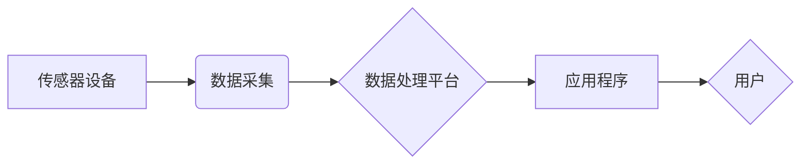

## 物联网(IoT)技术和各种传感器设备的集成：物联网的系统集成

> 关键词：物联网 (IoT)、传感器设备、系统集成、数据采集、数据处理、云计算、边缘计算、安全、隐私

## 1. 背景介绍

物联网 (IoT) 正在迅速改变我们的世界，连接着各种设备、传感器和应用程序，创造出无处不在的智能化体验。物联网的核心是传感器设备，它们收集环境数据，并将其传输到云端或边缘设备进行处理和分析。然而，将各种传感器设备集成到物联网系统中是一个复杂的任务，需要解决许多技术挑战，例如数据采集、数据处理、网络安全、隐私保护等。

随着物联网应用的不断发展，对传感器设备的集成需求越来越高。例如，智能家居、智慧城市、工业自动化等领域都需要大量传感器设备进行数据采集和控制。如何有效地将这些传感器设备集成到物联网系统中，是实现物联网应用的关键。

## 2. 核心概念与联系

### 2.1 物联网 (IoT)

物联网 (IoT) 是一种网络技术，它连接着各种物理设备、传感器、软件和数据，使其能够相互通信和协作。物联网系统通常由以下几个关键组件组成：

* **传感器设备:** 收集环境数据，例如温度、湿度、光照、运动等。
* **网络连接:** 将传感器设备连接到互联网或私有网络。
* **数据处理平台:** 处理和分析传感器数据，并提供可视化和决策支持。
* **应用程序:** 利用物联网数据提供各种服务，例如远程控制、智能提醒、数据分析等。

### 2.2 传感器设备

传感器设备是物联网系统中的核心组件，它们负责收集环境数据。常见的传感器类型包括：

* **温度传感器:** 测量温度。
* **湿度传感器:** 测量空气湿度。
* **光照传感器:** 测量光照强度。
* **运动传感器:** 检测物体运动。
* **压力传感器:** 测量压力。
* **气体传感器:** 检测气体浓度。

### 2.3 系统集成

系统集成是指将多个独立的系统或组件组合在一起，形成一个整体的系统。在物联网领域，系统集成是指将各种传感器设备、网络连接、数据处理平台和应用程序集成在一起，形成一个完整的物联网系统。

**系统集成流程图:**



## 3. 核心算法原理 & 具体操作步骤

### 3.1 算法原理概述

物联网系统中，数据处理平台通常采用以下算法进行数据处理：

* **数据清洗:** 去除数据中的噪声、缺失值和异常值。
* **数据聚合:** 将多个数据点聚合在一起，形成一个整体的数据趋势。
* **数据分析:** 使用统计学、机器学习等方法分析数据，发现数据中的模式和规律。

### 3.2 算法步骤详解

**数据清洗:**

1. **缺失值处理:** 对于缺失的数据点，可以使用平均值、中位数或其他方法进行填充。
2. **异常值处理:** 对于异常的数据点，可以使用删除、替换或其他方法进行处理。
3. **数据格式转换:** 将数据转换为统一的格式，方便后续处理。

**数据聚合:**

1. **时间聚合:** 将数据按照时间进行聚合，例如计算每小时的平均温度。
2. **空间聚合:** 将数据按照空间进行聚合，例如计算某个区域的平均湿度。
3. **其他聚合:** 根据具体需求，可以使用其他类型的聚合方法，例如计算数据最大值、最小值、总和等。

**数据分析:**

1. **统计分析:** 使用统计学方法分析数据，例如计算平均值、标准差、相关系数等。
2. **机器学习:** 使用机器学习算法分析数据，例如预测未来温度、识别异常事件等。
3. **数据可视化:** 使用图表和图形将数据可视化，方便用户理解和分析数据。

### 3.3 算法优缺点

**数据清洗:**

* **优点:** 可以提高数据质量，减少数据分析的误差。
* **缺点:** 需要根据具体数据进行人工判断，处理时间较长。

**数据聚合:**

* **优点:** 可以简化数据分析，提高分析效率。
* **缺点:** 可能丢失部分数据细节。

**数据分析:**

* **优点:** 可以发现数据中的模式和规律，提供决策支持。
* **缺点:** 需要专业的知识和技能，算法选择和模型训练需要花费大量时间和资源。

### 3.4 算法应用领域

* **智能家居:** 控制家电、调节温度、监控安全等。
* **智慧城市:** 管理交通、监控环境、提供公共服务等。
* **工业自动化:** 监控设备运行状态、预测设备故障、优化生产流程等。
* **医疗保健:** 远程监测患者健康状况、辅助医生诊断疾病等。

## 4. 数学模型和公式 & 详细讲解 & 举例说明

### 4.1 数学模型构建

在物联网系统中，可以使用数学模型来描述传感器数据采集、处理和分析的过程。例如，可以建立一个温度传感器模型，描述温度传感器输出的电压值与实际温度之间的关系。

### 4.2 公式推导过程

假设温度传感器输出的电压值与实际温度 $T$ 之间的关系可以用以下公式描述：

$$V = kT + b$$

其中，$V$ 是传感器输出的电压值，$k$ 是传感器灵敏度，$b$ 是传感器偏移量。

### 4.3 案例分析与讲解

假设一个温度传感器具有以下参数：

* 灵敏度 $k = 0.1 V/℃$
* 偏移量 $b = 0.5 V$

如果传感器输出的电压值 $V = 2.5 V$，则可以根据公式计算实际温度：

$$T = (V - b) / k = (2.5 - 0.5) / 0.1 = 20℃$$

## 5. 项目实践：代码实例和详细解释说明

### 5.1 开发环境搭建

* 操作系统: Ubuntu 20.04
* 编程语言: Python 3.8
* 软件工具:

    * Python 3.8
    * pip
    * Arduino IDE
    * Node-RED

### 5.2 源代码详细实现

```python
# 温度传感器数据采集程序

import RPi.GPIO as GPIO
import time

# 设置 GPIO 引脚
sensor_pin = 17

# 设置 GPIO 模式
GPIO.setmode(GPIO.BCM)
GPIO.setup(sensor_pin, GPIO.IN)

# 数据采集循环
while True:
    # 读取传感器数据
    sensor_value = GPIO.input(sensor_pin)

    # 处理传感器数据
    if sensor_value == 1:
        temperature = 25  # 假设温度为 25℃
    else:
        temperature = 20  # 假设温度为 20℃

    # 打印传感器数据
    print("Temperature: {:.1f}℃".format(temperature))

    # 等待一段时间
    time.sleep(1)
```

### 5.3 代码解读与分析

* 该程序使用 RPi.GPIO 库控制 Raspberry Pi 的 GPIO 引脚，读取温度传感器的数据。
* 程序设置了 GPIO 引脚模式和传感器引脚，并使用循环读取传感器数据。
* 根据传感器数据，程序计算出温度值，并将其打印到控制台。
* 程序每隔 1 秒钟读取一次传感器数据。

### 5.4 运行结果展示

程序运行后，控制台将显示温度传感器采集到的温度值。

## 6. 实际应用场景

### 6.1 智能家居

* **温度控制:** 使用温度传感器监测室内温度，并自动调节空调或暖气，保持舒适的温度。
* **安全监控:** 使用运动传感器检测人员活动，并触发报警或录像。
* **远程控制:** 使用传感器数据远程控制家电，例如开关灯、调节窗帘等。

### 6.2 智慧城市

* **交通管理:** 使用传感器监测道路拥堵情况，并优化交通信号灯控制。
* **环境监测:** 使用传感器监测空气质量、噪音水平、水质等环境参数，并及时发布预警信息。
* **公共安全:** 使用传感器监测公共场所的人流量、火灾风险等，并提高公共安全水平。

### 6.3 工业自动化

* **设备监控:** 使用传感器监测设备运行状态，例如温度、压力、振动等，并及时发现故障。
* **生产过程优化:** 使用传感器收集生产过程数据，例如产量、质量、能源消耗等，并优化生产流程。
* **安全生产:** 使用传感器监测危险区域，例如高温、高压、易燃易爆等，并及时采取安全措施。

### 6.4 未来应用展望

物联网技术的发展将带来更多新的应用场景，例如：

* **个性化医疗:** 使用传感器监测患者健康状况，提供个性化的医疗服务。
* **智慧农业:** 使用传感器监测土壤湿度、温度、光照等，提高农业生产效率。
* **可持续发展:** 使用传感器监测能源消耗、水资源利用等，促进可持续发展。

## 7. 工具和资源推荐

### 7.1 学习资源推荐

* **书籍:**

    * 《物联网技术》
    * 《物联网应用开发》
    * 《嵌入式系统设计》

* **在线课程:**

    * Coursera: 物联网课程
    * edX: 物联网课程
    * Udemy: 物联网课程

### 7.2 开发工具推荐

* **Arduino IDE:** 用于开发基于 Arduino 平台的物联网设备。
* **Node-RED:** 用于构建物联网应用的图形化编程工具。
* **Raspberry Pi:** 用于搭建物联网开发平台的微型计算机。

### 7.3 相关论文推荐

* **物联网安全与隐私保护:**

    * "Security and Privacy Challenges in the Internet of Things"
    * "A Survey on Security and Privacy Issues in IoT"

* **物联网数据分析:**

    * "Big Data Analytics in the Internet of Things"
    * "A Survey on Data Analytics Techniques for IoT"

## 8. 总结：未来发展趋势与挑战

### 8.1 研究成果总结

物联网技术已经取得了显著的进展，在智能家居、智慧城市、工业自动化等领域得到了广泛应用。

### 8.2 未来发展趋势

* **边缘计算:** 将数据处理能力下沉到边缘设备，降低网络延迟和数据传输成本。
* **人工智能:** 将人工智能技术应用于物联网，实现智能感知、智能决策和智能控制。
* **区块链:** 使用区块链技术保障物联网数据的安全性和可信度。

### 8.3 面临的挑战

* **安全与隐私:** 物联网设备数量庞大，安全漏洞和隐私泄露风险较高。
* **互操作性:** 不同厂商的物联网设备缺乏标准化，互操作性差。
* **数据管理:** 物联网数据量巨大，需要高效的数据存储、处理和分析技术。

### 8.4 研究展望

未来，物联网技术将继续发展，带来更多新的应用场景和商业模式。研究人员需要关注以下几个方面：

* **提高物联网系统的安全性:** 开发新的安全协议和技术，保障物联网数据的安全性和隐私性。
* **促进物联网的互操作性:** 推广物联网标准，提高不同厂商设备的互操作性。
* **解决物联网数据管理问题:** 开发高效的数据存储、处理和分析技术，有效利用物联网数据。


## 9. 附录：常见问题与解答

### 9.1 什么是物联网？

物联网 (IoT) 是一种网络技术，它连接着各种物理设备、传感器、软件和数据，使其能够相互通信和协作。

### 9.2 物联网有哪些应用场景？

物联网的应用场景非常广泛，