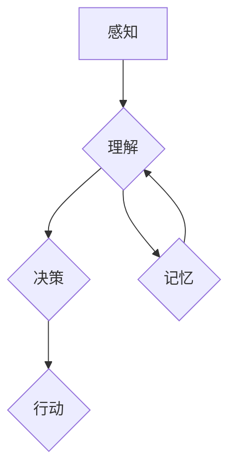

## 认知的形式化：递归层次性

> 关键词：递归、层次性、认知、形式化、人工智能、算法、数学模型

### 1. 背景介绍

人类认知的复杂性一直是哲学和科学研究的中心问题。从古至今，人们试图用不同的方式理解和建模认知过程。随着计算机科学的发展，形式化方法逐渐成为认知研究的重要工具。形式化方法强调用精确的符号和规则来描述和分析认知现象，这使得我们可以对认知过程进行更深入的理解和建模。

递归层次性是形式化认知研究中一个重要的概念。它指的是认知过程可以被分解成一系列相互嵌套的层次结构，每个层次都包含着更复杂的认知任务。这些层次结构通过递归的方式相互关联，即每个层次的输出可以作为下一个层次的输入，从而形成一个完整的认知循环。

### 2. 核心概念与联系

#### 2.1 递归

递归是一种定义方法，它通过将一个问题分解成与自身类似的子问题来解决。递归算法通常包含三个部分：

* **基线条件:** 终止递归的条件。
* **递归步骤:** 将问题分解成更小的子问题，并递归地调用自身解决这些子问题。
* **组合步骤:** 将子问题的解组合起来得到最终的解。

#### 2.2 层次性

层次性指的是将复杂系统分解成一系列相互嵌套的层次结构。每个层次都包含着更具体的子任务，而这些子任务又可以进一步分解成更小的子任务。层次结构可以帮助我们理解复杂系统的整体结构和各个部分之间的关系。

#### 2.3 认知的递归层次性

认知过程可以被看作是一个递归层次结构。例如，理解一个句子需要首先识别单词，然后识别词性，再识别语法结构，最后理解句子的含义。每个层次都包含着更复杂的认知任务，而这些任务又可以进一步分解成更小的子任务。

**Mermaid 流程图**



### 3. 核心算法原理 & 具体操作步骤

#### 3.1 算法原理概述

递归层次性算法是一种基于递归和层次结构的算法设计方法。它将复杂问题分解成一系列相互嵌套的子问题，每个子问题都对应于一个层次结构中的一个层次。算法通过递归地解决这些子问题，最终得到问题的整体解。

#### 3.2 算法步骤详解

1. **问题分解:** 将问题分解成一系列相互嵌套的子问题，每个子问题都对应于一个层次结构中的一个层次。
2. **基线条件:** 为每个层次设置基线条件，即终止递归的条件。
3. **递归步骤:** 为每个层次设计递归步骤，将子问题分解成更小的子问题，并递归地调用自身解决这些子问题。
4. **组合步骤:** 将子问题的解组合起来得到最终的解。

#### 3.3 算法优缺点

**优点:**

* 可以有效地解决复杂问题。
* 算法结构清晰，易于理解和维护。
* 可以利用现有的子问题解来解决新的子问题，提高效率。

**缺点:**

* 可能会导致栈溢出问题，因为递归调用会占用大量的栈空间。
* 算法的效率可能不如迭代算法。

#### 3.4 算法应用领域

递归层次性算法广泛应用于人工智能、自然语言处理、计算机图形学等领域。例如，

* **自然语言处理:** 使用递归层次性算法可以实现语法分析、机器翻译等任务。
* **计算机图形学:** 使用递归层次性算法可以实现三维模型渲染、动画生成等任务。

### 4. 数学模型和公式 & 详细讲解 & 举例说明

#### 4.1 数学模型构建

我们可以用树形结构来表示递归层次性算法的执行过程。每个节点代表一个子问题，叶子节点代表基线条件。树的深度表示问题的层次结构，树的宽度表示每个层次的子问题数量。

#### 4.2 公式推导过程

递归层次性算法的执行时间复杂度可以由以下公式推导：

$$T(n) = aT(n/b) + f(n)$$

其中：

* $T(n)$ 是问题规模为 $n$ 时算法的执行时间。
* $a$ 是每个递归步骤中子问题的数量。
* $b$ 是每个子问题的规模相对于原问题的比例。
* $f(n)$ 是递归步骤以外的计算时间。

#### 4.3 案例分析与讲解

例如，计算一个数的阶乘可以使用递归层次性算法。

* **基线条件:** 当 $n$ 为 0 时，阶乘为 1。
* **递归步骤:** 当 $n$ 不为 0 时，阶乘为 $n$ 乘以 $(n-1)$ 的阶乘。

我们可以用树形结构来表示这个算法的执行过程。树的深度为 $n$，每个节点代表一个 $n-i$ 的阶乘计算，叶子节点代表 1。

### 5. 项目实践：代码实例和详细解释说明

#### 5.1 开发环境搭建

本项目使用 Python 语言进行开发。需要安装 Python 3.x 及相关库。

#### 5.2 源代码详细实现

```python
def factorial(n):
  if n == 0:
    return 1
  else:
    return n * factorial(n-1)

# 测试代码
num = 5
result = factorial(num)
print(f"阶乘 {num} = {result}")
```

#### 5.3 代码解读与分析

* `factorial(n)` 函数定义了阶乘的计算方法。
* `if n == 0:` 是基线条件，当 $n$ 为 0 时，返回 1。
* `else:` 是递归步骤，当 $n$ 不为 0 时，返回 $n$ 乘以 `factorial(n-1)` 的结果。
* `num = 5` 设置需要计算阶乘的数字。
* `result = factorial(num)` 调用 `factorial()` 函数计算阶乘。
* `print(f"阶乘 {num} = {result}")` 打印结果。

#### 5.4 运行结果展示

```
阶乘 5 = 120
```

### 6. 实际应用场景

递归层次性算法在人工智能领域有着广泛的应用场景，例如：

* **自然语言理解:** 使用递归层次性算法可以解析句子的语法结构，识别实体和关系，理解文本的语义。
* **机器翻译:** 使用递归层次性算法可以将一个语言的句子翻译成另一种语言的句子。
* **对话系统:** 使用递归层次性算法可以构建能够进行自然对话的聊天机器人。

### 7. 工具和资源推荐

#### 7.1 学习资源推荐

* **书籍:**
    * 《人工智能：现代方法》
    * 《深度学习》
* **在线课程:**
    * Coursera 上的《人工智能》课程
    * edX 上的《机器学习》课程

#### 7.2 开发工具推荐

* **Python:** 广泛用于人工智能开发的编程语言。
* **TensorFlow:** 深度学习框架。
* **PyTorch:** 深度学习框架。

#### 7.3 相关论文推荐

* **《Attention Is All You Need》:** 介绍了 Transformer 模型，一种基于注意力机制的序列建模方法。
* **《BERT: Pre-training of Deep Bidirectional Transformers for Language Understanding》:** 介绍了 BERT 模型，一种基于 Transformer 的预训练语言模型。

### 8. 总结：未来发展趋势与挑战

#### 8.1 研究成果总结

递归层次性算法为认知研究和人工智能发展提供了重要的理论基础和技术工具。它帮助我们理解认知过程的复杂结构，并为构建更智能的机器提供了新的思路。

#### 8.2 未来发展趋势

未来，递归层次性算法的研究将继续朝着以下方向发展：

* **更复杂的认知模型:** 研究更复杂的递归层次性模型，以更好地模拟人类认知过程。
* **更有效的算法设计:** 设计更有效的递归层次性算法，提高算法的效率和鲁棒性。
* **更广泛的应用场景:** 将递归层次性算法应用于更多领域，例如机器人学、医疗诊断等。

#### 8.3 面临的挑战

递归层次性算法的研究也面临着一些挑战：

* **计算复杂度:** 递归层次性算法的计算复杂度较高，需要更高效的计算资源。
* **数据需求:** 训练复杂的递归层次性模型需要大量的训练数据。
* **可解释性:** 递归层次性模型的决策过程往往难以解释，这限制了其在一些应用场景中的使用。

#### 8.4 研究展望

尽管面临着挑战，但递归层次性算法的研究前景依然广阔。随着计算能力的提升和数据量的增加，我们相信递归层次性算法将为人工智能的发展做出更大的贡献。

### 9. 附录：常见问题与解答

* **什么是递归？** 递归是一种定义方法，它通过将一个问题分解成与自身类似的子问题来解决。
* **什么是层次性？** 层次性指的是将复杂系统分解成一系列相互嵌套的层次结构。
* **递归层次性算法有什么优点？** 递归层次性算法可以有效地解决复杂问题，算法结构清晰，易于理解和维护。
* **递归层次性算法有什么缺点？** 递归层次性算法可能会导致栈溢出问题，算法的效率可能不如迭代算法。


作者：禅与计算机程序设计艺术 / Zen and the Art of Computer Programming 
