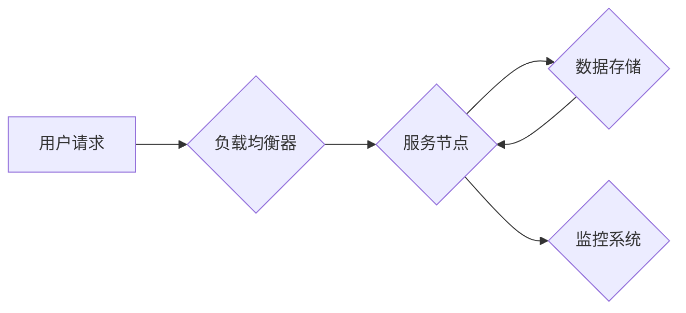

## 高扩展性系统的设计原则

> 关键词：高扩展性、系统架构、分布式系统、容错、水平扩展、数据一致性、一致性协议、CAP定理

## 1. 背景介绍

在当今数字时代，应用程序的需求量呈指数级增长。用户期望快速、可靠、无缝的体验，而传统的单体架构系统难以满足这些需求。高扩展性系统应运而生，旨在应对日益增长的用户流量和数据量。

高扩展性系统是指能够随着用户需求的增长而动态地增加资源，以保持高性能和可用性的系统。它通常采用分布式架构，将应用程序和数据分散到多个节点上，从而实现水平扩展。

## 2. 核心概念与联系

### 2.1  核心概念

* **分布式系统:** 将应用程序和数据分散到多个节点上，通过网络进行通信和协作。
* **水平扩展:** 通过增加节点数量来扩展系统容量，而不是升级单个节点的硬件。
* **容错:** 系统能够在部分节点故障的情况下继续正常运行。
* **数据一致性:** 所有节点上的数据保持一致性。

### 2.2  架构关系



**图 1：高扩展性系统架构**

* **用户请求:** 用户向系统发送请求。
* **负载均衡器:** 分配用户请求到不同的服务节点。
* **服务节点:** 处理用户请求，并访问数据存储。
* **数据存储:** 存储应用程序数据。
* **监控系统:** 监控系统运行状态，并进行故障检测和报警。

## 3. 核心算法原理 & 具体操作步骤

### 3.1  算法原理概述

高扩展性系统通常采用以下核心算法来实现其功能：

* **一致性哈希:** 将数据均匀地分布到多个节点上，并提供高效的数据迁移机制。
* **复制数据:** 将数据复制到多个节点上，提高数据可用性和容错性。
* **消息队列:** 将任务异步处理，提高系统吞吐量和可靠性。

### 3.2  算法步骤详解

**一致性哈希算法:**

1. 将所有节点按照哈希值排序。
2. 将数据按照哈希值映射到节点上。
3. 当节点加入或离开系统时，重新计算哈希值，并迁移数据到新的节点。

**复制数据算法:**

1. 将数据复制到多个节点上。
2. 在写入数据时，将数据写入所有复制节点。
3. 在读取数据时，从任意一个复制节点读取数据。

**消息队列算法:**

1. 将任务发送到消息队列。
2. 消息队列消费者从队列中获取任务并进行处理。
3. 消息队列提供可靠的传输机制，确保任务不会丢失。

### 3.3  算法优缺点

| 算法 | 优点 | 缺点 |
|---|---|---|
| 一致性哈希 | 数据分布均匀，迁移数据高效 | 算法复杂度较高 |
| 复制数据 | 提高数据可用性和容错性 | 增加存储成本和网络流量 |
| 消息队列 | 提高系统吞吐量和可靠性 | 需要额外的组件和管理 |

### 3.4  算法应用领域

* **一致性哈希:** 分布式缓存、数据库、文件系统
* **复制数据:** 数据库、日志系统、关键数据存储
* **消息队列:** 异步任务处理、事件驱动架构、微服务架构

## 4. 数学模型和公式 & 详细讲解 & 举例说明

### 4.1  数学模型构建

一致性哈希算法使用哈希函数将数据映射到节点上。假设有n个节点，数据集合为D，哈希函数为h(d)，则数据d在节点i上的位置可以表示为：

$$
node_i = argmin_{j} |h(d) - h(node_j)|
$$

其中，argmin表示找到最小值对应的索引。

### 4.2  公式推导过程

一致性哈希算法的核心思想是将数据均匀地分布到节点上，并提供高效的数据迁移机制。

当节点加入或离开系统时，需要重新计算哈希值，并迁移数据到新的节点。

### 4.3  案例分析与讲解

假设有三个节点，A、B、C，数据集合为{1, 2, 3, 4, 5}，哈希函数为h(d) = d mod 3。

根据公式，数据1映射到节点A，数据2映射到节点B，数据3映射到节点C，数据4映射到节点A，数据5映射到节点B。

如果节点B离开系统，则需要将数据2和5迁移到其他节点。

根据新的哈希值计算，数据2和5分别映射到节点A和C。

## 5. 项目实践：代码实例和详细解释说明

### 5.1  开发环境搭建

* 操作系统：Linux
* 编程语言：Go
* 工具：Docker、Kubernetes

### 5.2  源代码详细实现

```go
package main

import (
\t"fmt"
\t"net/http"
)

func handler(w http.ResponseWriter, r *http.Request) {
\tfmt.Fprintf(w, "Hello, you've requested: %s\
", r.URL.Path)
}

func main() {
\thttp.HandleFunc("/", handler)
\tfmt.Println("Server started on port 8080")
\thttp.ListenAndServe(":8080", nil)
}
```

### 5.3  代码解读与分析

* 该代码实现了一个简单的HTTP服务器，处理根路径的请求。
* `handler`函数处理请求，并将响应写入`w`。
* `main`函数注册根路径的处理函数，并启动HTTP服务器。

### 5.4  运行结果展示

运行该代码后，访问`http://localhost:8080/`，将看到“Hello, you've requested: /”的响应。

## 6. 实际应用场景

高扩展性系统广泛应用于各种场景，例如：

* **电商平台:** 处理海量用户请求和订单数据。
* **社交媒体:** 提供实时消息推送和内容分享。
* **云计算平台:** 提供弹性计算资源和存储服务。

### 6.4  未来应用展望

随着云计算、大数据和人工智能等技术的快速发展，高扩展性系统将发挥越来越重要的作用。

未来，高扩展性系统将更加智能化、自动化和安全化。

## 7. 工具和资源推荐

### 7.1  学习资源推荐

* **书籍:**
    * 《Designing Data-Intensive Applications》
    * 《Distributed Systems: Concepts and Design》
* **在线课程:**
    * Coursera: Distributed Systems
    * Udemy: Building Scalable Systems

### 7.2  开发工具推荐

* **容器化平台:** Docker, Kubernetes
* **消息队列:** Kafka, RabbitMQ
* **数据库:** Cassandra, MongoDB

### 7.3  相关论文推荐

* **The CAP Theorem**
* **Paxos Made Simple**
* **Consistency and Availability Trade-offs in Distributed Systems**

## 8. 总结：未来发展趋势与挑战

### 8.1  研究成果总结

高扩展性系统设计已经取得了显著成果，例如一致性哈希算法、复制数据算法、消息队列算法等。

这些算法为构建高性能、高可用、高可靠的分布式系统提供了理论基础和实践方法。

### 8.2  未来发展趋势

* **更智能的系统:** 利用人工智能技术，实现系统自适应、自优化和自修复。
* **更安全的系统:** 加强数据安全和隐私保护，应对新的安全威胁。
* **更易于管理的系统:** 提供更友好的管理界面和自动化运维工具。

### 8.3  面临的挑战

* **复杂性:** 分布式系统具有更高的复杂性，需要更复杂的架构和管理机制。
* **一致性:** 在分布式环境下，保证数据一致性仍然是一个挑战。
* **安全:** 分布式系统面临着更多的安全威胁，需要加强安全防护。

### 8.4  研究展望

未来，高扩展性系统研究将继续深入，探索更智能、更安全、更易于管理的系统设计方法。

## 9. 附录：常见问题与解答

* **什么是水平扩展？**

水平扩展是指通过增加节点数量来扩展系统容量，而不是升级单个节点的硬件。

* **如何保证数据一致性？**

可以使用一致性哈希算法、复制数据算法等技术来保证数据一致性。

* **如何提高系统容错性？**

可以使用复制数据算法、冗余机制等技术来提高系统容错性。


作者：禅与计算机程序设计艺术 / Zen and the Art of Computer Programming 
