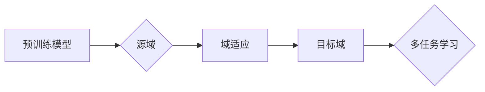

# 迁移学习Transfer Learning原理与代码实例讲解

作者：禅与计算机程序设计艺术 / Zen and the Art of Computer Programming

## 1. 背景介绍
### 1.1 问题的由来

随着深度学习技术的迅猛发展，越来越多的复杂模型被应用于实际场景中。然而，深度学习模型的训练通常需要大量的标注数据和计算资源，这对于许多领域来说是一个巨大的挑战。迁移学习（Transfer Learning，TL）作为一种高效的学习方法，通过利用现有模型的知识和经验来解决新的问题，从而降低训练成本，提高模型性能。

### 1.2 研究现状

迁移学习的研究始于20世纪50年代，经过几十年的发展，已经取得了显著的成果。目前，迁移学习在计算机视觉、自然语言处理、语音识别等领域得到了广泛应用。随着深度学习技术的不断进步，迁移学习的方法和理论也在不断发展和完善。

### 1.3 研究意义

迁移学习具有重要的理论意义和应用价值：

- **降低训练成本**：通过利用预训练模型的知识，减少了对标注数据的依赖，降低了训练成本。
- **提高模型性能**：迁移学习可以充分利用预训练模型的泛化能力，提高模型在新数据上的性能。
- **促进知识共享**：通过共享预训练模型，可以加速新领域的知识积累。

### 1.4 本文结构

本文将介绍迁移学习的原理、算法、代码实例和应用场景，并探讨其未来发展趋势和挑战。

## 2. 核心概念与联系

### 2.1 相关概念

- **预训练模型**：在大规模数据集上训练得到的模型，具有强大的特征提取能力。
- **源域（Source Domain）**：预训练模型所使用的数据集所在的领域。
- **目标域（Target Domain）**：需要使用预训练模型进行训练的领域。
- **域适应（Domain Adaptation）**：将源域的知识迁移到目标域，以适应目标域的数据分布差异。
- **多任务学习（Multi-task Learning）**：同时学习多个相关任务，以促进知识的共享和模型的泛化能力。

### 2.2 概念关系

迁移学习主要涉及以下几个概念：

- 预训练模型：作为迁移学习的核心，提供知识共享的基础。
- 源域和目标域：描述了迁移学习的应用场景。
- 域适应：针对目标域数据分布差异，对预训练模型进行调整。
- 多任务学习：通过学习多个相关任务，提高模型的泛化能力。

它们的逻辑关系如下图所示：



## 3. 核心算法原理 & 具体操作步骤
### 3.1 算法原理概述

迁移学习的基本思想是将预训练模型在源域学习到的知识迁移到目标域。根据迁移的方式，可以将迁移学习分为以下几种类型：

- **特征迁移**：将预训练模型的特征提取器迁移到目标域，并在目标域重新训练分类器。
- **参数迁移**：将预训练模型的参数直接迁移到目标域，并针对目标域进行微调。
- **模型迁移**：将预训练模型的整体结构迁移到目标域，并在目标域进行训练。

### 3.2 算法步骤详解

迁移学习的基本步骤如下：

1. **预训练**：在源域上训练一个通用的预训练模型。
2. **特征提取**：从预训练模型中提取特征提取器。
3. **目标域数据收集**：收集目标域的数据集。
4. **特征提取器调整**：根据目标域数据的分布，对特征提取器进行调整。
5. **目标域分类器训练**：在调整后的特征提取器上训练分类器。
6. **模型评估**：在目标域上评估模型的性能。

### 3.3 算法优缺点

迁移学习具有以下优点：

- **降低训练成本**：利用预训练模型的知识，减少了对标注数据的依赖，降低了训练成本。
- **提高模型性能**：利用预训练模型的泛化能力，提高模型在新数据上的性能。

迁移学习的缺点如下：

- **数据分布差异**：源域和目标域的数据分布差异可能导致模型在目标域上性能下降。
- **模型复杂度**：迁移学习模型通常比从头训练的模型更复杂，需要更多的计算资源。

### 3.4 算法应用领域

迁移学习在以下领域得到了广泛应用：

- **计算机视觉**：图像分类、目标检测、图像分割等。
- **自然语言处理**：文本分类、情感分析、机器翻译等。
- **语音识别**：说话人识别、语音合成等。

## 4. 数学模型和公式 & 详细讲解 & 举例说明
### 4.1 数学模型构建

以下是一个简单的迁移学习数学模型：

设 $f(\theta)$ 为预训练模型，$\theta$ 为模型参数。$X$ 为源域数据，$Y$ 为源域标签。$X'$ 为目标域数据，$Y'$ 为目标域标签。

$$
f(\theta)(X) = Z
$$

$$
\hat{y} = \arg\max_{y \in \mathcal{Y}} P(y|X, \theta)
$$

其中，$\mathcal{Y}$ 为标签空间。

### 4.2 公式推导过程

以图像分类任务为例，假设预训练模型是一个卷积神经网络（CNN），其输出为：

$$
f(\theta)(X) = \sigma(W^{(L)}\sigma(W^{(L-1)}\cdots\sigma(W^{(1)}X + b^{(1)})\cdots+b^{(L)}) + b^{(L)})
$$

其中，$\sigma$ 表示激活函数，$W^{(l)}$ 和 $b^{(l)}$ 分别表示第 $l$ 层的权重和偏置。

在目标域上，对特征提取器进行调整，得到调整后的特征提取器 $f'(\theta')$：

$$
f'(\theta')(X) = \sigma(W'^{(L)}\sigma(W'^{(L-1)}\cdots\sigma(W'^{(1)}X + b'^{(1)})\cdots+b'^{(L)}) + b'^{(L)})
$$

其中，$\theta'$ 为调整后的模型参数。

在目标域上，对调整后的特征提取器进行微调，得到目标域分类器：

$$
\hat{y} = \arg\max_{y \in \mathcal{Y}} P(y|f'(\theta')(X), \theta'_{\text{class}})
$$

其中，$\theta'_{\text{class}}$ 为目标域分类器的参数。

### 4.3 案例分析与讲解

以下是一个简单的图像分类迁移学习案例：

假设我们有一个在ImageNet数据集上预训练的CNN模型，用于识别动物类别。现在，我们需要在另一个数据集CIFAR-10上进行微调，以识别飞机类别。

首先，我们将预训练的CNN模型作为特征提取器，将CIFAR-10数据集中的图像输入到特征提取器中，得到特征向量。

然后，我们对特征提取器进行调整，使其适应飞机类别的特征。调整后的特征提取器在CIFAR-10数据集上进行微调，得到飞机类别分类器。

最后，在CIFAR-10数据集上评估分类器的性能。

### 4.4 常见问题解答

**Q1：什么是预训练模型？**

A：预训练模型是在大规模数据集上训练得到的模型，具有强大的特征提取能力。预训练模型可以作为迁移学习的起点，将知识迁移到新的任务中。

**Q2：如何选择合适的预训练模型？**

A：选择合适的预训练模型需要考虑以下因素：

- 预训练模型的规模和复杂度。
- 预训练模型所使用的预训练数据集。
- 目标域数据的特点。

**Q3：如何进行特征提取器调整？**

A：特征提取器调整的方法有很多，常用的方法包括：

- 特征降维。
- 特征选择。
- 特征生成。

**Q4：如何进行目标域分类器训练？**

A：目标域分类器训练的方法与从头训练分类器类似，可以使用常用的分类算法，如支持向量机、决策树、随机森林等。

## 5. 项目实践：代码实例和详细解释说明
### 5.1 开发环境搭建

在进行迁移学习项目实践前，我们需要准备好开发环境。以下是使用Python进行TensorFlow开发的环境配置流程：

1. 安装Anaconda：从官网下载并安装Anaconda，用于创建独立的Python环境。

2. 创建并激活虚拟环境：
```bash
conda create -n tensorflow-env python=3.8
conda activate tensorflow-env
```

3. 安装TensorFlow：从官网下载并安装TensorFlow。

4. 安装其他依赖库：如NumPy、Pandas、Scikit-learn等。

### 5.2 源代码详细实现

以下是一个简单的图像分类迁移学习代码实例，使用TensorFlow和Keras实现：

```python
import tensorflow as tf
from tensorflow.keras.applications import VGG16
from tensorflow.keras.models import Model
from tensorflow.keras.layers import Dense, Flatten

# 加载VGG16预训练模型
base_model = VGG16(weights='imagenet', include_top=False)

# 将VGG16模型作为特征提取器
x = base_model.output
x = Flatten()(x)

# 添加全连接层，用于分类
predictions = Dense(10, activation='softmax')(x)

# 构建模型
model = Model(inputs=base_model.input, outputs=predictions)

# 冻结VGG16模型层的权重
for layer in base_model.layers:
    layer.trainable = False

# 在全连接层上训练模型
model.compile(optimizer='adam', loss='categorical_crossentropy', metrics=['accuracy'])
model.fit(train_data, train_labels, epochs=5, validation_data=(val_data, val_labels))
```

### 5.3 代码解读与分析

上述代码使用了VGG16预训练模型作为特征提取器，并添加了一个全连接层进行分类。以下是对代码的详细解读：

- 首先，导入TensorFlow和Keras库。
- 加载VGG16预训练模型，并设置`include_top=False`，表示不包含顶层的全连接层。
- 将VGG16模型作为特征提取器，并使用Flatten层将其输出展平。
- 添加全连接层，用于分类，并设置输出维度为10，表示有10个类别。
- 构建模型，将VGG16模型的输入作为模型的输入，将全连接层的输出作为模型的输出。
- 冻结VGG16模型层的权重，防止在训练过程中更新。
- 定义模型编译器，设置优化器、损失函数和评估指标。
- 使用训练数据和标签对模型进行训练。

### 5.4 运行结果展示

运行上述代码，将在训练集和验证集上评估模型的性能，并输出模型的准确率。

## 6. 实际应用场景
### 6.1 医学影像分析

迁移学习在医学影像分析领域具有广泛的应用。例如，可以使用在大型医学影像数据集上预训练的深度学习模型，对新的医学影像进行分类或分割。由于医学影像数据集通常规模较小，迁移学习可以显著降低训练成本，并提高模型的性能。

### 6.2 智能语音识别

迁移学习在智能语音识别领域也得到了广泛应用。例如，可以使用在大型语音数据集上预训练的深度学习模型，对新的语音进行识别。由于语音数据集通常规模较大，迁移学习可以加速模型的训练过程，并提高模型的性能。

### 6.3 智能驾驶

迁移学习在智能驾驶领域也具有广泛的应用。例如，可以使用在大型自动驾驶数据集上预训练的深度学习模型，对车辆周围的环境进行感知。由于自动驾驶数据集通常规模较大，迁移学习可以加速模型的训练过程，并提高模型的性能。

### 6.4 未来应用展望

随着深度学习技术的不断发展，迁移学习将在更多领域得到应用。例如：

- **多模态学习**：将文本、图像、语音等多种模态数据进行融合，提高模型的性能。
- **强化学习**：将迁移学习与强化学习相结合，实现更加智能的决策。
- **无监督学习**：将迁移学习与无监督学习相结合，减少对标注数据的依赖。

## 7. 工具和资源推荐
### 7.1 学习资源推荐

为了帮助开发者系统掌握迁移学习的理论基础和实践技巧，这里推荐一些优质的学习资源：

1. 《深度学习》（Goodfellow et al.）：介绍了深度学习的理论基础、算法和应用。
2. 《迁移学习：原理与实现》（Dai et al.）：详细介绍了迁移学习的理论、算法和应用。
3. TensorFlow官方文档：提供了TensorFlow框架的详细介绍，包括迁移学习的实现方法。
4. PyTorch官方文档：提供了PyTorch框架的详细介绍，包括迁移学习的实现方法。

### 7.2 开发工具推荐

1. TensorFlow：Google开发的深度学习框架，支持迁移学习。
2. PyTorch：Facebook开发的深度学习框架，支持迁移学习。
3. Keras：基于TensorFlow和PyTorch的高级API，简化了迁移学习的实现。
4. Hugging Face的Transformers库：提供了大量预训练的模型和工具，方便进行迁移学习。

### 7.3 相关论文推荐

1. “ImageNet Classification with Deep Convolutional Neural Networks”（ Krizhevsky et al., 2012）
2. “Very Deep Convolutional Networks for Large-Scale Image Recognition”（ Simonyan et al., 2014）
3. “Deep Learning for Image Recognition with Convolutional Neural Networks”（ Krizhevsky et al., 2017）
4. “Domain Adaptation with Deep Generative Models”（ Ganin & Lempitsky, 2015）
5. “Unsupervised Domain Adaptation with Virtual Adversarial Training”（ Ganin et al., 2016）

### 7.4 其他资源推荐

1. OpenAI：提供了大量预训练的模型和工具。
2. Hugging Face：提供了大量预训练的模型和工具。
3. Google AI：提供了大量AI研究和应用。
4. Facebook AI：提供了大量AI研究和应用。

## 8. 总结：未来发展趋势与挑战
### 8.1 研究成果总结

迁移学习是一种高效、实用的学习方法，在许多领域得到了广泛应用。本文介绍了迁移学习的原理、算法、代码实例和应用场景，并探讨了其未来发展趋势和挑战。

### 8.2 未来发展趋势

未来，迁移学习将呈现以下发展趋势：

- **多模态迁移学习**：将文本、图像、语音等多种模态数据进行融合，提高模型的性能。
- **无监督迁移学习**：减少对标注数据的依赖，降低训练成本。
- **迁移学习的可解释性**：提高模型的透明度和可解释性。
- **迁移学习的泛化能力**：提高模型在不同领域、不同任务上的泛化能力。

### 8.3 面临的挑战

迁移学习面临着以下挑战：

- **数据分布差异**：源域和目标域的数据分布差异可能导致模型在目标域上性能下降。
- **模型复杂度**：迁移学习模型通常比从头训练的模型更复杂，需要更多的计算资源。
- **可解释性**：提高模型的透明度和可解释性，使其更易于理解和应用。

### 8.4 研究展望

未来，迁移学习的研究将主要集中在以下几个方面：

- **无监督迁移学习**：减少对标注数据的依赖，降低训练成本。
- **多模态迁移学习**：将多种模态数据进行融合，提高模型的性能。
- **迁移学习的可解释性**：提高模型的透明度和可解释性。
- **迁移学习的泛化能力**：提高模型在不同领域、不同任务上的泛化能力。

## 9. 附录：常见问题与解答

**Q1：什么是迁移学习？**

A：迁移学习是一种学习方法，通过利用现有模型的知识和经验来解决新的问题，从而降低训练成本，提高模型性能。

**Q2：迁移学习适用于哪些任务？**

A：迁移学习适用于各种机器学习任务，包括图像分类、自然语言处理、语音识别等。

**Q3：如何进行特征提取器调整？**

A：特征提取器调整的方法有很多，常用的方法包括特征降维、特征选择、特征生成等。

**Q4：如何进行目标域分类器训练？**

A：目标域分类器训练的方法与从头训练分类器类似，可以使用常用的分类算法，如支持向量机、决策树、随机森林等。

**Q5：迁移学习的优势是什么？**

A：迁移学习的优势包括降低训练成本、提高模型性能、促进知识共享等。

**Q6：迁移学习的缺点是什么？**

A：迁移学习的缺点包括数据分布差异、模型复杂度、可解释性等。

**Q7：如何进行多模态迁移学习？**

A：多模态迁移学习需要将不同模态的数据进行融合，常用的方法包括特征融合、模型融合等。

**Q8：如何进行无监督迁移学习？**

A：无监督迁移学习需要利用无标签数据进行学习，常用的方法包括无监督预训练、无监督域适应等。

**Q9：如何提高迁移学习的可解释性？**

A：提高迁移学习的可解释性需要从算法、模型、数据等多个方面进行改进，常用的方法包括可解释性分析、可视化等。

**Q10：如何提高迁移学习的泛化能力？**

A：提高迁移学习的泛化能力需要从算法、模型、数据等多个方面进行改进，常用的方法包括数据增强、模型正则化等。