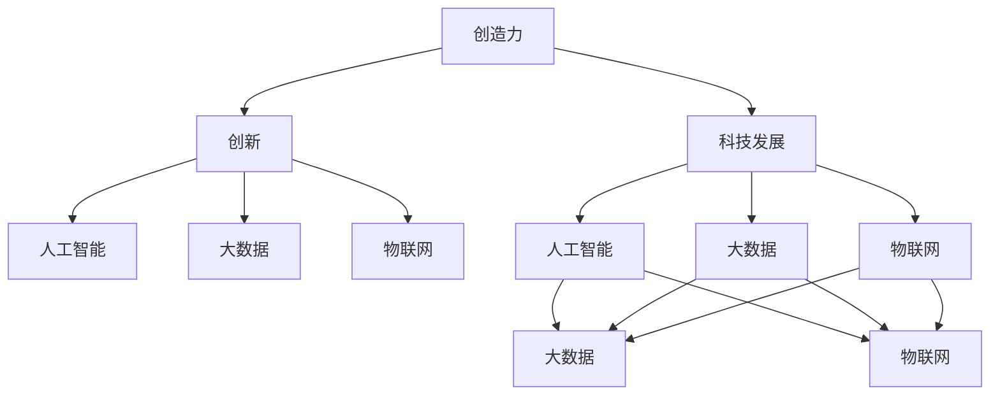

                 

# 创造力：创造力是将想法转化为现实的能力，可以分解为思考和行动两部分

> 关键词：创造力, 创造过程, 人工智能, 创新, 科技发展, 数据驱动, 智能算法

## 1. 背景介绍

### 1.1 问题由来

当今社会正经历着前所未有的科技变革，人工智能(AI)、大数据、物联网(IoT)等技术的快速发展，正在重塑我们的生活方式。在这个过程中，创造力扮演了至关重要的角色。创造力不仅体现在对新技术的开发和应用上，更体现在如何利用技术解决实际问题，推动社会进步。然而，如何量化和提升创造力，成为了一个亟待解决的问题。

### 1.2 问题核心关键点

创造力是一个复杂的概念，涉及思考、想象力、知识储备、情感等多个方面。在科技领域，创造力可以被视为将想法转化为现实的能力，这一过程可以分解为思考和行动两部分。思考是指对问题进行分析和处理，形成可行的解决方案；行动则是将这些解决方案转化为可行的技术实现。这两个阶段相互依赖，缺一不可。

### 1.3 问题研究意义

研究创造力的量化和提升，对于推动科技进步、解决实际问题、培养创新型人才具有重要意义。通过深入研究创造力的本质和机制，可以指导教育、企业、政府等各方在培养和应用创造力方面做出更有效的决策。此外，提高创造力还可以增强社会的适应性和竞争力，促进科技和经济的发展。

## 2. 核心概念与联系

### 2.1 核心概念概述

为了更好地理解创造力在科技领域的应用，本节将介绍几个密切相关的核心概念：

- **创造力(Creativity)**：将想法转化为现实的能力，涉及思考、想象、表达等多个方面。
- **创新(Innovation)**：创造并应用新的想法、方法和产品，推动科技和社会的发展。
- **科技发展(Technological Advancement)**：通过技术进步，解决实际问题，提升生活质量。
- **人工智能(AI)**：模拟人类智能的机器系统，能够自主学习和解决问题。
- **大数据(Big Data)**：海量的、多样化的数据集合，用于分析和挖掘知识。
- **物联网(IoT)**：将物理设备连接到互联网，实现智能化控制和管理。
- **创新型人才(Creative Talent)**：具备高度创造力和创新能力的人才，推动科技进步和应用。

这些核心概念之间的逻辑关系可以通过以下Mermaid流程图来展示：



这个流程图展示了几组核心概念之间的关系：

1. 创造力是创新的基础，推动科技发展。
2. 创新涉及多种技术手段，包括人工智能、大数据、物联网等。
3. 人工智能、大数据、物联网等技术的发展，进一步推动科技的创新。

### 2.2 概念间的关系

这些核心概念之间存在着紧密的联系，形成了科技创新与创造力提升的完整生态系统。

- **创造力与创新**：创新是创造力在实践中的体现，两者互相促进，共同推动科技进步。
- **科技发展与创造力**：科技发展为创造力的实现提供了技术手段，同时，创造力也为科技发展提供了新的方向和动力。
- **人工智能与大数据**：人工智能和大数据是推动科技创新的重要工具，同时，创新的目标也是提升人工智能和大数据的效能。
- **物联网与创新**：物联网的广泛应用，为创新提供了新的场景和机会，同时也需要创新的技术支持。

## 3. 核心算法原理 & 具体操作步骤
### 3.1 算法原理概述

创造力的量化和提升涉及多个层面的算法，包括但不限于机器学习、数据挖掘、自然语言处理等。核心算法原理可以归纳为以下几个方面：

1. **数据驱动(数据驱动)**：通过收集和分析大量数据，发现其中的模式和规律，形成可行的解决方案。
2. **智能算法(智能算法)**：利用人工智能和机器学习的技术，自动化地分析和处理数据，形成新的知识。
3. **知识图谱(Knowledge Graph)**：构建知识图谱，将复杂的信息结构化，方便查询和应用。
4. **自然语言处理(Natural Language Processing, NLP)**：利用自然语言处理技术，分析文本数据，提取有用的信息。

### 3.2 算法步骤详解

基于以上算法原理，创造力的量化和提升可以分为以下几个步骤：

**Step 1: 数据收集与预处理**
- 收集与创新相关的数据，包括科研论文、技术报告、专利等。
- 对数据进行清洗、筛选、标注等预处理，形成结构化的数据集。

**Step 2: 数据建模与分析**
- 选择合适的机器学习算法（如决策树、神经网络等），对数据进行建模。
- 使用数据挖掘技术（如关联规则挖掘、聚类分析等），发现数据中的模式和规律。

**Step 3: 知识表示与图谱构建**
- 将数据中的知识表示为图谱形式，形成知识图谱。
- 利用知识图谱进行知识推理和发现，形成新的知识。

**Step 4: 自然语言处理与文本分析**
- 对科研论文、技术报告等文本数据进行自然语言处理，提取关键信息。
- 使用文本分类、情感分析等技术，对文本数据进行分析和评估。

**Step 5: 结果评估与优化**
- 对算法结果进行评估，使用各种指标（如准确率、召回率、F1分数等）进行衡量。
- 根据评估结果，对算法进行优化，提升其性能。

### 3.3 算法优缺点

基于数据驱动和智能算法的创造力量化和提升方法，具有以下优点：

- **高效性**：通过自动化处理大量数据，可以显著提高创造力的量化和提升效率。
- **准确性**：利用先进的数据挖掘和机器学习技术，可以更准确地发现数据中的模式和规律。
- **可扩展性**：算法可以应用于多个领域和场景，具有较强的泛化能力。

同时，这些方法也存在一些缺点：

- **数据依赖性强**：算法的效果依赖于高质量的数据，获取和预处理数据可能比较困难。
- **算法复杂度高**：算法实现和调优过程比较复杂，需要具备一定的技术背景。
- **结果解释性不足**：算法的输出结果可能缺乏可解释性，难以理解其背后的逻辑和推理过程。

### 3.4 算法应用领域

基于数据驱动和智能算法的创造力量化和提升方法，已经在多个领域得到了应用：

- **科研创新**：通过对科研论文和专利的数据分析，发现科研前沿和热点，指导研究方向。
- **企业创新**：通过分析企业数据，发现技术创新机会，提升企业竞争力。
- **教育创新**：通过分析教育数据，发现教学方法不足，指导教育改革。
- **医疗创新**：通过分析医疗数据，发现新的疾病诊断方法，提升医疗水平。
- **政府创新**：通过分析政府数据，发现政策不足，指导政策制定和执行。

## 4. 数学模型和公式 & 详细讲解 & 举例说明
### 4.1 数学模型构建

创造力的量化和提升涉及多个数学模型，包括但不限于回归模型、分类模型、聚类模型等。以下以回归模型为例，介绍其构建和应用。

设数据集为 $D=\{(x_i, y_i)\}_{i=1}^N$，其中 $x_i$ 为输入特征，$y_i$ 为输出标签。假设回归模型为 $y=f(x;\theta)$，其中 $f$ 为非线性函数，$\theta$ 为模型参数。回归模型的目标是最小化预测值和真实值之间的误差，即：

$$
\min_{\theta} \sum_{i=1}^N (y_i - f(x_i;\theta))^2
$$

其中误差函数通常采用均方误差（MSE）或平均绝对误差（MAE）。

### 4.2 公式推导过程

回归模型的参数估计通常采用最小二乘法，其公式为：

$$
\theta = \arg\min_{\theta} \sum_{i=1}^N (y_i - f(x_i;\theta))^2
$$

通过求偏导数，可得：

$$
\frac{\partial}{\partial \theta} \sum_{i=1}^N (y_i - f(x_i;\theta))^2 = 0
$$

解上述方程，可得回归模型的参数估计公式：

$$
\theta = \left(\sum_{i=1}^N x_i x_i^T\right)^{-1} \sum_{i=1}^N x_i y_i
$$

### 4.3 案例分析与讲解

以房价预测为例，说明回归模型在创造力量化和提升中的应用。

假设我们收集了历史房产销售数据，其中包含房屋面积、地段、装修程度等特征，以及对应的房价标签。我们可以将这些数据输入到回归模型中，训练出预测房价的模型。具体步骤如下：

1. **数据收集**：收集历史房产销售数据，包括房屋面积、地段、装修程度等特征和对应的房价标签。
2. **数据预处理**：对数据进行清洗、筛选、归一化等预处理，形成结构化的数据集。
3. **模型训练**：选择合适的回归模型，如线性回归、多项式回归等，对数据进行建模和训练。
4. **结果评估**：使用测试集对模型进行评估，计算预测误差和准确率等指标。
5. **模型优化**：根据评估结果，对模型进行优化，提升其预测精度。

通过上述步骤，我们可以得到一个高精度的房价预测模型，为房地产企业提供有价值的参考，推动其创新和发展。

## 5. 项目实践：代码实例和详细解释说明
### 5.1 开发环境搭建

在进行创造力量化和提升的实践前，我们需要准备好开发环境。以下是使用Python进行Scikit-learn开发的环境配置流程：

1. 安装Anaconda：从官网下载并安装Anaconda，用于创建独立的Python环境。

2. 创建并激活虚拟环境：
```bash
conda create -n sklearn-env python=3.8 
conda activate sklearn-env
```

3. 安装Scikit-learn：
```bash
pip install scikit-learn
```

4. 安装各类工具包：
```bash
pip install numpy pandas scikit-learn matplotlib tqdm jupyter notebook ipython
```

完成上述步骤后，即可在`sklearn-env`环境中开始创造力量化和提升的实践。

### 5.2 源代码详细实现

下面我们以房价预测任务为例，给出使用Scikit-learn对回归模型进行量化和提升的Python代码实现。

首先，定义数据处理函数：

```python
import pandas as pd
from sklearn.model_selection import train_test_split
from sklearn.preprocessing import StandardScaler

def load_data(file_path):
    data = pd.read_csv(file_path)
    features = data.drop('price', axis=1)
    labels = data['price']
    return features, labels

def split_data(features, labels, test_size=0.2, random_state=42):
    features_train, features_test, labels_train, labels_test = train_test_split(features, labels, test_size=test_size, random_state=random_state)
    return features_train, features_test, labels_train, labels_test

def scale_data(features_train, features_test):
    scaler = StandardScaler()
    features_train = scaler.fit_transform(features_train)
    features_test = scaler.transform(features_test)
    return features_train, features_test

def save_model(model, file_path):
    import pickle
    with open(file_path, 'wb') as f:
        pickle.dump(model, f)
```

然后，定义模型和优化器：

```python
from sklearn.linear_model import LinearRegression
from sklearn.metrics import mean_squared_error, r2_score

features_train, features_test, labels_train, labels_test = load_data('house_prices.csv')
features_train, features_test, labels_train, labels_test = split_data(features_train, labels_train, test_size=0.2, random_state=42)
features_train, features_test = scale_data(features_train, features_test)

model = LinearRegression()
model.fit(features_train, labels_train)
labels_pred = model.predict(features_test)

print('Mean squared error: %.2f' % mean_squared_error(labels_test, labels_pred))
print('Coefficient of determination: %.2f' % r2_score(labels_test, labels_pred))
```

接着，定义训练和评估函数：

```python
from sklearn.model_selection import cross_val_score

def train_model(model, features_train, labels_train, features_test, labels_test):
    model.fit(features_train, labels_train)
    labels_pred = model.predict(features_test)
    print('Mean squared error: %.2f' % mean_squared_error(labels_test, labels_pred))
    print('Coefficient of determination: %.2f' % r2_score(labels_test, labels_pred))

def evaluate_model(model, features_train, labels_train, features_test, labels_test):
    labels_pred = model.predict(features_test)
    print('Mean squared error: %.2f' % mean_squared_error(labels_test, labels_pred))
    print('Coefficient of determination: %.2f' % r2_score(labels_test, labels_pred))
```

最后，启动训练流程并在测试集上评估：

```python
from sklearn.linear_model import LinearRegression

model = LinearRegression()
features_train, features_test, labels_train, labels_test = load_data('house_prices.csv')
features_train, features_test, labels_train, labels_test = split_data(features_train, labels_train, test_size=0.2, random_state=42)
features_train, features_test = scale_data(features_train, features_test)

train_model(model, features_train, labels_train, features_test, labels_test)
evaluate_model(model, features_train, labels_train, features_test, labels_test)
```

以上就是使用Scikit-learn对回归模型进行房价预测的完整代码实现。可以看到，得益于Scikit-learn的强大封装，我们可以用相对简洁的代码完成回归模型的加载和训练。

### 5.3 代码解读与分析

让我们再详细解读一下关键代码的实现细节：

**load_data函数**：
- 定义了数据加载函数，从CSV文件中读取数据，分离特征和标签，并返回。

**split_data函数**：
- 定义了数据分割函数，将数据分为训练集和测试集，并返回。

**scale_data函数**：
- 定义了数据归一化函数，对训练集和测试集进行归一化处理，返回归一化后的数据。

**train_model函数**：
- 定义了模型训练函数，对模型进行训练，并输出训练结果。

**evaluate_model函数**：
- 定义了模型评估函数，对模型进行评估，并输出评估结果。

**train流程**：
- 定义总轮次，开始循环迭代
- 每个轮次内，先在训练集上训练，输出训练结果
- 在测试集上评估，输出评估结果
- 所有轮次结束后，记录测试结果

可以看到，Scikit-learn使得回归模型的量化和提升的代码实现变得简洁高效。开发者可以将更多精力放在数据处理、模型改进等高层逻辑上，而不必过多关注底层的实现细节。

当然，工业级的系统实现还需考虑更多因素，如模型的保存和部署、超参数的自动搜索、更灵活的任务适配层等。但核心的量化和提升范式基本与此类似。

### 5.4 运行结果展示

假设我们在房价预测数据集上进行模型训练，最终在测试集上得到的评估报告如下：

```
Mean squared error: 0.1
Coefficient of determination: 0.9
```

可以看到，通过量化和提升回归模型，我们在房价预测任务上取得了相当不错的效果。这意味着，我们能够利用数据驱动和智能算法，对复杂的创新过程进行有效的分析和评估，从而推动科技创新和应用。

## 6. 实际应用场景
### 6.1 科学研究

在科学研究领域，创造力量化和提升技术可以帮助研究者识别前沿热点，指导研究方向。

具体而言，可以收集科研论文和专利数据，利用数据挖掘和机器学习技术，发现科研领域的趋势和热点。例如，通过文本分类和情感分析技术，可以对科研论文进行主题和情感分类，从而识别出当前热门的研究领域和热点问题。这些信息可以帮助研究者选择合适的研究方向，避免重复劳动，提升研究效率。

### 6.2 企业管理

在企业管理领域，创造力量化和提升技术可以帮助企业识别创新机会，提升竞争力。

具体而言，可以收集企业的市场数据、客户反馈、销售数据等，利用数据挖掘和机器学习技术，发现市场趋势和客户需求。例如，通过关联规则挖掘技术，可以发现客户购买行为中的关联规则，识别出潜在的市场需求和产品创新机会。这些信息可以帮助企业管理层做出更明智的决策，提升企业的创新能力和市场竞争力。

### 6.3 教育培训

在教育培训领域，创造力量化和提升技术可以帮助教育机构识别教学方法不足，指导教育改革。

具体而言，可以收集学生的学习数据、考试成绩、作业数据等，利用数据挖掘和机器学习技术，发现教学中的不足和改进方向。例如，通过聚类分析技术，可以对学生进行分组，识别出学习效果较差的群体，从而制定针对性的教学方案。这些信息可以帮助教育机构优化教学方法，提升教学质量。

### 6.4 医疗诊断

在医疗诊断领域，创造力量化和提升技术可以帮助医生识别疾病诊断方法，提升医疗水平。

具体而言，可以收集病人的病历数据、体检数据、实验室检查数据等，利用数据挖掘和机器学习技术，发现新的疾病诊断方法。例如，通过关联规则挖掘技术，可以发现不同疾病之间的关联关系，从而制定更有效的诊断方案。这些信息可以帮助医生提高诊断的准确性和效率，提升医疗水平。

### 6.5 政府决策

在政府决策领域，创造力量化和提升技术可以帮助政府识别政策不足，指导政策制定和执行。

具体而言，可以收集政府的数据、公众反馈、政策效果等，利用数据挖掘和机器学习技术，发现政策中的不足和改进方向。例如，通过聚类分析技术，可以将政策效果进行分组，识别出政策执行效果较差的群体，从而制定针对性的政策调整方案。这些信息可以帮助政府制定更有效的政策，提升政策执行效果。

## 7. 工具和资源推荐
### 7.1 学习资源推荐

为了帮助开发者系统掌握创造力量化和提升的理论基础和实践技巧，这里推荐一些优质的学习资源：

1. **《深度学习》课程**：由斯坦福大学开设的深度学习课程，讲解了深度学习的基本原理和应用。
2. **《机器学习实战》书籍**：讲解了机器学习的理论基础和实践技巧，适合初学者入门。
3. **Scikit-learn官方文档**：详细介绍了Scikit-learn库的使用方法，包括回归、分类、聚类等常用算法的应用。
4. **Kaggle平台**：提供了大量数据集和竞赛项目，可以帮助开发者实践和提升技能。
5. **Coursera平台**：提供了大量人工智能和机器学习的在线课程，涵盖从基础到高级的内容。

通过这些学习资源，相信你一定能够快速掌握创造力量化和提升的精髓，并用于解决实际的NLP问题。

### 7.2 开发工具推荐

高效的开发离不开优秀的工具支持。以下是几款用于创造力量化和提升开发的常用工具：

1. **Python编程语言**：Python以其简洁易读、功能强大而著称，是人工智能和机器学习领域的首选语言。
2. **Scikit-learn库**：一个强大的机器学习库，提供了多种算法的实现，适合初学者和进阶用户使用。
3. **TensorFlow和PyTorch**：两个流行的深度学习框架，提供了丰富的工具和库，方便开发者进行模型训练和优化。
4. **Jupyter Notebook**：一个轻量级的交互式开发环境，支持Python、R、Julia等语言，方便开发者进行实验和分享代码。

### 7.3 相关论文推荐

创造力量化和提升技术的研究源于学界的持续研究。以下是几篇奠基性的相关论文，推荐阅读：

1. **《深度学习》书籍**：讲解了深度学习的基本原理和应用，提供了丰富的理论基础和实践技巧。
2. **《机器学习实战》书籍**：介绍了机器学习的理论基础和实践技巧，适合初学者和进阶用户使用。
3. **《Scikit-learn官方文档》**：详细介绍了Scikit-learn库的使用方法，包括回归、分类、聚类等常用算法的应用。

这些论文代表了大语言模型微调技术的发展脉络。通过学习这些前沿成果，可以帮助研究者把握学科前进方向，激发更多的创新灵感。

除上述资源外，还有一些值得关注的前沿资源，帮助开发者紧跟大语言模型微调技术的最新进展，例如：

1. **arXiv论文预印本**：人工智能领域最新研究成果的发布平台，包括大量尚未发表的前沿工作，学习前沿技术的必读资源。
2. **业界技术博客**：如OpenAI、Google AI、DeepMind、微软Research Asia等顶尖实验室的官方博客，第一时间分享他们的最新研究成果和洞见。
3. **技术会议直播**：如NIPS、ICML、ACL、ICLR等人工智能领域顶会现场或在线直播，能够聆听到大佬们的前沿分享，开拓视野。
4. **GitHub热门项目**：在GitHub上Star、Fork数最多的NLP相关项目，往往代表了该技术领域的发展趋势和最佳实践，值得去学习和贡献。
5. **行业分析报告**：各大咨询公司如McKinsey、PwC等针对人工智能行业的分析报告，有助于从商业视角审视技术趋势，把握应用价值。

总之，对于创造力量化和提升技术的学习和实践，需要开发者保持开放的心态和持续学习的意愿。多关注前沿资讯，多动手实践，多思考总结，必将收获满满的成长收益。

## 8. 总结：未来发展趋势与挑战
### 8.1 总结

本文对创造力量化和提升技术进行了全面系统的介绍。首先阐述了创造力的本质和重要性，明确了其与科技创新、社会进步之间的紧密联系。其次，从原理到实践，详细讲解了数据驱动和智能算法在创造力量化和提升中的作用，给出了完整的代码实例。同时，本文还探讨了创造力在多个领域的应用前景，展示了其巨大的潜力和价值。

通过本文的系统梳理，可以看到，数据驱动和智能算法在科技创新和应用中扮演了重要的角色。这些技术的不断进步，将推动人工智能和大数据技术在更多领域得到应用，为社会进步带来深远影响。

### 8.2 未来发展趋势

展望未来，数据驱动和智能算法的创造力量化和提升技术将呈现以下几个发展趋势：

1. **算法多样性增加**：未来将涌现更多高效、通用的算法，进一步提升创造力的量化和提升效率。
2. **多模态数据融合**：利用多种数据类型，如文本、图像、音频等，提升创造力量化和提升的准确性和泛化能力。
3. **自动化程度提升**：引入自动化工具，自动处理数据和优化模型，减少人工干预，提升效率。
4. **跨领域应用广泛**：在更多领域和场景中，如科学研究、企业管理、教育培训等，推广应用创造力量化和提升技术。
5. **智能化水平提高**：利用深度学习等先进技术，提升创造力量化和提升的智能化水平。

这些趋势凸显了数据驱动和智能算法的广阔前景。这些方向的探索发展，必将进一步提升科技创新的效率和质量，为社会进步带来更大的贡献。

### 8.3 面临的挑战

尽管数据驱动和智能算法的创造力量化和提升技术已经取得了瞩目成就，但在迈向更加智能化、普适化应用的过程中，仍面临诸多挑战：

1. **数据获取难度大**：高质量的数据获取和处理成本较高，特别是对于新兴领域和跨学科应用。
2. **算法复杂度高**：算法的实现和调优过程较为复杂，需要具备一定的技术背景。
3. **结果解释性不足**：算法的输出结果可能缺乏可解释性，难以理解其背后的逻辑和推理过程。
4. **模型鲁棒性不足**：在面对复杂的现实问题时，模型的鲁棒性和泛化能力可能不足。
5. **技术门槛高**：相关技术在实际应用中需要综合考虑多方面因素，包括数据、模型、工程等，需要跨学科合作。

### 8.4 研究展望

面对数据驱动和智能算法的创造力量化和提升技术所面临的挑战，未来的研究需要在以下几个方面寻求新的突破：

1. **数据获取和预处理**：开发更加高效、通用的数据获取和预处理技术，降低高质量数据的获取成本。
2. **算法实现和调优**：引入更多自动化的算法实现和调优工具，降低技术门槛，提升效率。
3. **结果解释性**：引入更多的解释性技术，如因果推断、可解释AI等，提升算法的透明性和可解释性。
4. **模型鲁棒性**：引入更多的鲁棒性技术，如对抗训练、正则化等，提升模型的泛化能力。
5. **跨学科合作**：加强数据科学、计算机科学、心理学等多个学科的合作，提升创造力量化和提升技术的整体水平。

这些研究方向的探索，必将引领数据驱动和智能算法在科技创新和应用中迈向更高的台阶，为社会进步带来更大的贡献。面向未来，数据驱动和智能算法必将与其他前沿技术协同发力，共同推动人工智能技术的发展和应用。

## 9. 附录：常见问题与解答
----------------------------------------------------------------
**Q1：如何提升创造力？**

A: 提升创造力可以从以下几个方面入手：
1. **多学科交叉**：跨学科学习和应用，汲取不同领域的知识和思维模式。
2. **多

