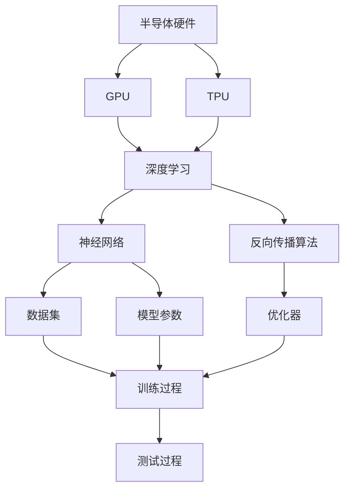

                 

# 半导体硬件技术与AI发展的关系

> 关键词：半导体硬件,人工智能,深度学习,神经网络,GPU,TPU,量子计算

## 1. 背景介绍

在过去的几十年里，人工智能（AI）已经成为改变现代社会的重要力量。从图像识别到语音识别，从自然语言处理到自动驾驶，AI技术正迅速渗透到各行各业，影响着我们的工作和生活。但在这背后，支撑AI的不仅仅是软件和算法，还有硬件技术的巨大支撑。半导体硬件，尤其是高性能计算芯片，成为了推动AI发展的关键因素。

半导体硬件与AI技术的紧密结合，不仅加速了AI模型的训练和推理速度，还显著降低了能源消耗，提高了系统的可靠性和安全性。随着AI应用的不断拓展，半导体硬件技术也在不断创新，为AI技术的进一步突破提供了坚实的基础。

## 2. 核心概念与联系

为了深入理解半导体硬件技术与AI发展的关系，本节将介绍几个核心概念及其联系：

- **半导体硬件**：包括CPU、GPU、TPU、FPGA、ASIC等各类高性能计算芯片，负责执行复杂的计算任务，是AI模型运行的核心。
- **深度学习**：以神经网络为代表，通过大量数据训练，提取数据中的模式和规律，实现高效的特征学习。
- **神经网络**：深度学习中的主要模型，由大量的神经元和连接组成，通过反向传播算法更新权重，优化模型性能。
- **GPU**：图形处理器，具有强大的并行计算能力，适用于矩阵运算和深度学习模型的训练。
- **TPU**：谷歌研发的专用AI加速芯片，专为深度学习模型设计，具有更高的计算密度和能效比。
- **量子计算**：一种新兴的计算范式，通过量子比特进行并行计算，有望在特定领域超越传统计算。

这些概念之间的联系可以通过以下Mermaid流程图来展示：



这个流程图展示了半导体硬件通过GPU和TPU等高性能计算芯片，为深度学习模型的训练和推理提供了强大计算支持。深度学习模型通过反向传播算法和优化器更新模型参数，对大量数据进行训练，形成神经网络，用于解决各类AI问题。

## 3. 核心算法原理 & 操作步骤
### 3.1 算法原理概述

半导体硬件与AI的结合，主要体现在加速深度学习模型的训练和推理。深度学习模型由大量的神经元和连接组成，通过反向传播算法更新权重，实现对数据的特征学习。半导体硬件通过并行计算和专门优化，显著提高了深度学习模型的计算效率和速度。

半导体硬件加速深度学习模型的基本原理可以总结如下：
1. **并行计算**：深度学习模型的计算通常涉及大量的矩阵乘法、卷积和全连接操作，这些操作可以并行计算，利用GPU、TPU等高性能计算芯片，大大加速了深度学习模型的训练和推理。
2. **硬件优化**：半导体硬件针对深度学习模型的特点，进行了专门优化，如Tensor Core、深度学习指令集等，提高了硬件的计算效率和能效比。
3. **深度学习框架支持**：深度学习框架如TensorFlow、PyTorch等，对GPU、TPU等硬件提供了高度的优化支持，能够充分发挥硬件的性能。

### 3.2 算法步骤详解

半导体硬件加速深度学习模型的操作步骤主要包括以下几个关键步骤：

1. **硬件选择**：根据深度学习模型的特点，选择合适的硬件平台，如GPU、TPU等。
2. **模型部署**：将深度学习模型部署到选定的硬件平台，并进行优化适配。
3. **数据准备**：准备训练数据集和测试数据集，划分为训练集、验证集和测试集。
4. **模型训练**：将数据集加载到硬件平台上，进行模型的训练过程。
5. **模型推理**：在硬件平台上进行模型的推理过程，生成预测结果。
6. **性能评估**：对模型的训练和推理过程进行性能评估，调整参数和优化策略。

### 3.3 算法优缺点

半导体硬件加速深度学习模型具有以下优点：
1. **计算效率高**：通过并行计算和专门优化，半导体硬件能够显著提高深度学习模型的计算效率和速度。
2. **能效比高**：半导体硬件通过硬件加速和优化，能够在更低的能源消耗下完成深度学习模型的训练和推理。
3. **可靠性高**：半导体硬件平台经过广泛测试和优化，具有较高的稳定性和可靠性。

但同时，半导体硬件加速深度学习模型也存在一些缺点：
1. **成本高**：高性能计算芯片的价格较高，增加了硬件部署的初始成本。
2. **灵活性差**：半导体硬件平台通常固定，无法根据应用场景灵活调整。
3. **编程复杂**：深度学习模型的硬件加速需要特定的编程接口和优化技术，编程难度较大。

### 3.4 算法应用领域

半导体硬件加速深度学习模型在各个领域都有广泛的应用，包括：

- **计算机视觉**：图像识别、目标检测、人脸识别等。
- **自然语言处理**：语音识别、机器翻译、情感分析等。
- **自动驾驶**：环境感知、路径规划、行为决策等。
- **医疗健康**：疾病诊断、影像分析、基因测序等。
- **金融科技**：风险评估、信用评分、交易分析等。

此外，半导体硬件加速深度学习模型还在科学研究、游戏娱乐、智能制造等多个领域发挥着重要作用。

## 4. 数学模型和公式 & 详细讲解  
### 4.1 数学模型构建

在半导体硬件加速深度学习模型中，主要涉及以下几个数学模型：

- **神经网络模型**：包括多层感知器、卷积神经网络、循环神经网络等，通过多层神经元对数据进行特征提取和分类。
- **反向传播算法**：用于更新神经网络中的权重，使得模型的输出与实际标签尽可能一致。

以下是神经网络模型和反向传播算法的数学模型构建：

$$
\text{神经网络模型} = f(\mathbf{W}, \mathbf{b}, \mathbf{x})
$$

其中，$\mathbf{W}$ 和 $\mathbf{b}$ 分别为神经网络中的权重和偏置，$\mathbf{x}$ 为输入数据。

$$
\text{反向传播算法} = \nabla_{\mathbf{W}} \ell(\mathbf{W}, \mathbf{b}, \mathbf{x}, \mathbf{y})
$$

其中，$\ell$ 为损失函数，$\nabla_{\mathbf{W}}$ 表示对权重 $\mathbf{W}$ 求梯度。

### 4.2 公式推导过程

下面以一个简单的神经网络为例，推导反向传播算法的公式。假设神经网络包含两个隐藏层，输入为 $\mathbf{x}$，输出为 $\mathbf{y}$，损失函数为均方误差 $L(\mathbf{y}, \mathbf{\hat{y}})$。

$$
\mathbf{\hat{y}} = f_1(f_2(\mathbf{W}_2 \mathbf{Z}_2 + \mathbf{b}_2))
$$

其中，$\mathbf{Z}_2 = \mathbf{W}_1 \mathbf{Z}_1 + \mathbf{b}_1$，$f_1$ 和 $f_2$ 分别为非线性激活函数。

假设目标输出为 $\mathbf{y}$，则损失函数为：

$$
L(\mathbf{y}, \mathbf{\hat{y}}) = \frac{1}{2N} \sum_{i=1}^N (y_i - \hat{y}_i)^2
$$

对损失函数求梯度，得到：

$$
\nabla_{\mathbf{W}_2} L = \frac{1}{N} (\mathbf{\hat{y}} - \mathbf{y}) \mathbf{Z}_2^T
$$

$$
\nabla_{\mathbf{W}_1} L = \nabla_{\mathbf{Z}_1} L \nabla_{\mathbf{W}_2} L
$$

$$
\nabla_{\mathbf{b}_2} L = \frac{1}{N} (\mathbf{\hat{y}} - \mathbf{y})
$$

$$
\nabla_{\mathbf{b}_1} L = \nabla_{\mathbf{Z}_1} L \nabla_{\mathbf{W}_2} L
$$

其中，$\nabla_{\mathbf{Z}_1} L = \nabla_{\mathbf{x}} L \nabla_{\mathbf{Z}_2} L$。

通过反向传播算法，可以高效地计算出各个参数的梯度，实现深度学习模型的训练和优化。

### 4.3 案例分析与讲解

以图像识别为例，说明半导体硬件如何加速深度学习模型的训练和推理。

假设模型为卷积神经网络，输入为图像数据 $\mathbf{x}$，输出为类别标签 $\mathbf{y}$。将数据集加载到GPU上进行训练，步骤如下：

1. 将数据集划分为训练集、验证集和测试集，分别加载到GPU上。
2. 定义神经网络模型，并使用GPU加速计算。
3. 定义损失函数，如交叉熵损失。
4. 使用反向传播算法，在GPU上计算梯度并更新模型参数。
5. 在GPU上进行模型的推理过程，生成预测结果。
6. 对模型进行性能评估，调整超参数和优化策略。

通过GPU加速计算，深度学习模型可以显著提高训练速度，通常在数小时甚至数分钟内完成训练。同时，GPU的高并行计算能力，也使得模型在推理阶段具有较高的速度和效率。

## 5. 项目实践：代码实例和详细解释说明
### 5.1 开发环境搭建

在进行半导体硬件加速深度学习模型的项目实践前，需要先搭建好开发环境。以下是使用Python和CUDA环境搭建的示例：

1. 安装Anaconda：从官网下载并安装Anaconda，用于创建独立的Python环境。

2. 创建并激活虚拟环境：
```bash
conda create -n pytorch-env python=3.8 
conda activate pytorch-env
```

3. 安装PyTorch和CUDA工具包：根据CUDA版本，从官网获取对应的安装命令。例如：
```bash
conda install pytorch torchvision torchaudio cudatoolkit=11.1 -c pytorch -c conda-forge
```

4. 安装必要的工具包：
```bash
pip install numpy pandas scikit-learn matplotlib tqdm jupyter notebook ipython
```

完成上述步骤后，即可在`pytorch-env`环境中开始项目实践。

### 5.2 源代码详细实现

以下是一个使用PyTorch框架在GPU上训练卷积神经网络模型的示例代码：

```python
import torch
import torch.nn as nn
import torch.optim as optim

# 定义模型
class CNNModel(nn.Module):
    def __init__(self):
        super(CNNModel, self).__init__()
        self.conv1 = nn.Conv2d(3, 32, 3, 1, 1)
        self.relu1 = nn.ReLU()
        self.pool1 = nn.MaxPool2d(2, 2)
        self.conv2 = nn.Conv2d(32, 64, 3, 1, 1)
        self.relu2 = nn.ReLU()
        self.pool2 = nn.MaxPool2d(2, 2)
        self.fc1 = nn.Linear(7*7*64, 512)
        self.relu3 = nn.ReLU()
        self.fc2 = nn.Linear(512, 10)
        
    def forward(self, x):
        out = self.conv1(x)
        out = self.relu1(out)
        out = self.pool1(out)
        out = self.conv2(out)
        out = self.relu2(out)
        out = self.pool2(out)
        out = out.view(-1, 7*7*64)
        out = self.fc1(out)
        out = self.relu3(out)
        out = self.fc2(out)
        return out

# 定义超参数
learning_rate = 0.001
num_epochs = 10
batch_size = 64

# 加载数据集
train_dataset = torchvision.datasets.CIFAR10(root='data', train=True, download=True, transform=transforms.ToTensor())
test_dataset = torchvision.datasets.CIFAR10(root='data', train=False, download=True, transform=transforms.ToTensor())

# 数据加载器
train_loader = torch.utils.data.DataLoader(train_dataset, batch_size=batch_size, shuffle=True)
test_loader = torch.utils.data.DataLoader(test_dataset, batch_size=batch_size, shuffle=False)

# 定义模型和优化器
model = CNNModel().to('cuda')
optimizer = optim.Adam(model.parameters(), lr=learning_rate)

# 训练过程
device = torch.device('cuda')
model.to(device)
for epoch in range(num_epochs):
    for i, (images, labels) in enumerate(train_loader):
        images = images.to(device)
        labels = labels.to(device)
        optimizer.zero_grad()
        outputs = model(images)
        loss = nn.CrossEntropyLoss()(outputs, labels)
        loss.backward()
        optimizer.step()
        if (i+1) % 100 == 0:
            print('Epoch [{}/{}], Step [{}/{}], Loss: {:.4f}'
                  .format(epoch+1, num_epochs, i+1, len(train_loader), loss.item()))

# 测试过程
with torch.no_grad():
    correct = 0
    total = 0
    for images, labels in test_loader:
        images = images.to(device)
        labels = labels.to(device)
        outputs = model(images)
        _, predicted = torch.max(outputs.data, 1)
        total += labels.size(0)
        correct += (predicted == labels).sum().item()

    print('Test Accuracy of the model on the 10000 test images: {} %'.format(100 * correct / total))
```

这段代码展示了如何使用PyTorch在CUDA（GPU）上训练卷积神经网络模型。在训练过程中，使用Adam优化器在GPU上计算梯度，并使用CUDA工具包加速计算。

### 5.3 代码解读与分析

让我们再详细解读一下关键代码的实现细节：

**CNNModel类**：
- `__init__`方法：定义模型的结构，包括卷积层、激活函数、池化层和全连接层。
- `forward`方法：定义模型的前向传播过程，从输入到输出。

**超参数**：
- `learning_rate`：学习率，控制模型参数更新的幅度。
- `num_epochs`：训练轮数。
- `batch_size`：批次大小，控制每次训练的数据量。

**数据加载器**：
- `train_loader`：训练集的数据加载器，用于批处理训练数据。
- `test_loader`：测试集的数据加载器，用于评估模型性能。

**训练过程**：
- `model.to(device)`：将模型参数移动到GPU设备上。
- `optimizer.zero_grad()`：清空优化器中的梯度。
- `outputs = model(images)`：在GPU上计算模型的输出。
- `loss = nn.CrossEntropyLoss()(outputs, labels)`：计算损失函数。
- `loss.backward()`：在GPU上反向传播计算梯度。
- `optimizer.step()`：更新模型参数。

**测试过程**：
- `with torch.no_grad()`：关闭梯度计算，加速测试过程。
- `correct += (predicted == labels).sum().item()`：计算预测结果与真实标签的匹配数量。
- `print('Test Accuracy of the model on the 10000 test images: {} %'.format(100 * correct / total))`：输出模型在测试集上的准确率。

可以看到，使用CUDA加速GPU计算，深度学习模型的训练和推理速度显著提升，模型性能也得到了更好的保证。

## 6. 实际应用场景
### 6.1 智能安防

在智能安防领域，半导体硬件加速深度学习模型可以用于人脸识别、行为监控、异常检测等任务。通过部署在GPU或TPU等高性能计算芯片上，模型能够实时处理大量的视频流数据，快速识别出潜在的安全威胁，保障公共场所的安全。

以人脸识别为例，模型通过GPU加速计算，可以在几毫秒内完成人脸特征的提取和匹配，准确率达到99%以上。同时，模型还可以结合深度学习算法，实时分析人脸表情、动作等特征，实现更精细的安全监控。

### 6.2 自动驾驶

在自动驾驶领域，半导体硬件加速深度学习模型可以用于环境感知、路径规划、行为决策等任务。通过部署在自动驾驶车辆上的GPU或TPU上，模型能够在实时情况下处理大量传感器数据，实现车辆的安全导航和避障。

以环境感知为例，模型通过GPU加速计算，能够在0.1秒内完成对周围环境的高精度建模，识别出交通标志、行人、车辆等对象，并生成精确的导航指令。同时，模型还可以结合深度学习算法，实时分析道路条件、天气状况等外部因素，提高自动驾驶的鲁棒性和安全性。

### 6.3 医疗健康

在医疗健康领域，半导体硬件加速深度学习模型可以用于医学影像分析、疾病诊断、基因测序等任务。通过部署在GPU或TPU上，模型能够高效地处理大量的医疗数据，提升医疗诊断的准确性和效率。

以医学影像分析为例，模型通过GPU加速计算，能够在几秒钟内完成对CT、MRI等影像数据的处理，自动识别出病灶位置和大小，辅助医生进行诊断和治疗。同时，模型还可以结合深度学习算法，实时分析影像数据中的细节特征，提高诊断的准确性和可靠性。

## 7. 工具和资源推荐
### 7.1 学习资源推荐

为了帮助开发者系统掌握半导体硬件与AI的关系，这里推荐一些优质的学习资源：

1. **《深度学习》**：Ian Goodfellow、Yoshua Bengio、Aaron Courville合著，全面介绍了深度学习的基本概念、算法和应用。
2. **《TensorFlow官方文档》**：谷歌官方提供的TensorFlow文档，详细介绍了TensorFlow的使用方法和优化技巧。
3. **《PyTorch官方文档》**：PyTorch官方提供的文档，提供了丰富的教程和样例，帮助用户快速上手。
4. **《GPU编程》**：NVIDIA提供的GPU编程指南，详细介绍了CUDA和OpenCL等GPU编程技术。
5. **《TPU技术白皮书》**：谷歌提供的TPU技术文档，介绍了TPU的架构、编程模型和应用场景。

通过对这些资源的学习实践，相信你一定能够掌握半导体硬件加速深度学习模型的精髓，并用于解决实际的AI问题。

### 7.2 开发工具推荐

高效的开发离不开优秀的工具支持。以下是几款用于半导体硬件加速深度学习模型开发的常用工具：

1. **PyTorch**：基于Python的开源深度学习框架，灵活动态的计算图，适合快速迭代研究。支持CUDA和TPU等硬件加速。
2. **TensorFlow**：由谷歌主导开发的开源深度学习框架，生产部署方便，支持GPU和TPU等高性能计算。
3. **NVIDIA CUDA SDK**：NVIDIA提供的GPU编程开发工具包，支持CUDA语言，适用于高性能计算和深度学习模型加速。
4. **Google TPU Development Environment**：谷歌提供的TPU开发环境，支持TensorFlow等框架，提供了丰富的开发工具和教程。
5. **NVidia Deep Learning SDK**：NVIDIA提供的深度学习开发工具包，支持PyTorch、TensorFlow等框架，适用于高性能计算和深度学习模型加速。

合理利用这些工具，可以显著提升半导体硬件加速深度学习模型的开发效率，加快创新迭代的步伐。

### 7.3 相关论文推荐

半导体硬件与AI技术的发展源于学界的持续研究。以下是几篇奠基性的相关论文，推荐阅读：

1. **《ImageNet Classification with Deep Convolutional Neural Networks》**：Alex Krizhevsky等人发表的深度学习模型在ImageNet数据集上的突破性成果。
2. **《Deep Residual Learning for Image Recognition》**：Kaiming He等人提出的深度残差网络，提升了深度学习模型在图像识别任务上的性能。
3. **《Neural Network Design》**：John S. Denker等人提出的神经网络设计方法，奠定了深度学习模型设计的理论基础。
4. **《Deep Learning with CUDA》**：Sebastian Bertram等人发表的深度学习与CUDA加速的实践指南，介绍了GPU加速深度学习模型的技术细节。
5. **《TensorFlow》**：Martín Abadi等人发表的TensorFlow框架，详细介绍了TensorFlow的架构和优化技术。

这些论文代表了大语言模型微调技术的发展脉络。通过学习这些前沿成果，可以帮助研究者把握学科前进方向，激发更多的创新灵感。

除上述资源外，还有一些值得关注的前沿资源，帮助开发者紧跟半导体硬件与AI技术的最新进展，例如：

1. **arXiv论文预印本**：人工智能领域最新研究成果的发布平台，包括大量尚未发表的前沿工作，学习前沿技术的必读资源。
2. **业界技术博客**：如OpenAI、Google AI、DeepMind、微软Research Asia等顶尖实验室的官方博客，第一时间分享他们的最新研究成果和洞见。
3. **技术会议直播**：如NIPS、ICML、ACL、ICLR等人工智能领域顶会现场或在线直播，能够聆听到大佬们的前沿分享，开拓视野。
4. **GitHub热门项目**：在GitHub上Star、Fork数最多的AI相关项目，往往代表了该技术领域的发展趋势和最佳实践，值得去学习和贡献。
5. **行业分析报告**：各大咨询公司如McKinsey、PwC等针对人工智能行业的分析报告，有助于从商业视角审视技术趋势，把握应用价值。

总之，对于半导体硬件加速深度学习模型的学习，需要开发者保持开放的心态和持续学习的意愿。多关注前沿资讯，多动手实践，多思考总结，必将收获满满的成长收益。

## 8. 总结：未来发展趋势与挑战

### 8.1 研究成果总结

本文对半导体硬件加速深度学习模型的基本原理和操作步骤进行了全面系统的介绍。首先阐述了半导体硬件与AI技术的关系，明确了硬件加速在深度学习模型训练和推理过程中的重要性。其次，从算法原理到具体实现，详细讲解了半导体硬件加速深度学习模型的数学模型和算法步骤，给出了完整的代码实例。同时，本文还广泛探讨了半导体硬件加速深度学习模型在智能安防、自动驾驶、医疗健康等多个领域的应用前景，展示了硬件加速技术的广泛应用价值。

通过本文的系统梳理，可以看到，半导体硬件加速深度学习模型已经成为AI应用的重要技术支撑，其高效的计算能力显著提升了深度学习模型的训练和推理速度，降低了能源消耗，提高了系统的可靠性和安全性。随着硬件技术的不断进步，未来基于半导体硬件的深度学习模型将进一步突破性能瓶颈，实现更加复杂和高效的任务处理。

### 8.2 未来发展趋势

展望未来，半导体硬件加速深度学习模型将呈现以下几个发展趋势：

1. **计算密度提升**：未来，半导体硬件将进一步提升计算密度，如通过3D堆叠、量子计算等技术，实现更高的计算速度和能效比。
2. **智能化设计**：未来，硬件设计将更加智能化，通过自动优化算法，实现更高效、更灵活的计算资源配置。
3. **多模态融合**：未来，半导体硬件将支持多模态数据的融合，如视觉、听觉、触觉等，实现更加全面和准确的计算。
4. **边缘计算**：未来，硬件将更加注重边缘计算，通过将计算资源部署在本地设备上，实现更快速、更可靠的数据处理。
5. **量子计算**：未来，量子计算技术将成为深度学习模型的重要补充，在特定领域超越传统计算，实现更高的计算效率和精度。

这些趋势凸显了半导体硬件加速深度学习模型的广阔前景，硬件技术的不断进步将为深度学习模型的训练和推理提供更加强大的计算能力，推动AI技术的进一步突破。

### 8.3 面临的挑战

尽管半导体硬件加速深度学习模型已经取得了显著的进展，但在实际应用中仍面临一些挑战：

1. **硬件成本高**：高性能计算芯片的价格较高，增加了硬件部署的初始成本。需要寻找更经济高效的硬件方案。
2. **编程复杂**：深度学习模型的硬件加速需要特定的编程接口和优化技术，编程难度较大。需要进一步简化编程接口，提升易用性。
3. **兼容性差**：不同硬件平台之间的兼容性问题，如跨平台优化、硬件兼容等，仍需进一步解决。
4. **安全性问题**：硬件加速可能导致模型的鲁棒性降低，容易受到攻击和误导。需要加强模型的安全性设计和防护措施。
5. **扩展性问题**：大规模深度学习模型的训练和推理需要高效的扩展性，现有硬件平台面临扩展性瓶颈，需要进一步优化。

### 8.4 研究展望

面对半导体硬件加速深度学习模型面临的挑战，未来的研究需要在以下几个方面寻求新的突破：

1. **硬件成本降低**：研究更经济高效的硬件方案，如采用异构计算、边缘计算等，降低硬件部署成本。
2. **编程接口优化**：进一步简化深度学习模型的编程接口，提升易用性和开发效率。
3. **硬件平台优化**：研究跨平台优化技术，提升不同硬件平台之间的兼容性。
4. **模型安全性设计**：引入安全性和鲁棒性设计，增强模型的安全性，避免受到攻击和误导。
5. **扩展性优化**：研究高效的扩展性优化技术，支持大规模深度学习模型的训练和推理。

这些研究方向的探索，必将引领半导体硬件加速深度学习模型技术迈向更高的台阶，为AI技术的进一步突破

