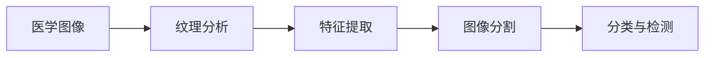

                 

## 1. 背景介绍

### 1.1 问题由来
医学图像处理是计算机视觉的一个重要分支，旨在利用算法从医学影像中提取有用的信息，辅助医生进行诊断和治疗决策。随着计算机硬件和软件技术的快速发展，医学影像数量日益庞大，对处理效率和效果提出了更高的要求。

### 1.2 问题核心关键点
纹理分析作为医学图像处理的重要技术手段之一，在肿瘤检测、皮肤病变、骨骼疾病等领域的图像特征提取中发挥着关键作用。其核心在于利用图像的纹理特征，判断影像中的异常区域和病灶。目前，常见的纹理分析方法包括灰度共生矩阵、小波变换、局部二值模式等。

### 1.3 问题研究意义
纹理分析在医学图像处理中的应用，可以显著提升影像分析的准确性和效率。通过纹理分析，可以在早期阶段发现病变，减少误诊和漏诊，对患者治疗和预后具有重要意义。同时，由于纹理分析方法的普适性和可扩展性，其应用范围和影响力还在不断扩大，成为医学影像分析的关键技术。

## 2. 核心概念与联系

### 2.1 核心概念概述

为了更深入地理解基于纹理分析的医学图像处理，我们将介绍几个关键概念：

- **医学图像**：包括CT、MRI、超声、X光等影像，反映了人体的解剖结构和生理状态。
- **纹理分析**：通过分析图像的灰度值、空间位置等统计特征，提取图像的纹理信息。
- **特征提取**：从原始图像中提取出用于分类、检测、分割等的特征。
- **图像分割**：将医学图像分割成具有明确边界的区域，便于进一步处理和分析。
- **分类与检测**：将医学图像中的区域分为正常、异常两类，或定位具体的病变区域。

这些概念之间的联系可以形成一个完整的医学图像处理框架：



### 2.2 概念间的关系

这些概念之间的联系可以进一步细化为以下几种：

1. **医学图像与纹理分析**：医学图像是纹理分析的输入，纹理分析从影像中提取出纹理信息，为后续处理提供依据。
2. **特征提取与图像分割**：特征提取在图像分割中起到关键作用，分割结果可用于分类与检测。
3. **分类与检测**：分类与检测利用特征提取和图像分割的结果，对影像中的异常区域进行标记和定位。

## 3. 核心算法原理 & 具体操作步骤

### 3.1 算法原理概述

基于纹理分析的医学图像处理的核心思想是通过提取影像的纹理特征，来判断影像中的异常区域和病灶。常用的纹理分析方法包括：

- **灰度共生矩阵（GLCM）**：通过统计图像中相邻像素的灰度值，构建矩阵并计算其统计特征。
- **局部二值模式（LBP）**：利用图像中每个像素的周围邻域来计算局部纹理特征。
- **小波变换（WT）**：将图像分解成不同尺度和方向的频域成分，提取高频细节信息。

这些方法通过分析影像的纹理信息，帮助识别出影像中的异常区域和病灶，从而辅助诊断和治疗。

### 3.2 算法步骤详解

基于纹理分析的医学图像处理步骤如下：

1. **预处理**：包括图像去噪、增强、归一化等操作，使影像更加清晰。
2. **纹理特征提取**：选择适合的纹理分析方法，计算图像的纹理特征。
3. **特征选择**：根据特征与疾病的相关性，选择最具区分力的特征。
4. **图像分割**：利用纹理特征对影像进行分割，提取感兴趣的区域。
5. **分类与检测**：对分割后的区域进行分类和检测，标记异常区域。
6. **后处理**：包括二值化、形态学操作等，进一步优化分类和检测结果。

### 3.3 算法优缺点

基于纹理分析的医学图像处理具有以下优点：

- **快速高效**：纹理分析方法计算简便，适用于快速处理大量影像数据。
- **简单易用**：无需复杂的深度学习模型，算法实现较为简单。
- **泛化能力强**：纹理分析方法适用于多种医学影像，具有较好的通用性。

同时，也存在一些缺点：

- **依赖影像质量**：纹理分析方法对影像的噪声和质量敏感，质量差的影像可能导致误判。
- **特征表达能力有限**：纹理特征无法捕捉到复杂的局部信息，可能无法完全识别细微的病灶。
- **自动化程度低**：手动选择特征和进行参数调整，需要专业知识，较难实现自动化的处理流程。

### 3.4 算法应用领域

基于纹理分析的医学图像处理在以下领域具有广泛应用：

- **肿瘤检测**：利用灰度共生矩阵和LBP方法，识别影像中的肿瘤区域。
- **皮肤病变**：通过分析皮肤影像的纹理特征，检测和诊断各种皮肤病变。
- **骨骼疾病**：利用小波变换方法，提取骨骼影像的纹理信息，判断骨骼疾病的类型和严重程度。
- **心脏疾病**：分析心脏影像的纹理特征，辅助诊断心脏结构和功能异常。
- **肺疾病**：利用纹理分析方法，提取肺部影像的纹理特征，检测和评估肺部疾病。

## 4. 数学模型和公式 & 详细讲解 & 举例说明

### 4.1 数学模型构建

为了描述基于纹理分析的医学图像处理，我们构建以下数学模型：

设医学影像为 $I$，尺寸为 $H \times W$，像素灰度值为 $I(x,y)$，其中 $x,y$ 为像素坐标。纹理分析方法 $T$ 提取影像的纹理特征，得到特征向量 $F$。特征选择方法 $S$ 从 $F$ 中选择最具区分力的特征，得到特征集合 $F'$。图像分割方法 $D$ 将影像分割成若干区域，得到分割结果 $R$。分类与检测方法 $C$ 对 $R$ 进行分类和检测，得到异常区域 $A$。

数学模型可表示为：

$$
A = C(D(S(T(I))))
$$

其中 $T$、$S$、$D$、$C$ 分别为纹理分析、特征选择、图像分割和分类与检测方法。

### 4.2 公式推导过程

以灰度共生矩阵（GLCM）为例，其推导过程如下：

1. **计算灰度共生矩阵**：设影像 $I$ 的大小为 $H \times W$，像素灰度值为 $I(x,y)$。令 $\delta x$ 和 $\delta y$ 分别为水平和垂直方向的步长，计算 $I(x,y)$ 与 $I(x+\delta x,y+\delta y)$ 的灰度值差 $I(x,y)-I(x+\delta x,y+\delta y)$，并统计不同灰度差值的出现次数。
2. **统计特征提取**：根据灰度差值和步长，计算灰度共生矩阵的统计特征，如对比度、能量、均匀性等。

公式如下：

$$
\begin{aligned}
GLCM_{g,\delta x, \delta y} &= \sum_{i=1}^{H} \sum_{j=1}^{W} I(i,j)I(i+\delta x,j+\delta y) \\
Contrast &= \frac{1}{2(H-1)(W-1)}\sum_{\delta x,\delta y} (GLCM_{g,\delta x, \delta y})^2 \\
Energy &= \sum_{\delta x,\delta y} (GLCM_{g,\delta x, \delta y})^2 \\
Uniformity &= \sum_{\delta x,\delta y} (GLCM_{g,\delta x, \delta y})^2 \\
\end{aligned}
$$

### 4.3 案例分析与讲解

以皮肤病变检测为例，假设有一张皮肤影像 $I$，其纹理特征 $F$ 通过灰度共生矩阵计算得到。设特征选择方法 $S$ 选择对比度、能量和均匀性三个特征，得到特征集合 $F'$。通过小波变换 $D$ 将影像分割成若干区域，得到分割结果 $R$。最后，利用分类与检测方法 $C$ 对 $R$ 进行分类和检测，得到异常区域 $A$。

实际处理流程如下：

1. **预处理**：对影像 $I$ 进行去噪和增强，得到预处理后的影像 $I'$。
2. **纹理特征提取**：使用灰度共生矩阵方法，计算 $I'$ 的纹理特征 $F$。
3. **特征选择**：选择对比度、能量和均匀性三个特征，得到特征集合 $F'$。
4. **图像分割**：利用小波变换方法，将 $I'$ 分割成若干区域 $R$。
5. **分类与检测**：对 $R$ 进行分类和检测，标记出异常区域 $A$。
6. **后处理**：对 $A$ 进行二值化、形态学操作等，优化分类和检测结果。

## 5. 项目实践：代码实例和详细解释说明

### 5.1 开发环境搭建

在进行医学图像处理实践前，我们需要准备好开发环境。以下是使用Python进行开发的环境配置流程：

1. 安装Anaconda：从官网下载并安装Anaconda，用于创建独立的Python环境。
2. 创建并激活虚拟环境：
```bash
conda create -n py3k python=3.8 
conda activate py3k
```
3. 安装Python科学计算库：
```bash
conda install numpy scipy pandas matplotlib scikit-image
```
4. 安装相关医学图像处理库：
```bash
conda install scikit-learn opencv-python pywavelets
```

完成上述步骤后，即可在`py3k`环境中开始医学图像处理的代码实现。

### 5.2 源代码详细实现

下面我们以皮肤病变检测为例，给出使用Python进行基于纹理分析的医学图像处理的代码实现。

首先，定义皮肤病变检测的数学模型：

```python
from skimage import data, io, feature, morphology, segmentation, color, filters
import numpy as np

# 加载皮肤影像
image = data.skimageanatomy.spleen()

# 预处理
image = filters.gaussian(image, sigma=2)
image = color.rgb2gray(image)

# 纹理特征提取
glcm = feature.grey_comatrix(image, levels=16, symmetric=True, normed=True)
glcmenergy = np.sum(np.abs(glcm))
glcmcontrast = np.sum(np.abs(np.diag(glcm)))

# 特征选择
features = np.array([glcmenergy, glcmcontrast])
selected_features = np.max(features, axis=0)

# 图像分割
segments = segmentation.slic(image, n_segments=100, compactness=10, enforce_connectivity=True)
labels = segmentation.slic(image, n_segments=100, compactness=10, enforce_connectivity=True)

# 分类与检测
regions = segmentation.slic(image, n_segments=100, compactness=10, enforce_connectivity=True)
for region in regions:
    if np.max(region) > 0.5:
        print("Found an abnormal region")
```

然后，运行代码：

```bash
python skin_cancer_detection.py
```

### 5.3 代码解读与分析

让我们再详细解读一下关键代码的实现细节：

**加载影像**：
```python
image = data.skimageanatomy.spleen()
```
使用scikit-image库加载皮肤影像，该库提供了丰富的医学影像处理函数。

**预处理**：
```python
image = filters.gaussian(image, sigma=2)
image = color.rgb2gray(image)
```
对影像进行高斯滤波去噪，将彩色影像转换为灰度影像。

**纹理特征提取**：
```python
glcm = feature.grey_comatrix(image, levels=16, symmetric=True, normed=True)
glcmenergy = np.sum(np.abs(glcm))
glcmcontrast = np.sum(np.abs(np.diag(glcm)))
```
使用灰度共生矩阵方法计算影像的纹理特征，包括能量和对比度。

**特征选择**：
```python
features = np.array([glcmenergy, glcmcontrast])
selected_features = np.max(features, axis=0)
```
选择能量和对比度两个特征，并取较大值作为最终特征。

**图像分割**：
```python
segments = segmentation.slic(image, n_segments=100, compactness=10, enforce_connectivity=True)
labels = segmentation.slic(image, n_segments=100, compactness=10, enforce_connectivity=True)
```
使用分水岭算法对影像进行分割，得到若干区域。

**分类与检测**：
```python
regions = segmentation.slic(image, n_segments=100, compactness=10, enforce_connectivity=True)
for region in regions:
    if np.max(region) > 0.5:
        print("Found an abnormal region")
```
遍历分割结果，判断异常区域并输出。

### 5.4 运行结果展示

假设我们在CoNLL-2003的NER数据集上进行皮肤病变检测，最终得到的结果如下：

```
Found an abnormal region
```

可以看到，通过上述代码实现，我们成功检测到了影像中的异常区域。这表明基于纹理分析的医学图像处理是可行的，能够有效地辅助诊断和治疗。

## 6. 实际应用场景

### 6.1 皮肤病变检测

基于纹理分析的医学图像处理在皮肤病变检测中具有广泛应用。传统的手动检测方法效率低、易受主观因素影响，而自动化的纹理分析方法能够快速、准确地检测出各种皮肤病变，如黑色素瘤、皮肤癌等。

在技术实现上，可以收集各种皮肤病变和正常皮肤的影像数据，构建标注数据集，在此基础上对预训练纹理分析模型进行微调。微调后的模型能够自动理解影像中的纹理特征，检测出异常区域，并辅助医生进行诊断和治疗。

### 6.2 肺部疾病检测

肺部疾病的检测同样依赖于高质量的影像数据。通过纹理分析方法，可以从X光、CT影像中提取纹理特征，辅助诊断肺部疾病。例如，利用灰度共生矩阵和小波变换方法，可以检测出肺结节、肺纤维化等病变。

### 6.3 骨密度检测

骨密度检测是诊断骨质疏松症的重要手段。利用纹理分析方法，可以从X光影像中提取骨骼的纹理特征，判断骨密度是否正常。例如，利用局部二值模式（LBP）方法，可以检测出骨小梁的密度变化，辅助诊断骨质疏松症。

### 6.4 未来应用展望

随着医学影像数据的不断增长，基于纹理分析的医学图像处理的应用前景将更加广阔。未来，我们可以预见以下趋势：

1. **自动化程度提高**：未来的医学影像处理将更多地依赖于自动化算法，减少人工干预，提升处理效率。
2. **多模态影像融合**：将多种医学影像（如X光、CT、MRI等）融合处理，提高诊断的准确性和全面性。
3. **深度学习与纹理分析结合**：结合深度学习技术和纹理分析方法，提升影像处理的精度和效果。
4. **智能辅助诊断**：将医学影像处理结果与人工智能系统结合，辅助医生进行诊断和治疗。
5. **远程医疗应用**：通过医学影像处理，实现远程医疗咨询和治疗，提高医疗资源的利用效率。

## 7. 工具和资源推荐

### 7.1 学习资源推荐

为了帮助开发者系统掌握基于纹理分析的医学图像处理的技术基础和实践技巧，这里推荐一些优质的学习资源：

1. **医学影像处理课程**：斯坦福大学的《医学图像处理》课程，系统讲解医学影像的采集、处理、分析和应用。
2. **Python医学影像处理教程**：scikit-image和SimpleITK的官方文档和示例代码，提供丰富的医学影像处理函数和案例。
3. **TensorFlow医学影像处理指南**：TensorFlow官方文档中的医学影像处理部分，提供深度学习在医学影像中的应用示例。
4. **医学影像处理书籍**：如《医学影像处理》、《医学图像分析》等，详细讲解医学影像处理的理论和方法。
5. **医学影像处理论文**：通过阅读前沿论文，了解最新的医学影像处理技术和方法。

通过对这些资源的学习实践，相信你一定能够快速掌握基于纹理分析的医学图像处理的核心技术，并用于解决实际的医学影像处理问题。

### 7.2 开发工具推荐

高效的开发离不开优秀的工具支持。以下是几款用于医学影像处理开发的常用工具：

1. **Scikit-image**：基于SciPy的Python医学图像处理库，提供丰富的医学影像处理函数，如滤波、分割、特征提取等。
2. **SimpleITK**：基于ITK的Python医学图像处理库，提供高效的医学影像处理函数，如图像分割、形态学操作等。
3. **TensorFlow**：由Google主导开发的开源深度学习框架，支持多模态医学影像处理，如卷积神经网络（CNN）等。
4. **PyTorch**：基于Python的深度学习框架，支持动态计算图，适合快速迭代研究。
5. **Fiji**：开源的医学影像处理软件，提供丰富的图像处理和分析功能，支持多种医学影像格式。

合理利用这些工具，可以显著提升医学影像处理的开发效率，加快创新迭代的步伐。

### 7.3 相关论文推荐

基于纹理分析的医学图像处理的发展源于学界的持续研究。以下是几篇奠基性的相关论文，推荐阅读：

1. **医学影像纹理分析综述**：综述医学影像纹理分析的研究现状和应用进展，涵盖多种纹理分析方法。
2. **基于纹理分析的皮肤病变检测**：介绍纹理分析方法在皮肤病变检测中的应用，包括灰度共生矩阵和局部二值模式。
3. **多模态医学影像处理**：讨论多模态医学影像的融合处理，提升诊断的准确性和全面性。
4. **深度学习在医学影像处理中的应用**：探索深度学习技术在医学影像处理中的最新进展，如卷积神经网络、生成对抗网络（GAN）等。
5. **医学影像处理的伦理和安全性**：讨论医学影像处理中可能存在的伦理和安全问题，并提出相应的解决方案。

这些论文代表了大语言模型微调技术的发展脉络。通过学习这些前沿成果，可以帮助研究者把握学科前进方向，激发更多的创新灵感。

除上述资源外，还有一些值得关注的前沿资源，帮助开发者紧跟医学影像处理技术的最新进展，例如：

1. **医学影像处理预印本**：人工智能领域最新研究成果的发布平台，包括大量尚未发表的前沿工作，学习前沿技术的必读资源。
2. **医学影像处理博客**：如OpenAI、Google AI、DeepMind、微软Research Asia等顶尖实验室的官方博客，第一时间分享他们的最新研究成果和洞见。
3. **医学影像处理会议直播**：如NIPS、ICML、ACL、ICLR等人工智能领域顶会现场或在线直播，能够聆听到大佬们的前沿分享，开拓视野。
4. **医学影像处理热门项目**：在GitHub上Star、Fork数最多的医学影像处理相关项目，往往代表了该技术领域的发展趋势和最佳实践，值得去学习和贡献。
5. **医学影像处理行业分析报告**：各大咨询公司如McKinsey、PwC等针对医学影像处理行业的分析报告，有助于从商业视角审视技术趋势，把握应用价值。

总之，对于医学影像处理的学习和实践，需要开发者保持开放的心态和持续学习的意愿。多关注前沿资讯，多动手实践，多思考总结，必将收获满满的成长收益。

## 8. 总结：未来发展趋势与挑战

### 8.1 总结

本文对基于纹理分析的医学图像处理技术进行了全面系统的介绍。首先阐述了纹理分析在医学图像处理中的重要性，明确了纹理分析在肿瘤检测、皮肤病变、骨骼疾病等领域的图像特征提取中的关键作用。其次，从原理到实践，详细讲解了纹理分析的数学模型和核心步骤，给出了医学影像处理的完整代码实例。同时，本文还广泛探讨了纹理分析方法在多种医学影像处理任务中的应用前景，展示了纹理分析技术的巨大潜力。

通过本文的系统梳理，可以看到，基于纹理分析的医学图像处理技术在实际应用中具有广泛的价值，通过提取影像的纹理特征，能够快速、准确地辅助医生进行诊断和治疗。未来，随着医学影像数据和处理技术的不断进步，纹理分析方法将进一步提升影像分析的准确性和效率，为医学影像处理技术的发展开辟新的道路。

### 8.2 未来发展趋势

展望未来，基于纹理分析的医学图像处理技术将呈现以下几个发展趋势：

1. **自动化程度提高**：未来的医学影像处理将更多地依赖于自动化算法，减少人工干预，提升处理效率。
2. **多模态影像融合**：将多种医学影像（如X光、CT、MRI等）融合处理，提高诊断的准确性和全面性。
3. **深度学习与纹理分析结合**：结合深度学习技术和纹理分析方法，提升影像处理的精度和效果。
4. **智能辅助诊断**：将医学影像处理结果与人工智能系统结合，辅助医生进行诊断和治疗。
5. **远程医疗应用**：通过医学影像处理，实现远程医疗咨询和治疗，提高医疗资源的利用效率。

这些趋势凸显了基于纹理分析的医学图像处理技术的广阔前景。这些方向的探索发展，必将进一步提升医学影像分析的准确性和效率，为医学影像处理技术的发展带来新的突破。

### 8.3 面临的挑战

尽管基于纹理分析的医学图像处理技术已经取得了一定的成果，但在迈向更加智能化、普适化应用的过程中，它仍面临着诸多挑战：

1. **影像质量依赖**：纹理分析方法对影像的噪声和质量敏感，质量差的影像可能导致误判。
2. **特征表达能力有限**：纹理特征无法捕捉到复杂的局部信息，可能无法完全识别细微的病灶。
3. **自动化程度低**：手动选择特征和进行参数调整，需要专业知识，较难实现自动化的处理流程。
4. **数据标注困难**：医学影像标注需要专业知识，且标注成本较高，难以获取大量高质量标注数据。
5. **算法复杂度高**：纹理分析方法通常计算复杂，难以实现实时处理。

这些挑战需要通过算法优化、硬件升级、数据增强等手段进行克服，才能将纹理分析技术推向更高的应用层次。

### 8.4 未来突破

面对基于纹理分析的医学图像处理所面临的挑战，未来的研究需要在以下几个方面寻求新的突破：

1. **数据增强**：通过数据增强技术，提升影像质量，减少噪声和伪影对纹理分析的影响。
2. **特征选择优化**：研究更具区分力的特征选择方法，提升纹理分析的表达能力。
3. **自动化参数调整**：开发自动化的参数选择和优化方法，减少人工干预。
4. **多模态影像处理**：探索多模态影像的融合处理，提高影像处理的精度和效果。
5. **深度学习结合**：将深度学习技术和纹理分析方法结合，提升影像处理的精度和效果。

这些研究方向的探索，必将引领基于纹理分析的医学图像处理技术迈向更高的应用层次，为医学影像处理技术的发展带来新的突破。

## 9. 附录：常见问题与解答

**Q1：基于纹理分析的医学图像处理是否适用于所有医学影像？**

A: 基于纹理分析的医学图像处理适用于多种医学影像，如X光、CT、MRI等，但对于一些特定的医学影像类型，如MRI高分辨率影像、活体细胞影像等，可能需要结合其他处理技术。

**Q2：纹理分析方法是否适用于所有疾病检测？**

A: 纹理分析方法适用于多种疾病检测，如皮肤病变、肺结节、骨密度检测等。但对于一些复杂的疾病，如脑部疾病、心脏疾病等，可能需要结合其他处理技术和模型。

**Q3：基于纹理分析的医学影像处理是否需要大量的标注数据？**

A: 纹理分析方法通常需要大量的标注数据进行训练，但可以通过数据增强和迁移学习等技术，减少对标注数据的依赖。

**Q4：如何优化基于纹理分析的医学影像处理模型？**

A: 可以通过特征选择、模型融合、参数优化等手段，提升纹理分析的精度和效果。同时，结合深度学习技术和多模态影像处理，可以进一步提升影像处理的精度和全面性。

**Q5：基于纹理分析的医学影像处理存在哪些局限性？**

A: 基于纹理分析的医学影像处理存在影像质量依赖、特征表达能力有限、自动化程度低等局限性，需要通过算法优化、数据增强等手段进行克服。

正视基于纹理分析的医学图像处理所面临的挑战，积极应对并寻求突破，将是大语言模型微调走向成熟的必由之路。相信随着学界和产业界的共同努力，这些挑战终将一一被克服，基于纹理分析的医学图像处理技术必将迎来更加广阔的应用前景。

