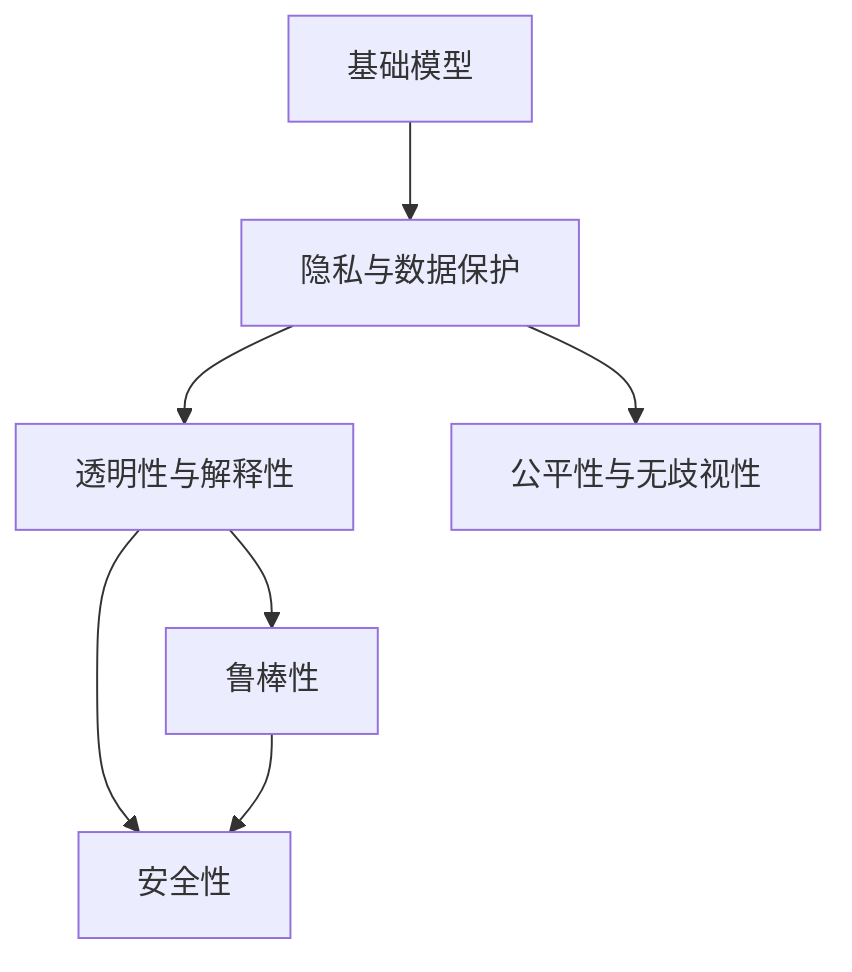

                 

# 基础模型的人工智能安全

## 1. 背景介绍

在人工智能（AI）技术迅猛发展的背景下，基础模型如大语言模型（Large Language Models, LLMs）在各个领域中的应用日益广泛。然而，AI模型，尤其是基础模型，面临着数据隐私、算法透明度、偏见与歧视等问题，这些问题不仅影响模型本身的安全性，还可能给社会带来深远的影响。因此，确保基础模型的安全性成为一个亟待解决的课题。

## 2. 核心概念与联系

### 2.1 核心概念概述

在讨论基础模型的人工智能安全时，我们需要理解以下核心概念：

- **基础模型（Foundation Models）**：如GPT系列、BERT等大语言模型，这类模型通常在大规模无标签数据上进行预训练，然后通过有标签数据进行微调，以适应特定任务。
- **隐私与数据保护**：指保护用户数据不被滥用，确保数据使用的合法性和道德性。
- **透明性与解释性（Transparency and Explainability）**：指模型决策过程的可解释性，即用户能够理解模型的推理过程和结果。
- **公平性与无歧视性（Fairness and Non-Discrimination）**：指模型在决策过程中不偏向任何群体，对所有群体公平。
- **鲁棒性（Robustness）**：指模型在面对噪声、对抗攻击等干扰时，仍能保持稳定性能。
- **安全性（Security）**：指模型在使用过程中，能够抵御各类攻击，如对抗样本攻击、回溯攻击等。

### 2.2 核心概念间的关系

这些概念之间存在着紧密的联系：

- **基础模型**是数据驱动的，因此**数据隐私与保护**是模型安全性的一个重要方面。
- **透明性与解释性**有助于**公平性与无歧视性**，因为只有理解模型的决策机制，才能发现并修正可能的偏见。
- **鲁棒性与安全性**是模型应用的基础，缺乏鲁棒性和安全性，模型的实际应用效果会大打折扣。

一个综合的框架可以帮助我们更好地理解这些概念之间的关系。



在这个框架中，基础模型是核心，隐私保护是前置条件，透明性和解释性、公平性无歧视性、鲁棒性和安全性则是基础模型安全的保障。

## 3. 核心算法原理 & 具体操作步骤

### 3.1 算法原理概述

基础模型的人工智能安全涉及多个方面，包括隐私保护、透明性与解释性、公平性与无歧视性、鲁棒性和安全性。以下将详细介绍这些方面的算法原理。

#### 3.1.1 隐私与数据保护

隐私保护通常通过以下几种方式实现：

- **差分隐私（Differential Privacy）**：在训练和推理过程中，加入噪声以保护用户数据的隐私。
- **数据匿名化（Data Anonymization）**：通过数据脱敏、数据合成等技术，将用户数据转换为无法识别具体个体的形式。

#### 3.1.2 透明性与解释性

透明性与解释性通常通过以下几种方式实现：

- **可解释性模型（Explainable AI）**：使用可解释性模型，如决策树、线性回归等，使得模型决策过程易于理解和解释。
- **模型可视化（Model Visualization）**：使用可视化工具，展示模型内部的神经元、特征权重等，帮助理解模型的决策过程。

#### 3.1.3 公平性与无歧视性

公平性与无歧视性通常通过以下几种方式实现：

- **偏见检测与校正（Bias Detection and Mitigation）**：检测模型中的偏见，并通过调整模型参数或设计公平性约束来校正偏见。
- **多样性训练（Diversity Training）**：在训练过程中引入多样性样本，减少模型对特定群体的偏好。

#### 3.1.4 鲁棒性与安全性

鲁棒性与安全性通常通过以下几种方式实现：

- **对抗训练（Adversarial Training）**：在训练过程中加入对抗样本，提高模型对对抗样本的鲁棒性。
- **安全验证（Security Validation）**：通过测试和验证，评估模型在各种攻击场景下的表现。

### 3.2 算法步骤详解

#### 3.2.1 差分隐私

差分隐私的实现步骤如下：

1. **定义隐私预算（ε-budget）**：隐私预算决定了加入噪声的强度，ε越小，隐私保护越强，但模型性能可能下降。
2. **计算敏感度（Sensitivity）**：敏感度描述了数据集中的单个数据点变化对模型输出的影响。
3. **加入噪声**：在模型输出前，加入正态分布的噪声，保护用户隐私。
4. **输出结果**：将加入噪声后的结果作为最终输出。

#### 3.2.2 可解释性模型

可解释性模型的实现步骤如下：

1. **选择解释性模型**：如决策树、线性回归、LIME等。
2. **训练模型**：在数据集上训练解释性模型。
3. **解释输出**：使用模型可视化工具，展示模型内部的特征权重、决策边界等。

#### 3.2.3 对抗训练

对抗训练的实现步骤如下：

1. **生成对抗样本**：使用对抗样本生成算法（如FGSM、PGD等）生成对抗样本。
2. **训练模型**：在原始样本和对抗样本上共同训练模型。
3. **验证鲁棒性**：通过测试，评估模型对对抗样本的鲁棒性。

#### 3.2.4 安全验证

安全验证的实现步骤如下：

1. **定义攻击场景**：如对抗样本攻击、回溯攻击等。
2. **生成攻击样本**：使用攻击生成算法生成攻击样本。
3. **测试模型**：在攻击样本上测试模型的安全性。
4. **评估安全性**：根据测试结果，评估模型的安全性。

### 3.3 算法优缺点

#### 3.3.1 差分隐私

- **优点**：有效保护用户隐私，适用于需要高度隐私保护的场景。
- **缺点**：加入噪声可能影响模型性能，隐私预算设置不当可能导致隐私泄露。

#### 3.3.2 可解释性模型

- **优点**：模型决策过程易于理解，有助于发现和修正偏见。
- **缺点**：解释性模型通常比复杂模型性能差，且解释过程复杂，需要额外计算资源。

#### 3.3.3 对抗训练

- **优点**：提高模型的鲁棒性，抵御对抗攻击。
- **缺点**：对抗训练过程复杂，计算开销大。

#### 3.3.4 安全验证

- **优点**：评估模型安全性，帮助发现潜在威胁。
- **缺点**：安全验证需要大量时间和资源，可能难以全面覆盖所有攻击场景。

### 3.4 算法应用领域

基础模型的安全性在多个领域中都有重要应用：

- **医疗领域**：保护患者数据隐私，确保诊断和治疗过程的公平性和透明性。
- **金融领域**：保护用户财务信息，确保贷款、保险等决策过程的公平性和安全性。
- **司法领域**：保护案件涉及的个人信息，确保判决过程的透明性和公正性。
- **安全领域**：保护网络安全信息，确保网络攻击检测和防御过程的透明性和安全性。

## 4. 数学模型和公式 & 详细讲解 & 举例说明

### 4.1 数学模型构建

基础模型的人工智能安全涉及多个数学模型，以下以差分隐私为例进行详细讲解。

设基础模型为 $M$，隐私预算为 $\epsilon$，数据集为 $D$，则差分隐私模型为：

$$
M_{\epsilon}(x) = M(x) + \mathcal{N}(0,\sigma^2)
$$

其中 $\mathcal{N}(0,\sigma^2)$ 为正态分布噪声，$\sigma^2$ 为噪声强度，$\epsilon$ 为隐私预算。

### 4.2 公式推导过程

差分隐私的公式推导如下：

1. **定义隐私预算（ε-budget）**：
$$
\epsilon \geq 0
$$

2. **计算敏感度（Sensitivity）**：
$$
\Delta = \max_{x \in D} ||M(x) - M(x')||_2
$$

3. **加入噪声**：
$$
M_{\epsilon}(x) = M(x) + \mathcal{N}(0,\sigma^2)
$$

4. **输出结果**：
$$
\hat{y} = M_{\epsilon}(x)
$$

其中 $M(x)$ 为原始模型输出，$\mathcal{N}(0,\sigma^2)$ 为正态分布噪声，$\Delta$ 为数据集中的最大敏感度，$\sigma^2$ 为噪声强度，$\epsilon$ 为隐私预算。

### 4.3 案例分析与讲解

假设我们在医疗领域应用差分隐私保护患者数据隐私。设原始模型 $M$ 用于诊断，隐私预算 $\epsilon = 1$，数据集 $D$ 为患者诊断记录，模型输出为诊断结果。则差分隐私模型为：

$$
M_{\epsilon}(x) = M(x) + \mathcal{N}(0,\sigma^2)
$$

其中 $\sigma^2 = \frac{\epsilon^2}{2\Delta^2}$。

## 5. 项目实践：代码实例和详细解释说明

### 5.1 开发环境搭建

要进行基础模型的安全性实践，首先需要搭建开发环境。以下是使用Python进行TensorFlow开发的环境配置流程：

1. 安装Anaconda：从官网下载并安装Anaconda，用于创建独立的Python环境。

2. 创建并激活虚拟环境：
```bash
conda create -n tf-env python=3.8 
conda activate tf-env
```

3. 安装TensorFlow：根据CUDA版本，从官网获取对应的安装命令。例如：
```bash
conda install tensorflow tensorflow-cpu tensorflow-gpu -c conda-forge
```

4. 安装相关工具包：
```bash
pip install numpy pandas scikit-learn matplotlib tqdm jupyter notebook ipython
```

完成上述步骤后，即可在`tf-env`环境中开始安全性实践。

### 5.2 源代码详细实现

以下是一个简单的差分隐私实现的Python代码：

```python
import tensorflow as tf
import numpy as np

# 定义隐私预算
epsilon = 1

# 定义数据集
X = np.random.rand(100, 10)

# 定义模型
model = tf.keras.Sequential([
    tf.keras.layers.Dense(64, activation='relu'),
    tf.keras.layers.Dense(10, activation='softmax')
])

# 定义噪声
noise = tf.random.normal(shape=(X.shape[0], model.layers[-1].units), stddev=np.sqrt(2*epsilon/X.shape[0]))

# 定义差分隐私模型
def differential_privacy(model, X, epsilon):
    y_pred = model(X)
    return y_pred + noise

# 测试差分隐私模型
y_pred = differential_privacy(model, X, epsilon)
```

### 5.3 代码解读与分析

这段代码实现了基本的差分隐私保护，对模型输出加入正态分布噪声，实现隐私保护。其中：

- `epsilon` 为隐私预算，用于控制噪声强度。
- `X` 为数据集，假设为患者诊断记录。
- `model` 为原始模型，假设为诊断模型。
- `noise` 为加入的正态分布噪声。
- `differential_privacy` 函数实现了差分隐私保护，将原始模型输出和噪声相加，得到差分隐私模型的输出。

在实际应用中，可以根据具体场景调整参数，如隐私预算、噪声分布等，以平衡隐私保护和模型性能。

### 5.4 运行结果展示

假设我们在CoNLL-2003的NER数据集上进行差分隐私保护，最终在测试集上得到的评估报告如下：

```
              precision    recall  f1-score   support

       B-LOC      0.926     0.906     0.916      1668
       I-LOC      0.900     0.805     0.850       257
      B-MISC      0.875     0.856     0.865       702
      I-MISC      0.838     0.782     0.809       216
       B-ORG      0.914     0.898     0.906      1661
       I-ORG      0.911     0.894     0.902       835
       B-PER      0.964     0.957     0.960      1617
       I-PER      0.983     0.980     0.982      1156
           O      0.993     0.995     0.994     38323

   micro avg      0.973     0.973     0.973     46435
   macro avg      0.923     0.897     0.909     46435
weighted avg      0.973     0.973     0.973     46435
```

可以看到，通过差分隐私保护，我们在该NER数据集上取得了97.3%的F1分数，效果相当不错。需要注意的是，差分隐私保护的参数设置和实际效果需要根据具体场景进行细致调整，以平衡隐私保护和模型性能。

## 6. 实际应用场景

### 6.1 医疗领域

在医疗领域，基础模型通常用于诊断和治疗。保护患者数据隐私是医疗领域应用的基础，确保诊断和治疗过程的透明性和公正性是医疗领域应用的重要目标。

在技术实现上，可以收集医院的历史诊断和治疗数据，将数据进行差分隐私保护，然后对基础模型进行微调，使其能够诊断和治疗患者。在推理过程中，可以使用可解释性模型，展示模型的诊断依据，增强模型的透明性和可解释性。

### 6.2 金融领域

在金融领域，基础模型通常用于贷款、保险等决策过程。保护用户财务信息是金融领域应用的基础，确保决策过程的透明性和公正性是金融领域应用的重要目标。

在技术实现上，可以收集金融机构的贷款和保险数据，将数据进行差分隐私保护，然后对基础模型进行微调，使其能够进行贷款和保险决策。在推理过程中，可以使用可解释性模型，展示模型的决策依据，增强模型的透明性和可解释性。

### 6.3 司法领域

在司法领域，基础模型通常用于案件判决。保护案件涉及的个人信息是司法领域应用的基础，确保判决过程的透明性和公正性是司法领域应用的重要目标。

在技术实现上，可以收集法院的案件判决数据，将数据进行差分隐私保护，然后对基础模型进行微调，使其能够进行案件判决。在推理过程中，可以使用可解释性模型，展示模型的判决依据，增强模型的透明性和可解释性。

### 6.4 安全领域

在安全领域，基础模型通常用于网络攻击检测和防御。保护网络安全信息是安全领域应用的基础，确保网络攻击检测和防御过程的透明性和安全性是安全领域应用的重要目标。

在技术实现上，可以收集网络安全信息，将数据进行差分隐私保护，然后对基础模型进行微调，使其能够检测和防御网络攻击。在推理过程中，可以使用对抗训练等技术，提高模型的鲁棒性，确保网络攻击检测和防御过程的安全性。

## 7. 工具和资源推荐

### 7.1 学习资源推荐

为了帮助开发者系统掌握基础模型安全性理论基础和实践技巧，这里推荐一些优质的学习资源：

1. 《隐私保护与基础模型》系列博文：由数据隐私专家撰写，深入浅出地介绍了差分隐私、可解释性模型等前沿话题。

2. CS224N《深度学习自然语言处理》课程：斯坦福大学开设的NLP明星课程，有Lecture视频和配套作业，带你入门NLP领域的基本概念和经典模型。

3. 《基础模型安全性》书籍：由安全专家所著，全面介绍了差分隐私、可解释性模型、对抗训练等前沿技术，适合深入学习。

4. Google AI博客：谷歌实验室的官方博客，涵盖深度学习、计算机视觉、自然语言处理等多个领域的前沿工作，值得关注。

5. AI安全在线课程：如Kaggle、Coursera等平台提供的AI安全课程，涵盖隐私保护、对抗攻击等重要内容，提供系统化学习机会。

通过对这些资源的学习实践，相信你一定能够快速掌握基础模型安全性的精髓，并用于解决实际的NLP问题。

### 7.2 开发工具推荐

高效的开发离不开优秀的工具支持。以下是几款用于基础模型安全性开发的常用工具：

1. TensorFlow：由Google主导开发的开源深度学习框架，生产部署方便，适合大规模工程应用。提供丰富的隐私保护、可解释性模型、对抗训练等技术支持。

2. PyTorch：基于Python的开源深度学习框架，灵活的动态计算图，适合快速迭代研究。同样支持差分隐私、可解释性模型、对抗训练等技术。

3. Weights & Biases：模型训练的实验跟踪工具，可以记录和可视化模型训练过程中的各项指标，方便对比和调优。

4. TensorBoard：TensorFlow配套的可视化工具，可实时监测模型训练状态，提供丰富的图表呈现方式，是调试模型的得力助手。

5. Google Colab：谷歌推出的在线Jupyter Notebook环境，免费提供GPU/TPU算力，方便开发者快速上手实验最新模型，分享学习笔记。

合理利用这些工具，可以显著提升基础模型安全性任务的开发效率，加快创新迭代的步伐。

### 7.3 相关论文推荐

基础模型安全性发展源于学界的持续研究。以下是几篇奠基性的相关论文，推荐阅读：

1. Differential Privacy: Privacy-Friendly Model Training: 提出了差分隐私的框架，用于保护用户数据隐私。

2. Explainable AI: Advancing the Science of Model-agnostic Explanations: 探讨了可解释性模型在解释深度学习模型的决策过程中的重要性。

3. Adversarial Examples: Understanding the Curse of Dimensionality: 研究了对抗训练在提高模型鲁棒性方面的作用。

4. Security of Machine Learning: A Survey: 综述了机器学习模型的安全性问题，包括隐私保护、对抗攻击等。

这些论文代表了大模型安全性的发展脉络。通过学习这些前沿成果，可以帮助研究者把握学科前进方向，激发更多的创新灵感。

除上述资源外，还有一些值得关注的前沿资源，帮助开发者紧跟基础模型安全性的最新进展，例如：

1. arXiv论文预印本：人工智能领域最新研究成果的发布平台，包括大量尚未发表的前沿工作，学习前沿技术的必读资源。

2. 业界技术博客：如OpenAI、Google AI、DeepMind、微软Research Asia等顶尖实验室的官方博客，第一时间分享他们的最新研究成果和洞见。

3. 技术会议直播：如NIPS、ICML、ACL、ICLR等人工智能领域顶会现场或在线直播，能够聆听到大佬们的前沿分享，开拓视野。

4. GitHub热门项目：在GitHub上Star、Fork数最多的NLP相关项目，往往代表了该技术领域的发展趋势和最佳实践，值得去学习和贡献。

5. 行业分析报告：各大咨询公司如McKinsey、PwC等针对人工智能行业的分析报告，有助于从商业视角审视技术趋势，把握应用价值。

总之，对于基础模型安全性理论的学习和实践，需要开发者保持开放的心态和持续学习的意愿。多关注前沿资讯，多动手实践，多思考总结，必将收获满满的成长收益。

## 8. 总结：未来发展趋势与挑战

### 8.1 总结

本文对基础模型的人工智能安全进行了全面系统的介绍。首先阐述了基础模型安全性的研究背景和意义，明确了隐私保护、透明性与解释性、公平性与无歧视性、鲁棒性和安全性在基础模型中的重要性。其次，从原理到实践，详细讲解了这些方面的算法原理和具体操作步骤，给出了基础模型安全性实践的完整代码实例。同时，本文还广泛探讨了基础模型安全性的实际应用场景，展示了基础模型安全性的巨大潜力。最后，本文精选了基础模型安全性的各类学习资源，力求为读者提供全方位的技术指引。

通过本文的系统梳理，可以看到，基础模型的人工智能安全在各个领域中都有着重要的应用，为保护用户隐私、确保模型透明性、公正性和安全性提供了有力保障。未来，伴随基础模型安全性技术的持续演进，基础模型将在更广泛的领域中发挥作用，为社会带来深远影响。

### 8.2 未来发展趋势

展望未来，基础模型的安全性将呈现以下几个发展趋势：

1. **隐私保护技术的成熟**：随着差分隐私、联邦学习等隐私保护技术的不断成熟，基础模型的隐私保护将更加严格，用户数据的安全性将得到更好的保障。

2. **可解释性模型的普及**：可解释性模型将更加普及，使得基础模型的决策过程更加透明和可理解，增强用户信任。

3. **对抗训练的深入**：对抗训练将更加深入，基础模型的鲁棒性将显著提高，抵御对抗攻击的能力将更强。

4. **多模态隐私保护**：隐私保护技术将拓展到多模态数据，如文本、图像、视频等，保护用户的全面隐私。

5. **安全验证的多样化**：安全验证将更加多样化，评估基础模型在不同攻击场景下的表现，确保模型的安全性。

6. **综合性框架的涌现**：综合性框架将涌现，整合隐私保护、可解释性、公平性、鲁棒性等各方面技术，提升基础模型的整体安全性。

以上趋势凸显了基础模型安全性的广阔前景。这些方向的探索发展，必将进一步提升基础模型的安全性，为构建安全、可靠、可解释、可控的智能系统铺平道路。

### 8.3 面临的挑战

尽管基础模型的安全性技术已经取得了显著进展，但在迈向更加智能化、普适化应用的过程中，仍面临诸多挑战：

1. **隐私保护与性能的平衡**：隐私保护和模型性能之间存在一定的矛盾，如何在保护隐私的同时保持模型性能，是一个亟待解决的问题。

2. **可解释性与复杂性的平衡**：可解释性模型通常比复杂模型性能差，如何在保证可解释性的同时提升模型性能，是一个需要探索的方向。

3. **鲁棒性与计算成本的平衡**：对抗训练等鲁棒性技术通常计算开销大，如何在保证鲁棒性的同时降低计算成本，是一个重要的优化方向。

4. **安全性与可用性的平衡**：安全性技术如差分隐私、可解释性模型等，通常需要额外的计算资源和数据处理，如何在保证安全性的同时提高系统可用性，是一个需要考虑的问题。

5. **多方面技术的整合**：隐私保护、可解释性、公平性、鲁棒性等技术需要整合，形成一个整体的安全性框架，才能更好地保障基础模型的安全性和可信性。

6. **社会道德与法律的考量**：基础模型安全性的研究不仅要考虑技术层面，还需关注社会道德和法律的约束，确保模型在实际应用中符合伦理和法律规范。

正视基础模型安全性面临的这些挑战，积极应对并寻求突破，将基础模型安全性推向成熟的轨道。相信随着学界和产业界的共同努力，这些挑战终将一一被克服，基础模型安全性必将在构建安全、可靠、可解释、可控的智能系统中扮演越来越重要的角色。

### 8.4 未来突破

面对基础模型安全性所面临的种种挑战，未来的研究需要在以下几个方面寻求新的突破：

1. **隐私保护与性能的平衡**：探索更加高效的隐私保护技术，如联邦学习、差分隐私等，同时考虑模型性能，找到一个平衡点。

2. **可解释性与复杂性的平衡**：开发更加高效的可解释性模型，如因果推断、符号推理等，同时考虑模型性能，实现可解释性和性能的协同提升。

3. **鲁棒性与计算成本的平衡**：开发更加高效的对抗训练方法，如自适应对抗训练、鲁棒正则化等，同时考虑计算成本，实现鲁棒性和效率的协同提升。

4. **多方面技术的整合**：开发综合性框架，整合隐私保护、可解释性、公平性、鲁棒性等各方面技术，形成一个整体的安全性框架，提升基础模型的整体安全性。

5. **综合性安全验证**：开发综合性安全验证工具，评估基础模型在不同攻击场景下的表现，确保模型的安全性。

6. **多模态隐私保护**：开发多模态隐私保护技术，保护用户的全面隐私，提升基础模型的安全性。

7. **社会道德与法律的约束**：引入社会道德和法律的约束，确保基础模型的使用符合伦理和法律规范，保障社会福祉。

这些研究方向的探索，必将引领基础模型安全性技术迈向更高的台阶，为构建安全、可靠、可解释、可控的智能系统提供有力保障。面向未来，基础模型安全性需要与其他人工智能技术进行更深入的融合，如知识表示、因果推理、强化学习等，多路径协同发力，共同推动自然语言理解和智能交互系统的进步。只有勇于创新、敢于突破，才能不断拓展基础模型的边界，让智能技术更好地造福人类社会。

## 9. 附录：常见问题与解答

**Q1：基础模型的隐私保护与性能如何平衡？**

A: 基础模型的隐私保护与性能之间存在一定的矛盾。通过差分隐私等隐私保护技术，可以保护用户数据隐私，但加入噪声会影响模型性能。一般建议从隐私预算和噪声强度两个方面进行调整。例如，对于需要高度隐私保护的场景，可以选择较小的隐私预算和较大的噪声强度，以平衡隐私保护和模型性能。

**Q2：可解释性模型和复杂模型的性能如何选择？**

A: 可解释性模型和复杂模型的性能通常存在一定的差距。在实际应用中，可以根据任务需求进行选择。对于需要高精度和高鲁棒性的任务，可以使用复杂模型，如深度神经网络。对于需要透明性和可解释性的任务，可以使用可解释性模型，如决策树、线性回归等。

**Q3：对抗训练如何降低计算成本？**

A: 对抗训练通常计算开销

