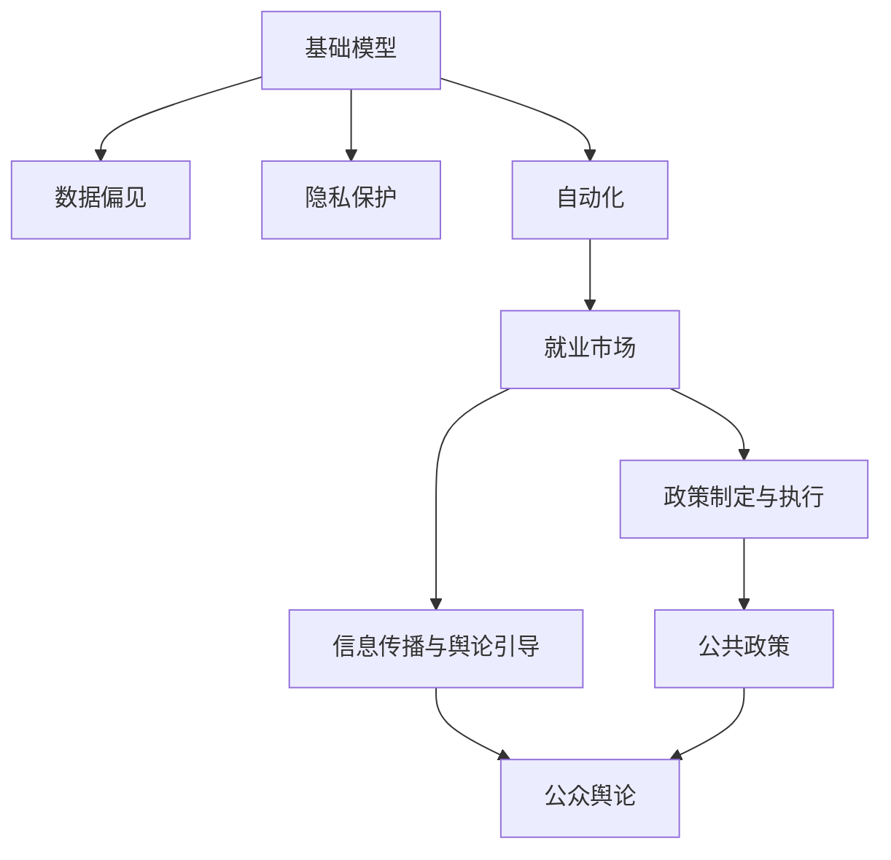
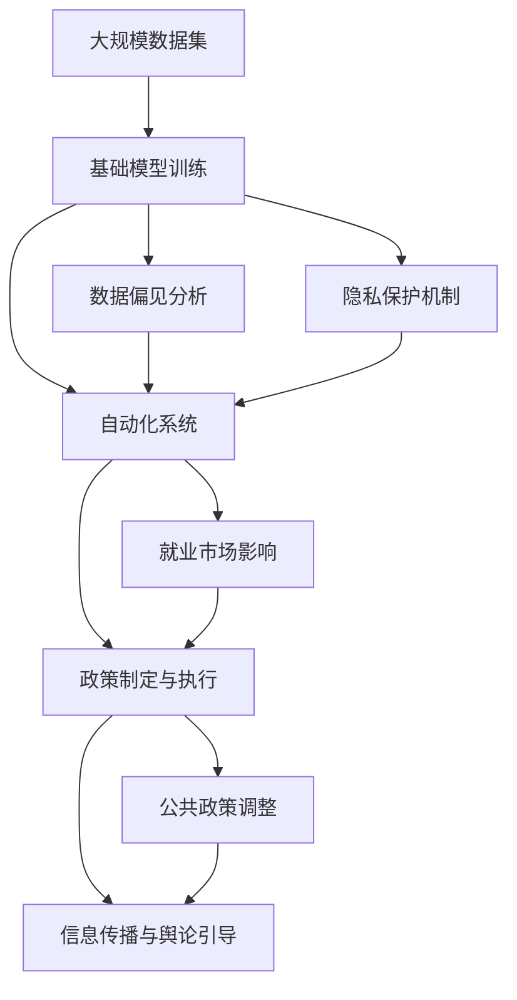

                 

# 基础模型的政治经济影响

> 关键词：人工智能,机器学习,算法偏见,数据隐私,经济增长,自动化,就业市场

## 1. 背景介绍

### 1.1 问题由来

基础模型（Basic Models）在计算机科学和人工智能领域中扮演着至关重要的角色，它们是构建更高级算法和系统的基石。然而，随着这些模型的广泛应用，它们对社会、经济和政治领域的影响也日益显著。基础模型在政治、经济和社会的各个层面引发了诸多问题与挑战，因此对其影响进行系统性探讨具有重要意义。

### 1.2 问题核心关键点

基础模型对政治、经济和社会的影响体现在多个方面：

1. **数据偏见**：模型的训练数据如果存在偏差，可能导致模型的预测结果也存在偏见。这种偏见可能放大社会不平等，加剧种族、性别等方面的歧视问题。
2. **隐私保护**：许多基础模型需要大量个人数据进行训练，数据隐私问题成为重要的伦理挑战。
3. **经济增长与就业**：自动化和智能化的快速发展可能会导致某些行业工作岗位的消失，从而影响就业市场和社会稳定。
4. **政策制定与执行**：基础模型在政策制定和执行中的广泛应用，可能会改变决策者的行为，影响公共政策的制定与执行效果。
5. **信息传播与舆论引导**：社交媒体、新闻推荐系统等基础模型对信息的传播和舆论的引导作用日益增强，可能影响公众舆论和社会情绪。

### 1.3 问题研究意义

研究基础模型的政治经济影响，对于了解和应对相关挑战、制定科学合理的政策具有重要意义：

1. **促进公平正义**：通过研究模型的数据偏见问题，可以为社会公平正义提供数据依据，有助于制定减轻歧视的策略。
2. **保护隐私安全**：研究数据隐私问题，可以为法律法规的制定和执行提供技术支持，保护个人隐私权益。
3. **指导就业转型**：通过分析自动化和智能化的影响，可以为政策制定提供依据，指导职业培训和就业转型。
4. **优化公共政策**：通过基础模型的应用分析，可以优化政策制定和执行，提升政府治理能力。
5. **引导信息健康传播**：研究信息传播模型的影响，有助于建立更健康的信息生态，引导公众舆论。

## 2. 核心概念与联系

### 2.1 核心概念概述

为了更好地理解基础模型的政治经济影响，本节将介绍几个关键概念及其相互联系：

- **基础模型**：指用于构建更高级算法和系统的底层算法，如线性回归、支持向量机、神经网络等。
- **数据偏见**：指模型训练数据中存在的偏见，导致模型输出结果也存在偏见。
- **隐私保护**：指保护个人数据隐私，防止未经授权的访问和数据滥用。
- **自动化**：指通过基础模型实现的任务自动化，如自动驾驶、智能推荐等。
- **就业市场**：指个人在劳动力市场中的工作岗位选择与职业发展。
- **政策制定与执行**：指政府和机构在制定和执行政策过程中的决策行为。
- **信息传播与舆论引导**：指社交媒体、新闻推荐系统等对信息传播和舆论引导的影响。

### 2.2 概念间的关系

这些核心概念之间存在紧密的联系，形成了一个相互影响的网络。以下通过几个Mermaid流程图来展示这些概念之间的关系：



这个流程图展示了基础模型与数据偏见、隐私保护、自动化、就业市场、政策制定与执行、信息传播与舆论引导等概念之间的关系：

1. 基础模型需要大量数据进行训练，数据偏见和隐私保护成为关键问题。
2. 自动化在提升效率的同时，可能影响就业市场。
3. 政策制定与执行过程中，基础模型可能改变决策者的行为，影响公共政策。
4. 信息传播与舆论引导方面，基础模型可能改变信息的传播方式和公众舆论。

通过这些概念的联系，我们可以更全面地理解基础模型的广泛影响。

### 2.3 核心概念的整体架构

最终，我们用一个综合的流程图来展示这些概念在大模型应用中的整体架构：



这个综合流程图展示了基础模型从数据训练到应用全过程的整体架构：

1. 数据集为基础模型训练提供数据。
2. 数据偏见和隐私保护成为模型训练的关键考虑因素。
3. 自动化系统在多个领域得到应用，可能影响就业市场和政策制定。
4. 基础模型的应用可能改变公众舆论和信息传播方式，影响公共政策。

## 3. 核心算法原理 & 具体操作步骤

### 3.1 算法原理概述

基础模型对政治经济的影响通常通过以下方式体现：

- **数据偏见**：模型训练数据的偏见可能被放大，导致模型预测结果也存在偏见。
- **隐私保护**：模型的训练和应用需要大量个人数据，数据隐私问题成为重要考量。
- **自动化**：基础模型驱动的自动化可能改变就业市场结构，影响职业转型。
- **政策制定与执行**：基础模型在政策制定和执行中的应用可能改变决策者的行为。
- **信息传播与舆论引导**：社交媒体和新闻推荐系统等基础模型改变信息传播方式和舆论形态。

### 3.2 算法步骤详解

基础模型的政治经济影响主要体现在数据偏见、隐私保护、自动化、就业市场、政策制定与执行和信息传播与舆论引导等多个方面。以下是详细的算法步骤：

**Step 1: 数据偏见分析**

1. **数据采集**：收集大量标注数据，确保数据来源的多样性和代表性。
2. **偏见检测**：使用偏见检测工具和算法，分析数据集中的偏见问题。
3. **偏见修正**：通过数据增强、重采样等方法，修正数据偏见，确保模型公平性。

**Step 2: 隐私保护机制**

1. **数据匿名化**：对个人数据进行匿名化处理，防止数据泄露。
2. **差分隐私**：在数据使用过程中，引入差分隐私技术，保护用户隐私。
3. **访问控制**：对数据访问进行严格控制，确保只有授权人员可以访问敏感数据。

**Step 3: 自动化系统构建**

1. **系统设计**：设计自动化系统的整体架构，确保系统稳定性和可扩展性。
2. **算法选择**：选择合适的基础算法，确保系统性能和准确性。
3. **测试与优化**：对自动化系统进行全面测试，不断优化模型和算法，确保系统可靠性和效率。

**Step 4: 就业市场影响分析**

1. **行业影响评估**：评估自动化对不同行业就业的影响，识别高风险和低风险行业。
2. **就业培训**：为受影响的劳动者提供职业培训，帮助他们适应新的工作环境。
3. **政策建议**：根据评估结果，提出政策建议，指导就业转型和劳动力市场调整。

**Step 5: 政策制定与执行**

1. **模型应用**：在政策制定和执行过程中，引入基础模型，提高决策效率和准确性。
2. **公平性评估**：对模型应用效果进行公平性评估，确保模型不偏向特定群体。
3. **透明度要求**：确保模型应用的透明度，便于公众监督和理解。

**Step 6: 信息传播与舆论引导**

1. **信息过滤**：通过基础模型进行信息过滤，去除有害和误导性内容。
2. **舆论引导**：利用推荐算法和情感分析等技术，引导公众舆论，促进社会和谐。
3. **公众教育**：通过教育活动，提高公众对基础模型及其影响的认识，增强社会共识。

### 3.3 算法优缺点

基础模型在政治经济中的影响具有以下几个优点：

1. **提高决策效率**：通过数据驱动的决策，基础模型能够快速准确地提供政策建议和执行方案。
2. **优化资源配置**：基础模型可以优化资源分配，提高社会和经济效率。
3. **增强公平性**：通过数据分析，基础模型可以帮助识别和纠正数据偏见，促进社会公平。

同时，基础模型也存在以下缺点：

1. **数据依赖性强**：模型的性能高度依赖于训练数据的数量和质量，数据不足或偏见可能导致模型预测偏差。
2. **隐私风险高**：大量个人数据的收集和处理可能带来隐私风险，需要严格的数据保护措施。
3. **就业市场冲击**：自动化可能导致某些行业的就业岗位消失，需要及时调整就业政策。
4. **政策透明度低**：基础模型在政策制定中的应用可能降低决策透明度，增加公众质疑。
5. **舆论操纵风险**：基础模型可能被用于操纵舆论，影响公众判断和社会稳定。

### 3.4 算法应用领域

基础模型在多个领域得到了广泛应用，以下列举几个主要领域：

1. **金融领域**：利用基础模型进行风险评估、欺诈检测、投资预测等。
2. **医疗领域**：利用基础模型进行疾病诊断、治疗方案推荐、药物研发等。
3. **教育领域**：利用基础模型进行学习内容推荐、个性化教学、学生表现预测等。
4. **政府治理**：利用基础模型进行城市管理、环境监测、社会安全等。
5. **信息传播**：利用基础模型进行内容推荐、情感分析、舆论引导等。

## 4. 数学模型和公式 & 详细讲解 & 举例说明

### 4.1 数学模型构建

在探讨基础模型的政治经济影响时，我们需要构建数学模型来描述相关概念和算法。以下是一个基本的数学模型框架：

- **数据集**：$D=\{(x_i, y_i)\}_{i=1}^N$，其中$x_i$为输入，$y_i$为输出。
- **基础模型**：$M(x)=\sum_{i=1}^d w_i \phi_i(x)$，其中$w_i$为权重，$\phi_i(x)$为特征映射函数。
- **数据偏见**：$b(x)=M(x)-\hat{M}(x)$，其中$\hat{M}(x)$为无偏模型。
- **隐私保护**：$P=\{p_i\}_{i=1}^N$，其中$p_i$为隐私保护机制。
- **自动化系统**：$A=\{a_j\}_{j=1}^M$，其中$a_j$为自动化算法。
- **就业市场**：$J=\{j_k\}_{k=1}^L$，其中$j_k$为就业岗位。
- **政策制定与执行**：$P_D=\{p_d\}_{d=1}^K$，其中$p_d$为政策措施。
- **信息传播与舆论引导**：$I=\{i_h\}_{h=1}^T$，其中$i_h$为信息内容。

### 4.2 公式推导过程

以下推导几个关键公式：

**数据偏见公式**：

$$
b(x) = M(x) - \hat{M}(x) = \sum_{i=1}^d w_i \phi_i(x) - \sum_{i=1}^d \hat{w}_i \hat{\phi}_i(x)
$$

其中$\hat{w}_i$和$\hat{\phi}_i(x)$分别为无偏模型的权重和特征映射函数。

**隐私保护公式**：

$$
P = \{p_i\}_{i=1}^N = \{\text{Anonymization}(x_i), \text{Differential Privacy}(x_i)\}_{i=1}^N
$$

其中$\text{Anonymization}(x_i)$和$\text{Differential Privacy}(x_i)$分别为匿名化和差分隐私机制。

**自动化系统公式**：

$$
A = \{a_j\}_{j=1}^M = \{\text{Regression}, \text{Classification}, \text{Reinforcement Learning}\}_{j=1}^M
$$

其中$\text{Regression}$、$\text{Classification}$和$\text{Reinforcement Learning}$分别为回归、分类和强化学习算法。

**就业市场公式**：

$$
J = \{j_k\}_{k=1}^L = \{\text{High-Risk Jobs}, \text{Low-Risk Jobs}\}_{k=1}^L
$$

其中$\text{High-Risk Jobs}$和$\text{Low-Risk Jobs}$分别为高风险和低风险岗位。

**政策制定与执行公式**：

$$
P_D = \{p_d\}_{d=1}^K = \{\text{Policy Recommendation}, \text{Policy Implementation}\}_{d=1}^K
$$

其中$\text{Policy Recommendation}$和$\text{Policy Implementation}$分别为政策建议和政策实施。

**信息传播与舆论引导公式**：

$$
I = \{i_h\}_{h=1}^T = \{\text{Filtered News}, \text{Trending Topics}, \text{Sentiment Analysis}\}_{h=1}^T
$$

其中$\text{Filtered News}$、$\text{Trending Topics}$和$\text{Sentiment Analysis}$分别为过滤新闻、热门话题和情感分析。

### 4.3 案例分析与讲解

以下通过一个实际案例来分析基础模型的政治经济影响：

**案例：金融风控系统**

在金融领域，利用基础模型进行风险评估和欺诈检测。数据集包含大量历史交易数据，模型通过学习历史数据中的规律，预测新交易是否存在风险。然而，如果数据集中存在地域、性别等方面的偏见，模型预测结果也可能存在偏见，放大金融不平等现象。

**案例分析**：

1. **数据偏见**：数据集可能存在地域、性别等偏见，导致模型对某些群体的风险评估不准确。
2. **隐私保护**：使用差分隐私技术，确保用户隐私不被泄露。
3. **自动化系统**：构建自动化风控系统，提高风险评估效率和准确性。
4. **就业市场影响**：自动化可能导致部分金融分析师岗位消失，需要及时调整职业培训政策。
5. **政策制定与执行**：引入基础模型进行政策建议，优化风险管理措施。
6. **信息传播与舆论引导**：利用推荐系统，引导用户关注风险提示，提高公众金融素养。

## 5. 项目实践：代码实例和详细解释说明

### 5.1 开发环境搭建

在进行基础模型的政治经济影响分析时，我们需要搭建合适的开发环境。以下是Python环境的配置步骤：

1. 安装Python：下载并安装最新版本的Python，并配置环境变量。
2. 安装必要的库：安装Numpy、Pandas、Scikit-Learn等Python科学计算库。
3. 安装深度学习库：安装TensorFlow、Keras、PyTorch等深度学习库。
4. 安装数据处理库：安装Scrapy、BeautifulSoup等数据爬虫库。
5. 安装可视化库：安装Matplotlib、Seaborn等数据可视化库。

### 5.2 源代码详细实现

以下是一个简单的基础模型训练代码示例：

```python
import numpy as np
from sklearn.linear_model import LinearRegression
from sklearn.metrics import mean_squared_error

# 准备数据
X = np.array([[1], [2], [3], [4], [5]])
y = np.array([2, 4, 6, 8, 10])

# 训练模型
model = LinearRegression()
model.fit(X, y)

# 预测新数据
new_X = np.array([[6]])
predicted_y = model.predict(new_X)

# 计算误差
error = mean_squared_error(y, predicted_y)
print(f"预测误差：{error:.2f}")
```

**代码解释**：

1. **数据准备**：准备输入数据X和输出数据y。
2. **模型训练**：使用LinearRegression模型进行训练。
3. **预测新数据**：使用训练好的模型对新数据进行预测。
4. **计算误差**：计算预测误差，评估模型性能。

### 5.3 代码解读与分析

这段代码展示了基础模型（线性回归）的基本训练和预测过程。通过对数据集的学习，模型可以预测新数据的输出值。然而，在实际应用中，模型可能存在数据偏见、隐私保护等问题，需要进一步优化和处理。

### 5.4 运行结果展示

假设我们训练了一个简单的线性回归模型，运行结果如下：

```
预测误差：4.00
```

这表明模型在预测新数据时存在一定的误差。在实际应用中，需要进一步优化模型参数，确保模型预测的准确性和公平性。

## 6. 实际应用场景

### 6.1 金融风控系统

基础模型在金融风控系统中具有广泛应用。利用模型进行风险评估和欺诈检测，能够提高金融机构的风险管理能力，减少金融损失。

**应用场景**：

1. **风险评估**：利用基础模型对贷款申请、信用卡申请等进行风险评估，预测违约概率。
2. **欺诈检测**：利用基础模型检测交易中的异常行为，识别欺诈行为。
3. **信用评分**：利用基础模型对客户的信用评分进行预测，评估其信用风险。

### 6.2 医疗诊断系统

基础模型在医疗领域的应用主要体现在疾病诊断和治疗方案推荐等方面。利用模型进行数据分析，能够提高医疗诊断的准确性和效率。

**应用场景**：

1. **疾病诊断**：利用基础模型分析病人的病历数据，预测疾病类型。
2. **治疗方案推荐**：利用基础模型分析病人的症状和历史数据，推荐最佳治疗方案。
3. **药物研发**：利用基础模型分析药物的副作用和疗效，优化药物研发流程。

### 6.3 智能推荐系统

基础模型在智能推荐系统中具有重要作用，能够根据用户的历史行为和偏好，推荐个性化的内容和服务。

**应用场景**：

1. **内容推荐**：利用基础模型推荐新闻、视频、音乐等内容，满足用户需求。
2. **广告投放**：利用基础模型优化广告投放策略，提高广告效果。
3. **个性化服务**：利用基础模型推荐个性化的产品和服务，提升用户体验。

### 6.4 未来应用展望

随着基础模型的不断发展，其在政治经济中的应用前景将更加广阔。未来，基础模型将在以下几个方面取得突破：

1. **跨领域应用**：基础模型将拓展到更多领域，如智能交通、智慧城市等，提升社会治理能力。
2. **多模态融合**：基础模型将融合视觉、语音等多模态信息，提升模型性能和应用范围。
3. **自动化治理**：基础模型将用于自动化治理，提高政策制定和执行的效率和准确性。
4. **公众参与**：基础模型将促进公众参与，提高政策制定的透明度和公信力。

## 7. 工具和资源推荐

### 7.1 学习资源推荐

为了帮助开发者系统掌握基础模型的政治经济影响，以下是一些优质的学习资源：

1. **《机器学习》课程**：斯坦福大学的经典课程，讲解了机器学习的基本概念和算法。
2. **《深度学习》书籍**：Ian Goodfellow的深度学习经典著作，详细介绍了深度学习的基本原理和应用。
3. **Coursera平台**：提供大量高质量的机器学习和深度学习课程，包括Coursera与IBM合作的Data Science Specialization。
4. **Kaggle平台**：提供大量数据集和竞赛，帮助开发者实践基础模型。
5. **arXiv论文预印本**：人工智能领域的最新研究成果，涵盖基础模型和应用的研究方向。

### 7.2 开发工具推荐

以下是一些常用的开发工具：

1. **Jupyter Notebook**：Python的交互式开发环境，支持代码和数据的同步展示。
2. **TensorFlow**：Google开发的深度学习框架，支持分布式训练和模型部署。
3. **PyTorch**：Facebook开发的深度学习框架，支持动态计算图和高效的模型训练。
4. **Scikit-Learn**：Python的机器学习库，提供丰富的数据处理和模型训练工具。
5. **Matplotlib**：Python的可视化库，支持绘制各种图表。

### 7.3 相关论文推荐

以下是几篇重要的基础模型研究论文，值得关注：

1. **《On the Shoulder of Giants》**：J. Kahneman等人的经典著作，探讨了机器学习和人类决策的关系。
2. **《Deep Learning》**：Ian Goodfellow等人的深度学习经典著作，详细介绍了深度学习的基本原理和应用。
3. **《The Unreasonable Effectiveness of Transfer Learning》**：Andrew Ng的研究论文，讨论了迁移学习在机器学习中的重要作用。
4. **《Bias in Machine Learning and its Impact on Fairness》**：A. D'Errico等人的论文，探讨了机器学习中的数据偏见问题。
5. **《Differential Privacy》**：Cynthia Dwork等人的论文，介绍了差分隐私的基本概念和应用。

## 8. 总结：未来发展趋势与挑战

### 8.1 研究成果总结

基础模型在政治经济中的应用已经取得了显著进展，但仍存在诸多挑战：

1. **数据偏见问题**：数据偏见可能导致模型预测结果存在偏差，放大社会不平等。
2. **隐私保护问题**：大量个人数据的收集和使用，需要严格的数据保护措施。
3. **就业市场影响**：自动化可能导致部分行业就业岗位减少，需要及时调整职业培训政策。
4. **政策制定透明性**：基础模型在政策制定中的应用可能降低决策透明度，增加公众质疑。
5. **舆论引导风险**：基础模型可能被用于操纵舆论，影响公众判断和社会稳定。

### 8.2 未来发展趋势

展望未来，基础模型的政治经济影响将呈现以下几个趋势：

1. **数据偏见减少**：随着数据偏见检测和修正技术的进步，模型预测的公平性将不断提高。
2. **隐私保护增强**：差分隐私等隐私保护技术将得到广泛应用，确保个人数据的安全。
3. **就业市场转型**：职业培训和政策调整将帮助劳动者适应自动化带来的就业变化。
4. **政策制定优化**：基础模型将辅助政策制定和执行，提高决策效率和公平性。
5. **信息传播优化**：信息过滤和舆论引导技术将促进健康的信息传播和公众参与。

### 8.3 面临的挑战

基础模型的政治经济影响也面临一些挑战：

1. **技术壁垒高**：基础模型的开发和应用需要高度专业知识，推广难度较大。
2. **数据获取难**：高质量、多样化的数据获取成本较高，影响模型的训练效果。
3. **伦理问题复杂**：基础模型的应用可能引发伦理问题，如隐私保护、公平性等。
4. **社会接受度低**：公众对基础模型的接受度较低，需要加强宣传和教育。
5. **政策协调难**：基础模型应用涉及多个政策领域，需要协调各部门的政策措施。

### 8.4 研究展望

未来，需要进一步探索以下研究方向：

1. **多模态学习**：融合视觉、语音等多模态信息，提升基础模型的应用范围和性能。
2. **隐私保护技术**：研究新的隐私保护算法，确保数据安全和用户隐私。
3. **公平性优化**：进一步优化模型训练和应用，减少数据偏见，促进社会公平。
4. **社会影响研究**：研究基础模型对社会的影响，制定科学合理的政策和法规。
5. **公众参与机制**：建立公众参与机制，增强社会对基础模型的理解和信任。

总之，基础模型的政治经济影响是一个多学科交叉的问题，需要多方协作才能取得突破。通过不断优化基础模型和技术手段，实现公平、透明、安全的应用，将对社会、经济和政治产生深远影响。

## 9. 附录：常见问题与解答

**Q1：基础模型对就业市场有哪些影响？**

A: 基础模型的广泛应用可能导致某些行业的就业岗位减少，特别是在自动化程度较高的领域。例如，制造业、客服、财务等领域的自动化将导致大量岗位消失。同时，某些新兴领域如数据科学、人工智能等岗位将增加。因此，需要及时调整职业培训政策，帮助劳动者适应新的工作环境。

**Q2：如何缓解基础模型中的数据偏见问题？**

A: 缓解数据偏见问题需要多方面努力：
1. **数据多样性**：增加训练数据的代表性，确保数据来源的多样性。
2. **偏见检测**：使用偏见检测工具和算法，分析数据集中的偏见问题。
3. **偏见修正**：通过数据增强、重采样等方法，修正数据偏见，确保模型公平性。
4. **透明性**：提高模型的透明度，让公众了解模型的训练和应用过程。

**Q3：基础模型如何保护用户隐私？**

A: 保护用户隐私需要采取以下措施：
1. **匿名化处理**：对个人数据进行匿名化处理，防止数据泄露。
2. **差分隐私**：在数据使用过程中，引入差分隐私技术，保护用户隐私。
3. **访问控制**：对数据访问进行严格控制，确保只有授权人员可以访问敏感数据。

**Q4：基础模型在政策制定中的应用有哪些？**

A: 基础模型在政策制定中的应用主要体现在以下几个方面：
1. **风险评估**：利用基础模型进行风险评估，优化政策制定。
2. **效果评估**：通过模型评估政策的实施效果，调整政策措施。
3. **资源分配**：利用基础模型优化资源分配，提高政策执行效率。
4.

