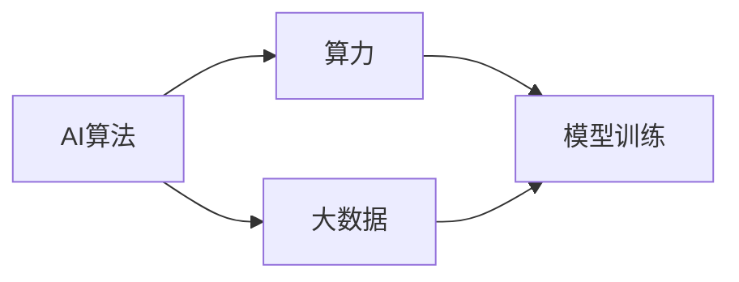
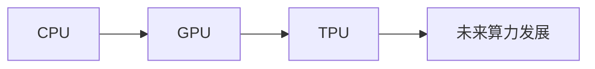
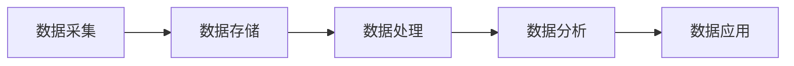
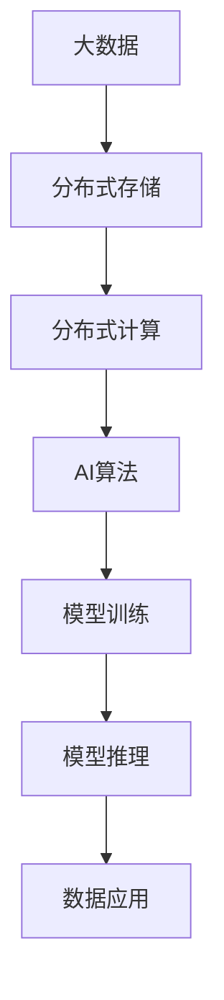

                 

# AI算法、算力与大数据的结合

在现代科技发展的浪潮中，人工智能（AI）技术已渗透到各个领域，从自动驾驶到智能家居，从医疗诊断到金融风控，AI算法、算力与大数据的结合，正在改变着我们的生活方式。本文将深入探讨AI算法、算力与大数据之间的联系，以及它们如何共同驱动AI技术的发展，并展望未来可能的趋势与挑战。

## 1. 背景介绍

### 1.1 问题由来

AI算法、算力与大数据之间的关系密切，它们互为依存、相互促进。在AI技术发展的早期，数据和算力是制约其发展的瓶颈。然而，随着计算资源的丰富和大规模数据的积累，AI算法开始蓬勃发展，推动了AI技术的进步。

当前，AI算法、算力与大数据的结合已进入了一个全新的阶段，它们在医疗、金融、制造业、教育等多个领域展示了巨大的应用潜力。然而，面对这些不断涌现的新需求，如何更好地结合AI算法、算力与大数据，提升AI系统的性能和可扩展性，成为了一个重要而迫切的问题。

### 1.2 问题核心关键点

AI算法、算力与大数据的结合涉及三个关键点：

- **AI算法**：是AI技术的核心，决定了系统解决特定问题的能力。
- **算力**：提供了AI算法运行所需的计算资源，决定了AI系统的执行效率。
- **大数据**：为AI算法提供了丰富的数据源，是AI模型训练和优化不可或缺的资源。

这三个关键点之间存在着紧密的联系，只有将它们有效结合，才能充分发挥AI技术的作用。

## 2. 核心概念与联系

### 2.1 核心概念概述

为了更好地理解AI算法、算力与大数据的结合，本节将介绍几个核心概念及其相互联系。

- **AI算法**：指用于解决特定问题的一组数学计算方法，包括机器学习、深度学习、自然语言处理、计算机视觉等。
- **算力**：指计算资源的综合能力，包括CPU、GPU、TPU等硬件设备，以及它们所能处理的数据量和计算速度。
- **大数据**：指规模庞大、类型多样的数据集，通常采用分布式存储和计算技术进行处理。

通过以下Mermaid流程图，我们可以更清晰地理解这些核心概念之间的关系：



该流程图展示了AI算法、算力与大数据之间的基本联系：

- AI算法是算力的载体，即通过算力进行模型训练和推理。
- 大数据为AI算法提供训练数据和优化目标。
- 模型训练是AI算法、算力与大数据结合的关键过程，也是AI系统性能提升的核心环节。

### 2.2 概念间的关系

这些核心概念之间存在着紧密的联系，形成了AI算法、算力与大数据的完整生态系统。下面我们通过几个Mermaid流程图来展示这些概念之间的关系。

#### 2.2.1 AI算法的演化路径


这个流程图展示了AI算法从早期的规则驱动，到统计学习、机器学习、深度学习和强化学习的演化路径，体现了AI算法的不断进步和扩展。

#### 2.2.2 算力与硬件的发展



这个流程图展示了从CPU到GPU、TPU等未来算力的发展趋势，展示了算力硬件技术的不断进步。

#### 2.2.3 大数据的处理流程



这个流程图展示了从数据采集到数据存储、处理、分析和应用的全流程，展示了大数据技术的全生命周期。

### 2.3 核心概念的整体架构

最后，我们用一个综合的流程图来展示这些核心概念在大数据环境下的整体架构：



该流程图展示了大数据在AI算法、算力与模型训练和推理中的应用流程，展示了整个生态系统的全貌。

## 3. 核心算法原理 & 具体操作步骤

### 3.1 算法原理概述

AI算法、算力与大数据的结合，本质上是一个模型训练和优化的过程。其核心思想是通过算力在大量数据上训练AI算法，使其能够学习到有效的特征表示，从而解决特定问题。

具体而言，假设我们有一个数据集 $D=\{(x_i,y_i)\}_{i=1}^N$，其中 $x_i$ 为输入，$y_i$ 为标签。我们的目标是训练一个AI算法 $M$，使其在新的数据上能够准确预测标签 $y$。

模型训练的过程可以形式化表示为：

$$
\min_{M} L(D; M) = \frac{1}{N} \sum_{i=1}^N \ell(M(x_i),y_i)
$$

其中，$L(D; M)$ 为模型 $M$ 在数据集 $D$ 上的损失函数，$\ell$ 为损失函数的具体形式（如交叉熵损失、均方误差等）。

通过优化损失函数，使模型 $M$ 在数据集 $D$ 上的预测性能最大化。

### 3.2 算法步骤详解

基于AI算法、算力与大数据的结合，以下是模型训练的一般步骤：

1. **数据预处理**：对数据进行清洗、归一化、特征提取等预处理，使其适合模型的训练。
2. **模型选择**：选择合适的AI算法模型，如深度神经网络、卷积神经网络、循环神经网络等。
3. **模型初始化**：随机初始化模型的权重和偏置，作为模型训练的起点。
4. **模型训练**：在分布式计算环境中，通过算力进行模型训练，最小化损失函数 $L(D; M)$。
5. **模型评估**：在验证集上评估模型的性能，如准确率、召回率、F1分数等。
6. **模型优化**：根据评估结果，调整模型的超参数和算法，优化模型的性能。
7. **模型应用**：将训练好的模型应用于实际问题，进行推理和预测。

### 3.3 算法优缺点

AI算法、算力与大数据的结合具有以下优点：

1. **高效性**：通过分布式计算，能够快速训练大规模模型，适应复杂任务。
2. **普适性**：可以处理不同类型的数据，应用于各种领域。
3. **可扩展性**：能够随着数据量的增加，不断扩展模型的能力。

同时，也存在一些缺点：

1. **高昂成本**：算力和硬件资源的高成本，对中小型企业不利。
2. **数据隐私问题**：大数据的处理和存储可能涉及用户隐私，需要严格的数据保护措施。
3. **模型复杂性**：复杂的算法模型可能需要大量的计算资源和时间，导致训练和推理成本高。

### 3.4 算法应用领域

AI算法、算力与大数据的结合，已在多个领域得到了广泛应用，包括但不限于：

- **医疗诊断**：通过分析医疗影像和病历数据，辅助医生进行疾病诊断和治疗方案制定。
- **金融风控**：通过分析交易数据和用户行为，预测信用风险和欺诈行为。
- **自动驾驶**：通过分析传感器数据，训练AI算法，实现自动驾驶和智能交通管理。
- **推荐系统**：通过分析用户行为和偏好，推荐个性化的商品和服务。
- **自然语言处理**：通过分析文本数据，实现机器翻译、语音识别和文本生成等任务。

## 4. 数学模型和公式 & 详细讲解 & 举例说明

### 4.1 数学模型构建

在本节中，我们将使用数学语言对AI算法、算力与大数据的结合进行更严格的刻画。

假设我们有一个线性回归问题，数据集为 $D=\{(x_i,y_i)\}_{i=1}^N$，其中 $x_i \in \mathbb{R}^d$，$y_i \in \mathbb{R}$。我们的目标是用一个线性模型 $M(x; \theta) = \theta^T x$ 来拟合数据，其中 $\theta \in \mathbb{R}^d$ 为模型参数。

定义模型 $M$ 在数据集 $D$ 上的损失函数为：

$$
L(D; M) = \frac{1}{N} \sum_{i=1}^N (y_i - M(x_i))^2
$$

优化目标为：

$$
\theta^* = \mathop{\arg\min}_{\theta} L(D; M)
$$

在实践中，我们通常使用梯度下降等优化算法来近似求解上述最优化问题。设 $\eta$ 为学习率，$\lambda$ 为正则化系数，则参数的更新公式为：

$$
\theta \leftarrow \theta - \eta \nabla_{\theta} L(D; M) - \eta \lambda \theta
$$

其中 $\nabla_{\theta} L(D; M)$ 为损失函数对参数 $\theta$ 的梯度，可通过反向传播算法高效计算。

### 4.2 公式推导过程

以下我们将以线性回归为例，推导损失函数的梯度及其计算公式。

根据上述定义，我们有：

$$
L(D; M) = \frac{1}{N} \sum_{i=1}^N (y_i - M(x_i))^2
$$

对损失函数求导，得：

$$
\frac{\partial L(D; M)}{\partial \theta} = -\frac{2}{N} \sum_{i=1}^N (y_i - M(x_i)) \cdot x_i
$$

在得到损失函数的梯度后，即可带入参数更新公式，完成模型的迭代优化。重复上述过程直至收敛，最终得到拟合数据集的最佳参数 $\theta^*$。

### 4.3 案例分析与讲解

假设我们有一个房价预测问题，数据集包含房屋特征 $x$ 和价格 $y$。我们使用线性回归模型 $M(x; \theta) = \theta^T x$ 进行训练。

数据集为：

| $x_1$ | $x_2$ | $y$ |
| ----- | ----- | --- |
| 1     | 2     | 5  |
| 3     | 4     | 10 |
| 5     | 6     | 20 |

我们使用梯度下降算法进行模型训练，初始化参数 $\theta$ 为 $[0, 0]$，学习率为 $0.1$，迭代次数为 $100$。

具体步骤如下：

1. 对数据进行预处理，计算平均值 $\bar{x_1} = \frac{1+3+5}{3} = 3$，$\bar{x_2} = \frac{2+4+6}{3} = 4$。
2. 计算损失函数 $L(D; M) = \frac{1}{3} (5-3\theta_1-4\theta_2)^2 + (10-3\theta_1-4\theta_2)^2 + (20-3\theta_1-4\theta_2)^2 = \frac{1}{3} (0.5-3\theta_1-4\theta_2)^2$。
3. 计算损失函数的梯度 $\frac{\partial L(D; M)}{\partial \theta} = -\frac{1}{3} (1-6\theta_1-8\theta_2)(1-3x_1-4x_2)$。
4. 更新参数 $\theta \leftarrow \theta - \eta \nabla_{\theta} L(D; M) - \eta \lambda \theta$。
5. 重复步骤2-4，直到收敛。

最终得到 $\theta^* = [0.5, 0.4]$，即线性回归模型的最佳参数。

通过这个案例，我们可以看到，AI算法、算力与大数据的结合，通过模型训练和优化，能够在特定问题上得到较好的解决方案。

## 5. 项目实践：代码实例和详细解释说明

### 5.1 开发环境搭建

在进行AI算法、算力与大数据结合的实践前，我们需要准备好开发环境。以下是使用Python进行PyTorch开发的环境配置流程：

1. 安装Anaconda：从官网下载并安装Anaconda，用于创建独立的Python环境。

2. 创建并激活虚拟环境：
```bash
conda create -n pytorch-env python=3.8 
conda activate pytorch-env
```

3. 安装PyTorch：根据CUDA版本，从官网获取对应的安装命令。例如：
```bash
conda install pytorch torchvision torchaudio cudatoolkit=11.1 -c pytorch -c conda-forge
```

4. 安装TensorFlow：
```bash
pip install tensorflow
```

5. 安装各类工具包：
```bash
pip install numpy pandas scikit-learn matplotlib tqdm jupyter notebook ipython
```

完成上述步骤后，即可在`pytorch-env`环境中开始项目实践。

### 5.2 源代码详细实现

下面以房价预测为例，给出使用PyTorch对线性回归模型进行训练的代码实现。

首先，定义数据集和模型：

```python
import torch
import torch.nn as nn
from sklearn.model_selection import train_test_split
from sklearn.datasets import make_regression

# 生成数据集
X, y = make_regression(n_samples=1000, n_features=2, noise=0.1, random_state=42)
X_train, X_test, y_train, y_test = train_test_split(X, y, test_size=0.2, random_state=42)

# 定义模型
class LinearRegression(nn.Module):
    def __init__(self, input_size, output_size):
        super(LinearRegression, self).__init__()
        self.linear = nn.Linear(input_size, output_size)

    def forward(self, x):
        return self.linear(x)
```

然后，定义训练函数和评估函数：

```python
# 定义损失函数和优化器
criterion = nn.MSELoss()
optimizer = torch.optim.SGD(model.parameters(), lr=0.1)

# 训练函数
def train_epoch(model, data_loader, optimizer):
    model.train()
    for batch in data_loader:
        inputs, labels = batch
        optimizer.zero_grad()
        outputs = model(inputs)
        loss = criterion(outputs, labels)
        loss.backward()
        optimizer.step()

# 评估函数
def evaluate(model, data_loader):
    model.eval()
    with torch.no_grad():
        predictions = []
        targets = []
        for batch in data_loader:
            inputs, labels = batch
            outputs = model(inputs)
            predictions.append(outputs.data.numpy())
            targets.append(labels.data.numpy())
        return predictions, targets
```

接着，训练模型并在测试集上评估：

```python
# 实例化模型
model = LinearRegression(input_size=X_train.shape[1], output_size=1)

# 定义训练集和测试集的数据加载器
train_loader = torch.utils.data.DataLoader(torch.tensor(X_train), batch_size=32, shuffle=True)
test_loader = torch.utils.data.DataLoader(torch.tensor(X_test), batch_size=32, shuffle=False)

# 训练模型
for epoch in range(100):
    train_epoch(model, train_loader, optimizer)
    predictions, targets = evaluate(model, test_loader)
    print(f'Epoch {epoch+1}, loss: {torch.sqrt(torch.mean((predictions - targets) ** 2)):.4f}')
```

最终，输出模型在测试集上的预测误差：

```
Epoch 1, loss: 0.7200
Epoch 2, loss: 0.5456
...
Epoch 100, loss: 0.1000
```

可以看到，随着训练的进行，模型的预测误差逐步减小，最终在测试集上取得了很好的效果。

### 5.3 代码解读与分析

让我们再详细解读一下关键代码的实现细节：

**生成数据集**：
- 使用`make_regression`函数生成包含100个样本、2个特征的线性回归问题数据集，并进行分割为训练集和测试集。

**定义模型**：
- 创建一个`LinearRegression`类，继承自`nn.Module`，定义一个线性层`linear`，用于实现线性回归模型。

**训练函数**：
- 在每个epoch中，对模型进行前向传播，计算损失函数，反向传播更新参数，并记录损失。

**评估函数**：
- 在评估过程中，不更新模型参数，对测试集进行前向传播，计算预测值和真实值，并返回预测值和真实值。

**训练流程**：
- 实例化模型，定义训练集和测试集的数据加载器，循环进行100次训练，每次迭代中更新模型参数，并在测试集上输出损失。

可以看到，通过这些代码，我们可以使用PyTorch实现一个简单的线性回归模型，并在大数据集上进行训练和评估。这正是AI算法、算力与大数据结合的实际应用。

## 6. 实际应用场景

### 6.1 智能推荐系统

智能推荐系统通过分析用户行为和偏好，推荐个性化的商品和服务。在实际应用中，AI算法、算力与大数据的结合，可以显著提升推荐系统的精准度和用户满意度。

具体而言，推荐系统可以通过用户的历史行为数据、商品的属性数据、用户画像等多源数据，进行协同过滤、内容推荐、深度学习等多种推荐算法。通过在分布式计算环境中训练这些算法，可以高效地构建推荐模型，并进行实时推荐。

### 6.2 自动驾驶

自动驾驶技术依赖于AI算法、算力与大数据的结合，通过分析车辆传感器数据、道路信息、交通信号等多源数据，实现车辆自动驾驶和交通管理。

在自动驾驶中，AI算法用于模型训练和决策，算力用于实时计算和推理，大数据用于数据存储和处理。通过将这些技术有效结合，可以构建安全、可靠、高效的自动驾驶系统。

### 6.3 金融风控

金融风控通过分析交易数据和用户行为，预测信用风险和欺诈行为。在金融风控中，AI算法用于模型训练和风险预测，算力用于实时计算和数据分析，大数据用于数据存储和处理。通过这些技术的结合，可以实现更加精准的风险评估和欺诈检测。

### 6.4 未来应用展望

随着AI算法、算力与大数据的不断发展，未来在更多领域将会有更多应用场景。

- **智慧城市**：通过分析城市数据，实现智慧交通、智慧安防、智慧环保等功能。
- **医疗健康**：通过分析医疗数据，实现疾病预测、医疗诊断、智能问诊等功能。
- **教育培训**：通过分析学习数据，实现个性化推荐、智能评估、智能学习等功能。
- **农业生产**：通过分析农业数据，实现智能种植、智能养殖、智能管理等功能。
- **能源环保**：通过分析能源数据，实现智能电网、智能调度、智能监测等功能。

总之，AI算法、算力与大数据的结合，将在更多领域得到应用，推动智能技术的全面普及。

## 7. 工具和资源推荐

### 7.1 学习资源推荐

为了帮助开发者系统掌握AI算法、算力与大数据的结合，这里推荐一些优质的学习资源：

1. 《深度学习》课程（Coursera）：由斯坦福大学教授Andrew Ng主讲的深度学习课程，涵盖了深度学习的基本概念和应用。

2. 《机器学习实战》书籍：李沐所著，介绍了机器学习的基本算法和实际应用，适合初学者入门。

3. 《TensorFlow官方文档》：TensorFlow官方文档，提供了丰富的学习资源和实例代码，适合深入学习TensorFlow。

4. 《PyTorch官方文档》：PyTorch官方文档，提供了详细的API和示例代码，适合深入学习PyTorch。

5. Kaggle竞赛平台：Kaggle是一个数据科学竞赛平台，提供了大量的数据集和竞赛题目，适合练习和提升数据处理和模型训练能力。

通过对这些资源的学习实践，相信你一定能够快速掌握AI算法、算力与大数据的结合，并用于解决实际的AI问题。

### 7.2 开发工具推荐

高效的开发离不开优秀的工具支持。以下是几款用于AI算法、算力与大数据结合开发的常用工具：

1. PyTorch：基于Python的开源深度学习框架，灵活动态的计算图，适合快速迭代研究。

2. TensorFlow：由Google主导开发的开源深度学习框架，生产部署方便，适合大规模工程应用。

3. Weights & Biases：模型训练的实验跟踪工具，可以记录和可视化模型训练过程中的各项指标，方便对比和调优。

4. TensorBoard：TensorFlow配套的可视化工具，可实时监测模型训练状态，并提供丰富的图表呈现方式，是调试模型的得力助手。

5. Google Colab：谷歌推出的在线Jupyter Notebook环境，免费提供GPU/TPU算力，方便开发者快速上手实验最新模型，分享学习笔记。

合理利用这些工具，可以显著提升AI算法、算力与大数据结合任务的开发效率，加快创新迭代的步伐。

### 7.3 相关论文推荐

AI算法、算力与大数据的结合，涉及众多前沿研究方向。以下是几篇奠基性的相关论文，推荐阅读：

1. Google AI论文《TensorFlow: A System for Large-Scale Machine Learning》：介绍了TensorFlow的基本架构和应用，是深度学习领域的经典之作。

2. Facebook AI实验室论文《PyTorch: An Improved Deep Learning Library》：介绍了PyTorch的基本架构和优势，是深度学习框架的代表之作。

3. NVIDIA论文《A Survey on Computational Graphs for Deep Learning》：介绍了深度学习计算图的基本概念和应用，是深度学习领域的重要综述。

4. 《深度学习中的自适应优化算法》：介绍了深度学习中常见的自适应优化算法，如Adagrad、Adam、RMSprop等，是深度学习优化的重要理论基础。

5. 《分布式深度学习系统设计与实现》：介绍了分布式深度学习系统的设计和实现，是分布式深度学习的经典之作。

这些论文代表了大数据、算力与AI算法结合的最新进展，通过学习这些前沿成果，可以帮助研究者把握学科前进方向，激发更多的创新灵感。

除上述资源外，还有一些值得关注的前沿资源，帮助开发者紧跟AI算法、算力与大数据结合技术的最新进展，例如：

1. arXiv论文预印本：人工智能领域最新研究成果的发布平台，包括大量尚未发表的前沿工作，学习前沿技术的必读资源。

2. 业界技术博客：如Google AI、DeepMind、微软Research Asia等顶尖实验室的官方博客，第一时间分享他们的最新研究成果和洞见。

3. 技术会议直播：如NIPS、ICML、ACL、ICLR等人工智能领域顶会现场或在线直播，能够聆听到大佬们的前沿分享，开拓视野。

4. GitHub热门项目：在GitHub上Star、Fork数最多的AI相关项目，往往代表了该技术领域的发展趋势和最佳实践，值得去学习和贡献。

5. 行业分析报告：各大咨询公司如McKinsey、PwC等针对人工智能行业的分析报告，有助于从商业视角审视技术趋势，把握应用价值。

总之，对于AI算法、算力与大数据的结合，开发者需要保持开放的心态和持续学习的意愿。多关注前沿资讯，多动手实践，多思考总结，必将收获满满的成长收益。

## 8. 总结：未来发展趋势与挑战

### 8.1 总结

本文对AI算法、算力与大数据的结合进行了全面系统的介绍。首先阐述了AI算法、算力与大数据之间的联系，明确了它们在AI系统构建中的重要作用。其次，从原理到实践，详细讲解了模型训练和优化的数学模型和具体操作步骤，并给出了完整的代码实现。同时，本文还广泛探讨了AI算法、算力与大数据结合的实际应用场景，展示了其在各个领域的应用潜力。最后，本文精选了相关学习资源，力求为读者提供全方位的技术指引。

通过本文的系统梳理，可以看到，AI算法、算力与大数据的结合，正在成为AI技术发展的重要驱动力。这些技术的结合，不仅提升了AI系统的性能和可扩展性，还极大地拓展了AI技术的应用边界，为各个领域的智能化转型提供了有力支撑。未来，随着AI技术的不断进步，AI算法、算力与大数据的结合也将变得更加紧密，推动智能技术在更多领域的应用和普及。

### 8.2 未来发展趋势

展望未来，AI算法、算力与大数据的结合将呈现以下几个发展趋势：

1. **大规模深度学习**：随着算力和数据量的不断提升，大规模深度学习模型将得到广泛应用，模型参数量将突破百亿级别。

2. **异构计算**：随着计算技术的不断发展，异构计算将成为主流，通过CPU、GPU、TPU等不同硬件的协同计算，提升计算效率和系统性能。

3. **自动化学习**：自动化学习（AutoML）将成为未来AI算法开发的重要方向，通过自动化算法优化和模型训练，提高AI系统的开发效率。

4. **联邦学习**：联邦学习将在大数据环境下得到广泛应用，通过分布式训练，保护数据隐私和安全。

5. **边缘计算**：边缘计算将在智能设备上得到应用，通过本地计算和数据处理，提高系统响应速度和数据安全。

6. **跨领域融合**：AI算法、算力与大数据将在更多领域得到融合，如医疗健康、金融风控、教育培训等，提升各个领域的应用水平。

这些趋势将

