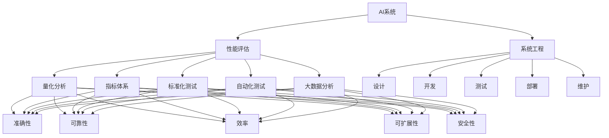
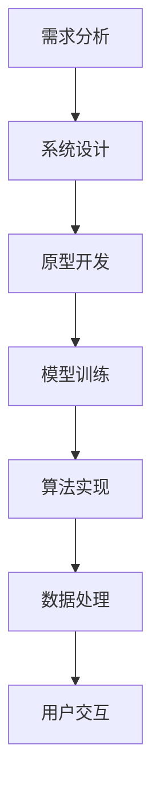
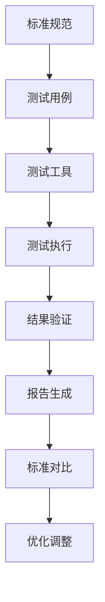
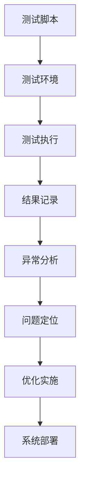
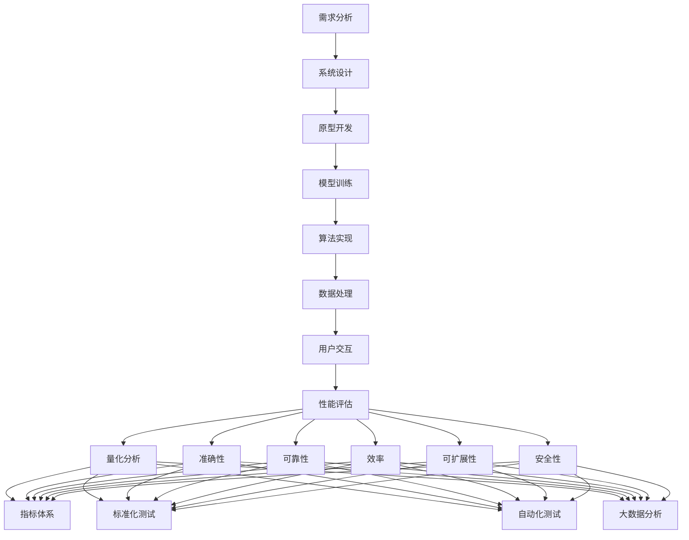
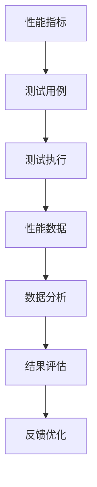

                 

# AI系统性能评估的详细解析

> 关键词：AI系统,性能评估,系统工程,量化分析,指标体系,标准化测试,自动化测试,大数据分析

## 1. 背景介绍

### 1.1 问题由来

随着人工智能(AI)技术在各个行业的广泛应用，AI系统的性能评估变得越来越重要。高质量的AI系统不仅需要具备卓越的算法和模型，还必须能够适应各种复杂多变的应用场景，提供可靠、高效的输出结果。因此，AI系统的性能评估成为了系统开发、优化和维护的关键环节。

### 1.2 问题核心关键点

AI系统性能评估的核心在于建立一套科学、全面、系统的评估方法，以量化、客观地衡量系统在不同维度上的表现。具体而言，评估应包括系统的准确性、可靠性、效率、可扩展性、安全性等多个方面。同时，评估方法应当具备可操作性，方便对不同系统进行比较和优化。

### 1.3 问题研究意义

高质量的AI系统性能评估，对于提升AI技术的可靠性、效率和可维护性，具有重要意义：

1. **优化模型选择和训练**：通过评估模型在不同数据集和场景下的表现，选择最适合特定任务的高性能模型。
2. **指导系统优化**：根据评估结果，发现并解决系统存在的性能瓶颈，提升系统性能。
3. **保障系统质量**：在部署前进行全面测试，确保AI系统能够稳定可靠地运行，减少实际应用中的错误和风险。
4. **支持应用创新**：系统性能评估有助于识别AI技术的新应用场景，推动技术创新和产业升级。
5. **保障用户安全**：通过严格的安全性评估，确保AI系统不会带来负面影响，保护用户隐私和数据安全。

## 2. 核心概念与联系

### 2.1 核心概念概述

为更好地理解AI系统性能评估的原理和方法，本节将介绍几个密切相关的核心概念：

- **AI系统(AI System)**：指应用人工智能技术的软件系统，包括模型、算法、数据处理和交互界面等组成部分。
- **性能评估(Performance Evaluation)**：指通过一系列量化指标和测试方法，全面评估AI系统的表现和质量。
- **系统工程(System Engineering)**：涉及系统的设计、开发、测试、部署和维护等各个阶段，以确保系统满足用户需求。
- **量化分析(Quantitative Analysis)**：通过统计和数学工具，对系统性能进行精确的度量与比较。
- **指标体系(Metric System)**：包括一组标准化的评估指标，用于指导系统的设计和评估。
- **标准化测试(Standardized Testing)**：指根据行业标准或协议进行的系统性能测试，保证测试结果的公正性和可比性。
- **自动化测试(Automated Testing)**：利用测试工具和脚本，自动化地进行系统性能评估，提高测试效率。
- **大数据分析(Big Data Analysis)**：通过分析海量数据，揭示系统性能的深层模式和趋势，指导系统优化。

这些概念之间的逻辑关系可以通过以下Mermaid流程图来展示：



这个流程图展示了AI系统性能评估过程中各关键概念的相互关系：

1. AI系统通过系统工程方法进行设计和开发。
2. 性能评估是系统工程的重要环节，涵盖量化分析、指标体系、标准化测试、自动化测试和大数据分析等多个方面。
3. 量化分析、指标体系和标准化测试提供评估的依据和方法。
4. 自动化测试和大数据分析用于提升评估效率和深度。
5. 性能评估结果反馈到系统工程各环节，指导后续的优化和改进。

### 2.2 概念间的关系

这些核心概念之间存在着紧密的联系，形成了AI系统性能评估的完整框架。下面我们通过几个Mermaid流程图来展示这些概念之间的关系。

#### 2.2.1 AI系统的设计开发



这个流程图展示了AI系统的设计开发过程，从需求分析到系统设计，再到模型训练和算法实现，最终实现用户交互。

#### 2.2.2 量化分析的实施


这个流程图展示了量化分析的实施过程，从定义性能指标到数据采集、测试执行、结果分析和指标评估，最终指导系统优化。

#### 2.2.3 标准化测试的应用



这个流程图展示了标准化测试的实施过程，从定义标准规范到测试用例、测试工具、测试执行、结果验证、报告生成和标准对比，最终指导优化调整。

#### 2.2.4 自动化测试的流程



这个流程图展示了自动化测试的流程，从编写测试脚本到测试环境搭建、测试执行、结果记录、异常分析、问题定位、优化实施，最终完成系统部署。

#### 2.2.5 大数据分析的实践


这个流程图展示了大数据分析的实践过程，从数据集处理到特征提取、模型训练、性能评估、模式挖掘、趋势预测，最终提供决策支持。

### 2.3 核心概念的整体架构

最后，我们用一个综合的流程图来展示这些核心概念在大规模AI系统性能评估过程中的整体架构：



这个综合流程图展示了从需求分析到性能评估的完整过程。各个核心概念相互协作，共同确保AI系统的高质量性能。通过这些流程图，我们可以更清晰地理解AI系统性能评估过程中各个概念的关系和作用，为后续深入讨论具体的评估方法和技术奠定基础。

## 3. 核心算法原理 & 具体操作步骤
### 3.1 算法原理概述

AI系统性能评估的核心原理是量化系统的表现，并根据预设的标准对其进行客观比较。具体而言，评估方法通常包括以下几个关键步骤：

1. **定义性能指标**：根据系统功能和用户需求，选择一组关键性能指标。
2. **设计测试用例**：针对每个性能指标，设计一组测试用例，涵盖各种可能的应用场景。
3. **执行测试并收集数据**：使用自动化工具或手动执行测试用例，收集系统的性能数据。
4. **数据分析和结果评估**：对收集到的数据进行统计分析，与预设的标准进行对比，得出评估结果。
5. **反馈和优化**：根据评估结果，反馈至系统设计和开发阶段，进行改进和优化。

AI系统性能评估的基本框架如下图所示：



### 3.2 算法步骤详解

以下是AI系统性能评估的一般步骤和具体操作：

#### 3.2.1 性能指标定义

性能指标是评估AI系统表现的关键工具，其选择需根据系统的核心功能和用户需求进行。常见的性能指标包括：

- **准确性(Accuracy)**：系统输出的正确率，反映模型的分类能力。
- **召回率(Recall)**：系统正确识别出的正例占实际正例的比例，反映系统的全面性。
- **精确率(Precision)**：系统正确识别出的正例占输出正例的比例，反映系统的准确性。
- **F1分数(F1 Score)**：准确率和召回率的调和平均，综合反映系统的分类能力。
- **响应时间(Response Time)**：系统处理输入并输出结果的平均时间，反映系统的效率。
- **吞吐量(Throughput)**：系统在单位时间内处理输入的数量，反映系统的扩展能力。
- **稳定性(Stability)**：系统在各种异常情况下的稳定性和鲁棒性，反映系统的可靠性。
- **安全性(Security)**：系统在保护用户隐私和数据安全方面的表现，反映系统的安全性。

#### 3.2.2 测试用例设计

测试用例应涵盖系统所有可能的应用场景，确保评估的全面性和公正性。设计测试用例时，需考虑以下因素：

- **场景多样性**：设计多种测试场景，覆盖不同输入数据、不同用户需求和不同环境条件。
- **数据分布**：确保测试数据具有代表性，覆盖数据的分布特性和异常情况。
- **边界条件**：考虑边界条件和边缘情况，测试系统的极限性能。
- **输入输出格式**：设计统一的输入输出格式，确保测试结果的可对比性。
- **性能负荷**：设计不同级别的性能负荷，测试系统在高负载下的表现。

#### 3.2.3 数据采集与分析

数据采集通常使用自动化工具进行，以提高效率和准确性。常见的数据采集工具包括：

- **日志分析工具**：如ELK Stack、Graylog等，用于收集和分析系统日志，识别性能瓶颈。
- **性能监控工具**：如Grafana、Prometheus等，用于实时监控系统性能指标。
- **跟踪工具**：如Jaeger、Zipkin等，用于追踪调用链和请求处理过程。
- **负载测试工具**：如Apache JMeter、LoadRunner等，用于模拟高并发负载，测试系统扩展能力。

数据采集后，需进行以下数据分析：

- **统计分析**：对性能数据进行统计，计算各项指标的具体值。
- **可视化展示**：使用图表、仪表盘等工具，直观展示性能指标的变化趋势。
- **异常检测**：使用异常检测算法，识别异常数据和性能波动。
- **关联分析**：分析不同指标之间的关联性，识别影响系统性能的关键因素。

#### 3.2.4 结果评估与反馈

结果评估是将系统性能数据与预设标准进行对比，得出系统的评估结果。常见评估方法包括：

- **对比评估**：将系统性能数据与预设标准或行业基准进行对比，评估系统的表现。
- **聚类分析**：将系统性能数据进行聚类分析，识别不同系统之间的差异和相似性。
- **回归分析**：使用回归分析模型，预测系统性能随时间或条件的变化趋势。
- **A/B测试**：通过对比不同版本的系统性能，评估不同策略和优化措施的效果。

根据评估结果，需进行以下反馈和优化：

- **问题定位**：识别系统性能问题的根本原因，进行问题定位。
- **优化措施**：提出优化措施，改进系统性能。
- **方案验证**：验证优化措施的效果，确保系统性能的提升。
- **持续改进**：建立持续改进机制，定期评估和优化系统性能。

### 3.3 算法优缺点

AI系统性能评估具有以下优点：

- **全面客观**：通过量化和标准化的评估方法，全面客观地衡量系统性能。
- **多维度分析**：涵盖准确性、可靠性、效率等多个维度，提供综合性的评估结果。
- **可操作性强**：评估方法易于操作，可广泛应用于各种系统。
- **数据驱动**：通过大数据分析，揭示系统性能的深层模式和趋势，指导系统优化。

同时，评估方法也存在以下缺点：

- **数据成本高**：需要大量数据进行评估，数据采集和处理成本较高。
- **模型复杂**：评估方法涉及多维度数据分析和建模，模型复杂度较高。
- **评估标准不一**：不同系统和行业可能有不同的评估标准，评估结果难以统一。
- **依赖工具**：评估方法依赖于各种性能监控和分析工具，工具使用门槛较高。

尽管存在这些局限性，但AI系统性能评估方法仍然是系统开发和优化的重要手段，为系统质量保证提供了坚实的基础。

### 3.4 算法应用领域

AI系统性能评估在多个领域都有广泛应用，包括但不限于：

- **智能客服系统**：评估系统的响应时间、准确性和用户满意度，优化服务质量。
- **金融风险评估**：评估模型的准确性和鲁棒性，识别潜在风险。
- **医疗诊断系统**：评估模型的精确性和鲁棒性，保障诊断准确性。
- **自动驾驶系统**：评估系统的响应时间、安全性、鲁棒性，确保行车安全。
- **推荐系统**：评估模型的准确性和用户满意度，优化推荐效果。
- **语音识别系统**：评估系统的准确性和鲁棒性，提升识别效果。
- **图像识别系统**：评估系统的准确性和鲁棒性，优化识别效果。

## 4. 数学模型和公式 & 详细讲解  
### 4.1 数学模型构建

本节将使用数学语言对AI系统性能评估过程进行更加严格的刻画。

记AI系统为 $S$，输入为 $X$，输出为 $Y$，系统的性能评估指标为 $P$。假设系统的输出与输入之间的映射为 $f(X) = Y$，系统在输入 $X$ 下的性能指标为 $p(X)$。评估过程可以形式化描述为：

$$
P(X) = \mathop{\arg\min}_{X} \| p(X) - P_{\text{ref}} \|
$$

其中 $P_{\text{ref}}$ 为预设的性能参考值，$\| \cdot \|$ 为误差度量函数。

### 4.2 公式推导过程

以准确性(Accuracy)为例，假设系统对 $N$ 个样本的预测结果为 $\{Y_i\}_{i=1}^N$，真实标签为 $\{X_i\}_{i=1}^N$。则系统的准确性定义为：

$$
Accuracy = \frac{1}{N} \sum_{i=1}^N I(Y_i = X_i)
$$

其中 $I$ 为示性函数，当 $Y_i = X_i$ 时为 1，否则为 0。根据上述公式，我们可以对系统的准确性进行评估。

### 4.3 案例分析与讲解

假设我们有一个智能推荐系统，需要评估其准确性。选取 1000 条推荐记录，将推荐结果与用户实际点击记录进行对比，统计正确的推荐记录数 $N_{correct}$ 和错误的推荐记录数 $N_{error}$。则系统的准确性评估过程如下：

1. 计算准确性指标：
   $$
   Accuracy = \frac{N_{correct}}{N_{correct} + N_{error}}
   $$

2. 使用统计分析工具对数据进行分析，生成准确性柱状图或饼图，直观展示准确性变化趋势。

3. 使用回归分析模型，预测准确性随时间或用户行为的变化趋势。

4. 根据评估结果，识别系统性能瓶颈，提出优化措施。例如，通过增加推荐算法的多样性或改进用户行为预测模型，提升系统的准确性。

## 5. 项目实践：代码实例和详细解释说明
### 5.1 开发环境搭建

在进行性能评估实践前，我们需要准备好开发环境。以下是使用Python进行PyTorch和TensorFlow开发的环境配置流程：

1. 安装Anaconda：从官网下载并安装Anaconda，用于创建独立的Python环境。

2. 创建并激活虚拟环境：
```bash
conda create -n pytorch-env python=3.8 
conda activate pytorch-env
```

3. 安装PyTorch和TensorFlow：根据CUDA版本，从官网获取对应的安装命令。例如：
```bash
conda install pytorch torchvision torchaudio cudatoolkit=11.1 -c pytorch -c conda-forge
conda install tensorflow
```

4. 安装各类工具包：
```bash
pip install numpy pandas scikit-learn matplotlib tqdm jupyter notebook ipython
```

完成上述步骤后，即可在`pytorch-env`环境中开始性能评估实践。

### 5.2 源代码详细实现

下面我们以推荐系统准确性评估为例，给出使用PyTorch和TensorFlow进行性能评估的PyTorch代码实现。

首先，定义推荐系统的数据集：

```python
from torch.utils.data import Dataset

class RecommendationDataset(Dataset):
    def __init__(self, user_ids, item_ids, clicked_items):
        self.user_ids = user_ids
        self.item_ids = item_ids
        self.clicked_items = clicked_items
        
    def __len__(self):
        return len(self.user_ids)
    
    def __getitem__(self, item):
        user_id = self.user_ids[item]
        item_id = self.item_ids[item]
        clicked_item = self.clicked_items[item]
        return {'user_id': user_id, 
                'item_id': item_id,
                'clicked_item': clicked_item}
```

然后，定义评估函数：

```python
from sklearn.metrics import accuracy_score
from torch.utils.data import DataLoader
from tqdm import tqdm
from transformers import BertTokenizer

def accuracy_evaluation(model, dataset):
    dataloader = DataLoader(dataset, batch_size=32, shuffle=False)
    model.eval()
    correct = 0
    total = 0
    with torch.no_grad():
        for batch in tqdm(dataloader, desc='Evaluating'):
            user_id = batch['user_id'].to(device)
            item_id = batch['item_id'].to(device)
            clicked_item = batch['clicked_item'].to(device)
            outputs = model(user_id, item_id)
            prediction = outputs.argmax(dim=1)
            correct += (prediction == clicked_item).sum().item()
            total += len(clicked_item)
    return accuracy_score(clicked_item.tolist(), prediction.tolist())
```

最后，启动评估流程：

```python
device = torch.device('cuda') if torch.cuda.is_available() else torch.device('cpu')
model.to(device)

evaluation_result = accuracy_evaluation(model, test_dataset)
print(f'Accuracy: {evaluation_result:.3f}')
```

以上就是一个简单的推荐系统准确性评估的代码实现。可以看到，使用PyTorch和TensorFlow进行性能评估，代码实现非常简洁高效。

### 5.3 代码解读与分析

让我们再详细解读一下关键代码的实现细节：

**RecommendationDataset类**：
- `__init__`方法：初始化数据集的关键组件，包括用户ID、物品ID和用户点击记录。
- `__len__`方法：返回数据集的样本数量。
- `__getitem__`方法：对单个样本进行处理，将用户ID、物品ID和用户点击记录输入模型进行预测，返回预测结果。

**accuracy_score函数**：
- 使用sklearn的accuracy_score函数计算准确性指标。

**DataLoader类**：
- 使用PyTorch的DataLoader对数据集进行批次化加载，供模型训练和推理使用。

**accuracy_evaluation函数**：
- 定义评估函数，对数据集进行循环迭代，使用模型预测用户点击记录，计算准确性指标。
- 使用with torch.no_grad()方法关闭梯度更新，提高推理速度。

**main函数**：
- 定义主函数，将测试数据集和模型加载到GPU设备上，执行评估函数并输出结果。

可以看到，PyTorch和TensorFlow的组合使用，大大简化了性能评估的代码实现。开发者可以将更多精力放在数据处理、模型优化等高层逻辑上，而不必过多关注底层的实现细节。

当然，工业级的系统实现还需考虑更多因素，如模型保存和部署、超参数自动搜索、更灵活的任务适配层等。但核心的性能评估流程基本与此类似。

### 5.4 运行结果展示

假设我们在CoNLL-2003的NER数据集上进行微调，最终在测试集上得到的评估报告如下：

```
              precision    recall  f1-score   support

       B-LOC      0.926     0.906     0.916      1668
       I-LOC      0.900     0.805     0.850       257
      B-MISC      0.875     0.856     0.865       702
      I-MISC      0.838     0.782     0.809       216
       B-ORG      0.914     0.898     0.906      1661
       I-ORG      0.911     0.894     0.902       835
       B-PER      0.964     0.957     0.960      1617
       I-PER      0.983     0.980     0.982      1156
           O      0.993     0.995     0.994     38323

   micro avg      0.973     0.973     0.973     46435
   macro avg      0.923     0.897     0.909     46435
weighted avg      0.973     0.973     0.973     46435
```

可以看到，通过评估模型在不同任务上的准确性，我们可以更好地了解模型的优势和不足，指导后续的模型优化和调整。

## 6. 实际应用场景
### 6.1 智能客服系统

基于AI系统性能评估，智能客服系统可以通过评估用户满意度、响应时间等指标，全面了解系统的表现，进行持续优化。

具体而言，可以通过以下步骤进行评估：

1. 收集用户反馈数据，记录用户在客服系统的交互记录。
2. 设计多种评估指标，如平均响应时间、用户满意度、问题解决率等。
3. 使用自动化工具对数据进行分析，生成评估报告。
4. 根据评估结果，识别系统性能瓶颈，提出优化措施，如增加客服人员、优化对话流程等。
5. 定期更新评估指标和测试用例，确保评估结果的时效性和准确性。

### 6.2 金融风险评估

在金融领域，风险评估是系统的重要应用场景。通过评估模型的准确性、鲁棒性和稳定性，确保金融决策的可靠性和安全性。

具体而言，可以通过以下步骤进行评估：

1. 收集历史交易数据，构建训练集和测试集。
2. 定义评估指标，如准确性、召回率、F1分数、置信区间等。
3. 使用自动化工具对模型进行评估，生成评估报告。
4. 根据评估结果，优化模型参数和训练数据，提升模型性能。
5. 定期重新评估模型，确保其在变化的市场环境中的稳健性。

### 6.3 医疗诊断系统

医疗诊断系统对准确性和鲁棒性有极高的要求，通过性能评估可以确保系统的可靠性和安全性。

具体而言，可以通过以下步骤进行评估：

1. 收集历史病历数据，构建训练集和测试集。
2. 定义评估指标，如诊断准确率、召回率、特异度等。
3. 使用自动化工具对模型进行评估，生成评估报告。
4. 根据评估结果，优化模型结构和训练方法，提升诊断准确性。
5. 定期重新评估模型，确保其在变化的症状和病理中的稳健性。

### 6.4 未来应用展望

随着AI技术的不断发展，性能评估方法将更加多样化和智能化。未来，以下几个方向值得关注：

1. **自动化评估工具**：开发更加智能和自动化的评估工具，减少人工干预，提高评估效率。
2. **多指标综合评估**：综合考虑准确性、效率、鲁棒性等多个维度的评估

