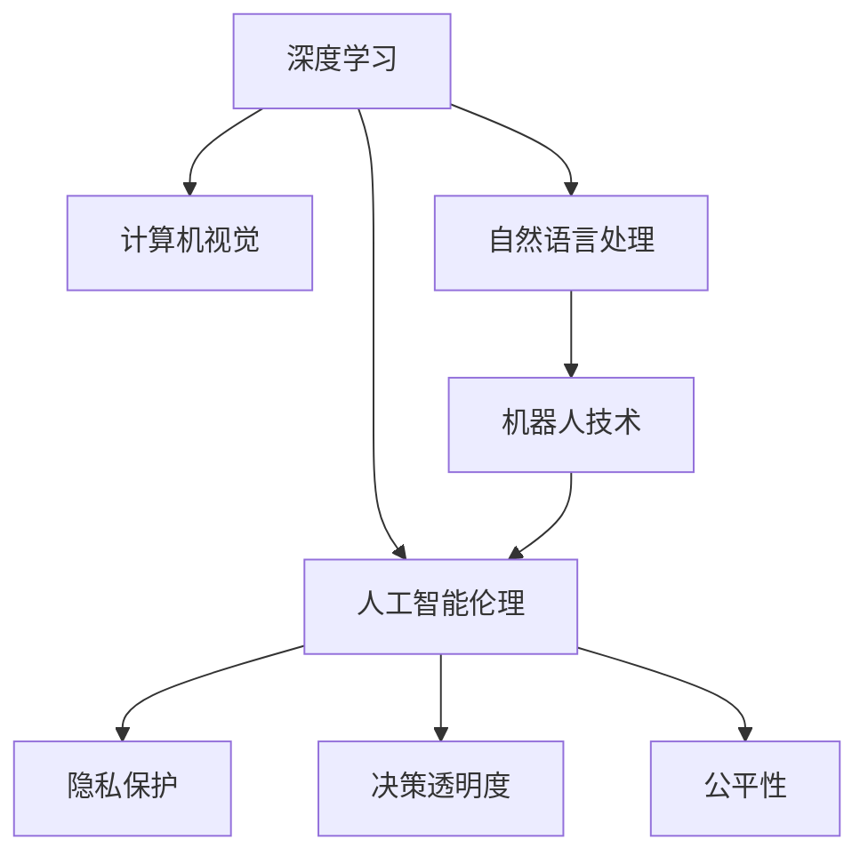
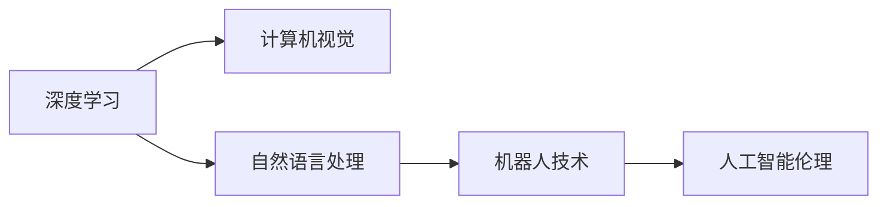
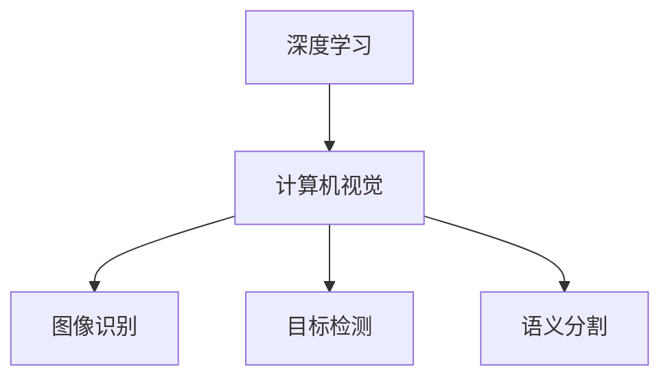
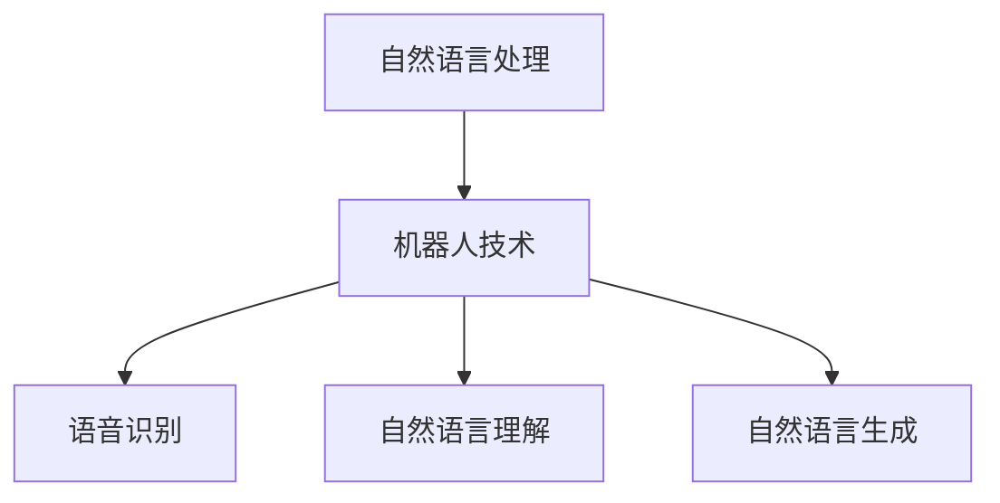
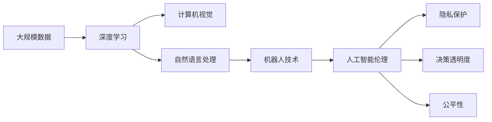

                 

# AI领域的技术突破与发展

> 关键词：
   - AI技术的突破
   - 深度学习
   - 计算机视觉
   - 自然语言处理
   - 机器人技术
   - 人工智能伦理

## 1. 背景介绍

### 1.1 问题由来
近年来，随着人工智能技术的飞速发展，AI领域取得了显著的突破，不仅在深度学习、计算机视觉、自然语言处理等领域成果斐然，还在机器人技术、量子计算、脑科学等多个方向上持续创新。AI技术的广泛应用，已经开始深入各行各业，为各行各业带来了巨大的变革。然而，AI技术的快速进步也带来了一些新的挑战和问题，如算法透明度、伦理道德、人机协同等，这些问题亟待学术界和产业界共同应对。

### 1.2 问题核心关键点
AI技术的突破主要围绕以下几个核心关键点展开：

- 深度学习：作为一种强大的机器学习技术，深度学习通过多层次的神经网络，实现了对复杂数据的深度表示和高级特征学习。
- 计算机视觉：结合深度学习和大规模标注数据，计算机视觉在图像识别、目标检测、语义分割等领域取得了巨大成功。
- 自然语言处理：利用语言模型和生成模型，自然语言处理在机器翻译、对话系统、文本摘要等领域显著提升。
- 机器人技术：结合计算机视觉和自然语言处理，机器人技术在自主导航、人机交互、协作工作等方面取得突破。
- 人工智能伦理：AI技术的广泛应用引发了一系列伦理道德问题，如隐私保护、决策透明度、公平性等，成为AI发展的重要考量。

### 1.3 问题研究意义
AI技术的突破对经济社会发展具有深远影响，能够推动产业升级、改善社会治理、提升人类生活质量，具有重要意义：

1. **产业升级**：AI技术可以应用于制造业、金融、医疗、教育等多个领域，提升效率，降低成本，推动产业转型升级。
2. **社会治理**：AI技术在城市管理、公共安全、环境保护等方面具有广泛应用前景，能够提升治理能力和效率。
3. **生活质量提升**：AI技术在家庭生活、个人娱乐、健康医疗等方面具有广泛应用，能够提升人类生活质量。
4. **科技创新**：AI技术是未来科技发展的重要方向，能够推动量子计算、脑科学等前沿领域的研究进展。

## 2. 核心概念与联系

### 2.1 核心概念概述

为了更好地理解AI技术的突破与发展，本节将介绍几个密切相关的核心概念：

- **深度学习**：一种基于神经网络的机器学习方法，通过多层次的非线性变换，实现对复杂数据的高级特征提取和表示。
- **计算机视觉**：结合深度学习和大规模标注数据，计算机视觉技术能够实现对图像、视频等视觉数据的高级理解与处理。
- **自然语言处理**：利用语言模型和生成模型，自然语言处理技术能够实现对自然语言的理解、生成和推理。
- **机器人技术**：结合计算机视觉和自然语言处理，机器人技术能够实现自主导航、人机交互、协作工作等高级功能。
- **人工智能伦理**：涉及AI技术在社会应用中的伦理道德问题，如隐私保护、决策透明度、公平性等。

这些核心概念之间的逻辑关系可以通过以下Mermaid流程图来展示：



这个流程图展示了深度学习、计算机视觉、自然语言处理、机器人技术、人工智能伦理这些核心概念及其之间的关系：

1. 深度学习是AI技术的基础，为计算机视觉、自然语言处理和机器人技术提供了强大的数据处理能力。
2. 计算机视觉和自然语言处理在数据理解和处理上有所侧重，但均依赖于深度学习技术。
3. 机器人技术融合了计算机视觉和自然语言处理，在实际应用中取得了显著进展。
4. 人工智能伦理是AI技术应用中的重要考量，涉及隐私保护、决策透明度和公平性等方面。

### 2.2 概念间的关系

这些核心概念之间存在着紧密的联系，形成了AI技术的完整生态系统。下面我们通过几个Mermaid流程图来展示这些概念之间的关系。

#### 2.2.1 AI技术的整体架构



这个综合流程图展示了深度学习、计算机视觉、自然语言处理、机器人技术、人工智能伦理这些核心概念在大规模数据处理和应用中的整体架构。

#### 2.2.2 深度学习与计算机视觉的联系



这个流程图展示了深度学习与计算机视觉之间的联系，以及计算机视觉在图像识别、目标检测、语义分割等具体任务中的应用。

#### 2.2.3 自然语言处理与机器人技术的联系



这个流程图展示了自然语言处理与机器人技术之间的联系，以及机器人技术在语音识别、自然语言理解、自然语言生成等具体任务中的应用。

### 2.3 核心概念的整体架构

最后，我们用一个综合的流程图来展示这些核心概念在大规模数据处理和应用中的整体架构：



这个综合流程图展示了深度学习、计算机视觉、自然语言处理、机器人技术、人工智能伦理这些核心概念在大规模数据处理和应用中的整体架构。

## 3. 核心算法原理 & 具体操作步骤
### 3.1 算法原理概述

AI技术的突破主要依赖于以下几个核心算法的原理：

- **深度学习**：通过多层次的神经网络，实现对复杂数据的高级特征提取和表示。
- **计算机视觉**：利用卷积神经网络（CNN）和循环神经网络（RNN），实现对图像、视频等视觉数据的高级理解和处理。
- **自然语言处理**：通过语言模型和生成模型，实现对自然语言的理解、生成和推理。
- **机器人技术**：结合计算机视觉和自然语言处理，实现自主导航、人机交互、协作工作等高级功能。

### 3.2 算法步骤详解

以下是AI技术的几个核心算法的详细步骤：

#### 3.2.1 深度学习算法步骤

1. **数据准备**：收集和预处理大规模数据集，确保数据的多样性和代表性。
2. **模型构建**：设计深度神经网络结构，包括卷积层、池化层、全连接层等。
3. **模型训练**：使用梯度下降等优化算法，通过反向传播计算梯度并更新参数，最小化损失函数。
4. **模型评估**：在验证集上评估模型性能，调整模型超参数以提升效果。
5. **模型部署**：将训练好的模型部署到实际应用中，进行推理和预测。

#### 3.2.2 计算机视觉算法步骤

1. **数据准备**：收集和预处理大规模图像和视频数据集。
2. **模型构建**：设计卷积神经网络（CNN）结构，包括卷积层、池化层、全连接层等。
3. **模型训练**：使用梯度下降等优化算法，通过反向传播计算梯度并更新参数，最小化损失函数。
4. **模型评估**：在验证集上评估模型性能，调整模型超参数以提升效果。
5. **模型部署**：将训练好的模型部署到实际应用中，进行图像识别、目标检测、语义分割等任务。

#### 3.2.3 自然语言处理算法步骤

1. **数据准备**：收集和预处理大规模文本数据集，确保数据的多样性和代表性。
2. **模型构建**：设计语言模型或生成模型结构，包括RNN、LSTM、Transformer等。
3. **模型训练**：使用梯度下降等优化算法，通过反向传播计算梯度并更新参数，最小化损失函数。
4. **模型评估**：在验证集上评估模型性能，调整模型超参数以提升效果。
5. **模型部署**：将训练好的模型部署到实际应用中，进行文本分类、机器翻译、对话系统等任务。

#### 3.2.4 机器人技术算法步骤

1. **数据准备**：收集和预处理大规模语音、视觉、文本数据集。
2. **模型构建**：设计结合计算机视觉和自然语言处理的机器人技术结构，包括语音识别、自然语言理解、自然语言生成等。
3. **模型训练**：使用梯度下降等优化算法，通过反向传播计算梯度并更新参数，最小化损失函数。
4. **模型评估**：在验证集上评估模型性能，调整模型超参数以提升效果。
5. **模型部署**：将训练好的模型部署到实际应用中，进行自主导航、人机交互、协作工作等任务。

### 3.3 算法优缺点

AI技术的核心算法具有以下优缺点：

#### 优点：

1. **高效性**：通过深度学习、卷积神经网络、语言模型等算法，能够高效地处理大规模数据，实现对复杂数据的高级特征提取和表示。
2. **准确性**：这些算法在大规模数据集上训练后，具有较高的准确性和泛化能力，能够在实际应用中取得优异的性能。
3. **可扩展性**：这些算法具有较好的可扩展性，能够应用于多种任务和领域，推动AI技术的广泛应用。

#### 缺点：

1. **数据依赖**：深度学习、卷积神经网络、语言模型等算法依赖于大规模标注数据集，获取数据成本较高。
2. **计算资源需求**：这些算法需要高性能计算资源，如GPU、TPU等，对计算资源和存储空间提出了较高要求。
3. **解释性不足**：这些算法往往是"黑盒"模型，难以解释其内部工作机制和决策逻辑。
4. **安全性问题**：在实际应用中，这些算法可能面临模型过拟合、数据泄露等安全性问题。

### 3.4 算法应用领域

AI技术的核心算法已经在多个领域取得了广泛应用，包括但不限于：

- **制造业**：AI技术应用于工业自动化、机器人视觉、质量检测等领域，推动制造业智能化升级。
- **金融行业**：AI技术应用于风险评估、客户服务、欺诈检测等领域，提升金融服务效率和安全性。
- **医疗健康**：AI技术应用于医学影像分析、疾病预测、个性化医疗等领域，提升医疗服务质量和效率。
- **教育培训**：AI技术应用于智能辅导、个性化学习、教育评估等领域，提升教育培训效果和用户体验。
- **环境保护**：AI技术应用于环境监测、气候预测、生态保护等领域，推动环境保护和可持续发展。

## 4. 数学模型和公式 & 详细讲解 & 举例说明

### 4.1 数学模型构建

本节将使用数学语言对AI技术的核心算法进行更加严格的刻画。

设输入数据为 $x$，模型为 $f(x)$，损失函数为 $L$。AI技术的核心算法一般可以表示为：

$$
\min_{\theta} \sum_{i=1}^{N} L(f(x_i), y_i)
$$

其中 $N$ 为样本数量，$L$ 为损失函数，$y_i$ 为真实标签，$\theta$ 为模型参数。

### 4.2 公式推导过程

以下是几个核心算法的公式推导过程：

#### 4.2.1 深度学习公式推导

深度学习算法通过反向传播算法计算梯度并更新参数，最小化损失函数。

设深度神经网络为 $f(x) = \hat{y}$，损失函数为 $L(y, \hat{y})$。通过反向传播计算梯度：

$$
\frac{\partial L}{\partial \theta} = \frac{\partial L}{\partial \hat{y}} \frac{\partial \hat{y}}{\partial z} \frac{\partial z}{\partial \theta}
$$

其中 $\hat{y}$ 为模型输出，$z$ 为中间层输出。

#### 4.2.2 计算机视觉公式推导

计算机视觉算法通过卷积神经网络（CNN）和循环神经网络（RNN）实现图像和视频数据的高级理解与处理。

设卷积神经网络为 $f(x) = \hat{y}$，损失函数为 $L(y, \hat{y})$。通过反向传播计算梯度：

$$
\frac{\partial L}{\partial \theta} = \frac{\partial L}{\partial \hat{y}} \frac{\partial \hat{y}}{\partial z} \frac{\partial z}{\partial \theta}
$$

其中 $\hat{y}$ 为模型输出，$z$ 为中间层输出。

#### 4.2.3 自然语言处理公式推导

自然语言处理算法通过语言模型和生成模型实现自然语言的理解、生成和推理。

设语言模型为 $f(x) = \hat{y}$，损失函数为 $L(y, \hat{y})$。通过反向传播计算梯度：

$$
\frac{\partial L}{\partial \theta} = \frac{\partial L}{\partial \hat{y}} \frac{\partial \hat{y}}{\partial z} \frac{\partial z}{\partial \theta}
$$

其中 $\hat{y}$ 为模型输出，$z$ 为中间层输出。

#### 4.2.4 机器人技术公式推导

机器人技术算法通过结合计算机视觉和自然语言处理实现自主导航、人机交互、协作工作等高级功能。

设机器人技术模型为 $f(x) = \hat{y}$，损失函数为 $L(y, \hat{y})$。通过反向传播计算梯度：

$$
\frac{\partial L}{\partial \theta} = \frac{\partial L}{\partial \hat{y}} \frac{\partial \hat{y}}{\partial z} \frac{\partial z}{\partial \theta}
$$

其中 $\hat{y}$ 为模型输出，$z$ 为中间层输出。

### 4.3 案例分析与讲解

以下是几个核心算法在实际应用中的案例分析与讲解：

#### 4.3.1 深度学习案例分析

一个典型的深度学习案例是图像分类任务。假设使用卷积神经网络（CNN）进行图像分类，输入数据为 $x$，真实标签为 $y$。

设CNN模型为 $f(x) = \hat{y}$，损失函数为 $L(y, \hat{y})$。通过反向传播计算梯度：

$$
\frac{\partial L}{\partial \theta} = \frac{\partial L}{\partial \hat{y}} \frac{\partial \hat{y}}{\partial z} \frac{\partial z}{\partial \theta}
$$

其中 $\hat{y}$ 为模型输出，$z$ 为中间层输出。

#### 4.3.2 计算机视觉案例分析

一个典型的计算机视觉案例是目标检测任务。假设使用卷积神经网络（CNN）进行目标检测，输入数据为 $x$，真实标签为 $y$。

设CNN模型为 $f(x) = \hat{y}$，损失函数为 $L(y, \hat{y})$。通过反向传播计算梯度：

$$
\frac{\partial L}{\partial \theta} = \frac{\partial L}{\partial \hat{y}} \frac{\partial \hat{y}}{\partial z} \frac{\partial z}{\partial \theta}
$$

其中 $\hat{y}$ 为模型输出，$z$ 为中间层输出。

#### 4.3.3 自然语言处理案例分析

一个典型的自然语言处理案例是文本分类任务。假设使用Transformer模型进行文本分类，输入数据为 $x$，真实标签为 $y$。

设Transformer模型为 $f(x) = \hat{y}$，损失函数为 $L(y, \hat{y})$。通过反向传播计算梯度：

$$
\frac{\partial L}{\partial \theta} = \frac{\partial L}{\partial \hat{y}} \frac{\partial \hat{y}}{\partial z} \frac{\partial z}{\partial \theta}
$$

其中 $\hat{y}$ 为模型输出，$z$ 为中间层输出。

#### 4.3.4 机器人技术案例分析

一个典型的机器人技术案例是自主导航任务。假设使用深度学习结合计算机视觉和自然语言处理进行自主导航，输入数据为 $x$，真实标签为 $y$。

设机器人技术模型为 $f(x) = \hat{y}$，损失函数为 $L(y, \hat{y})$。通过反向传播计算梯度：

$$
\frac{\partial L}{\partial \theta} = \frac{\partial L}{\partial \hat{y}} \frac{\partial \hat{y}}{\partial z} \frac{\partial z}{\partial \theta}
$$

其中 $\hat{y}$ 为模型输出，$z$ 为中间层输出。

## 5. 项目实践：代码实例和详细解释说明

### 5.1 开发环境搭建

在进行AI技术的项目实践前，我们需要准备好开发环境。以下是使用Python进行TensorFlow开发的环境配置流程：

1. 安装Anaconda：从官网下载并安装Anaconda，用于创建独立的Python环境。

2. 创建并激活虚拟环境：
```bash
conda create -n tf-env python=3.8 
conda activate tf-env
```

3. 安装TensorFlow：根据CUDA版本，从官网获取对应的安装命令。例如：
```bash
conda install tensorflow -c tf -c conda-forge
```

4. 安装TensorBoard：
```bash
pip install tensorboard
```

5. 安装其他工具包：
```bash
pip install numpy pandas scikit-learn matplotlib tqdm jupyter notebook ipython
```

完成上述步骤后，即可在`tf-env`环境中开始AI技术的项目实践。

### 5.2 源代码详细实现

这里我们以深度学习在图像分类任务中的应用为例，给出使用TensorFlow进行图像分类任务开发的PyTorch代码实现。

首先，定义模型和数据处理函数：

```python
import tensorflow as tf
from tensorflow.keras import layers
import numpy as np

# 定义模型结构
model = tf.keras.Sequential([
    layers.Conv2D(32, (3, 3), activation='relu', input_shape=(28, 28, 1)),
    layers.MaxPooling2D((2, 2)),
    layers.Flatten(),
    layers.Dense(10, activation='softmax')
])

# 定义数据处理函数
def preprocess_data(data):
    x = np.array(data) / 255.0
    return x.reshape((-1, 28, 28, 1)), y
```

然后，定义训练和评估函数：

```python
# 定义训练函数
def train_model(model, data, labels, epochs=10, batch_size=32):
    dataset = tf.data.Dataset.from_tensor_slices((data, labels))
    dataset = dataset.shuffle(10000).batch(batch_size).prefetch(buffer_size=1)
    model.compile(optimizer=tf.keras.optimizers.Adam(0.001), loss='sparse_categorical_crossentropy', metrics=['accuracy'])
    model.fit(dataset, epochs=epochs, validation_split=0.2)
    return model

# 定义评估函数
def evaluate_model(model, test_data, test_labels):
    test_dataset = tf.data.Dataset.from_tensor_slices((test_data, test_labels))
    test_dataset = test_dataset.batch(32)
    test_loss, test_acc = model.evaluate(test_dataset)
    print('Test loss:', test_loss)
    print('Test accuracy:', test_acc)
```

最后，启动训练流程并在测试集上评估：

```python
# 加载数据集
data, labels = mnist.load_data()
x_train, x_test, y_train, y_test = preprocess_data(data)

# 训练模型
model = train_model(model, x_train, y_train)

# 在测试集上评估模型
evaluate_model(model, x_test, y_test)
```

以上就是使用TensorFlow进行图像分类任务微调的具体代码实现。可以看到，TensorFlow提供了丰富的Keras API，可以快速构建和训练模型，简化了深度学习开发过程。

### 5.3 代码解读与分析

让我们再详细解读一下关键代码的实现细节：

**模型结构**：
- `Sequential`：创建序列模型，将多个层次的神经网络按顺序连接。
- `Conv2D`：定义卷积层，实现图像特征提取。
- `MaxPooling2D`：定义池化层，实现特征降维。
- `Flatten`：定义扁平层，将多维特征展平为一维向量。
- `Dense`：定义全连接层，实现分类输出。

**数据处理函数**：
- `preprocess_data`：将原始数据归一化并转换为TensorFlow格式，用于输入模型。

**训练函数**：
- `train_model`：使用`Sequential`模型，通过`fit`方法进行训练，设定优化器、损失函数、评估指标等参数。
- `epochs`：训练轮数。
- `batch_size`：批处理大小。

**评估函数**：
- `evaluate_model`：使用`Sequential`模型，通过`evaluate`方法在测试集上评估模型性能。

**启动训练流程**：
- `mnist.load_data`：加载MNIST数据集。
- `preprocess_data`：将原始数据预处理为TensorFlow格式。
- `train_model`：训练模型并返回训练好的模型。
- `evaluate_model`：在测试集上评估模型性能。

可以看到，TensorFlow提供了丰富的API和工具，使深度学习模型的构建和训练过程变得更加高效和便捷。通过上述代码实现，你可以快速上手TensorFlow进行深度学习任务开发，快速迭代模型性能，解决实际问题。

## 6. 实际应用场景

### 6.1 智慧医疗

AI技术在智慧医疗领域的应用前景广阔。通过深度学习、计算机视觉和自然语言处理等技术，可以实现医疗影像分析、疾病预测、个性化医疗等。例如，利用深度学习模型对医学影像进行分类和分析，提高疾病诊断的准确性和效率；利用计算机视觉技术进行手术导航和操作，提高手术成功率；利用自然语言处理技术进行电子病历分析，辅助医生制定治疗方案。

### 6.2 金融行业

AI技术在金融行业的应用同样具有重要意义。通过深度学习、自然语言处理等技术，可以实现金融风险评估、智能投顾、欺诈检测等。例如，利用深度学习模型对金融市场数据进行预测和分析，提供投资建议；利用自然语言处理技术进行舆情监测和客户服务，提升客户满意度；利用计算机视觉技术进行交易监控和异常检测，防止金融欺诈行为。

### 6.3 智能制造

AI技术在智能制造领域的应用将带来革命性变革。通过深度学习、计算机视觉等技术，可以实现智能制造、质量检测、生产优化等。例如，利用计算机视觉技术进行产品质量检测，提高生产效率和精度；利用深度学习模型对生产数据进行分析和预测，优化生产计划和资源配置；利用自然语言处理技术进行设备维护和故障诊断，降低设备维护成本。

### 6.4 未来应用展望

随着AI技术的不断进步，未来将出现更多创新应用场景，进一步推动产业升级和社会治理。例如，AI技术在农业领域的应用，可以通过深度学习和大数据分析，实现精准农业、智能灌溉、智能仓储等；在环境保护领域，可以通过计算机视觉和自然语言处理技术，实现环境监测、气候预测、生态保护等。

## 7. 工具和资源推荐

### 7.1 学习资源推荐

为了帮助开发者系统掌握AI技术的理论基础和实践技巧，这里推荐一些优质的学习资源：

1. 《深度学习》系列书籍：如《深度学习入门》、《深度学习实战》等，全面介绍深度学习的基本概念和实践方法。

2. Coursera《深度学习专项课程》：斯坦福大学开设的深度学习课程，涵盖深度学习的基础理论和实践应用。

3. 《计算机视觉：算法与应用》书籍：全面介绍计算机视觉的基本概念和实践方法，包括图像处理、目标检测、语义分割等。

4. 《自然语言处理入门》书籍：全面介绍自然语言处理的基本概念和实践方法，包括文本分类、机器翻译、对话系统等。

5. TensorFlow官方文档：TensorFlow的官方文档，提供丰富的教程和样例代码，是TensorFlow学习的必备资源。

### 7.2 开发工具推荐

高效的开发离不开优秀的工具支持。以下是几款用于AI技术开发的常用工具：

1. TensorFlow：基于Python的开源深度学习框架，支持动态图和静态图两种计算图模型，适合研究和大规模工程应用。

2. PyTorch：基于Python的开源深度学习框架，灵活动态的计算图，适合快速迭代研究。

3. Keras：Keras是一个高级神经网络API，可以在TensorFlow、Theano和CNTK等后端上运行，简化了深度学习开发过程。

4. Jupyter Notebook：Jupyter Notebook是一个交互式编程环境，适合数据分析、机器学习和深度学习开发。

5. Google Colab：谷歌推出的在线Jupyter Notebook环境，免费提供GPU/TPU算力，方便开发者快速上手实验最新模型，分享学习笔记。

6. Weights

