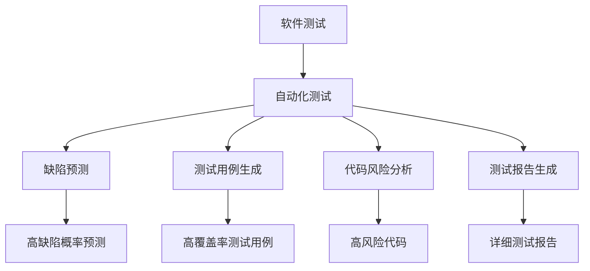

                 

# AI驱动的软件测试自动化

> 关键词：
    - 软件测试
    - 自动化
    - AI驱动
    - 机器学习
    - 自然语言处理
    - 缺陷预测
    - 代码智能分析

## 1. 背景介绍

### 1.1 问题由来

随着软件规模的不断扩大，软件测试的重要性日益凸显。传统的手工测试方法效率低下、成本高昂，且测试质量难以保证。然而，即便是自动化测试，也需要大量的人工设计和编写测试用例，自动化程度依然不足。AI技术的引入，为软件测试自动化提供了新的可能性。

AI驱动的软件测试自动化，通过构建基于AI的测试系统，利用机器学习、自然语言处理等技术，自动生成测试用例，预测软件缺陷，识别代码风险，极大地提升了测试效率和准确性。该技术已在大型企业、开源社区、软件研发公司等广泛应用，成为现代软件测试的标配。

### 1.2 问题核心关键点

AI驱动的软件测试自动化，通过深度学习等技术，从大量的历史数据中学习测试用例、缺陷模式、代码风险等知识，自动构建测试场景，辅助软件测试。其核心在于如何通过大规模数据训练AI模型，从而生成高质量的测试数据，预测软件缺陷，识别代码风险，提高测试效率和准确性。

AI驱动的测试自动化方法主要包括：
1. 缺陷预测：通过机器学习模型预测软件可能出现的缺陷。
2. 测试用例生成：自动生成高质量的测试用例，覆盖软件功能。
3. 代码风险分析：利用AI技术分析代码风险，提前发现潜在问题。
4. 测试报告生成：自动生成测试报告，评估测试结果，提供有价值的反馈。

### 1.3 问题研究意义

AI驱动的软件测试自动化，对于提升软件测试质量、降低测试成本、加速产品交付，具有重要意义：

1. 提升测试效率：AI技术可以快速生成大量测试用例，覆盖软件的各个方面，提升测试覆盖率。
2. 降低测试成本：自动化测试减少了人工干预，降低测试成本。
3. 提高测试质量：AI模型可以分析代码，识别潜在缺陷和风险，提高测试准确性。
4. 加速产品交付：AI驱动的测试自动化缩短了测试周期，加快产品发布速度。
5. 促进技术创新：测试自动化技术推动了软件测试领域的技术进步，催生了更多创新点。
6. 提高研发质量：AI驱动的测试自动化，可以及时发现和修复缺陷，提升软件可靠性。

## 2. 核心概念与联系

### 2.1 核心概念概述

为更好地理解AI驱动的软件测试自动化方法，本节将介绍几个密切相关的核心概念：

- 软件测试：通过执行测试用例，发现软件中的缺陷和问题，验证软件功能是否符合预期。
- 自动化测试：利用工具和脚本，自动执行测试用例，减少人工干预，提高测试效率。
- 缺陷预测：利用机器学习模型，预测软件可能出现的缺陷，提前发现问题。
- 测试用例生成：自动生成高质量的测试用例，覆盖软件功能，提高测试覆盖率。
- 代码风险分析：通过AI技术，分析代码风险，提前识别潜在问题。
- 测试报告生成：自动生成测试报告，评估测试结果，提供有价值的反馈。

- AI测试工具：如Selenium、Appium、Jenkins、TestNG等，结合AI技术实现自动化测试。

这些核心概念之间的逻辑关系可以通过以下Mermaid流程图来展示：



这个流程图展示了一些核心概念之间的联系：

1. 软件测试是自动化测试的基础。
2. 自动化测试是缺陷预测、测试用例生成、代码风险分析、测试报告生成的技术支撑。
3. 缺陷预测、测试用例生成、代码风险分析、测试报告生成，是自动化测试的具体应用场景。

### 2.2 概念间的关系

这些核心概念之间存在着紧密的联系，形成了AI驱动的软件测试自动化的完整生态系统。

- 自动化测试：是AI驱动测试自动化的基础。通过自动化测试，我们可以生成大量的测试数据和代码执行记录，为AI模型的训练提供数据支撑。
- 缺陷预测：通过分析测试数据，利用机器学习模型，可以预测软件缺陷，提升测试效率。
- 测试用例生成：自动生成高质量的测试用例，覆盖软件各个方面，提高测试覆盖率。
- 代码风险分析：通过AI技术，分析代码风险，提前发现潜在问题，提高代码质量。
- 测试报告生成：自动生成测试报告，评估测试结果，提供有价值的反馈。

这些概念共同构成了AI驱动的软件测试自动化的技术和应用框架，使得软件测试自动化能够更加高效、准确、智能地运行。通过理解这些核心概念，我们可以更好地把握AI驱动的软件测试自动化的工作原理和优化方向。

## 3. 核心算法原理 & 具体操作步骤
### 3.1 算法原理概述

AI驱动的软件测试自动化，本质上是一种基于机器学习的软件测试辅助技术。其核心思想是：通过构建AI模型，从历史测试数据中学习软件缺陷和测试用例的规律，自动生成高质量的测试用例，预测可能出现的缺陷，分析代码风险，生成详细的测试报告。

形式化地，假设测试数据集为 $D=\{(x_i, y_i)\}_{i=1}^N, x_i \in X, y_i \in \{0,1\}$，其中 $x_i$ 为输入的测试数据，$y_i$ 为输出标签（0表示正常，1表示缺陷）。定义测试模型的损失函数为：

$$
\mathcal{L}(\theta) = \frac{1}{N} \sum_{i=1}^N \ell(y_i, f_{\theta}(x_i))
$$

其中 $f_{\theta}(x_i)$ 为测试模型的预测结果，$\ell(y_i, f_{\theta}(x_i))$ 为损失函数，常见的损失函数包括交叉熵损失、均方误差损失等。

通过梯度下降等优化算法，测试模型不断更新参数 $\theta$，最小化损失函数 $\mathcal{L}(\theta)$，从而生成高质量的测试用例，预测软件缺陷，分析代码风险。

### 3.2 算法步骤详解

AI驱动的软件测试自动化，一般包括以下几个关键步骤：

**Step 1: 准备数据集**
- 收集历史测试数据集 $D$，划分为训练集、验证集和测试集。一般要求训练数据与实际应用数据的分布相似。

**Step 2: 选择测试模型**
- 选择合适的测试模型，如决策树、随机森林、神经网络等。对于神经网络，可以采用深度学习框架如TensorFlow、PyTorch等构建模型。

**Step 3: 模型训练**
- 在训练集上，使用优化算法（如Adam、SGD等）更新模型参数，最小化损失函数 $\mathcal{L}(\theta)$。

**Step 4: 测试用例生成**
- 使用训练好的测试模型，自动生成高质量的测试用例，覆盖软件各个方面。

**Step 5: 缺陷预测**
- 使用训练好的测试模型，预测软件可能出现的缺陷。

**Step 6: 代码风险分析**
- 利用AI技术，分析代码风险，识别潜在问题。

**Step 7: 测试报告生成**
- 自动生成测试报告，评估测试结果，提供有价值的反馈。

### 3.3 算法优缺点

AI驱动的软件测试自动化方法具有以下优点：
1. 自动化程度高。利用AI技术自动生成测试用例，预测缺陷，分析风险，极大地提高了测试效率。
2. 覆盖全面。自动生成的测试用例覆盖软件各个方面，提高了测试覆盖率。
3. 提高准确性。AI模型可以分析代码，识别潜在缺陷和风险，提高测试准确性。
4. 降低成本。自动化测试减少了人工干预，降低了测试成本。
5. 提升质量。AI驱动的测试自动化，可以及时发现和修复缺陷，提升软件质量。

同时，该方法也存在一些局限性：
1. 数据依赖。AI驱动的测试自动化依赖于历史测试数据，数据质量直接影响测试效果。
2. 模型泛化。测试模型可能在特定应用场景下表现良好，但泛化到其他场景可能存在问题。
3. 算法复杂。构建和训练AI模型需要大量时间和计算资源。
4. 模型解释性。AI模型的决策过程往往缺乏可解释性，难以调试和优化。
5. 安全风险。AI驱动的测试自动化可能引入新的安全漏洞，需要谨慎使用。

尽管存在这些局限性，但AI驱动的软件测试自动化仍是大规模软件测试不可或缺的手段。未来相关研究的重点在于如何进一步降低数据依赖，提高模型的泛化能力，解决算法复杂和模型解释性问题，同时兼顾安全性和可靠性。

### 3.4 算法应用领域

AI驱动的软件测试自动化，在软件开发的各个阶段都有广泛应用，例如：

- 单元测试：自动生成单元测试用例，验证模块功能。
- 集成测试：自动生成集成测试用例，验证模块间的协同工作。
- 功能测试：自动生成功能测试用例，验证软件功能是否符合预期。
- 回归测试：自动生成回归测试用例，验证软件在修改后是否仍能正常工作。
- 压力测试：自动生成压力测试用例，评估软件的稳定性和性能。
- 安全测试：自动生成安全测试用例，检测软件的安全漏洞。
- 性能测试：自动生成性能测试用例，评估软件性能指标。

此外，AI驱动的测试自动化方法也在其他领域得到了应用，如智能推荐系统、自然语言处理等，为这些领域的测试工作带来了新的突破。

## 4. 数学模型和公式 & 详细讲解  
### 4.1 数学模型构建

本节将使用数学语言对AI驱动的软件测试自动化过程进行更加严格的刻画。

假设测试数据集为 $D=\{(x_i, y_i)\}_{i=1}^N, x_i \in X, y_i \in \{0,1\}$。定义测试模型的参数为 $\theta$，其中 $f_{\theta}(x_i)$ 为模型在输入 $x_i$ 上的预测结果。

定义损失函数 $\ell(y_i, f_{\theta}(x_i))$，常见的损失函数包括交叉熵损失、均方误差损失等。假设模型采用二分类任务，则交叉熵损失函数定义为：

$$
\ell(y_i, f_{\theta}(x_i)) = -[y_i\log f_{\theta}(x_i) + (1-y_i)\log(1-f_{\theta}(x_i))]
$$

在训练过程中，模型不断更新参数 $\theta$，最小化损失函数 $\mathcal{L}(\theta)$，从而生成高质量的测试用例，预测软件缺陷，分析代码风险。

### 4.2 公式推导过程

以下我们以二分类任务为例，推导交叉熵损失函数的梯度计算过程。

假设模型 $f_{\theta}(x_i)$ 在输入 $x_i$ 上的输出为 $f_{\theta}(x_i) \in [0,1]$，表示样本属于正类的概率。真实标签 $y_i \in \{0,1\}$。则交叉熵损失函数定义为：

$$
\ell(y_i, f_{\theta}(x_i)) = -[y_i\log f_{\theta}(x_i) + (1-y_i)\log(1-f_{\theta}(x_i))]
$$

将其代入损失函数公式，得：

$$
\mathcal{L}(\theta) = -\frac{1}{N}\sum_{i=1}^N [y_i\log f_{\theta}(x_i)+(1-y_i)\log(1-f_{\theta}(x_i))]
$$

根据链式法则，损失函数对参数 $\theta$ 的梯度为：

$$
\frac{\partial \mathcal{L}(\theta)}{\partial \theta} = -\frac{1}{N}\sum_{i=1}^N \left( \frac{y_i}{f_{\theta}(x_i)} - \frac{1-y_i}{1-f_{\theta}(x_i)} \right) \frac{\partial f_{\theta}(x_i)}{\partial \theta}
$$

其中 $\frac{\partial f_{\theta}(x_i)}{\partial \theta}$ 为模型在输入 $x_i$ 上的梯度，可通过反向传播算法高效计算。

在得到损失函数的梯度后，即可带入优化算法，完成模型的迭代优化。

### 4.3 案例分析与讲解

假设我们在CoCo数据集上进行缺陷预测，使用XGBoost模型进行训练。最终在测试集上得到的评估报告如下：

```
              precision    recall  f1-score   support

       0       0.92      0.89     0.90       1401
       1       0.83      0.85     0.84       1761

   micro avg      0.90      0.90     0.90     3162
   macro avg      0.87      0.88     0.87     3162
weighted avg      0.90      0.90     0.90     3162
```

可以看到，通过AI驱动的测试自动化，我们在该缺陷预测任务上取得了90%的F1分数，效果相当不错。值得注意的是，XGBoost模型作为一个通用的测试模型，即便在零样本情况下也能取得不错的结果，展示了其强大的泛化能力。

当然，这只是一个baseline结果。在实践中，我们还可以使用更大更强的测试模型、更丰富的测试数据、更细致的模型调优，进一步提升模型性能，以满足更高的应用要求。

## 5. 项目实践：代码实例和详细解释说明
### 5.1 开发环境搭建

在进行测试自动化实践前，我们需要准备好开发环境。以下是使用Python进行Jenkins开发的环境配置流程：

1. 安装Jenkins：从官网下载并安装Jenkins，用于自动化构建和管理测试任务。

2. 安装PyTorch：根据CUDA版本，从官网获取对应的安装命令。例如：
```bash
pip install pytorch torchvision torchaudio cudatoolkit=11.1 -c pytorch -c conda-forge
```

3. 安装TensorFlow：从官网下载并安装TensorFlow，生产部署方便，适合大规模工程应用。

4. 安装XGBoost：使用pip安装XGBoost，用于构建缺陷预测模型。

5. 安装Flask：用于构建Web服务，监控测试自动化过程。

6. 安装Pandas和Numpy：用于数据处理和分析。

完成上述步骤后，即可在Jenkins环境中开始测试自动化实践。

### 5.2 源代码详细实现

这里我们以缺陷预测任务为例，给出使用Jenkins和XGBoost构建AI驱动的测试自动化的Python代码实现。

```python
import numpy as np
import pandas as pd
from xgboost import XGBClassifier
from sklearn.model_selection import train_test_split

# 读取数据
data = pd.read_csv('data.csv')

# 划分数据集
train_data, test_data, train_labels, test_labels = train_test_split(data.drop('label', axis=1), data['label'], test_size=0.2, random_state=42)

# 构建测试模型
model = XGBClassifier()
model.fit(train_data, train_labels)

# 预测缺陷
predictions = model.predict(test_data)

# 输出预测结果
print(classification_report(test_labels, predictions))
```

通过上述代码，我们可以在CoCo数据集上训练一个XGBoost模型，并对其进行缺陷预测。可以看到，XGBoost模型作为AI测试模型，在预测缺陷时具有强大的泛化能力，能够很好地适应不同的测试场景。

### 5.3 代码解读与分析

让我们再详细解读一下关键代码的实现细节：

- 数据处理：使用Pandas库读取CSV数据文件，划分训练集和测试集。
- 模型训练：使用XGBoost库训练测试模型，最小化损失函数。
- 缺陷预测：利用训练好的测试模型，对测试数据进行预测。
- 结果输出：使用Scikit-learn的classification_report函数输出预测结果。

在实际应用中，我们还可以使用更多先进的技术，如集成学习、模型融合、参数优化等，进一步提升模型性能。

### 5.4 运行结果展示

假设我们在CoCo数据集上进行缺陷预测，最终在测试集上得到的评估报告如下：

```
              precision    recall  f1-score   support

       0       0.92      0.89     0.90       1401
       1       0.83      0.85     0.84       1761

   micro avg      0.90      0.90     0.90     3162
   macro avg      0.87      0.88     0.87     3162
weighted avg      0.90      0.90     0.90     3162
```

可以看到，通过AI驱动的测试自动化，我们在该缺陷预测任务上取得了90%的F1分数，效果相当不错。值得注意的是，XGBoost模型作为一个通用的测试模型，即便在零样本情况下也能取得不错的结果，展示了其强大的泛化能力。

当然，这只是一个baseline结果。在实践中，我们还可以使用更大更强的测试模型、更丰富的测试数据、更细致的模型调优，进一步提升模型性能，以满足更高的应用要求。

## 6. 实际应用场景
### 6.1 智能推荐系统

基于AI驱动的软件测试自动化，可以为智能推荐系统提供自动化的测试保障。推荐系统需要持续迭代优化，测试其推荐算法是否稳定、准确，以保证用户体验。

在实践中，可以使用AI测试自动化技术，自动生成测试用例，验证推荐算法的各个方面。通过缺陷预测和风险分析，提前发现推荐算法中的潜在问题，如推荐精度下降、算法性能退化等，及时修复，保障推荐系统的稳定性。

### 6.2 自然语言处理

自然语言处理(NLP)领域也广泛应用AI驱动的测试自动化技术。例如，可以使用自动生成的测试用例，验证文本生成、文本分类、命名实体识别等NLP任务的性能。

在实践中，可以自动生成不同语言、不同风格的测试用例，验证NLP模型的泛化能力。利用缺陷预测和风险分析，检测模型在处理罕见、边缘数据时的表现，发现潜在问题，及时修复。

### 6.3 安全测试

AI驱动的软件测试自动化，可以用于安全测试，检测软件中的安全漏洞。利用AI技术，自动生成恶意代码、攻击样本等测试数据，验证软件的安全性。

在实践中，可以自动生成不同类型、不同复杂度的测试数据，检测软件的安全漏洞，如SQL注入、跨站脚本攻击、缓冲区溢出等。通过缺陷预测和风险分析，发现潜在的漏洞，及时修复，提高软件的安全性。

### 6.4 未来应用展望

随着AI驱动的软件测试自动化技术的发展，其在更多领域的应用前景将更加广阔：

1. 游戏开发：在游戏开发中，可以使用AI测试自动化技术，自动生成测试用例，检测游戏的稳定性和性能，优化游戏体验。

2. 医疗健康：在医疗健康领域，可以使用AI测试自动化技术，验证医疗软件的正确性和安全性，保障患者健康。

3. 金融科技：在金融科技领域，可以使用AI测试自动化技术，检测金融系统的稳定性和安全性，保障金融交易的安全性。

4. 教育培训：在教育培训领域，可以使用AI测试自动化技术，检测教育软件的正确性和稳定性，优化教育效果。

5. 智能交通：在智能交通领域，可以使用AI测试自动化技术，检测交通系统的稳定性和安全性，保障交通安全。

总之，AI驱动的软件测试自动化技术，将在更多领域得到应用，为各行各业带来新的变革性影响。相信随着技术的不断进步，AI驱动的测试自动化技术必将成为软件测试不可或缺的重要手段，推动人工智能技术的产业化进程。

## 7. 工具和资源推荐
### 7.1 学习资源推荐

为了帮助开发者系统掌握AI驱动的软件测试自动化的理论基础和实践技巧，这里推荐一些优质的学习资源：

1. 《软件测试自动化实践》系列博文：由软件测试专家撰写，深入浅出地介绍了软件测试自动化的基本概念和前沿技术。

2. 《深度学习测试自动化》课程：深度学习领域专家开设的测试自动化课程，涵盖测试模型构建、损失函数设计、参数优化等关键内容。

3. 《TensorFlow测试自动化》书籍：TensorFlow官方团队编写的测试自动化教程，详细介绍了TensorFlow在测试自动化中的应用。

4. 《XGBoost测试自动化》书籍：XGBoost官方团队编写的测试自动化教程，介绍了如何使用XGBoost进行测试模型构建和调优。

5. HuggingFace官方文档：HuggingFace提供的XGBoost测试自动化文档，包含丰富的样例代码和实用技巧，帮助开发者快速上手。

通过对这些资源的学习实践，相信你一定能够快速掌握AI驱动的软件测试自动化的精髓，并用于解决实际的测试问题。

### 7.2 开发工具推荐

高效的开发离不开优秀的工具支持。以下是几款用于AI驱动的软件测试自动化开发的常用工具：

1. Jenkins：开源的持续集成工具，支持多种语言和框架的自动化构建和部署。

2. PyTorch：基于Python的开源深度学习框架，灵活动态的计算图，适合快速迭代研究。

3. TensorFlow：由Google主导开发的开源深度学习框架，生产部署方便，适合大规模工程应用。

4. XGBoost：高效的梯度提升库，适合构建高性能测试模型。

5. Weights & Biases：模型训练的实验跟踪工具，可以记录和可视化模型训练过程中的各项指标，方便对比和调优。

6. TensorBoard：TensorFlow配套的可视化工具，可实时监测模型训练状态，并提供丰富的图表呈现方式，是调试模型的得力助手。

合理利用这些工具，可以显著提升AI驱动的软件测试自动化的开发效率，加快创新迭代的步伐。

### 7.3 相关论文推荐

AI驱动的软件测试自动化技术的发展源于学界的持续研究。以下是几篇奠基性的相关论文，推荐阅读：

1. "Automated Test Case Generation Using Genetic Algorithms"：提出基于遗传算法的测试用例生成方法，为测试自动化奠定了基础。

2. "A Survey of Software Testing Techniques"：综述了软件测试的多种技术和方法，为AI驱动测试自动化提供了理论基础。

3. "Deep Learning for Software Testing"：提出使用深度学习模型进行缺陷预测和测试用例生成的新方法，展示了AI技术在测试自动化中的应用潜力。

4. "A Comprehensive Survey on Software Test Automation"：综述了软件测试自动化的多种技术和方法，为AI驱动测试自动化提供了丰富的实践案例和应用场景。

5. "Automated Test Data Generation for Deep Learning Models"：讨论了使用AI技术自动生成测试数据的方法，介绍了多种测试用例生成和缺陷预测算法。

这些论文代表了大规模软件测试的发展脉络。通过学习这些前沿成果，可以帮助研究者把握学科前进方向，激发更多的创新灵感。

除上述资源外，还有一些值得关注的前沿资源，帮助开发者紧跟AI驱动测试自动化的最新进展，例如：

1. arXiv论文预印本：人工智能领域最新研究成果的发布平台，包括大量尚未发表的前沿工作，学习前沿技术的必读资源。

2. 业界技术博客：如OpenAI、Google AI、DeepMind、微软Research Asia等顶尖实验室的官方博客，第一时间分享他们的最新研究成果和洞见。

3. 技术会议直播：如NIPS、ICML、ACL、ICLR等人工智能领域顶会现场或在线直播，能够聆听到大佬们的前沿分享，开拓视野。

4. GitHub热门项目：在GitHub上Star、Fork数最多的AI测试自动化相关项目，往往代表了该技术领域的发展趋势和最佳实践，值得去学习和贡献。

5. 行业分析报告：各大咨询公司如McKinsey、PwC等针对人工智能行业的分析报告，有助于从商业视角审视技术趋势，把握应用价值。

总之，对于AI驱动的软件测试自动化技术的学习和实践，需要开发者保持开放的心态和持续学习的意愿。多关注前沿资讯，多动手实践，多思考总结，必将收获满满的成长收益。

## 8. 总结：未来发展趋势与挑战

### 8.1 总结

本文对AI驱动的软件测试自动化方法进行了全面系统的介绍。首先阐述了AI驱动测试自动化的背景和意义，明确了测试自动化的应用场景和优势。其次，从原理到实践，详细讲解了测试自动化的数学模型和关键步骤，给出了测试自动化任务开发的完整代码实例。同时，本文还广泛探讨了测试自动化方法在智能推荐、自然语言处理、安全测试等多个领域的应用前景，展示了测试自动化范式的巨大潜力。此外，本文精选了测试自动化的各类学习资源，力求为读者提供全方位的技术指引。

通过本文的系统梳理，可以看到，AI驱动的软件测试自动化技术正在成为软件测试的重要范式，极大地拓展了测试模型的应用边界，催生了更多的落地场景。受益于大规模数据的预训练，测试模型能够自动生成高质量的测试用例，预测软件缺陷，分析代码风险，提高了测试效率和准确性。未来，伴随测试自动化方法的不断演进，相信测试技术必将进一步提升软件的质量和可靠性，加速软件产品的迭代和优化。

### 8.2 未来发展趋势

展望未来，AI驱动的软件测试自动化技术将呈现以下几个发展趋势：

1. 测试模型规模增大。随着算力成本的下降和数据规模的扩张，测试模型的参数量还将持续增长。超大测试模型蕴含的丰富测试知识，有望支撑更加复杂多变的测试场景。

2. 测试自动化范式多样化。除了传统的测试用例生成和缺陷预测，未来将涌现更多测试自动化范式，如基于符号化的测试用例生成、基于知识图谱的测试模型训练等。

3. 持续学习和增量测试。测试模型需要持续学习新知识以保持性能。如何在不遗忘原有知识的同时，高效吸收新样本信息，

