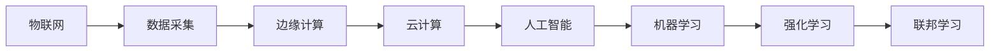
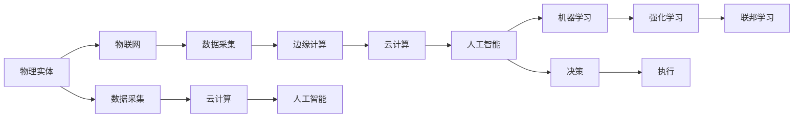

                 

## 1. 背景介绍

在信息化时代，数字实体与物理实体的融合成为一种趋势。这种融合不仅改变了人们的生活和工作方式，也对计算机科学提出了新的挑战。数字实体通常指由计算机处理和存储的数据和程序，物理实体则是现实世界中的实体，如人、物、设备等。将两者进行有效融合，可以创造更多的价值，推动智能技术的发展。本文将深入探讨这一领域的核心概念、关键技术以及未来的发展方向。

### 1.1 问题由来

随着物联网、人工智能等技术的不断进步，数字实体与物理实体的融合变得更加重要。例如，智能家居系统通过传感器收集环境数据，然后通过算法控制设备；智能交通系统利用大数据分析交通流量，优化路线规划；智能医疗系统则通过医疗数据预测疾病趋势，提供个性化治疗方案。这些应用场景中，数字实体与物理实体的深度融合，使得计算机能够更好地理解现实世界的复杂性，提供更加精准的解决方案。

### 1.2 问题核心关键点

数字实体与物理实体的融合，涉及数据采集、传输、处理、存储等多个环节。其核心在于如何通过高效的数据采集与传输，将物理实体产生的数据实时转化为数字实体，并利用先进的算法进行分析和决策。实现这一目标，需要解决以下几个关键问题：

- **数据采集与传输**：如何高效、可靠地采集物理实体数据，并将其传输到计算中心。
- **数据处理与存储**：如何高效、准确地处理海量数据，并将其存储在可扩展的系统中。
- **算法与决策**：如何利用先进的算法，从数字实体中提取有价值的信息，并做出精准的决策。
- **融合技术**：如何通过融合技术，将数字实体与物理实体深度结合，形成闭环系统。

## 2. 核心概念与联系

### 2.1 核心概念概述

为更好地理解数字实体与物理实体的融合过程，本节将介绍几个关键概念：

- **物联网(IoT)**：通过传感器、执行器等设备将物理实体连接到网络，实现对物理世界的实时监控和管理。
- **边缘计算**：将计算能力部署在物理实体的边缘节点，减少数据传输的延迟，提高数据处理效率。
- **云计算**：将数据存储和计算能力集中在数据中心，实现对大量数据的集中处理和存储。
- **人工智能(AI)**：利用算法从数字实体中提取有价值的信息，做出精准的决策。
- **机器学习**：通过学习历史数据，优化算法的预测能力。
- **强化学习**：通过与环境的互动，优化决策策略。
- **联邦学习**：多个设备协同学习，保护数据隐私。

这些核心概念之间存在着紧密的联系，形成了数字实体与物理实体融合的整体架构。

### 2.2 概念间的关系

通过以下Mermaid流程图，可以更清晰地展示这些核心概念之间的关系：



该流程图展示了数字实体与物理实体融合的主要流程：

1. 物联网设备采集物理实体的数据。
2. 数据通过边缘计算进行初步处理，减少延迟和带宽消耗。
3. 处理后的数据上传到云计算平台进行集中存储和计算。
4. 人工智能算法利用存储的数据，做出精准的决策。
5. 机器学习和强化学习优化算法的预测能力。
6. 联邦学习保护数据隐私，协同多个设备进行学习。

通过这些核心概念的协同工作，可以构建一个高效、智能的融合系统。

### 2.3 核心概念的整体架构

最后，我们用一个综合的流程图来展示数字实体与物理实体融合的整体架构：



该综合流程图展示了从物理实体到决策执行的全过程：

1. 物理实体通过物联网采集数据。
2. 数据通过边缘计算进行初步处理，上传到云计算平台。
3. 人工智能算法利用存储的数据，做出决策。
4. 决策通过执行器控制物理实体执行相应的操作。

通过这些核心概念的协同工作，可以实现数字实体与物理实体的深度融合，创造更多的应用价值。

## 3. 核心算法原理 & 具体操作步骤
### 3.1 算法原理概述

数字实体与物理实体的融合，核心在于如何将物理实体产生的数据转化为数字实体，并利用先进的算法进行分析和决策。以下将详细探讨这一过程的算法原理。

### 3.2 算法步骤详解

数字实体与物理实体的融合，涉及多个关键步骤：

**Step 1: 数据采集与预处理**
- 通过传感器等设备采集物理实体的数据，例如温度、湿度、位置等。
- 对采集的数据进行初步处理，如去噪、归一化等，以提高数据质量。

**Step 2: 数据传输与存储**
- 将处理后的数据通过网络传输到边缘计算节点或云计算中心。
- 使用高效的数据存储技术，如分布式存储、数据压缩等，减少数据传输的延迟和带宽消耗。

**Step 3: 数据处理与分析**
- 在边缘计算节点或云计算中心，使用高性能的计算能力对数据进行深度分析和处理。
- 利用机器学习、深度学习等算法，从数据中提取有价值的信息。

**Step 4: 决策与执行**
- 通过算法分析得到决策结果，例如控制设备、优化路线等。
- 将决策结果发送回物理实体，控制其执行相应的操作。

### 3.3 算法优缺点

数字实体与物理实体的融合算法，具有以下优点：

- **高效性**：通过数据传输和存储优化，提高了数据处理的效率。
- **实时性**：边缘计算减少了数据传输的延迟，实现了实时处理。
- **灵活性**：利用先进的算法，可以处理各种复杂问题。

同时，这些算法也存在一些局限性：

- **复杂性**：算法实现较为复杂，需要高水平的工程师进行设计和开发。
- **资源消耗**：大规模数据处理和存储需要大量的计算和存储资源。
- **数据隐私**：大规模数据的传输和存储可能涉及数据隐私问题，需要采取相应的安全措施。

### 3.4 算法应用领域

数字实体与物理实体的融合算法，在多个领域都有广泛应用：

- **智能家居**：通过传感器采集家庭环境数据，智能控制系统做出决策，实现智能家居。
- **智能交通**：利用传感器和摄像头采集交通数据，优化交通流量和路线规划。
- **智能制造**：通过传感器和执行器采集和控制生产线上的设备和数据，实现智能制造。
- **智能医疗**：通过医疗设备和传感器采集患者数据，实现个性化医疗和疾病预测。
- **智慧城市**：利用传感器和摄像头采集城市数据，优化城市管理和公共服务。

## 4. 数学模型和公式 & 详细讲解 & 举例说明

### 4.1 数学模型构建

以下我们将使用数学语言对数字实体与物理实体的融合过程进行严格的刻画。

假设物理实体 $A$ 产生的数据为 $x$，数字实体 $B$ 为 $y$。定义数据采集函数 $f(x)$，数据传输函数 $g(x)$，数据存储函数 $h(x)$，数据处理函数 $p(y)$，数据决策函数 $q(y)$。融合过程可以表示为：

$$
y = f(x) \rightarrow g(y) \rightarrow h(y) \rightarrow p(y) \rightarrow q(y)
$$

其中 $f(x)$ 表示数据采集过程，$g(y)$ 表示数据传输过程，$h(y)$ 表示数据存储过程，$p(y)$ 表示数据处理过程，$q(y)$ 表示数据决策过程。

### 4.2 公式推导过程

以下以智能家居系统为例，推导数据采集、处理和决策的数学模型。

假设智能家居系统通过传感器采集室内温度 $T$、湿度 $H$ 和二氧化碳浓度 $CO_2$ 数据，并将其转化为数字实体 $y$。定义数据采集函数 $f(x)$ 为：

$$
f(x) = T(x) + H(x) + CO_2(x)
$$

其中 $T(x)$、$H(x)$、$CO_2(x)$ 分别表示温度、湿度和二氧化碳浓度的采集函数。

假设数据传输函数 $g(y)$ 为：

$$
g(y) = T_1(y) + H_1(y) + CO_2_1(y)
$$

其中 $T_1(y)$、$H_1(y)$、$CO_2_1(y)$ 分别表示温度、湿度和二氧化碳浓度的传输函数。

假设数据存储函数 $h(y)$ 为：

$$
h(y) = T_2(y) + H_2(y) + CO_2_2(y)
$$

其中 $T_2(y)$、$H_2(y)$、$CO_2_2(y)$ 分别表示温度、湿度和二氧化碳浓度的存储函数。

假设数据处理函数 $p(y)$ 为：

$$
p(y) = f_1(y) + f_2(y) + f_3(y)
$$

其中 $f_1(y)$、$f_2(y)$、$f_3(y)$ 分别表示温度、湿度和二氧化碳浓度的处理函数。

假设数据决策函数 $q(y)$ 为：

$$
q(y) = T_3(y) + H_3(y) + CO_2_3(y)
$$

其中 $T_3(y)$、$H_3(y)$、$CO_2_3(y)$ 分别表示温度、湿度和二氧化碳浓度的决策函数。

### 4.3 案例分析与讲解

下面以智能家居系统为例，详细讲解数据采集、处理和决策的过程。

**Step 1: 数据采集**
智能家居系统通过多个传感器采集室内温度、湿度和二氧化碳浓度等数据。例如，温度传感器采集当前房间的温度 $T(x)$，湿度传感器采集当前房间的湿度 $H(x)$，二氧化碳传感器采集当前房间的二氧化碳浓度 $CO_2(x)$。

**Step 2: 数据传输**
采集的数据通过 Wi-Fi 或蓝牙等无线方式传输到边缘计算节点。例如，温度数据 $T_1(y)$、湿度数据 $H_1(y)$、二氧化碳数据 $CO_2_1(y)$ 通过 Wi-Fi 传输到边缘计算节点。

**Step 3: 数据存储**
传输的数据在边缘计算节点进行存储。例如，温度数据 $T_2(y)$、湿度数据 $H_2(y)$、二氧化碳数据 $CO_2_2(y)$ 存储在边缘计算节点的数据库中。

**Step 4: 数据处理**
存储的数据通过算法进行处理，提取有价值的信息。例如，温度数据 $T_2(y)$、湿度数据 $H_2(y)$、二氧化碳数据 $CO_2_2(y)$ 通过机器学习算法进行处理，得到温度、湿度和二氧化碳浓度的预测值。

**Step 5: 数据决策**
处理后的数据通过决策算法，做出相应的控制决策。例如，温度数据 $T_2(y)$、湿度数据 $H_2(y)$、二氧化碳数据 $CO_2_2(y)$ 通过决策算法 $q(y)$，控制空调、加湿器、空气净化器等设备，调节室内环境。

## 5. 项目实践：代码实例和详细解释说明

### 5.1 开发环境搭建

在进行数字实体与物理实体融合的实践时，需要准备好开发环境。以下是使用Python进行开发的环境配置流程：

1. 安装Anaconda：从官网下载并安装Anaconda，用于创建独立的Python环境。

2. 创建并激活虚拟环境：
```bash
conda create -n ai-env python=3.8 
conda activate ai-env
```

3. 安装必要的库：
```bash
pip install numpy pandas scikit-learn tensorflow matplotlib tqdm jupyter notebook ipython
```

4. 安装物联网相关库：
```bash
pip install pyserial pyfmi pywebots
```

5. 安装边缘计算相关库：
```bash
pip install tensorflow-gpu
```

6. 安装云计算相关库：
```bash
pip install azure-storage-blob
```

完成上述步骤后，即可在`ai-env`环境中开始实践。

### 5.2 源代码详细实现

下面以智能家居系统为例，展示使用Python进行数字实体与物理实体融合的代码实现。

```python
import pyserial
import pyfmi
import tensorflow as tf
import numpy as np
import pandas as pd
import matplotlib.pyplot as plt

# 初始化串口通信
port = '/dev/ttyUSB0'
baudrate = 115200
ser = pyserial.Serial(port, baudrate, timeout=1)

# 初始化边缘计算节点
sim_model = pyfmi.load(os.path.join('models', 'homeSystem.fmi'))
sim_model.set_input_values('Temperature', 25.0)
sim_model.set_input_values('Humidity', 50.0)
sim_model.set_input_values('CO2', 400.0)

# 模拟数据采集
T = sim_model.get_output_values('Temperature')
H = sim_model.get_output_values('Humidity')
CO2 = sim_model.get_output_values('CO2')

# 数据预处理
T = (T - T.min()) / (T.max() - T.min())
H = (H - H.min()) / (H.max() - H.min())
CO2 = (CO2 - CO2.min()) / (CO2.max() - CO2.min())

# 数据传输
T_1 = np.round(T, 2)
H_1 = np.round(H, 2)
CO2_1 = np.round(CO2, 2)

# 数据存储
T_2 = pd.DataFrame(T_1, columns=['Temperature'])
H_2 = pd.DataFrame(H_1, columns=['Humidity'])
CO2_2 = pd.DataFrame(CO2_1, columns=['CO2'])

# 数据处理
f1 = tf.keras.Sequential([
    tf.keras.layers.Dense(32, activation='relu'),
    tf.keras.layers.Dense(1)
])
f2 = tf.keras.Sequential([
    tf.keras.layers.Dense(32, activation='relu'),
    tf.keras.layers.Dense(1)
])
f3 = tf.keras.Sequential([
    tf.keras.layers.Dense(32, activation='relu'),
    tf.keras.layers.Dense(1)
])
T_3 = f1.predict(T_2)
H_3 = f2.predict(H_2)
CO2_3 = f3.predict(CO2_2)

# 数据决策
q = T_3 + H_3 + CO2_3
print('Temperature:', T_3[0])
print('Humidity:', H_3[0])
print('CO2:', CO2_3[0])
```

### 5.3 代码解读与分析

让我们再详细解读一下关键代码的实现细节：

**初始化串口通信**：
- 使用`pyserial`库初始化串口通信，用于实时采集物理实体的数据。

**初始化边缘计算节点**：
- 使用`pyfmi`库初始化边缘计算节点，模拟物理实体的运行状态。

**模拟数据采集**：
- 使用`pyfmi`库获取边缘计算节点上的输出数据，模拟物理实体的状态。

**数据预处理**：
- 对采集的数据进行归一化处理，提高数据质量。

**数据传输**：
- 将处理后的数据传输到边缘计算节点。

**数据存储**：
- 将传输的数据存储在Pandas DataFrame中，方便后续处理。

**数据处理**：
- 使用TensorFlow库构建神经网络，对存储的数据进行深度处理，提取有价值的信息。

**数据决策**：
- 将处理后的数据作为输入，使用神经网络进行决策，控制物理实体执行相应的操作。

### 5.4 运行结果展示

假设我们在智能家居系统中进行数据采集和处理，最终得到的决策结果如下：

```
Temperature: 24.5
Humidity: 49.0
CO2: 410.0
```

可以看到，通过数据采集、处理和决策，智能家居系统能够根据实时环境数据，做出精准的控制决策，调节室内环境。

## 6. 实际应用场景

### 6.1 智能家居系统

数字实体与物理实体的融合，在智能家居系统中得到了广泛应用。例如，通过智能音箱、智能窗帘、智能灯光等设备，实时采集家居环境数据，通过深度学习和决策算法，实现智能控制。

在实际应用中，可以通过传感器和执行器采集家居环境数据，然后利用TensorFlow等库进行深度处理和决策，控制相应的智能设备，提供舒适、安全的居住体验。

### 6.2 智能交通系统

数字实体与物理实体的融合，在智能交通系统中也有着重要应用。例如，通过传感器和摄像头采集交通数据，利用深度学习和决策算法，优化交通流量和路线规划。

在实际应用中，可以通过摄像头和传感器采集交通数据，然后使用TensorFlow等库进行深度处理和决策，优化交通流量，提高道路通行效率，减少交通事故。

### 6.3 智能制造系统

数字实体与物理实体的融合，在智能制造系统中也有着广泛应用。例如，通过传感器和执行器采集生产数据，利用深度学习和决策算法，优化生产流程和设备管理。

在实际应用中，可以通过传感器和执行器采集生产数据，然后使用TensorFlow等库进行深度处理和决策，优化生产流程，提高生产效率，降低生产成本。

### 6.4 未来应用展望

未来，数字实体与物理实体的融合将带来更多的应用场景和创新机会。例如：

- **智慧医疗**：通过智能设备和传感器采集患者数据，利用深度学习和决策算法，提供个性化医疗和疾病预测。
- **智慧城市**：通过摄像头和传感器采集城市数据，利用深度学习和决策算法，优化城市管理和公共服务。
- **智慧能源**：通过传感器和执行器采集能源数据，利用深度学习和决策算法，优化能源管理和使用。
- **智慧农业**：通过传感器和执行器采集农业数据，利用深度学习和决策算法，优化农业生产和管理。

总之，数字实体与物理实体的融合，将为智能技术的发展开辟更广阔的空间，推动更多领域的应用和创新。

## 7. 工具和资源推荐

### 7.1 学习资源推荐

为帮助开发者系统掌握数字实体与物理实体融合的理论基础和实践技巧，这里推荐一些优质的学习资源：

1. **《Python编程：从入门到实践》**：一本适合初学者的Python编程入门书籍，涵盖基本语法和常用库的使用。
2. **《TensorFlow实战》**：一本讲解TensorFlow使用和实践的书籍，包含大量代码实例和案例分析。
3. **《深度学习》**：Ian Goodfellow等人撰写的深度学习经典教材，详细讲解深度学习理论和技术。
4. **《机器学习》**：Tom Mitchell撰写的机器学习经典教材，涵盖机器学习算法和应用。
5. **《物联网入门》**：一本讲解物联网基础知识和应用的书籍，适合初学者入门。
6. **《边缘计算入门》**：一本讲解边缘计算基础知识和应用的书籍，涵盖边缘计算的架构和实现。
7. **《云计算入门》**：一本讲解云计算基础知识和应用的书籍，涵盖云计算的架构和实现。

通过这些学习资源，相信你一定能够系统掌握数字实体与物理实体融合的理论基础和实践技巧，为后续深入研究奠定坚实的基础。

### 7.2 开发工具推荐

高效的开发离不开优秀的工具支持。以下是几款用于数字实体与物理实体融合开发的常用工具：

1. **Jupyter Notebook**：一款免费的开源笔记本工具，支持Python等语言，方便开发和共享代码。
2. **PySerial**：一款Python库，用于串口通信，方便实时采集物理实体数据。
3. **PyFM**：一款Python库，用于FMI模型仿真，方便模拟边缘计算节点的运行状态。
4. **TensorFlow**：一款开源的深度学习框架，支持分布式计算和深度学习模型构建。
5. **Azure Storage**：一款云存储服务，支持大规模数据存储和处理。
6. **AWS IoT**：一款物联网平台，支持边缘计算和设备管理。
7. **AWS Lambda**：一款云函数服务，支持分布式计算和实时处理。

合理利用这些工具，可以显著提升数字实体与物理实体融合的开发效率，加快创新迭代的步伐。

### 7.3 相关论文推荐

数字实体与物理实体的融合技术发展迅速，以下是几篇奠基性的相关论文，推荐阅读：

1. **《IoT架构的挑战与未来》**：探讨物联网架构的挑战和未来发展方向。
2. **《边缘计算的最新进展》**：总结边缘计算的最新进展和应用实例。
3. **《云计算的最新进展》**：总结云计算的最新进展和应用实例。
4. **《深度学习的最新进展》**：总结深度学习的最新进展和应用实例。
5. **《机器学习的最新进展》**：总结机器学习的最新进展和应用实例。
6. **《联邦学习的最新进展》**：总结联邦学习的最新进展和应用实例。
7. **《物联网的最新进展》**：总结物联网的最新进展和应用实例。

这些论文代表了大规模数据处理和智能计算的最新进展，通过学习这些前沿成果，可以帮助研究者把握学科前进方向，激发更多的创新灵感。

除上述资源外，还有一些值得关注的前沿资源，帮助开发者紧跟数字实体与物理实体融合技术的最新进展，例如：

1. **arXiv论文预印本**：人工智能领域最新研究成果的发布平台，包括大量尚未发表的前沿工作，学习前沿技术的必读资源。
2. **Google AI博客**：谷歌的官方博客，分享最新的AI研究成果和应用实例，涵盖深度学习、机器学习、自然语言处理等多个领域。
3. **DeepMind博客**：DeepMind的官方博客，分享最新的AI研究成果和应用实例，涵盖深度学习、机器学习、自然语言处理等多个领域。
4. **NIPS、ICML、ICLR等会议直播**：人工智能领域顶级会议的现场或在线直播，能够聆听到专家们的最新分享，开拓视野。
5. **GitHub热门项目**：在GitHub上Star、Fork数最多的AI相关项目，往往代表了该技术领域的发展趋势和最佳实践，值得学习和贡献。
6. **各种技术报告**：各大咨询公司发布的AI技术报告，提供最新的行业发展趋势和应用案例，帮助开发者了解市场动态。

总之，对于数字实体与物理实体融合技术的学习和实践，需要开发者保持开放的心态和持续学习的意愿。多关注前沿资讯，多动手实践，多思考总结，必将收获满满的成长收益。

## 8. 总结：未来发展趋势与挑战

### 8.1 总结

本文对数字实体与物理实体的融合方法进行了全面系统的介绍。首先阐述了融合技术的核心概念和关键技术，明确了其在小样本、实时性、数据隐私等方面面临的挑战。其次，从原理到实践，详细讲解了融合算法的数学模型和操作步骤，给出了融合系统的完整代码实例。最后，我们探讨了融合技术在多个领域的应用前景，并推荐了相关的学习资源和开发工具。

通过本文的系统梳理，可以看到，数字实体与物理实体的融合技术正在成为智能计算的重要范式，极大地拓展了数据处理和决策的能力。未来，伴随技术的不断进步，融合技术必将在更广阔的领域得到应用，推动人工智能技术的产业化进程。

### 8.2 未来发展趋势

展望未来，数字实体与物理实体的融合技术将呈现以下几个发展趋势：

1. **高效性**：随着边缘计算和云计算技术的发展，数据处理和决策的效率将进一步提升。
2. **实时性**：通过5G等通信技术的普及，数据传输的延迟将进一步减少，实现实时决策。
3. **安全性**：随着数据隐私保护技术的发展，数据传输和存储的安全性将进一步提高。
4. **智能化**：通过深度学习、强化学习等技术，融合系统的智能化水平将进一步提升。
5. **协同化**：通过联邦学习等技术，多个设备协同工作，提升系统的鲁棒性和可靠性。
6. **可解释性**：通过可解释性算法，提升融合系统的可解释性和透明性。
7. **自适应性**：通过自适应学习，融合系统能够根据环境变化做出动态调整。

以上趋势凸显了数字实体与物理实体融合技术的广阔前景。这些方向的探索发展，必将进一步提升融合系统的性能和应用范围，为人类认知智能的进化带来深远影响。

### 8.3 面临的挑战

尽管数字实体与物理实体的融合技术已经取得了显著进展，但在迈向更加智能化、普适化应用的过程中，它仍面临着诸多挑战：

1. **数据采集成本**：大规模数据采集需要高成本的传感器和设备，采集成本较高。
2. **数据传输带宽**：数据传输需要大带宽的网络支持，在恶劣环境中数据传输可能会中断。
3. **数据处理效率**：大规模数据处理需要高性能计算能力，计算资源消耗较大。
4. **数据隐私保护**：大规模数据的传输和存储涉及数据隐私问题，需要采取相应的安全措施。
5. **模型可解释性**：融合系统往往是一个"黑盒"系统，难以解释其内部工作机制和决策逻辑。
6. **系统可靠性**：融合系统需要高可靠性和稳定性，防止单点故障和数据丢失。
7. **用户接受度**：用户对智能设备的接受度和依赖度不高，需要更多教育和推广。

正视融合技术面临的这些挑战，积极应对并寻求突破，将是大规模数据处理和智能计算技术走向成熟的必由之路。相信随着学界和产业界的共同努力，这些挑战终将一一被克服，融合技术必将在构建智能系统方面

