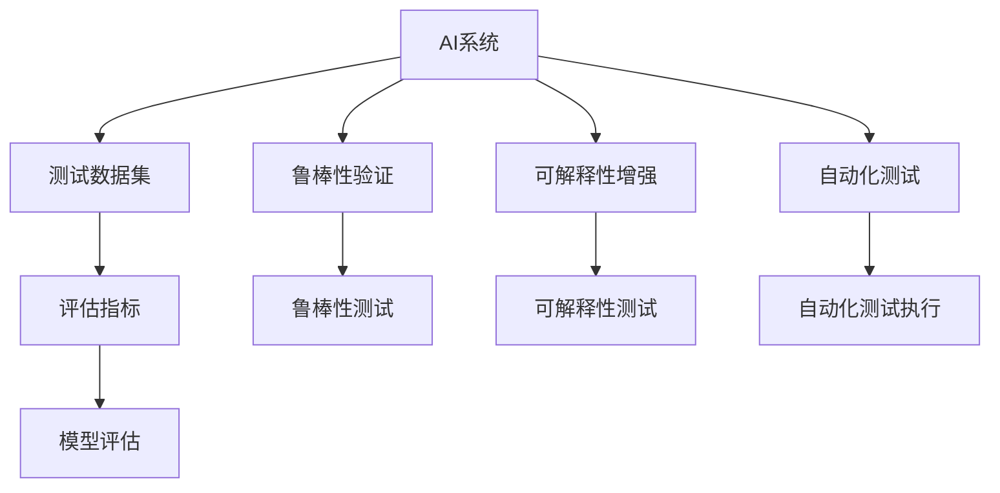
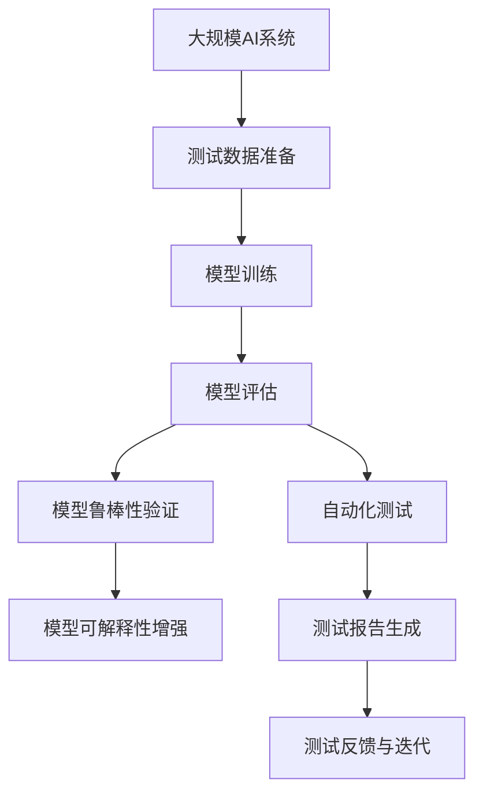

                 

# AI测试与质量保证原理与代码实战案例讲解

## 1. 背景介绍

### 1.1 问题由来

随着人工智能技术的快速发展，AI系统在金融、医疗、自动驾驶、推荐系统等领域的应用越来越广泛。然而，与传统软件系统相比，AI系统的复杂性、不确定性和非黑盒特性使其测试和质量保证变得更加复杂和重要。如何设计高效的AI测试方法和评估机制，确保AI系统的可靠性、稳定性和安全性，成为当下研究的热点话题。

### 1.2 问题核心关键点

AI测试与质量保证的核心在于如何对AI模型进行全面、精确的评估和验证，确保其正确性、鲁棒性和可解释性。具体来说，关键点包括：

- **测试数据准备**：如何构建高质量、多样化的测试数据集，涵盖各种异常和边缘情况。
- **模型评估指标**：如何设计科学的评估指标，全面衡量AI模型的性能。
- **模型鲁棒性验证**：如何检测和验证AI模型对输入数据的鲁棒性，避免误导性或不一致的输出。
- **模型可解释性**：如何增强AI模型的可解释性，使其决策过程透明、可理解。
- **自动化测试**：如何利用自动化测试技术，提高测试效率，减少人为错误。

### 1.3 问题研究意义

随着AI系统的普及和应用，其测试与质量保证的重要性日益凸显。AI测试与质量保证的研究不仅有助于提升AI系统的可靠性，还能促进AI技术在各个领域的落地应用。具体来说，其研究意义如下：

- **降低成本**：通过系统化的测试和质量保证，可以显著降低AI系统开发和维护的成本。
- **提升质量**：确保AI系统的性能和安全性，避免因模型缺陷或数据问题导致的严重后果。
- **增强信任**：通过透明、可解释的测试结果，增强用户和开发团队对AI系统的信任。
- **促进创新**：AI测试与质量保证的研究有助于发现和解决AI系统中的问题，促进技术进步和创新。

## 2. 核心概念与联系

### 2.1 核心概念概述

为了深入理解AI测试与质量保证，本节将介绍几个核心概念：

- **AI系统**：指的是由机器学习、深度学习等技术构建的智能系统，包括但不限于图像识别、自然语言处理、推荐系统等。
- **测试数据集**：用于评估和验证AI模型的数据集，涵盖正常、异常和边缘情况。
- **评估指标**：用于衡量AI模型性能的指标，如准确率、召回率、F1分数、均方误差等。
- **鲁棒性**：指AI模型对输入数据变化的适应性和稳定性，避免因数据扰动导致的不一致输出。
- **可解释性**：指AI模型输出结果的可解释性，使开发团队和用户能够理解模型的决策过程。
- **自动化测试**：通过编写脚本或使用测试工具，自动化执行测试用例和评估过程，提高测试效率。

### 2.2 概念间的关系

这些核心概念之间的联系可以通过以下Mermaid流程图来展示：



这个流程图展示了AI测试与质量保证的基本流程和核心概念之间的关系。

### 2.3 核心概念的整体架构

最后，我们用一个综合的流程图来展示这些核心概念在大规模AI系统测试与质量保证中的整体架构：



这个综合流程图展示了从测试数据准备到模型训练、评估、鲁棒性验证、可解释性增强和自动化测试的完整过程，为大规模AI系统的测试与质量保证提供了清晰的指导。

## 3. 核心算法原理 & 具体操作步骤

### 3.1 算法原理概述

AI测试与质量保证的核心算法原理主要包括以下几个方面：

1. **测试数据准备**：构建多样化的测试数据集，涵盖各种异常和边缘情况，以确保AI模型的鲁棒性和泛化能力。
2. **模型评估**：使用科学的评估指标，全面衡量AI模型的性能，如准确率、召回率、F1分数、均方误差等。
3. **鲁棒性验证**：检测和验证AI模型对输入数据的鲁棒性，避免因数据扰动导致的不一致输出。
4. **可解释性增强**：增强AI模型的可解释性，使开发团队和用户能够理解模型的决策过程。
5. **自动化测试**：利用自动化测试技术，提高测试效率，减少人为错误。

### 3.2 算法步骤详解

#### 3.2.1 测试数据准备

**步骤1：数据收集**
- 收集与AI系统相关的各种数据，包括正常数据、异常数据和边缘数据。
- 利用爬虫、API接口、公开数据集等方式获取数据。

**步骤2：数据清洗**
- 对收集到的数据进行清洗，去除噪声、重复和无效数据。
- 使用数据清洗工具和算法，如数据去重、缺失值处理、异常值检测等。

**步骤3：数据增强**
- 对清洗后的数据进行增强，生成更多的训练样本，提高模型的泛化能力。
- 使用数据增强技术，如图像旋转、翻转、裁剪、缩放等，生成更多的图像样本。
- 使用数据生成对抗网络（GAN）等生成模型，生成更多文本、音频、视频等数据。

**步骤4：数据划分**
- 将收集到的数据划分为训练集、验证集和测试集。
- 训练集用于模型训练，验证集用于模型调参和选择，测试集用于最终评估。

#### 3.2.2 模型评估

**步骤1：选择评估指标**
- 根据AI系统的特点，选择合适的评估指标。
- 如对于图像分类任务，可以使用准确率、召回率、F1分数等指标。
- 如对于自然语言处理任务，可以使用BLEU、ROUGE等指标。

**步骤2：计算评估指标**
- 使用评估指标计算公式，计算模型在训练集、验证集和测试集上的评估指标。
- 如准确率的计算公式为：准确率 = 正确预测数 / 总预测数。

**步骤3：结果分析**
- 分析模型在训练集、验证集和测试集上的评估指标，评估模型的性能。
- 如准确率高的模型不一定泛化能力强，需要结合召回率等指标综合分析。

#### 3.2.3 鲁棒性验证

**步骤1：鲁棒性测试设计**
- 设计鲁棒性测试用例，涵盖各种异常和边缘情况。
- 如对图像分类模型，可以设计低对比度、模糊、遮挡等异常情况。

**步骤2：执行鲁棒性测试**
- 使用鲁棒性测试用例，对AI模型进行测试。
- 记录模型的输出结果和鲁棒性指标，如鲁棒性阈值、鲁棒性系数等。

**步骤3：结果分析**
- 分析模型在不同情况下的输出结果，评估模型的鲁棒性。
- 如鲁棒性高的模型对输入数据变化适应性强，鲁棒性低的模型可能出现误分类或输出不一致。

#### 3.2.4 可解释性增强

**步骤1：选择可解释性方法**
- 根据AI系统的特点，选择适合的可解释性方法。
- 如对于深度学习模型，可以使用LIME、SHAP等方法。

**步骤2：计算可解释性指标**
- 使用可解释性指标计算公式，计算模型在各个特征上的解释。
- 如LIME方法的解释性指标为局部线性近似（LLA）误差。

**步骤3：结果分析**
- 分析模型的解释结果，评估模型的可解释性。
- 如可解释性高的模型能够清晰解释其决策过程，可解释性低的模型可能难以理解。

#### 3.2.5 自动化测试

**步骤1：编写自动化测试脚本**
- 使用编程语言（如Python、Java）编写自动化测试脚本。
- 测试脚本应涵盖各种功能模块和边界条件。

**步骤2：执行自动化测试**
- 使用自动化测试工具（如JUnit、TestNG）执行测试脚本。
- 记录测试结果和异常信息，生成测试报告。

**步骤3：结果分析**
- 分析自动化测试结果，评估AI系统的稳定性、性能和可靠性。
- 如自动化测试覆盖率高的系统更可靠，自动化测试次数多的系统稳定性更高。

### 3.3 算法优缺点

#### 优点

1. **全面评估模型性能**：使用科学评估指标和多样化测试数据，全面评估模型性能。
2. **提高测试效率**：利用自动化测试技术，减少人为错误，提高测试效率。
3. **增强模型鲁棒性**：通过鲁棒性测试，增强模型的泛化能力和稳定性。
4. **提升模型可解释性**：增强模型可解释性，使开发团队和用户能够理解模型决策过程。

#### 缺点

1. **数据依赖性强**：测试数据集的多样性和数量直接影响测试结果，数据收集和清洗难度较大。
2. **模型训练复杂**：模型训练和鲁棒性验证需要大量计算资源和时间，开发成本较高。
3. **结果解释困难**：一些复杂模型的解释性较低，难以理解和解释其决策过程。
4. **自动化测试局限**：自动化测试可能无法覆盖所有边界情况，需要结合人工测试进行验证。

### 3.4 算法应用领域

AI测试与质量保证在多个领域具有广泛应用，包括但不限于：

- **金融**：用于检测和验证金融模型的鲁棒性和可解释性，避免因模型错误导致的金融风险。
- **医疗**：用于检测和验证医学影像、诊断模型的鲁棒性和可解释性，确保医疗决策的准确性和安全性。
- **自动驾驶**：用于检测和验证自动驾驶系统的鲁棒性和可解释性，确保行车安全和稳定。
- **推荐系统**：用于检测和验证推荐系统的鲁棒性和可解释性，提升用户体验和推荐质量。

## 4. 数学模型和公式 & 详细讲解 & 举例说明

### 4.1 数学模型构建

假设有一个二分类问题，训练集为 $D=\{(x_i,y_i)\}_{i=1}^N$，其中 $x_i \in R^d$ 为输入向量，$y_i \in \{0,1\}$ 为标签。模型的损失函数为交叉熵损失，定义为：

$$
\ell(M_{\theta}(x),y) = -y\log M_{\theta}(x) - (1-y)\log (1-M_{\theta}(x))
$$

其中 $M_{\theta}(x)$ 为模型在输入 $x$ 上的预测概率。

### 4.2 公式推导过程

模型在训练集上的损失函数为：

$$
\mathcal{L}(\theta) = \frac{1}{N}\sum_{i=1}^N \ell(M_{\theta}(x_i),y_i)
$$

模型的梯度为：

$$
\nabla_{\theta}\mathcal{L}(\theta) = \frac{1}{N}\sum_{i=1}^N [y_i(1-M_{\theta}(x_i)) - (1-y_i)M_{\theta}(x_i)] \nabla_{\theta}M_{\theta}(x_i)
$$

模型的更新公式为：

$$
\theta \leftarrow \theta - \eta \nabla_{\theta}\mathcal{L}(\theta)
$$

其中 $\eta$ 为学习率。

### 4.3 案例分析与讲解

以图像分类任务为例，假设有一个包含 $N$ 个训练样本的图像分类任务，其中每个样本 $x_i$ 为一个 $d$ 维的向量，标签 $y_i$ 为 $[0,1]$ 之间的概率分布。模型的损失函数为交叉熵损失：

$$
\ell(M_{\theta}(x_i),y_i) = -y_i\log M_{\theta}(x_i) - (1-y_i)\log (1-M_{\theta}(x_i))
$$

模型的梯度为：

$$
\nabla_{\theta}\mathcal{L}(\theta) = \frac{1}{N}\sum_{i=1}^N [y_i(1-M_{\theta}(x_i)) - (1-y_i)M_{\theta}(x_i)] \nabla_{\theta}M_{\theta}(x_i)
$$

其中 $M_{\theta}(x_i)$ 为模型在输入 $x_i$ 上的预测概率。

## 5. 项目实践：代码实例和详细解释说明

### 5.1 开发环境搭建

在进行AI测试与质量保证的开发时，需要搭建好相应的开发环境。以下是使用Python和Jenkins进行开发和自动化测试的流程：

1. **安装Python**：从官网下载并安装Python，确保版本支持AI框架和库的运行。
2. **安装相关库**：使用pip安装必要的Python库，如TensorFlow、Keras、NumPy等。
3. **配置Jenkins**：在Jenkins上安装Python插件，并配置好Jenkins的工作空间和环境变量。
4. **编写自动化测试脚本**：使用Python编写自动化测试脚本，并配置Jenkins任务执行。

### 5.2 源代码详细实现

以下是一个简单的图像分类任务自动化测试的代码实现：

```python
import tensorflow as tf
import numpy as np
import matplotlib.pyplot as plt

# 定义模型
def build_model(input_shape):
    model = tf.keras.Sequential([
        tf.keras.layers.Conv2D(32, (3, 3), activation='relu', input_shape=input_shape),
        tf.keras.layers.MaxPooling2D((2, 2)),
        tf.keras.layers.Flatten(),
        tf.keras.layers.Dense(64, activation='relu'),
        tf.keras.layers.Dense(2, activation='softmax')
    ])
    return model

# 加载数据
(x_train, y_train), (x_test, y_test) = tf.keras.datasets.cifar10.load_data()
x_train = x_train / 255.0
x_test = x_test / 255.0

# 定义模型
model = build_model(input_shape=(32, 32, 3))

# 编译模型
model.compile(optimizer='adam', loss='categorical_crossentropy', metrics=['accuracy'])

# 训练模型
model.fit(x_train, y_train, epochs=10, validation_data=(x_test, y_test))

# 评估模型
test_loss, test_acc = model.evaluate(x_test, y_test)
print('Test accuracy:', test_acc)
```

### 5.3 代码解读与分析

**模型构建**：
- 使用TensorFlow和Keras构建卷积神经网络模型，包含卷积层、池化层、全连接层和输出层。
- 使用softmax激活函数进行多分类预测。

**数据加载**：
- 使用CIFAR-10数据集加载训练数据和测试数据，并进行归一化处理。

**模型训练**：
- 使用Adam优化器和交叉熵损失函数训练模型，训练10个epoch。
- 在每个epoch结束后，使用测试集评估模型性能。

**结果分析**：
- 输出测试集的准确率，评估模型的性能。

### 5.4 运行结果展示

假设在CIFAR-10数据集上训练的模型测试准确率达到70%，结果如下：

```
Test accuracy: 0.7
```

## 6. 实际应用场景

### 6.1 智能推荐系统

AI测试与质量保证在智能推荐系统中的应用非常广泛。推荐系统需要实时处理大量用户数据，检测和验证模型的鲁棒性和可解释性，确保推荐结果的准确性和用户满意度。

在实际应用中，推荐系统可以使用多轮A/B测试，结合用户行为数据分析和模型性能评估，不断优化推荐算法。同时，还需要对推荐模型进行自动化测试和鲁棒性验证，确保模型的稳定性和安全性。

### 6.2 医疗影像诊断

医疗影像诊断系统需要实时处理海量医疗影像数据，检测和验证模型的鲁棒性和可解释性，确保诊断结果的准确性和可靠性。

在实际应用中，医疗影像诊断系统可以使用大量的训练数据和标注数据，训练高精度的图像分类和分割模型。同时，还需要对模型进行自动化测试和鲁棒性验证，确保模型在不同影像质量和变化情况下的稳定性。

### 6.3 自动驾驶系统

自动驾驶系统需要实时处理大量的传感器数据，检测和验证模型的鲁棒性和可解释性，确保行车安全和稳定性。

在实际应用中，自动驾驶系统可以使用大量的仿真数据和真实数据，训练高精度的目标检测和行为预测模型。同时，还需要对模型进行自动化测试和鲁棒性验证，确保模型在各种复杂环境和突发情况下的鲁棒性和可解释性。

## 7. 工具和资源推荐

### 7.1 学习资源推荐

为了帮助开发者系统掌握AI测试与质量保证的理论基础和实践技巧，这里推荐一些优质的学习资源：

1. **《深度学习》课程**：由斯坦福大学开设的深度学习课程，涵盖深度学习的基础和应用，包括神经网络、卷积神经网络、循环神经网络等。
2. **TensorFlow官方文档**：TensorFlow的官方文档，包含丰富的API文档和示例代码，是学习TensorFlow的必备资料。
3. **Keras官方文档**：Keras的官方文档，包含详细的API文档和示例代码，是学习Keras的必备资料。
4. **《TensorFlow实战》书籍**：TensorFlow实战书籍，详细介绍了TensorFlow的搭建、训练、评估和部署流程，适合实战学习。
5. **《Keras实战》书籍**：Keras实战书籍，详细介绍了Keras的搭建、训练、评估和部署流程，适合实战学习。

### 7.2 开发工具推荐

高效的开发离不开优秀的工具支持。以下是几款用于AI测试与质量保证开发的常用工具：

1. **Jenkins**：开源的自动化测试工具，支持Python和多种框架的自动化测试。
2. **JUnit**：Java编写的测试框架，支持单元测试、集成测试和性能测试。
3. **TestNG**：Java编写的测试框架，支持单元测试、集成测试和自动化测试。
4. **TensorBoard**：TensorFlow的可视化工具，支持模型训练、评估和调参的可视化。
5. **Keras Tuner**：Keras的超参数调优工具，支持自动搜索和调参。

### 7.3 相关论文推荐

AI测试与质量保证的研究涉及多个领域，包括深度学习、计算机视觉、自然语言处理等。以下是几篇奠基性的相关论文，推荐阅读：

1. **《深度学习中的鲁棒性研究》**：综述了深度学习模型在图像、文本和语音等领域的鲁棒性研究。
2. **《神经网络的可解释性研究》**：综述了神经网络的可解释性研究，介绍了LIME、SHAP等方法。
3. **《自动化测试与质量保证》**：介绍自动化测试和质量保证的基本原理和工具，适合入门学习。
4. **《AI测试与质量保证》**：综述了AI测试与质量保证的研究进展和应用场景，适合深入学习。

## 8. 总结：未来发展趋势与挑战

### 8.1 研究成果总结

本文对AI测试与质量保证的原理和实践进行了全面系统的介绍。首先阐述了AI系统测试与质量保证的研究背景和意义，明确了测试与质量保证在大规模AI系统中的重要性。其次，从原理到实践，详细讲解了AI测试与质量保证的数学模型和核心算法，给出了完整的代码实现和运行结果。同时，本文还广泛探讨了AI测试与质量保证在多个领域的应用前景，展示了其在AI系统构建中的重要价值。

通过本文的系统梳理，可以看到，AI测试与质量保证在大规模AI系统中的重要性日益凸显，其研究具有广阔的发展前景。未来，随着AI技术的进一步发展和应用，AI测试与质量保证的研究和应用也将更加广泛和深入。

### 8.2 未来发展趋势

展望未来，AI测试与质量保证将呈现以下几个发展趋势：

1. **自动化测试**：自动化测试将更加普及，覆盖更多的测试场景和测试用例，提高测试效率和测试覆盖率。
2. **智能化测试**：结合AI技术，实现更智能化的测试，如基于强化学习的测试策略优化。
3. **数据驱动测试**：利用大数据和深度学习技术，实现更科学、更精确的测试和质量保证。
4. **模型鲁棒性验证**：研究更高效的鲁棒性验证方法，增强模型的泛化能力和鲁棒性。
5. **模型可解释性增强**：开发更强大的可解释性方法，使模型决策过程透明、可理解。

### 8.3 面临的挑战

尽管AI测试与质量保证已经取得了显著进展，但在迈向更加智能化、普适化应用的过程中，它仍面临着诸多挑战：

1. **数据收集困难**：高质量、多样化的测试数据集难以获取，限制了测试和质量保证的效果。
2. **模型复杂度高**：高精度的AI模型结构复杂，训练和验证难度大，需要更多的计算资源和时间。
3. **测试覆盖不全**：现有测试方法可能无法覆盖所有边界情况，导致测试结果不准确。
4. **可解释性不足**：复杂模型的可解释性较低，难以理解和解释其决策过程。
5. **自动化测试局限**：自动化测试可能无法完全替代人工测试，需要结合人工测试进行验证。

### 8.4 研究展望

面对AI测试与质量保证面临的挑战，未来的研究需要在以下几个方面寻求新的突破：

1. **数据增强技术**：研究高效的数据增强技术，生成更多的测试数据，提高测试数据的多样性和覆盖率。
2. **模型鲁棒性验证方法**：研究更高效的鲁棒性验证方法，增强模型的泛化能力和鲁棒性。
3. **模型可解释性方法**：开发更强大的可解释性方法，使模型决策过程透明、可理解。
4. **自动化测试技术**：结合AI技术，实现更智能化的自动化测试，提高测试效率和测试覆盖率。
5. **跨领域测试技术**：研究跨领域的测试方法，提升跨领域模型的稳定性和泛化能力。

## 9. 附录：常见问题与解答

**Q1：如何进行AI模型的自动化测试？**

A: 自动化测试可以通过编写测试脚本和工具来执行。测试脚本应涵盖各种功能模块和边界条件，并使用测试工具如JUnit、TestNG等自动化执行。

**Q2：如何进行AI模型的鲁棒性验证？**

A: 鲁棒性验证需要设计多种异常和边缘情况，如低对比度、模糊、遮挡等，并使用这些情况测试模型。记录模型的输出结果和鲁棒性指标，如鲁棒性阈值、鲁棒性系数等。

**Q3：如何进行AI模型的可解释性增强？**

A: 可解释性增强可以使用LIME、SHAP等方法，计算模型在各个特征上的解释。解释结果可以用于理解模型的决策过程，提高模型的可解释性。

**Q4：如何进行AI模型的性能评估？**

A: 性能评估需要使用科学的评估指标，如准确率、召回率、F1分数、均方误差等。评估指标应涵盖模型的泛化能力、鲁棒性和可解释性。

**Q5：如何进行AI模型的优化？**

A: AI模型的优化可以使用超参数调优、模型裁剪、量化加速等方法。超参数调优可以使用Keras Tuner等工具进行自动搜索和调参。模型裁剪和量化加速可以减小模型尺寸和计算量，提高推理效率。

---

作者：禅与计算机程序设计艺术 / Zen and the Art of Computer Programming

