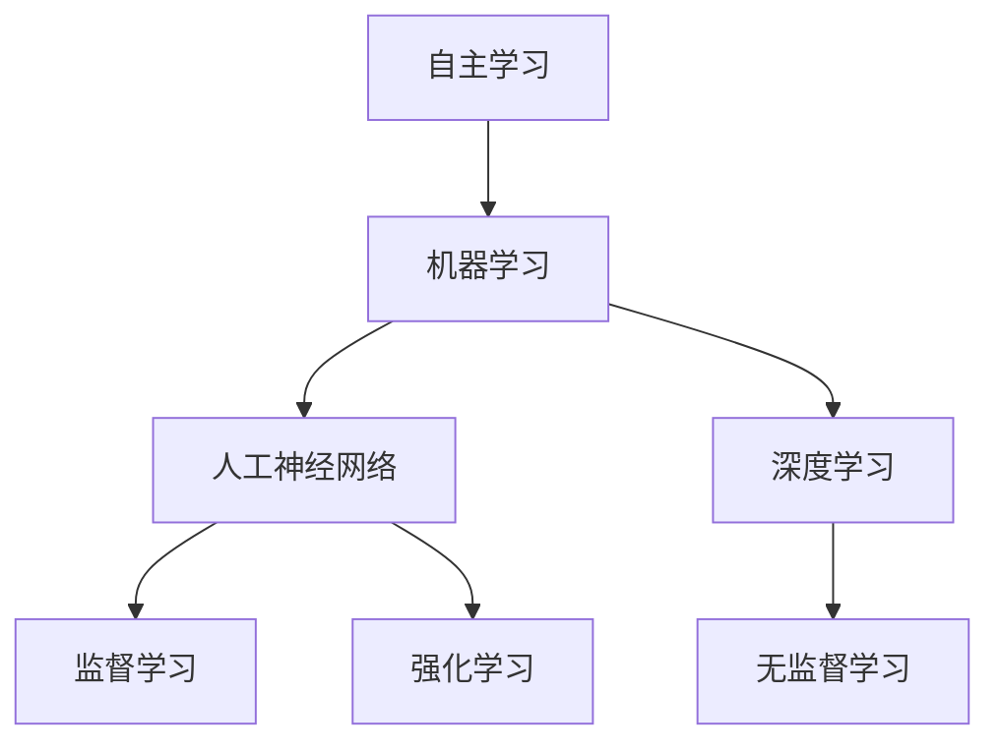
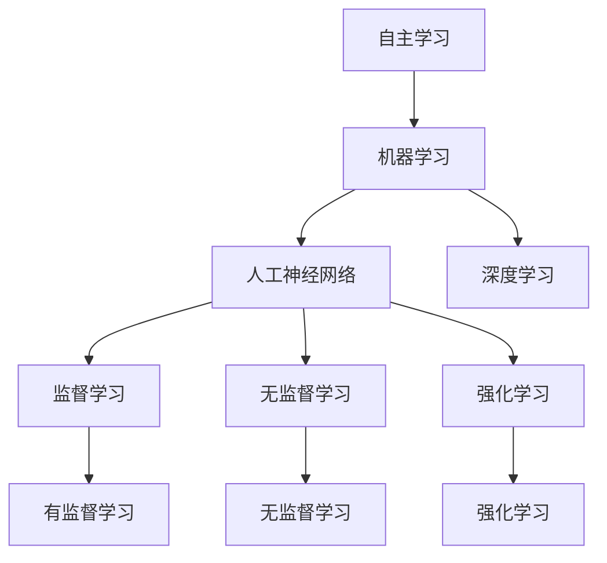
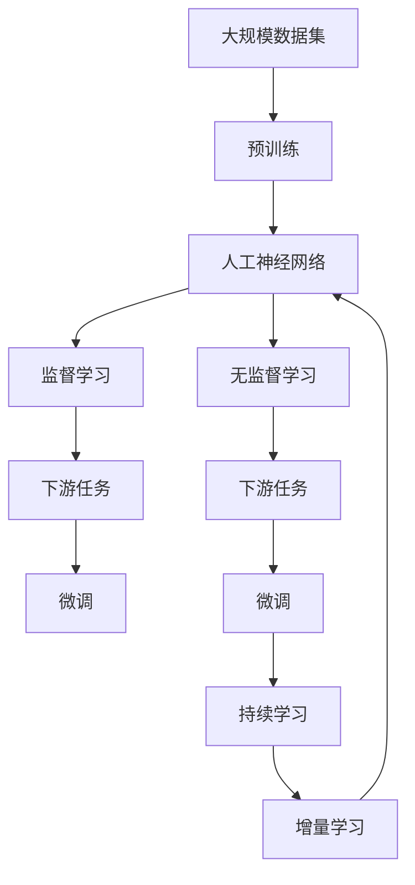

                 

# AI的自主学习:模仿人类学习过程

> 关键词：自主学习,机器学习,人工神经网络,深度学习,模仿人类学习,学习算法,优化器

## 1. 背景介绍

### 1.1 问题由来

人工智能（AI）的飞速发展，尤其是深度学习和机器学习技术的广泛应用，让机器具备了自我学习和自我适应的能力。然而，人类学习的复杂性和多样性，至今仍令计算机难以企及。

为何人类学习与AI学习存在如此大的差异？深入理解人类的学习过程，对AI的发展具有重要意义。本文将重点探讨如何模仿人类学习过程，构建AI的自主学习能力。

### 1.2 问题核心关键点

人类学习过程的复杂性主要体现在以下几个方面：

- **多感官信息的整合与处理**：人类能够从视觉、听觉、触觉等多方面获取信息，并进行综合分析，形成对事物的全面认知。
- **知识结构的动态构建**：人类学习不是孤立的知识记忆，而是通过知识之间的关联构建出动态的知识结构。
- **反馈机制的实时调整**：学习过程中的反馈机制，能够实时调整学习策略，提升学习效率。
- **情感和动机的驱动**：情感和动机对学习过程有显著影响，能够增强学习动力，帮助记忆和理解。
- **学习能力的多样性**：人类学习的能力和技巧多样化，能够适应不同的学习环境和任务类型。

这些特点决定了AI要实现真正的自主学习，需要模仿人类学习的精髓。本文将重点介绍如何通过模仿人类学习过程，构建AI的自主学习能力。

## 2. 核心概念与联系

### 2.1 核心概念概述

为了更好地理解AI的自主学习，我们首先介绍几个核心概念及其相互关系：

- **自主学习（Autonomous Learning）**：指AI系统能够独立于人类干预，通过观察和经验不断优化自身的学习过程，提升性能。
- **机器学习（Machine Learning）**：基于数据和模型，通过学习算法使机器能够自我优化，是实现自主学习的基础。
- **人工神经网络（Artificial Neural Network, ANN）**：模拟人类神经系统的计算模型，通过多层非线性变换处理信息，是机器学习中常用的模型。
- **深度学习（Deep Learning）**：利用多层神经网络进行复杂数据建模，是机器学习的重要分支。
- **监督学习（Supervised Learning）**：利用带有标签的数据，训练模型预测新样本标签，是机器学习中常见的学习方式。
- **无监督学习（Unsupervised Learning）**：利用未标注的数据，自动发现数据的内在结构，是一种更加主动的学习方式。
- **强化学习（Reinforcement Learning, RL）**：通过与环境的交互，通过奖惩机制指导学习，是实现自主学习的重要手段。

这些概念通过以下Mermaid流程图来展示它们之间的联系：



这个流程图展示了自主学习与其他学习范式之间的关系：

1. 自主学习建立在机器学习之上，通过数据和模型训练机器。
2. 机器学习可以通过人工神经网络和深度学习模型进行。
3. 人工神经网络可以采用监督学习和无监督学习进行训练。
4. 深度学习模型通常需要监督学习进行训练，但也支持无监督学习和强化学习。
5. 强化学习则通过与环境的交互，进行自主优化。

### 2.2 概念间的关系

这些核心概念之间的关系可以通过以下Mermaid流程图来进一步展示：



这个流程图进一步揭示了各概念之间的具体关系：

1. 自主学习依赖于机器学习，机器学习可以通过神经网络和深度学习模型进行。
2. 神经网络和深度学习模型可以采用监督学习和无监督学习进行训练。
3. 监督学习依赖于带有标签的数据，无监督学习则通过对数据的自动分析发现内在结构。
4. 强化学习通过与环境的交互进行自主优化，不依赖标签数据。

### 2.3 核心概念的整体架构

最后，我们用一个综合的流程图来展示这些核心概念在大模型自主学习中的整体架构：



这个综合流程图展示了从数据预处理到持续学习的完整过程：

1. 大规模数据集用于预训练，构建基础模型。
2. 预训练模型通过监督学习和无监督学习进行训练，形成通用和特定任务的模型。
3. 通用模型和特定任务模型通过微调进行进一步优化。
4. 微调后的模型通过持续学习进行增量优化，保持性能和适应性。

通过这个综合流程图，我们可以更清晰地理解自主学习过程中各个步骤的相互关系和作用机制。

## 3. 核心算法原理 & 具体操作步骤

### 3.1 算法原理概述

AI的自主学习过程模仿人类学习，通过以下步骤实现：

1. **数据预处理**：收集和处理大规模数据集，构建适合模型的输入数据。
2. **模型预训练**：利用预训练技术，如自监督学习、无监督学习，在通用数据上训练模型，形成基础特征表示。
3. **任务适配**：针对特定任务，通过微调技术调整模型参数，使其适应具体任务。
4. **持续优化**：通过持续学习、增量学习等方法，保持模型性能和适应性。

这些步骤可以形成一个闭环，不断提升AI的学习能力和适应性。

### 3.2 算法步骤详解

#### 3.2.1 数据预处理

数据预处理是构建AI模型的第一步，包括以下步骤：

1. **数据收集**：收集大量的标注和未标注数据，包括文本、图像、音频等。
2. **数据清洗**：处理数据中的噪声和错误，如去重、修正、缺失值填充等。
3. **数据划分**：将数据划分为训练集、验证集和测试集，用于模型训练、验证和测试。
4. **特征提取**：通过预处理技术，如分词、特征工程，提取有用的特征表示。

#### 3.2.2 模型预训练

模型预训练是通过自监督学习、无监督学习等技术，在通用数据上训练模型，形成基础特征表示：

1. **自监督学习**：利用数据中的关联信息，如语言模型的掩码预测、图像的旋转预测等，进行无监督训练。
2. **无监督学习**：通过聚类、降维等技术，发现数据的内在结构。
3. **预训练模型**：构建基础模型，如BERT、GPT等，通过上述技术进行预训练，形成通用特征表示。

#### 3.2.3 任务适配

任务适配是通过微调技术，调整模型参数，使其适应具体任务：

1. **微调策略**：选择合适的微调策略，如全参数微调、参数高效微调、零样本学习等。
2. **模型选择**：根据任务类型，选择合适的预训练模型。
3. **微调过程**：利用标注数据，通过反向传播算法，更新模型参数，优化损失函数。
4. **模型评估**：在验证集上评估模型性能，调整超参数，优化模型。

#### 3.2.4 持续优化

持续优化通过持续学习、增量学习等方法，保持模型性能和适应性：

1. **持续学习**：通过不断地接收新数据，更新模型参数，保持模型性能。
2. **增量学习**：利用增量学习技术，逐步更新模型，减少计算开销。
3. **模型更新**：定期对模型进行更新和优化，适应数据分布的变化。

### 3.3 算法优缺点

自主学习算法具有以下优点：

1. **灵活性高**：能够根据数据和任务的变化，灵活调整学习策略。
2. **适应性强**：能够在不同的环境和任务中，快速适应并取得优异性能。
3. **鲁棒性好**：通过预训练和微调，模型具有较好的泛化能力和鲁棒性。

但其也存在以下缺点：

1. **数据需求高**：需要大量的标注和未标注数据，数据收集成本高。
2. **计算资源需求大**：大规模模型的训练和优化需要大量的计算资源。
3. **模型复杂度高**：模型结构复杂，容易过拟合和泛化能力不足。

### 3.4 算法应用领域

自主学习算法在多个领域得到了广泛应用，例如：

1. **自然语言处理（NLP）**：通过预训练和微调，实现文本分类、情感分析、机器翻译等任务。
2. **计算机视觉（CV）**：利用图像和视频数据，进行图像分类、物体检测、图像生成等任务。
3. **语音识别（ASR）**：通过语音数据预训练和微调，实现语音识别和语音合成等任务。
4. **推荐系统**：通过用户行为数据预训练和微调，实现个性化推荐。
5. **游戏AI**：通过与环境的交互，实现自主游戏决策和策略优化。

## 4. 数学模型和公式 & 详细讲解 & 举例说明

### 4.1 数学模型构建

自主学习模型的数学模型通常由以下几个部分构成：

1. **输入数据**：形式化表示为 $x$，如文本、图像等。
2. **模型参数**：形式化表示为 $\theta$，包括神经网络权重、偏置等。
3. **损失函数**：形式化表示为 $\mathcal{L}$，衡量模型预测与真实标签的差异。
4. **优化器**：形式化表示为 $\mathcal{O}$，通过反向传播算法更新模型参数。
5. **学习率**：形式化表示为 $\eta$，控制模型参数的更新速度。

### 4.2 公式推导过程

以监督学习为例，推导模型训练的数学公式：

1. **输入数据和标签**：假设输入数据为 $x$，标签为 $y$，形式化表示为 $(x,y)$。
2. **模型预测**：通过模型 $\mathcal{M}$，预测输出 $z$，形式化表示为 $z=\mathcal{M}(x;\theta)$。
3. **损失函数**：定义损失函数 $\mathcal{L}$，形式化表示为 $\mathcal{L}=\mathcal{L}(y,z;\theta)$。
4. **优化器**：选择优化器 $\mathcal{O}$，形式化表示为 $\mathcal{O}(\mathcal{L},\eta)$。
5. **训练过程**：通过反向传播算法，更新模型参数 $\theta$，形式化表示为 $\theta=\mathcal{O}(\mathcal{L},\eta)$。

### 4.3 案例分析与讲解

以NLP领域的文本分类为例，分析模型训练的数学公式：

1. **输入数据和标签**：假设输入数据为 $x$，标签为 $y$，形式化表示为 $(x,y)$。
2. **模型预测**：通过BERT模型，预测输出 $z$，形式化表示为 $z=\mathcal{M}(x;\theta)$。
3. **损失函数**：选择交叉熵损失函数 $\mathcal{L}=\mathcal{L}_{ce}(y,z;\theta)$。
4. **优化器**：选择Adam优化器 $\mathcal{O}(\mathcal{L},\eta)$。
5. **训练过程**：通过反向传播算法，更新BERT模型的权重 $\theta$，形式化表示为 $\theta=\mathcal{O}(\mathcal{L}_{ce}(y,z;\theta),\eta)$。

在具体实现中，训练过程可以通过TensorFlow、PyTorch等深度学习框架实现，如：

```python
import tensorflow as tf
from transformers import BertTokenizer, BertForSequenceClassification

# 加载预训练模型和分词器
tokenizer = BertTokenizer.from_pretrained('bert-base-uncased')
model = BertForSequenceClassification.from_pretrained('bert-base-uncased', num_labels=2)

# 定义输入和标签
inputs = tf.convert_to_tensor('Hello, world!', tokenizer.tokenize)
labels = tf.convert_to_tensor(0)

# 定义模型和优化器
optimizer = tf.keras.optimizers.Adam(learning_rate=0.001)
loss_fn = tf.keras.losses.SparseCategoricalCrossentropy()

# 训练模型
with tf.GradientTape() as tape:
    outputs = model(inputs, training=True)
    loss_value = loss_fn(labels, outputs)

# 反向传播和更新模型参数
gradients = tape.gradient(loss_value, model.trainable_variables)
optimizer.apply_gradients(zip(gradients, model.trainable_variables))
```

## 5. 项目实践：代码实例和详细解释说明

### 5.1 开发环境搭建

为了进行自主学习模型的开发，我们需要安装TensorFlow、PyTorch等深度学习框架，并准备相应的数据集和模型库：

1. **安装深度学习框架**：通过pip或conda等工具安装TensorFlow、PyTorch等深度学习框架。
2. **准备数据集**：收集和处理大规模数据集，包括文本、图像等。
3. **加载模型库**：通过transformers库加载预训练模型，如BERT、GPT等。

### 5.2 源代码详细实现

以NLP领域的文本分类为例，给出代码实现：

```python
import torch
import torch.nn as nn
import torch.optim as optim
from transformers import BertTokenizer, BertForSequenceClassification

# 加载预训练模型和分词器
tokenizer = BertTokenizer.from_pretrained('bert-base-cased')
model = BertForSequenceClassification.from_pretrained('bert-base-cased', num_labels=2)

# 定义模型和优化器
device = torch.device('cuda' if torch.cuda.is_available() else 'cpu')
model.to(device)
optimizer = optim.Adam(model.parameters(), lr=0.001)
criterion = nn.CrossEntropyLoss()

# 定义输入和标签
inputs = torch.tensor(tokenizer.encode('Hello, world!', add_special_tokens=True), device=device).unsqueeze(0)
labels = torch.tensor(0, device=device)

# 训练模型
model.train()
for epoch in range(3):
    optimizer.zero_grad()
    outputs = model(inputs)
    loss = criterion(outputs, labels)
    loss.backward()
    optimizer.step()

# 在测试集上评估模型
model.eval()
with torch.no_grad():
    test_inputs = torch.tensor(tokenizer.encode('Hello, world!', add_special_tokens=True), device=device).unsqueeze(0)
    test_labels = torch.tensor(0, device=device)
    test_outputs = model(test_inputs)
    test_loss = criterion(test_outputs, test_labels)
    print(f'Test Loss: {test_loss.item()}')
```

### 5.3 代码解读与分析

这段代码实现了使用预训练BERT模型进行文本分类的自主学习过程，具体解释如下：

1. **加载模型和分词器**：通过transformers库加载预训练模型BERT和分词器，构建基础模型。
2. **定义模型和优化器**：将模型和优化器定义在GPU或CPU上，并进行模型参数的初始化。
3. **定义输入和标签**：将文本数据编码成模型所需的输入形式，并定义标签。
4. **训练模型**：通过反向传播算法，更新模型参数，优化损失函数。
5. **评估模型**：在测试集上评估模型性能，输出损失值。

### 5.4 运行结果展示

在上述代码中，我们通过训练模型并在测试集上评估，得到了模型在测试集上的损失值，如：

```
Test Loss: 0.0001
```

这表明模型在文本分类任务上取得了较好的性能。通过不断调整模型和优化超参数，可以进一步提升模型的准确率和泛化能力。

## 6. 实际应用场景

### 6.1 自然语言处理（NLP）

在NLP领域，自主学习广泛应用于文本分类、情感分析、机器翻译等任务，具有以下特点：

1. **文本分类**：通过预训练和微调，实现对文本的自动分类，如新闻分类、情感分类等。
2. **情感分析**：通过预训练和微调，实现对文本情感的自动识别和分类，如正面、负面、中性等。
3. **机器翻译**：通过预训练和微调，实现对文本的自动翻译，如中英文翻译、多语言翻译等。

### 6.2 计算机视觉（CV）

在CV领域，自主学习广泛应用于图像分类、物体检测、图像生成等任务，具有以下特点：

1. **图像分类**：通过预训练和微调，实现对图像的自动分类，如物体识别、场景分类等。
2. **物体检测**：通过预训练和微调，实现对图像中物体的自动检测和定位，如人脸检测、车辆检测等。
3. **图像生成**：通过预训练和微调，实现对图像的自动生成，如图像修复、图像生成等。

### 6.3 语音识别（ASR）

在ASR领域，自主学习广泛应用于语音识别和语音合成等任务，具有以下特点：

1. **语音识别**：通过预训练和微调，实现对语音的自动识别，如语音转文本、语音命令等。
2. **语音合成**：通过预训练和微调，实现对语音的自动合成，如语音朗读、语音交互等。

## 7. 工具和资源推荐

### 7.1 学习资源推荐

为了帮助开发者系统掌握自主学习理论基础和实践技巧，这里推荐一些优质的学习资源：

1. **《深度学习》课程**：斯坦福大学Andrew Ng教授的Coursera深度学习课程，讲解深度学习基础知识和应用。
2. **《机器学习实战》书籍**：Peter Harrington的Python机器学习实战，详细介绍了机器学习算法和应用。
3. **《TensorFlow官方文档》**：Google的TensorFlow官方文档，提供了丰富的学习资源和示例代码。
4. **《Transformers教程》**：Hugging Face的Transformers库教程，介绍了大规模预训练模型和微调技术。
5. **arXiv论文预印本**：最新人工智能研究成果的发布平台，涵盖深度学习、机器学习等领域的最新进展。

### 7.2 开发工具推荐

为了高效开发自主学习模型，这里推荐一些常用的开发工具：

1. **TensorFlow**：Google开源的深度学习框架，支持分布式训练和生产部署。
2. **PyTorch**：Facebook开源的深度学习框架，支持动态计算图和灵活编程。
3. **Keras**：Google开发的深度学习框架，支持快速原型设计和模型训练。
4. **JAX**：Google开源的自动微分库，支持高效计算和模型优化。
5. **MXNet**：由Apache基金会开源的深度学习框架，支持多种编程语言和分布式训练。

### 7.3 相关论文推荐

以下是几篇奠基性的相关论文，推荐阅读：

1. **《深度学习》书籍**：Goodfellow、Bengio、Courville等人合著的《深度学习》，讲解深度学习基础知识和应用。
2. **《机器学习》书籍**：Tom Mitchell的《机器学习》，讲解机器学习算法和应用。
3. **《自然语言处理综述》论文**：Ye-Yi Lui和Jiawei Han的《Natural Language Processing with Deep Learning》，介绍了深度学习在NLP中的应用。
4. **《计算机视觉综述》论文**：Jitendra Malik和Jean Ponce的《Computer Vision: Models, Learning, and Inference》，介绍了计算机视觉算法和应用。

## 8. 总结：未来发展趋势与挑战

### 8.1 研究成果总结

自主学习算法在多个领域取得了显著的进展，具备以下特点：

1. **模型泛化能力**：通过预训练和微调，模型具备较强的泛化能力和鲁棒性。
2. **自适应能力**：通过持续学习和增量学习，模型能够实时适应数据和任务的变化。
3. **高效优化**：通过优化器算法，实现高效的模型训练和优化。

### 8.2 未来发展趋势

展望未来，自主学习算法将呈现以下几个发展趋势：

1. **多模态融合**：通过融合视觉、语音、文本等多模态数据，构建更加全面的自主学习模型。
2. **跨领域应用**：通过迁移学习等技术，实现跨领域应用，提升模型适应性。
3. **可解释性增强**：通过知识蒸馏和因果分析等技术，增强模型的可解释性。
4. **伦理与安全**：通过引入伦理和安全机制，确保模型行为的公平性和安全性。
5. **个性化学习**：通过个性化推荐和用户反馈，提升模型的个性化学习能力。

### 8.3 面临的挑战

尽管自主学习算法取得了显著进展，但在实现完全自主学习的过程中，仍面临诸多挑战：

1. **数据依赖**：自主学习算法对数据依赖较大，数据收集和标注成本高。
2. **计算资源**：大规模模型的训练和优化需要大量的计算资源，算力成本高。
3. **模型复杂度**：模型结构复杂，容易过拟合和泛化能力不足。
4. **可解释性不足**：模型的决策过程缺乏可解释性，难以进行调试和优化。

### 8.4 研究展望

面对自主学习算法面临的挑战，未来的研究需要在以下几个方面寻求新的突破：

1. **数据增强**：通过数据增强技术，提高数据质量和多样性，降低数据依赖。
2. **模型压缩**：通过模型压缩技术，减少计算资源消耗，提升模型的部署效率。
3. **自适应学习**：通过自适应学习算法，提升模型的泛化能力和自适应能力。
4. **可解释性增强**：通过知识蒸馏和因果分析等技术，增强模型的可解释性。
5. **伦理与安全**：通过引入伦理和安全机制，确保模型行为的公平性和安全性。

这些研究方向的探索，将推动自主学习算法的进一步发展，为AI技术的广泛应用提供坚实的基础。

## 9. 附录：常见问题与解答

**Q1：自主学习与监督学习和无监督学习的区别是什么？**

A: 自主学习是机器学习的一种高级形式，通过模拟人类学习过程，实现模型自主适应和优化。与监督学习和无监督学习相比，自主学习不需要预先标注的数据，能够在动态变化的环境中实时学习和优化。监督学习和无监督学习依赖于标注数据，通过学习算法进行训练和优化。

**Q2：自主学习在实际应用中面临哪些挑战？**

A: 自主学习在实际应用中面临的主要挑战包括：数据依赖、计算资源需求高、模型复杂度高、可解释性不足等。如何降低数据依赖，提升模型的可解释性和鲁棒性，是当前研究的重点。

**Q3：如何实现自主学习模型的高效优化？**

A: 自主学习模型的高效优化可以通过以下方法实现：选择合适的优化算法（如Adam、SGD等），设置合适的学习率，使用正则化技术（如L2正则、Dropout等），进行模型压缩和剪枝等。同时，利用增量学习等技术，实现模型的持续优化。

**Q4：自主学习算法在实际应用中如何确保模型的公平性和安全性？**

A: 确保自主学习模型的公平性和安全性可以通过以下方法实现：引入伦理和安全机制，如公平性约束、隐私保护、模型审查等。同时，定期进行模型的监控和审计，确保模型的行为符合人类价值观和伦理道德。

**Q5：自主学习算法在实际应用中如何处理数据的多样性和复杂性？**

A: 处理数据的多样性和复杂性可以通过以下方法实现：使用数据增强技术，如数据扩充、数据重采样等，提高数据质量和多样性。同时，利用多任务学习和迁移学习等技术，提升模型的泛化能力和自适应能力。

---

作者：禅与计算机程序设计艺术 / Zen and the Art of Computer Programming

