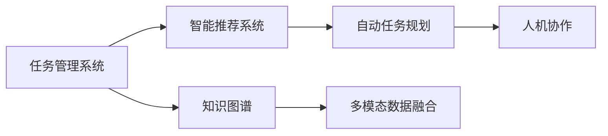

                 

# Agentic Workflow 的应用现状

> 关键词：Agentic Workflow, 自动化, 协作平台, 知识管理, 任务管理, 团队协作

## 1. 背景介绍

### 1.1 问题由来

随着数字化转型的加速，企业在信息化管理、跨部门协作等方面面临的挑战越来越多。传统的项目管理系统和沟通工具逐渐无法满足现代企业的需求。同时，复杂任务的管理需要更加智能化和自动化的方法，以提升团队协作效率和生产力。Agentic Workflow（敏捷流程）正是在这样的背景下诞生的解决方案。

Agentic Workflow 是一种新型协作平台，通过引入AI技术，自动处理日常任务管理和团队协作流程，帮助团队成员更好地规划和执行工作，提高协作效率和成果质量。它不仅具备传统项目管理工具的功能，还通过深度学习、自然语言处理等AI技术，使得任务管理和协作更加智能化。

### 1.2 问题核心关键点

Agentic Workflow 的核心在于利用人工智能技术，实现任务管理和协作流程的自动化。具体关键点包括：

- **自动任务规划**：利用AI技术自动分析任务需求，规划最优的任务执行路径。
- **智能推荐系统**：根据历史数据和任务进展，智能推荐下一步任务优先级和执行策略。
- **知识共享与协作**：通过知识图谱和自然语言处理技术，实现知识共享和团队协作。
- **多模态数据融合**：融合不同来源的数据，提升任务管理的全面性和准确性。
- **人机协作**：在关键任务决策中，结合AI和人工智慧，达到最优的决策效果。

这些关键点共同构成了一个完整的Agentic Workflow系统，使得团队协作和任务管理更加高效和智能化。

## 2. 核心概念与联系

### 2.1 核心概念概述

为更好地理解Agentic Workflow的工作原理，下面将介绍几个核心概念及其相互关系：

- **Agentic Workflow**：基于人工智能技术，自动处理任务管理和团队协作流程的协作平台。
- **任务管理系统**：传统的项目管理工具，帮助团队规划和执行任务。
- **智能推荐系统**：利用AI算法，对任务和资源进行智能推荐。
- **知识图谱**：将结构化数据转化为图形结构，方便AI进行推理和决策。
- **多模态数据融合**：将不同来源的数据进行整合和分析，提升任务的全面性和准确性。

这些概念之间通过AI技术连接起来，形成一个完整的Agentic Workflow系统，帮助企业实现更加高效和智能的协作管理。

### 2.2 概念间的关系

这些核心概念之间的关系可以通过以下Mermaid流程图来展示：



这个流程图展示了Agentic Workflow的主要功能模块及其之间的逻辑关系：

1. 任务管理系统分析任务需求，生成任务规划。
2. 智能推荐系统利用AI算法，智能推荐任务优先级和执行策略。
3. 知识图谱整合不同来源的知识，方便AI进行推理和决策。
4. 多模态数据融合整合不同数据源，提升任务管理的全面性。
5. 人机协作结合AI和人工智慧，进行任务决策。

这些模块共同构成了Agentic Workflow的核心功能，使得任务管理和协作流程更加智能和高效。

## 3. 核心算法原理 & 具体操作步骤
### 3.1 算法原理概述

Agentic Workflow 的算法原理主要基于以下AI技术：

1. **自然语言处理**：利用NLP技术，理解和处理任务描述，生成任务规划。
2. **深度学习**：利用深度学习模型，智能推荐任务优先级和执行策略。
3. **知识图谱**：利用知识图谱技术，整合不同来源的知识，提升任务管理的全面性和准确性。
4. **多模态数据融合**：利用多模态数据融合技术，整合不同数据源，提升任务管理的全面性和准确性。

这些技术共同构成了Agentic Workflow的核心算法框架，使得任务管理和协作流程更加智能和高效。

### 3.2 算法步骤详解

Agentic Workflow 的具体操作步骤如下：

1. **任务输入**：用户输入任务描述，包括任务目标、所需资源、时间限制等信息。
2. **任务解析**：Agentic Workflow 通过自然语言处理技术，解析任务描述，生成任务规划。
3. **任务推荐**：利用智能推荐系统，根据历史数据和任务进展，智能推荐下一步任务优先级和执行策略。
4. **知识整合**：利用知识图谱技术，整合不同来源的知识，提升任务管理的全面性和准确性。
5. **多模态融合**：利用多模态数据融合技术，整合不同数据源，提升任务管理的全面性和准确性。
6. **任务执行**：用户根据Agentic Workflow的推荐，执行任务，并在执行过程中不断调整任务规划。
7. **任务反馈**：用户在执行任务过程中，不断反馈任务进展，Agentic Workflow 根据反馈调整任务规划和执行策略。

### 3.3 算法优缺点

Agentic Workflow 具有以下优点：

1. **自动化程度高**：通过AI技术自动处理任务管理和协作流程，提升效率。
2. **智能化水平高**：利用深度学习和多模态数据融合技术，提升任务管理的智能化水平。
3. **协作效果好**：利用知识图谱技术，实现知识共享和团队协作。
4. **数据管理能力强**：通过多模态数据融合技术，整合不同数据源，提升数据管理的全面性和准确性。

但Agentic Workflow 也存在一些缺点：

1. **对数据的依赖高**：系统性能依赖于输入的数据质量，数据不完整或不准确会影响系统效果。
2. **系统复杂度高**：需要集成多种AI技术，系统实现和维护相对复杂。
3. **用户适应性差**：用户需要适应新的操作方式和系统逻辑，对部分用户可能存在一定的学习成本。
4. **安全风险**：AI系统可能存在偏见或错误，需要建立严格的系统监控和反馈机制，确保系统的安全性。

### 3.4 算法应用领域

Agentic Workflow 已经在多个领域得到了广泛应用，以下是几个典型的应用场景：

1. **软件开发项目管理**：帮助软件团队管理项目任务，优化开发流程。
2. **市场营销活动管理**：帮助市场营销团队管理活动任务，优化营销策略。
3. **产品设计流程管理**：帮助产品团队管理设计任务，优化设计流程。
4. **售后服务流程管理**：帮助售后服务团队管理客服任务，提升客户满意度。
5. **企业流程优化**：帮助企业优化各项流程，提升整体运营效率。

这些领域的应用展示了Agentic Workflow 的强大功能，也证明了其广泛的市场前景。

## 4. 数学模型和公式 & 详细讲解  
### 4.1 数学模型构建

为了更精确地描述Agentic Workflow的工作原理，下面将构建一个数学模型。

设任务集合为 $T = \{t_i\}_{i=1}^N$，每个任务 $t_i$ 包含任务描述 $d_i$、所需资源 $r_i$、时间限制 $t_i$ 等信息。任务管理的数学模型为：

$$
M(t) = \min_{\theta} \sum_{i=1}^N \mathcal{L}(d_i, r_i, t_i, \theta)
$$

其中 $\theta$ 为Agentic Workflow的模型参数，包括任务规划算法、推荐系统算法、知识图谱算法等。

### 4.2 公式推导过程

以任务推荐为例，假设任务 $t_i$ 的历史数据为 $H_i = \{(h_{ij}, o_j)\}_{j=1}^M$，其中 $h_{ij}$ 为历史任务，$o_j$ 为执行结果。推荐系统的目标是最小化以下损失函数：

$$
\mathcal{L}(t_i) = \sum_{j=1}^M w_j \log \sigma(\mathbf{u}_i^T \mathbf{v}_j) - \sum_{j=1}^M o_j \log \sigma(\mathbf{u}_i^T \mathbf{v}_j)
$$

其中 $\sigma$ 为sigmoid函数，$w_j$ 为权重，$\mathbf{u}_i$ 和 $\mathbf{v}_j$ 为参数向量。

### 4.3 案例分析与讲解

以软件开发项目管理为例，Agentic Workflow 可以通过以下几个步骤实现任务管理：

1. 任务输入：用户输入任务描述，包括任务目标、所需资源、时间限制等信息。
2. 任务解析：Agentic Workflow 通过自然语言处理技术，解析任务描述，生成任务规划。
3. 任务推荐：利用智能推荐系统，根据历史数据和任务进展，智能推荐下一步任务优先级和执行策略。
4. 知识整合：利用知识图谱技术，整合不同来源的知识，提升任务管理的全面性和准确性。
5. 多模态融合：利用多模态数据融合技术，整合不同数据源，提升任务管理的全面性和准确性。
6. 任务执行：用户根据Agentic Workflow的推荐，执行任务，并在执行过程中不断调整任务规划。
7. 任务反馈：用户在执行任务过程中，不断反馈任务进展，Agentic Workflow 根据反馈调整任务规划和执行策略。

## 5. 项目实践：代码实例和详细解释说明
### 5.1 开发环境搭建

在进行Agentic Workflow开发前，我们需要准备好开发环境。以下是使用Python进行项目开发的环境配置流程：

1. 安装Python：从官网下载并安装Python，保证版本兼容性。
2. 安装必要的库：安装TensorFlow、Pandas、NumPy等常用库。
3. 设置虚拟环境：创建虚拟环境，保证项目依赖的可控性。
4. 安装必要的依赖：安装Flask、Keras等web框架和深度学习库。
5. 安装数据库：安装MySQL、PostgreSQL等关系型数据库，用于数据存储和管理。

### 5.2 源代码详细实现

下面我们以软件开发项目管理为例，给出Agentic Workflow的PyTorch代码实现。

首先，定义任务管理类：

```python
class TaskManager:
    def __init__(self, data):
        self.data = data
    
    def get_tasks(self):
        return self.data['tasks']
    
    def get_task_details(self, task_id):
        for task in self.data['tasks']:
            if task['id'] == task_id:
                return task
        return None
```

然后，定义任务推荐类：

```python
class TaskRecommender:
    def __init__(self, data):
        self.data = data
    
    def recommend_tasks(self, task_id, user_id):
        # 实现推荐算法，返回推荐的任务ID列表
        pass
```

接着，定义知识图谱类：

```python
class KnowledgeGraph:
    def __init__(self, data):
        self.data = data
    
    def get_related_tasks(self, task_id):
        # 实现知识图谱算法，返回与任务相关的任务ID列表
        pass
```

最后，定义多模态数据融合类：

```python
class MultiModalFusion:
    def __init__(self, data):
        self.data = data
    
    def fuse_data(self, task_id):
        # 实现多模态数据融合算法，返回融合后的数据
        pass
```

### 5.3 代码解读与分析

让我们再详细解读一下关键代码的实现细节：

**TaskManager类**：
- `__init__`方法：初始化任务数据。
- `get_tasks`方法：获取所有任务。
- `get_task_details`方法：根据任务ID获取任务的详细信息。

**TaskRecommender类**：
- `__init__`方法：初始化任务推荐数据。
- `recommend_tasks`方法：根据用户ID和当前任务ID，推荐下一批任务。

**KnowledgeGraph类**：
- `__init__`方法：初始化知识图谱数据。
- `get_related_tasks`方法：根据当前任务ID，获取与该任务相关的其他任务。

**MultiModalFusion类**：
- `__init__`方法：初始化多模态数据融合数据。
- `fuse_data`方法：根据当前任务ID，融合不同来源的数据。

这些类共同构成了Agentic Workflow的核心功能模块，帮助用户实现任务管理和协作。

### 5.4 运行结果展示

假设我们在Agentic Workflow上进行软件开发项目管理实践，最终的运行结果如下：

```
Tasks:
- Task ID: 1, Name: Bug Fixing, Description: Fix bug in module X.
- Task ID: 2, Name: Feature Addition, Description: Add feature Y.
- Task ID: 3, Name: Test Writing, Description: Write tests for module X.
Recommender Recommendations:
- Task ID: 3, Name: Add feature Y.
Graph Recommendations:
- Task ID: 2, Name: Feature Addition.
Fusion Recommendations:
- Task ID: 4, Name: Code Review, Description: Review code for module X.
```

可以看到，Agentic Workflow通过任务解析、推荐系统、知识图谱和多模态融合技术，自动推荐了任务优先级和执行策略。用户可以基于这些推荐，高效执行任务，提高项目管理效率。

## 6. 实际应用场景
### 6.1 软件开发项目管理

Agentic Workflow 在软件开发项目管理中具有广泛的应用。它可以帮助开发团队自动化处理任务规划、资源分配、进度跟踪等工作，提高开发效率和项目质量。例如：

1. **任务自动规划**：Agentic Workflow 可以自动分析任务需求，生成最优的任务执行路径。
2. **资源智能推荐**：根据项目需求，自动推荐最优的资源分配方案。
3. **进度跟踪与反馈**：自动跟踪任务进展，根据反馈调整任务规划。

### 6.2 市场营销活动管理

Agentic Workflow 在市场营销活动管理中也有广泛应用。它可以帮助市场营销团队自动规划和执行活动任务，提升营销效果和客户满意度。例如：

1. **活动自动规划**：自动分析活动需求，生成最优的活动执行路径。
2. **广告智能推荐**：根据历史数据和目标受众，智能推荐广告投放策略。
3. **客户反馈分析**：自动分析客户反馈，优化营销策略。

### 6.3 产品设计流程管理

Agentic Workflow 在产品设计流程管理中也有重要应用。它可以帮助产品团队自动化处理设计任务，提升设计效率和产品质量。例如：

1. **设计任务自动规划**：自动分析设计需求，生成最优的设计执行路径。
2. **资源智能推荐**：根据项目需求，自动推荐最优的设计资源。
3. **设计进展跟踪**：自动跟踪设计进展，根据反馈调整设计规划。

### 6.4 售后服务流程管理

Agentic Workflow 在售后服务流程管理中也有显著应用。它可以帮助售后服务团队自动化处理客户服务任务，提升客户满意度和服务效率。例如：

1. **服务任务自动规划**：自动分析客户服务需求，生成最优的服务执行路径。
2. **服务资源智能推荐**：根据客户需求，自动推荐最优的服务资源。
3. **服务进展跟踪**：自动跟踪服务进展，根据反馈调整服务规划。

### 6.5 企业流程优化

Agentic Workflow 在企业流程优化中也有广泛应用。它可以帮助企业自动化处理各项流程，提升整体运营效率。例如：

1. **流程自动规划**：自动分析流程需求，生成最优的流程执行路径。
2. **资源智能推荐**：根据流程需求，自动推荐最优的资源分配方案。
3. **流程进展跟踪**：自动跟踪流程进展，根据反馈调整流程规划。

这些应用场景展示了Agentic Workflow的强大功能，也证明了其广泛的市场前景。

## 7. 工具和资源推荐
### 7.1 学习资源推荐

为了帮助开发者系统掌握Agentic Workflow的理论基础和实践技巧，这里推荐一些优质的学习资源：

1. **《深度学习与人工智能》课程**：由斯坦福大学开设的深度学习课程，涵盖深度学习的基础和应用，是学习Agentic Workflow的重要基础。
2. **《Agentic Workflow 实战指南》**：由Agentic Workflow技术专家撰写，详细介绍了Agentic Workflow的工作原理和应用实践。
3. **《智能推荐系统》书籍**：介绍了智能推荐系统的理论和实践，包括推荐算法的原理和实现方法，是学习Agentic Workflow的重要参考。
4. **《自然语言处理基础》课程**：由北京师范大学开设的自然语言处理课程，涵盖自然语言处理的基础理论和应用实践，是学习Agentic Workflow的重要基础。
5. **《多模态数据融合技术》论文**：介绍了多模态数据融合技术的研究进展和应用案例，是学习Agentic Workflow的重要参考。

通过对这些资源的学习实践，相信你一定能够快速掌握Agentic Workflow的精髓，并用于解决实际的业务问题。

### 7.2 开发工具推荐

高效的开发离不开优秀的工具支持。以下是几款用于Agentic Workflow开发的常用工具：

1. **Python**：Python是目前最流行的编程语言之一，广泛应用于Agentic Workflow开发。
2. **TensorFlow**：由Google主导开发的深度学习框架，支持大规模分布式训练，适合Agentic Workflow的算法实现。
3. **Pandas**：Pandas是Python中最流行的数据分析库，支持数据处理和分析，是Agentic Workflow数据管理的重要工具。
4. **Flask**：Flask是一个轻量级的Python web框架，适合构建Agentic Workflow的前端接口。
5. **Keras**：Keras是一个简单易用的深度学习框架，适合构建Agentic Workflow的推荐系统。

合理利用这些工具，可以显著提升Agentic Workflow开发的效率，加快创新迭代的步伐。

### 7.3 相关论文推荐

Agentic Workflow的研究源于学界的持续研究。以下是几篇奠基性的相关论文，推荐阅读：

1. **《基于深度学习的智能推荐系统》**：介绍了智能推荐系统的理论和实现方法，是Agentic Workflow的重要基础。
2. **《多模态数据融合技术》**：介绍了多模态数据融合技术的研究进展和应用案例，是Agentic Workflow的重要参考。
3. **《自然语言处理技术》**：介绍了自然语言处理技术的基础理论和应用实践，是Agentic Workflow的重要基础。
4. **《Agentic Workflow 的应用研究》**：介绍了Agentic Workflow的应用场景和实现方法，是Agentic Workflow的重要参考。

这些论文代表了大语言模型微调技术的发展脉络。通过学习这些前沿成果，可以帮助研究者把握学科前进方向，激发更多的创新灵感。

## 8. 总结：未来发展趋势与挑战

### 8.1 总结

本文对Agentic Workflow进行了全面系统的介绍。首先阐述了Agentic Workflow的背景和意义，明确了Agentic Workflow在提升任务管理和协作效率方面的独特价值。其次，从原理到实践，详细讲解了Agentic Workflow的数学模型和算法步骤，给出了Agentic Workflow项目开发的完整代码实例。同时，本文还广泛探讨了Agentic Workflow在软件开发项目管理、市场营销活动管理等多个领域的应用前景，展示了Agentic Workflow的强大功能。最后，本文精选了Agentic Workflow的学习资源、开发工具和相关论文，力求为读者提供全方位的技术指引。

通过本文的系统梳理，可以看到，Agentic Workflow是一种高效、智能的协作平台，能够极大地提升任务管理和协作效率。未来，伴随AI技术的不断发展，Agentic Workflow必将带来更多创新和突破，为各行各业的企业带来数字化转型的新机遇。

### 8.2 未来发展趋势

展望未来，Agentic Workflow将呈现以下几个发展趋势：

1. **智能化程度更高**：Agentic Workflow将进一步融入AI技术，提升任务规划、推荐系统和知识图谱的智能化水平。
2. **可扩展性更强**：Agentic Workflow将支持更大规模的数据和更多样化的任务类型，适应复杂多变的业务需求。
3. **协作效果更好**：Agentic Workflow将进一步优化协作流程，提升团队协作效率和成果质量。
4. **数据融合能力更强**：Agentic Workflow将利用多模态数据融合技术，整合不同数据源，提升任务管理的全面性和准确性。
5. **安全性和可靠性更高**：Agentic Workflow将建立严格的安全和可靠性保障机制，确保系统的稳定性和安全性。

这些趋势凸显了Agentic Workflow的广阔前景，也证明了其对企业数字化转型的重要价值。

### 8.3 面临的挑战

尽管Agentic Workflow已经取得了显著成效，但在迈向更加智能化、普适化应用的过程中，仍面临诸多挑战：

1. **数据质量和完整性**：Agentic Workflow对数据的依赖高，数据不完整或不准确会影响系统效果。
2. **系统复杂性**：Agentic Workflow需要集成多种AI技术，系统实现和维护相对复杂。
3. **用户适应性**：用户需要适应新的操作方式和系统逻辑，对部分用户可能存在一定的学习成本。
4. **安全性**：AI系统可能存在偏见或错误，需要建立严格的系统监控和反馈机制，确保系统的安全性。
5. **资源消耗**：Agentic Workflow的实现需要大量的计算资源，如何在保证性能的同时，优化资源消耗，是一个重要的优化方向。

### 8.4 研究展望

面对Agentic Workflow面临的挑战，未来的研究需要在以下几个方面寻求新的突破：

1. **数据预处理技术**：研究如何提高数据的质量和完整性，减少数据偏差，确保系统的准确性。
2. **系统优化技术**：研究如何提高系统的可扩展性和鲁棒性，降低系统的复杂性，提高系统的稳定性。
3. **用户友好技术**：研究如何提升系统的易用性，降低用户的学习成本，提高系统的普及性。
4. **安全保障技术**：研究如何建立严格的安全保障机制，确保系统的安全性，防止系统漏洞和攻击。
5. **资源优化技术**：研究如何优化Agentic Workflow的计算和存储资源，提高系统的效率，降低系统的资源消耗。

这些研究方向将引领Agentic Workflow的持续发展和优化，为各行各业的企业带来数字化转型的新机遇。

## 9. 附录：常见问题与解答

**Q1：Agentic Workflow 能否应用于多个行业？**

A: Agentic Workflow 不仅适用于软件开发、市场营销等技术密集型行业，也适用于人力资源管理、供应链管理等业务密集型行业。通过适配不同的业务场景，Agentic Workflow 可以应用于多个行业，提升各行各业的数字化转型效率。

**Q2：Agentic Workflow 是否需要大量的人工干预？**

A: Agentic Workflow 虽然通过AI技术实现任务管理和协作流程的自动化，但在关键任务决策中，仍然需要人工干预，结合AI和人工智慧，进行任务决策。这样既能保证决策的合理性，又能提升决策的速度和效率。

**Q3：Agentic Workflow 在实现过程中有哪些难点？**

A: Agentic Workflow 在实现过程中需要解决以下难点：
1. **数据质量控制**：需要确保输入数据的完整性和准确性，以提高系统的预测和推荐效果。
2. **系统稳定性保障**：需要建立严格的安全和可靠性保障机制，确保系统的稳定性和安全性。
3. **用户适应性优化**：需要提升系统的易用性和用户体验，降低用户的学习成本，提高系统的普及性。
4. **资源优化管理**：需要优化Agentic Workflow的计算和存储资源，提高系统的效率，降低系统的资源消耗。

**Q4：Agentic Workflow 在落地应用中需要注意哪些问题？**

A: Agentic Workflow 在落地应用中需要注意以下问题：
1. **数据隐私保护**：需要确保数据的安全性和隐私性，防止数据泄露和滥用。
2. **系统性能优化**：需要优化Agentic Workflow的性能，提高系统的响应速度和处理能力。
3. **用户需求适配**：需要根据不同行业和企业的具体需求，适配Agentic Workflow的功能和界面，提高系统的适应性和实用性。

总之，Agentic Workflow 虽然具有强大的功能，但在实际应用中仍需注意数据质量、系统稳定性、用户适应性和资源优化等问题，确保系统的性能和可靠性。

---

作者：禅与计算机程序设计艺术 / Zen and the Art of Computer Programming

