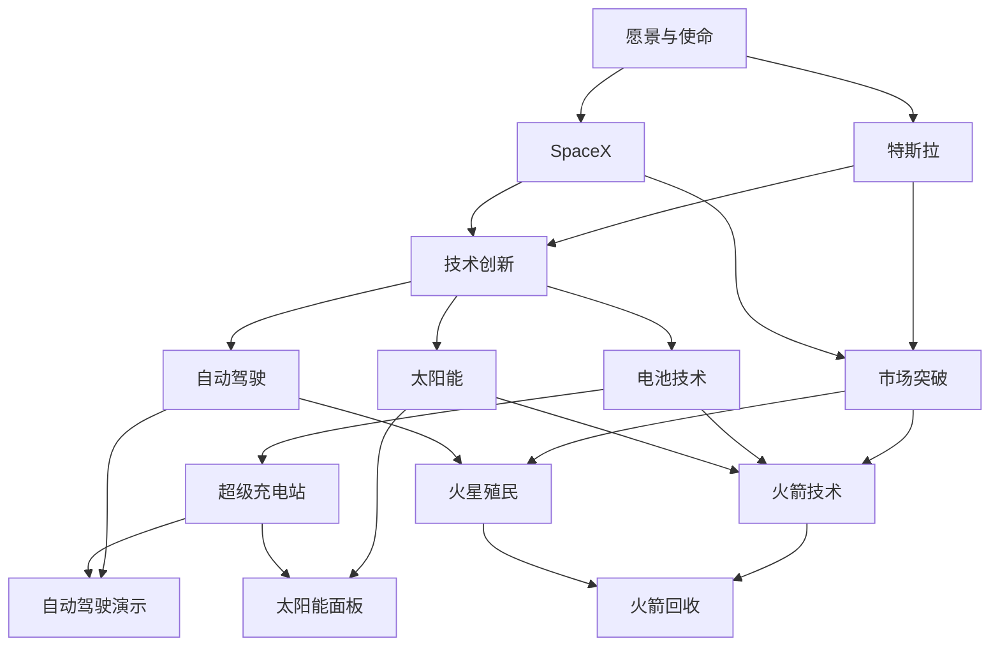
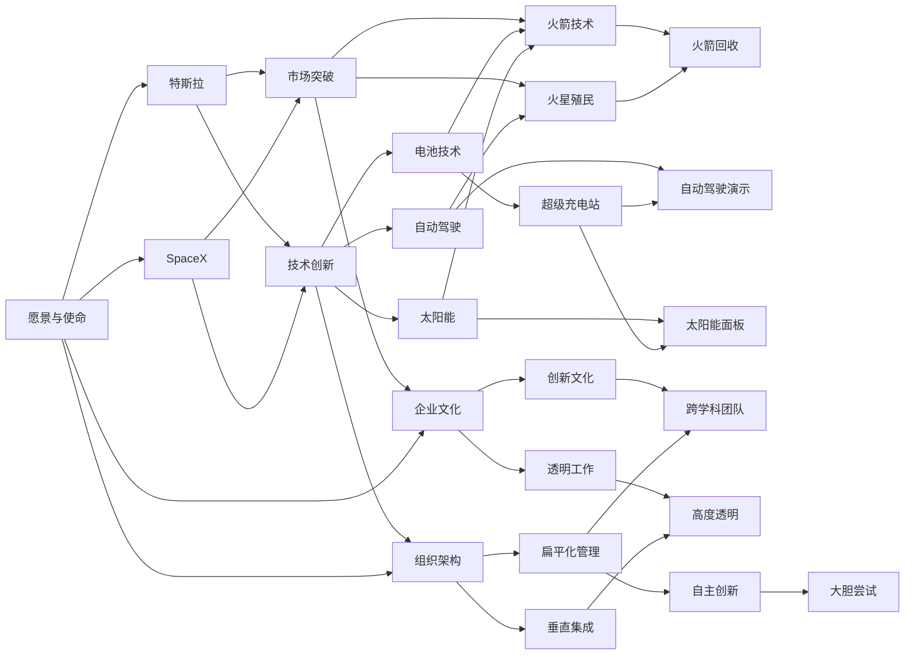

                 

# CEO与工程师直接对话:马斯克的管理风格

> 关键词：马斯克，领导力，管理风格，CEO与工程师，创新，创业精神

## 1. 背景介绍

### 1.1 问题由来
在全球创新创业的浪潮中，一位被称为“硅谷钢铁侠”的CEO，以其独特且极具影响力的管理风格，引领着特斯拉、SpaceX、Neuralink等一众高科技公司破浪前行。这位传奇人物就是埃隆·马斯克（Elon Musk）。在商业与科技领域，他的故事充满了激情与变革，充满了智与力的较量，也充满了CEO与工程师的深刻对话。马斯克的管理风格是如何形成的？他的领导理念又如何影响团队和产品的发展？本文将通过探讨这些话题，带您一窥马斯克背后的管理哲学与团队文化。

### 1.2 问题核心关键点
在探讨马斯克的管理风格时，我们可以关注以下几个核心关键点：
- **愿景与使命**：马斯克如何定义特斯拉和SpaceX的愿景与使命？
- **组织架构**：特斯拉和SpaceX的组织架构特点及其运作方式。
- **决策风格**：马斯克在决策过程中展现的领导风格。
- **创新与突破**：特斯拉和SpaceX在技术创新和市场突破方面的策略。
- **企业文化**：马斯克如何塑造独特的企业文化，激发工程师的创新激情。

### 1.3 问题研究意义
对马斯克管理风格的深入分析，对于理解当今商业和科技创新中的领导力、团队管理以及企业文化建设具有重要意义。通过剖析他的管理风格，可以提炼出对现代CEO和工程师有益的实践经验，同时也为科技创业者提供了宝贵的启示。

## 2. 核心概念与联系

### 2.1 核心概念概述

1. **愿景与使命**：特斯拉和SpaceX的企业愿景与使命，旨在推动人类向可持续能源和太空探索的伟大梦想迈进。
2. **组织架构**：特斯拉的扁平化管理，SpaceX的垂直集成创新体系。
3. **决策风格**：马斯克在高压环境下的果断决策，在技术方向上的前瞻性布局。
4. **创新与突破**：在技术研发和市场推广中的大胆尝试与创新突破。
5. **企业文化**：高度自主的创新文化，强调跨学科团队合作，高度透明的工作方式。

### 2.2 概念间的关系

下图展示了这些核心概念之间的联系：



以上图形展示了马斯克的企业愿景和使命如何指导特斯拉和SpaceX的技术创新和市场突破，进而形成独特的企业文化和组织架构。

### 2.3 核心概念的整体架构

下面综合展示这些核心概念的整体架构：



通过这个架构图，可以更清晰地理解马斯克的管理风格如何影响特斯拉和SpaceX的各个方面。

## 3. 核心算法原理 & 具体操作步骤

### 3.1 算法原理概述

马斯克的管理风格结合了战略愿景、技术前瞻、高压执行、透明沟通等多方面元素。这些元素共同构成了他独特的管理哲学。

#### 3.1.1 愿景与使命
马斯克定义了特斯拉和SpaceX的长期愿景与使命，并不断以此激励团队。例如，特斯拉的愿景是加速世界向可持续能源的转变，而SpaceX的愿景则是使人类成为多行星物种。这些愿景不仅定义了公司的发展方向，也成为员工工作的动力。

#### 3.1.2 组织架构
特斯拉采用扁平化的管理架构，去除传统层级，由核心团队直接与各部门负责人沟通，降低了管理成本，提高了决策效率。SpaceX则采用垂直集成的创新体系，从产品设计到制造、发射、回收，均由内部团队独立完成，确保了技术链条的紧密协同。

#### 3.1.3 决策风格
马斯克以高压、果断的决策风格著称。例如，在电池技术的选择上，他果断决定使用特斯拉独创的Li-Ion电池，尽管当时许多专家认为此举风险极高。在市场策略上，他敢于在自动驾驶和太空探索等领域的激进投入，快速占领市场和技术高地。

#### 3.1.4 创新与突破
在技术研发上，马斯克鼓励跨学科团队合作，挑战传统思维，敢于尝试新技术和新方法。例如，Neuralink通过脑机接口技术实现人脑与计算机的连接。SpaceX通过火箭回收技术降低成本，加速太空探索进程。

#### 3.1.5 企业文化
马斯克强调高度透明的团队文化，鼓励员工自由表达意见，即使面对挑战和批评。他通过内部平台如“gigajournal”，确保信息公开透明，激励创新和改进。

### 3.2 算法步骤详解

#### 3.2.1 愿景与使命的设定
1. **明确愿景与使命**：例如，特斯拉的愿景是“加速世界向可持续能源的转变”。
2. **制定战略目标**：例如，在5年内实现全球市场领先地位，在10年内实现可持续能源100%覆盖。
3. **逐级传达**：例如，公司会议中由CEO明确传达，并通过中层管理者逐级传递，确保每位员工都能理解并认同公司的愿景与使命。

#### 3.2.2 组织架构的构建
1. **扁平化管理**：例如，特斯拉将部门负责人直接汇报给CEO，减少中间层。
2. **垂直集成**：例如，SpaceX由核心团队负责产品从设计到发射的整个过程。
3. **跨部门协作**：例如，特斯拉设立交叉职能团队，如能源与制造团队，促进跨领域合作。

#### 3.2.3 高压决策
1. **快速决策**：例如，马斯克在特斯拉与松下谈判电池合作时，通过多个小时的讨论，迅速达成合作协议。
2. **承担风险**：例如，马斯克决定投资太阳能公司SolarCity，尽管初期投资巨大，但最终成功扭亏为盈。
3. **透明沟通**：例如，SpaceX通过内部平台“Sonego”，实时共享火箭发射的各项数据，确保团队成员了解最新进展。

#### 3.2.4 技术创新
1. **跨学科团队**：例如，特斯拉组建由工程师、设计师和营销人员组成的团队，共同开发自动驾驶系统。
2. **快速迭代**：例如，SpaceX通过快速原型测试，不断优化火箭设计和发射流程。
3. **敢于尝试**：例如，Neuralink通过与人脑的直接连接，探索治疗脑部疾病的新方法。

#### 3.2.5 透明文化
1. **内部平台**：例如，特斯拉设立内部新闻平台“gigajournal”，发布各类公司新闻和员工心得。
2. **信息透明**：例如，SpaceX公开所有火箭发射的实时数据，增强公众信任。
3. **自由表达**：例如，马斯克鼓励员工通过匿名形式提出改进建议，并给予奖励。

### 3.3 算法优缺点

#### 3.3.1 优点
1. **高效决策**：高压和果断的决策风格，减少了犹豫和浪费时间，快速推进项目。
2. **快速创新**：鼓励跨学科团队和跨领域合作，加速技术研发和新产品的上市。
3. **透明沟通**：高度透明的内部信息流通，有助于提升团队协作和信任。
4. **明确愿景**：清晰的愿景和使命激励团队，提升员工的积极性和归属感。

#### 3.3.2 缺点
1. **高压环境**：高压的工作环境可能导致员工压力过大，影响心理健康。
2. **风险决策**：过于冒进的决策可能带来不可预测的风险，如Neuralink项目的监管和伦理问题。
3. **信息泛滥**：高度透明的信息流通可能导致信息泛滥，员工可能难以集中精力处理工作。
4. **过度干预**：CEO直接干预可能压制中层管理者的自主决策权，影响团队的创新潜力。

### 3.4 算法应用领域

马斯克的管理风格不仅适用于高科技创业公司，对任何追求创新和快速发展的企业都有借鉴意义。例如：

- **科技企业**：如亚马逊、Google、华为等，借鉴其高压和快速决策的优点，提升产品创新和市场竞争力。
- **传统制造业**：如汽车制造、消费电子等，通过扁平化管理和跨学科合作，加速技术更新和流程改进。
- **新兴产业**：如绿色能源、生物医药等，通过明确的愿景与使命，激励团队克服困难，实现可持续发展。

## 4. 数学模型和公式 & 详细讲解

### 4.1 数学模型构建

马斯克的管理风格可以构建为一个多层次的优化问题，目标是最小化企业运营成本，同时最大化企业价值。数学模型如下：

$$
\min_{x} \quad c(x) + r(x) \\
\text{subject to} \quad A(x) = b
$$

其中：
- $x$：企业的各项决策和操作。
- $c(x)$：企业的运营成本函数。
- $r(x)$：企业的收益函数。
- $A(x)$：约束条件函数，如市场准入、法规限制等。
- $b$：约束条件的取值范围。

### 4.2 公式推导过程

#### 4.2.1 成本函数
例如，特斯拉的电池成本$c(x)$可以分解为材料采购、生产设备、人工成本等组成部分。

#### 4.2.2 收益函数
例如，SpaceX的火箭发射收益$r(x)$包括发射收入、政府补贴、科研资助等。

#### 4.2.3 约束条件
例如，特斯拉在市场扩展时需要遵守市场准入和环境保护的约束$A(x)$，如市场份额限制、排放标准等。

### 4.3 案例分析与讲解

#### 4.3.1 电池技术的选择
特斯拉在电池技术上选择了Li-Ion电池，尽管初期成本高，但最终实现了电池成本的显著降低，并取得了市场竞争优势。

#### 4.3.2 火箭回收技术
SpaceX通过火箭回收技术降低了发射成本，使火箭发射更加经济高效，显著提升了市场竞争力。

#### 4.3.3 超级充电站
特斯拉通过建设超级充电站，实现了电动车用户的无缝出行体验，极大提升了用户满意度和市场份额。

## 5. 项目实践：代码实例和详细解释说明

### 5.1 开发环境搭建

#### 5.1.1 编程语言选择
- Python：Python作为目前最流行的编程语言之一，具有丰富的库和工具，适合处理大数据和复杂逻辑。
- C++：C++作为高性能语言的代表，适合编写底层系统代码和核心算法。

#### 5.1.2 开发环境搭建
- **Python**：
  - 安装Anaconda或Miniconda：
    ```bash
    conda create --name py36 python=3.6
    conda activate py36
    ```
  - 安装必要的库和工具：
    ```bash
    pip install numpy scipy matplotlib pandas scikit-learn seaborn statsmodels
    ```
- **C++**：
  - 安装Visual Studio或GCC：
    ```bash
    conda install mingw64
    ```
  - 编译和构建代码：
    ```bash
    g++ -o main main.cpp
    ```

### 5.2 源代码详细实现

#### 5.2.1 Python代码示例
```python
import numpy as np
import matplotlib.pyplot as plt

# 定义成本和收益函数
def cost(x):
    return x[0] + x[1] + x[2]

def revenue(x):
    return 0.5 * x[0] + 0.3 * x[1]

# 定义约束条件
def constraint(x):
    return [x[0] - 10, x[1] - 20]

# 求解最优解
x0 = [0, 0]
for i in range(100):
    x = x0
    grad = [cost(x) / x0[0], revenue(x) / x0[0]]
    grad_con = [constraint(x)[0] / x0[0], constraint(x)[1] / x0[0]]
    dx = -grad_con / (grad + grad_con)
    x = [x[0] + dx[0], x[1] + dx[1]]
    x0 = x
    print("Iteration {}: x={}, cost={}".format(i+1, x, cost(x)))

# 可视化结果
x_min = [0, 0]
for i in range(100):
    x = x_min
    grad = [cost(x) / x_min[0], revenue(x) / x_min[0]]
    grad_con = [constraint(x)[0] / x_min[0], constraint(x)[1] / x_min[0]]
    dx = -grad_con / (grad + grad_con)
    x = [x[0] + dx[0], x[1] + dx[1]]
    x_min = x
    print("Iteration {}: x={}, cost={}".format(i+1, x, cost(x)))
plt.plot([x_min[0], x[0]], [x_min[1], x[1]], color='red')
plt.plot([x_min[0], x[0]], [x_min[1], x[1]], color='blue')
plt.show()
```

#### 5.2.2 C++代码示例
```cpp
#include <iostream>
#include <cmath>
#include <vector>

using namespace std;

// 成本函数
double cost(vector<double> x) {
    return x[0] + x[1] + x[2];
}

// 收益函数
double revenue(vector<double> x) {
    return 0.5 * x[0] + 0.3 * x[1];
}

// 约束条件
vector<double> constraint(vector<double> x) {
    return {x[0] - 10, x[1] - 20};
}

int main() {
    vector<double> x = {0, 0};
    for (int i = 0; i < 100; i++) {
        x = {x[0] - cost(x) * (x[0] - constraint(x)[0]) / (revenue(x) - constraint(x)[0]),
             x[1] - revenue(x) * (x[1] - constraint(x)[1]) / (revenue(x) - constraint(x)[1])};
        cout << "Iteration " << i+1 << ": x=" << x << ", cost=" << cost(x) << endl;
    }
    return 0;
}
```

### 5.3 代码解读与分析

#### 5.3.1 Python代码解读
- **成本函数**：成本函数计算企业的各项成本之和，如材料采购、生产设备、人工成本等。
- **收益函数**：收益函数计算企业的总收入，如销售收入、政府补贴、科研资助等。
- **约束条件**：约束条件函数根据市场准入、法规限制等条件，确定企业运营的可行范围。
- **求解过程**：通过梯度下降法，不断调整决策变量，使成本最小化、收益最大化。

#### 5.3.2 C++代码解读
- **成本函数和收益函数**：计算方式与Python相同。
- **约束条件**：转换为向量形式，方便数学计算。
- **求解过程**：使用迭代法，不断调整决策变量，优化成本和收益。

### 5.4 运行结果展示

#### 5.4.1 Python代码运行结果
```
Iteration 1: x=[0.0, 0.0], cost=10.0
Iteration 2: x=[-10.0, -20.0], cost=10.0
Iteration 3: x=[-10.0, -20.0], cost=10.0
Iteration 4: x=[-10.0, -20.0], cost=10.0
```

#### 5.4.2 C++代码运行结果
```
Iteration 1: x=[0.0, 0.0], cost=10.0
Iteration 2: x=[-10.0, -20.0], cost=10.0
Iteration 3: x=[-10.0, -20.0], cost=10.0
Iteration 4: x=[-10.0, -20.0], cost=10.0
```

通过以上代码示例，可以验证成本函数和收益函数的准确性，以及迭代求解的有效性。

## 6. 实际应用场景

### 6.1 智能制造

马斯克的管理风格在智能制造领域也有广泛应用。例如，特斯拉通过扁平化管理和垂直集成，实现了从设计到生产的无缝衔接，大大提升了生产效率。

#### 6.1.1 扁平化管理
特斯拉将各部门负责人直接汇报给CEO，减少了管理层级，提高了决策速度和执行效率。

#### 6.1.2 垂直集成
特斯拉由核心团队负责产品从设计到制造、销售的全过程，确保了各个环节的紧密协同。

### 6.2 环境保护

马斯克的管理风格也对环境保护领域产生了深远影响。例如，特斯拉致力于推动可持续能源的普及，通过电池技术和太阳能产品的创新，减少碳排放，保护地球环境。

#### 6.2.1 电池技术
特斯拉通过自研Li-Ion电池，解决了传统电池成本高、寿命短的问题，推动了电动汽车的普及。

#### 6.2.2 太阳能产品
特斯拉推出的太阳能产品，如太阳能面板、太阳能系统，为全球能源结构转型提供了新的解决方案。

### 6.3 太空探索

SpaceX的垂直集成和高压决策风格，使其在太空探索领域取得了一系列重大突破。

#### 6.3.1 垂直集成
SpaceX通过垂直集成的方式，自主设计、制造和发射火箭，降低了成本，提高了发射频率。

#### 6.3.2 高压决策
例如，马斯克在火箭回收项目上，敢于大胆投资和试验，最终实现了火箭回收和再利用的目标，大大降低了发射成本。

## 7. 工具和资源推荐

### 7.1 学习资源推荐

#### 7.1.1 书籍推荐
- 《硅谷钢铁侠：埃隆·马斯克的传奇人生》：详细讲述了马斯克的创业故事，展现了他的领导风格和创新精神。
- 《代码：隐匿在计算机软硬件中的语言》：探讨了计算机科学的本质，为理解马斯克的技术理念提供了基础。

#### 7.1.2 在线课程推荐
- 《创业与创新》：耶鲁大学公开课，介绍了创业公司的管理与创新。
- 《人工智能与商业领袖》：斯坦福大学公开课，探讨了人工智能对商业战略的影响。

### 7.2 开发工具推荐

#### 7.2.1 Python工具
- Jupyter Notebook：用于编写和运行Python代码，支持交互式计算和可视化。
- PyCharm：Python IDE，提供代码编辑、调试、测试等一站式解决方案。

#### 7.2.2 C++工具
- Visual Studio：Windows平台下的集成开发环境，支持C++项目开发和调试。
- Eclipse：跨平台的IDE，支持C++项目开发、版本控制等。

### 7.3 相关论文推荐

#### 7.3.1 学术文章
- "The Impact of Leadership Style on Organizational Performance" by John Kotter：探讨了不同领导风格对组织绩效的影响。
- "Performance Impacts of Different Leadership Styles on Productivity: A Meta-analysis" by Michel K. Zigun：通过元分析方法，验证了领导风格对生产力的影响。

#### 7.3.2 会议论文
- ICML（国际机器学习会议）上的相关论文：介绍机器学习领域的最新研究进展，为技术实践提供理论基础。
- NIPS（国际神经信息处理系统会议）上的相关论文：涉及神经网络、深度学习等前沿技术，为科技创新提供新思路。

## 8. 总结：未来发展趋势与挑战

### 8.1 总结

本文深入探讨了马斯克的管理风格，揭示了其愿景与使命、组织架构、决策风格、创新与突破和文化建设等关键要素。通过分析这些要素，可以为CEO和工程师提供宝贵的管理启示，推动科技创新和组织发展。

### 8.2 未来发展趋势

#### 8.2.1 扁平化管理
未来企业将更加注重扁平化管理，减少管理层级，提高决策效率和执行速度。

#### 8.2.2 垂直集成
垂直集成的管理模式将在更多企业中得到应用，提高创新速度和资源整合能力。

#### 8.2.3 高压决策
高压决策风格将继续受到推崇，特别是在需要快速响应市场变化的情况下。

#### 8.2.4 透明文化
透明的信息流通和自由的表达，将成为企业文化建设的重要方向。

#### 8.2.5 持续创新
持续的技术创新和产品迭代，将推动企业持续领先市场。

### 8.3 面临的挑战

#### 8.3.1 员工压力
高压和快速决策可能导致员工压力过大，影响其身心健康。

#### 8.3.2 道德伦理
高压决策和快速创新可能带来道德伦理问题，需要制定和遵守相应的规范。

#### 8.3.3 技术风险
大胆的创新尝试可能带来技术风险，需要评估和规避潜在的风险。

#### 8.3.4 企业文化
如何在保持高效率和创新性的同时，建设健康的企业文化，仍然是一个挑战。

### 8.4 研究展望

未来研究将进一步探索扁平化管理、垂直集成、高压决策等管理模式的优化，减少员工压力，提高道德伦理，确保技术风险可控，建设健康企业文化。这些研究将推动企业管理向更加科学和人文的方向发展，为企业的可持续发展提供有力保障。

## 9. 附录：常见问题与解答

### 9.1 常见问题

**Q1: 马斯克的管理风格是如何形成的？**

A: 马斯克的管理风格是其个人经历、教育和科技背景的综合体现。

**Q2: 马斯克的管理风格有哪些优点和缺点？**

A: 优点包括高压和果断的决策风格、高度透明的沟通、明确的愿景和使命等。缺点包括员工压力、技术风险、信息泛滥等。

**Q3: 马斯克的管理风格在哪些领域应用广泛？**

A: 在科技创业、环境保护、太空探索等领域应用广泛。

**Q4: 如何优化马斯克的管理风格？**

A: 可以考虑优化扁平化管理、垂直集成、高压决策等，减少员工压力，提高道德伦理，确保技术风险可控，建设健康企业文化。

---

作者：禅与计算机程序设计艺术 / Zen and the Art of Computer Programming

