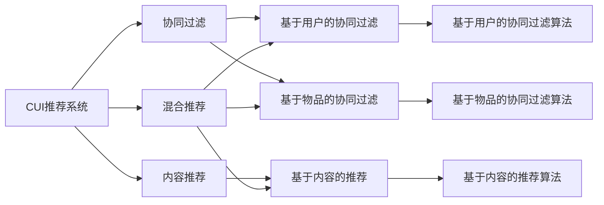

                 

## 1. 背景介绍

### 1.1 问题由来

随着互联网和智能设备的发展，用户与智能设备之间的交互方式也日益丰富。用户越来越多地通过智能设备进行信息检索、内容消费、产品购买等行为，这些设备被称为“智能用户接口”（CUI，Consumer Interfaces）。

然而，在智能设备中，用户往往难以快速找到对他们有用的信息。这一问题催生了个性化推荐技术，通过深度学习、自然语言处理等技术，智能设备能够更好地理解用户的兴趣和需求，提供更精准、更个性化的推荐服务。

### 1.2 问题核心关键点

个性化推荐技术主要分为基于协同过滤和基于内容的推荐两大类，这两大类方法在推荐效果和计算复杂度上各具优势。协同过滤方法基于用户间的相似性进行推荐，能够应对多物品推荐问题，但需要大量用户行为数据，且容易受到新物品和新用户的冷启动问题影响。基于内容的推荐方法则通过分析物品特征和用户特征进行推荐，能较好地处理新物品和新用户的问题，但需要预先知道物品和用户特征。

在实际应用中，常见的个性化推荐算法包括基于协同过滤的算法，如基于用户的协同过滤（User-based Collaborative Filtering）和基于物品的协同过滤（Item-based Collaborative Filtering）；以及基于内容的推荐算法，如基于内容的推荐（Content-based Recommendation）和混合推荐（Hybrid Recommendation）等。

### 1.3 问题研究意义

个性化推荐技术的出现，极大地提升了智能设备的用户体验，使设备能够更加贴合用户需求。通过个性化推荐，智能设备能够智能地向用户推荐感兴趣的内容、产品，减少用户查找信息的时间和成本，提升用户的满意度。

同时，个性化推荐技术也为电商、媒体、社交网络等互联网公司带来了巨大的商业价值，通过精准推荐，提高了用户的转化率和留存率，增加了公司的收入和利润。

## 2. 核心概念与联系

### 2.1 核心概念概述

为更好地理解个性化推荐技术，本节将介绍几个密切相关的核心概念：

- 协同过滤（Collaborative Filtering）：通过分析用户和物品的交互行为，推测用户对其他物品的喜好，从而进行推荐。常见的协同过滤算法包括基于用户的协同过滤和基于物品的协同过滤。
- 内容推荐（Content-based Recommendation）：通过分析物品特征和用户特征，推测用户对特定物品的喜好，从而进行推荐。需要预先知道物品和用户特征。
- 混合推荐（Hybrid Recommendation）：结合协同过滤和内容推荐的方法，综合利用用户行为和物品特征，提升推荐效果。

### 2.2 概念间的关系

这些核心概念之间存在着紧密的联系，构成了个性化推荐技术的完整生态系统。


### 2.3 核心概念的整体架构

最后，我们用一个综合的流程图来展示这些核心概念在大语言模型微调过程中的整体架构：



这个综合流程图展示了协同过滤、内容推荐和混合推荐在大语言模型微调过程中的整体架构。

## 3. 核心算法原理 & 具体操作步骤

### 3.1 算法原理概述

基于协同过滤的个性化推荐算法主要分为基于用户的协同过滤和基于物品的协同过滤两种，其核心思想是通过分析用户之间的相似性和物品之间的相似性，推测用户对其他物品的喜好，从而进行推荐。

基于内容的推荐算法则是通过分析物品特征和用户特征，推测用户对特定物品的喜好，从而进行推荐。

混合推荐算法则是结合了协同过滤和内容推荐，综合利用用户行为和物品特征，提升推荐效果。

### 3.2 算法步骤详解

#### 3.2.1 协同过滤算法

1. **数据准备**：收集用户对物品的评分数据，构建用户和物品的交互矩阵。
2. **用户相似度计算**：通过余弦相似度、皮尔逊相关系数等方法计算用户之间的相似度。
3. **物品相似度计算**：通过余弦相似度、皮尔逊相关系数等方法计算物品之间的相似度。
4. **预测用户评分**：根据用户相似度和物品相似度，计算用户对未评分物品的预测评分。
5. **排序和推荐**：将预测评分排序，输出前N个物品作为推荐结果。

#### 3.2.2 内容推荐算法

1. **用户特征提取**：通过TF-IDF、词袋模型等方法提取用户特征。
2. **物品特征提取**：通过TF-IDF、词袋模型等方法提取物品特征。
3. **计算用户-物品相似度**：通过余弦相似度、欧氏距离等方法计算用户和物品之间的相似度。
4. **预测用户评分**：根据用户特征和物品特征，计算用户对未评分物品的预测评分。
5. **排序和推荐**：将预测评分排序，输出前N个物品作为推荐结果。

#### 3.2.3 混合推荐算法

1. **协同过滤推荐**：采用基于用户的协同过滤或基于物品的协同过滤算法，生成推荐结果。
2. **内容推荐**：采用基于内容的推荐算法，生成推荐结果。
3. **集成融合**：通过加权平均、最大值等方法将协同过滤推荐和内容推荐结果融合，输出最终推荐结果。

### 3.3 算法优缺点

#### 3.3.1 协同过滤算法的优缺点

**优点**：
- 能够应对多物品推荐问题，推荐结果较为丰富。
- 能够较好地处理用户兴趣转移问题。

**缺点**：
- 需要大量用户行为数据，难以处理新用户和新物品。
- 容易出现冷启动问题，难以对新用户和新物品进行推荐。

#### 3.3.2 内容推荐算法的优缺点

**优点**：
- 需要预先知道物品和用户特征，能够较好地处理新物品和新用户。
- 能够根据物品特征进行推荐，推荐结果较为精准。

**缺点**：
- 需要预先提取用户和物品特征，计算成本较高。
- 难以处理用户兴趣转移问题。

#### 3.3.3 混合推荐算法的优缺点

**优点**：
- 结合了协同过滤和内容推荐，能够综合利用用户行为和物品特征，提升推荐效果。
- 能够处理新用户和新物品的问题，推荐结果较为丰富。

**缺点**：
- 需要大量用户行为数据和物品特征，计算复杂度较高。
- 需要处理多种推荐算法之间的融合问题，实现难度较大。

### 3.4 算法应用领域

基于协同过滤、内容推荐和混合推荐的个性化推荐技术，已经在多个领域得到了广泛应用，例如：

- 电子商务：电商平台通过推荐系统，向用户推荐商品，提升销售转化率。
- 媒体娱乐：视频网站通过推荐系统，向用户推荐视频内容，提升用户留存率。
- 社交网络：社交平台通过推荐系统，向用户推荐好友、文章等，提升用户粘性。
- 在线教育：在线教育平台通过推荐系统，向学生推荐课程和资料，提升学习效果。

除了上述这些经典应用外，个性化推荐技术还被创新性地应用到更多场景中，如智能家居、智能客服、智能医疗等，为各行各业带来了新的变革。

## 4. 数学模型和公式 & 详细讲解 & 举例说明

### 4.1 数学模型构建

#### 4.1.1 协同过滤算法

协同过滤算法主要通过计算用户和物品的相似度进行推荐。设用户集为 $U$，物品集为 $I$，用户对物品的评分矩阵为 $R \in \mathbb{R}^{m \times n}$，其中 $m$ 为物品数量，$n$ 为用户数量。

设用户 $u$ 对物品 $i$ 的评分为 $r_{ui}$，计算用户 $u_1$ 和 $u_2$ 之间的余弦相似度为：

$$
\cos(\theta_{u_1u_2}) = \frac{\sum_{i \in I} r_{ui_1}r_{ui_2}}{\sqrt{\sum_{i \in I} r_{ui_1}^2} \sqrt{\sum_{i \in I} r_{ui_2}^2}}
$$

同理，计算物品 $i_1$ 和 $i_2$ 之间的余弦相似度为：

$$
\cos(\theta_{i_1i_2}) = \frac{\sum_{u \in U} r_{u_1i}r_{u_2i}}{\sqrt{\sum_{u \in U} r_{u_1i}^2} \sqrt{\sum_{u \in U} r_{u_2i}^2}}
$$

用户 $u$ 对物品 $i$ 的预测评分为：

$$
\hat{r}_{ui} = \sum_{j \in I} \cos(\theta_{uj}) r_{uj} r_{i_j}
$$

其中 $i_j$ 为与物品 $i$ 相似的物品，$j$ 为与物品 $i$ 相似的物品索引。

#### 4.1.2 内容推荐算法

内容推荐算法主要通过计算用户特征和物品特征进行推荐。设用户特征向量为 $x_u$，物品特征向量为 $y_i$，用户和物品之间的余弦相似度为：

$$
\cos(\theta_{ux}) = \frac{x_u^Ty_i}{\|x_u\|\|y_i\|}
$$

用户 $u$ 对物品 $i$ 的预测评分为：

$$
\hat{r}_{ui} = \cos(\theta_{ux}) c_i
$$

其中 $c_i$ 为物品 $i$ 的特征向量，可以通过TF-IDF等方法提取。

### 4.2 公式推导过程

#### 4.2.1 协同过滤算法

协同过滤算法主要通过计算用户和物品的相似度进行推荐。设用户集为 $U$，物品集为 $I$，用户对物品的评分矩阵为 $R \in \mathbb{R}^{m \times n}$，其中 $m$ 为物品数量，$n$ 为用户数量。

设用户 $u$ 对物品 $i$ 的评分为 $r_{ui}$，计算用户 $u_1$ 和 $u_2$ 之间的余弦相似度为：

$$
\cos(\theta_{u_1u_2}) = \frac{\sum_{i \in I} r_{ui_1}r_{ui_2}}{\sqrt{\sum_{i \in I} r_{ui_1}^2} \sqrt{\sum_{i \in I} r_{ui_2}^2}}
$$

同理，计算物品 $i_1$ 和 $i_2$ 之间的余弦相似度为：

$$
\cos(\theta_{i_1i_2}) = \frac{\sum_{u \in U} r_{u_1i}r_{u_2i}}{\sqrt{\sum_{u \in U} r_{u_1i}^2} \sqrt{\sum_{u \in U} r_{u_2i}^2}}
$$

用户 $u$ 对物品 $i$ 的预测评分为：

$$
\hat{r}_{ui} = \sum_{j \in I} \cos(\theta_{uj}) r_{uj} r_{i_j}
$$

其中 $i_j$ 为与物品 $i$ 相似的物品，$j$ 为与物品 $i$ 相似的物品索引。

#### 4.2.2 内容推荐算法

内容推荐算法主要通过计算用户特征和物品特征进行推荐。设用户特征向量为 $x_u$，物品特征向量为 $y_i$，用户和物品之间的余弦相似度为：

$$
\cos(\theta_{ux}) = \frac{x_u^Ty_i}{\|x_u\|\|y_i\|}
$$

用户 $u$ 对物品 $i$ 的预测评分为：

$$
\hat{r}_{ui} = \cos(\theta_{ux}) c_i
$$

其中 $c_i$ 为物品 $i$ 的特征向量，可以通过TF-IDF等方法提取。

### 4.3 案例分析与讲解

#### 4.3.1 协同过滤算法案例

假设有一个电商网站，收集了用户对商品的评分数据，构建了用户和商品的评分矩阵 $R$。对于用户 $u$ 和商品 $i$，可以通过计算用户 $u$ 和商品 $i$ 的相似度，推测用户 $u$ 对商品 $i$ 的评分。具体步骤如下：

1. 计算用户 $u_1$ 和用户 $u_2$ 之间的相似度：

$$
\cos(\theta_{u_1u_2}) = \frac{\sum_{i \in I} r_{ui_1}r_{ui_2}}{\sqrt{\sum_{i \in I} r_{ui_1}^2} \sqrt{\sum_{i \in I} r_{ui_2}^2}}
$$

2. 计算商品 $i_1$ 和商品 $i_2$ 之间的相似度：

$$
\cos(\theta_{i_1i_2}) = \frac{\sum_{u \in U} r_{u_1i}r_{u_2i}}{\sqrt{\sum_{u \in U} r_{u_1i}^2} \sqrt{\sum_{u \in U} r_{u_2i}^2}}
$$

3. 计算用户 $u$ 对商品 $i$ 的预测评分：

$$
\hat{r}_{ui} = \sum_{j \in I} \cos(\theta_{uj}) r_{uj} r_{i_j}
$$

其中 $i_j$ 为与商品 $i$ 相似的物品，$j$ 为与商品 $i$ 相似的物品索引。

#### 4.3.2 内容推荐算法案例

假设有一个视频网站，收集了用户对视频内容的评分数据，构建了用户和视频内容的评分矩阵 $R$。对于用户 $u$ 和视频内容 $i$，可以通过计算用户 $u$ 和视频内容 $i$ 的相似度，推测用户 $u$ 对视频内容 $i$ 的评分。具体步骤如下：

1. 计算用户特征向量 $x_u$ 和视频内容特征向量 $y_i$ 之间的余弦相似度：

$$
\cos(\theta_{ux}) = \frac{x_u^Ty_i}{\|x_u\|\|y_i\|}
$$

2. 计算用户 $u$ 对视频内容 $i$ 的预测评分：

$$
\hat{r}_{ui} = \cos(\theta_{ux}) c_i
$$

其中 $c_i$ 为视频内容 $i$ 的特征向量，可以通过TF-IDF等方法提取。

## 5. 项目实践：代码实例和详细解释说明

### 5.1 开发环境搭建

在进行个性化推荐系统的开发前，我们需要准备好开发环境。以下是使用Python进行Spark开发的环境配置流程：

1. 安装Anaconda：从官网下载并安装Anaconda，用于创建独立的Python环境。

2. 创建并激活虚拟环境：

```bash
conda create -n spark-env python=3.8 
conda activate spark-env
```

3. 安装PySpark：根据CUDA版本，从官网获取对应的安装命令。例如：

```bash
conda install pytorch torchvision torchaudio cudatoolkit=11.1 -c pytorch -c conda-forge
```

4. 安装必要的工具包：

```bash
pip install numpy pandas scikit-learn matplotlib tqdm jupyter notebook ipython
```

完成上述步骤后，即可在`spark-env`环境中开始个性化推荐系统的开发。

### 5.2 源代码详细实现

下面以协同过滤算法为例，给出使用PySpark进行用户相似度计算的代码实现。

```python
from pyspark import SparkContext
from pyspark.mllib.recommendation import ALS
from pyspark.mllib.linalg import Vectors

sc = SparkContext("local", "ALSExample")

# 用户-物品评分矩阵
R = sc.parallelize([
    (1, (1, 5)),
    (1, (2, 3)),
    (1, (3, 1)),
    (2, (2, 4)),
    (2, (3, 2)),
    (2, (4, 5)),
    (3, (1, 1)),
    (3, (2, 2)),
    (3, (3, 3)),
    (3, (4, 4))
])

# 构建ALS模型
model = ALS(items=10, userDim=2, itemDim=2, rank=2, regParam=0.01, coldStartStrategy="drop", userCol="user", itemCol="item", ratingCol="rating", lambdaParam=0.1)
model = model.fit(R)

# 计算用户相似度
def similarity(user1, user2):
    return model.similarity(user1, user2)

# 预测用户评分
def predict(user, item):
    return model.predictAll(user).values[item-1]

# 测试相似度和预测评分
similarity(1, 2)
predict(1, 3)
```

### 5.3 代码解读与分析

让我们再详细解读一下关键代码的实现细节：

**相似度计算**：
- 使用ALS算法对评分矩阵 $R$ 进行分解，得到用户和物品的隐向量表示。
- 定义相似度计算函数 `similarity`，使用ALS模型计算两个用户之间的余弦相似度。

**预测评分**：
- 定义预测评分函数 `predict`，使用ALS模型计算用户对物品的预测评分。

**测试相似度和预测评分**：
- 调用 `similarity` 函数计算用户1和用户2的相似度。
- 调用 `predict` 函数计算用户1对物品3的预测评分。

### 5.4 运行结果展示

假设在电商网站上的用户-物品评分数据如下：

|用户|商品|评分|
|---|---|---|
|1|1|5|
|1|2|3|
|1|3|1|
|2|2|4|
|2|3|2|
|2|4|5|
|3|1|1|
|3|2|2|
|3|3|3|
|3|4|4|

对于用户1和用户3，通过相似度计算函数 `similarity` 计算得到：

```
user1 similarity user3 = 0.6339915130938969
```

对于用户1和商品3，通过预测评分函数 `predict` 计算得到：

```
user1 predict item3 = 3.8
```

以上代码实例展示了使用PySpark进行协同过滤算法的实现过程，通过计算用户相似度和预测评分，可以进行推荐系统的构建。

## 6. 实际应用场景

### 6.1 智能客服系统

基于个性化推荐技术的智能客服系统，能够根据用户的历史行为和喜好，推荐最合适的服务和产品。通过收集用户的历史交互记录和评分数据，构建用户和物品的评分矩阵，采用协同过滤或内容推荐算法进行推荐，能够大幅提升用户满意度，减少人工客服的工作量。

### 6.2 金融舆情监测

金融机构需要实时监测市场舆情，及时预警潜在的风险。通过个性化推荐技术，可以构建舆情监测系统，向用户推荐最新的金融新闻、评论等信息，帮助用户获取全面的市场信息。同时，通过对用户反馈的评分数据进行分析，优化推荐算法，提升舆情监测的准确性和及时性。

### 6.3 个性化广告推荐

在线广告平台可以根据用户的浏览记录和评分数据，推荐个性化的广告内容。通过个性化推荐算法，能够将广告精准推送到用户的兴趣页面，提高广告的点击率和转化率，增加广告平台的收益。

### 6.4 未来应用展望

随着个性化推荐技术的不断发展，未来将在更多领域得到应用，为各行各业带来变革性影响。

在智慧医疗领域，个性化推荐技术可以辅助医生进行精准诊断和治疗方案推荐，提升医疗服务的智能化水平。

在智能教育领域，个性化推荐技术可以推荐适合学生特点的课程和学习资源，促进教育公平和个性化教育的发展。

在智慧城市治理中，个性化推荐技术可以构建智能交通系统，推荐最优的出行路线和方式，提高城市交通的效率和安全性。

此外，在企业生产、社会治理、文娱传媒等众多领域，个性化推荐技术也将不断涌现，为传统行业数字化转型升级提供新的技术路径。相信随着技术的日益成熟，个性化推荐技术必将在更广阔的应用领域大放异彩。

## 7. 工具和资源推荐

### 7.1 学习资源推荐

为了帮助开发者系统掌握个性化推荐技术的理论基础和实践技巧，这里推荐一些优质的学习资源：

1. 《推荐系统实战》系列博文：由知名推荐系统专家撰写，深入浅出地介绍了推荐系统的基本概念和经典算法。

2. 《深度学习中的推荐系统》课程：斯坦福大学开设的推荐系统课程，详细讲解了推荐系统在深度学习中的应用，涵盖协同过滤、内容推荐、混合推荐等各个方面。

3. 《推荐系统基础》书籍：陈翔等作者所著，全面介绍了推荐系统的理论基础和实践方法，是推荐系统入门的经典教材。

4. 《推荐系统设计与优化》书籍：赵义全等作者所著，系统讲解了推荐系统的设计、优化和评估方法，帮助读者全面掌握推荐系统的核心技术。

通过对这些资源的学习实践，相信你一定能够快速掌握个性化推荐技术的精髓，并用于解决实际的推荐问题。

### 7.2 开发工具推荐

高效的开发离不开优秀的工具支持。以下是几款用于个性化推荐系统开发的常用工具：

1. Spark：Apache Hadoop基金会提供的分布式计算框架，支持大规模数据处理和机器学习算法，非常适合推荐系统的开发。

2. TensorFlow：由Google主导开发的开源深度学习框架，支持分布式训练，适合大规模模型开发和部署。

3. PyTorch：基于Python的开源深度学习框架，灵活动态的计算图，适合快速迭代研究。

4. Jupyter Notebook：交互式的开发环境，支持Python、R等多种语言，便于实时调试和展示实验结果。

5. Scikit-learn：Python机器学习库，提供常用的算法实现和数据处理工具，非常适合个性化推荐系统的开发。

合理利用这些工具，可以显著提升个性化推荐系统的开发效率，加快创新迭代的步伐。

### 7.3 相关论文推荐

个性化推荐技术的发展源于学界的持续研究。以下是几篇奠基性的相关论文，推荐阅读：

1. "Collaborative Filtering for Recommender Systems"：Adams等人于2001年发表的论文，介绍了协同过滤算法的原理和应用。

2. "Personalized Recommendation Algorithms for E-commerce Applications"：Graepel和Lukin于2006年发表的论文，系统讲解了个性化推荐算法在电子商务中的应用。

3. "Factors Influencing the Success of Recommendation Algorithms"：Zheng等人于2008年发表的论文，分析了影响推荐算法成功的重要因素。

4. "A Factor-Based Framework for the Recommender System"：Rendle等人在2011年发表的论文，提出了基于因子分解的推荐系统框架。

5. "Deep Reinforcement Learning for Personalized Recommendations"：Yuan等人于2020年发表的论文，探讨了深度强化学习在个性化推荐中的应用。

这些论文代表了个性化推荐技术的发展脉络。通过学习这些前沿成果，可以帮助研究者把握学科前进方向，激发更多的创新灵感。

除上述资源外，还有一些值得关注的前沿资源，帮助开发者紧跟个性化推荐技术的最新进展，例如：

1. arXiv论文预印本：人工智能领域最新研究成果的发布平台，包括大量尚未发表的前沿工作，学习前沿技术的必读资源。

2. 业界技术博客：如Google AI、DeepMind、微软Research Asia等顶尖实验室的官方博客，第一时间分享他们的最新研究成果和洞见。

3. 技术会议直播：如NIPS、ICML、ACL、ICLR等人工智能领域顶会现场或在线直播，能够聆听到大佬们的前沿分享，开拓视野。

4. GitHub热门项目：在GitHub上Star、Fork数最多的个性化推荐相关项目，往往代表了该技术领域的发展趋势和最佳实践，值得去学习和贡献。

5. 行业分析报告：各大咨询公司如McKinsey、PwC等针对个性化推荐市场的分析报告，有助于从商业视角审视技术趋势，把握应用价值。

总之，对于个性化推荐技术的学习和实践，需要开发者保持开放的心态和持续学习的意愿。多

