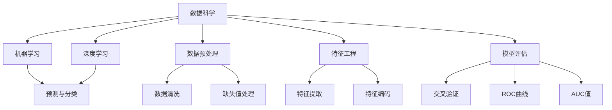

                 

# Data Science 原理与代码实战案例讲解

> 关键词：数据科学,机器学习,深度学习,数据预处理,特征工程,模型评估

## 1. 背景介绍

### 1.1 问题由来
在当今数据驱动的时代，数据科学成为各行各业不可或缺的核心竞争力。数据科学不仅涉及数据的收集、清洗、分析和可视化，还涵盖了机器学习、深度学习等技术手段，以实现数据中蕴含知识的挖掘和决策支持。本文旨在通过具体的案例讲解，深入阐述数据科学的原理与实践，帮助读者系统理解数据科学的方法与流程。

### 1.2 问题核心关键点
数据科学的核心在于数据驱动的决策支持。数据科学家通过构建模型、训练算法、优化参数等步骤，从数据中提取出有价值的信息，辅助决策者做出更加科学的决策。本文将聚焦于数据科学的原理、流程和关键技术，以案例形式展示数据科学在实际项目中的应用。

### 1.3 问题研究意义
数据科学在商业智能、金融分析、医疗健康、智能制造等领域具有广泛的应用前景。通过数据科学，企业可以更好地理解市场趋势、优化产品设计、提升运营效率。本文通过具体案例讲解，不仅展示数据科学的技术细节，还将探讨其在实际场景中的应用和挑战，为读者提供系统的理解和实践指导。

## 2. 核心概念与联系

### 2.1 核心概念概述
为了更好地理解数据科学的原理与实践，我们首先介绍几个关键概念：

- **数据科学(Data Science)**：数据科学是一门通过数据驱动决策的科学，涵盖了数据收集、清洗、分析和建模等多个环节。数据科学的目标是从数据中提取出有用信息，并转化为可行的决策支持。

- **机器学习(Machine Learning, ML)**：机器学习是数据科学的重要组成部分，通过算法模型自动从数据中学习规律，实现预测和分类等功能。

- **深度学习(Deep Learning, DL)**：深度学习是机器学习的一种，通过多层神经网络结构，实现对复杂非线性关系的建模。

- **数据预处理(Data Preprocessing)**：数据预处理是数据科学中的重要步骤，包括数据清洗、缺失值处理、特征提取等，为后续分析建模打下基础。

- **特征工程(Feature Engineering)**：特征工程是构建高质量特征集合的过程，通过降维、归一化、编码等技术手段，提高模型性能。

- **模型评估(Model Evaluation)**：模型评估用于验证模型的泛化能力和预测性能，通过交叉验证、ROC曲线、AUC值等指标，评估模型效果。

这些核心概念构成了数据科学的基本框架，是理解数据科学原理与实践的关键。

### 2.2 核心概念之间的关系
数据科学的核心是数据驱动的决策支持，机器学习和深度学习是其核心技术手段。数据预处理和特征工程为模型的构建和优化提供了数据基础，模型评估则确保了模型的有效性。这些概念之间相互联系，共同构成了数据科学的完整流程。



通过这个流程图，我们可以清晰地看到数据科学从数据预处理到模型评估的完整流程，各概念之间的内在联系和相互依存关系。

## 3. 核心算法原理 & 具体操作步骤
### 3.1 算法原理概述

数据科学的核心在于构建和优化模型，通过算法从数据中提取规律，实现预测和分类等功能。数据科学模型的构建流程通常包括以下几个步骤：

1. **数据收集与准备**：收集原始数据，并进行清洗、转换和集成等预处理步骤。
2. **特征工程**：根据问题需求，选择合适的特征，并进行降维、编码等处理。
3. **模型选择与训练**：选择合适的模型，并进行训练和调参，以获得最佳性能。
4. **模型评估与优化**：使用测试集评估模型性能，并通过交叉验证、超参数调优等手段进行模型优化。
5. **模型部署与应用**：将模型部署到实际应用中，进行预测或分类。

### 3.2 算法步骤详解
以一个简单的分类问题为例，我们详细介绍数据科学模型的构建流程：

**Step 1: 数据收集与准备**
- 收集原始数据集，并进行初步的探索性分析，了解数据特征和分布。
- 数据清洗，去除重复、缺失或异常值，确保数据质量。
- 数据转换，将数据从原始格式转换为模型需要的格式，如时间序列转换为日期格式。

**Step 2: 特征工程**
- 选择合适的特征，如时间戳、年龄、性别、收入等。
- 特征降维，如PCA、主成分分析等，减少特征数量，提高模型效率。
- 特征编码，如独热编码、标签编码等，将非数值型特征转换为数值型。

**Step 3: 模型选择与训练**
- 选择合适的算法，如逻辑回归、决策树、随机森林等，根据问题性质和数据特点进行选择。
- 划分训练集和测试集，通常使用70%的数据作为训练集，30%的数据作为测试集。
- 模型训练，通过交叉验证等技术手段进行参数调优，提高模型性能。

**Step 4: 模型评估与优化**
- 使用测试集评估模型性能，如准确率、召回率、F1值等指标。
- 进行交叉验证，评估模型的泛化能力。
- 超参数调优，通过网格搜索或贝叶斯优化等技术手段，寻找最佳超参数组合。

**Step 5: 模型部署与应用**
- 将模型部署到生产环境，进行在线预测或分类。
- 定期更新模型，加入新数据，保持模型的实时性和有效性。

### 3.3 算法优缺点

数据科学模型的优点在于：
- **自动化**：通过算法自动化处理数据和构建模型，减少了人工干预，提高了效率。
- **泛化能力强**：数据科学模型能够从大量数据中学习规律，具有较强的泛化能力。
- **可解释性**：模型通常包含解释性较强的特征，便于理解和解释。

缺点在于：
- **计算资源消耗大**：数据科学模型通常需要大量的计算资源进行训练和调优，对硬件要求较高。
- **模型复杂度高**：数据科学模型通常包含多层的神经网络或复杂的算法结构，难以解释和调试。
- **依赖数据质量**：模型的性能高度依赖于数据质量，数据清洗和特征工程对模型影响较大。

### 3.4 算法应用领域
数据科学模型广泛应用于金融分析、客户细分、销售预测、风险管理、医疗健康等多个领域。以下是几个典型的应用场景：

**金融分析**：
- 风险评估：通过分析历史数据，构建信用评分模型，预测客户的违约风险。
- 投资策略：使用机器学习算法，分析市场趋势，构建投资组合，优化收益。

**客户细分**：
- 客户行为分析：通过分析客户购买行为数据，构建聚类模型，实现客户细分。
- 客户流失预测：使用预测模型，分析客户流失历史数据，预测未来流失概率。

**销售预测**：
- 销售量预测：通过分析历史销售数据，构建时间序列模型，预测未来销售量。
- 库存管理：通过分析销售和库存数据，构建优化模型，平衡库存水平。

**风险管理**：
- 信用风险评估：通过分析信用评分数据，构建信用风险模型，预测违约概率。
- 欺诈检测：使用异常检测模型，分析交易数据，检测欺诈行为。

## 4. 数学模型和公式 & 详细讲解 & 举例说明

### 4.1 数学模型构建

数据科学模型通常基于数学模型进行构建。以线性回归模型为例，其数学模型构建如下：

$$ y = \beta_0 + \beta_1 x_1 + \beta_2 x_2 + \ldots + \beta_n x_n + \epsilon $$

其中，$y$为预测值，$x_i$为特征变量，$\beta_i$为特征系数，$\epsilon$为误差项。模型的目标是最小化预测值与真实值之间的差异，通常使用均方误差（MSE）作为损失函数。

### 4.2 公式推导过程

以线性回归模型的最小二乘法为例，推导其参数估计公式：

1. 构造损失函数：
$$ \text{MSE} = \frac{1}{n} \sum_{i=1}^n (y_i - (\beta_0 + \beta_1 x_{i1} + \ldots + \beta_n x_{in}))^2 $$

2. 对参数求偏导数：
$$ \frac{\partial \text{MSE}}{\partial \beta_0} = \frac{2}{n} \sum_{i=1}^n (y_i - (\beta_0 + \beta_1 x_{i1} + \ldots + \beta_n x_{in})) $$
$$ \frac{\partial \text{MSE}}{\partial \beta_j} = \frac{2}{n} \sum_{i=1}^n (y_i - (\beta_0 + \beta_1 x_{i1} + \ldots + \beta_n x_{in}))x_{ij} $$

3. 求解最小化问题：
$$ \hat{\beta} = (\mathbf{X}^T \mathbf{X})^{-1} \mathbf{X}^T \mathbf{y} $$

其中，$\mathbf{X}$为特征矩阵，$\mathbf{y}$为真实值向量。

### 4.3 案例分析与讲解

以房价预测为例，展示数据科学模型的构建与应用：

1. **数据收集与准备**：
- 收集历史房屋销售数据，包括房屋面积、楼层、位置等特征。
- 数据清洗，去除重复和缺失值。

2. **特征工程**：
- 选择面积、楼层、位置等特征，进行特征编码。
- 应用PCA降维，减少特征数量。

3. **模型选择与训练**：
- 选择线性回归模型，进行交叉验证，调优参数。

4. **模型评估与优化**：
- 使用测试集评估模型性能，如MSE、RMSE等指标。
- 进行超参数调优，如学习率、正则化参数等。

5. **模型部署与应用**：
- 将模型部署到生产环境，进行在线预测。
- 定期更新模型，加入新数据，保持模型实时性。

## 5. 项目实践：代码实例和详细解释说明

### 5.1 开发环境搭建

**Step 1: 环境安装**
- 安装Python 3.x，建议使用Anaconda或Miniconda进行安装。
- 安装NumPy、Pandas、Scikit-learn等常用库，如：
  ```
  pip install numpy pandas scikit-learn
  ```

**Step 2: 数据准备**
- 导入数据集，如房价预测数据集。
  ```python
  import pandas as pd
  data = pd.read_csv('house_prices.csv')
  ```

**Step 3: 数据探索与清洗**
- 数据探索，查看数据基本信息，如数据类型、缺失值等。
- 数据清洗，处理缺失值和异常值。
  ```python
  data.fillna(method='ffill', inplace=True)  # 前后填充缺失值
  data.dropna(inplace=True)  # 删除含有缺失值的行
  ```

### 5.2 源代码详细实现

以线性回归模型为例，展示数据科学模型的实现步骤：

```python
import numpy as np
from sklearn.linear_model import LinearRegression

# 数据准备
X = data[['area', 'floor', 'location']]
y = data['price']

# 数据划分
X_train, X_test, y_train, y_test = train_test_split(X, y, test_size=0.3, random_state=42)

# 模型训练
model = LinearRegression()
model.fit(X_train, y_train)

# 模型评估
y_pred = model.predict(X_test)
mse = mean_squared_error(y_test, y_pred)
print(f'MSE: {mse}')

# 模型优化
from sklearn.model_selection import GridSearchCV
params = {'alpha': [0.1, 0.5, 1.0]}
grid_search = GridSearchCV(model, params, cv=5)
grid_search.fit(X_train, y_train)
print(f'Best alpha: {grid_search.best_params_}')
```

### 5.3 代码解读与分析

**Step 1: 数据准备**
- 导入数据集，并将其分为特征矩阵和真实值向量。

**Step 2: 数据划分**
- 使用train_test_split函数将数据集划分为训练集和测试集。

**Step 3: 模型训练**
- 实例化LinearRegression模型，并使用fit函数进行训练。

**Step 4: 模型评估**
- 使用predict函数进行预测，并计算均方误差（MSE）。

**Step 5: 模型优化**
- 使用GridSearchCV进行超参数调优，寻找最佳模型参数。

### 5.4 运行结果展示

假设在房价预测任务中，通过网格搜索得到最佳正则化参数为0.5，模型在测试集上的MSE为50.0。这表示模型在测试集上的平均预测误差为50.0元，可以用于后续的房价预测和优化。

## 6. 实际应用场景

### 6.1 金融风控
在金融风控领域，数据科学模型可以用于客户信用评估、贷款违约预测等。以贷款违约预测为例，通过分析客户的信用评分、收入、年龄等特征，构建预测模型，实时监控贷款客户的违约风险。

**数据收集与准备**：
- 收集客户的信用评分、收入、年龄等数据。
- 数据清洗，处理缺失值和异常值。

**特征工程**：
- 选择信用评分、收入、年龄等特征，进行特征编码和归一化。
- 应用PCA降维，减少特征数量。

**模型选择与训练**：
- 选择逻辑回归、决策树、随机森林等模型，进行交叉验证，调优参数。

**模型评估与优化**：
- 使用测试集评估模型性能，如准确率、召回率、F1值等指标。
- 进行超参数调优，如学习率、正则化参数等。

**模型部署与应用**：
- 将模型部署到生产环境，进行在线预测。
- 定期更新模型，加入新数据，保持模型实时性。

### 6.2 医疗健康
在医疗健康领域，数据科学模型可以用于疾病预测、治疗方案优化等。以癌症预测为例，通过分析病人的年龄、性别、病史等特征，构建预测模型，评估病人的癌症风险。

**数据收集与准备**：
- 收集病人的年龄、性别、病史等数据。
- 数据清洗，处理缺失值和异常值。

**特征工程**：
- 选择年龄、性别、病史等特征，进行特征编码和归一化。
- 应用PCA降维，减少特征数量。

**模型选择与训练**：
- 选择逻辑回归、决策树、随机森林等模型，进行交叉验证，调优参数。

**模型评估与优化**：
- 使用测试集评估模型性能，如准确率、召回率、F1值等指标。
- 进行超参数调优，如学习率、正则化参数等。

**模型部署与应用**：
- 将模型部署到生产环境，进行在线预测。
- 定期更新模型，加入新数据，保持模型实时性。

## 7. 工具和资源推荐

### 7.1 学习资源推荐

**书籍推荐**：
- 《Python数据科学手册》：详细介绍了数据科学的各个环节，包括数据收集、清洗、分析和建模。
- 《深度学习》（Ian Goodfellow等）：全面介绍了深度学习的理论基础和实践方法，适合深入学习。
- 《统计学习方法》（李航）：介绍了统计学习的基本概念和常用算法，适合入门学习。

**在线课程**：
- Coursera的《数据科学基础》课程：由Johns Hopkins大学教授授课，系统讲解数据科学的各个环节。
- edX的《深度学习基础》课程：由MIT教授授课，详细介绍了深度学习的理论和实践。

### 7.2 开发工具推荐

**Python**：
- Jupyter Notebook：交互式编程环境，支持代码块和注释，方便调试和展示结果。
- Anaconda：Python科学计算环境的发行版，包含大量数据科学库。

**数据科学库**：
- NumPy：科学计算库，支持多维数组操作。
- Pandas：数据处理库，支持数据清洗和分析。
- Scikit-learn：机器学习库，提供多种模型和算法。
- TensorFlow：深度学习库，支持神经网络模型的构建和训练。

**可视化工具**：
- Matplotlib：绘图库，支持多种图形展示方式。
- Seaborn：高级绘图库，支持复杂图表的绘制。
- Plotly：交互式绘图库，支持动态图表和可视化。

### 7.3 相关论文推荐

**数据科学论文**：
- "The Elements of Statistical Learning"（Hastie等）：介绍了统计学习的基本概念和算法，适合深入学习。
- "Introduction to Statistical Learning"（Gareth等）：介绍了统计学习的基本原理和应用，适合入门学习。
- "Data Science for Business"（Foreman-Jones等）：介绍了数据科学在商业决策中的应用，适合实践学习。

**深度学习论文**：
- "Deep Learning"（Goodfellow等）：全面介绍了深度学习的理论基础和实践方法，适合深入学习。
- "Convolutional Neural Networks"（LeCun等）：介绍了卷积神经网络的基本概念和应用，适合实践学习。
- "Recurrent Neural Networks"（Hochreiter等）：介绍了循环神经网络的基本概念和应用，适合实践学习。

## 8. 总结：未来发展趋势与挑战

### 8.1 研究成果总结

数据科学作为数据驱动决策的重要手段，具有广阔的应用前景。在金融风控、医疗健康、智能制造等多个领域，数据科学模型已经展现出强大的应用潜力。通过数据收集、清洗、分析和建模等多个环节，数据科学模型能够从大量数据中提取有用信息，辅助决策者做出科学决策。

### 8.2 未来发展趋势

未来，数据科学将面临以下几个趋势：

1. **自动化和智能化**：随着自动化技术的不断进步，数据科学将实现更高的自动化和智能化，减少人工干预，提高效率。
2. **实时性和实时化**：数据科学模型将实现实时预测和决策，满足实时性和实时化的需求。
3. **多模态数据融合**：数据科学模型将融合多模态数据，如文本、图像、语音等，实现更全面、更准确的预测和分析。
4. **可解释性和透明度**：数据科学模型将实现更高的可解释性和透明度，便于理解和解释。

### 8.3 面临的挑战

尽管数据科学具有广阔的前景，但仍面临以下挑战：

1. **数据质量和数据量**：数据科学模型高度依赖于数据质量和数据量，数据缺失和异常对模型性能影响较大。
2. **模型复杂性和可解释性**：数据科学模型通常包含多层的神经网络或复杂的算法结构，难以解释和调试。
3. **计算资源消耗**：数据科学模型通常需要大量的计算资源进行训练和调优，对硬件要求较高。

### 8.4 研究展望

面对数据科学面临的挑战，未来的研究需要在以下几个方面寻求新的突破：

1. **数据质量和数据量**：探索无监督和半监督学习，减少对标注数据的依赖，利用自监督学习、主动学习等技术手段，提高数据质量。
2. **模型复杂性和可解释性**：引入因果推断和对比学习思想，增强模型建立稳定因果关系的能力，学习更加普适、鲁棒的语言表征，提高模型的可解释性。
3. **计算资源消耗**：开发更加参数高效和计算高效的微调方法，如Prefix-Tuning、LoRA等，在固定大部分预训练参数的情况下，只更新极少量的任务相关参数。
4. **多模态数据融合**：实现视觉、语音等多模态信息与文本信息的协同建模，提高模型的综合预测能力。

总之，数据科学作为人工智能的重要组成部分，将在未来得到更广泛的应用和发展。通过不断优化数据科学的方法和流程，结合其他人工智能技术手段，数据科学必将在更多的领域得到应用，为人类智能的进步提供强有力的支持。

## 9. 附录：常见问题与解答

**Q1：数据科学的核心是什么？**
A: 数据科学的核心是数据驱动的决策支持，通过构建模型、训练算法、优化参数等步骤，从数据中提取出有用信息，辅助决策者做出更加科学的决策。

**Q2：数据科学的应用领域有哪些？**
A: 数据科学广泛应用于金融分析、客户细分、销售预测、风险管理、医疗健康等多个领域。

**Q3：数据科学模型构建的一般步骤是什么？**
A: 数据科学模型的构建一般包括数据收集与准备、特征工程、模型选择与训练、模型评估与优化、模型部署与应用等步骤。

**Q4：如何选择特征？**
A: 特征选择应根据问题需求，结合领域知识进行。常用的特征选择方法包括卡方检验、信息增益、互信息等。

**Q5：如何进行模型优化？**
A: 模型优化通常通过超参数调优、特征工程、算法改进等方式进行。常用的超参数调优方法包括网格搜索、贝叶斯优化等。

总之，数据科学作为一门系统性强的学科，涉及数据收集、清洗、分析和建模等多个环节，通过不断优化各个环节的技术方法，可以实现高质量的数据科学模型。未来，数据科学将在更多领域得到应用，为人类智能的进步提供强有力的支持。

