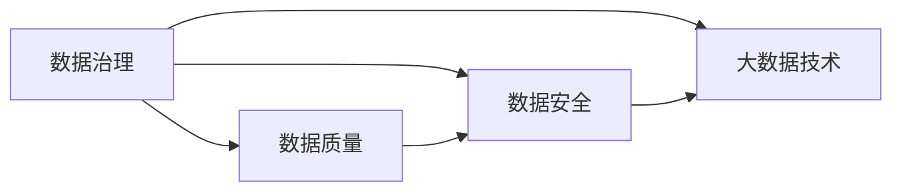

                 

# AI创业：数据管理的策略与对策分析探讨

> 关键词：AI创业, 数据管理, 数据安全, 数据治理, 数据质量, 大数据技术

## 1. 背景介绍

在当今数字化转型的浪潮中，AI创业公司在蓬勃兴起，以其创新驱动的商业模式和技术突破，引领着数据驱动的商业创新。然而，数据管理在AI创业公司中往往被忽视，这直接影响了公司的核心竞争力与长期发展。数据管理的成功与否直接决定了AI模型训练的效率、数据输出的准确性和公司的商业价值。本文将深入探讨AI创业公司中数据管理的策略与对策，旨在为企业提供实用的数据管理解决方案。

## 2. 核心概念与联系

### 2.1 核心概念概述

为更好地理解AI创业公司中的数据管理，我们需要掌握一些核心概念及其关系：

- **数据治理(Data Governance)**：定义数据治理为制定、执行和维护数据管理政策、程序和流程的活动。它包括数据的收集、存储、共享和使用的规范，以确保数据的一致性、完整性和可靠性。
- **数据质量(Data Quality)**：数据质量是指数据的准确性、完整性、一致性、及时性、一致性等属性。高质量的数据是AI模型高效运行的前提。
- **数据安全(Data Security)**：数据安全旨在保护数据免受未经授权的访问、修改和破坏，确保数据的保密性、完整性和可用性。
- **大数据技术(Big Data Technology)**：大数据技术是处理、分析和利用大规模数据集的技术，包括数据采集、存储、处理、分析和可视化等方面。

### 2.2 概念间的关系

这些核心概念之间存在着密切的联系，共同构成了AI创业公司中数据管理的框架。以下是一个简单的Mermaid流程图，展示了数据治理、数据质量、数据安全和数据技术之间的关系：



从图中可以看出，数据治理不仅影响数据质量，还涉及数据安全；而数据质量、数据安全和大数据技术共同构成了数据管理的整体框架，支持AI模型的有效运行和决策支持。

## 3. 核心算法原理 & 具体操作步骤

### 3.1 算法原理概述

AI创业公司中的数据管理主要涉及数据采集、存储、处理和使用的全生命周期管理。其核心算法原理包括以下几个方面：

- **数据采集算法**：从不同数据源（如数据库、传感器、API接口等）高效、准确地采集数据。
- **数据存储算法**：选择合适的存储解决方案，如Hadoop、Spark等，高效存储大规模数据集。
- **数据处理算法**：采用ETL（Extract, Transform, Load）等技术，对原始数据进行清洗、转换和加载，提升数据质量。
- **数据治理算法**：制定数据治理政策，如数据访问控制、数据使用规范等，确保数据安全与合规。

### 3.2 算法步骤详解

以下详细阐述数据管理的算法步骤：

#### 数据采集
1. **数据源识别**：确定所有可能的数据源，包括内部系统（如CRM、ERP）和外部来源（如社交媒体、公开数据集）。
2. **数据采集接口**：根据数据源特性，设计合适的API接口，自动采集数据。
3. **数据同步与更新**：设置定时任务，定期更新数据源数据，确保数据的时效性。

#### 数据存储
1. **数据分区**：按照时间、地域、业务线等维度进行数据分区，便于后续查询和处理。
2. **分布式存储**：利用Hadoop、Spark等分布式存储技术，将数据分散存储在多个节点上。
3. **数据备份与恢复**：定期备份数据，确保数据安全，并在数据丢失或损坏时快速恢复。

#### 数据处理
1. **数据清洗**：去除重复、错误、不完整的数据，确保数据质量。
2. **数据转换**：根据业务需求，进行数据格式转换和标准化。
3. **数据加载**：将清洗和转换后的数据加载到目标数据仓库或数据湖中。

#### 数据治理
1. **数据标准制定**：制定数据格式、元数据标准，确保数据的一致性和可理解性。
2. **数据访问控制**：实施严格的访问控制策略，确保只有授权人员可以访问敏感数据。
3. **数据质量监控**：建立数据质量指标体系，实时监控数据质量，及时发现和纠正问题。

### 3.3 算法优缺点

#### 优点
1. **提升数据质量**：通过数据清洗和转换，提升数据的准确性和一致性。
2. **提高数据安全性**：严格的数据访问控制和备份恢复策略，确保数据的安全性。
3. **优化资源利用**：分布式存储和处理算法，有效利用硬件资源，提升计算效率。

#### 缺点
1. **技术复杂度较高**：需要综合运用多种技术，如ETL、大数据技术等。
2. **成本较高**：数据采集、存储和处理的硬件和软件成本较高。
3. **复杂性管理**：数据治理和质量监控需要持续维护和管理，工作量大。

### 3.4 算法应用领域

数据管理算法广泛应用于以下领域：

- **金融科技**：金融公司需要处理海量交易数据，通过数据管理提升金融分析的准确性和时效性。
- **健康医疗**：医疗机构需要处理患者数据，确保数据的隐私和安全，提升医疗决策支持。
- **智能制造**：制造业需要处理生产数据，通过数据管理优化生产流程，提升生产效率。
- **电子商务**：电商平台需要处理用户数据和交易数据，通过数据管理提升推荐系统效果和用户体验。

## 4. 数学模型和公式 & 详细讲解 & 举例说明

### 4.1 数学模型构建

数据管理中的核心数学模型包括数据治理模型、数据质量评估模型和数据安全模型。

#### 数据治理模型
- **模型定义**：定义数据治理模型为 $G=\{D, P, C, A\}$，其中 $D$ 为数据源集合，$P$ 为数据处理流程，$C$ 为数据访问控制策略，$A$ 为数据审计策略。
- **模型表示**：

$$
G = (D, P, C, A)
$$

#### 数据质量评估模型
- **模型定义**：定义数据质量评估模型为 $Q=\{S, V, F\}$，其中 $S$ 为数据质量维度，$V$ 为每个维度的质量指标，$F$ 为每个指标的评估函数。
- **模型表示**：

$$
Q = (S, V, F)
$$

#### 数据安全模型
- **模型定义**：定义数据安全模型为 $S=\{I, A, P\}$，其中 $I$ 为安全事件，$A$ 为安全规则，$P$ 为安全防护策略。
- **模型表示**：

$$
S = (I, A, P)
$$

### 4.2 公式推导过程

#### 数据治理模型推导
- **目标**：确保数据采集、处理、存储和使用的一致性、完整性和安全性。
- **推导过程**：

$$
G = \mathop{\arg\min}_{G} \sum_{i=1}^{n} \sum_{j=1}^{m} c_{ij} \times l_{ij}(G)
$$

其中 $c_{ij}$ 为第 $i$ 个数据源到第 $j$ 个处理环节的代价，$l_{ij}(G)$ 为第 $i$ 个数据源到第 $j$ 个处理环节的损失函数。

#### 数据质量评估模型推导
- **目标**：评估数据质量，找出数据质量问题的根源。
- **推导过程**：

$$
Q = \mathop{\arg\min}_{Q} \sum_{i=1}^{n} \sum_{j=1}^{m} w_{ij} \times e_{ij}(Q)
$$

其中 $w_{ij}$ 为第 $i$ 个数据源到第 $j$ 个质量评估维度的权重，$e_{ij}(Q)$ 为第 $i$ 个数据源到第 $j$ 个质量评估维度的评估误差。

#### 数据安全模型推导
- **目标**：保护数据免受未经授权的访问、修改和破坏。
- **推导过程**：

$$
S = \mathop{\arg\min}_{S} \sum_{i=1}^{n} \sum_{j=1}^{m} s_{ij} \times u_{ij}(S)
$$

其中 $s_{ij}$ 为第 $i$ 个安全事件到第 $j$ 个安全防护策略的代价，$u_{ij}(S)$ 为第 $i$ 个安全事件到第 $j$ 个安全防护策略的防护效果。

### 4.3 案例分析与讲解

以电商平台的推荐系统为例，分析数据管理的实践应用。

1. **数据采集**：从电商平台的前端交易数据、用户行为数据、商品描述数据等多个渠道采集数据。
2. **数据存储**：利用Hadoop和Spark进行分布式存储，确保数据的可用性和可扩展性。
3. **数据处理**：采用ETL技术清洗数据，转换为推荐系统所需的数据格式。
4. **数据治理**：制定推荐系统数据标准，实施严格的访问控制策略，确保数据安全。

## 5. 项目实践：代码实例和详细解释说明

### 5.1 开发环境搭建

以下是一个简单的Python开发环境搭建流程：

1. **安装Python**：确保系统安装了Python 3.x版本。
2. **安装依赖包**：

```bash
pip install pyspark hdfs pyhive hdfscli
```

3. **配置环境变量**：设置 `HADOOP_HOME`、`HIVE_HOME` 和 `SPARK_HOME` 环境变量。
4. **启动Hadoop、Spark和Hive**：

```bash
start-hdfs.sh
start-hive.sh
start-spark.sh
```

### 5.2 源代码详细实现

以下是一个简单的Hadoop数据处理脚本示例：

```python
from pyspark.sql import SparkSession
from pyspark.sql.functions import col, split

spark = SparkSession.builder.appName("DataProcessing").getOrCreate()

# 从HDFS读取数据
data = spark.read.text("hdfs://path/to/data")

# 清洗数据
cleaned_data = data.select(split(col("value"), "\t").as("cols"))
cleaned_data = cleaned_data.select("cols")

# 转换为结构化数据
structured_data = cleaned_data.select(col("cols[0]").cast("int").alias("id"), col("cols[1]").alias("value"))

# 保存数据
structured_data.write.format("parquet").save("hdfs://path/to/output")
```

### 5.3 代码解读与分析

- **SparkSession**：创建Spark会话，用于启动Spark集群和执行计算任务。
- **read.text()**：从HDFS文件系统中读取文本数据。
- **split()**：将文本数据分割成多个字段。
- **select()**：选择数据列，并转换数据格式。
- **write.format()**：将处理后的数据保存为Parquet格式到HDFS。

### 5.4 运行结果展示

运行上述脚本，可以从HDFS读取数据、清洗数据、转换数据格式并保存结果。

```bash
# 检查数据
hdfs dfs -ls path/to/data
```

## 6. 实际应用场景

### 6.1 金融科技

在金融科技领域，数据管理对于风险评估、信用评分、客户管理等方面具有重要作用。通过高效的数据采集、存储和处理，金融公司可以实时监控市场动态，制定更精准的金融策略。

### 6.2 健康医疗

在健康医疗领域，数据管理有助于构建电子健康记录系统、预测疾病风险、优化医疗决策等。通过数据管理，医疗机构可以确保患者数据的隐私和安全，提升医疗服务的质量。

### 6.3 智能制造

在智能制造领域，数据管理对生产数据的管理和分析，有助于优化生产流程、提高生产效率、降低成本。通过数据管理，制造企业可以实时监控生产状态，及时调整生产计划。

### 6.4 电子商务

在电子商务领域，数据管理对于用户行为分析、商品推荐、营销策略等方面具有重要意义。通过高效的数据采集和处理，电商平台可以提升推荐系统的精准度，提升用户体验。

## 7. 工具和资源推荐

### 7.1 学习资源推荐

1. **《数据治理：企业级数据管理实践指南》**：这本书系统介绍了数据治理的理论基础和实践方法，适合深入了解数据管理的技术细节。
2. **《大数据技术：从概念到实践》**：这本书全面介绍了大数据技术的原理和应用，适合理解数据处理的全生命周期管理。
3. **Coursera《数据治理与大数据管理》课程**：斯坦福大学开设的课程，介绍了数据治理和大数据管理的理论和技术。
4. **Kaggle数据科学竞赛**：通过参与Kaggle比赛，实战学习数据管理的技巧和策略。

### 7.2 开发工具推荐

1. **Apache Hadoop**：分布式数据处理平台，适合大规模数据存储和处理。
2. **Apache Spark**：快速计算平台，适合处理大规模数据集。
3. **Apache Hive**：分布式数据仓库系统，适合数据存储和查询。
4. **Apache Flink**：流处理框架，适合实时数据处理和分析。

### 7.3 相关论文推荐

1. **《大数据时代的隐私保护：数据治理与隐私保护技术》**：介绍大数据环境下隐私保护的数据治理技术。
2. **《数据治理的理论与实践：案例与经验分享》**：分析多个行业数据治理的案例和经验。
3. **《大数据技术在金融科技中的应用》**：探讨大数据技术在金融科技中的实际应用和挑战。

## 8. 总结：未来发展趋势与挑战

### 8.1 研究成果总结

本文系统探讨了AI创业公司中数据管理的策略与对策，提出了一套基于数据治理、数据质量和数据安全的数据管理解决方案。该方案通过数据采集、存储、处理和治理的全生命周期管理，有效提升AI模型的性能和业务价值。

### 8.2 未来发展趋势

未来数据管理将呈现以下几个发展趋势：

1. **自动化与智能化**：数据管理将更加智能化和自动化，通过机器学习和大数据技术，提升数据管理的效率和质量。
2. **跨领域数据融合**：跨领域数据融合将成为数据管理的核心，通过多源数据整合，提升数据的应用价值。
3. **数据隐私保护**：数据隐私保护将更加严格，数据管理将更加注重用户隐私和数据安全。
4. **实时数据处理**：实时数据处理将成为主流，数据管理将支持实时数据采集、存储和分析。
5. **云计算与大数据**：云计算与大数据技术的结合将推动数据管理的创新发展。

### 8.3 面临的挑战

尽管数据管理技术不断进步，但在实施过程中仍面临以下挑战：

1. **技术复杂度**：数据管理涉及多种技术，如大数据、云计算、安全等，技术难度较大。
2. **成本高昂**：数据管理需要大量的硬件和软件投入，成本较高。
3. **数据质量控制**：数据清洗和转换过程中，容易出现数据质量问题，需要持续监控和优化。
4. **安全与隐私**：数据管理需要平衡数据安全和隐私保护，确保数据的使用合规。
5. **技术人才短缺**：数据管理需要大量的专业人才，但当前技术人才较为稀缺。

### 8.4 研究展望

未来数据管理需要重点关注以下几个方面：

1. **数据标准化**：制定统一的数据标准，确保数据的一致性和可理解性。
2. **数据安全技术**：开发高效的数据加密和访问控制技术，确保数据的安全性。
3. **数据可视化**：利用数据可视化技术，提升数据的可理解性和决策支持能力。
4. **数据治理工具**：开发易于使用、功能强大的数据治理工具，降低数据管理的复杂度。
5. **数据治理策略**：制定科学的数据治理策略，确保数据管理的长期稳定性和可扩展性。

## 9. 附录：常见问题与解答

**Q1：数据管理是否只适用于大规模企业？**

A: 数据管理不仅适用于大规模企业，对于中小企业同样具有重要意义。通过合理的资源配置和数据管理策略，中小企业也可以提升业务效率和竞争力。

**Q2：如何评估数据质量？**

A: 数据质量评估需要建立数据质量指标体系，包括完整性、准确性、一致性、时效性、安全性和可用性等指标。通过定期监控和分析这些指标，及时发现和解决数据质量问题。

**Q3：如何提高数据安全性？**

A: 提高数据安全性需要综合运用加密技术、访问控制、审计记录、安全防护策略等手段。建立安全管理体系，确保数据的安全性和合规性。

**Q4：数据治理工具如何选择？**

A: 选择数据治理工具需要考虑企业的业务需求、技术栈、预算等因素。可以参考市面上流行的数据治理工具，如Informatica、Collibra、DataRobot等，选择最合适的工具。

**Q5：如何优化数据管理流程？**

A: 优化数据管理流程需要持续改进数据采集、存储、处理和治理的各个环节，引入自动化和智能化技术，提升数据管理的效率和质量。

---

作者：禅与计算机程序设计艺术 / Zen and the Art of Computer Programming

