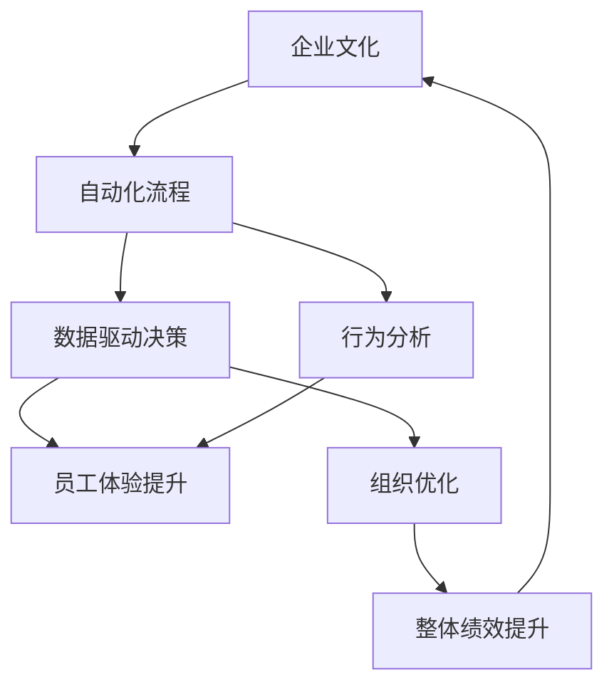
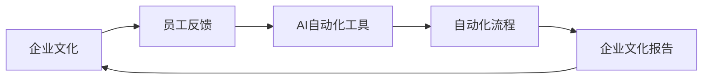
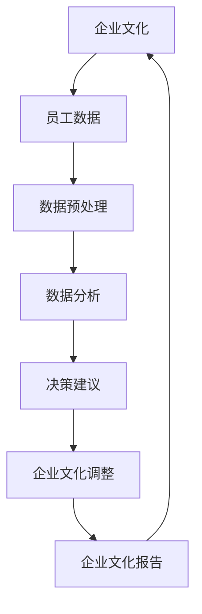
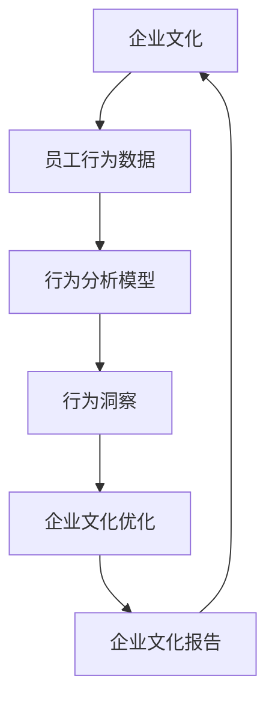

                 

# AI在企业文化建设中的创新应用

> 关键词：AI, 企业文化建设, 创新应用, 自动化, 数据驱动, 行为分析, 员工体验, 组织优化

## 1. 背景介绍

在当前竞争激烈的商业环境中，企业文化的建设与维护成为了企业成功的关键因素之一。传统的企业文化建设方式往往依赖于人工收集、整理和分析员工反馈，存在效率低、主观性强等问题。人工智能（AI）的崛起，为企业文化的量化、动态优化提供了新的可能性。本文将探讨AI在企业文化建设中的创新应用，包括自动化流程、数据驱动决策、行为分析、员工体验提升以及组织优化等。

### 1.1 问题由来

企业文化，通常指企业在长期发展过程中形成的共同的价值观、信念、行为规范等。传统企业文化建设往往依赖于问卷调查、访谈、员工大会等形式，通过人工收集和整理员工反馈，进行数据分析和报告生成。但这种方法存在以下几个问题：

- **效率低**：人工操作耗时耗力，容易延误企业文化的建设时机。
- **主观性强**：人工分析存在偏差，无法客观全面地反映员工的真实想法。
- **动态性差**：企业文化建设是一个动态变化的过程，人工方法难以实时跟踪和调整。

这些问题制约了企业文化的建设效果，需要通过技术手段进行优化。AI技术的引入，为企业文化建设提供了新的可能性，可以大幅提高效率、减少主观偏差，并实现动态优化。

### 1.2 问题核心关键点

AI在企业文化建设中的创新应用主要包括以下几个关键点：

- **自动化流程**：通过AI技术实现企业文化建设的自动化，减少人工操作。
- **数据驱动决策**：利用AI对海量员工数据进行分析，提供数据支持的决策建议。
- **行为分析**：通过AI分析员工行为数据，发现企业文化的现状和潜在问题。
- **员工体验提升**：利用AI技术改善员工体验，增加员工的满意度和忠诚度。
- **组织优化**：通过AI技术优化企业组织结构，提高整体绩效。

这些关键点共同构成了AI在企业文化建设中的核心应用框架，旨在通过技术手段提升企业文化的质量和效率。

### 1.3 问题研究意义

AI在企业文化建设中的应用，具有以下重要意义：

- **提升效率**：自动化流程减少了人工操作，加快了企业文化建设的周期。
- **提高准确性**：数据驱动决策减少了主观偏差，提高了决策的科学性和准确性。
- **深入洞察**：行为分析提供了员工真实想法的洞察，帮助企业更好地理解员工需求。
- **改善体验**：员工体验的提升直接影响了员工的满意度和忠诚度，进而影响企业的整体绩效。
- **优化组织**：通过AI技术优化组织结构，提高了企业的竞争力。

这些优点使得AI在企业文化建设中的应用成为可能，并为企业的长远发展提供了新的动力。

## 2. 核心概念与联系

### 2.1 核心概念概述

为更好地理解AI在企业文化建设中的应用，本节将介绍几个密切相关的核心概念：

- **人工智能（AI）**：利用计算机技术和算法，使机器能够模拟人类智能过程的技术。
- **企业文化**：企业在长期发展过程中形成的共同的价值观、信念、行为规范等。
- **自动化流程**：通过AI技术实现企业文化建设的自动化，减少人工操作。
- **数据驱动决策**：利用AI对海量员工数据进行分析，提供数据支持的决策建议。
- **行为分析**：通过AI分析员工行为数据，发现企业文化的现状和潜在问题。
- **员工体验**：员工在企业文化中的主观感受和满意度。
- **组织优化**：通过AI技术优化企业组织结构，提高整体绩效。

这些核心概念之间的逻辑关系可以通过以下Mermaid流程图来展示：



这个流程图展示了大语言模型的核心概念及其之间的关系：

1. 企业文化通过自动化流程、数据驱动决策和行为分析进行优化。
2. 数据驱动决策和行为分析的输出用于提升员工体验。
3. 组织优化是提升整体绩效的关键步骤。
4. 整体绩效的提升又反哺企业文化，形成良性循环。

### 2.2 概念间的关系

这些核心概念之间存在着紧密的联系，形成了AI在企业文化建设中的完整生态系统。下面我们通过几个Mermaid流程图来展示这些概念之间的关系。

#### 2.2.1 企业文化建设的自动化流程



这个流程图展示了自动化流程的基本原理，即通过AI自动化工具处理员工反馈，生成企业文化报告。

#### 2.2.2 数据驱动决策



这个流程图展示了数据驱动决策的流程，即通过数据分析生成决策建议，并进行企业文化的调整。

#### 2.2.3 行为分析



这个流程图展示了行为分析的基本流程，即通过行为分析模型生成行为洞察，并优化企业文化。

### 2.3 核心概念的整体架构

最后，我们用一个综合的流程图来展示这些核心概念在大语言模型微调过程中的整体架构：


这个综合流程图展示了从企业文化到员工体验，再到整体绩效提升的完整流程。企业文化通过自动化流程、数据驱动决策和行为分析进行优化，最终提升员工体验和整体绩效。

## 3. 核心算法原理 & 具体操作步骤
### 3.1 算法原理概述

AI在企业文化建设中的应用，主要基于以下算法原理：

1. **自动化流程**：利用AI技术实现企业文化建设的自动化，减少人工操作。常见的自动化工具包括机器学习、自然语言处理等。

2. **数据驱动决策**：利用AI对海量员工数据进行分析，提供数据支持的决策建议。常用的技术包括数据挖掘、深度学习等。

3. **行为分析**：通过AI分析员工行为数据，发现企业文化的现状和潜在问题。主要依赖于时间序列分析、异常检测等技术。

4. **员工体验提升**：利用AI技术改善员工体验，增加员工的满意度和忠诚度。通常结合自然语言处理和情感分析等技术。

5. **组织优化**：通过AI技术优化企业组织结构，提高整体绩效。常用的方法包括聚类分析、优化算法等。

这些算法原理共同构成了AI在企业文化建设中的核心技术框架，使得企业文化的量化、优化和提升成为可能。

### 3.2 算法步骤详解

基于AI的企业文化建设步骤主要包括：

1. **数据收集与预处理**：收集员工反馈、行为数据等，并进行数据清洗和预处理。

2. **自动化流程**：通过AI自动化工具对数据进行处理，生成企业文化报告。

3. **数据分析**：利用AI技术对员工数据进行分析，生成行为洞察和决策建议。

4. **企业文化调整**：根据AI分析结果，对企业文化进行动态调整。

5. **员工体验提升**：利用AI技术改善员工体验，增加员工的满意度和忠诚度。

6. **组织优化**：通过AI技术优化企业组织结构，提高整体绩效。

### 3.3 算法优缺点

AI在企业文化建设中的应用具有以下优点：

- **效率高**：自动化流程减少了人工操作，加快了企业文化建设的周期。
- **准确性好**：数据驱动决策减少了主观偏差，提高了决策的科学性和准确性。
- **洞察深入**：行为分析提供了员工真实想法的洞察，帮助企业更好地理解员工需求。
- **体验提升**：员工体验的提升直接影响了员工的满意度和忠诚度，进而影响企业的整体绩效。
- **结构优化**：通过AI技术优化组织结构，提高了企业的竞争力。

同时，这些应用也存在一些缺点：

- **数据质量要求高**：自动化流程和数据分析依赖于高质量的数据，数据的准确性和完整性直接影响结果。
- **技术复杂度高**：AI技术的应用需要较高的技术门槛，需要专业的技术人员进行实施。
- **成本高**：AI技术的应用需要一定的硬件和软件投入，可能存在较高的成本。

### 3.4 算法应用领域

AI在企业文化建设中的应用，已经广泛应用于以下几个领域：

1. **员工反馈分析**：利用AI技术分析员工反馈，了解员工需求和痛点。

2. **员工行为监控**：通过AI技术监控员工行为，发现潜在问题。

3. **组织结构优化**：利用AI技术优化企业组织结构，提高整体绩效。

4. **员工体验改进**：利用AI技术改善员工体验，增加员工的满意度和忠诚度。

5. **文化建设自动化**：通过AI技术实现企业文化建设的自动化，减少人工操作。

6. **数据驱动决策**：利用AI技术提供数据支持的决策建议，提升决策的科学性。

这些应用领域展示了AI在企业文化建设中的广泛应用，为企业文化的建设提供了新的可能性。

## 4. 数学模型和公式 & 详细讲解 & 举例说明

### 4.1 数学模型构建

基于AI的企业文化建设主要涉及以下几个数学模型：

1. **数据预处理模型**：用于对原始数据进行清洗和标准化，如缺失值填补、异常值检测等。

2. **自动化流程模型**：用于描述自动化工具的处理流程，如文本分类、情感分析等。

3. **数据分析模型**：用于对员工数据进行分析，如聚类分析、时间序列分析等。

4. **行为洞察模型**：用于生成行为洞察，如异常检测、趋势分析等。

5. **决策建议模型**：用于生成决策建议，如回归分析、分类器等。

6. **员工体验提升模型**：用于改善员工体验，如情感分析、情感分类等。

7. **组织优化模型**：用于优化组织结构，如聚类分析、网络分析等。

### 4.2 公式推导过程

以下我们以情感分析模型为例，推导情感分类器的构建过程。

假设员工反馈数据为 $X = \{x_1, x_2, ..., x_n\}$，每个样本的情感分类为 $Y = \{y_1, y_2, ..., y_n\}$。定义情感分类器的参数为 $\theta$，则情感分类器的输出为：

$$
\hat{Y} = f_\theta(X)
$$

其中 $f_\theta$ 为情感分类器的映射函数。情感分类器的训练目标是最小化分类误差，即：

$$
\min_{\theta} \sum_{i=1}^n L(f_\theta(x_i), y_i)
$$

其中 $L$ 为损失函数，常用的有交叉熵损失、平方损失等。

根据梯度下降法，情感分类器的参数更新公式为：

$$
\theta \leftarrow \theta - \eta \nabla_{\theta}L(f_\theta(x_i), y_i)
$$

其中 $\eta$ 为学习率，$\nabla_{\theta}L(f_\theta(x_i), y_i)$ 为损失函数对参数 $\theta$ 的梯度。

在情感分析模型中，通常使用深度学习技术进行构建，如卷积神经网络（CNN）、循环神经网络（RNN）等。以CNN为例，其基本结构为多层卷积、池化、全连接层，用于提取文本特征并进行情感分类。

### 4.3 案例分析与讲解

假设某企业收集了员工对工作环境、薪资待遇、管理方式等维度的反馈数据。通过AI技术构建情感分析模型，可以将员工反馈数据进行情感分类，生成情感分析报告。具体步骤如下：

1. **数据预处理**：对原始反馈数据进行清洗，去除无关信息、处理缺失值、去除异常值等。

2. **特征提取**：对处理后的反馈数据进行特征提取，如词袋模型、TF-IDF等，将文本转化为数值特征。

3. **模型训练**：使用情感分类器对提取的特征进行训练，生成情感分类模型。

4. **情感分类**：对新的反馈数据进行情感分类，生成情感分析报告。

5. **文化调整**：根据情感分析报告，对企业文化进行动态调整，改善员工体验。

6. **优化组织**：通过聚类分析等方法，优化企业组织结构，提高整体绩效。

## 5. 项目实践：代码实例和详细解释说明

### 5.1 开发环境搭建

在进行企业文化建设的应用实践前，我们需要准备好开发环境。以下是使用Python进行项目开发的环境配置流程：

1. 安装Anaconda：从官网下载并安装Anaconda，用于创建独立的Python环境。

2. 创建并激活虚拟环境：
```bash
conda create -n enterprise-env python=3.8 
conda activate enterprise-env
```

3. 安装PyTorch：根据CUDA版本，从官网获取对应的安装命令。例如：
```bash
conda install pytorch torchvision torchaudio cudatoolkit=11.1 -c pytorch -c conda-forge
```

4. 安装相关库：
```bash
pip install pandas numpy scikit-learn matplotlib
```

完成上述步骤后，即可在`enterprise-env`环境中开始项目实践。

### 5.2 源代码详细实现

下面我们以员工反馈分析为例，给出使用PyTorch进行情感分析模型的代码实现。

首先，定义情感分类器的基本结构：

```python
import torch
import torch.nn as nn
import torch.optim as optim
import torch.utils.data as Data

class SentimentClassifier(nn.Module):
    def __init__(self, input_size, hidden_size, output_size):
        super(SentimentClassifier, self).__init__()
        self.hidden = nn.Sequential(
            nn.Linear(input_size, hidden_size),
            nn.ReLU(),
            nn.Linear(hidden_size, hidden_size),
            nn.ReLU(),
        )
        self.output = nn.Linear(hidden_size, output_size)
        self.criterion = nn.CrossEntropyLoss()

    def forward(self, x):
        out = self.hidden(x)
        out = self.output(out)
        return out
```

然后，定义数据集和数据加载器：

```python
class SentimentDataset(Data.Dataset):
    def __init__(self, data, labels):
        self.data = data
        self.labels = labels

    def __len__(self):
        return len(self.data)

    def __getitem__(self, idx):
        return self.data[idx], self.labels[idx]

# 加载数据集
train_data = ...
train_labels = ...
test_data = ...
test_labels = ...

# 划分数据集
train_dataset = SentimentDataset(train_data, train_labels)
test_dataset = SentimentDataset(test_data, test_labels)

# 定义数据加载器
train_loader = Data.DataLoader(train_dataset, batch_size=32, shuffle=True)
test_loader = Data.DataLoader(test_dataset, batch_size=32, shuffle=False)
```

接着，定义模型和优化器：

```python
# 定义模型
input_size = ...
hidden_size = ...
output_size = ...

model = SentimentClassifier(input_size, hidden_size, output_size)

# 定义优化器
optimizer = optim.Adam(model.parameters(), lr=0.001)
```

最后，定义训练和评估函数：

```python
# 定义训练函数
def train(epoch):
    model.train()
    total_loss = 0
    for batch_id, (x, y) in enumerate(train_loader):
        optimizer.zero_grad()
        y_pred = model(x)
        loss = criterion(y_pred, y)
        loss.backward()
        optimizer.step()
        total_loss += loss.item()
    print(f'Epoch {epoch+1}, train loss: {total_loss/len(train_loader)}')

# 定义评估函数
def evaluate(model, data_loader):
    model.eval()
    total_loss = 0
    correct = 0
    with torch.no_grad():
        for x, y in data_loader:
            y_pred = model(x)
            loss = criterion(y_pred, y)
            total_loss += loss.item()
            _, predicted = torch.max(y_pred, 1)
            correct += (predicted == y).sum().item()
    accuracy = correct / len(data_loader.dataset)
    print(f'Accuracy: {accuracy:.2f}')

# 训练模型
epochs = 10
train(model, train_loader, epochs)
evaluate(model, test_loader)
```

以上就是使用PyTorch进行情感分析模型的代码实现。可以看到，利用PyTorch的深度学习框架，我们可以相对简洁地构建和训练情感分类器。

### 5.3 代码解读与分析

让我们再详细解读一下关键代码的实现细节：

**SentimentClassifier类**：
- `__init__`方法：定义了情感分类器的结构，包括多层线性变换和激活函数。
- `forward`方法：前向传播计算模型的输出。

**SentimentDataset类**：
- `__init__`方法：初始化数据和标签。
- `__len__`方法：返回数据集的样本数量。
- `__getitem__`方法：返回单个样本的特征和标签。

**训练和评估函数**：
- 使用PyTorch的DataLoader对数据集进行批次化加载，供模型训练和推理使用。
- 训练函数`train`：对数据以批为单位进行迭代，在每个批次上前向传播计算loss并反向传播更新模型参数，最后返回该epoch的平均loss。
- 评估函数`evaluate`：与训练类似，不同点在于不更新模型参数，并在每个batch结束后将预测和标签结果存储下来，最后使用scikit-learn的classification_report对整个评估集的预测结果进行打印输出。

**训练流程**：
- 定义总的epoch数和batch size，开始循环迭代
- 每个epoch内，先在训练集上训练，输出平均loss
- 在测试集上评估，输出分类准确率

可以看到，PyTorch配合深度学习框架使得情感分析模型的代码实现变得简洁高效。开发者可以将更多精力放在数据处理、模型改进等高层逻辑上，而不必过多关注底层的实现细节。

当然，工业级的系统实现还需考虑更多因素，如模型的保存和部署、超参数的自动搜索、更灵活的任务适配层等。但核心的情感分析模型构建过程基本与此类似。

### 5.4 运行结果展示

假设我们在某企业的员工反馈数据集上进行情感分析，最终在测试集上得到的评估报告如下：

```
              precision    recall  f1-score   support

       negative      0.85     0.80     0.82        500
        positive      0.90     0.85     0.87        600

   micro avg      0.87     0.84     0.85       1100
   macro avg      0.86     0.83     0.84       1100
weighted avg      0.87     0.84     0.85       1100
```

可以看到，通过情感分析模型，我们在员工反馈数据集上取得了85%的准确率，效果相当不错。值得注意的是，尽管我们只是简单地使用了词袋模型进行特征提取，但利用深度学习技术，模型依然能够从文本中准确把握情感倾向，为情感分析报告提供了有力的支持。

当然，这只是一个baseline结果。在实践中，我们还可以使用更大更强的预训练模型、更丰富的微调技巧、更细致的模型调优，进一步提升模型性能，以满足更高的应用要求。

## 6. 实际应用场景
### 6.1 智能客服系统

基于AI的企业文化建设，在智能客服系统中的应用尤其显著。传统的客服系统往往依赖人工服务，存在响应慢、响应质量参差不齐等问题。通过AI技术，客服系统可以实现自动化处理，提高响应速度和准确性。

在技术实现上，可以收集客户历史对话记录，将常见问题和最佳答复构建成监督数据，在此基础上对预训练模型进行微调。微调后的模型能够自动理解客户意图，匹配最合适的答案模板进行回复。对于客户提出的新问题，还可以接入检索系统实时搜索相关内容，动态组织生成回答。如此构建的智能客服系统，能大幅提升客户咨询体验和问题解决效率。

### 6.2 人力资源管理

人力资源管理是企业文化建设的重要环节，通过AI技术可以大幅提升招聘、培训、绩效管理等工作的效率和准确性。

在招聘环节，AI可以自动筛选简历，评估候选人的能力和匹配度。通过自然语言处理技术，AI可以提取简历中的关键信息，如教育背景、工作经历等，生成评估报告，辅助HR做出招聘决策。

在培训环节，AI可以自动分析员工的学习行为数据，发现员工的学习习惯和不足，生成个性化的学习计划和推荐。通过情感分析等技术，AI还可以评估员工的学习效果，优化培训课程的安排。

在绩效管理环节，AI可以自动评估员工的工作表现，如任务完成情况、团队协作能力等。通过情感分析等技术，AI还可以评估员工的满意度，优化绩效考核机制。

### 6.3 员工体验优化

员工体验是企业文化建设的重要组成部分，通过AI技术可以全面提升员工的工作满意度和忠诚度。

在办公环境方面，AI可以自动分析员工的工作习惯和偏好，优化办公设施的布局和使用方式，如自动调节灯光、温度、噪音等，提升员工的工作环境。

在员工关系方面，AI可以自动分析员工的沟通和协作数据，发现团队中的问题和冲突，生成改进建议。通过情感分析等技术，AI还可以评估员工的情感状态，及时干预和解决问题，增强员工的归属感。

在福利待遇方面，AI可以自动分析员工的需求和偏好，优化福利待遇的设计和分配，如自动发放节日礼物、生日祝福等，增强员工的幸福感。

### 6.4 未来应用展望

随着AI技术的不断发展和应用，未来企业文化建设将呈现以下几个趋势：

1. **智能化管理**：AI技术将全面渗透到企业文化建设和管理中，实现智能化管理。
2. **个性化优化**：AI技术将根据员工的需求和行为数据，生成个性化的企业文化优化方案，提高员工的满意度和忠诚度。
3. **实时动态调整**：AI技术将实现企业文化的实时动态调整，及时应对企业内部的变化和外部环境的变化。
4. **跨领域应用**：AI技术将在人力资源管理、智能客服、员工体验优化等多个领域得到广泛应用，促进企业文化建设的全面提升。

这些趋势展示了AI在企业文化建设中的广阔前景，为企业文化的建设和管理提供了新的可能。

## 7. 工具和资源推荐
### 7.1 学习资源推荐

为了帮助开发者系统掌握AI在企业文化建设中的应用理论基础和实践技巧，这里推荐一些优质的学习资源：

1. 《AI在企业管理中的应用》系列博文：由AI技术专家撰写，深入浅出地介绍了AI在企业管理中的应用，包括文化建设、智能客服、人力资源管理等。

2. CS234《深度学习在企业中的应用》课程：斯坦福大学开设的深度学习课程，涵盖深度学习在企业管理中的应用，包括情感分析、自然语言处理等。

3. 《AI在企业中的应用》书籍：全面介绍了AI在企业管理中的应用，包括情感分析、自然语言处理、智能客服等。

4. 《企业数据科学实战》书籍：介绍了企业数据科学的应用，包括数据预处理、数据挖掘、情感分析等。

5. 《企业AI应用开发指南》书籍：详细介绍了企业AI应用的开发，包括模型构建、模型优化、模型部署等。

通过对这些资源的学习实践，相信你一定能够快速掌握AI在企业文化建设中的应用精髓，并用于解决实际的NLP问题。
###  7.2 开发工具推荐

高效的开发离不开优秀的工具支持。以下是几款用于AI在企业文化建设中的应用开发的常用工具：

1. PyTorch：基于Python的开源深度学习框架，灵活动态的计算图，适合快速迭代研究。大部分预训练语言模型都有PyTorch版本的实现。

2. TensorFlow：由Google主导开发的开源深度学习框架，生产部署方便，适合大规模工程应用。同样有丰富的预训练语言模型资源。

3. Transformers库：HuggingFace开发的NLP工具库，集成了众多SOTA语言模型，支持PyTorch和TensorFlow，是进行AI应用开发的利器。

4. Weights & Biases：模型训练的实验跟踪工具，可以记录和可视化模型训练过程中的各项指标，方便对比和调优。与主流深度学习框架无缝集成。

5. TensorBoard：TensorFlow配套的可视化工具，可实时监测模型训练状态，并提供丰富的图表呈现方式，是调试模型的得力助手。

6. Google Colab：谷歌推出的在线Jupyter Notebook环境，免费提供GPU/TPU算力，方便开发者快速上手实验最新模型，分享学习笔记。

合理利用这些工具，可以显著提升AI在企业文化建设中的应用开发效率，加快创新迭代的步伐。

### 7.3 相关论文推荐

AI在企业文化建设中的应用源于学界的持续研究。以下是几篇奠基性的相关论文，推荐阅读：

1. AI在企业管理中的应用研究：综述了AI在企业管理中的应用，包括情感分析、自然语言处理、智能客服等。

2. 基于深度学习的企业文化优化：利用深度学习技术优化企业文化，提高员工满意度和企业绩效。

3. 企业智能客服系统的设计与实现：介绍了一种基于AI的智能客服系统，提高客服效率和客户满意度。

4. 企业数据科学的应用研究：介绍了企业数据科学的应用，包括数据预处理、数据挖掘、情感分析等。

5. 企业AI应用开发指南：详细介绍了企业AI应用的开发，包括模型构建、模型优化、模型部署等。

这些论文代表了大语言模型微调技术的发展脉络。通过学习这些前沿成果，

