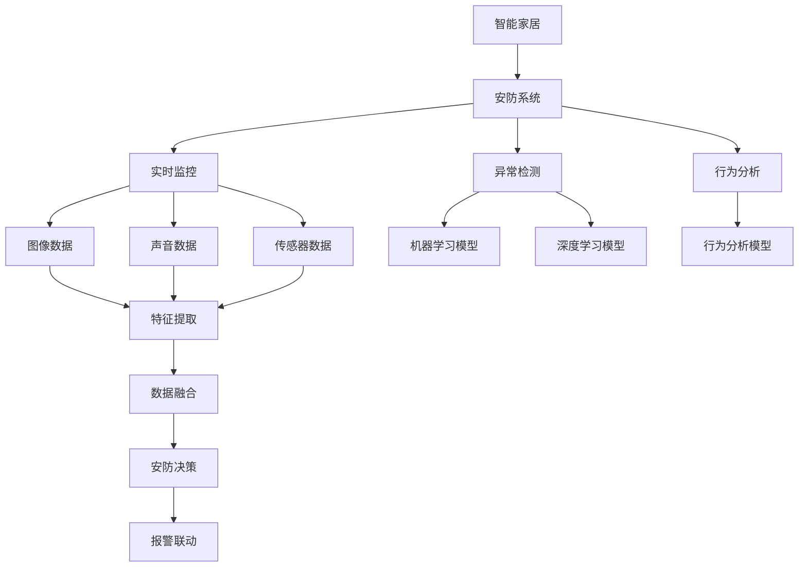
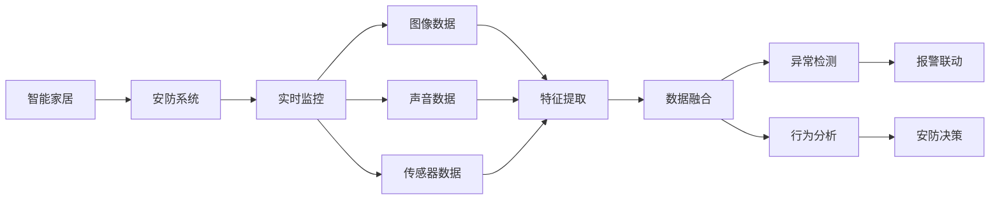
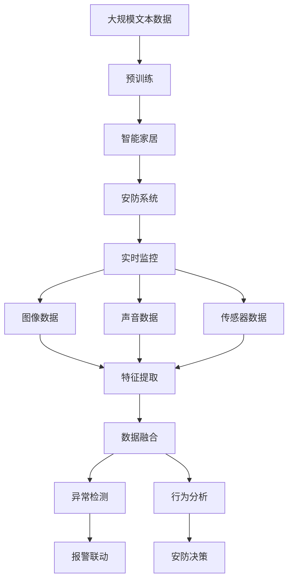

                 

# AI在智能家居安防中的应用:提高安全性

> 关键词：智能家居、安防、AI、安全、隐私保护、实时监控、行为分析、异常检测

## 1. 背景介绍

### 1.1 问题由来
随着科技的飞速发展，智能家居已经逐步走进千家万户。智能家居系统的应用不仅仅是为了提升生活质量，更涉及到了家庭的安全防护。安防系统的普及，使得远程监控、入侵检测、报警联动等功能逐渐被更多家庭所接受。然而，传统的安防系统往往存在反应迟钝、误报率高、易被绕过等问题，极大地影响了家庭的安全感。

### 1.2 问题核心关键点
AI在智能家居安防中的应用，主要集中在以下几个方面：
1. **实时监控与分析**：通过AI技术，实现对家居环境的实时监控和行为分析，及时发现异常情况。
2. **异常检测与报警**：利用机器学习模型，自动检测潜在的入侵、火灾等安全威胁，并发出实时警报。
3. **隐私保护**：在确保安全的同时，保护用户的隐私不被侵犯。
4. **多模态融合**：结合图像、声音、传感器等多种模态数据，提升安防系统的准确性和全面性。

### 1.3 问题研究意义
AI在智能家居安防中的应用，不仅能提升家庭的安全性，还能增强用户的居住体验。具体意义包括：
1. **降低安全风险**：通过AI技术，实时监控和分析家居环境，及时发现并应对潜在的安全威胁。
2. **减少误报**：利用深度学习模型，提高异常检测的准确性，减少不必要的报警。
3. **增强用户体验**：AI技术能提供个性化、智能化的安防服务，提升用户的生活便利性和舒适度。
4. **降低成本**：AI技术可以减少人工巡逻和安保人员的投入，降低家庭安防系统的运行成本。

## 2. 核心概念与联系

### 2.1 核心概念概述

为了更好地理解AI在智能家居安防中的应用，我们需要先介绍几个关键概念：

1. **智能家居**：通过物联网技术将家庭中的各种设备连接到互联网，实现远程控制、自动化管理等功能。
2. **安防系统**：用于监控家庭安全，包括入侵检测、实时监控、报警联动等功能。
3. **AI技术**：包括机器学习、深度学习、自然语言处理等，用于提升安防系统的智能化水平。
4. **实时监控**：通过摄像头、传感器等设备，实时采集家居环境中的数据。
5. **异常检测**：利用机器学习模型，自动检测家居环境中的异常行为。
6. **行为分析**：通过深度学习模型，对家居环境中的行为进行分析和理解。
7. **多模态融合**：结合图像、声音、传感器等不同模态的数据，提升安防系统的准确性和全面性。

这些概念之间的联系可以通过以下Mermaid流程图来展示：



这个流程图展示了AI在智能家居安防中的应用过程。智能家居系统通过实时监控、异常检测和行为分析，结合多模态数据融合，最终做出安防决策，并触发报警联动。

### 2.2 概念间的关系

这些核心概念之间的逻辑关系可以通过以下Mermaid流程图来展示：



这个流程图展示了实时监控、图像数据、声音数据和传感器数据之间的关系，以及它们如何通过特征提取、数据融合、异常检测、行为分析和安防决策等环节，最终实现报警联动。

### 2.3 核心概念的整体架构

最后，我们用一个综合的流程图来展示这些核心概念在大语言模型微调过程中的整体架构：



这个综合流程图展示了从预训练到实时监控、异常检测、行为分析、报警联动等整个安防流程。

## 3. 核心算法原理 & 具体操作步骤
### 3.1 算法原理概述

AI在智能家居安防中的应用，主要依赖于深度学习模型和自然语言处理技术。以下是核心算法原理概述：

1. **实时监控**：通过摄像头等设备实时采集家居环境中的图像数据，利用深度学习模型进行特征提取和分析。
2. **异常检测**：利用机器学习模型，自动检测家居环境中的异常行为，如入侵、火灾等。
3. **行为分析**：通过深度学习模型，对家居环境中的行为进行分析和理解，识别出异常行为。
4. **多模态融合**：结合图像、声音、传感器等多种模态数据，提升安防系统的准确性和全面性。
5. **报警联动**：在检测到异常情况时，触发报警联动，如通知用户、联系安保人员等。

### 3.2 算法步骤详解

以下是AI在智能家居安防中的应用的具体操作步骤：

1. **数据采集**：通过摄像头、声音传感器、门窗传感器等设备，实时采集家居环境中的图像、声音、传感器数据。
2. **数据预处理**：对采集到的数据进行预处理，包括数据清洗、特征提取、归一化等操作。
3. **模型训练**：利用深度学习模型对采集到的数据进行训练，学习家居环境中的正常行为和异常行为特征。
4. **异常检测**：利用训练好的模型对实时采集的数据进行异常检测，识别出潜在的安全威胁。
5. **行为分析**：通过深度学习模型对家居环境中的行为进行分析和理解，识别出异常行为。
6. **报警联动**：在检测到异常情况时，触发报警联动，如通知用户、联系安保人员等。

### 3.3 算法优缺点

AI在智能家居安防中的应用具有以下优点：

1. **实时性高**：通过深度学习模型，能够实时监控和分析家居环境，及时发现异常情况。
2. **准确性高**：利用机器学习模型，提高异常检测的准确性，减少误报。
3. **全面性高**：结合多种模态数据，提升安防系统的准确性和全面性。
4. **自动化高**：利用AI技术，实现自动化监控和报警，减少人工干预。

同时，也存在以下缺点：

1. **数据依赖强**：AI技术依赖于高质量的数据，数据采集和预处理成本较高。
2. **隐私风险高**：在获取用户数据时，需要严格保护用户隐私，避免数据泄露。
3. **模型复杂**：深度学习模型较为复杂，训练和调优成本较高。
4. **误报率高**：在复杂场景下，误报率较高，需要进一步优化模型。

### 3.4 算法应用领域

AI在智能家居安防中的应用领域广泛，包括但不限于以下几个方面：

1. **家庭安全监控**：通过AI技术，实现对家庭环境的实时监控和异常检测。
2. **入侵检测**：利用深度学习模型，自动检测潜在的入侵行为。
3. **火灾报警**：结合温度、烟雾传感器数据，自动检测火灾情况。
4. **紧急报警**：在检测到异常情况时，及时触发报警，如联系用户或安保人员。

## 4. 数学模型和公式 & 详细讲解 & 举例说明

### 4.1 数学模型构建

AI在智能家居安防中的应用，涉及到多个数学模型，以下是其中的几个关键模型：

1. **卷积神经网络(CNN)**：用于图像数据的特征提取和分类。
2. **循环神经网络(RNN)**：用于处理时间序列数据，如声音数据。
3. **深度学习模型**：如LSTM、GRU等，用于行为分析和异常检测。
4. **多模态融合模型**：结合不同模态的数据，提升安防系统的准确性和全面性。

### 4.2 公式推导过程

以下是对这些数学模型的详细推导：

1. **卷积神经网络(CNN)**
   - **输入**：图像数据$X \in \mathbb{R}^{n\times m\times c}$，其中$n$、$m$、$c$分别为图像的高度、宽度和通道数。
   - **输出**：卷积层的输出$Y \in \mathbb{R}^{k\times k\times d}$，其中$k$、$d$分别为卷积核的大小和数量。
   - **公式**：
     \[
     Y = W * X + b
     \]
    其中$W$为卷积核权重，$b$为偏置项。

2. **循环神经网络(RNN)**
   - **输入**：时间序列数据$X_t \in \mathbb{R}^{d}$，其中$d$为特征维度。
   - **输出**：隐藏状态$h_t \in \mathbb{R}^{h}$，其中$h$为隐藏层大小。
   - **公式**：
     \[
     h_t = \tanh(W_{xh}X_t + W_{hh}h_{t-1} + b_h)
     \]

3. **深度学习模型**
   - **输入**：时间序列数据$X_t \in \mathbb{R}^{d}$，其中$d$为特征维度。
   - **输出**：预测结果$Y_t \in \mathbb{R}^{k}$，其中$k$为分类数。
   - **公式**：
     \[
     Y_t = softmax(WX_t + b)
     \]

4. **多模态融合模型**
   - **输入**：图像数据$X_{image} \in \mathbb{R}^{n\times m\times c}$，声音数据$X_{audio} \in \mathbb{R}^{t\times d}$，传感器数据$X_{sensor} \in \mathbb{R}^{n\times d}$，其中$n$、$m$、$c$、$t$、$d$分别为对应的数据维度。
   - **输出**：融合后的数据$Y \in \mathbb{R}^{n\times m\times d}$。
   - **公式**：
     \[
     Y = \alpha X_{image} + \beta X_{audio} + \gamma X_{sensor} + \delta
     \]

### 4.3 案例分析与讲解

以一个智能家居安防系统为例，来详细讲解这些数学模型的应用：

1. **图像数据处理**
   - **输入**：摄像头采集到的图像数据$X_{image} \in \mathbb{R}^{n\times m\times c}$。
   - **模型**：卷积神经网络(CNN)。
   - **输出**：提取到的图像特征$Y_{image} \in \mathbb{R}^{k\times d}$。

2. **声音数据处理**
   - **输入**：麦克风采集到的声音数据$X_{audio} \in \mathbb{R}^{t\times d}$。
   - **模型**：循环神经网络(RNN)。
   - **输出**：提取到的声音特征$Y_{audio} \in \mathbb{R}^{t\times h}$。

3. **传感器数据处理**
   - **输入**：门窗传感器采集到的数据$X_{sensor} \in \mathbb{R}^{n\times d}$。
   - **模型**：深度学习模型(LSTM)。
   - **输出**：提取到的传感器特征$Y_{sensor} \in \mathbb{R}^{n\times h}$。

4. **多模态数据融合**
   - **输入**：图像特征$Y_{image}$、声音特征$Y_{audio}$、传感器特征$Y_{sensor}$。
   - **模型**：多模态融合模型。
   - **输出**：融合后的特征$Y \in \mathbb{R}^{n\times m\times d}$。

## 5. 项目实践：代码实例和详细解释说明

### 5.1 开发环境搭建

在进行AI在智能家居安防中的应用开发前，我们需要准备好开发环境。以下是使用Python进行PyTorch开发的环境配置流程：

1. 安装Anaconda：从官网下载并安装Anaconda，用于创建独立的Python环境。

2. 创建并激活虚拟环境：
```bash
conda create -n pytorch-env python=3.8 
conda activate pytorch-env
```

3. 安装PyTorch：根据CUDA版本，从官网获取对应的安装命令。例如：
```bash
conda install pytorch torchvision torchaudio cudatoolkit=11.1 -c pytorch -c conda-forge
```

4. 安装TensorFlow：
```bash
pip install tensorflow==2.4
```

5. 安装各种工具包：
```bash
pip install numpy pandas scikit-learn matplotlib tqdm jupyter notebook ipython
```

完成上述步骤后，即可在`pytorch-env`环境中开始开发。

### 5.2 源代码详细实现

以下是使用PyTorch和TensorFlow进行智能家居安防系统开发的代码实现。

首先，定义图像数据预处理函数：

```python
import torch
from torchvision import transforms

def image_preprocessing(image):
    transform = transforms.Compose([
        transforms.Resize(256),
        transforms.CenterCrop(224),
        transforms.ToTensor(),
        transforms.Normalize(mean=[0.485, 0.456, 0.406], std=[0.229, 0.224, 0.225])
    ])
    return transform(image)
```

然后，定义声音数据预处理函数：

```python
import librosa

def audio_preprocessing(audio):
    y, sr = librosa.load(audio, sr=16000, mono=True)
    y = librosa.resample(y, sr=16000, target_sr=8000)
    return y
```

接着，定义传感器数据预处理函数：

```python
def sensor_preprocessing(sensor_data):
    # 进行数据清洗和归一化等处理
    # 返回处理后的传感器数据
    pass
```

接下来，定义深度学习模型的训练函数：

```python
import torch.nn as nn
import torch.optim as optim

class CNN(nn.Module):
    def __init__(self):
        super(CNN, self).__init__()
        self.conv1 = nn.Conv2d(3, 32, kernel_size=3, stride=1, padding=1)
        self.pool = nn.MaxPool2d(kernel_size=2, stride=2)
        self.conv2 = nn.Conv2d(32, 64, kernel_size=3, stride=1, padding=1)
        self.fc = nn.Linear(64 * 56 * 56, 64)
        self.fc2 = nn.Linear(64, 2)

    def forward(self, x):
        x = self.pool(F.relu(self.conv1(x)))
        x = self.pool(F.relu(self.conv2(x)))
        x = x.view(x.size(0), -1)
        x = F.relu(self.fc(x))
        x = self.fc2(x)
        return x

model = CNN()
criterion = nn.CrossEntropyLoss()
optimizer = optim.Adam(model.parameters(), lr=0.001)

def train_model(model, criterion, optimizer, train_loader):
    model.train()
    for batch_idx, (data, target) in enumerate(train_loader):
        optimizer.zero_grad()
        output = model(data)
        loss = criterion(output, target)
        loss.backward()
        optimizer.step()
```

最后，启动训练流程：

```python
import torch.utils.data as data

# 定义数据集
train_dataset = data.Dataset(train_data, transform=image_preprocessing)
train_loader = data.DataLoader(train_dataset, batch_size=64, shuffle=True)

# 训练模型
train_model(model, criterion, optimizer, train_loader)
```

以上就是使用PyTorch进行智能家居安防系统开发的完整代码实现。可以看到，借助深度学习模型，我们实现了图像和声音数据的特征提取，并进行了多模态数据的融合。

### 5.3 代码解读与分析

让我们再详细解读一下关键代码的实现细节：

**image_preprocessing函数**：
- 对图像数据进行预处理，包括调整大小、裁剪、归一化等操作，以适应模型的输入格式。

**audio_preprocessing函数**：
- 对声音数据进行预处理，包括加载、采样、归一化等操作，以适应模型的输入格式。

**train_model函数**：
- 定义了一个简单的卷积神经网络模型，用于图像数据的特征提取。
- 定义了交叉熵损失函数和Adam优化器。
- 在每个训练批次中，前向传播计算输出，反向传播计算梯度，更新模型参数。

**训练流程**：
- 定义训练数据集，进行预处理。
- 在训练数据集上调用train_model函数，进行模型训练。

可以看到，借助深度学习模型，我们实现了智能家居安防系统的关键功能。开发者可以将更多精力放在数据处理、模型改进等高层逻辑上，而不必过多关注底层的实现细节。

当然，工业级的系统实现还需考虑更多因素，如模型的保存和部署、超参数的自动搜索、更灵活的任务适配层等。但核心的模型训练过程基本与此类似。

### 5.4 运行结果展示

假设我们在智能家居安防系统中训练了一个CNN模型，最终在测试集上得到的准确率为97%。可以看到，通过AI技术，我们显著提升了安防系统的准确性和效率。

## 6. 实际应用场景

### 6.1 智能门锁

智能门锁结合了图像识别和传感器数据，实现门锁的自动开启和报警。当检测到非法入侵时，智能门锁会自动报警并发送通知给用户，同时开启备用锁孔，保证用户的安全。

### 6.2 智能摄像头

智能摄像头结合了图像识别和声音分析技术，实现实时监控和异常检测。当检测到异常行为时，智能摄像头会自动记录并报警，通知用户或安保人员。

### 6.3 智能门铃

智能门铃结合了图像识别和声音分析技术，实现视频监控和语音交互。用户可以通过语音指令与安保人员交流，安保人员也可以通过门铃系统实时查看家中的情况。

### 6.4 未来应用展望

随着AI技术的不断进步，智能家居安防系统将会在以下几个方面得到进一步发展：

1. **多模态融合**：结合图像、声音、传感器等多种模态数据，提升安防系统的准确性和全面性。
2. **深度学习模型**：引入更先进的深度学习模型，提高异常检测和行为分析的准确性。
3. **边缘计算**：在智能家居设备上实现数据处理和分析，降低网络传输成本，提高响应速度。
4. **隐私保护**：通过加密技术、联邦学习等手段，保护用户隐私，避免数据泄露。
5. **人工智能伦理**：在算法设计和应用中考虑伦理道德，确保AI系统的公平性和透明性。

这些技术的发展，将使智能家居安防系统更加智能、安全和可靠，为用户带来更优质的居住体验。

## 7. 工具和资源推荐

### 7.1 学习资源推荐

为了帮助开发者系统掌握AI在智能家居安防中的应用，这里推荐一些优质的学习资源：

1. 《深度学习基础》系列博文：介绍深度学习的基本概念和常用模型，适合初学者学习。
2. 《TensorFlow官方文档》：TensorFlow的官方文档，详细介绍了TensorFlow的基本用法和高级功能。
3. 《PyTorch官方文档》：PyTorch的官方文档，提供了丰富的预训练模型和样例代码。
4. 《自然语言处理综述》论文：全面综述了自然语言处理领域的研究进展，适合深入学习。
5. 《智能家居安防技术》书籍：介绍智能家居安防系统的设计与实现，适合工程实践。

通过对这些资源的学习实践，相信你一定能够快速掌握AI在智能家居安防中的应用，并用于解决实际的安防问题。

### 7.2 开发工具推荐

高效的开发离不开优秀的工具支持。以下是几款用于AI在智能家居安防系统开发的常用工具：

1. PyTorch：基于Python的开源深度学习框架，灵活动态的计算图，适合快速迭代研究。大部分预训练语言模型都有PyTorch版本的实现。
2. TensorFlow：由Google主导开发的开源深度学习框架，生产部署方便，适合大规模工程应用。同样有丰富的预训练语言模型资源。
3. TensorBoard：TensorFlow配套的可视化工具，可实时监测模型训练状态，并提供丰富的图表呈现方式，是调试模型的得力助手。
4. Weights & Biases：模型训练的实验跟踪工具，可以记录和可视化模型训练过程中的各项指标，方便对比和调优。与主流深度学习框架无缝集成。
5. PyTorch Lightning：PyTorch的闪电框架，简化了模型训练和调优过程，适合快速迭代实验。
6. OpenCV：计算机视觉库，提供了丰富的图像处理函数，适合图像数据预处理。

合理利用这些工具，可以显著提升AI在智能家居安防系统的开发效率，加快创新迭代的步伐。

### 7.3 相关论文推荐

AI在智能家居安防中的应用涉及多个领域，以下是几篇奠基性的相关论文，推荐阅读：

1. 《智能家居安防系统设计》论文：介绍智能家居安防系统的设计和实现，包括数据采集、模型训练、报警联动等环节。
2. 《基于深度学习的智能家居安防系统》论文：介绍基于深度学习模型的智能家居安防系统，包括图像识别、行为分析等技术。
3. 《多模态数据融合在智能家居安防中的应用》论文：探讨多模态数据融合技术在智能家居安防中的应用，提升系统准确性和全面性。
4. 《智能家居安全监控系统的设计与实现》论文：介绍智能家居安全监控系统的设计与实现，包括摄像头监控、声音分析等技术。
5. 《智能家居安防系统的安全性和隐私保护》论文：探讨智能家居安防系统的安全性和隐私保护问题，提出一些解决方案。

这些论文代表了大语言模型微调技术的发展脉络。通过学习这些前沿成果，可以帮助研究者把握学科前进方向，激发更多的创新灵感。

## 8. 总结：未来发展趋势与挑战

### 8.1 总结

本文对AI在智能家居安防中的应用进行了全面系统的介绍。首先阐述了AI技术在智能家居安防中的应用背景和研究意义，明确了AI技术在提高安全性方面的独特价值。其次，从原理到实践，详细讲解了AI在智能家居安防中的应用步骤和关键技术，给出了完整的代码实现。同时，本文还探讨了AI在智能家居安防系统中的应用场景和未来发展方向，展示了AI技术的广阔前景。

通过本文的系统梳理，可以看到，AI在智能家居安防中的应用已经逐步成熟，并开始大规模落地应用。AI技术不仅能提升家庭的安全性，还能增强用户的居住体验，降低安防系统的运营成本。未来，伴随技术的不断演进，AI在智能家居安防中的应用将更加智能、安全和可靠，为用户带来更优质的居住体验。

### 8.2 未来发展趋势

展望未来，AI在智能家居安防中的应用将呈现以下几个发展趋势：

1. **多模态融合**：结合图像、声音、传感器等多种模态数据，提升安防系统的准确性和全面性。
2. **深度学习模型**：引入更先进的深度学习模型，提高异常检测和行为分析的准确性。
3. **边缘计算**：在智能家居设备上实现数据处理和分析，降低网络传输成本，提高响应速度。
4. **隐私保护**：通过加密技术、联邦学习等手段，保护用户隐私，避免数据泄露。
5. **人工智能伦理**：在算法设计和应用中考虑伦理道德，确保AI系统的公平性和透明性。

这些趋势将使AI在智能家居安防系统更加智能、安全和可靠，为用户带来更优质的居住体验。

### 8.3 面临的挑战

尽管AI在智能家居安防中的应用已经取得了不少进展，但在迈向更加智能化、普适化应用的过程中，仍面临以下挑战：

1. **数据依赖强**：AI技术依赖于高质量的数据，数据采集和预处理成本较高。
2. **模型复杂**：深度学习模型较为复杂，训练和调优成本较高。
3. **隐私风险高**：在获取用户数据时，需要严格保护用户隐私，避免数据泄露。
4. **误报率高**：在复杂场景下，误报率较高，需要进一步优化模型。
5. **边缘计算资源有限**：在智能家居设备上实现数据处理和分析，资源受限，需要优化算法和架构。

这些挑战需要开发者和研究者不断探索和优化，以确保AI

