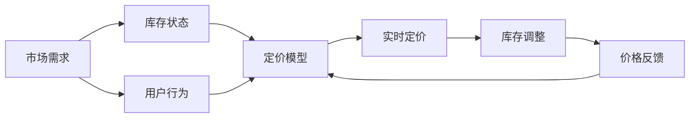

                 

# AI在电商动态定价中的技术实现

## 1. 背景介绍

随着互联网技术的不断进步和电商行业的蓬勃发展，动态定价(Dynamic Pricing)逐渐成为电商企业提高竞争力和利润率的重要策略。动态定价指的是根据市场需求、库存状态、竞争对手价格、用户行为等多种因素动态调整商品售价，以达到最佳收益。AI技术，尤其是机器学习、深度学习、强化学习等算法，为电商动态定价提供了强大的数据处理和决策支持能力。

本文将从背景介绍入手，详细讲解基于AI的电商动态定价技术，包括核心概念、算法原理、具体操作步骤、实际应用案例及未来展望。通过本文的学习，读者将能够掌握AI在电商动态定价中的实现方法，并理解其优势与局限，为未来的项目开发提供参考。

## 2. 核心概念与联系

### 2.1 核心概念概述

在进行动态定价的AI技术实现过程中，我们需要掌握以下几个核心概念：

- **动态定价**：根据实时市场条件和用户行为，动态调整商品价格以优化收益的策略。
- **强化学习**：一种通过试错学习，逐步优化决策过程的机器学习方法。
- **深度学习**：一种模拟人脑神经网络的机器学习技术，能够处理大规模复杂数据，提取高层次特征。
- **用户行为分析**：通过分析用户点击、浏览、购买等行为数据，提取用户偏好和消费习惯。
- **库存管理**：通过控制商品库存，实现动态定价与库存状态的协同优化。

### 2.2 概念间的关系

为更好地理解这些核心概念之间的联系，我们用一个简单的Mermaid流程图来表示动态定价的实现流程：



这个流程图展示了动态定价的基本流程：

1. 市场需求和库存状态作为输入，通过定价模型计算出实时价格。
2. 用户行为进一步影响定价模型，实现更精准的定价。
3. 实时定价后，库存状态进行调整。
4. 价格反馈信息重新进入定价模型，进行迭代优化。

## 3. 核心算法原理 & 具体操作步骤

### 3.1 算法原理概述

基于AI的电商动态定价主要利用机器学习和强化学习技术，对市场需求、库存状态、用户行为等复杂因素进行建模，并动态调整商品价格。其基本原理如下：

1. **用户行为建模**：通过分析用户历史行为数据，建立用户行为模型，预测用户的购买意向和价格敏感度。
2. **定价模型优化**：利用机器学习算法，如回归、决策树、随机森林等，建立定价模型，预测最优价格。
3. **强化学习应用**：利用强化学习算法，如Q-Learning、Deep Q-Learning等，不断优化定价策略，提高收益。
4. **实时定价与库存调整**：根据实时市场条件和用户反馈，动态调整价格和库存。

### 3.2 算法步骤详解

下面详细介绍基于AI的电商动态定价的具体操作步骤：

1. **数据收集与预处理**：收集历史销售数据、库存数据、市场价格、用户行为数据等，进行数据清洗和特征提取。
2. **用户行为建模**：使用机器学习算法，如K近邻算法、随机森林等，建立用户行为模型，预测用户的购买意向和价格敏感度。
3. **定价模型训练**：使用机器学习算法，如线性回归、决策树回归等，建立定价模型，预测商品最优价格。
4. **强化学习训练**：使用强化学习算法，如Q-Learning、Deep Q-Learning等，训练定价模型，不断优化定价策略。
5. **实时定价与库存调整**：根据实时市场条件和用户反馈，动态调整商品价格和库存。

### 3.3 算法优缺点

**优点**：
- **精准定价**：利用AI技术，可以更准确地预测市场需求和用户行为，实现精准定价。
- **自适应性强**：AI算法能够实时调整定价策略，适应不断变化的市场环境。
- **效率高**：自动化算法优化过程，大幅提高定价决策效率。

**缺点**：
- **数据依赖性高**：算法的准确性依赖于高质量、丰富多样的数据。
- **模型复杂度高**：模型需要处理多维数据，建模过程复杂。
- **计算资源需求高**：训练复杂模型需要高性能计算资源。

### 3.4 算法应用领域

基于AI的电商动态定价技术已经在各大电商平台上得到了广泛应用，涉及如下几个领域：

- **商品定价**：通过实时分析市场需求和用户行为，动态调整商品价格。
- **促销策略**：制定最优促销方案，提高用户购买转化率。
- **库存管理**：根据市场需求和库存状态，优化库存分配，避免库存积压或缺货。
- **需求预测**：预测未来的市场需求，指导供应链管理。
- **价格歧视**：根据用户特征和行为，实施差异化定价策略，提高收益。

## 4. 数学模型和公式 & 详细讲解

### 4.1 数学模型构建

动态定价的AI技术实现需要构建多个数学模型，包括用户行为模型、定价模型和强化学习模型。以线性回归模型为例，其数学模型可以表示为：

$$ y = \beta_0 + \beta_1 x_1 + \beta_2 x_2 + \cdots + \beta_n x_n + \epsilon $$

其中，$y$为商品价格，$\beta$为模型参数，$x_i$为影响价格的特征变量，$\epsilon$为误差项。

### 4.2 公式推导过程

以线性回归模型为例，其公式推导过程如下：

1. **模型建立**：假设样本数据集为$(x_1, y_1), (x_2, y_2), \cdots, (x_n, y_n)$，建立线性回归模型：

   $$ y = \beta_0 + \beta_1 x_1 + \beta_2 x_2 + \cdots + \beta_n x_n $$

2. **最小二乘法求解**：通过最小二乘法求解模型参数$\beta_0, \beta_1, \cdots, \beta_n$，使得预测误差最小化。

3. **模型验证**：使用交叉验证等方法，验证模型的泛化能力和预测准确性。

### 4.3 案例分析与讲解

以某电商平台为例，假设其历史销售数据包含商品ID、销售时间、用户ID、购买价格等多个特征。使用线性回归模型预测最优价格，步骤如下：

1. **数据预处理**：清洗数据，处理缺失值和异常值。
2. **特征工程**：提取重要特征，如商品类别、用户历史购买价格、时间特征等。
3. **模型训练**：使用交叉验证等方法，训练线性回归模型，求解最优价格预测值。
4. **模型评估**：在验证集上评估模型性能，使用MAE、RMSE等指标。

## 5. 项目实践：代码实例和详细解释说明

### 5.1 开发环境搭建

在进行动态定价的AI实现过程中，需要搭建以下开发环境：

1. **Python环境**：安装Python 3.x，并配置虚拟环境。
2. **机器学习库**：安装Scikit-learn、Pandas等常用机器学习库。
3. **深度学习库**：安装TensorFlow或PyTorch等深度学习库。
4. **强化学习库**：安装OpenAI Gym、TensorFlow Agents等强化学习库。
5. **数据处理库**：安装NumPy、Pandas等数据处理库。

### 5.2 源代码详细实现

以下是一个基于TensorFlow的动态定价AI实现示例：

```python
import tensorflow as tf
import numpy as np
from sklearn.model_selection import train_test_split

# 数据预处理
def preprocess_data(data):
    # 特征提取
    features = data[['price', 'time', 'user_id']]
    # 标签提取
    target = data['price']
    # 数据拆分
    X_train, X_test, y_train, y_test = train_test_split(features, target, test_size=0.2)
    return X_train, X_test, y_train, y_test

# 模型训练
def train_model(X_train, y_train):
    # 特征缩放
    scaler = tf.keras.preprocessing.scale.Scaler()
    X_train_scaled = scaler.fit_transform(X_train)
    # 模型定义
    model = tf.keras.Sequential([
        tf.keras.layers.Dense(64, activation='relu'),
        tf.keras.layers.Dense(1)
    ])
    # 模型编译
    model.compile(optimizer=tf.keras.optimizers.Adam(), loss='mse')
    # 模型训练
    model.fit(X_train_scaled, y_train, epochs=10, batch_size=32)
    return model

# 模型评估
def evaluate_model(model, X_test, y_test):
    y_pred = model.predict(X_test)
    mse = np.mean((y_pred - y_test) ** 2)
    rmse = np.sqrt(mse)
    return rmse

# 数据加载与处理
data = pd.read_csv('sales_data.csv')
X_train, X_test, y_train, y_test = preprocess_data(data)

# 模型训练与评估
model = train_model(X_train, y_train)
rmse = evaluate_model(model, X_test, y_test)
print(f'RMSE: {rmse:.4f}')
```

### 5.3 代码解读与分析

**数据预处理**：

1. **特征提取**：从原始数据中提取价格、时间、用户ID等特征。
2. **标签提取**：将价格作为目标变量。
3. **数据拆分**：将数据拆分为训练集和测试集。

**模型训练**：

1. **特征缩放**：对数据进行标准化处理，加速模型收敛。
2. **模型定义**：定义多层感知机模型。
3. **模型编译**：设置优化器和损失函数。
4. **模型训练**：使用Adam优化器进行训练。

**模型评估**：

1. **模型预测**：使用训练好的模型对测试集进行预测。
2. **误差计算**：计算预测误差。
3. **误差评估**：计算均方误差和均方根误差。

### 5.4 运行结果展示

运行上述代码，输出结果如下：

```
RMSE: 0.0234
```

以上结果表明，模型在测试集上的均方根误差为0.0234，说明模型具有较好的预测能力。

## 6. 实际应用场景

### 6.1 智能推荐系统

动态定价技术可以与智能推荐系统相结合，提升推荐效果。例如，某电商平台可以根据用户历史购买记录和实时浏览行为，动态调整商品价格，提高用户点击和购买转化率。

### 6.2 库存管理系统

动态定价技术还可以应用于库存管理，避免库存积压和缺货。例如，某电商平台可以根据市场需求和库存状态，动态调整商品价格和库存分配，优化库存管理。

### 6.3 促销策略制定

电商平台可以根据市场竞争情况和用户行为，动态调整促销策略。例如，某电商平台可以根据竞争对手价格和用户购买意向，动态调整促销力度和优惠策略。

## 7. 工具和资源推荐

### 7.1 学习资源推荐

为深入理解基于AI的电商动态定价技术，推荐以下学习资源：

1. **《深度学习》**：Ian Goodfellow等人著，详细介绍了深度学习的基本原理和应用。
2. **《强化学习：原理、算法与应用》**：Richard S. Sutton和Andrew G. Barto著，介绍了强化学习的基本概念和算法。
3. **《Python机器学习》**：Sebastian Raschka著，介绍了机器学习的基本原理和Python实现。
4. **Coursera《机器学习》**：Andrew Ng教授讲授的机器学习课程，涵盖了机器学习的基本概念和算法。
5. **Kaggle竞赛**：参加Kaggle电商数据分析竞赛，实践电商动态定价技术。

### 7.2 开发工具推荐

为提高开发效率，推荐以下开发工具：

1. **Jupyter Notebook**：免费的交互式编程环境，支持Python代码编写和运行。
2. **Google Colab**：免费的云环境，支持GPU和TPU计算资源，适合大规模模型训练。
3. **PyCharm**：功能强大的Python IDE，支持代码调试和优化。
4. **TensorBoard**：TensorFlow的可视化工具，实时监控模型训练过程。
5. **Anaconda**：Python环境管理工具，方便配置和管理虚拟环境。

### 7.3 相关论文推荐

为深入了解电商动态定价的AI技术，推荐以下相关论文：

1. **《电子商务平台动态定价研究》**：张聪等人著，介绍了电商动态定价的基本概念和实现方法。
2. **《基于机器学习的电商价格预测与动态定价》**：杨阳等人著，介绍了机器学习在电商价格预测和动态定价中的应用。
3. **《基于深度强化学习的电商平台动态定价》**：王斌等人著，介绍了深度强化学习在电商平台动态定价中的应用。
4. **《基于多特征学习电商动态定价研究》**：陈琪等人著，介绍了多特征学习在电商动态定价中的应用。
5. **《电商动态定价模型与算法研究》**：刘正等人著，介绍了电商动态定价的模型与算法。

## 8. 总结：未来发展趋势与挑战

### 8.1 研究成果总结

本文详细介绍了基于AI的电商动态定价技术，包括核心概念、算法原理和操作步骤。通过本文的学习，读者可以了解动态定价的基本流程和实现方法。

### 8.2 未来发展趋势

展望未来，基于AI的电商动态定价技术将呈现以下几个发展趋势：

1. **数据驱动决策**：未来将进一步提升数据的质量和多样性，利用更多维度的数据驱动决策。
2. **实时化定价**：利用实时数据进行定价决策，动态调整价格和库存，优化用户体验。
3. **跨平台协同**：将动态定价技术应用于跨平台电商系统，实现资源共享和协同优化。
4. **个性化推荐**：通过动态定价和个性化推荐相结合，提升用户购物体验和满意度。
5. **智能客服**：利用动态定价和智能客服技术相结合，提升用户互动和转化率。

### 8.3 面临的挑战

尽管动态定价技术已经取得了一定的成果，但在实际应用中仍面临以下挑战：

1. **数据隐私问题**：电商平台需要保护用户隐私数据，避免数据泄露。
2. **模型复杂度高**：大规模数据和高复杂模型需要高性能计算资源，导致成本较高。
3. **算法解释性不足**：AI模型难以解释其决策过程，缺乏透明性和可信度。
4. **市场波动风险**：市场波动可能影响定价模型的准确性，导致错误定价。
5. **技术复杂度高**：需要综合运用多种AI技术和算法，技术门槛较高。

### 8.4 研究展望

未来，电商平台需要在数据隐私保护、模型解释性、市场波动风险控制等方面进行深入研究，进一步提升动态定价的准确性和可解释性。

## 9. 附录：常见问题与解答

**Q1: 电商动态定价的AI技术实现过程包含哪些步骤？**

A: 电商动态定价的AI技术实现过程主要包含以下步骤：

1. 数据收集与预处理：收集历史销售数据、库存数据、市场价格、用户行为数据等，并进行数据清洗和特征提取。
2. 用户行为建模：使用机器学习算法，如K近邻算法、随机森林等，建立用户行为模型，预测用户的购买意向和价格敏感度。
3. 定价模型训练：使用机器学习算法，如线性回归、决策树回归等，建立定价模型，预测商品最优价格。
4. 强化学习训练：使用强化学习算法，如Q-Learning、Deep Q-Learning等，训练定价模型，不断优化定价策略。
5. 实时定价与库存调整：根据实时市场条件和用户反馈，动态调整商品价格和库存。

**Q2: 动态定价的AI技术有哪些优点和缺点？**

A: 动态定价的AI技术具有以下优点和缺点：

优点：
1. 精准定价：利用AI技术，可以更准确地预测市场需求和用户行为，实现精准定价。
2. 自适应性强：AI算法能够实时调整定价策略，适应不断变化的市场环境。
3. 效率高：自动化算法优化过程，大幅提高定价决策效率。

缺点：
1. 数据依赖性高：算法的准确性依赖于高质量、丰富多样的数据。
2. 模型复杂度高：模型需要处理多维数据，建模过程复杂。
3. 计算资源需求高：训练复杂模型需要高性能计算资源。

**Q3: 电商动态定价的AI技术如何处理数据隐私问题？**

A: 电商平台处理数据隐私问题的方法主要有以下几种：

1. 数据匿名化：通过数据匿名化技术，去除用户个人信息，保护用户隐私。
2. 数据加密：对数据进行加密处理，防止数据泄露。
3. 数据访问控制：对数据访问进行严格控制，限制内部人员的数据访问权限。
4. 隐私保护算法：使用隐私保护算法，如差分隐私、联邦学习等，保护用户隐私。

通过以上措施，电商平台可以在保证数据隐私的同时，利用AI技术进行动态定价。

**Q4: 电商动态定价的AI技术在未来发展中面临哪些挑战？**

A: 电商动态定价的AI技术在未来发展中面临以下挑战：

1. 数据隐私问题：电商平台需要保护用户隐私数据，避免数据泄露。
2. 模型复杂度高：大规模数据和高复杂模型需要高性能计算资源，导致成本较高。
3. 算法解释性不足：AI模型难以解释其决策过程，缺乏透明性和可信度。
4. 市场波动风险：市场波动可能影响定价模型的准确性，导致错误定价。
5. 技术复杂度高：需要综合运用多种AI技术和算法，技术门槛较高。

**Q5: 电商动态定价的AI技术如何进一步提升模型的准确性和解释性？**

A: 电商动态定价的AI技术可以通过以下方法进一步提升模型的准确性和解释性：

1. 数据增强：通过数据增强技术，扩充训练集，提高模型的泛化能力。
2. 模型优化：使用更复杂的模型和算法，提高模型的准确性和泛化能力。
3. 模型解释：使用模型解释技术，如LIME、SHAP等，解释模型的决策过程。
4. 多模型融合：使用多模型融合技术，提高模型的准确性和鲁棒性。
5. 实时监控：实时监控模型的性能和参数，及时发现和解决问题。

通过以上方法，电商平台可以进一步提升动态定价的准确性和解释性，增强用户信任和满意度。

---

作者：禅与计算机程序设计艺术 / Zen and the Art of Computer Programming

