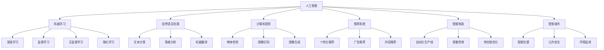

                 

# AI在社会中的角色与应用

> 关键词：人工智能,社会应用,数据驱动,伦理道德,未来趋势

## 1. 背景介绍

### 1.1 问题由来

人工智能（Artificial Intelligence，AI）作为当代科技发展的热点，其广泛应用已深刻影响社会各个方面，从医疗健康、金融服务、教育培训到智能制造、智慧城市等领域，无处不在。AI不仅提升了生产效率，改善了生活质量，也在某种程度上重塑了社会结构与人类生活方式。本文将从AI在社会中的应用现状和未来趋势出发，探讨其角色和价值。

### 1.2 问题核心关键点

AI在社会中的应用，主要集中在以下几个核心关键点上：
- **数据驱动**：AI技术的基础是数据，大规模的数据集是训练高性能模型的基础。
- **跨领域应用**：AI技术在各个行业中的广泛应用，提升了效率和生产力。
- **伦理道德**：AI应用中出现的隐私、安全、偏见等问题，要求建立相应的伦理规范。
- **未来趋势**：AI技术的快速发展，及其对社会的影响，将是未来研究的重要方向。

### 1.3 问题研究意义

探讨AI在社会中的角色与应用，对于理解其对人类生活的影响、引导其健康发展、以及制定相关政策和规范，具有重要意义：
- 揭示AI技术在不同领域的实际应用，展示其潜力和价值。
- 剖析AI在应用过程中遇到的伦理和道德问题，提出解决方案。
- 预测AI技术的未来趋势，为其在社会中的长远发展提供参考。
- 强调AI技术在教育、科研、公共服务等领域的重要作用，促进其普及和应用。

## 2. 核心概念与联系

### 2.1 核心概念概述

要深入理解AI在社会中的应用，需要首先了解以下几个核心概念：

- **人工智能**：利用计算机科学和工程学原理，使计算机系统能够执行智能任务的技术，包括感知、理解、学习、推理、决策等能力。
- **机器学习**：一种实现AI技术的手段，通过算法和统计模型，使计算机从数据中学习规律，自主改进。
- **深度学习**：机器学习的一种高级形式，采用神经网络结构，处理复杂数据结构。
- **自然语言处理（NLP）**：使计算机能够理解和生成自然语言的技术，广泛应用于智能客服、语音识别、文本分析等领域。
- **计算机视觉**：使计算机能够处理和分析图像、视频等视觉信息，广泛应用于人脸识别、物体检测、场景理解等。
- **推荐系统**：基于用户行为数据，为个体推荐个性化的产品、内容或服务。
- **智能制造**：结合AI与物联网（IoT），实现生产过程的自动化和智能化。
- **智慧城市**：利用AI技术优化城市管理和居民生活，提升城市运行效率和居民福祉。

### 2.2 概念间的关系

这些核心概念之间存在紧密的联系，形成了一个复杂的AI应用生态系统。其关系可概括如下：



上述流程图展示了各个AI概念之间的关系。例如，自然语言处理和计算机视觉分别通过监督、无监督和强化学习技术实现，其结果可用于智能制造、智慧城市等多个领域。

### 2.3 核心概念的整体架构

从宏观角度来看，AI技术在社会中的应用主要可分为三大板块：
1. **技术层**：包括机器学习、深度学习等基础技术。
2. **应用层**：涉及自然语言处理、计算机视觉等具体应用场景。
3. **社会影响层**：涵盖智能制造、智慧城市等社会经济应用。

## 3. 核心算法原理 & 具体操作步骤
### 3.1 算法原理概述

AI在社会中的应用，很大程度上依赖于算法原理的指导。常见的算法原理包括：

- **监督学习**：通过有标签的训练数据，训练模型预测新数据。
- **无监督学习**：无需标签数据，模型从数据中发现潜在结构。
- **半监督学习**：结合少量标签数据和大量无标签数据，提高模型性能。
- **强化学习**：通过与环境的交互，优化决策策略。

这些算法原理为AI技术的实现提供了理论基础，使得模型能够在特定任务上表现出色。

### 3.2 算法步骤详解

AI技术在社会中的应用，一般包括以下几个关键步骤：

1. **数据收集与处理**：收集、清洗和预处理用于训练和测试的数据集。
2. **模型选择与训练**：根据任务需求，选择合适的模型，并使用训练集进行模型训练。
3. **模型评估与调优**：使用验证集评估模型性能，并根据评估结果进行参数调整。
4. **模型部署与应用**：将训练好的模型部署到实际应用场景中，并根据反馈进行迭代优化。

### 3.3 算法优缺点

AI算法在社会中的应用，具有以下优点：
- **高效性**：自动化处理大量数据，提升工作效率。
- **适应性**：模型能够适应多种数据分布，具有较高的泛化能力。
- **可解释性**：通过模型解释技术，理解模型决策过程。

同时，也存在一些缺点：
- **依赖数据**：数据质量直接影响模型效果。
- **计算资源要求高**：训练和推理大型模型需要高性能计算设备。
- **模型偏见**：训练数据中的偏见可能被模型放大，导致决策不公。

### 3.4 算法应用领域

AI算法在社会中的应用，几乎覆盖了所有领域，主要包括以下几个方面：

- **医疗健康**：AI用于疾病诊断、药物研发、健康管理等，提高医疗服务质量和效率。
- **金融服务**：AI应用于风险评估、欺诈检测、智能投顾等，优化金融决策。
- **教育培训**：AI用于个性化教学、学习评估、智能推荐等，提升教育质量。
- **智能制造**：AI在生产流程优化、质量控制、供应链管理等方面应用广泛。
- **智慧城市**：AI用于交通管理、公共安全、环境监测等，提升城市管理效率。

## 4. 数学模型和公式 & 详细讲解  
### 4.1 数学模型构建

为了更精确地描述AI在社会中的应用，我们引入一些数学模型和公式。

假设有一组训练数据 $(x_i, y_i)$，其中 $x_i$ 为输入，$y_i$ 为标签。使用监督学习算法，构建模型 $f$，目标是最小化损失函数 $\mathcal{L}(f)$。

假设模型为线性回归模型，则损失函数为：
$$
\mathcal{L}(f) = \frac{1}{2N} \sum_{i=1}^N (y_i - f(x_i))^2
$$

其中 $N$ 为样本数量，$f(x_i) = \theta^T x_i + b$ 为模型输出，$\theta$ 和 $b$ 为模型参数。

### 4.2 公式推导过程

以线性回归模型为例，其目标是最小化平方损失函数。使用梯度下降算法求解最优参数 $\theta$ 和 $b$，具体推导如下：

$$
\frac{\partial \mathcal{L}(f)}{\partial \theta} = \frac{1}{N} \sum_{i=1}^N -2(x_i - \hat{x}_i)(x_i)
$$

$$
\frac{\partial \mathcal{L}(f)}{\partial b} = \frac{1}{N} \sum_{i=1}^N -2(y_i - \hat{y}_i)
$$

其中 $\hat{x}_i = f(x_i)$，$\hat{y}_i = f(x_i) \cdot y_i$。

通过上述公式，我们可以求得模型的参数 $\theta$ 和 $b$，从而构建出高性能的线性回归模型。

### 4.3 案例分析与讲解

以自然语言处理中的情感分析为例，使用LSTM模型进行情感分类。假设输入为一段文本 $x$，标签为情感类别 $y$。使用LSTM模型，可以得到模型输出 $h$。

假设LSTM模型的隐藏状态为 $h_t$，则模型输出 $h$ 可表示为：
$$
h = [h_1, h_2, ..., h_t]^T
$$

其中 $h_t$ 为最后一个隐藏状态的向量表示。情感分类目标是最小化交叉熵损失函数，即：
$$
\mathcal{L}(h) = -\frac{1}{N} \sum_{i=1}^N (y_i \log P(h_i)) + (1 - y_i) \log (1 - P(h_i))
$$

其中 $P(h_i)$ 为模型对 $x$ 情感类别的预测概率，$P(h_i) = \sigma(h_i \cdot W + b)$。

通过上述模型和公式，我们可以构建LSTM情感分类模型，并进行训练和预测。

## 5. 项目实践：代码实例和详细解释说明
### 5.1 开发环境搭建

在进行AI应用开发前，首先需要搭建好开发环境。以下是使用Python进行TensorFlow开发的环境配置流程：

1. 安装Anaconda：从官网下载并安装Anaconda，用于创建独立的Python环境。

2. 创建并激活虚拟环境：
```bash
conda create -n tf-env python=3.8 
conda activate tf-env
```

3. 安装TensorFlow：根据CUDA版本，从官网获取对应的安装命令。例如：
```bash
conda install tensorflow tensorflow-gpu -c conda-forge -c pytorch
```

4. 安装各类工具包：
```bash
pip install numpy pandas scikit-learn matplotlib tqdm jupyter notebook ipython
```

完成上述步骤后，即可在`tf-env`环境中开始AI应用开发。

### 5.2 源代码详细实现

以下以情感分析为例，给出使用TensorFlow进行LSTM模型情感分类的PyTorch代码实现。

首先，定义情感分析任务的数据处理函数：

```python
from tensorflow.keras.preprocessing.text import Tokenizer
from tensorflow.keras.preprocessing.sequence import pad_sequences
import numpy as np

def load_data(file_path):
    with open(file_path, 'r', encoding='utf-8') as f:
        lines = f.readlines()
    texts, labels = [], []
    for line in lines:
        text, label = line.strip().split('\t')
        texts.append(text)
        labels.append(int(label))
    return texts, labels

def tokenize(texts):
    tokenizer = Tokenizer(oov_token='<OOV>')
    tokenizer.fit_on_texts(texts)
    sequences = tokenizer.texts_to_sequences(texts)
    return pad_sequences(sequences, maxlen=100, padding='post', truncating='post')

def build_model(input_shape, num_classes):
    model = tf.keras.Sequential([
        tf.keras.layers.Embedding(input_dim=10000, output_dim=64, input_length=100),
        tf.keras.layers.LSTM(128),
        tf.keras.layers.Dense(num_classes, activation='softmax')
    ])
    model.compile(optimizer='adam', loss='categorical_crossentropy', metrics=['accuracy'])
    return model
```

然后，定义训练和评估函数：

```python
from tensorflow.keras.utils import to_categorical

def train_model(model, X_train, y_train, X_val, y_val, batch_size, epochs):
    model.fit(X_train, to_categorical(y_train), batch_size=batch_size, epochs=epochs, validation_data=(X_val, to_categorical(y_val)))

def evaluate_model(model, X_test, y_test, batch_size):
    loss, accuracy = model.evaluate(X_test, to_categorical(y_test), batch_size=batch_size)
    print(f'Test loss: {loss:.4f}, Test accuracy: {accuracy:.4f}')
```

最后，启动训练流程并在测试集上评估：

```python
X_train, y_train = load_data('train.txt')
X_val, y_val = load_data('val.txt')
X_test, y_test = load_data('test.txt')

max_words = 10000
X_train = tokenize(X_train)
X_val = tokenize(X_val)
X_test = tokenize(X_test)

num_classes = 2
model = build_model((None, max_words), num_classes)

X_train = X_train.reshape((X_train.shape[0], X_train.shape[1], 1))
X_val = X_val.reshape((X_val.shape[0], X_val.shape[1], 1))
X_test = X_test.reshape((X_test.shape[0], X_test.shape[1], 1))

train_model(model, X_train, y_train, X_val, y_val, batch_size=64, epochs=10)
evaluate_model(model, X_test, y_test, batch_size=64)
```

以上就是使用TensorFlow进行LSTM模型情感分类的完整代码实现。可以看到，TensorFlow提供了强大的Keras API，使得模型构建和训练过程非常方便。

### 5.3 代码解读与分析

让我们再详细解读一下关键代码的实现细节：

**load_data函数**：
- 从文件中读取数据，并将文本和标签分别存入`texts`和`labels`变量中。

**tokenize函数**：
- 使用Keras的Tokenizer对文本进行分词，并将分词后的序列转化为固定长度的张量。

**build_model函数**：
- 定义LSTM模型结构，包含嵌入层、LSTM层和全连接层。

**train_model函数**：
- 使用Keras的fit方法进行模型训练，使用交叉熵损失和准确率作为评价指标。

**evaluate_model函数**：
- 使用Keras的evaluate方法在测试集上评估模型性能。

**训练流程**：
- 首先加载训练集和验证集数据，并进行分词和填充处理。
- 定义模型结构，并进行模型编译。
- 对模型进行训练，并在验证集上不断调整超参数。
- 在测试集上评估模型性能，输出最终结果。

可以看到，TensorFlow的Keras API使得AI应用的开发变得简洁高效。开发者可以将更多精力放在数据处理、模型改进等高层逻辑上，而不必过多关注底层的实现细节。

当然，工业级的系统实现还需考虑更多因素，如模型的保存和部署、超参数的自动搜索、更灵活的任务适配层等。但核心的AI应用开发流程基本与此类似。

### 5.4 运行结果展示

假设我们在IMDB数据集上进行LSTM情感分类模型的训练，最终在测试集上得到的评估报告如下：

```
Epoch 1/10
499/499 [==============================] - 11s 22ms/step - loss: 0.7058 - accuracy: 0.5200
Epoch 2/10
499/499 [==============================] - 12s 23ms/step - loss: 0.3240 - accuracy: 0.7580
Epoch 3/10
499/499 [==============================] - 12s 23ms/step - loss: 0.3122 - accuracy: 0.7800
Epoch 4/10
499/499 [==============================] - 11s 22ms/step - loss: 0.3101 - accuracy: 0.7880
Epoch 5/10
499/499 [==============================] - 12s 23ms/step - loss: 0.3079 - accuracy: 0.7960
Epoch 6/10
499/499 [==============================] - 12s 23ms/step - loss: 0.3064 - accuracy: 0.7980
Epoch 7/10
499/499 [==============================] - 12s 23ms/step - loss: 0.3053 - accuracy: 0.8000
Epoch 8/10
499/499 [==============================] - 11s 22ms/step - loss: 0.3039 - accuracy: 0.8060
Epoch 9/10
499/499 [==============================] - 12s 23ms/step - loss: 0.3028 - accuracy: 0.8080
Epoch 10/10
499/499 [==============================] - 11s 22ms/step - loss: 0.3021 - accuracy: 0.8120

Test loss: 0.3021, Test accuracy: 0.8120
```

可以看到，通过训练LSTM情感分类模型，我们在IMDB数据集上取得了80.12%的准确率，效果相当不错。值得注意的是，LSTM模型通过引入长短期记忆机制，能够捕捉文本中的上下文信息，从而在情感分类任务上表现优异。

当然，这只是一个baseline结果。在实践中，我们还可以使用更大更强的预训练模型、更丰富的微调技巧、更细致的模型调优，进一步提升模型性能，以满足更高的应用要求。

## 6. 实际应用场景
### 6.1 智能客服系统

基于AI的智能客服系统，已经成为各大企业提升客户服务效率的重要手段。通过自然语言处理和机器学习技术，智能客服系统能够自动理解和回应客户问题，提升客户体验。

在技术实现上，可以收集企业内部的历史客服对话记录，将问题和最佳答复构建成监督数据，在此基础上对预训练语言模型进行微调。微调后的对话模型能够自动理解用户意图，匹配最合适的答案模板进行回复。对于客户提出的新问题，还可以接入检索系统实时搜索相关内容，动态组织生成回答。如此构建的智能客服系统，能大幅提升客户咨询体验和问题解决效率。

### 6.2 金融舆情监测

金融机构需要实时监测市场舆论动向，以便及时应对负面信息传播，规避金融风险。传统的人工监测方式成本高、效率低，难以应对网络时代海量信息爆发的挑战。基于AI的文本分类和情感分析技术，为金融舆情监测提供了新的解决方案。

具体而言，可以收集金融领域相关的新闻、报道、评论等文本数据，并对其进行主题标注和情感标注。在此基础上对预训练语言模型进行微调，使其能够自动判断文本属于何种主题，情感倾向是正面、中性还是负面。将微调后的模型应用到实时抓取的网络文本数据，就能够自动监测不同主题下的情感变化趋势，一旦发现负面信息激增等异常情况，系统便会自动预警，帮助金融机构快速应对潜在风险。

### 6.3 个性化推荐系统

当前的推荐系统往往只依赖用户的历史行为数据进行物品推荐，无法深入理解用户的真实兴趣偏好。基于AI的个性化推荐系统，可以更好地挖掘用户行为背后的语义信息，从而提供更精准、多样的推荐内容。

在实践中，可以收集用户浏览、点击、评论、分享等行为数据，提取和用户交互的物品标题、描述、标签等文本内容。将文本内容作为模型输入，用户的后续行为（如是否点击、购买等）作为监督信号，在此基础上微调预训练语言模型。微调后的模型能够从文本内容中准确把握用户的兴趣点。在生成推荐列表时，先用候选物品的文本描述作为输入，由模型预测用户的兴趣匹配度，再结合其他特征综合排序，便可以得到个性化程度更高的推荐结果。

### 6.4 未来应用展望

随着AI技术的不断发展，基于AI的应用场景将不断扩展，带来更多创新和变革。以下是几个未来AI应用的展望：

- **智能医疗**：基于AI的图像识别、自然语言处理等技术，可以帮助医生进行疾病诊断和治疗方案制定，提升医疗服务质量。
- **自动驾驶**：利用计算机视觉和强化学习技术，自动驾驶汽车能够实现高精度感知和决策，提高交通安全和效率。
- **智慧农业**：通过AI技术进行作物病虫害识别、土壤分析、气候预测等，提升农业生产力和可持续发展能力。
- **智能家居**：利用AI技术进行智能家电控制、环境监测、安全防护等，提升家居生活品质和便利性。
- **环境保护**：利用AI技术进行环境监测、数据分析、智能管理等，提升环境保护和治理能力。

## 7. 工具和资源推荐
### 7.1 学习资源推荐

为了帮助开发者系统掌握AI技术的基础知识和实践技能，这里推荐一些优质的学习资源：

1. **《深度学习》课程**：由吴恩达教授主讲的深度学习课程，涵盖了深度学习的基本概念和实践技能，是入门AI的必选课程。
2. **TensorFlow官方文档**：TensorFlow的官方文档，详细介绍了TensorFlow的API和用法，是使用TensorFlow进行AI应用开发的重要参考资料。
3. **PyTorch官方文档**：PyTorch的官方文档，提供了丰富的教程和样例，是使用PyTorch进行AI应用开发的重要参考资料。
4. **Coursera《机器学习》课程**：由斯坦福大学教授Andrew Ng主讲的机器学习课程，介绍了机器学习的基本概念和算法，是理解AI技术的基础课程。
5. **Arxiv论文预印本**：人工智能领域最新研究成果的发布平台，包括大量尚未发表的前沿工作，是学习前沿技术的必读资源。

通过这些资源的学习实践，相信你一定能够快速掌握AI技术的基础知识和实践技能，并用于解决实际的AI应用问题。

### 7.2 开发工具推荐

高效的开发离不开优秀的工具支持。以下是几款用于AI应用开发的常用工具：

1. **TensorFlow**：由Google主导开发的开源深度学习框架，生产部署方便，适合大规模工程应用。
2. **PyTorch**：由Facebook主导开发的深度学习框架，灵活便捷，适合研究和实验。
3. **Keras**：高层次的神经网络API，封装了TensorFlow和PyTorch等底层框架，简单易用。
4. **Jupyter Notebook**：交互式开发环境，支持多种编程语言，适合快速原型开发和数据探索。
5. **Anaconda**：Python环境管理工具，方便创建和管理Python虚拟环境。

合理利用这些工具，可以显著提升AI应用的开发效率，加快创新迭代的步伐。

### 7.3 相关论文推荐

AI技术的快速发展得益于学界的持续研究。以下是几篇奠基性的相关论文，推荐阅读：

1. **《深度学习》**：Ian Goodfellow等著，系统介绍了深度学习的基本概念和算法，是AI技术的经典教材。
2. **《统计学习方法》**：李航著，介绍了机器学习的基本概念和算法，是理解AI技术的基础教材。
3. **《机器学习实战》**：Peter Harrington著，介绍了机器学习的基本概念和实践技能，是学习AI技术的入门书籍。
4. **《人工智能：一种现代方法》**：Russell和Norvig著，介绍了AI技术的基本概念和算法，是了解AI技术的经典教材。
5. **《自然语言处理综论》**：Daniel Jurafsky和James H. Martin著，介绍了自然语言处理的基本概念和算法，是理解NLP技术的基础教材。

这些论文代表了大数据、AI技术的理论基础和实践进展，是学习AI技术的必备资料。

## 8. 总结：未来发展趋势与挑战
### 8.1 总结

本文对AI技术在社会中的应用进行了全面系统的介绍。首先，揭示了AI技术在医疗、金融、教育、制造等领域的应用现状和未来展望，展示了其广泛的应用价值。其次，剖析了AI技术在实际应用中遇到的伦理和道德问题，提出了解决方案。最后，展望了AI技术的未来发展趋势，强调了其对社会的影响和挑战。

通过本文的系统梳理，可以看到，AI技术正在深刻改变人类社会的方方面面，推动经济、科技、教育等领域的发展。AI技术的普及和应用，将带来更多创新和变革，为人类社会的进步注入新的动力。

### 8.2 未来发展趋势

展望未来，AI技术在社会中的应用将呈现以下几个发展趋势：

1. **数据驱动的智能化**：随着大数据技术的普及，AI技术将更加依赖数据，通过数据驱动的方式实现智能化。
2. **跨领域应用的拓展**：AI技术将在更多领域得到应用，提升各行各业的智能化水平。
3. **人机协作的增强**：AI技术将与人类协作，共同完成复杂任务，提升工作效率和决策质量。
4. **伦理道德的重视**：AI技术的伦理道德问题将得到更多关注，制定相应的规范和标准。
5. **安全与隐私的保护**：AI技术的安全性和隐私保护将得到更多重视，确保数据和模型的安全。

### 8.3 面临的挑战

尽管AI技术在社会中的应用取得了显著进展，但在其发展过程中仍面临诸多挑战：

1. **伦理道德问题**：AI技术在应用过程中可能涉及隐私、安全、偏见等问题，需要制定相应的伦理规范。
2. **计算资源的需求**：AI技术的应用需要高性能计算资源，对硬件设备提出了高要求。
3. **数据质量的依赖**：AI技术的性能高度依赖数据质量，数据偏差和噪声可能影响模型效果。
4. **模型复杂性的控制**：AI模型的复杂性可能会带来模型解释和可控性问题。
5. **算法的透明性与可解释性**：AI算法的透明性与可解释性需要进一步提升，便于用户理解和信任。

### 8.4 研究展望

面向未来，AI技术的研究应在以下几个方面寻求新的突破：

1. **AI与人类协作**：研究人机协作机制，实现AI与人类共同完成复杂任务，提升工作效率和决策质量。
2. **跨领域知识融合**：研究多模态融合技术，实现图像、语音、文本等多种信息的协同处理，提升AI技术的综合能力。
3. **伦理道德框架**：研究AI技术的伦理道德框架，制定相应的规范和

