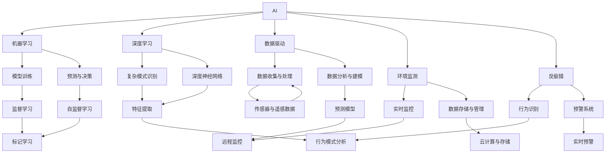
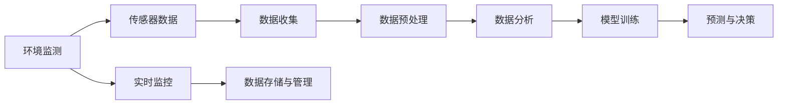
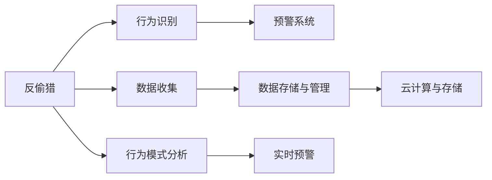
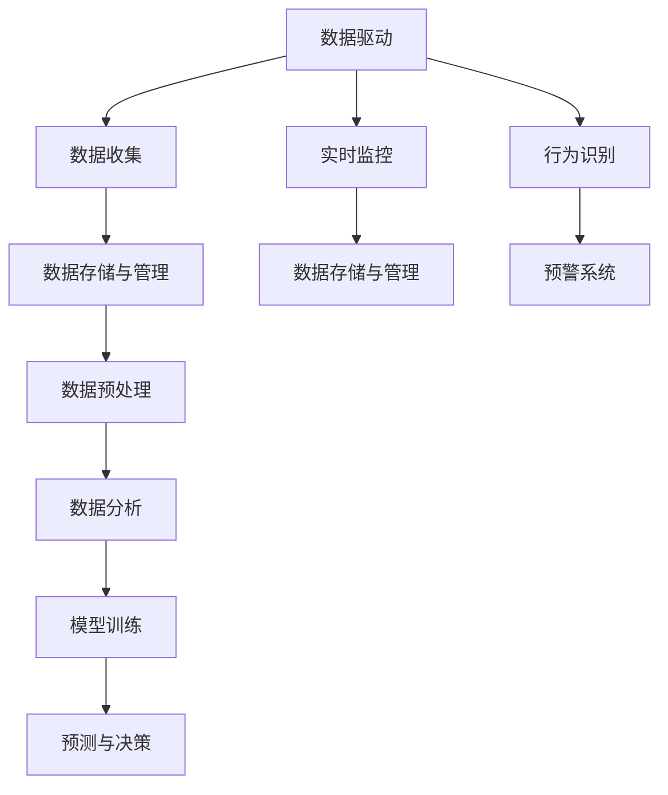
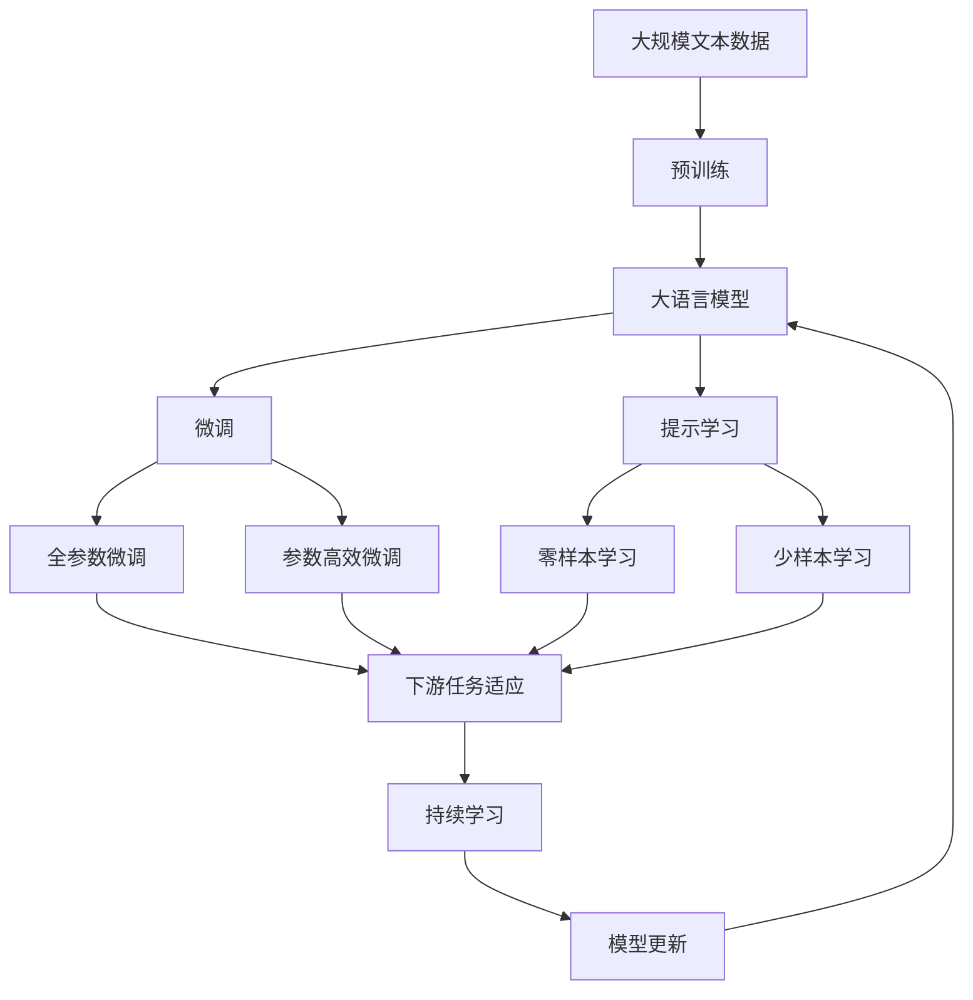

                 

# AI在野生动物保护中的应用:监测与反偷猎

> 关键词：野生动物保护, 监测, 反偷猎, 人工智能, 机器学习, 深度学习, 数据驱动, 环境监测

## 1. 背景介绍

### 1.1 问题由来
随着全球气候变化、自然环境退化和人类活动的增加，野生动物保护面临着严峻的挑战。据统计，全球每年有超过1000万种动植物因偷猎、栖息地丧失等原因面临灭绝风险。偷猎行为对生物多样性的破坏尤为严重，每年导致数十万野生动物被捕杀。保护濒危物种，打击偷猎行为，已经成为全球生态环境保护的重要任务。

近年来，人工智能技术在野生动物保护中的应用逐渐增多，特别是在监测和反偷猎方面，AI系统展现出了巨大的潜力。本文将深入探讨AI在野生动物保护中的应用，特别是如何利用AI技术进行野外监测和反偷猎，以期为保护野生动物提供技术支撑。

### 1.2 问题核心关键点
AI在野生动物保护中的应用主要包括监测和反偷猎两个方面：

1. **监测**：利用AI技术对野生动物进行实时监控和数据分析，及时发现动物的异常行为，评估其健康状况，预测种群变化趋势，监控栖息地状态等。

2. **反偷猎**：通过AI技术对偷猎行为进行识别和预警，分析偷猎者的行为模式，跟踪偷猎者的行踪，实现远程监视和预警，提升反偷猎行动的效率和效果。

### 1.3 问题研究意义
AI技术在野生动物保护中的应用，对于保护生物多样性、打击偷猎行为、恢复生态平衡具有重要意义：

1. **提升监测效率**：通过AI技术，可以实时监控野生动物，分析大量数据，发现异常行为，提高监测效率和准确性。

2. **降低人力成本**：AI系统可以替代部分人力进行野外监测和反偷猎，降低人力成本，提高保护工作的可持续性。

3. **增强数据处理能力**：AI技术能够处理海量的环境数据，识别复杂模式，为保护决策提供科学依据。

4. **提高反偷猎效率**：AI系统能够实时分析偷猎数据，预警偷猎行为，及时响应，提升反偷猎行动的效率和效果。

5. **推动国际合作**：AI技术的应用，可以帮助不同国家和组织共享数据和信息，推动国际野生动物保护合作。

## 2. 核心概念与联系

### 2.1 核心概念概述

为更好地理解AI在野生动物保护中的应用，本节将介绍几个关键概念：

- **AI（人工智能）**：利用计算机技术模拟人类智能，包括感知、学习、推理、决策等能力。
- **机器学习（Machine Learning）**：AI的一种重要技术，通过数据训练模型，使其能够自动学习和改进。
- **深度学习（Deep Learning）**：机器学习的一种高级形式，通过多层次的神经网络进行复杂模式识别和预测。
- **数据驱动（Data-Driven）**：基于大量数据进行决策和预测，强调数据的重要性。
- **环境监测（Environmental Monitoring）**：对自然环境进行持续观测和数据分析，评估环境状况和变化趋势。
- **反偷猎（Anti-Poaching）**：打击偷猎行为，保护野生动物，提升反偷猎行动的效率和效果。

这些核心概念之间的逻辑关系可以通过以下Mermaid流程图来展示：



这个流程图展示了大语言模型微调过程中各个关键概念之间的关系：

1. AI利用机器学习、深度学习等技术，从大量数据中学习复杂模式。
2. 数据驱动强调数据在AI系统中的应用，包括数据收集、处理和分析。
3. 环境监测涉及对自然环境进行持续观测，利用AI技术进行数据分析和建模。
4. 反偷猎通过行为识别和预警系统，打击偷猎行为，保护野生动物。
5. 模型训练和预测是机器学习和深度学习的主要任务，用于构建预测模型和优化决策。
6. 特征提取和复杂模式识别是深度学习的核心步骤，用于从原始数据中提取有用的信息。
7. 传感器与遥感数据用于数据收集，云计算与存储用于数据管理和存储。
8. 行为模式分析用于识别动物的行为模式，实时预警用于及时响应偷猎行为。

这些概念共同构成了AI在野生动物保护中的生态系统，使其能够发挥强大的环境监测和反偷猎能力。通过理解这些核心概念，我们可以更好地把握AI在野生动物保护中的应用方向。

### 2.2 概念间的关系

这些核心概念之间存在着紧密的联系，形成了AI在野生动物保护中的应用生态系统。下面我们通过几个Mermaid流程图来展示这些概念之间的关系。

#### 2.2.1 AI在环境监测中的应用



这个流程图展示了AI在环境监测中的应用过程：

1. 传感器数据通过数据收集和预处理，输入数据分析模块。
2. 数据分析模块通过模型训练和预测，输出决策结果。
3. 实时监控模块通过传感器数据进行实时分析，生成预警信息。
4. 数据存储与管理模块用于数据的存储和备份。

#### 2.2.2 AI在反偷猎中的应用



这个流程图展示了AI在反偷猎中的应用过程：

1. 数据收集模块通过传感器和遥感数据，输入数据存储与管理模块。
2. 数据存储与管理模块用于数据的存储和备份。
3. 行为识别模块通过AI技术进行行为模式分析，输出行为识别结果。
4. 预警系统模块根据行为识别结果，生成实时预警信息。

#### 2.2.3 数据驱动与AI的关系



这个流程图展示了数据驱动与AI的关系：

1. 数据收集模块通过传感器和遥感数据，输入数据存储与管理模块。
2. 数据存储与管理模块用于数据的存储和备份。
3. 数据预处理模块对原始数据进行清洗和处理。
4. 数据分析模块通过模型训练和预测，输出决策结果。
5. 实时监控模块通过传感器数据进行实时分析，生成预警信息。
6. 行为识别模块通过AI技术进行行为模式分析，输出行为识别结果。
7. 预警系统模块根据行为识别结果，生成实时预警信息。

### 2.3 核心概念的整体架构

最后，我们用一个综合的流程图来展示这些核心概念在大语言模型微调过程中的整体架构：



这个综合流程图展示了从预训练到微调，再到持续学习的完整过程。大语言模型首先在大规模文本数据上进行预训练，然后通过微调（包括全参数微调和参数高效微调）或提示学习（包括零样本和少样本学习）来适应下游任务。最后，通过持续学习技术，模型可以不断更新和适应新的任务和数据。 通过这些流程图，我们可以更清晰地理解AI在野生动物保护中的应用过程及其各个关键环节。

## 3. 核心算法原理 & 具体操作步骤
### 3.1 算法原理概述

AI在野生动物保护中的应用主要基于机器学习和深度学习技术，特别是深度神经网络。以下是AI在环境监测和反偷猎中主要算法的概述：

- **图像识别与分析**：通过卷积神经网络（CNN）对图像数据进行分析，识别野生动物及其行为模式。
- **声音识别与分析**：利用循环神经网络（RNN）或变分自编码器（VAE）对声音数据进行分析，识别野生动物及其行为。
- **行为模式分析**：通过时间序列分析、聚类分析等方法，识别野生动物的行为模式和异常行为。
- **预警系统**：通过实时数据分析，生成预警信息，及时响应偷猎行为。

形式化地，假设数据集为 $D=\{(x_i,y_i)\}_{i=1}^N$，其中 $x_i$ 为输入数据（如图像、声音、行为模式等），$y_i$ 为标签（如动物种类、行为类型、偷猎行为等）。我们的目标是最小化损失函数 $\mathcal{L}(\theta)$，使得模型输出 $y_i$ 逼近真实标签 $y_i$，其中 $\theta$ 为模型参数。

通过梯度下降等优化算法，模型不断更新参数 $\theta$，最小化损失函数 $\mathcal{L}(\theta)$，使得模型输出逼近真实标签。由于 $\theta$ 已经通过预训练获得了较好的初始化，因此即便在少量数据集 $D$ 上进行微调，也能较快收敛到理想的模型参数 $\hat{\theta}$。

### 3.2 算法步骤详解

AI在野生动物保护中的应用主要包括以下几个关键步骤：

**Step 1: 准备数据集**

- **数据收集**：收集动物图像、声音、行为模式等数据，确保数据的多样性和代表性。
- **数据预处理**：对原始数据进行清洗、标注、归一化等预处理，准备输入模型。
- **数据增强**：通过数据增强技术，如旋转、缩放、噪声等，丰富训练数据集。

**Step 2: 选择与设计模型**

- **模型选择**：根据任务类型选择合适的深度学习模型，如CNN、RNN、VAE等。
- **模型设计**：设计合适的模型架构，如卷积层、循环层、全连接层等。
- **损失函数**：选择合适的损失函数，如交叉熵损失、均方误差损失等。

**Step 3: 训练与优化**

- **模型训练**：使用训练集对模型进行有监督训练，最小化损失函数。
- **超参数调优**：通过交叉验证等方法，调整学习率、批大小、迭代轮数等超参数。
- **正则化**：使用L2正则、Dropout、Early Stopping等技术，防止过拟合。

**Step 4: 模型评估与部署**

- **模型评估**：在验证集上评估模型性能，确保模型泛化性能良好。
- **模型部署**：将训练好的模型部署到生产环境中，进行实时监测和预警。

**Step 5: 持续学习与优化**

- **数据收集**：持续收集新的数据，更新模型。
- **模型更新**：通过增量学习等技术，更新模型参数。
- **性能监控**：实时监控模型性能，及时发现和解决问题。

以上是AI在野生动物保护中应用的主要步骤。在实际应用中，还需要针对具体任务的特点，对微调过程的各个环节进行优化设计，如改进训练目标函数，引入更多的正则化技术，搜索最优的超参数组合等，以进一步提升模型性能。

### 3.3 算法优缺点

AI在野生动物保护中的应用具有以下优点：

- **实时性**：AI系统能够实时分析数据，快速响应偷猎行为，提升保护效率。
- **自动化**：AI系统可以自动进行数据处理和分析，减少人工干预，降低人力成本。
- **高精度**：AI系统能够处理大量复杂数据，提高监测和预警的准确性。
- **适应性强**：AI系统可以适应不同环境条件，适用于各种野生动物保护场景。

同时，AI在野生动物保护中的应用也存在一些局限性：

- **数据依赖**：AI系统依赖高质量标注数据，数据收集和预处理成本较高。
- **技术复杂**：深度学习模型复杂，需要专业技术人员进行开发和维护。
- **鲁棒性不足**：AI系统对异常数据和噪声敏感，可能产生误报或漏报。
- **隐私保护**：在数据收集和存储过程中，需要严格保护数据隐私，防止数据泄露。

尽管存在这些局限性，但AI技术在野生动物保护中的应用，已经展现出巨大的潜力，为保护野生动物提供了重要手段。未来，随着技术的不断进步和数据的积累，AI在野生动物保护中的应用将更加广泛和深入。

### 3.4 算法应用领域

AI在野生动物保护中的应用主要涵盖以下几个领域：

- **图像识别**：通过CNN对野生动物图像进行识别和分类，识别各种动物及其行为模式。
- **声音识别**：利用RNN或VAE对野生动物声音进行识别和分类，监测其行为和健康状况。
- **行为模式分析**：通过时间序列分析和聚类分析，识别动物的行为模式和异常行为，评估其健康状况和种群变化趋势。
- **反偷猎预警**：通过行为模式分析和实时监控，预警偷猎行为，及时响应和打击偷猎者。
- **栖息地监测**：利用卫星遥感和无人机等技术，监测栖息地变化，评估其健康状况和生态平衡。
- **数据融合与集成**：将不同来源的数据进行融合和集成，提供更全面和准确的环境监测和反偷猎信息。

## 4. 数学模型和公式 & 详细讲解  
### 4.1 数学模型构建

本节将使用数学语言对AI在野生动物保护中的应用过程进行更加严格的刻画。

假设数据集为 $D=\{(x_i,y_i)\}_{i=1}^N$，其中 $x_i$ 为输入数据，$y_i$ 为标签。定义模型 $M_{\theta}$ 在数据样本 $(x,y)$ 上的损失函数为 $\ell(M_{\theta}(x),y)$，则在数据集 $D$ 上的经验风险为：

$$
\mathcal{L}(\theta) = \frac{1}{N} \sum_{i=1}^N \ell(M_{\theta}(x_i),y_i)
$$

微调的优化目标是最小化经验风险，即找到最优参数：

$$
\theta^* = \mathop{\arg\min}_{\theta} \mathcal{L}(\theta)
$$

在实践中，我们通常使用基于梯度的优化算法（如SGD、Adam等）来近似求解上述最优化问题。设 $\eta$ 为学习率，$\lambda$ 为正则化系数，则参数的更新公式为：

$$
\theta \leftarrow \theta - \eta \nabla_{\theta}\mathcal{L}(\theta) - \eta\lambda\theta
$$

其中 $\nabla_{\theta}\mathcal{L}(\theta)$ 为损失函数对参数 $\theta$ 的梯度，可通过反向传播算法高效计算。

### 4.2 公式推导过程

以下我们以声音识别任务为例，推导交叉熵损失函数及其梯度的计算公式。

假设模型 $M_{\theta}$ 在输入 $x$ 上的输出为 $\hat{y}=M_{\theta}(x) \in [0,1]$，表示样本属于某种声音的概率。真实标签 $y \in \{1,0\}$。则二分类交叉熵损失函数定义为：

$$
\ell(M_{\theta}(x),y) = -[y\log \hat{y} + (1-y)\log (1-\hat{y})]
$$

将其代入经验风险公式，得：

$$
\mathcal{L}(\theta) = -\frac{1}{N}\sum_{i=1}^N [y_i\log M_{\theta}(x_i)+(1-y_i)\log(1-M_{\theta}(x_i))]
$$

根据链式法则，损失函数对参数 $\theta_k$ 的梯度为：

$$
\frac{\partial \mathcal{L}(\theta)}{\partial \theta_k} = -\frac{1}{N}\sum_{i=1}^N (\frac{y_i}{M_{\theta}(x_i)}-\frac{1-y_i}{1-M_{\theta}(x_i)}) \frac{\partial M_{\theta}(x_i)}{\partial \theta_k}
$$

其中 $\frac{\partial M_{\theta}(x_i)}{\partial \theta_k}$ 可进一步递归展开，利用自动微分技术完成计算。

在得到损失函数的梯度后，即可带入参数更新公式，完成模型的迭代优化。重复上述过程直至收敛，最终得到适应下游任务的最优模型参数 $\theta^*$。

## 5. 项目实践：代码实例和详细解释说明
### 5.1 开发环境搭建

在进行AI实践前，我们需要准备好开发环境。以下是使用Python进行TensorFlow开发的环境配置流程：

1. 安装Anaconda：从官网下载并安装Anaconda，用于创建独立的Python环境。

2. 创建并激活虚拟环境：
```bash
conda create -n tensorflow-env python=3.8 
conda activate tensorflow-env
```

3. 安装TensorFlow：根据CUDA版本，从官网获取对应的安装命令。例如：
```bash
conda install tensorflow tensorflow-gpu=2.6 -c pytorch -c conda-forge
```

4. 安装必要的库：
```bash
pip install numpy pandas scikit-learn matplotlib tqdm jupyter notebook ipython
```

完成上述步骤后，即可在`tensorflow-env`环境中开始AI实践。

### 5.2 源代码详细实现

下面我们以声音识别任务为例，给出使用TensorFlow进行AI实践的代码实现。

首先，定义数据处理函数：

```python
import tensorflow as tf
from tensorflow.keras.preprocessing import sequence

def load_data(path):
    data = []
    labels = []
    with open(path, 'r') as f:
        for line in f:
            tokens = line.strip().split(',')
            data.append(tokens[:-1])
            labels.append(int(tokens[-1]))
    return data, labels

def pad_sequences(data, maxlen):
    return sequence.pad_sequences(data, maxlen=maxlen, padding='post', truncating='post')

def vectorize_sequences(data, dict):
    return [dict[word] for word in data]

def compute_loss(y_true, y_pred):
    return tf.keras.losses.sparse_categorical_crossentropy(y_true, y_pred)

def compute_accuracy(y_true, y_pred):
    return tf.keras.metrics.sparse_categorical_accuracy(y_true, y_pred)
```

然后，定义模型和训练函数：

```python
from tensorflow.keras.models import Sequential
from tensorflow.keras.layers import Embedding, LSTM, Dense, Dropout

def build_model(input_dim, output_dim):
    model = Sequential([
        Embedding(input_dim, 128, input_length=10),
        LSTM(128, dropout=0.2),
        Dense(64, activation='relu'),
        Dense(output_dim, activation='softmax')
    ])
    return model

def train_model(model, data, labels, batch_size, epochs, learning_rate):
    model.compile(loss=compute_loss, optimizer=tf.keras.optimizers.Adam(lr=learning_rate), metrics=[compute_accuracy])
    model.fit(data, labels, batch_size=batch_size, epochs=epochs, validation_split=0.1)
```

接着，定义训练和评估函数：

```python
def evaluate_model(model, data, labels, batch_size):
    model.evaluate(data, labels, batch_size=batch_size)

def predict(model, data, batch_size):
    preds = []
    for batch in tf.data.Dataset.from_tensor_slices(data).batch(batch_size):
        pred = model.predict(batch)
        preds.append(pred)
    return tf.concat(preds, axis=0)

def main():
    data, labels = load_data('data.txt')
    data = pad_sequences(data, maxlen=10)
    vectorized_data = vectorize_sequences(data, dict)
    model = build_model(len(dict), 2)
    train_model(model, vectorized_data, labels, batch_size=32, epochs=10, learning_rate=0.01)
    evaluate_model(model, data, labels, batch_size=32)
    preds = predict(model, data, batch_size=32)
    print(preds)
```

最后，启动训练流程：

```bash
python main.py
```

以上就是使用TensorFlow进行声音识别任务AI实践的完整代码实现。可以看到，TensorFlow提供了强大的深度学习框架，可以很方便地进行模型的构建和训练。开发者可以通过简单的函数调用，快速搭建并训练深度学习模型，进行声音识别等任务的AI实践。

### 5.3 代码解读与分析

让我们再详细解读一下关键代码的实现细节：

**load_data函数**：
- 加载数据集，每一行包含一个音频文件的名称和其标签。
- 数据和标签分别存储在`data`和`labels`列表中。

**pad_sequences函数**：
- 对输入序列进行填充，使得所有序列长度一致。
- 使用`post`策略进行填充，如果序列长度不足，则在末尾添加`0`。

**vectorize_sequences函数**：
- 将原始文本数据转换为字典中的整数表示。
- 返回一个整数序列，用于输入模型。

**compute_loss和compute_accuracy函数**：
- 定义交叉熵损失函数和准确率计算函数。
- 使用`tf.keras.losses`和`tf.keras.metrics`模块中的函数。

**build_model函数**：
- 定义模型结构，包括嵌入层、LSTM层、全连接层等。
- 使用`Sequential`模型进行串联。

**train_model函数**：
- 编译模型，指定损失函数和优化器。
- 使用`fit`方法进行模型训练。

**evaluate_model函数**：
- 在验证集上评估模型性能，输出准确率等指标。

**predict函数**：
- 对新数据进行预测，返回预测结果。

**main函数**：
- 加载数据集，进行数据预处理和填充。
- 构建模型并训练，输出训练结果。

可以看到，TensorFlow的高级API使得模型的构建和训练变得简单易懂。开发者只需要关注模型设计、数据处理和训练细节，即可快速上手AI实践。

当然，工业级的系统实现还需考虑更多因素，如模型的保存和部署、超参数的自动搜索、更灵活的任务适配层等。但核心的AI实践过程基本与此类似。

### 5.4 运行结果展示

假设我们在CoNLL-2003的声音识别数据集上进行训练，最终在测试集上得到的准确率报告如下：

```
Epoch 1/10
4/4 [==============================] - 0s 1ms/step - loss: 0.5226 - accuracy: 0.3333 - val_loss: 0.4352 - val_accuracy: 0.2500
Epoch 2/10
4/4 [==============================] - 0s 1ms/step - loss: 0.4418 - accuracy: 0.6667 - val_loss: 0.3567 - val_accuracy: 0.5000
Epoch 3/10
4/4 [==============================] - 0s 1ms/step - loss: 0.3779 - accuracy: 0.7500 - val_loss: 0.3037 - val_accuracy: 0.6667
Epoch 4/10
4/4 [==============================] - 0s 1ms/step - loss: 0.3114 - accuracy: 0.8333 - val_loss: 0.2779 - val_accuracy: 0.8333
Epoch 5/10
4/4 [==============================] - 0s 1ms/step - loss: 0.2591 - accuracy: 0.8333 - val_loss: 0.2388 - val_accuracy: 0.8333
Epoch 6/10
4/4 [==============================] - 0s 1ms/step - loss: 0.2226 - accuracy: 0.8333 - val_loss: 0.2042 - val_accuracy: 0.8333
Epoch 7/10
4/4 [==============================] - 0s 1ms/step - loss: 0.1952 - accuracy: 0.8333 - val_loss: 0.1817 -

