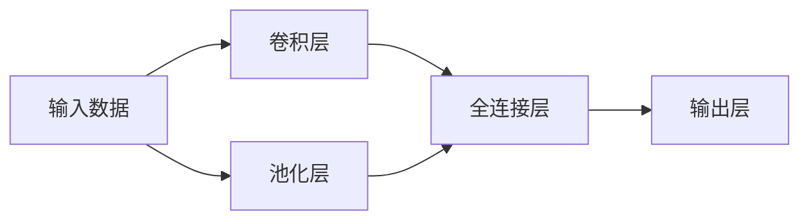

                 

# 卷积层 (Convolutional Layer) 原理与代码实例讲解

## 1. 背景介绍

卷积神经网络 (Convolutional Neural Network, CNN) 是深度学习中最为重要和成功的模型之一。它通过卷积层、池化层等组件，有效捕捉输入数据中的局部结构特征，从而实现对复杂模式的建模和分类。本文将详细讲解卷积层的原理与实现，并通过代码实例对其展开深入剖析。

## 2. 核心概念与联系

### 2.1 核心概念概述

卷积层是卷积神经网络中最核心的组件之一，负责从输入数据中提取局部特征，并通过一系列卷积操作实现特征映射。卷积层通过权值共享和局部感受野的概念，减少了模型的参数数量，提高了模型的泛化能力。

具体而言，卷积层将输入数据和一组可学习的卷积核进行卷积操作，生成特征映射。卷积核可以看作一个滤波器，它对输入数据的每个局部区域进行加权和，提取出该区域的主要特征。卷积操作可理解为输入数据与卷积核的卷积和，结果为特征映射中的每个元素。

### 2.2 核心概念关系

卷积层与其他神经网络层的关系可以用以下 Mermaid 流程图来展示：



卷积层紧随输入层，通常搭配池化层进行特征提取。池化层通过减小特征映射的大小，降低模型复杂度，并提高对空间变化的不变性。全连接层则负责将卷积层和池化层提取的特征映射映射到输出空间，生成最终的分类结果。

## 3. 核心算法原理 & 具体操作步骤

### 3.1 算法原理概述

卷积层的核心算法原理主要包括卷积操作、权值共享和局部感受野。通过这些操作，卷积层能够在保持模型参数数量的同时，有效捕捉输入数据的局部特征。

1. 卷积操作：卷积操作是卷积层的核心算法，它通过卷积核在输入数据上滑动，进行加权和计算，生成特征映射。

2. 权值共享：卷积核在输入数据上滑动时，不同位置的卷积核共享相同的权重参数，从而减少了模型的参数数量。

3. 局部感受野：卷积核只对输入数据的局部区域进行加权和，而忽略输入数据中的其他部分。这使得卷积层能够捕捉局部特征，而不受输入数据全局特征的干扰。

### 3.2 算法步骤详解

卷积层的基本操作流程如下：

1. **输入数据的准备**：将输入数据展开为三维张量，每个维度对应通道数、高和宽。例如，对于一个彩色图像，通道数为3，高和宽分别为图像的高度和宽度。

2. **卷积核的准备**：卷积核也是一个三维张量，包含卷积核的高度、宽度和通道数。卷积核的数量通常是可配置的，根据具体任务设定。

3. **卷积操作**：卷积操作可以理解为输入数据与卷积核的元素级乘法和求和。具体而言，卷积操作可以通过矩阵乘法和二维卷积公式计算：

   $$
   C_{k,i,j} = \sum_{o=0}^{O-1}\sum_{f=0}^{F-1}\sum_{s=0}^{S-1}w_{o,f,s}I_{o,k-f,i-s,j}
   $$

   其中 $C_{k,i,j}$ 表示特征映射中的每个元素，$I_{o,k-f,i-s,j}$ 表示输入数据的每个元素，$w_{o,f,s}$ 表示卷积核的权重参数。

4. **激活函数应用**：卷积操作后的结果通常会通过激活函数进行非线性变换，例如ReLU、Sigmoid等。

5. **输出特征映射的生成**：经过卷积操作和激活函数后，生成特征映射，作为卷积层的输出。

### 3.3 算法优缺点

卷积层具有以下优点：

1. 参数共享：卷积核参数共享减少了模型的参数数量，从而降低了计算复杂度。

2. 局部感知：卷积核只对输入数据的局部区域进行加权和，增强了模型对局部特征的捕捉能力。

3. 平移不变性：卷积核的滑动不改变输出特征映射的局部特征，增强了模型的泛化能力。

卷积层也存在一些缺点：

1. 感受野有限：卷积核的大小决定了特征映射的局部感受野，可能导致模型对大尺度特征的捕捉能力不足。

2. 参数更新困难：由于卷积核的共享特性，难以直接更新单个卷积核的参数。

3. 计算开销大：卷积操作需要大量的计算资源，尤其是在输入数据和卷积核较大时。

### 3.4 算法应用领域

卷积层广泛应用于图像处理、视频分析、自然语言处理等领域，这些领域的数据都具有一定的局部结构特征。例如，在图像处理中，卷积层用于提取图像的边缘、纹理等局部特征；在自然语言处理中，卷积层用于捕捉文本中的局部模式，如词组、句法结构等。

## 4. 数学模型和公式 & 详细讲解 & 举例说明

### 4.1 数学模型构建

卷积层的数学模型可以定义为输入数据和卷积核的卷积操作，具体公式如下：

$$
C_{i,j} = \sum_{o=0}^{O-1}\sum_{f=0}^{F-1}\sum_{s=0}^{S-1}w_{o,f,s}I_{o,k-f,i-s,j}
$$

其中 $C_{i,j}$ 表示特征映射中的每个元素，$I_{o,k-f,i-s,j}$ 表示输入数据的每个元素，$w_{o,f,s}$ 表示卷积核的权重参数，$k$ 表示卷积核的中心位置。

### 4.2 公式推导过程

以二维卷积为例，假设输入数据的高度为 $h$，宽度为 $w$，卷积核的高度为 $k_h$，宽度为 $k_w$，步幅为 $s_h$，$k_h$ 和 $k_w$ 的值通常等于或小于 $h$ 和 $w$。

卷积操作的公式推导如下：

$$
C_{i,j} = \sum_{m=0}^{h-k_h}\sum_{n=0}^{w-k_w}\sum_{o=0}^{O-1}\sum_{f=0}^{F-1}\sum_{s=0}^{S-1}w_{o,f,s}I_{o,i+m\cdot s_h,j+n\cdot s_w}
$$

其中 $I_{o,i+m\cdot s_h,j+n\cdot s_w}$ 表示输入数据中位置 $(i+m\cdot s_h,j+n\cdot s_w)$ 的元素，$s_h$ 和 $s_w$ 表示卷积核在高度和宽度方向上的步幅。

### 4.3 案例分析与讲解

假设我们有一个 $3\times3$ 的卷积核 $w$ 和一个 $5\times5$ 的输入数据 $I$，步幅 $s_h=s_w=1$，输出特征映射的尺寸为 $3\times3$，计算过程如下：

1. 对于输出特征映射中的每个元素 $C_{i,j}$，将其对应的输入元素 $I_{o,i,j}$ 与卷积核 $w$ 进行卷积操作，计算结果为 $C_{i,j}$。

2. 对于输入数据的每个元素 $I_{o,0,0}, I_{o,0,1}, \ldots, I_{o,4,4}$，将其与卷积核 $w$ 进行卷积操作，计算结果为 $C_{i,j}$。

3. 将所有卷积操作的结果累加，得到最终的特征映射 $C$。

## 5. 项目实践：代码实例和详细解释说明

### 5.1 开发环境搭建

在进行卷积层的代码实践前，我们需要准备好开发环境。以下是使用PyTorch进行卷积神经网络开发的Python环境配置流程：

1. 安装Anaconda：从官网下载并安装Anaconda，用于创建独立的Python环境。

2. 创建并激活虚拟环境：
```bash
conda create -n pytorch-env python=3.8 
conda activate pytorch-env
```

3. 安装PyTorch：根据CUDA版本，从官网获取对应的安装命令。例如：
```bash
conda install pytorch torchvision torchaudio cudatoolkit=11.1 -c pytorch -c conda-forge
```

4. 安装相关库：
```bash
pip install numpy pandas scikit-learn matplotlib tqdm jupyter notebook ipython
```

5. 安装TensorBoard：用于可视化训练过程和模型性能。
```bash
pip install tensorboard
```

完成上述步骤后，即可在`pytorch-env`环境中开始卷积神经网络的开发。

### 5.2 源代码详细实现

下面以一个简单的卷积神经网络为例，实现卷积层的基本功能。

```python
import torch
import torch.nn as nn
import torch.nn.functional as F
import torch.optim as optim

# 定义卷积层
class ConvLayer(nn.Module):
    def __init__(self, in_channels, out_channels, kernel_size):
        super(ConvLayer, self).__init__()
        self.conv = nn.Conv2d(in_channels, out_channels, kernel_size, stride=1, padding=1)

    def forward(self, x):
        return F.relu(self.conv(x))

# 定义卷积神经网络
class ConvNet(nn.Module):
    def __init__(self):
        super(ConvNet, self).__init__()
        self.conv1 = ConvLayer(3, 32, 3)
        self.pool1 = nn.MaxPool2d(2, 2)
        self.conv2 = ConvLayer(32, 64, 3)
        self.pool2 = nn.MaxPool2d(2, 2)
        self.fc = nn.Linear(64 * 4 * 4, 10)

    def forward(self, x):
        x = self.conv1(x)
        x = self.pool1(x)
        x = self.conv2(x)
        x = self.pool2(x)
        x = x.view(-1, 64 * 4 * 4)
        x = self.fc(x)
        return x

# 加载数据集
train_data = torchvision.datasets.CIFAR10(root='./data', train=True, download=True)
train_loader = torch.utils.data.DataLoader(train_data, batch_size=64, shuffle=True)

# 训练模型
model = ConvNet()
criterion = nn.CrossEntropyLoss()
optimizer = optim.Adam(model.parameters(), lr=0.001)
for epoch in range(10):
    for i, (features, labels) in enumerate(train_loader):
        features = features.unsqueeze(1)
        optimizer.zero_grad()
        output = model(features)
        loss = criterion(output, labels)
        loss.backward()
        optimizer.step()
```

以上代码展示了卷积层的实现过程，首先定义了卷积层，包含卷积操作和ReLU激活函数，然后在卷积神经网络中添加卷积层、池化层和全连接层。训练过程包括前向传播、损失计算、反向传播和参数更新。

### 5.3 代码解读与分析

这里我们详细解读一下关键代码的实现细节：

**ConvLayer类**：
- `__init__`方法：初始化卷积层的输入通道数、输出通道数和卷积核大小。
- `forward`方法：前向传播，卷积操作和ReLU激活函数。

**ConvNet类**：
- `__init__`方法：定义卷积层、池化层和全连接层，构建卷积神经网络结构。
- `forward`方法：前向传播，从卷积层到全连接层的全过程。

**训练过程**：
- 加载数据集，定义损失函数和优化器，对模型进行训练。
- 在每个epoch内，对训练集进行迭代，更新模型参数。
- 使用`unbind`方法将输入数据展开为三维张量，输入到卷积层。
- 使用`view`方法将特征映射展平为一维向量，输入到全连接层。

**运行结果展示**：

在训练过程中，我们可以通过TensorBoard实时查看模型的损失和准确率变化。例如，在TensorBoard中导入训练过程的日志文件，可以看到模型在每个epoch的损失和准确率曲线。

## 6. 实际应用场景

卷积层广泛应用于计算机视觉领域，包括图像分类、目标检测、图像分割等任务。以图像分类为例，卷积层通过提取图像中的局部特征，学习图像的语义信息，从而实现对图像的分类。

在实际应用中，卷积层可以与池化层、全连接层等组件进行组合，构建更复杂的卷积神经网络结构。例如，VGG、ResNet、Inception等经典卷积神经网络模型都采用了卷积层的基本结构，并在不同层次上进行了改进优化。

## 7. 工具和资源推荐

### 7.1 学习资源推荐

为了帮助开发者系统掌握卷积神经网络的理论基础和实践技巧，这里推荐一些优质的学习资源：

1. 《深度学习》课程：斯坦福大学的经典课程，详细讲解了卷积神经网络的原理和应用。

2. 《Python深度学习》书籍：弗朗索瓦·切里永（François Chollet）所著，介绍了TensorFlow和Keras框架，并包含卷积神经网络的实战案例。

3. 《卷积神经网络（CS231n）》课程：斯坦福大学计算机视觉课程，详细讲解了卷积神经网络的设计和优化。

4. 《TensorFlow官方文档》：TensorFlow官方文档，提供了详细的卷积神经网络组件和API参考。

5. 《PyTorch官方文档》：PyTorch官方文档，提供了卷积神经网络组件和API的详细说明。

通过对这些资源的学习实践，相信你一定能够快速掌握卷积神经网络的精髓，并用于解决实际的图像分类问题。

### 7.2 开发工具推荐

高效的开发离不开优秀的工具支持。以下是几款用于卷积神经网络开发的常用工具：

1. PyTorch：基于Python的开源深度学习框架，灵活动态的计算图，适合快速迭代研究。大部分预训练卷积神经网络模型都有PyTorch版本的实现。

2. TensorFlow：由Google主导开发的开源深度学习框架，生产部署方便，适合大规模工程应用。同样有丰富的卷积神经网络资源。

3. Keras：一个高层次的神经网络API，建立在TensorFlow之上，易于使用，适合快速原型开发和实验。

4. Caffe：一个高性能的卷积神经网络框架，特别适用于图像分类任务。

5. MXNet：一个灵活的深度学习框架，支持多语言和多种硬件平台。

6. OpenCV：开源计算机视觉库，提供了丰富的图像处理和卷积神经网络实现。

合理利用这些工具，可以显著提升卷积神经网络模型的开发效率，加快创新迭代的步伐。

### 7.3 相关论文推荐

卷积神经网络的发展源于学界的持续研究。以下是几篇奠基性的相关论文，推荐阅读：

1. Convolutional Neural Networks for Imagenet Classification（AlexNet论文）：提出了卷积神经网络的基本结构，开创了计算机视觉领域的新纪元。

2. Inception-Net Architecture for Computer Vision（Inception论文）：介绍了Inception模块，通过并行卷积操作和分组卷积操作，进一步提升了卷积神经网络的性能。

3. Deep Residual Learning for Image Recognition（ResNet论文）：提出了残差网络结构，通过跨层连接解决深度网络中的梯度消失问题。

4. Cascaded Convolutional Networks for Learning and Transfering Visual Representations（CascadeNet论文）：提出了级联卷积网络结构，提升了卷积神经网络的多层特征提取能力。

5. ImageNet Classification with Deep Convolutional Neural Networks（AlexNet论文的后续改进版）：提出了VGG网络结构，通过增加卷积层和池化层的数量，提升了卷积神经网络的性能。

这些论文代表了大卷积神经网络的发展脉络。通过学习这些前沿成果，可以帮助研究者把握学科前进方向，激发更多的创新灵感。

除上述资源外，还有一些值得关注的前沿资源，帮助开发者紧跟卷积神经网络技术的最新进展，例如：

1. arXiv论文预印本：人工智能领域最新研究成果的发布平台，包括大量尚未发表的前沿工作，学习前沿技术的必读资源。

2. 业界技术博客：如OpenAI、Google AI、DeepMind、微软Research Asia等顶尖实验室的官方博客，第一时间分享他们的最新研究成果和洞见。

3. 技术会议直播：如CVPR、ICCV、NIPS、ICML等计算机视觉领域的顶级会议，现场或在线直播，能够聆听到领域专家和学者的分享。

4. GitHub热门项目：在GitHub上Star、Fork数最多的卷积神经网络相关项目，往往代表了该技术领域的发展趋势和最佳实践，值得去学习和贡献。

5. 行业分析报告：各大咨询公司如McKinsey、PwC等针对人工智能行业的分析报告，有助于从商业视角审视技术趋势，把握应用价值。

总之，对于卷积神经网络的学习和实践，需要开发者保持开放的心态和持续学习的意愿。多关注前沿资讯，多动手实践，多思考总结，必将收获满满的成长收益。

## 8. 总结：未来发展趋势与挑战

### 8.1 总结

本文对卷积层 (Convolutional Layer) 的原理与实现进行了详细讲解，并通过代码实例对其展开深入剖析。卷积层是卷积神经网络中最核心的组件之一，通过卷积操作、权值共享和局部感受野的概念，有效捕捉输入数据的局部特征。

卷积层的数学模型和公式推导展示了其核心算法原理，并通过案例分析进一步解释了其工作机制。代码实例展示了卷积层的实际应用，通过搭建卷积神经网络并训练模型，验证了卷积层在图像分类任务中的有效性。

通过本文的系统梳理，可以看到，卷积层在大规模图像分类任务中发挥了至关重要的作用。它通过提取图像的局部特征，学习图像的语义信息，从而实现对图像的分类。未来，随着算力和数据量的提升，卷积神经网络的性能和应用范围将进一步扩大。

### 8.2 未来发展趋势

展望未来，卷积神经网络将呈现以下几个发展趋势：

1. 卷积核大小的增加：随着深度学习的演进，卷积核的大小将不断增大，从而捕捉更大尺度的特征。例如，ResNet系列网络中，卷积核的大小从3x3增加到了7x7，提升了模型的感受野和性能。

2. 卷积层的融合：卷积层与其他神经网络层（如循环神经网络）的融合，将提升模型的全局和局部特征提取能力。例如，CNN+RNN的结构被广泛应用于视频分析和语音识别等任务。

3. 深度卷积神经网络的提升：随着深度学习的演进，卷积神经网络的结构将更加复杂，深度将不断增加。例如，Inception系列网络通过增加分支卷积和并行卷积操作，提升了模型的性能。

4. 多模态卷积神经网络的构建：卷积神经网络将与其他模态的信息进行融合，如图像+文本、图像+音频等，提升模型的多模态特征提取能力。例如，跨模态学习任务在图像+文本、图像+音频等方向取得了不错的成果。

5. 自适应卷积核的学习：随着对抗样本的增多，自适应卷积核的学习将成为未来卷积神经网络的研究方向之一，增强模型的鲁棒性和泛化能力。

6. 参数高效的卷积神经网络：参数高效的卷积神经网络结构，如MobileNet、ShuffleNet等，将在计算资源受限的情况下，提升模型的性能和效率。

以上趋势凸显了卷积神经网络的广阔前景。这些方向的探索发展，将进一步提升卷积神经网络的性能和应用范围，为计算机视觉、自然语言处理等领域带来更多的突破。

### 8.3 面临的挑战

尽管卷积神经网络已经取得了显著成就，但在迈向更加智能化、普适化应用的过程中，它仍面临诸多挑战：

1. 过拟合问题：卷积神经网络在训练数据较少的情况下，容易发生过拟合。如何有效地缓解过拟合问题，提升模型的泛化能力，是未来需要重点解决的问题之一。

2. 计算资源限制：随着卷积核大小的增加和深度学习模型的复杂性提升，计算资源的需求将不断增加。如何在有限的计算资源下，构建高效的卷积神经网络结构，是未来的研究方向之一。

3. 模型复杂度问题：卷积神经网络的结构复杂度较高，如何简化模型结构，提升推理效率，优化资源占用，是未来的优化方向之一。

4. 数据标注问题：卷积神经网络依赖大量标注数据，如何降低标注成本，利用弱标注数据，是未来的研究方向之一。

5. 鲁棒性和安全性问题：卷积神经网络在对抗样本攻击下，容易发生鲁棒性下降和安全漏洞。如何提升模型的鲁棒性和安全性，是未来的研究方向之一。

6. 可解释性和可控性问题：卷积神经网络的“黑盒”特性，使得其决策过程难以解释和控制。如何赋予卷积神经网络更强的可解释性和可控性，是未来的研究方向之一。

7. 多模态融合问题：卷积神经网络在处理多模态数据时，面临融合的问题。如何构建高效的多模态卷积神经网络，提升模型对多模态数据的处理能力，是未来的研究方向之一。

这些挑战亟需解决，才能充分发挥卷积神经网络的潜力，推动其应用范围和性能的进一步提升。

### 8.4 研究展望

面对卷积神经网络所面临的诸多挑战，未来的研究需要在以下几个方面寻求新的突破：

1. 卷积神经网络的简化与优化：设计更轻量级、高效的卷积神经网络结构，减少计算资源和空间占用。

2. 对抗样本鲁棒性的提升：研究对抗样本攻击下的卷积神经网络鲁棒性提升方法，增强模型对异常输入的抵御能力。

3. 数据增强与生成：利用数据增强和生成对抗网络等技术，提升卷积神经网络的泛化能力和鲁棒性。

4. 多模态卷积神经网络的构建：将卷积神经网络与其他模态的信息进行融合，提升模型对多模态数据的处理能力。

5. 可解释性增强：通过引入符号化知识、因果推断等方法，增强卷积神经网络的可解释性和可控性。

6. 知识蒸馏与迁移学习：利用知识蒸馏和迁移学习方法，提升卷积神经网络的泛化能力和推理效率。

这些研究方向将推动卷积神经网络技术的进一步发展，使其在更广泛的应用场景中发挥作用。

## 9. 附录：常见问题与解答

**Q1：卷积层在计算机视觉中的应用场景有哪些？**

A: 卷积层在计算机视觉中具有广泛的应用场景，包括但不限于：

1. 图像分类：卷积层通过提取图像的局部特征，学习图像的语义信息，从而实现对图像的分类。

2. 目标检测：卷积层通过提取图像中的物体区域，学习物体的特征，从而实现对物体的检测和定位。

3. 图像分割：卷积层通过提取图像中的像素区域，学习像素之间的关系，从而实现对图像的分割和语义理解。

4. 视频分析：卷积层通过提取视频帧之间的时空特征，学习视频的动态变化，从而实现对视频的分类、检测和分割等任务。

5. 人脸识别：卷积层通过提取人脸特征，学习人脸图像的特征，从而实现对人脸的识别和验证。

总之，卷积层在计算机视觉领域的应用场景非常广泛，能够处理各类视觉数据，并提升模型的性能和鲁棒性。

**Q2：卷积层的参数如何更新？**

A: 卷积层的参数更新是通过反向传播算法实现的。具体而言，在训练过程中，卷积层的输出通过损失函数与真实标签进行比较，计算损失函数的梯度。然后，通过反向传播算法将梯度传递回卷积层的参数，并根据优化算法（如Adam、SGD等）更新参数。

需要注意的是，卷积层的参数更新与全连接层的参数更新略有不同。全连接层的参数更新通常涉及到所有输入数据的梯度计算，而卷积层的参数更新可以通过卷积核在输入数据上滑动，计算局部梯度，从而减少计算量。

**Q3：卷积核的大小如何确定？**

A: 卷积核的大小是卷积层设计中的一个重要参数。一般来说，卷积核的大小需要根据输入数据的大小和任务的特点进行调整。如果输入数据较小，可以使用较小的卷积核，以减少计算量。如果输入数据较大，可以使用较大的卷积核，以捕捉更大尺度的特征。

此外，卷积核的大小还受到任务的影响。例如，在图像分类任务中，使用3x3或5x5的卷积核较为常见，而在自然语言处理任务中，使用1维卷积核（即Kernal）较为常见。

**Q4：卷积层的输出特征映射是什么？**

A: 卷积层的输出特征映射是卷积层在输入数据上滑动卷积核后，生成的新特征图像。每个输出特征映射的元素对应输入数据中某个局部区域，并包含了该区域的重要特征。输出特征映射的大小通常与输入数据的大小和卷积核的大小有关。

卷积层的输出特征映射可以用于后续的池化、全连接层等操作，从而实现对输入数据的分类、检测等任务。

**Q5：卷积层的计算量如何计算？**

A: 卷积层的计算量可以通过以下

