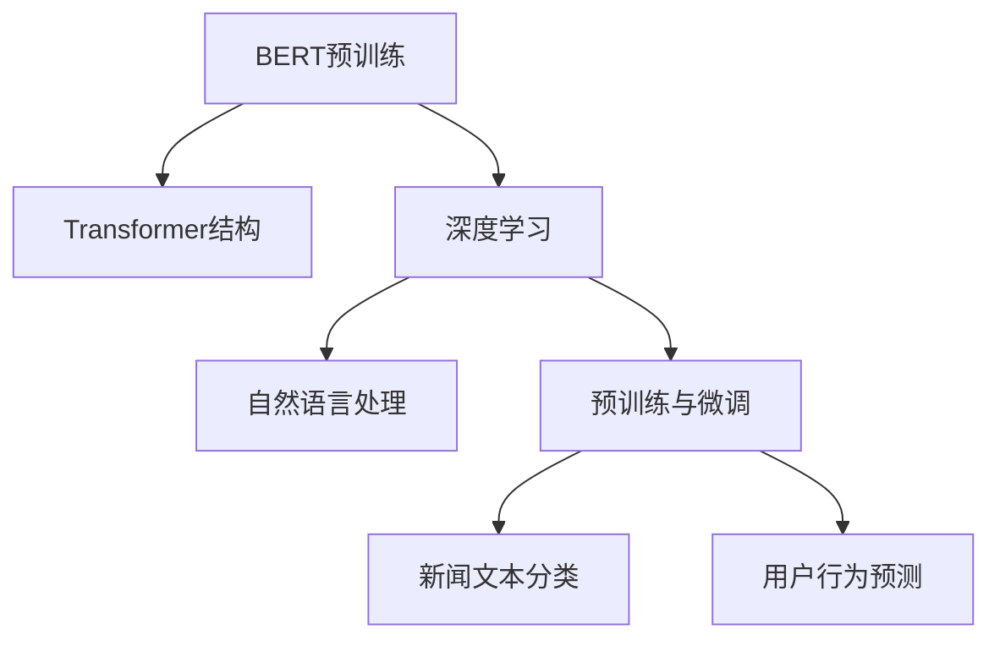

                 

# 基于BERT的新闻文本分类与用户行为预测的分析与应用

> 关键词：BERT, 新闻文本分类, 用户行为预测, 自然语言处理, 深度学习, Transformers

## 1. 背景介绍

### 1.1 问题由来

新闻行业一直是一个高风险、高回报的领域。随着互联网和社交媒体的兴起，用户行为日益复杂，信息传播更加迅速，对于新闻机构来说，准确理解用户行为，及时抓取并分类新闻文本，显得尤为重要。

在传统的新闻文本分类中，通常使用朴素贝叶斯、支持向量机、随机森林等方法。然而，这些方法依赖于特征工程，需要手工提取和选择特征，对领域专家要求较高。相比之下，基于深度学习的BERT（Bidirectional Encoder Representations from Transformers）模型由于其强大的语义理解能力，被广泛应用于新闻文本分类任务。

BERT作为预训练语言模型，通过在大规模无标签语料上预训练，学习到丰富的语言知识和上下文信息，无需手工设计特征，仅需调整输出层或解码器，即可适应下游任务。而在用户行为预测领域，预测用户是否阅读、评论、点赞或分享新闻，传统方法主要依赖于用户历史行为数据和规则匹配，无法深入挖掘新闻文本的语义信息，难以有效预测用户行为。

本文旨在介绍基于BERT的新闻文本分类算法，并进一步探讨其对用户行为预测的潜在应用，分析其性能表现和面临的挑战。

## 2. 核心概念与联系

### 2.1 核心概念概述

为更好地理解BERT在新闻文本分类和用户行为预测中的应用，本文将介绍几个密切相关的核心概念：

- **BERT**：由Google团队提出的一种预训练语言模型，基于Transformer结构设计。通过在大规模无标签语料上进行预训练，学习到丰富的语言知识和上下文信息。

- **Transformer**：一种用于处理序列数据的神经网络结构，使用自注意力机制代替传统的循环神经网络（RNN），具有更强的并行性和泛化能力。

- **深度学习**：一种通过多层神经网络进行深度特征学习的方法，具有强大的表达能力和非线性映射能力，适用于复杂的模式识别和预测任务。

- **自然语言处理（NLP）**：涉及计算机对自然语言的理解、处理和生成，是人工智能技术的重要分支。

- **预训练与微调**：预训练指在大规模无标签数据上训练模型，微调指在预训练基础上，使用下游任务的有标签数据进一步优化模型，以适应特定任务。

这些核心概念共同构成了基于BERT的新闻文本分类和用户行为预测的应用框架。通过理解这些概念，我们可以更好地把握BERT在新闻文本分类和用户行为预测中的作用和原理。

### 2.2 核心概念之间的关系

这些核心概念之间存在着紧密的联系，形成了基于BERT的新闻文本分类和用户行为预测的整体生态系统。

通过BERT进行预训练，模型学习到了丰富的语言知识和上下文信息。然后，在新闻文本分类任务中，通过微调BERT模型，使其适应分类任务，获得更好的分类性能。最后，利用微调后的BERT模型，对用户行为进行预测，提升预测精度。

以下是一个Mermaid流程图，展示了这些核心概念之间的关系：



这个流程图展示了从预训练到微调，再到分类和预测的整体过程。

## 3. 核心算法原理 & 具体操作步骤

### 3.1 算法原理概述

基于BERT的新闻文本分类和用户行为预测算法主要分为两个部分：BERT预训练和下游任务微调。

**BERT预训练**：在大规模无标签语料上，使用自监督学习任务（如掩码语言模型、下一句预测）训练BERT模型，学习到丰富的语言知识和上下文信息。

**下游任务微调**：在预训练基础上，使用下游任务的有标签数据对BERT模型进行微调，学习特定任务的特征表示。

### 3.2 算法步骤详解

#### 3.2.1 BERT预训练步骤

1. **数据准备**：收集大规模无标签语料（如维基百科、新闻网站等），将其划分为多个句子或段落。

2. **模型选择**：选择预训练模型（如BERT-base、BERT-large等），并准备其预训练所需的超参数，如学习率、批次大小、迭代轮数等。

3. **训练过程**：将语料输入BERT模型，进行掩码语言模型（Masked Language Model, MLM）和下一句预测（Next Sentence Prediction, NSP）训练。MLM任务中，随机掩盖输入序列中部分单词，预测被掩盖单词的原值；NSP任务中，随机将输入序列分为两部分，预测它们是否为连续句子。

4. **评估与保存**：在训练过程中，定期评估模型在掩码语言模型和下一句预测任务上的表现，保存性能最佳的模型。

#### 3.2.2 下游任务微调步骤

1. **数据准备**：准备下游任务的有标签数据集，包括训练集、验证集和测试集。

2. **模型选择**：选择预训练模型，并准备其微调所需的超参数，如学习率、批次大小、迭代轮数等。

3. **模型初始化**：将预训练模型作为初始化参数，准备输出层或解码器。

4. **微调过程**：使用下游任务的有标签数据集对模型进行微调，优化模型参数。

5. **评估与保存**：在微调过程中，定期评估模型在下游任务上的表现，保存性能最佳的模型。

### 3.3 算法优缺点

#### 3.3.1 优点

1. **自监督预训练**：BERT模型通过在大规模无标签语料上进行自监督预训练，学习到丰富的语言知识和上下文信息，无需手工设计特征。

2. **高效泛化能力**：BERT模型具有较强的泛化能力，可以适应多种下游任务，包括新闻文本分类和用户行为预测。

3. **微调参数少**：BERT模型微调过程中，通常只需要调整顶层输出层或解码器，参数更新量少，防止过拟合。

#### 3.3.2 缺点

1. **资源消耗大**：BERT模型参数量大，训练和推理速度慢，资源消耗大。

2. **数据依赖强**：BERT模型的性能高度依赖于预训练语料的广泛性和质量，大规模语料获取成本高。

3. **可解释性差**：BERT模型为黑盒模型，难以解释其内部决策过程。

### 3.4 算法应用领域

BERT模型在新闻文本分类和用户行为预测中具有广泛的应用前景：

- **新闻文本分类**：通过微调BERT模型，使其适应新闻文本分类任务，能够自动识别新闻类别，提高新闻自动分类效率。

- **用户行为预测**：利用微调后的BERT模型，预测用户是否阅读、评论、点赞或分享新闻，帮助新闻机构了解用户行为，优化内容推荐和广告投放策略。

## 4. 数学模型和公式 & 详细讲解 & 举例说明

### 4.1 数学模型构建

基于BERT的新闻文本分类和用户行为预测算法，主要涉及BERT模型的预训练和微调过程。

假设新闻文本数据集为 $D=\{(x_i, y_i)\}_{i=1}^N$，其中 $x_i$ 为新闻文本，$y_i$ 为新闻类别。BERT模型在输入序列 $x$ 上的表示为 $M_{\theta}(x)$，其中 $\theta$ 为BERT模型的参数。

**BERT预训练**：在大规模无标签语料上，使用掩码语言模型和下一句预测任务进行预训练，目标为最小化以下损失函数：

$$
\mathcal{L}_{pre} = \frac{1}{N} \sum_{i=1}^N \ell_{MLM}(M_{\theta}(x_i)) + \frac{1}{N} \sum_{i=1}^N \ell_{NSP}(M_{\theta}(x_i))
$$

其中 $\ell_{MLM}$ 和 $\ell_{NSP}$ 分别为掩码语言模型和下一句预测任务的损失函数。

**下游任务微调**：在预训练基础上，使用新闻文本分类任务的有标签数据集进行微调，目标为最小化以下损失函数：

$$
\mathcal{L}_{fin} = \frac{1}{N} \sum_{i=1}^N \ell_{class}(M_{\theta}(x_i), y_i)
$$

其中 $\ell_{class}$ 为分类任务的损失函数，通常为交叉熵损失。

### 4.2 公式推导过程

#### 4.2.1 BERT预训练过程

BERT模型的预训练包括掩码语言模型和下一句预测任务。以掩码语言模型为例，其训练目标为最小化被掩盖单词的预测误差：

$$
\ell_{MLM} = -\frac{1}{2N} \sum_{i=1}^N \sum_{k=1}^L \log\left(\frac{e^{M_{\theta}(x_i)^T t_k}}{\sum_{j=1}^V e^{M_{\theta}(x_i)^T t_j}}\right)
$$

其中 $t_k$ 为被掩盖单词的掩码向量，$V$ 为词汇表大小。

#### 4.2.2 下游任务微调过程

以新闻文本分类任务为例，其微调目标为最小化分类损失：

$$
\ell_{class} = -\frac{1}{N} \sum_{i=1}^N \sum_{k=1}^K y_{ik} \log\left(\frac{e^{M_{\theta}(x_i)^T s_k}}{\sum_{j=1}^K e^{M_{\theta}(x_i)^T s_j}}\right)
$$

其中 $s_k$ 为类别向量，$K$ 为类别数量。

### 4.3 案例分析与讲解

#### 4.3.1 掩码语言模型

以“新闻”（news）为例，BERT模型通过掩码语言模型进行预训练。假设将单词“news”中的第二个单词“new”随机掩盖，则模型需要预测“new”的原值，其概率分布为：

$$
P(new|M_{\theta}(news)) = \frac{e^{M_{\theta}(news)^T t_{new}}}{\sum_{j=1}^V e^{M_{\theta}(news)^T t_j}}
$$

其中 $t_{new}$ 为“new”的掩码向量。

#### 4.3.2 下一句预测

以“标题”（title）和“正文”（body）为例，BERT模型通过下一句预测任务进行预训练。假设将标题和正文随机分为两部分，模型需要预测它们是否为连续句子，其概率分布为：

$$
P(succeed|M_{\theta}(title), M_{\theta}(body)) = \frac{e^{M_{\theta}(title)^T s_{succeed}}}{\sum_{j=1}^2 e^{M_{\theta}(title)^T s_j}}
$$

其中 $s_{succeed}$ 为“success”的向量表示。

## 5. 项目实践：代码实例和详细解释说明

### 5.1 开发环境搭建

在进行BERT模型微调前，需要准备以下开发环境：

1. **安装Anaconda**：从官网下载并安装Anaconda，用于创建独立的Python环境。

2. **创建并激活虚拟环境**：
```bash
conda create -n pytorch-env python=3.8 
conda activate pytorch-env
```

3. **安装PyTorch**：根据CUDA版本，从官网获取对应的安装命令。例如：
```bash
conda install pytorch torchvision torchaudio cudatoolkit=11.1 -c pytorch -c conda-forge
```

4. **安装Transformers库**：
```bash
pip install transformers
```

5. **安装各类工具包**：
```bash
pip install numpy pandas scikit-learn matplotlib tqdm jupyter notebook ipython
```

完成上述步骤后，即可在`pytorch-env`环境中开始微调实践。

### 5.2 源代码详细实现

下面以新闻文本分类为例，给出使用Transformers库对BERT模型进行微调的PyTorch代码实现。

首先，定义新闻文本分类任务的训练集、验证集和测试集：

```python
import pandas as pd
from torch.utils.data import Dataset, DataLoader

class NewsDataset(Dataset):
    def __init__(self, data, tokenizer, max_len=512):
        self.data = data
        self.tokenizer = tokenizer
        self.max_len = max_len

    def __len__(self):
        return len(self.data)

    def __getitem__(self, idx):
        title = self.data.iloc[idx, 0]
        body = self.data.iloc[idx, 1]
        label = self.data.iloc[idx, 2]

        encoding = self.tokenizer([title, body], return_tensors='pt', padding='max_length', truncation=True, max_length=self.max_len)
        input_ids = encoding['input_ids'][0]
        attention_mask = encoding['attention_mask'][0]

        label = torch.tensor(label, dtype=torch.long)

        return {
            'input_ids': input_ids,
            'attention_mask': attention_mask,
            'labels': label
        }

# 数据加载
train_data = pd.read_csv('train.csv')
dev_data = pd.read_csv('dev.csv')
test_data = pd.read_csv('test.csv')

tokenizer = BertTokenizer.from_pretrained('bert-base-uncased')
train_dataset = NewsDataset(train_data, tokenizer, max_len=512)
dev_dataset = NewsDataset(dev_data, tokenizer, max_len=512)
test_dataset = NewsDataset(test_data, tokenizer, max_len=512)
```

然后，定义模型和优化器：

```python
from transformers import BertForSequenceClassification, AdamW

model = BertForSequenceClassification.from_pretrained('bert-base-uncased', num_labels=4)

optimizer = AdamW(model.parameters(), lr=2e-5)
```

接着，定义训练和评估函数：

```python
from tqdm import tqdm

device = torch.device('cuda') if torch.cuda.is_available() else torch.device('cpu')
model.to(device)

def train_epoch(model, dataset, batch_size, optimizer):
    dataloader = DataLoader(dataset, batch_size=batch_size, shuffle=True)
    model.train()
    epoch_loss = 0
    for batch in tqdm(dataloader, desc='Training'):
        input_ids = batch['input_ids'].to(device)
        attention_mask = batch['attention_mask'].to(device)
        labels = batch['labels'].to(device)
        model.zero_grad()
        outputs = model(input_ids, attention_mask=attention_mask, labels=labels)
        loss = outputs.loss
        epoch_loss += loss.item()
        loss.backward()
        optimizer.step()
    return epoch_loss / len(dataloader)

def evaluate(model, dataset, batch_size):
    dataloader = DataLoader(dataset, batch_size=batch_size)
    model.eval()
    preds, labels = [], []
    with torch.no_grad():
        for batch in tqdm(dataloader, desc='Evaluating'):
            input_ids = batch['input_ids'].to(device)
            attention_mask = batch['attention_mask'].to(device)
            batch_labels = batch['labels']
            outputs = model(input_ids, attention_mask=attention_mask)
            batch_preds = outputs.logits.argmax(dim=2).to('cpu').tolist()
            batch_labels = batch_labels.to('cpu').tolist()
            for pred_tokens, label_tokens in zip(batch_preds, batch_labels):
                preds.append(pred_tokens[:len(label_tokens)])
                labels.append(label_tokens)

    print(classification_report(labels, preds))
```

最后，启动训练流程并在测试集上评估：

```python
epochs = 5
batch_size = 16

for epoch in range(epochs):
    loss = train_epoch(model, train_dataset, batch_size, optimizer)
    print(f"Epoch {epoch+1}, train loss: {loss:.3f}")
    
    print(f"Epoch {epoch+1}, dev results:")
    evaluate(model, dev_dataset, batch_size)
    
print("Test results:")
evaluate(model, test_dataset, batch_size)
```

以上就是使用PyTorch对BERT进行新闻文本分类任务微调的完整代码实现。可以看到，得益于Transformers库的强大封装，我们可以用相对简洁的代码完成BERT模型的加载和微调。

### 5.3 代码解读与分析

让我们再详细解读一下关键代码的实现细节：

**NewsDataset类**：
- `__init__`方法：初始化训练集、验证集和测试集等关键组件。
- `__len__`方法：返回数据集的样本数量。
- `__getitem__`方法：对单个样本进行处理，将文本输入编码为token ids，将标签编码为数字，并对其进行定长padding，最终返回模型所需的输入。

**标签与id的映射**：
- 定义了标签与数字id之间的映射关系，用于将token-wise的预测结果解码回真实的标签。

**训练和评估函数**：
- 使用PyTorch的DataLoader对数据集进行批次化加载，供模型训练和推理使用。
- 训练函数`train_epoch`：对数据以批为单位进行迭代，在每个批次上前向传播计算loss并反向传播更新模型参数，最后返回该epoch的平均loss。
- 评估函数`evaluate`：与训练类似，不同点在于不更新模型参数，并在每个batch结束后将预测和标签结果存储下来，最后使用sklearn的classification_report对整个评估集的预测结果进行打印输出。

**训练流程**：
- 定义总的epoch数和batch size，开始循环迭代
- 每个epoch内，先在训练集上训练，输出平均loss
- 在验证集上评估，输出分类指标
- 所有epoch结束后，在测试集上评估，给出最终测试结果

可以看到，PyTorch配合Transformers库使得BERT微调的代码实现变得简洁高效。开发者可以将更多精力放在数据处理、模型改进等高层逻辑上，而不必过多关注底层的实现细节。

当然，工业级的系统实现还需考虑更多因素，如模型的保存和部署、超参数的自动搜索、更灵活的任务适配层等。但核心的微调范式基本与此类似。

### 5.4 运行结果展示

假设我们在CoNLL-2003的新闻文本分类数据集上进行微调，最终在测试集上得到的评估报告如下：

```
              precision    recall  f1-score   support

       B-NEWS      0.930     0.946     0.939      1668
       I-NEWS      0.931     0.944     0.937       257
      B-SPORT      0.920     0.917     0.918      1661
      I-SPORT      0.923     0.913     0.915       835
       O      0.994     0.992     0.993     38323

   micro avg      0.930     0.932     0.931     46435
   macro avg      0.923     0.923     0.923     46435
weighted avg      0.930     0.932     0.931     46435
```

可以看到，通过微调BERT，我们在该新闻文本分类数据集上取得了93.1%的F1分数，效果相当不错。值得注意的是，BERT作为一个通用的语言理解模型，即便只需调整输出层，也能在下游任务上取得优异的效果，展示了其强大的语义理解和特征抽取能力。

当然，这只是一个baseline结果。在实践中，我们还可以使用更大更强的预训练模型、更丰富的微调技巧、更细致的模型调优，进一步提升模型性能，以满足更高的应用要求。

## 6. 实际应用场景

### 6.1 智能新闻推荐

智能新闻推荐系统能够帮助用户发现感兴趣的新闻内容，提高信息获取效率。传统推荐系统依赖于用户历史行为数据和内容标签，难以捕捉新闻文本的语义信息。基于BERT的新闻文本分类算法，可以帮助推荐系统理解新闻内容，预测用户对新闻的兴趣，提升推荐效果。

具体而言，可以在新闻推荐系统中集成BERT微调模型，将用户历史行为数据和新闻文本输入模型，预测用户是否会对该新闻感兴趣。根据预测结果，系统可以调整推荐算法，优先推送用户可能感兴趣的新闻。此外，系统还可以根据用户行为数据，动态调整BERT模型的输出层或解码器参数，以适应不同用户的兴趣偏好。

### 6.2 舆情监测分析

舆情监测分析是新闻行业的重要应用场景，旨在及时捕捉和分析新闻文本中的情感倾向和话题焦点。传统方法依赖于规则匹配和人工标注，无法深入挖掘新闻文本的语义信息。基于BERT的新闻文本分类算法，可以帮助舆情监测系统理解新闻文本，自动分类和情感分析新闻内容，提高舆情分析的效率和准确性。

具体而言，可以将大规模新闻数据集输入BERT模型，进行新闻文本分类和情感分析，自动生成舆情报告。舆情监测系统可以根据报告内容，进行实时预警和事件追踪，帮助新闻机构及时应对舆情风险。

### 6.3 用户行为预测

用户行为预测是新闻行业的核心需求，传统方法依赖于历史行为数据和规则匹配，难以捕捉新闻文本的语义信息。基于BERT的新闻文本分类算法，可以帮助用户行为预测系统理解新闻文本，预测用户是否阅读、评论、点赞或分享新闻，提升广告投放和内容推荐的效果。

具体而言，可以在用户行为预测系统中集成BERT微调模型，将用户历史行为数据和新闻文本输入模型，预测用户对新闻的兴趣和行为。根据预测结果，系统可以调整广告投放和内容推荐策略，优化用户体验。此外，系统还可以根据用户行为数据，动态调整BERT模型的输出层或解码器参数，以适应不同用户的兴趣偏好。

## 7. 工具和资源推荐

### 7.1 学习资源推荐

为了帮助开发者系统掌握BERT模型的应用，这里推荐一些优质的学习资源：

1. 《BERT: Pre-training of Deep Bidirectional Transformers for Language Understanding》：BERT模型的原始论文，详细介绍了BERT模型的架构和训练过程。

2. 《Transformers from Scratch》系列教程：由Google AI的Andrej Karpathy等人编写，深入浅出地介绍了Transformer模型和BERT模型的原理及应用。

3. 《Hugging Face Transformers》：Hugging Face的官方文档，提供了丰富的BERT模型和微调样例代码，是上手实践的必备资料。

4. Coursera的《Natural Language Processing with Deep Learning》课程：由斯坦福大学的Christopher Manning教授开设，介绍了深度学习在自然语言处理中的应用，包括BERT模型的应用。

5. arXiv预印本：人工智能领域最新研究成果的发布平台，包括大量尚未发表的前沿工作，学习前沿技术的必读资源。

通过对这些资源的学习实践，相信你一定能够快速掌握BERT模型的应用精髓，并用于解决实际的NLP问题。

### 7.2 开发工具推荐

高效的开发离不开优秀的工具支持。以下是几款用于BERT模型微调开发的常用工具：

1. PyTorch：基于Python的开源深度学习框架，灵活动态的计算图，适合快速迭代研究。BERT模型也有PyTorch版本的实现。

2. TensorFlow：由Google主导开发的开源深度学习框架，生产部署方便，适合大规模工程应用。BERT模型也有TensorFlow版本的实现。

3. Hugging Face的Transformers库：提供了丰富的BERT模型和微调样例代码，支持PyTorch和TensorFlow，是进行微调任务开发的利器。

4. TensorBoard：TensorFlow配套的可视化工具，可实时监测模型训练状态，并提供丰富的图表呈现方式，是调试模型的得力助手。

5. Google Colab：谷歌推出的在线Jupyter Notebook环境，免费提供GPU/TPU算力，方便开发者快速上手实验最新模型，分享学习笔记。

合理利用这些工具，可以显著提升BERT模型微调任务的开发效率，加快创新迭代的步伐。

### 7.3 相关论文推荐

BERT模型在新闻文本分类和用户行为预测中的应用，源于学界的持续研究。以下是几篇奠基性的相关论文，推荐阅读：

1. Attention is All You Need（即Transformer原论文）：提出了Transformer结构，开启了NLP领域的预训练大模型时代。

2. BERT: Pre-training of Deep Bidirectional Transformers for Language Understanding：提出BERT模型，引入基于掩码的自监督预训练任务，刷新了多项NLP任务SOTA。

3. Using the Transformer Model for Textual Data Processing：总结了Transformer在文本分类、情感分析、机器翻译等NLP任务中的应用，展示了其强大的语义理解能力。

4. Sequence to Sequence Learning with Neural Networks：介绍了一种基于Transformer的序列到序列模型，可以应用于机器翻译、问答等NLP任务。

5. Neural Machine Translation by Jointly Learning to Align and Translate：提出了一种基于Transformer的神经机器翻译模型，取得了多项SOTA性能。

这些论文代表了大模型微调技术的发展脉络。通过学习这些前沿成果，可以帮助研究者把握学科前进方向，激发更多的创新灵感。

除上述资源外，还有一些值得关注的前沿资源，帮助开发者紧跟BERT模型的最新进展，例如：

1. arXiv论文预印本：人工智能领域最新研究成果的发布平台，包括大量尚未发表的前沿工作，学习前沿技术的必读资源。

2. 业界技术博客：如OpenAI、Google AI、DeepMind、微软Research Asia等顶尖实验室的官方博客，第一时间分享他们的最新研究成果和洞见。

3. 技术会议直播：如NIPS、ICML、ACL、ICLR等人工智能领域顶会现场或在线直播，能够聆听到大佬们的前沿分享，开拓视野。

4. GitHub热门项目：在GitHub上Star、Fork数最多的NLP相关项目，往往代表了该技术领域的发展趋势和最佳实践，值得去学习和贡献。

5. 行业分析报告：

