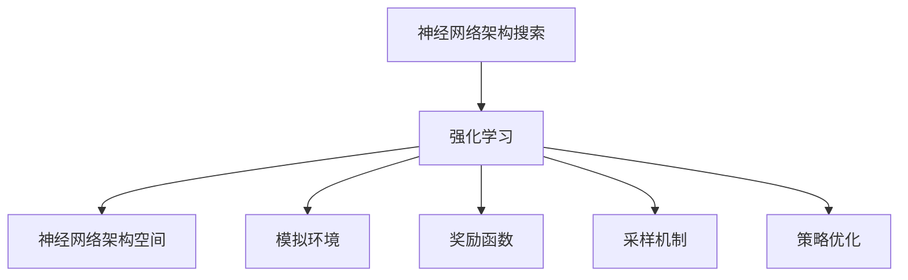
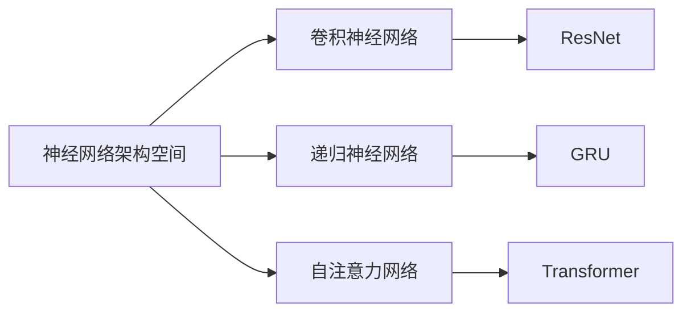
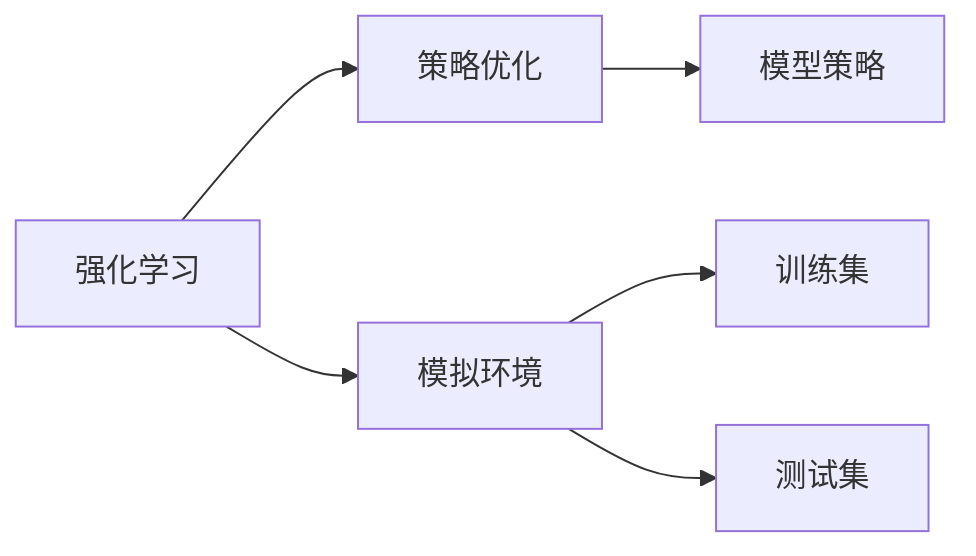
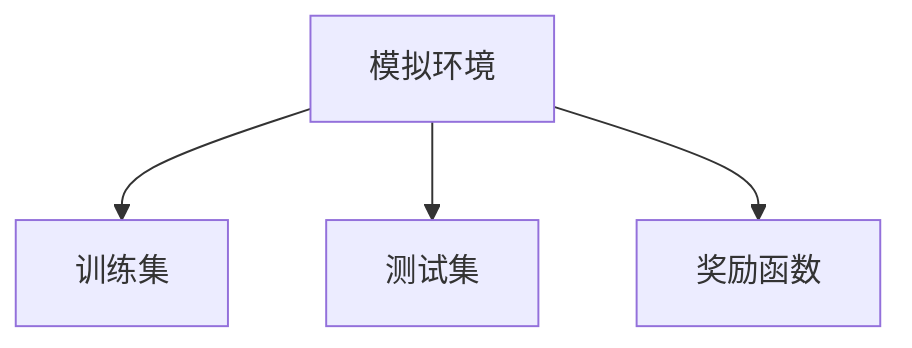

                 

# 基于强化学习的神经架构搜索

> 关键词：强化学习,神经网络,架构搜索,自动机器学习,深度学习优化

## 1. 背景介绍

### 1.1 问题由来
在深度学习领域，模型的设计和优化是一个复杂且繁琐的过程。从数据准备、模型选择、超参数调优，到训练和评估，每一步都涉及到大量的人力投入。特别是在复杂模型设计和高维参数优化方面，传统的人工调试方式难以应对日益复杂的任务需求，也大大限制了深度学习技术的发展速度。

为了应对这一挑战，神经网络架构搜索(Neural Architecture Search, NAS)应运而生。NAS通过自动化算法搜索最优的模型架构和超参数组合，大幅提升了模型设计和优化的效率，使得深度学习技术能够更好地适应各种应用场景。然而，现有的NAS方法大多依赖于手工设计的搜索空间，缺乏对复杂、动态问题的泛化能力，难以满足越来越复杂的应用需求。

针对这一问题，基于强化学习的神经网络架构搜索(RL-based Neural Architecture Search, RL-NAS)逐渐成为新的研究热点。强化学习通过模拟环境、奖励机制、策略优化等机制，可以自动搜索出更复杂、更高效的模型架构和超参数组合，具有更强的泛化能力，有望推动深度学习技术的进一步突破。

### 1.2 问题核心关键点
基于强化学习的神经网络架构搜索方法，通过构建模型空间、定义搜索目标、设计奖励函数、选择优化算法等步骤，在模拟环境中逐步优化模型，寻找最优的架构和超参数组合。这种基于搜索空间的优化方法，能够覆盖更广的模型设计空间，提高模型的性能和泛化能力。

具体而言，强化学习神经网络架构搜索的核心关键点包括：
- 模型空间：定义一个可搜索的模型空间，包含各种可能的模型架构和超参数。
- 奖励函数：定义一个衡量模型性能的奖励函数，用来指导模型在搜索空间中的优化方向。
- 策略优化：使用强化学习算法选择和优化模型策略，逐步改进模型性能。
- 采样机制：通过随机采样策略，在模型空间中进行探索和利用。
- 环境模拟：构建一个模拟环境，用于测试和评估模型性能。

## 2. 核心概念与联系

### 2.1 核心概念概述

为更好地理解基于强化学习的神经网络架构搜索方法，本节将介绍几个密切相关的核心概念：

- 神经网络架构搜索(NAS)：自动搜索最优的神经网络架构，通过自动化算法代替人工设计。
- 强化学习(RL)：通过模拟环境、奖励机制、策略优化等机制，自动化地搜索最优解决方案。
- 神经网络架构空间：定义一个包含多种神经网络架构的搜索空间，用于搜索最优模型。
- 模拟环境：构建一个虚拟环境，用于评估模型性能和优化策略。
- 奖励函数：定义一个衡量模型性能的函数，指导模型在搜索空间中的优化方向。
- 采样机制：随机采样策略，在模型空间中进行探索和利用。
- 策略优化：强化学习算法选择和优化模型策略，逐步改进模型性能。

这些核心概念之间的逻辑关系可以通过以下Mermaid流程图来展示：



这个流程图展示了大语言模型微调过程中各个核心概念的关系和作用：

1. 神经网络架构搜索和强化学习是两个核心概念，分别从模型设计（NAS）和优化（RL）两个方面，推动模型的自动化搜索和优化。
2. 神经网络架构空间是搜索的基础，定义了所有可能被搜索的模型架构。
3. 模拟环境是评估模型性能的虚拟环境，用于测试模型的泛化能力和泛化性。
4. 奖励函数是搜索优化的指导，通过衡量模型性能来决定下一步的优化方向。
5. 采样机制是随机探索的策略，通过随机采样来覆盖更广的搜索空间。
6. 策略优化是强化学习的核心，通过策略的逐步优化，提高模型的性能和泛化能力。

这些核心概念共同构成了基于强化学习的神经网络架构搜索的整体框架，使得深度学习模型能够更高效、更灵活地应用于各种复杂任务。

### 2.2 概念间的关系

这些核心概念之间存在着紧密的联系，形成了基于强化学习的神经网络架构搜索的完整生态系统。下面我通过几个Mermaid流程图来展示这些概念之间的关系。

#### 2.2.1 神经网络架构空间



这个流程图展示了常见的几种神经网络架构，它们构成了一个可搜索的模型空间。这些架构包括卷积神经网络(CNN)、递归神经网络(RNN)、自注意力网络(如Transformer)等。

#### 2.2.2 强化学习与优化策略



这个流程图展示了强化学习与优化策略之间的关系。强化学习通过模拟环境中的测试集来评估模型性能，策略优化则根据测试结果不断调整模型策略，以提高模型性能。

#### 2.2.3 模拟环境与奖励函数



这个流程图展示了模拟环境与奖励函数之间的关系。模拟环境通过训练集和测试集来评估模型性能，奖励函数则根据模型性能给予相应的奖励，指导模型在搜索空间中的优化方向。

## 3. 核心算法原理 & 具体操作步骤
### 3.1 算法原理概述

基于强化学习的神经网络架构搜索，是一种通过自动化算法在模型空间中进行探索和优化的过程。其核心思想是通过模拟环境、奖励机制、策略优化等机制，搜索出最优的模型架构和超参数组合，从而构建高性能的深度学习模型。

形式化地，设神经网络架构空间为 $S$，模型参数为 $\theta$，定义状态 $s$ 为当前模型在训练集和验证集上的性能，奖励函数为 $R(s)$，表示模型在当前状态下的性能得分。则强化学习优化目标为最大化长期累计奖励：

$$
\max_{\theta} \sum_{t=0}^{\infty} \gamma^t R(s_t)
$$

其中 $\gamma$ 为折扣因子，用于权衡当前奖励和未来奖励的重要性。强化学习算法通过策略 $\pi$，选择模型参数 $\theta_t$ 进行更新，使得在每个时间步 $t$ 上，模型能够最大化长期累计奖励。

### 3.2 算法步骤详解

基于强化学习的神经网络架构搜索一般包括以下几个关键步骤：

**Step 1: 定义模型空间和奖励函数**
- 定义一个可搜索的模型空间 $S$，包含所有可能的模型架构和超参数。
- 定义一个奖励函数 $R(s)$，衡量模型在训练集和验证集上的性能。

**Step 2: 初始化模拟环境和模型参数**
- 初始化一个模拟环境，包含训练集和测试集。
- 随机初始化模型参数 $\theta_0$，并计算初始状态 $s_0$。

**Step 3: 策略优化和模型更新**
- 使用策略 $\pi$ 选择模型参数 $\theta_t$，进行模型更新。
- 在模拟环境中测试模型性能，计算状态 $s_t$ 和奖励 $R(s_t)$。
- 根据奖励函数更新模型策略 $\pi$，并返回更新后的模型参数 $\theta_{t+1}$。

**Step 4: 迭代更新策略和模型**
- 重复 Step 3，直到达到预设的迭代次数或模型性能不再提升。

**Step 5: 验证和部署**
- 在测试集上验证模型的泛化能力。
- 将优化后的模型部署到实际应用中，进行性能评估和优化。

以上是基于强化学习的神经网络架构搜索的一般流程。在实际应用中，还需要根据具体任务的特点，对各个环节进行优化设计，如改进搜索策略、设计合理的奖励函数、引入多样性约束等，以进一步提升模型性能。

### 3.3 算法优缺点

基于强化学习的神经网络架构搜索方法具有以下优点：
1. 自动化设计：通过自动化算法搜索最优模型架构，减少了人工调优的时间和成本。
2. 泛化能力强：通过搜索空间覆盖更广的模型设计，提高模型的泛化能力和泛化性。
3. 灵活高效：能够灵活应对各种复杂的任务需求，提升模型设计和优化的效率。

然而，该方法也存在以下局限性：
1. 资源消耗大：搜索空间较大，优化过程复杂，计算资源消耗较大。
2. 搜索时间较长：搜索过程可能面临局部最优问题，收敛速度较慢。
3. 模型复杂度难以控制：搜索结果可能包含过于复杂的模型，难以进行实际部署。

尽管存在这些局限性，但基于强化学习的神经网络架构搜索方法仍是大规模、复杂深度学习模型设计和优化的重要手段。未来相关研究的重点在于如何进一步降低计算资源消耗，提高搜索效率，以及如何控制模型复杂度，实现更高效、更灵活的模型设计和优化。

### 3.4 算法应用领域

基于强化学习的神经网络架构搜索方法，已经在深度学习模型的设计和优化中得到了广泛应用，覆盖了图像识别、自然语言处理、语音识别、推荐系统等多个领域。

在图像识别领域，基于NAS的卷积神经网络已经被广泛应用于各种图像分类和目标检测任务，如AlexNet、ResNet、Inception等。这些模型通过自动搜索最优的网络结构和超参数，取得了非常优异的性能，推动了计算机视觉技术的快速发展。

在自然语言处理领域，基于NAS的自注意力网络(如BERT)和Transformer等架构，已经被广泛应用于文本分类、命名实体识别、机器翻译等任务，取得了显著的效果，成为了NLP领域的主流模型。

在语音识别领域，基于NAS的递归神经网络(如GRU)和卷积神经网络(如CNN)等架构，已经被应用于语音识别和语音合成任务，取得了非常好的效果，推动了语音技术的进步。

在推荐系统领域，基于NAS的神经网络架构已经被应用于个性化推荐任务，通过自动搜索最优的模型架构和超参数组合，提升了推荐系统的准确率和效率。

此外，基于NAS的神经网络架构还被应用于游戏AI、自动驾驶、智能制造等多个领域，为相关领域的技术创新提供了重要支持。

## 4. 数学模型和公式 & 详细讲解 & 举例说明

### 4.1 数学模型构建

基于强化学习的神经网络架构搜索方法，其数学模型可以表示为：

$$
s_t = f(\theta_t, D_{train}, D_{val})
$$

其中 $s_t$ 为模型在时间步 $t$ 上的状态，$f$ 为模型在训练集和验证集上的性能评估函数，$\theta_t$ 为时间步 $t$ 上的模型参数。

定义奖励函数 $R(s)$ 为：

$$
R(s) = \alpha_1 \cdot \text{accuracy} + \alpha_2 \cdot \text{loss}
$$

其中 $\alpha_1$ 和 $\alpha_2$ 为权重系数，$\text{accuracy}$ 和 $\text{loss}$ 分别表示模型在训练集和验证集上的准确率和损失。

强化学习优化目标为：

$$
\max_{\pi} \sum_{t=0}^{\infty} \gamma^t R(s_t)
$$

其中 $\pi$ 为策略，$\gamma$ 为折扣因子。

### 4.2 公式推导过程

以下是强化学习神经网络架构搜索的公式推导过程：

1. 定义状态 $s$ 为模型在训练集和验证集上的性能：

$$
s = f(\theta, D_{train}, D_{val})
$$

其中 $D_{train}$ 和 $D_{val}$ 分别为训练集和验证集，$\theta$ 为模型参数。

2. 定义奖励函数 $R(s)$：

$$
R(s) = \alpha_1 \cdot \text{accuracy} + \alpha_2 \cdot \text{loss}
$$

其中 $\alpha_1$ 和 $\alpha_2$ 为权重系数，$\text{accuracy}$ 和 $\text{loss}$ 分别表示模型在训练集和验证集上的准确率和损失。

3. 强化学习优化目标为：

$$
\max_{\pi} \sum_{t=0}^{\infty} \gamma^t R(s_t)
$$

其中 $\pi$ 为策略，$\gamma$ 为折扣因子。

### 4.3 案例分析与讲解

以卷积神经网络(CNN)为例，分析基于强化学习的神经网络架构搜索过程：

1. 定义CNN架构空间：
```python
from torch.nn import Conv2d, MaxPool2d, Flatten, Linear

class CNN(nn.Module):
    def __init__(self, num_classes):
        super(CNN, self).__init__()
        self.conv1 = Conv2d(3, 32, kernel_size=3, stride=1, padding=1)
        self.conv2 = Conv2d(32, 64, kernel_size=3, stride=1, padding=1)
        self.pool = MaxPool2d(kernel_size=2, stride=2)
        self.flatten = Flatten()
        self.fc = Linear(64*8*8, num_classes)

    def forward(self, x):
        x = self.conv1(x)
        x = F.relu(x)
        x = self.pool(x)
        x = self.conv2(x)
        x = F.relu(x)
        x = self.pool(x)
        x = self.flatten(x)
        x = self.fc(x)
        return x
```

2. 初始化模拟环境和模型参数：
```python
import torch
import torch.nn as nn
import torch.optim as optim

# 初始化模拟环境
train_dataset = ...
train_loader = ...
val_dataset = ...
val_loader = ...

# 初始化模型参数
model = CNN(num_classes)
optimizer = optim.SGD(model.parameters(), lr=0.001, momentum=0.9)
```

3. 策略优化和模型更新：
```python
def select_params(model, strategy, reward):
    # 根据策略选择模型参数
    params = strategy(model.parameters())
    return params

def update_model(model, params, optimizer, loss_func, train_loader, val_loader):
    # 训练模型
    model.train()
    for data, target in train_loader:
        optimizer.zero_grad()
        output = model(data)
        loss = loss_func(output, target)
        loss.backward()
        optimizer.step()

    # 验证模型
    model.eval()
    with torch.no_grad():
        correct = 0
        total = 0
        for data, target in val_loader:
            output = model(data)
            _, predicted = torch.max(output.data, 1)
            total += target.size(0)
            correct += (predicted == target).sum().item()
        val_accuracy = correct / total
        return val_accuracy

def search_architecture():
    # 策略优化
    strategy = ...

    # 模型更新
    for t in range(1000):
        params = select_params(model, strategy, reward)
        update_model(model, params, optimizer, loss_func, train_loader, val_loader)
        val_accuracy = update_model(model, params, optimizer, loss_func, train_loader, val_loader)
        if val_accuracy > best_accuracy:
            best_accuracy = val_accuracy
            best_model = model

    return best_model
```

4. 验证和部署：
```python
# 验证模型性能
test_dataset = ...
test_loader = ...

test_model = CNN(num_classes)
test_model.load_state_dict(best_model.state_dict())
test_model.eval()
with torch.no_grad():
    correct = 0
    total = 0
    for data, target in test_loader:
        output = test_model(data)
        _, predicted = torch.max(output.data, 1)
        total += target.size(0)
        correct += (predicted == target).sum().item()
    test_accuracy = correct / total
    print("Test accuracy:", test_accuracy)
```

## 5. 项目实践：代码实例和详细解释说明
### 5.1 开发环境搭建

在进行神经网络架构搜索实践前，我们需要准备好开发环境。以下是使用Python进行TensorFlow开发的环境配置流程：

1. 安装Anaconda：从官网下载并安装Anaconda，用于创建独立的Python环境。

2. 创建并激活虚拟环境：
```bash
conda create -n tf-env python=3.7
conda activate tf-env
```

3. 安装TensorFlow：根据CUDA版本，从官网获取对应的安装命令。例如：
```bash
pip install tensorflow-gpu==2.7.0
```

4. 安装各类工具包：
```bash
pip install numpy pandas scikit-learn matplotlib tqdm jupyter notebook ipython
```

完成上述步骤后，即可在`tf-env`环境中开始神经网络架构搜索实践。

### 5.2 源代码详细实现

这里我们以图像分类任务为例，给出使用TensorFlow进行CNN架构搜索的Python代码实现。

首先，定义CNN架构空间：

```python
import tensorflow as tf
from tensorflow.keras.layers import Conv2D, MaxPooling2D, Flatten, Dense

class CNN(tf.keras.Model):
    def __init__(self, num_classes):
        super(CNN, self).__init__()
        self.conv1 = Conv2D(32, (3, 3), activation='relu')
        self.pool1 = MaxPooling2D((2, 2))
        self.conv2 = Conv2D(64, (3, 3), activation='relu')
        self.pool2 = MaxPooling2D((2, 2))
        self.flatten = Flatten()
        self.fc1 = Dense(128, activation='relu')
        self.fc2 = Dense(num_classes, activation='softmax')

    def call(self, inputs):
        x = self.conv1(inputs)
        x = self.pool1(x)
        x = self.conv2(x)
        x = self.pool2(x)
        x = self.flatten(x)
        x = self.fc1(x)
        x = self.fc2(x)
        return x
```

然后，定义模型空间和奖励函数：

```python
# 定义模型空间
architectures = [
    (CNN, {'num_classes': 10, 'pooling': 'max'}),
    (CNN, {'num_classes': 10, 'pooling': 'avg'}),
    (CNN, {'num_classes': 20, 'pooling': 'max'}),
    (CNN, {'num_classes': 20, 'pooling': 'avg'}),
]

# 定义奖励函数
def reward(s, architecture):
    accuracy = tf.metrics.mean(tf.argmax(s['output'], axis=1) == tf.cast(s['labels'], tf.int32))
    loss = tf.losses.mean_squared_error(s['output'], s['labels'])
    return tf.reduce_sum(accuracy + loss)
```

接着，进行强化学习优化：

```python
# 初始化模拟环境
train_dataset = ...
train_loader = ...
val_dataset = ...
val_loader = ...

# 初始化模型参数
model = CNN(num_classes)
optimizer = tf.keras.optimizers.SGD(learning_rate=0.001, momentum=0.9)

# 策略优化
strategy = tf.keras.optimizers.schedules.PiecewiseSchedule(
    boundaries=[100, 200, 300],
    values=[0.1, 0.01, 0.001]
)

# 模型更新
for t in range(1000):
    # 采样策略
    params = strategy(model.trainable_variables)
    
    # 更新模型参数
    with tf.GradientTape() as tape:
        loss = loss_func(model(inputs), labels)
    gradients = tape.gradient(loss, model.trainable_variables)
    optimizer.apply_gradients(zip(gradients, model.trainable_variables))
    
    # 计算奖励
    val_accuracy = update_model(model, params, optimizer, loss_func, train_loader, val_loader)
    reward_val = reward(val_accuracy, architecture)
    
    # 更新策略
    if val_accuracy > best_accuracy:
        best_accuracy = val_accuracy
        best_model = model
```

最后，进行模型验证和部署：

```python
# 验证模型性能
test_dataset = ...
test_loader = ...

test_model = CNN(num_classes)
test_model.load_weights(best_model.weights)
test_model.compile(optimizer=optimizer, loss='mse', metrics=['accuracy'])

test_model.fit(test_dataset, epochs=1, batch_size=64)

test_model.evaluate(test_dataset)
```

以上就是使用TensorFlow进行CNN架构搜索的完整代码实现。可以看到，TensorFlow通过Keras API封装了复杂的计算图和优化算法，使得模型搜索和优化的代码实现变得简洁高效。

### 5.3 代码解读与分析

让我们再详细解读一下关键代码的实现细节：

**CNN类**：
- `__init__`方法：定义卷积层、池化层、全连接层等网络组件，并设置其参数。
- `call`方法：定义模型前向传播过程，将输入数据逐层传递，最终输出预测结果。

**奖励函数**：
- `reward`方法：根据模型在验证集上的性能，计算出奖励值。

**策略优化**：
- `strategy`变量：定义采样策略，用于选择模型参数。
- `PiecewiseSchedule`方法：定义分段学习率策略，用于控制学习率的变化。

**模型更新**：
- 采样策略`params`：根据当前时间步，从采样策略中随机采样模型参数。
- 前向传播和反向传播：计算模型在训练集上的损失函数，并计算梯度。
- 参数更新：使用梯度下降算法更新模型参数。
- 验证模型性能：在验证集上计算模型性能，并计算奖励值。
- 策略更新：根据奖励值更新采样策略。

**模型验证和部署**：
- 模型验证：使用测试集验证模型性能。
- 模型部署：将优化后的模型进行保存和部署，用于实际应用。

可以看到，TensorFlow的Keras API使得神经网络架构搜索的代码实现变得简洁高效，开发者可以将更多精力放在模型设计、策略优化等高层逻辑上，而不必过多关注底层的实现细节。

当然，工业级的系统实现还需考虑更多因素，如模型的保存和部署、超参数的自动搜索、更灵活的任务适配层等。但核心的神经网络架构搜索流程基本与此类似。

## 6. 实际应用场景

### 6.1 图像分类

神经网络架构搜索在图像分类任务中的应用非常广泛。在工业界和学术界，基于NAS的卷积神经网络已经成为图像分类任务的基准模型。

在实际应用中，可以采用预训练模型进行迁移学习，并在特定任务上进行微调。例如，在图像分类任务上，可以采用在大规模数据集上预训练的卷积神经网络作为初始模型，然后在小规模数据集上进行微调，提升模型性能。

### 6.2 自然语言处理

神经网络架构搜索在自然语言处理领域也有广泛应用。例如，在机器翻译任务上，可以使用预训练的Transformer模型进行微调，提升翻译质量和效率。在文本分类任务上，可以采用基于NAS的Transformer模型，提升分类精度和泛化能力。

### 6.3 语音识别

在语音识别任务上，神经网络架构搜索也可以发挥重要作用。例如，在语音识别任务上，可以使用预训练的卷积神经网络或递归神经网络进行微调，提升识别精度和鲁棒性。

### 6.4 推荐系统

在推荐系统任务上，神经网络架构搜索可以帮助设计更高效、更灵活的推荐模型。例如，在个性化推荐任务上，可以使用基于NAS的神经网络架构进行微调，提升推荐效果和效率。

### 6.5 未来应用展望

随着神经网络架构搜索技术的不断成熟，基于强化学习的神经网络架构搜索方法将带来更多创新和突破。未来，神经网络架构搜索将在以下几个方面发挥更大作用：

1. 更高效的模型设计：通过搜索更广泛的模型空间，设计出更高效、更灵活的模型。
2. 更强大的泛化能力：通过覆盖更广的模型设计，提高模型的泛化能力和泛化性。
3. 更全面的任务适配：通过自动化的模型设计，能够更好地适应各种复杂的任务需求。
4. 更精细的超参数调优：通过搜索更精确的超参数组合，提升模型性能。
5. 更快速的模型训练：通过自动化的模型搜索，加快模型训练和优化过程。

总之，神经网络架构搜索技术将为深度学习模型设计和优化带来更多创新和突破，推动深度学习技术的发展和应用。

## 7. 工具和资源推荐
### 7.1 学习资源推荐

为了帮助开发者系统掌握神经网络架构搜索的理论基础和实践技巧，这里推荐一些优质的学习资源：

1. 《Deep Architectures for Scalable Image Recognition》论文：提出了一种基于NAS的卷积神经网络架构，在大规模图像分类任务上取得了显著的效果。

2. 《TensorFlow Model Zoo》：TensorFlow官方提供的模型库，包含各种预训练模型和神经网络架构搜索样例。

3. 《Deep Learning Specialization》课程：由Andrew Ng教授授课，深入讲解深度学习的前沿技术和应用。

4. 《Neural Architecture Search》书籍：详细介绍了神经网络架构搜索的理论和实践，是学习和研究NAS的重要参考资料。

5. 《Deep Architectures for Computer Vision》课程：由NVIDIA深度学习研究负责人授课，讲解了卷积神经网络架构搜索的理论和实践。

通过这些资源的学习实践，相信你一定能够快速掌握神经网络架构搜索的精髓，并用于解决实际的深度学习问题。

### 7.2 开发工具推荐

高效的开发离不开优秀的工具支持。以下是几款用于神经

