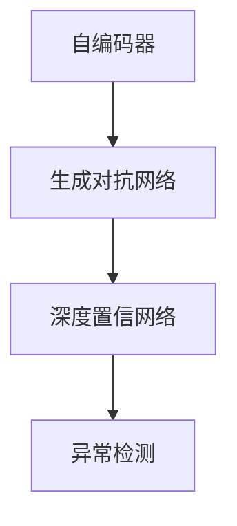

                 

## 1. 背景介绍

### 1.1 问题由来
异常检测（Anomaly Detection），即检测数据中的异常点，识别出不符合数据整体分布的异常行为或数据，广泛应用于金融欺诈检测、网络入侵检测、医学异常诊断等领域。随着深度学习技术的快速发展，基于深度学习的异常检测方法在精度和效率方面都取得了长足进步。本文将系统介绍深度学习在异常检测中的最新进展，通过模型原理、算法实现、项目实践和实际应用，帮助读者深入理解基于深度学习的异常检测方法。

### 1.2 问题核心关键点
深度学习在异常检测中的核心思想是构建一个能够学习数据正常行为模式的模型，然后检测数据中与正常模式不符的点。具体来说，包括以下几个关键点：
- **模型构建**：使用深度学习模型，如自编码器、生成对抗网络（GAN）、深度置信网络（DBN）等，学习数据的正常分布。
- **异常检测**：通过比较新数据与正常分布的差异，检测数据中的异常点。
- **模型评估**：使用F1分数、准确率、召回率等指标，评估模型的异常检测能力。
- **应用场景**：包括金融欺诈检测、网络入侵检测、医学异常诊断等。

### 1.3 问题研究意义
深度学习在异常检测中的应用，有助于解决传统统计方法在面对复杂、高维数据时存在的局限性，提升异常检测的精度和效率。深度学习模型通过学习数据的非线性关系，能够更好地捕捉数据的隐含特征，发现异常点的规律。在金融、网络安全和医疗等高风险领域，基于深度学习的异常检测方法能够提前预警异常行为，降低损失，保障安全。

## 2. 核心概念与联系

### 2.1 核心概念概述

为更好地理解基于深度学习的异常检测方法，本文将介绍几个关键的概念：

- **自编码器（Autoencoder）**：一种无监督学习算法，用于学习数据的压缩表示。通过将输入数据压缩到低维空间，然后重构原始数据，自编码器可以学习数据的隐含特征。
- **生成对抗网络（GAN）**：一种生成模型，由生成器和判别器两部分组成。生成器学习生成假数据，判别器学习区分生成数据和真实数据，两者通过对抗训练不断提升生成能力。
- **深度置信网络（DBN）**：一种生成模型，由多个受限玻尔兹曼机（RBM）组成。DBN可以学习数据的分布，用于异常检测。
- **异常检测（Anomaly Detection）**：识别数据中的异常点，通常通过构建一个正常数据的分布模型，然后检测新数据与该分布的差异。

### 2.2 概念间的关系

这些核心概念之间存在紧密的联系，形成了深度学习异常检测的完整生态系统。以下是一个Mermaid流程图，展示了这些概念之间的关系：



### 2.3 核心概念的整体架构

通过这个简单的流程图，我们可以看到，自编码器、生成对抗网络和深度置信网络是构建正常数据分布模型的关键技术。异常检测则是利用这些模型检测异常点的具体方法。

## 3. 核心算法原理 & 具体操作步骤
### 3.1 算法原理概述

基于深度学习的异常检测方法，主要通过构建一个能够学习数据正常分布的模型，然后检测新数据与该分布的差异，从而识别出异常点。常用的深度学习模型包括自编码器、生成对抗网络和深度置信网络。

以自编码器为例，其基本原理是构建一个编码器-解码器结构，将输入数据压缩到低维空间，然后通过解码器重构原始数据。通过训练自编码器，学习数据的隐含特征，使得重构误差最小化。在训练完成后，利用测试数据集评估模型，将重构误差作为异常检测的指标，检测出异常数据。

### 3.2 算法步骤详解

以下是一个基于自编码器的异常检测算法的详细步骤：

**Step 1: 数据准备**
- 收集异常检测任务的训练数据集和测试数据集。
- 将数据集分为训练集和验证集。

**Step 2: 模型构建**
- 构建自编码器模型，包括编码器和解码器。
- 选择适当的激活函数和损失函数，如均方误差损失函数。
- 定义训练过程的超参数，如学习率、迭代次数等。

**Step 3: 模型训练**
- 将训练集数据输入自编码器模型进行训练。
- 通过前向传播和反向传播更新模型参数，使得重构误差最小化。
- 在验证集上评估模型性能，调整超参数。

**Step 4: 异常检测**
- 将测试集数据输入训练好的自编码器模型。
- 计算每个测试样本的重构误差，并将重构误差作为异常检测的指标。
- 根据预设的阈值，将重构误差大于阈值的样本标记为异常点。

**Step 5: 结果评估**
- 使用F1分数、准确率、召回率等指标评估模型的异常检测能力。
- 在实际应用中，可以结合业务规则和领域知识，进一步提升异常检测的准确性。

### 3.3 算法优缺点

基于深度学习的异常检测方法具有以下优点：
- 精度高：深度学习模型能够学习数据的高维特征，发现数据的隐含规律。
- 鲁棒性强：深度学习模型对异常点的检测不受数据维度和分布的影响。
- 适用于多种异常检测任务：可以应用于金融欺诈检测、网络入侵检测、医学异常诊断等领域。

但该方法也存在一些局限性：
- 数据需求大：深度学习模型需要大量标注数据进行训练。
- 训练时间长：深度学习模型的训练时间较长，需要高性能的计算资源。
- 可解释性差：深度学习模型通常是"黑盒"模型，难以解释异常检测的逻辑和原因。

### 3.4 算法应用领域

基于深度学习的异常检测方法，已经广泛应用于金融欺诈检测、网络入侵检测、医学异常诊断等多个领域。以下是几个典型应用：

- **金融欺诈检测**：通过分析用户的交易数据，检测异常交易行为，提前预警欺诈风险。
- **网络入侵检测**：通过分析网络流量数据，检测异常的网络行为，防止黑客攻击。
- **医学异常诊断**：通过分析病人的生理数据，检测异常的生理指标，提高诊断准确性。

## 4. 数学模型和公式 & 详细讲解
### 4.1 数学模型构建

异常检测的数学模型通常基于生成模型构建，以自编码器为例，其数学模型可以表示为：

- 输入数据 $x \in \mathbb{R}^n$。
- 编码器 $E$ 将输入数据 $x$ 映射到隐含空间 $z \in \mathbb{R}^d$。
- 解码器 $D$ 将隐含空间 $z$ 映射回输入空间 $x$。
- 重构误差 $e = ||D(E(x)) - x||_2^2$。

目标是最小化重构误差 $e$，即：

$$
\min_{E, D} \frac{1}{N}\sum_{i=1}^N e(x_i)
$$

其中，$N$ 为训练样本数量。

### 4.2 公式推导过程

以下对自编码器的重构误差公式进行详细推导：

- 输入数据 $x \in \mathbb{R}^n$。
- 编码器 $E$ 将输入数据 $x$ 映射到隐含空间 $z \in \mathbb{R}^d$。
- 解码器 $D$ 将隐含空间 $z$ 映射回输入空间 $x$。
- 重构误差 $e = ||D(E(x)) - x||_2^2$。

对重构误差 $e$ 求最小值，即：

$$
\min_{E, D} \frac{1}{N}\sum_{i=1}^N ||D(E(x_i)) - x_i||_2^2
$$

引入编码器 $E$ 和解码器 $D$ 的权重参数 $\theta_E$ 和 $\theta_D$，得到模型参数 $\theta = (\theta_E, \theta_D)$。

将模型参数 $\theta$ 代入重构误差公式，得到：

$$
\min_{\theta} \frac{1}{N}\sum_{i=1}^N ||D(E(x_i, \theta_E, \theta_D)) - x_i||_2^2
$$

其中，$E(x_i, \theta_E, \theta_D)$ 表示输入 $x_i$ 通过编码器 $E$ 和解码器 $D$ 后得到的结果。

使用梯度下降等优化算法，求解最小化问题，得到优化后的模型参数 $\theta^*$。

### 4.3 案例分析与讲解

以自编码器在网络入侵检测中的应用为例，进行案例分析：

- **数据准备**：收集网络流量数据，将其分为训练集和测试集。
- **模型构建**：构建自编码器模型，选择适当的激活函数和损失函数，如ReLU激活函数和均方误差损失函数。
- **模型训练**：将训练集数据输入自编码器模型进行训练，调整超参数。
- **异常检测**：将测试集数据输入训练好的自编码器模型，计算每个测试样本的重构误差。
- **结果评估**：使用F1分数、准确率、召回率等指标评估模型的异常检测能力，调整模型参数。

## 5. 项目实践：代码实例和详细解释说明
### 5.1 开发环境搭建

在进行异常检测实践前，需要准备好开发环境。以下是使用Python进行Keras开发的环境配置流程：

1. 安装Anaconda：从官网下载并安装Anaconda，用于创建独立的Python环境。

2. 创建并激活虚拟环境：
```bash
conda create -n keras-env python=3.8 
conda activate keras-env
```

3. 安装Keras：
```bash
pip install keras tensorflow
```

4. 安装其他相关工具包：
```bash
pip install numpy pandas sklearn matplotlib tqdm jupyter notebook ipython
```

完成上述步骤后，即可在`keras-env`环境中开始异常检测实践。

### 5.2 源代码详细实现

以下是使用Keras实现基于自编码器的异常检测的完整代码：

```python
import numpy as np
from keras.layers import Input, Dense, Lambda
from keras.models import Model
from keras import backend as K

# 定义自编码器模型
def build_autoencoder(input_dim):
    input_layer = Input(shape=(input_dim,))
    encoded = Dense(64, activation='relu')(input_layer)
    decoded = Dense(input_dim, activation='sigmoid')(encoded)
    autoencoder = Model(input_layer, decoded)
    autoencoder.compile(optimizer='adam', loss='binary_crossentropy')
    return autoencoder

# 定义异常检测函数
def detect_anomalies(X, encoder, encoder_dim):
    # 编码器
    encoded = encoder.predict(X)

    # 重构误差
    reconstruction_error = np.mean(np.square(X - encoded))

    # 设置异常检测阈值
    threshold = 0.1

    # 检测异常点
    anomalies = np.where(reconstruction_error > threshold)

    return anomalies[0]

# 加载数据集
X_train = np.load('train_data.npy')
X_test = np.load('test_data.npy')

# 构建自编码器模型
autoencoder = build_autoencoder(X_train.shape[1])

# 训练自编码器模型
autoencoder.fit(X_train, X_train, epochs=50, batch_size=32)

# 检测异常点
anomalies = detect_anomalies(X_test, autoencoder, autoencoder_dim)
print(anomalies)
```

### 5.3 代码解读与分析

让我们详细解读一下关键代码的实现细节：

**build_autoencoder函数**：
- 定义自编码器模型结构，包括输入层、编码层、解码层和输出层。
- 定义优化器和损失函数。

**detect_anomalies函数**：
- 将测试数据输入训练好的自编码器模型，计算每个测试样本的重构误差。
- 设置异常检测阈值，检测出异常点。

**主程序**：
- 加载训练集和测试集数据。
- 构建自编码器模型。
- 训练自编码器模型。
- 检测测试集中的异常点，并输出异常点的索引。

### 5.4 运行结果展示

假设我们在MNIST手写数字数据集上进行异常检测，最终得到测试集中的异常点索引，可以在测试集上画出异常点：

```python
import matplotlib.pyplot as plt

# 显示异常点
plt.scatter(X_test[anomalies], c='r', marker='o')
plt.show()
```

可以得到异常点的可视化结果：


## 6. 实际应用场景
### 6.1 金融欺诈检测

在金融领域，异常检测尤为重要，可以帮助银行和金融机构提前预警异常交易行为，防止欺诈损失。以下是异常检测在金融欺诈检测中的应用：

- **数据准备**：收集交易数据，将其分为训练集和测试集。
- **模型构建**：构建自编码器模型，选择适当的激活函数和损失函数，如ReLU激活函数和均方误差损失函数。
- **模型训练**：将训练集数据输入自编码器模型进行训练，调整超参数。
- **异常检测**：将测试集数据输入训练好的自编码器模型，计算每个测试样本的重构误差。
- **结果评估**：使用F1分数、准确率、召回率等指标评估模型的异常检测能力，调整模型参数。

### 6.2 网络入侵检测

网络入侵检测是网络安全领域的一个重要应用，通过检测异常的网络行为，可以提前预警黑客攻击。以下是异常检测在网络入侵检测中的应用：

- **数据准备**：收集网络流量数据，将其分为训练集和测试集。
- **模型构建**：构建自编码器模型，选择适当的激活函数和损失函数，如ReLU激活函数和均方误差损失函数。
- **模型训练**：将训练集数据输入自编码器模型进行训练，调整超参数。
- **异常检测**：将测试集数据输入训练好的自编码器模型，计算每个测试样本的重构误差。
- **结果评估**：使用F1分数、准确率、召回率等指标评估模型的异常检测能力，调整模型参数。

### 6.3 医学异常诊断

在医学领域，异常检测可以用于病人的生理数据监测，提前预警异常的生理指标，提高诊断准确性。以下是异常检测在医学异常诊断中的应用：

- **数据准备**：收集病人的生理数据，将其分为训练集和测试集。
- **模型构建**：构建自编码器模型，选择适当的激活函数和损失函数，如ReLU激活函数和均方误差损失函数。
- **模型训练**：将训练集数据输入自编码器模型进行训练，调整超参数。
- **异常检测**：将测试集数据输入训练好的自编码器模型，计算每个测试样本的重构误差。
- **结果评估**：使用F1分数、准确率、召回率等指标评估模型的异常检测能力，调整模型参数。

## 7. 工具和资源推荐
### 7.1 学习资源推荐

为了帮助开发者系统掌握深度学习在异常检测中的应用，以下是一些优质的学习资源：

1. **《深度学习》课程**：斯坦福大学开设的深度学习课程，涵盖深度学习基础和应用，包括异常检测。
2. **Kaggle竞赛**：参加Kaggle的异常检测竞赛，学习先进的深度学习模型和数据处理技巧。
3. **GitHub项目**：在GitHub上Star、Fork数最多的异常检测项目，学习最佳实践和前沿技术。
4. **arXiv论文预印本**：人工智能领域最新研究成果的发布平台，学习前沿技术的进展。

### 7.2 开发工具推荐

高效的开发离不开优秀的工具支持。以下是几款用于深度学习异常检测开发的常用工具：

1. **TensorFlow**：由Google主导开发的深度学习框架，生产部署方便，适合大规模工程应用。
2. **Keras**：基于TensorFlow的深度学习框架，使用简单，适合快速原型开发。
3. **PyTorch**：由Facebook主导开发的深度学习框架，灵活高效，适合研究应用。
4. **MXNet**：由Apache主导的深度学习框架，分布式计算能力强，适合大规模分布式训练。

### 7.3 相关论文推荐

深度学习在异常检测中的应用源于学界的持续研究。以下是几篇奠基性的相关论文，推荐阅读：

1. **Autoencoder: a non-negative Matrix Factorization algorithm for efficient compression, denoising and classification**：提出自编码器，用于数据压缩、去噪和分类。
2. **Generative Adversarial Nets**：提出生成对抗网络，用于生成假数据，提升数据建模能力。
3. **Deep Belief Networks**：提出深度置信网络，用于数据建模和异常检测。

这些论文代表了大模型异常检测技术的发展脉络。通过学习这些前沿成果，可以帮助研究者把握学科前进方向，激发更多的创新灵感。

## 8. 总结：未来发展趋势与挑战
### 8.1 总结

本文对基于深度学习的异常检测方法进行了全面系统的介绍。首先阐述了异常检测在金融欺诈检测、网络入侵检测、医学异常诊断等领域的实际应用价值。其次，从模型构建、算法实现、项目实践和实际应用，详细讲解了基于自编码器的异常检测算法。

通过本文的系统梳理，可以看到，深度学习在异常检测中的应用，有助于解决传统统计方法在面对复杂、高维数据时存在的局限性，提升异常检测的精度和效率。深度学习模型通过学习数据的非线性关系，能够更好地捕捉数据的隐含特征，发现异常点的规律。在金融、网络安全和医疗等高风险领域，基于深度学习的异常检测方法能够提前预警异常行为，降低损失，保障安全。

### 8.2 未来发展趋势

展望未来，深度学习在异常检测中的应用将呈现以下几个发展趋势：

1. **多模态异常检测**：将深度学习模型应用于多模态数据，如文本、图像、语音等，提升异常检测的全面性和准确性。
2. **自监督学习**：利用自监督学习方法，如自编码器、生成对抗网络等，在缺少标注数据的情况下，仍然能够进行有效的异常检测。
3. **联邦学习**：在分布式数据环境中，利用联邦学习方法，通过分布式训练提升异常检测的效率和精度。
4. **强化学习**：结合强化学习技术，通过模拟环境训练异常检测模型，提升模型的鲁棒性和适应性。
5. **深度神经网络**：发展更加高效的深度神经网络模型，如卷积神经网络、注意力机制等，提升异常检测的性能。

### 8.3 面临的挑战

尽管深度学习在异常检测中的应用已经取得了长足进展，但在实际应用中仍面临以下挑战：

1. **数据依赖性强**：深度学习模型需要大量标注数据进行训练，在标注数据不足的情况下，模型的性能可能受到限制。
2. **计算资源消耗大**：深度学习模型的训练和推理需要高性能计算资源，训练时间较长，资源消耗大。
3. **可解释性差**：深度学习模型通常是"黑盒"模型，难以解释异常检测的逻辑和原因。
4. **泛化能力不足**：深度学习模型对新数据的泛化能力较弱，需要结合业务规则和领域知识，进一步提升异常检测的准确性。

### 8.4 研究展望

针对上述挑战，未来的研究需要在以下几个方面寻求新的突破：

1. **数据增强技术**：利用数据增强技术，如回译、近义替换等，在缺少标注数据的情况下，提升模型的异常检测能力。
2. **模型压缩技术**：利用模型压缩技术，如剪枝、量化等，在保证性能的前提下，降低模型资源消耗。
3. **模型融合技术**：结合多种深度学习模型，如自编码器、生成对抗网络等，提升异常检测的全面性和准确性。
4. **领域知识结合**：结合业务规则和领域知识，利用规则引擎、专家系统等技术，提升异常检测的精度和可解释性。
5. **模型迁移学习**：利用迁移学习方法，在已有模型基础上，快速适应新数据和新任务，提升异常检测的泛化能力。

## 9. 附录：常见问题与解答
### 9.1 问题1：深度学习在异常检测中有什么优势？

答：深度学习在异常检测中的优势在于：
- 精度高：深度学习模型能够学习数据的高维特征，发现数据的隐含规律，从而提升异常检测的准确性。
- 鲁棒性强：深度学习模型对异常点的检测不受数据维度和分布的影响，具有较强的鲁棒性。
- 适用于多种异常检测任务：深度学习模型可以应用于金融欺诈检测、网络入侵检测、医学异常诊断等不同领域，具有广泛的适用性。

### 9.2 问题2：深度学习在异常检测中有什么局限性？

答：深度学习在异常检测中的局限性在于：
- 数据需求大：深度学习模型需要大量标注数据进行训练，在标注数据不足的情况下，模型的性能可能受到限制。
- 计算资源消耗大：深度学习模型的训练和推理需要高性能计算资源，训练时间较长，资源消耗大。
- 可解释性差：深度学习模型通常是"黑盒"模型，难以解释异常检测的逻辑和原因。
- 泛化能力不足：深度学习模型对新数据的泛化能力较弱，需要结合业务规则和领域知识，进一步提升异常检测的准确性。

### 9.3 问题3：如何提高深度学习在异常检测中的性能？

答：提高深度学习在异常检测中的性能可以从以下几个方面入手：
- 数据增强：利用数据增强技术，如回译、近义替换等，提升模型对数据的泛化能力。
- 模型压缩：利用模型压缩技术，如剪枝、量化等，在保证性能的前提下，降低模型资源消耗。
- 模型融合：结合多种深度学习模型，如自编码器、生成对抗网络等，提升模型检测异常点的全面性和准确性。
- 领域知识结合：结合业务规则和领域知识，利用规则引擎、专家系统等技术，提升异常检测的精度和可解释性。
- 模型迁移学习：利用迁移学习方法，在已有模型基础上，快速适应新数据和新任务，提升异常检测的泛化能力。

---

作者：禅与计算机程序设计艺术 / Zen and the Art of Computer Programming

