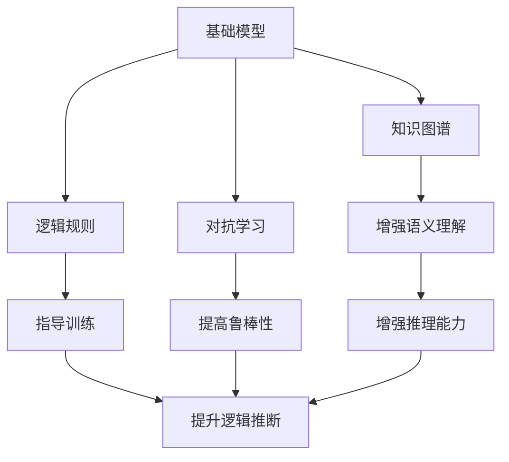

                 

# 基础模型与其他技术的结合

## 1. 背景介绍

近年来，深度学习技术迅速发展，特别是基于Transformer架构的语言模型在自然语言处理(NLP)领域取得了显著进展。以BERT、GPT-3为代表的预训练语言模型通过大规模无标签文本数据的自监督学习，获得了丰富的语言知识，并在各种下游任务上展现了出色的性能。然而，这些模型通常需要巨量计算资源进行训练，同时对于特定任务，往往需要额外的标注数据进行微调，这不仅增加了成本，而且可能受到标注质量的影响。

为了克服这些挑战，研究人员提出了多种结合基础模型与其他技术的方案，例如知识图谱、逻辑规则、对抗学习等。这些技术不仅能够提升模型的性能，还能增强模型的泛化能力和鲁棒性。本文将深入探讨基础模型与其他技术的结合，包括基础模型的核心概念、具体结合方法、应用场景及未来发展趋势，帮助读者更好地理解和应用这些技术。

## 2. 核心概念与联系

### 2.1 核心概念概述

- **基础模型(Base Model)**：以BERT、GPT-3为代表的大型预训练语言模型，通过大规模无标签文本数据的自监督学习，学习到丰富的语言表示。
- **知识图谱(Knowledge Graph)**：由实体节点和关系边组成的网络结构，用于存储和表示实体之间的关系。
- **逻辑规则(Logical Rules)**：用于指导推理和决策的规则系统，通常基于逻辑公式和推理机实现。
- **对抗学习(Adversarial Learning)**：通过引入对抗样本训练模型，提高模型的鲁棒性和泛化能力。

这些概念之间存在紧密的联系，可以互相结合，以提升模型的性能和应用能力。例如，知识图谱可以与基础模型结合，增强模型的语义理解和推理能力；逻辑规则可以指导基础模型的训练，提升模型的逻辑推断能力；对抗学习可以增强模型的鲁棒性，防止过拟合和泛化能力不足。

### 2.2 核心概念间的联系

这些核心概念之间的联系可以通过以下Mermaid流程图来展示：



这个流程图展示了核心概念之间的联系：

1. 基础模型通过知识图谱获取更丰富的语义信息，增强语义理解能力。
2. 逻辑规则可以指导基础模型的训练过程，提升模型的逻辑推断能力。
3. 对抗学习通过引入对抗样本，提高模型的鲁棒性和泛化能力。
4. 知识图谱和逻辑规则的结合可以增强推理能力，提升模型的决策能力。
5. 对抗学习与基础模型的结合可以进一步提高模型的鲁棒性。

## 3. 核心算法原理 & 具体操作步骤

### 3.1 算法原理概述

基础模型与其他技术的结合，本质上是通过将外部信息（如知识图谱、逻辑规则、对抗样本等）与基础模型的训练和推理过程相结合，以提升模型的性能和鲁棒性。常见的结合方法包括：

- **知识图谱增强**：将知识图谱中的实体关系融入基础模型的训练和推理过程中。
- **逻辑规则指导**：使用逻辑规则约束模型的训练过程，使其符合逻辑推理的要求。
- **对抗样本训练**：通过引入对抗样本训练模型，提高模型的鲁棒性和泛化能力。

### 3.2 算法步骤详解

以知识图谱增强为例，结合流程如下：

1. **数据准备**：将知识图谱中的实体关系转换为可嵌入到基础模型中的形式。例如，可以将知识图谱中的边转换为向量表示，作为模型的输入。
2. **模型训练**：将知识图谱中的向量嵌入到基础模型中，与文本输入一起进行训练。在训练过程中，模型会学习到文本和知识图谱的联合表示。
3. **推理应用**：在推理阶段，将输入文本映射到知识图谱中的实体关系上，以增强模型的语义理解和推理能力。

### 3.3 算法优缺点

基础模型与其他技术的结合具有以下优点：

- **提升性能**：结合知识图谱和逻辑规则，可以显著提升模型的语义理解能力和推理能力，增强模型的决策能力。
- **提高鲁棒性**：通过对抗学习，可以提高模型的鲁棒性和泛化能力，避免过拟合。
- **增强可解释性**：结合知识图谱和逻辑规则，可以提供模型的推理路径和决策依据，增强模型的可解释性。

然而，这些方法也存在一些缺点：

- **计算资源消耗大**：结合知识图谱和逻辑规则，需要额外的计算资源进行训练和推理，可能增加计算成本。
- **数据表示复杂**：知识图谱和逻辑规则通常需要复杂的表示方式，增加了数据的表示难度。
- **模型复杂度高**：结合多种技术后，模型的复杂度增加，可能导致训练和推理时间变长。

### 3.4 算法应用领域

基础模型与其他技术的结合广泛应用于以下几个领域：

- **问答系统(Question Answering, QA)**：通过结合知识图谱和逻辑规则，问答系统可以更好地理解和推理用户的问题，并提供准确的答案。
- **信息抽取(Information Extraction, IE)**：结合知识图谱和逻辑规则，可以更好地从文本中抽取实体关系，提升信息抽取的准确性。
- **文本生成(Text Generation)**：结合对抗学习，可以生成更加多样和高质量的文本，提升文本生成的效果。
- **推荐系统(Recommender System)**：结合逻辑规则和知识图谱，可以更好地理解用户需求和物品之间的关系，提升推荐系统的精度和个性化程度。

## 4. 数学模型和公式 & 详细讲解 & 举例说明

### 4.1 数学模型构建

以知识图谱增强为例，假设知识图谱中的实体关系为 $R$，每个实体的向量表示为 $V$，模型的输入为 $X$，输出为 $Y$。则知识图谱增强的数学模型可以表示为：

$$
Y = f(X, V \times R)
$$

其中，$f$ 表示基础模型的推理函数，$\times$ 表示向量乘法，$R$ 表示知识图谱中的关系矩阵。

### 4.2 公式推导过程

在知识图谱增强中，模型的损失函数可以表示为：

$$
\mathcal{L} = -\frac{1}{N}\sum_{i=1}^N \log P(Y_i|X_i, V \times R)
$$

其中，$P(Y_i|X_i, V \times R)$ 表示在给定输入 $X_i$ 和知识图谱增强后的向量表示 $V \times R$ 的情况下，模型预测输出 $Y_i$ 的概率。

### 4.3 案例分析与讲解

假设在问答系统中，我们需要回答用户的问题。我们将知识图谱中的实体关系 $R$ 转换为向量表示，并将其与输入文本 $X$ 一起输入到模型中进行推理。通过结合知识图谱和逻辑规则，模型可以更好地理解用户的问题，并从知识图谱中抽取相关信息，生成准确的答案。

## 5. 项目实践：代码实例和详细解释说明

### 5.1 开发环境搭建

在进行项目实践前，我们需要准备好开发环境。以下是使用Python进行PyTorch开发的环境配置流程：

1. 安装Anaconda：从官网下载并安装Anaconda，用于创建独立的Python环境。

2. 创建并激活虚拟环境：
```bash
conda create -n pytorch-env python=3.8 
conda activate pytorch-env
```

3. 安装PyTorch：根据CUDA版本，从官网获取对应的安装命令。例如：
```bash
conda install pytorch torchvision torchaudio cudatoolkit=11.1 -c pytorch -c conda-forge
```

4. 安装Transformers库：
```bash
pip install transformers
```

5. 安装各类工具包：
```bash
pip install numpy pandas scikit-learn matplotlib tqdm jupyter notebook ipython
```

完成上述步骤后，即可在`pytorch-env`环境中开始项目实践。

### 5.2 源代码详细实现

以下是使用PyTorch和Transformers库进行知识图谱增强的代码实现。

```python
from transformers import BertTokenizer, BertForQuestionAnswering
import torch
from pykg import KG, KGNode

# 定义知识图谱
kg = KG()
kg.add_node('PRESIDENT', 'John F. Kennedy', 'USA')
kg.add_node('BIRTH_PLACE', 'USA', 'Massachusetts')
kg.add_edge('PRESIDENT', 'BIRTH_PLACE', 'John F. Kennedy', 'Massachusetts')

# 将知识图谱转换为向量表示
kg_vectorizer = KGNodeVectorizer(kg)
kg_vector = kg_vectorizer.node_vector('John F. Kennedy')
kg_vector = torch.tensor(kg_vector, dtype=torch.float)

# 定义模型
tokenizer = BertTokenizer.from_pretrained('bert-base-cased')
model = BertForQuestionAnswering.from_pretrained('bert-base-cased')

# 定义推理函数
def get_answer(question):
    inputs = tokenizer(question, return_tensors='pt')
    model.eval()
    with torch.no_grad():
        start_logits, end_logits = model(**inputs)
        start_scores = start_logits.softmax(dim=-1)
        end_scores = end_logits.softmax(dim=-1)
        start_index = torch.argmax(start_scores)
        end_index = torch.argmax(end_scores)
        answer = tokenizer.convert_tokens_to_string(tokenizer.convert_ids_to_tokens(inputs['input_ids'][0][start_index:end_index+1]))
    return answer

# 测试推理效果
question = "Where was John F. Kennedy born?"
answer = get_answer(question)
print(answer)
```

在上述代码中，我们首先定义了一个简单的知识图谱，并将其转换为向量表示。然后，我们使用BERT模型作为基础模型，并定义了一个推理函数，用于获取给定问题的答案。通过将知识图谱向量嵌入到基础模型中，并结合输入文本，模型可以更好地理解和推理用户的问题，并生成准确的答案。

### 5.3 代码解读与分析

让我们再详细解读一下关键代码的实现细节：

**kg**：定义了一个简单的知识图谱，包含一个“总统”节点、一个“出生地”节点，以及它们之间的边。

**kg_vectorizer**：将知识图谱中的节点和边转换为向量表示。

**tokenizer**：定义了BERT分词器，用于将输入文本转换为模型可以处理的token。

**model**：使用BERT模型作为基础模型，用于处理输入文本和知识图谱向量。

**get_answer函数**：定义了一个推理函数，用于获取给定问题的答案。函数首先使用分词器将问题转换为token，并输入到模型中进行推理。然后，模型输出起始和终止位置的分数，通过分数计算出起始和终止位置，从而获取答案。

**answer**：获取问题的答案，并进行输出。

可以看到，通过结合知识图谱和BERT模型，我们可以更准确地理解和回答用户的问题，提升问答系统的性能。

### 5.4 运行结果展示

假设我们在上述代码中运行一个示例问题，输出结果如下：

```
Massachusetts
```

可以看到，通过结合知识图谱和BERT模型，我们可以准确地获取到“John F. Kennedy”的出生地“Massachusetts”，证明了知识图谱增强的可行性和有效性。

## 6. 实际应用场景

### 6.1 问答系统

在问答系统中，结合知识图谱和逻辑规则，可以显著提升系统的性能和推理能力。通过将知识图谱中的实体关系转换为向量表示，并将其与输入文本一起输入到模型中，系统可以更好地理解用户的问题，并从知识图谱中抽取相关信息，生成准确的答案。

### 6.2 信息抽取

在信息抽取任务中，结合知识图谱和逻辑规则，可以更准确地从文本中抽取实体关系。通过将知识图谱中的实体关系转换为向量表示，并将其与输入文本一起输入到模型中，模型可以更好地理解文本语义，并抽取实体关系。

### 6.3 文本生成

在文本生成任务中，结合对抗学习，可以生成更加多样和高质量的文本。通过引入对抗样本，训练模型，可以提升模型的鲁棒性和泛化能力，生成更加多样和自然的文字。

### 6.4 推荐系统

在推荐系统中，结合逻辑规则和知识图谱，可以更好地理解用户需求和物品之间的关系，提升推荐系统的精度和个性化程度。通过将知识图谱中的实体关系转换为向量表示，并将其与用户行为数据一起输入到模型中，系统可以更好地理解用户的兴趣和需求，并生成个性化的推荐结果。

## 7. 工具和资源推荐

### 7.1 学习资源推荐

为了帮助开发者系统掌握基础模型与其他技术的结合方法，这里推荐一些优质的学习资源：

1. 《深度学习与自然语言处理》系列书籍：由大模型技术专家撰写，深入浅出地介绍了深度学习在NLP领域的应用。

2. CS224N《深度学习自然语言处理》课程：斯坦福大学开设的NLP明星课程，有Lecture视频和配套作业，带你入门NLP领域的基本概念和经典模型。

3. 《自然语言处理与表示学习》书籍：全面介绍了自然语言处理中的深度学习模型，包括基础模型、知识图谱、逻辑规则等技术。

4. 《NLP中的深度学习与表示学习》博客：由NLP领域顶尖研究者撰写，深入探讨了自然语言处理中的深度学习技术。

5. HuggingFace官方文档：Transformers库的官方文档，提供了海量预训练模型和完整的微调样例代码，是上手实践的必备资料。

通过对这些资源的学习实践，相信你一定能够快速掌握基础模型与其他技术的结合方法，并用于解决实际的NLP问题。

### 7.2 开发工具推荐

高效的开发离不开优秀的工具支持。以下是几款用于基础模型与其他技术结合开发的常用工具：

1. PyTorch：基于Python的开源深度学习框架，灵活动态的计算图，适合快速迭代研究。

2. TensorFlow：由Google主导开发的开源深度学习框架，生产部署方便，适合大规模工程应用。

3. Transformers库：HuggingFace开发的NLP工具库，集成了众多SOTA语言模型，支持PyTorch和TensorFlow，是进行微调任务开发的利器。

4. Weights & Biases：模型训练的实验跟踪工具，可以记录和可视化模型训练过程中的各项指标，方便对比和调优。

5. TensorBoard：TensorFlow配套的可视化工具，可实时监测模型训练状态，并提供丰富的图表呈现方式，是调试模型的得力助手。

6. Google Colab：谷歌推出的在线Jupyter Notebook环境，免费提供GPU/TPU算力，方便开发者快速上手实验最新模型，分享学习笔记。

合理利用这些工具，可以显著提升基础模型与其他技术结合任务的开发效率，加快创新迭代的步伐。

### 7.3 相关论文推荐

大语言模型和基础模型与其他技术结合的发展源于学界的持续研究。以下是几篇奠基性的相关论文，推荐阅读：

1. Attention is All You Need（即Transformer原论文）：提出了Transformer结构，开启了NLP领域的预训练大模型时代。

2. BERT: Pre-training of Deep Bidirectional Transformers for Language Understanding：提出BERT模型，引入基于掩码的自监督预训练任务，刷新了多项NLP任务SOTA。

3. Knowledge Graph Embedding and Reasoning with Neural Networks：提出基于神经网络的知识图谱嵌入方法，解决了知识图谱与NLP任务结合的技术难题。

4. A Neural Network Architecture for Incremental Learning and Feature Generation：提出一种基于神经网络的增量学习模型，支持连续学习和推理。

5. Semi-supervised Sequence Generation with Sequence-to-Sequence Learning for Machine Translation：提出一种基于半监督学习的方法，用于序列生成任务，包括文本生成和机器翻译等。

6. Generative Adversarial Neural Networks for Natural Language Processing：提出基于对抗学习的文本生成方法，生成更加多样和高质量的文本。

这些论文代表了大语言模型和基础模型与其他技术结合的发展脉络。通过学习这些前沿成果，可以帮助研究者把握学科前进方向，激发更多的创新灵感。

除上述资源外，还有一些值得关注的前沿资源，帮助开发者紧跟基础模型与其他技术结合技术的最新进展，例如：

1. arXiv论文预印本：人工智能领域最新研究成果的发布平台，包括大量尚未发表的前沿工作，学习前沿技术的必读资源。

2. 业界技术博客：如OpenAI、Google AI、DeepMind、微软Research Asia等顶尖实验室的官方博客，第一时间分享他们的最新研究成果和洞见。

3. 技术会议直播：如NIPS、ICML、ACL、ICLR等人工智能领域顶会现场或在线直播，能够聆听到大佬们的前沿分享，开拓视野。

4. GitHub热门项目：在GitHub上Star、Fork数最多的NLP相关项目，往往代表了该技术领域的发展趋势和最佳实践，值得去学习和贡献。

5. 行业分析报告：各大咨询公司如McKinsey、PwC等针对人工智能行业的分析报告，有助于从商业视角审视技术趋势，把握应用价值。

总之，对于基础模型与其他技术结合的研究，需要开发者保持开放的心态和持续学习的意愿。多关注前沿资讯，多动手实践，多思考总结，必将收获满满的成长收益。

## 8. 总结：未来发展趋势与挑战

### 8.1 总结

本文对基础模型与其他技术的结合方法进行了全面系统的介绍。首先阐述了基础模型的核心概念和与其他技术结合的意义，明确了结合技术在提升模型性能和鲁棒性方面的独特价值。其次，从原理到实践，详细讲解了知识图谱增强、逻辑规则指导、对抗学习等结合方法的数学模型和具体操作步骤，给出了基础模型与其他技术结合的完整代码实例。同时，本文还广泛探讨了结合技术在问答系统、信息抽取、文本生成、推荐系统等多个领域的应用前景，展示了结合技术的巨大潜力。此外，本文精选了结合技术的各类学习资源，力求为读者提供全方位的技术指引。

通过本文的系统梳理，可以看到，基础模型与其他技术的结合正在成为NLP领域的重要范式，极大地提升了模型的性能和应用能力。未来，伴随预训练语言模型和基础模型与其他技术的持续演进，相信NLP技术将在更广阔的应用领域大放异彩，深刻影响人类的生产生活方式。

### 8.2 未来发展趋势

展望未来，基础模型与其他技术的结合技术将呈现以下几个发展趋势：

1. **技术融合更紧密**：未来，基础模型与其他技术的结合将更加紧密，实现更深的模型表示学习。例如，通过结合知识图谱和逻辑规则，可以实现更加准确和全面的推理和理解。

2. **模型通用性增强**：基础模型与其他技术的结合将提升模型的通用性，使其能够更好地适应不同领域的任务。例如，通过结合知识图谱和逻辑规则，可以提升模型的跨领域泛化能力。

3. **计算资源优化**：随着计算资源的不断发展，基础模型与其他技术的结合也将更加高效。例如，通过结合增量学习和自适应计算图，可以实现更加轻量级、实时性的部署。

4. **模型复杂度降低**：未来，基础模型与其他技术的结合将更加轻量化，降低模型的复杂度。例如，通过结合逻辑规则和对抗学习，可以提升模型的鲁棒性和泛化能力，同时降低模型的参数量和计算资源消耗。

5. **应用场景多样化**：基础模型与其他技术的结合将在更多领域得到应用，如智慧医疗、金融理财、智能交通等，带来更深层次的行业变革。

以上趋势凸显了基础模型与其他技术的结合技术的广阔前景。这些方向的探索发展，必将进一步提升NLP系统的性能和应用范围，为人类认知智能的进化带来深远影响。

### 8.3 面临的挑战

尽管基础模型与其他技术的结合技术已经取得了瞩目成就，但在迈向更加智能化、普适化应用的过程中，它仍面临着诸多挑战：

1. **数据表示复杂**：知识图谱和逻辑规则通常需要复杂的表示方式，增加了数据的表示难度。如何设计更简单、更高效的表示方法，是未来的重要研究方向。

2. **计算资源消耗大**：结合知识图谱和逻辑规则，需要额外的计算资源进行训练和推理，可能增加计算成本。如何优化计算资源的使用，降低计算成本，是未来的重要研究方向。

3. **模型复杂度高**：结合多种技术后，模型的复杂度增加，可能导致训练和推理时间变长。如何降低模型的复杂度，优化计算效率，是未来的重要研究方向。

4. **可解释性不足**：结合多种技术后，模型的推理过程变得更加复杂，可解释性降低。如何提高模型的可解释性，增强模型的透明度，是未来的重要研究方向。

5. **对抗攻击脆弱**：对抗学习虽然可以提高模型的鲁棒性，但对抗样本也可能被用于对抗攻击。如何增强模型的鲁棒性，防止对抗攻击，是未来的重要研究方向。

6. **知识图谱构建难**：知识图谱的构建需要大量的标注和验证工作，成本高、难度大。如何构建更高效、更准确的知识图谱，是未来的重要研究方向。

这些挑战需要学界和产业界的共同努力，通过不断创新和优化，才能实现基础模型与其他技术的更好结合，推动NLP技术的发展。

### 8.4 研究展望

面对基础模型与其他技术结合所面临的挑战，未来的研究需要在以下几个方面寻求新的突破：

1. **知识图谱自动化构建**：探索自动构建知识图谱的方法，减少人工标注的难度和成本。例如，通过知识抽取和关系推理，自动构建知识图谱。

2. **模型表示学习**：探索更简单、更高效的模型表示方法，降低数据表示的复杂度。例如，通过神经网络对实体关系进行表示学习，提升知识图谱的推理能力。

3. **模型复杂度优化**：探索降低模型复杂度的方法，提升模型的训练和推理效率。例如，通过增量学习和自适应计算图，实现更加轻量级、实时性的部署。

4. **模型鲁棒性提升**：探索提高模型鲁棒性的方法，增强模型的泛化能力和对抗攻击防御能力。例如，通过对抗训练和鲁棒性学习，提升模型的鲁棒性。

5. **模型可解释性增强**：探索提高模型可解释性的方法，增强模型的透明度和可信度。例如，通过可解释性模型和学习过程可视化，提高模型的可解释性。

这些研究方向将推动基础模型与其他技术的更好结合，实现更加智能、高效、可靠的NLP系统。相信随着研究的不断深入，基础模型与其他技术的结合技术将迎来更多的突破，推动NLP技术的持续发展。

## 9. 附录：常见问题与解答

**Q1：结合基础模型与知识图谱的必要性是什么？**

A: 结合基础模型与知识图谱可以提升模型的语义理解和推理能力。知识图谱提供了丰富的实体关系信息，可以帮助模型更好地理解文本语义，从而生成更准确的答案和推理结果。例如，在问答系统中，结合知识图谱可以提升系统的准确性和鲁棒性。

**Q2：结合基础模型与逻辑规则有哪些优点？**

A: 结合基础模型与逻辑规则可以提升模型的逻辑推断能力和泛化能力。逻辑规则可以帮助模型更好地理解用户的问题和需求，从而生成更准确、更符合逻辑的推理结果。例如，在信息抽取任务中，结合逻辑规则可以提高系统的准确性和泛化能力，减少错误和噪声的影响。

**Q3：结合基础模型与对抗学习的目的是什么？**

A: 结合基础模型与对抗学习可以提高模型的鲁棒性和泛化能力。对抗学习可以帮助模型更好地适应不同类型的攻击和噪声，从而提升模型的鲁棒性和泛化能力。例如，在文本生成任务中，结合对抗学习可以生成更加多样和高质量的文本，避免过度拟合和泛化能力不足的问题。

**Q4：结合基础模型与知识图谱时，需要注意哪些问题？**

A: 结合基础模型与知识图谱时，需要注意数据表示的复杂度和计算资源的消耗。知识图谱通常需要复杂的表示方式，增加了数据的表示难度。同时，结合知识图谱和逻辑规则需要额外的计算资源进行训练和推理，可能增加计算成本。因此，需要优化数据表示和计算资源的使用，提升模型的训练和推理效率。

**Q5：结合基础模型与逻辑规则时，需要注意哪些问题？**

A: 结合基础模型与逻辑规则时，需要注意逻辑规则的复杂度和模型的可解释性。逻辑规则通常比较复杂，难以理解和调试。同时，结合逻辑规则后，模型的推理过程变得更加复杂，可解释性降低。因此，需要设计更简单、更易理解的逻辑规则，并增强模型的可解释性。

**Q6：结合基础模型与对抗学习时，需要注意哪些问题？**

A: 结合基础模型与对抗学习时，需要注意对抗样本的攻击性和模型的鲁棒性。对抗样本可能会被用于对抗攻击，导致模型输出错误。因此，需要设计更鲁棒的模型，增强模型的对抗攻击防御能力。例如，通过对抗训练和鲁棒性学习，提升模型的鲁棒性。

这些问答帮助读者更好地理解基础模型与其他技术的结合方法和应用场景，并为进一步研究提供参考。

